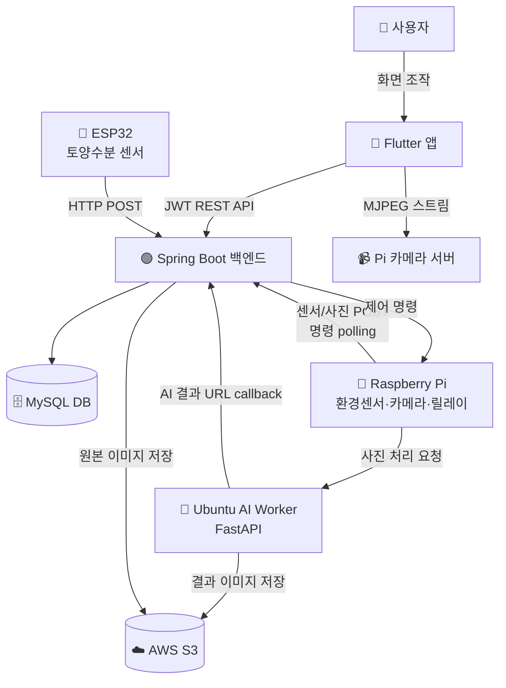

<div align="center">

# 🌱 GreenLink

### 앱 속 반려식물과 현실 식물을 연결하는 IoT 기반 식물 성장 서비스

**V2R (Virtual-to-Reality) Plant Growth Platform**

*One tap, visible change, real harvest.*

[](https://flutter.dev/)
[](https://spring.io/projects/spring-boot)
[](https://www.mysql.com/)
[](https://www.raspberrypi.com/)
[](https://www.espressif.com/)
[](https://openai.com/)
[](https://aws.amazon.com/)

</div>

---

## 📌 프로젝트 소개

**GreenLink**는 사용자가 앱에서 키우는 가상 반려식물을 실제 스마트팜의 식물과 연결하여, 앱 활동이 곧 실제 식물 관리로 이어지는 V2R(Virtual-to-Reality) 식물 성장 서비스입니다.

기존 식물 관리 앱은 시간 기반 알림에 그치지만, GreenLink는 앱에서의 행동(물주기·조명 제어)이 IoT 장치를 통해 실제 식물에 반영되고, 센서·카메라가 그 결과를 다시 앱으로 전달하는 **폐루프(Closed Loop) 경험**을 제공합니다.

> 2026년 봄학기 캡스톤 디자인 2 프로젝트
> 참여기업체: **필로** | 지도교수: **김세진 교수님**

---

## 🎯 해결하고자 한 문제

설문 조사 결과 식물 재배를 지속하지 못하는 주요 이유는 다음과 같았습니다.

| 비율 | 이유 |
|---|---|
| **63.3%** | 관리가 힘들어서 |
| **56.3%** | 식물이 시들어서 |
| **22.6%** | 벌레나 해충 때문 |

기존 솔루션은 다음 한계가 있습니다.

- 📱 **식물 관리 앱** (Greg, Planta, PictureThis): 단순 알림 위주, 실제 식물 상태 미반영
- 🪴 **스마트 식물재배기** (Click & Grow, LG 틔운): 정해진 식물·재배 방식 고정
- 🌾 **원격 스마트팜** (Infarm, 자람): B2B 중심, 개인 사용자 접근 어려움

GreenLink는 **앱 활동 기반 참여 + IoT 기반 실제 관리 + 센서·사진 기반 피드백**을 결합한 **V2R 반려식물 성장 서비스**를 지향합니다.

---

## ✨ 주요 기능

### 🌿 앱 / 식물 관리
- 회원가입·로그인 (이메일, Kakao·Google OAuth)
- 씨앗 사용을 통한 내 식물 생성, 별명 설정, 수확
- 식물 성장 상태 조회 (날짜 기준 GROWING / HARVESTABLE / HARVESTED)
- 인벤토리: 씨앗, 화분, 영양제 보유 및 사용
- 화분 장착 (식물당 1개, 자동 교체)
- 수확 도감 (전체 식물 종 대비 수확 이력)

### 🎮 참여 유도 (게임화)
- 출석 체크 및 연속 출석(streak) 기록
- 일간 / 주간 / 월간 / 업적 퀘스트
- 퀘스트 진행도 자동 추적 (출석·수확 등 이벤트 연동)
- 보상 아이템 자동 지급

### 🌡️ IoT 센서 / 모니터링
- **ESP32 토양수분 센서**: 식물별 토양 수분 % 측정 및 자동 업로드
- **Raspberry Pi 환경 센서**: 온도·습도(DHT22), 조도(BH1750) 측정
- **실시간 MJPEG 영상 스트림**: 식물별 crop 영상 제공

### 💧 원격 제어 / 자동화
- 앱에서 수동 물주기·조명 제어 명령 전송
- Raspberry Pi 릴레이를 통한 LED·펌프 실제 제어
- 센서값 기반 자동 물주기·조명 판단 (AutomationService)
- 데이터 기반 자동화 임계치 학습 (AutomationLearningService)

### 🎨 AI 이미지 변환
- Raspberry Pi 카메라로 실제 식물 사진 촬영
- OpenAI Images API + rembg 기반 배경·화분 제거
- 앱 스타일 일러스트로 변환 후 S3 저장
- 앱에서 변환된 이미지 표시

### 🛠️ 관리자
- Thymeleaf 기반 Admin Dashboard
- 사용자·식물·아이템·퀘스트·IoT 장치 관리

---

## 🏗️ 시스템 아키텍처



### 데이터 흐름

| 흐름 | 경로 |
|---|---|
| **제어 요청** | Flutter → Spring Boot → Raspberry Pi → Relay → Pump/LED |
| **센서 데이터** | ESP32/RPi Sensors → Spring Boot → MySQL → Flutter |
| **AI 이미지** | RPi Camera → Spring Boot → Ubuntu AI → OpenAI API → S3 → Flutter |

---

## 🛠️ 기술 스택

<table>
<tr>
<td valign="top" width="50%">

### Frontend
- **Flutter** (Dart `^3.9.2`)
- Material UI
- `http`, `shared_preferences`
- Kakao Flutter SDK
- Google Sign-In

### Backend
- **Spring Boot 4.0.6** (Java 17)
- Spring Security + JWT(jjwt)
- Spring Data JPA
- AWS SDK S3
- Thymeleaf (관리자 화면)
- OAuth2 (Kakao / Google)

### Database
- **MySQL**
- Soft delete 기반 관리
- ddl-auto: update

</td>
<td valign="top" width="50%">

### IoT Devices
- **ESP32** + PlatformIO Arduino
  - 토양수분 ADC (GPIO 34)
- **Raspberry Pi**
  - DHT22 (GPIO 4), BH1750 (I2C 0x23)
  - 릴레이 (GPIO 22, 23, 27)
  - Pi Camera (MJPEG)
- Active-LOW 릴레이 회로

### AI / Image
- **Python 3.11**
- FastAPI (AI Worker API)
- OpenAI Images API
- rembg (배경 제거)
- PIL, NumPy

### Infrastructure
- **AWS Lightsail / S3**
- Nginx + HTTPS
- Cloudflare

</td>
</tr>
</table>

---

## 📂 프로젝트 구조

본 저장소는 **5개 모듈을 단일 모노레포(monorepo)** 로 관리합니다. 각 모듈은 독립적으로 빌드·실행 가능합니다.

```text
greenlink/
├── greenlink_back/      # Spring Boot 백엔드 (REST API, 인증, JPA, 관리자 웹)
├── greenlink_front/     # Flutter 앱 (사용자용 모바일 UI)
├── greenlink_esp/       # ESP32 펌웨어 (토양수분 센서)
├── greenlink_pi/        # Raspberry Pi (환경센서, 카메라, 릴레이 제어)
├── greenlink_ubuntu/    # Ubuntu AI Worker (FastAPI, OpenAI 이미지 변환)
└── docs/                # 기준 문서, 시스템 다이어그램, 판넬 자료
```

각 모듈별 상세 구조와 파일 역할은 `docs/` 폴더 내 다음 문서를 참고하세요.

- `PROJECT_OVERVIEW.md` — 전체 시스템 개요
- `BACKEND.md` — Spring Boot 백엔드
- `FRONTEND.md` — Flutter 앱
- `ESP.md` — ESP32 펌웨어
- `PI.md` — Raspberry Pi
- `UBUNTU_GREENLINK_AI.md` — AI Worker
- `API_SPECIFICATION.md` — REST API 명세
- `FUNCTIONAL_SPECIFICATION.md` — 기능 명세

---

## 🚀 실행 방법

> 실행 전, 각 모듈에서 필요한 환경 변수(JWT secret, DB 접속, S3 자격증명, OAuth 키, OpenAI API 키, 장치 키 등)를 **외부 설정**으로 주입해야 합니다. 저장소에는 민감 정보가 포함되어 있지 않습니다.

### 1. Backend (Spring Boot)

```bash
cd greenlink_back
./gradlew bootRun       # 개발 서버 실행
./gradlew test          # 테스트
./gradlew build         # JAR 빌드
```

**필요 설정**: MySQL 접속 정보, JWT secret, AWS S3 자격증명, OAuth 클라이언트 설정

### 2. Frontend (Flutter)

```bash
cd greenlink_front
flutter pub get
flutter run             # 디바이스/에뮬레이터 실행
flutter build apk       # Android 빌드
flutter build ios       # iOS 빌드
```

**필요 설정**: API base URL, 카메라 스트림 URL, Kakao/Google OAuth 설정

### 3. ESP32 (PlatformIO)

```bash
cd greenlink_esp
pio run                 # 빌드
pio run -t upload       # 보드에 업로드
pio device monitor      # 시리얼 모니터
```

**필요 설정**: Wi-Fi SSID/비밀번호, 서버 endpoint, 장치 키

### 4. Raspberry Pi

```bash
cd greenlink_pi
python3 -m venv .venv
source .venv/bin/activate
# 필요 패키지 설치 (RPi.GPIO, picamera2, adafruit_dht 등)

# 센서 측정 및 업로드
python3 sensor_main.py

# 카메라 MJPEG 스트림 서버
python3 stream_server.py

# 명령 폴링 및 펌프/LED 제어 워커
python3 command_worker.py
```

**필요 설정**: 서버 endpoint, 장치 키, GPIO 핀 매핑(`config.py`)

### 5. Ubuntu AI Worker (FastAPI)

```bash
cd greenlink_ubuntu
python3.11 -m venv .venv
source .venv/bin/activate
pip install fastapi uvicorn rembg pillow numpy openai boto3

uvicorn ai_worker_api:app --host 0.0.0.0 --port 8000
```

**필요 설정**: OpenAI API key, AWS S3 자격증명, Backend callback URL

---

## 📊 구현 현황

| 구분 | 상태 | 비고 |
|---|---|---|
| 회원가입 / 로그인 (일반·OAuth) | ✅ 구현 완료 | Kakao·Google 포함 |
| 식물 등록 / 성장 / 수확 | ✅ 구현 완료 | 날짜 기준 상태 전환 |
| 인벤토리 / 화분 장착 / 영양제 | ✅ 구현 완료 | |
| 출석 / 퀘스트 / 도감 | ✅ 구현 완료 | ATTEND·HARVEST 자동 연동 |
| ESP32 토양수분 측정 | ✅ 구현 완료 | 10분 주기 |
| Pi 환경 센서 / 카메라 스트림 | ✅ 구현 완료 | DHT22, BH1750, MJPEG |
| 수동 / 자동 물주기 · 조명 | ✅ 구현 완료 | DeviceCommand 기반 |
| AI 이미지 변환 (OpenAI + rembg) | ✅ 구현 완료 | S3 저장 |
| Admin Dashboard | ✅ 구현 완료 | Thymeleaf 기반 |
| Nginx + HTTPS 배포 | ✅ 구현 완료 | AWS Lightsail |

---

## 🏆 차별점

| 기능 영역 | 식물 관리 앱 | 스마트 재배기 | 원격 스마트팜 | **GreenLink** |
|---|:---:|:---:|:---:|:---:|
| 식물 등록 / 도감 | ◯ | ◯ | △ | **◯** |
| 실제 재배기 연동 | ✕ | ◯ | ◯ | **◯** |
| 센서 데이터 확인 | ✕ | △ | △ | **◯** |
| 앱에서 원격 제어 | ✕ | △ | △ | **◯** |
| 앱 활동 ↔ 실제 연동 | ✕ | △ | ✕ | **◯** |
| 퀘스트 / 아이템 게임화 | △ | ✕ | ✕ | **◯** |
| 반려식물 성장 경험 | ◯ | △ | ✕ | **◯** |

---

## 👥 팀

| 이름 | GitHub |
|---|---|
| **안광은** | [@Age-Code](https://github.com/Age-Code) |
| **김민제** | — |

**지도교수**: 김세진 교수님
**참여기업체**: 필로

---

## 📄 문서

자세한 기술 문서는 `docs/` 폴더를 참고하세요.

- 📐 [시스템 개요](./docs/PROJECT_OVERVIEW.md)
- 🟢 [백엔드 분석](./docs/BACKEND.md)
- 📱 [프론트엔드 분석](./docs/FRONTEND.md)
- 🔌 [ESP32 펌웨어](./docs/ESP.md)
- 🍓 [Raspberry Pi](./docs/PI.md)
- 🐧 [AI Worker](./docs/UBUNTU_GREENLINK_AI.md)
- 🔗 [API 명세](./docs/API_SPECIFICATION.md)
- 📋 [기능 명세](./docs/FUNCTIONAL_SPECIFICATION.md)

---

<div align="center">

**🌱 GreenLink — 앱 활동이 실제 식물 관리로 이어지는 V2R 반려식물 성장 서비스**

2026 봄학기 캡스톤 디자인 2

</div>
