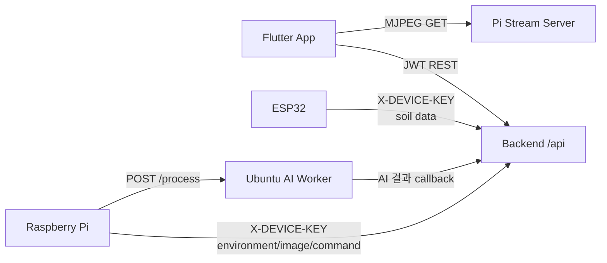
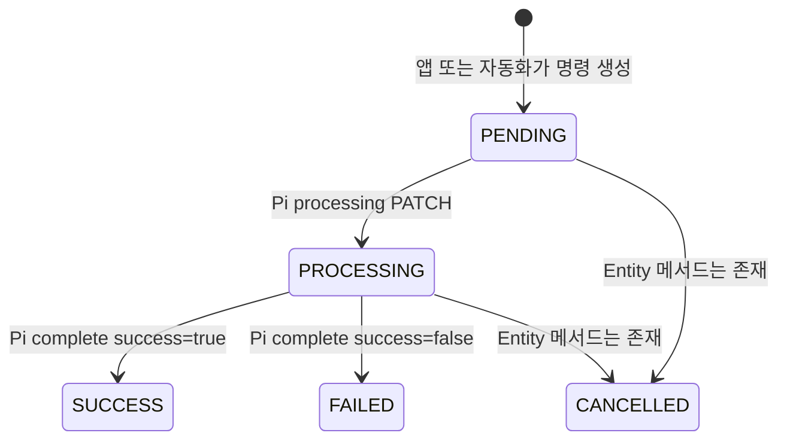
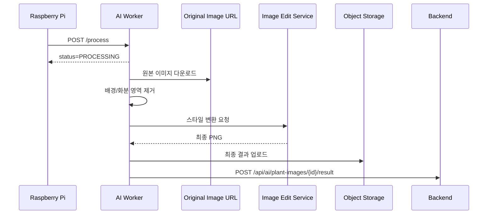

# GreenLink API 명세서

## 1. 문서 목적과 기준

이 문서는 GreenLink 소스 코드에 현재 구현되어 있는 HTTP 인터페이스를 기준으로 작성한 API 명세서입니다. 주요 근거는 다음 파일군입니다.

| 영역 | 확인 근거 |
| --- | --- |
| Backend REST API | `greenlink_back/src/main/java/com/greenlink/greenlink/controller/**` |
| Backend 요청/응답 구조 | `greenlink_back/src/main/java/com/greenlink/greenlink/dto/**` |
| 인증/접근 정책 | `SecurityConfig.java`, `JwtAuthenticationFilter.java`, `IotDeviceDataService.java`, `IotCommandService.java` |
| Flutter 호출 계약 | `greenlink_front/lib/core/constants/api_paths.dart`, `lib/services/**` |
| Pi 장치 호출 계약 | `greenlink_pi/api_client.py`, `sensor_uploader.py`, `uploader.py`, `ai_trigger.py` |
| AI Worker API | `greenlink_ubuntu/ai_worker_api.py`, `process_one.py` |
| 영상 Stream API | `greenlink_pi/stream_server.py` |

문서의 endpoint는 경로만 표기합니다. 코드에 포함된 외부 서버 주소, 장치 키, JWT 설정, 앱/OAuth 키 및 클라우드 자격 증명 값은 의도적으로 기록하지 않습니다.

## 2. API 구성 개요



| 제공 서버 | 주 소비자 | 인터페이스 성격 |
| --- | --- | --- |
| Spring Backend | Flutter, ESP, Pi, AI worker, Admin | JSON REST API, multipart upload, 관리자 HTML |
| Raspberry Pi Stream Server | Flutter, 현장 확인자 | MJPEG stream 및 health |
| Ubuntu AI Worker | Raspberry Pi | FastAPI JSON 작업 접수 |

## 3. Backend 공통 규약

### 3.1 Base Path와 Content Type

| 항목 | 규약 |
| --- | --- |
| Backend API base path | `/api` |
| 일반 요청/응답 | `application/json` |
| 식물 원본 이미지 업로드 | `multipart/form-data` |
| 관리자 웹 | `/admin/**`, HTML/redirect |
| 날짜시간 DTO 타입 | `LocalDateTime`, ISO date-time 문자열로 전송되는 구조 |
| 날짜 DTO 타입 | `LocalDate`, ISO date 문자열로 전송되는 구조 |
| 시간 DTO 타입 | `LocalTime`, 시간 문자열로 전송되는 구조 |

### 3.2 공통 성공 응답

Backend REST Controller는 `ApiResponse<T>`를 사용합니다.

```json
{
  "success": true,
  "message": "처리 결과 메시지",
  "data": {}
}
```

| 필드 | 타입 | 설명 |
| --- | --- | --- |
| `success` | boolean | 성공 응답은 `true` |
| `message` | string | Controller가 지정한 사용자 메시지 |
| `data` | object, array 또는 null | endpoint별 결과 DTO |

### 3.3 공통 오류 응답

`GlobalExceptionHandler`가 처리하는 REST 오류의 기본 형태는 다음과 같습니다.

```json
{
  "success": false,
  "message": "오류 메시지",
  "data": null
}
```

| HTTP Status | 발생 조건 | 코드상 처리 |
| --- | --- | --- |
| `400 Bad Request` | 잘못된 ID/인자, DTO validation 실패, 필수 헤더/파라미터 누락, enum/type 변환 실패 | `IllegalArgumentException`, validation 및 binding handler |
| `409 Conflict` | 현재 상태에서 불가능한 수행: 중복 출석, 진행 중 명령 충돌, 잘못된 아이템 상태 등 | `IllegalStateException` |
| `401 Unauthorized` | 인증 미충족 | Security authentication entry point 또는 exception handler |
| `403 Forbidden` | 권한 부족 | Security access denied handler 또는 exception handler |
| `405 Method Not Allowed` | 미지원 HTTP method | handler |
| `500 Internal Server Error` | 처리되지 않은 예외 | handler |

Spring Security 필터가 인증을 먼저 거부하는 경우 `sendError`를 사용하므로, 인증/인가 실패 응답 본문이 항상 `ApiResponse` JSON이라는 보장은 코드상 확인되지 않습니다.

### 3.4 인증 방식

| 인증 유형 | 전달 방식 | 적용 endpoint | 코드상 특성 |
| --- | --- | --- | --- |
| 사용자 JWT | `Authorization: Bearer <access-token>` 또는 지정 쿠키 | 사용자 소유 데이터, IoT 앱 기능, 자동화, 구성 API | Stateless SecurityContext 인증 |
| 관리자 JWT 권한 | JWT 내 ADMIN role | `/api/admin/**`, `/admin/**` | `/admin/login`만 공개 |
| 장치 키 | `X-DEVICE-KEY: <device-key>` | Pi/ESP 업로드 및 Pi 명령 처리 | Security는 공개 허용하고 Service가 활성 장치 키 검사 |
| AI worker callback | `X-AI-Worker-Secret: <secret>` | `/api/ai/**` | Security는 공개 허용하고 MVC Interceptor가 shared secret 검사 |

### 3.5 공개 / 보호 API 정책

| 접근 정책 | 경로 |
| --- | --- |
| 공개 | `/api/auth/signup`, `/api/auth/login`, `/api/auth/oauth/kakao`, `/api/auth/oauth/google` |
| 공개 마스터 조회 | `/api/plants/**`, `/api/items/**`, `/api/quests/**` |
| 공개 라우팅 후 장치 키 검증 | `/api/iot/raspberry/**`, `/api/iot/esp/**`, `/api/iot/commands/**`, `/api/iot/plant-images` |
| 공개 라우팅 후 AI worker secret 검증 | `/api/ai/**` |
| ADMIN 전용 | `/api/admin/**`, 로그인 화면 외 `/admin/**` |
| JWT 사용자 인증 필요 | 위 경로를 제외한 `/api/**` |

## 4. 주요 Enum 값

| 분류 | 코드상 값 | 사용 API |
| --- | --- | --- |
| `UserPlantStatus` | `GROWING`, `HARVESTABLE`, `HARVESTED` | 사용자 식물 필터/응답 |
| `ItemType` | `SEED`, `POT`, `NUTRIENT` | 아이템 조회/관리 |
| `UserItemStatus` | `OWNED`, `EQUIPPED`, `USED` | 보유 아이템 조회/처리 |
| `QuestType` | `DAILY`, `WEEKLY`, `MONTHLY`, `ACHIEVEMENT` | 퀘스트 필터/관리 |
| `ResetCycle` | `DAILY`, `WEEKLY`, `MONTHLY`, `NONE` | 퀘스트 관리 |
| `TargetType` | `ATTEND`, `WATERING`, `GROW_PLANT`, `HARVEST` | 퀘스트 목표 |
| `DeviceType` | `RASPBERRY_PI`, `ESP32` | 장치 등록 |
| `CommandType` | `WATER`, `LIGHT_ON`, `LIGHT_OFF` | 장치 명령 |
| `CommandStatus` | `PENDING`, `PROCESSING`, `SUCCESS`, `FAILED`, `CANCELLED` | 명령 상태 |
| `AutomationDecisionMode` | `RULE_BASED`, `LEARNING_BASED`, `HYBRID` | 자동화 설정 |
| `AutomationModelStatus` | `INSUFFICIENT_DATA`, `READY`, `FAILED` | 자동화 모델 |

Pi 코드에는 `SENSOR_REFRESH` 명령 처리 분기가 있으나 Backend `CommandType`에는 해당 enum 값과 명령 생성 API가 없습니다.

## 5. Backend Endpoint 전체 목록

### 5.1 인증, 사용자, 홈 및 공개 마스터

| Method | URL | 인증 | 역할 | Request | Response Data |
| --- | --- | --- | --- | --- | --- |
| POST | `/api/auth/signup` | 공개 | 일반 회원가입 | `SignupReqDto` | `SignupResDto` |
| POST | `/api/auth/login` | 공개 | 일반 로그인 | `LoginReqDto` | `LoginResDto` |
| POST | `/api/auth/oauth/kakao` | 공개 | Kakao OAuth 로그인 | `OAuthLoginReqDto` | `LoginResDto` |
| POST | `/api/auth/oauth/google` | 공개 | Google OAuth 로그인 | `OAuthLoginReqDto` | `LoginResDto` |
| GET | `/api/users/me` | JWT | 내 사용자 정보 | 없음 | `MeResDto` |
| PATCH | `/api/users/me` | JWT | 닉네임 수정 | `UpdateNicknameReqDto` | `UpdateNicknameResDto` |
| GET | `/api/home` | JWT | 홈 대표 데이터 | 없음 | `HomeDto.ResDto` |
| GET | `/api/plants` | 공개 | 식물 마스터 목록 | 없음 | `PlantDto.ListResDto[]` |
| GET | `/api/plants/{plantId}` | 공개 | 식물 상세 | Path ID | `PlantDto.DetailResDto` |
| GET | `/api/items` | 공개 | 아이템 마스터 목록 | Query `itemType?` | `ItemDto.ListResDto[]` |
| GET | `/api/items/{itemId}` | 공개 | 아이템 상세 | Path ID | `ItemDto.DetailResDto` |
| GET | `/api/quests` | 공개 | 퀘스트 마스터 목록 | Query `questType?` | `QuestDto.ListResDto[]` |
| GET | `/api/quests/{questId}` | 공개 | 퀘스트 상세 | Path ID | `QuestDto.DetailResDto` |

### 5.2 사용자 육성 기능

| Method | URL | 인증 | 역할 | Request / Query | Response Data |
| --- | --- | --- | --- | --- | --- |
| POST | `/api/user-plants` | JWT | 씨앗으로 식재 | `CreateReqDto` | `CreateResDto` |
| GET | `/api/user-plants` | JWT | 내 식물 목록 | `status?` | `ListResDto[]` |
| GET | `/api/user-plants/{userPlantId}` | JWT | 내 식물 상세 | Path ID | `DetailResDto` |
| PATCH | `/api/user-plants/{userPlantId}` | JWT | 식물 별명 변경 | `UpdateNicknameReqDto` | `UpdateNicknameResDto` |
| POST | `/api/user-plants/{userPlantId}/harvest` | JWT | 식물 수확 | 없음 | `HarvestResDto` |
| GET | `/api/user-items` | JWT | 보유 아이템 조회 | `itemType?`, `status?` | `UserItemDto.ListResDto[]` |
| POST | `/api/user-items/{userItemId}/equip-pot` | JWT | 화분 장착 | `EquipPotReqDto` | `EquipPotResDto` |
| POST | `/api/user-items/{userItemId}/unequip-pot` | JWT | 화분 해제 | 없음 | `UnequipPotResDto` |
| POST | `/api/user-items/{userItemId}/use-nutrient` | JWT | 영양제 사용 | `UseNutrientReqDto` | `UseNutrientResDto` |
| GET | `/api/user-quests` | JWT | 현재 사용자 퀘스트 목록 | `questType?`, `status?` | `UserQuestListResDto[]` |
| GET | `/api/user-quests/{userQuestId}` | JWT | 사용자 퀘스트 상세 | Path ID | `UserQuestDetailResDto` |
| POST | `/api/user-quests/{userQuestId}/reward` | JWT | 달성 보상 수령 | 없음 | `UserQuestRewardResDto` |
| POST | `/api/attends/today` | JWT | 오늘 출석 | 없음 | `AttendTodayResDto` |
| GET | `/api/attends` | JWT | 월별 출석 조회 | `year?`, `month?` | `AttendMonthResDto` |
| GET | `/api/collections` | JWT | 수확 도감 목록 | 없음 | `CollectionDto.ListResDto[]` |
| GET | `/api/collections/{plantId}` | JWT | 도감 상세 | Path ID | `CollectionDto.DetailResDto` |

### 5.3 앱용 IoT 및 자동화

| Method | URL | 인증 | 역할 | Request | Response Data |
| --- | --- | --- | --- | --- | --- |
| GET | `/api/user-plants/{userPlantId}/iot/latest` | JWT | 최신 센서/이미지 조회 | 없음 | `IotLatestResDto` |
| GET | `/api/user-plants/{userPlantId}/iot/images` | JWT | 식물 이미지 이력 조회 | 없음 | `PlantImageDto[]` |
| POST | `/api/user-plants/{userPlantId}/iot/water` | JWT | 수동 급수 명령 생성 | body 없음 | `WaterCommandResDto` |
| POST | `/api/user-plants/{userPlantId}/iot/light/on` | JWT | 수동 조명 켜기 명령 생성 | body 없음 | `LightCommandResDto` |
| POST | `/api/user-plants/{userPlantId}/iot/light/off` | JWT | 수동 조명 끄기 명령 생성 | body 없음 | `LightCommandResDto` |
| GET | `/api/user-plants/{userPlantId}/automation` | JWT | 자동화 설정 조회/기본 생성 | 없음 | `SettingResDto` |
| PATCH | `/api/user-plants/{userPlantId}/automation` | JWT | 자동화 설정 부분 수정 | `UpdateSettingReqDto` | `SettingResDto` |
| GET | `/api/user-plants/{userPlantId}/automation/logs` | JWT | 최근 자동화 로그 최대 30개 조회 | 없음 | `LogResDto[]` |
| POST | `/api/user-plants/{userPlantId}/automation/train` | JWT | 최근 데이터 기반 모델 산출 | 없음 | `ModelResDto` |
| GET | `/api/user-plants/{userPlantId}/automation/model` | JWT | 최신 모델 조회 | 없음 | `ModelResDto` |

### 5.4 장치 수집 및 명령 API

| Method | URL | 인증 | 역할 | Request | Response Data |
| --- | --- | --- | --- | --- | --- |
| POST | `/api/iot/raspberry/environment` | 장치 키 | Pi 온도/습도/조도 저장 | `RaspberryEnvironmentReqDto` | `RaspberryEnvironmentResDto` |
| POST | `/api/iot/esp/soil-moisture` | 장치 키 | ESP 토양수분 저장 | `EspSoilMoistureReqDto` | `EspSoilMoistureResDto` |
| POST | `/api/iot/plant-images` | 장치 키 | Pi 이미지 저장 | multipart | `PlantImageUploadResDto` |
| GET | `/api/iot/commands/pending` | 장치 키 | Pi 대기 명령 조회 | 없음 | `PendingCommandResDto[]` |
| PATCH | `/api/iot/commands/{commandId}/processing` | 장치 키 | Pi 명령 실행 시작 보고 | 없음 | `CommandProcessingResDto` |
| PATCH | `/api/iot/commands/{commandId}/complete` | 장치 키 | Pi 명령 완료/실패 보고 | `CommandCompleteReqDto` | `CommandCompleteResDto` |

### 5.5 IoT 구성, AI 결과 및 관리자 REST

| Method | URL | 인증 | 역할 | Request | Response Data |
| --- | --- | --- | --- | --- | --- |
| POST | `/api/iot/grow-spaces` | JWT | 재배 공간 생성 | `GrowSpaceCreateReqDto` | `GrowSpaceResDto` |
| GET | `/api/iot/grow-spaces` | JWT | 재배 공간 목록 | 없음 | `GrowSpaceResDto[]` |
| POST | `/api/iot/grow-spaces/{growSpaceId}/plants` | JWT | 내 식물 공간 연결 | `ConnectPlantReqDto` | `GrowSpacePlantResDto` |
| GET | `/api/iot/grow-spaces/{growSpaceId}/plants` | JWT | 공간 내 식물 목록 | 없음 | `GrowSpacePlantResDto[]` |
| POST | `/api/iot/devices` | JWT | 장치 등록 | `DeviceCreateReqDto` | `DeviceResDto` |
| GET | `/api/iot/devices` | JWT | 전체 장치 목록 | 없음 | `DeviceResDto[]` |
| POST | `/api/iot/pump-channels` | JWT | 펌프 채널 등록 | `PumpChannelCreateReqDto` | `PumpChannelResDto` |
| GET | `/api/iot/pump-channels` | JWT | 전체 펌프 채널 목록 | 없음 | `PumpChannelResDto[]` |
| POST | `/api/ai/plant-images/{plantImageId}/result` | 공개 | AI 결과 URL 등록 | `SaveAiImageReqDto` | `AiImageResDto` |
| POST | `/api/admin/plants` | ADMIN | 식물 마스터 생성 | `CreatePlantReqDto` | `PlantResDto` |
| POST | `/api/admin/items` | ADMIN | 아이템 마스터 생성 | `CreateItemReqDto` | `ItemResDto` |
| POST | `/api/admin/quests` | ADMIN | 퀘스트 마스터 생성 | `CreateQuestReqDto` | `QuestResDto` |

## 6. Endpoint별 데이터 명세

### 6.1 인증 API

#### `POST /api/auth/signup`

| 구분 | 필드 | 타입 | 필수 | 검증 / 설명 |
| --- | --- | --- | --- | --- |
| Request | `email` | string | O | 빈 값 불가, email 형식 |
| Request | `password` | string | O | 빈 값 불가, 최소 4자 |
| Request | `nickname` | string | O | 빈 값 불가, 최대 50자 |
| Response | `userId` | number | - | 생성된 사용자 ID |
| Response | `email` | string | - | 가입 이메일 |
| Response | `nickname` | string | - | 가입 닉네임 |
| Response | `grantedItems[]` | array | - | 초기 지급된 아이템 목록 |

초기 지급에는 코드에서 지정한 기본 씨앗과 기본 화분 마스터 데이터가 필요합니다. 해당 마스터가 없으면 `409` 상태 오류가 발생합니다.

#### `POST /api/auth/login`, `POST /api/auth/oauth/{provider}`

| API | Request Fields | Response Fields | 비고 |
| --- | --- | --- | --- |
| 일반 로그인 | `email`, `password` | `accessToken`, `user{userId,email,nickname,role}` | BCrypt 검증 후 JWT 발급 |
| OAuth 로그인 | `code`, `redirectUri` | `accessToken`, `user{...}` | provider 사용자 조회/신규 등록 후 JWT 발급 |

OAuth 요청 DTO에는 validation annotation이 확인되지 않습니다. 실제 provider 연동 성공을 위해 별도 설정값이 필요합니다.

### 6.2 사용자, 홈, 마스터 조회

| Endpoint | Request | 핵심 Response Fields | 처리 규칙 |
| --- | --- | --- | --- |
| `GET /api/users/me` | 없음 | `userId`, `email`, `nickname`, `role`, `createdAt` | 로그인 사용자 조회 |
| `PATCH /api/users/me` | `nickname` 필수, 최대 50자 | `userId`, `nickname` | 닉네임 수정 |
| `GET /api/home` | 없음 | `user`, `mainUserPlant` | 성장/수확가능 최신 식물 우선, 없으면 최신 식물 |
| `GET /api/plants` | 없음 | `plantId`, `name`, `category`, `imageUrl` | 공개 조회 |
| `GET /api/plants/{id}` | path ID | 목록 필드 + `description`, `growthDays` | 공개 조회 |
| `GET /api/items?itemType=` | 선택 enum | `itemId`, `name`, `itemType`, `imageUrl` | 공개 조회 |
| `GET /api/items/{id}` | path ID | 목록 필드 + `description`, `linkedPlantId` | 공개 조회 |
| `GET /api/quests?questType=` | 선택 enum | 목표/반복/활성 필드 | 공개 조회 |
| `GET /api/quests/{id}` | path ID | 설명, 보상 아이템, 수량 포함 | 공개 조회 |

### 6.3 식재와 아이템

#### 사용자 식물 요청/응답

| Endpoint | Request 또는 Query | 주요 Response Fields | 비즈니스 검증 |
| --- | --- | --- | --- |
| `POST /api/user-plants` | `userItemId` 필수, `nickname` 최대 50자 | `userPlantId`, `plantId`, `plantName`, `status`, `plantedAt`, `expectedHarvestableAt` | OWNED 상태 SEED이며 연결 Plant가 있어야 함; 씨앗은 사용 처리 |
| `GET /api/user-plants` | `status?` | 식물 ID/상태/경과일/남은일/이미지 | 조회 시 수확 가능 상태 갱신 |
| `GET /api/user-plants/{id}` | 없음 | 상세 + `equippedPot` | 소유 식물만 조회 |
| `PATCH /api/user-plants/{id}` | `nickname` 최대 50자 | `userPlantId`, `nickname` | 소유 식물만 수정 |
| `POST /api/user-plants/{id}/harvest` | 없음 | 식물/상태/수확시각 | 수확 가능 날짜여야 함; HARVEST 퀘스트 진행 증가 |

#### 보유 아이템 요청/응답

| Endpoint | Request 또는 Query | 주요 Response Fields | 비즈니스 검증 |
| --- | --- | --- | --- |
| `GET /api/user-items` | `itemType?`, `status?` | 아이템별 count와 내부 `items[]` | 같은 마스터 아이템을 그룹화 |
| `POST /api/user-items/{id}/equip-pot` | `userPlantId` 필수 | 장착 아이템/식물/상태 | OWNED POT만 장착; 기존 장착 화분 해제 |
| `POST /api/user-items/{id}/unequip-pot` | 없음 | 아이템 상태/식물 ID | EQUIPPED POT만 해제 |
| `POST /api/user-items/{id}/use-nutrient` | `userPlantId` 필수 | 아이템/상태/식물 ID | OWNED NUTRIENT만 사용 |

### 6.4 퀘스트, 출석, 컬렉션

| Endpoint | Request | 주요 Response Fields | 비즈니스 규칙 |
| --- | --- | --- | --- |
| `GET /api/user-quests` | `questType?`, `status?` | 목표, 진행값, 상태, 기간 | 현재 기간 퀘스트를 필요 시 생성; 현재 기간 및 업적/무기한만 목록 표시 |
| `GET /api/user-quests/{id}` | path ID | 보상 포함 상세 | 이미 아는 과거 ID의 상세 조회 허용 |
| `POST /api/user-quests/{id}/reward` | 없음 | 완료 상태, 보상, 생성된 user item | `ACHIEVABLE`이고 현재 표시 가능한 퀘스트만 보상 |
| `POST /api/attends/today` | 없음 | `attendId`, `attendDate`, `streakCount` | 하루 1회, 어제 출석 기준 streak 계산, ATTEND 진행 증가 |
| `GET /api/attends` | `year`와 `month` 모두 선택 또는 모두 생략 | 월/총출석/current streak/일자 배열 | 하나만 전달하면 400 |
| `GET /api/collections` | 없음 | plant별 `collected`, `harvestCount`, 최초 수확시각 | 마스터 식물과 수확 이력 결합 |
| `GET /api/collections/{plantId}` | path ID | 상세와 `harvestedPlants[]` | 사용자의 수확 이력만 포함 |

### 6.5 앱 IoT API

#### `GET /api/user-plants/{userPlantId}/iot/latest`

| Response Object | Fields | 출처 |
| --- | --- | --- |
| root | `userPlantId` | 사용자 소유 식물 |
| `growSpace` | `growSpaceId`, `name` | 활성 공간 연결 |
| `environment` | `sensorDataId`, `temperature`, `humidity`, `light`, `measuredAt` | 공간별 최신 Pi 기록 |
| `soil` | `sensorDataId`, `soilMoistureRaw`, `soilMoisturePercent`, `measuredAt` | 식물별 최신 ESP 기록 |
| `latestImage` | `plantImageId`, `imageUrl`, `aiImageUrl`, `capturedAt` | 식물 사진 우선, 없으면 공간 최신 사진 fallback |

식물이 재배 공간과 연결되어 있지 않으면 처리할 수 없습니다. 환경, 토양, 이미지 자체가 아직 없으면 각각 `null`이 될 수 있습니다.

#### 제어 명령 API

| Endpoint | Request | Response Fields | 생성 조건 |
| --- | --- | --- | --- |
| `POST .../iot/water` | body 없음 | `commandId`, 식물/공간/장치/펌프 ID, `commandType`, `commandStatus`, `durationSeconds`, `requestedAt` | 활성 펌프 채널과 Pi 필요, 진행 중 WATER 없음 |
| `POST .../iot/light/on` | body 없음 | `commandId`, 식물/공간/장치 ID, 상태, 요청시각 | 활성 Pi 필요, 진행 중 조명 명령 없음 |
| `POST .../iot/light/off` | body 없음 | 위와 동일 | 활성 Pi 필요, 진행 중 조명 명령 없음 |

`DeviceCommand`의 실행 코드상 급수 지속시간 기본값은 `1`초입니다. Controller/DTO 주석에 기록된 `5`초 설명과 일치하지 않습니다.

### 6.6 자동화 API

#### 설정 필드

| Field | 타입 | 기본값 | 수정 검증 |
| --- | --- | --- | --- |
| `autoWaterEnabled` | boolean | `false` | 선택 |
| `autoLightEnabled` | boolean | `false` | 선택 |
| `autoOptimizeEnabled` | boolean | `false` | 선택 |
| `decisionMode` | enum | `HYBRID` | 선택 |
| `minLearningDataCount` | integer | `30` | 1 이상 |
| `waterThresholdPercent` | double | `35.0` | 0~100 |
| `waterCooldownMinutes` | integer | `30` | 0 이상 |
| `lightOnThresholdLux` | double | `300.0` | 0 이상 |
| `lightOffThresholdLux` | double | `500.0` | 0 이상, 두 값이 같이 전달되면 ON보다 커야 함 |
| `lightStartTime` | time | `08:00` | 별도 형식 검증은 binding에 따름 |
| `lightEndTime` | time | `18:00` | 별도 형식 검증은 binding에 따름 |
| `lightCooldownMinutes` | integer | `10` | 0 이상 |

PATCH 요청에서 `null` 필드는 기존 값을 유지합니다. Flutter 모델의 `wateringSafetyEnabled` 필드는 Backend 요청/응답 DTO에 존재하지 않습니다.

#### 모델 및 로그 응답

| API | Response 주요 필드 | 의미 |
| --- | --- | --- |
| `GET .../automation/logs` | `automationType`, `triggerSensorType`, `triggerValue`, `thresholdValue`, `commandId`, `message`, `createdAt` | 최근 판단 30건 |
| `POST .../automation/train` | 추천 수분/조도 임계치, data count, water command count, 건조율/회복량, `confidenceScore`, `modelStatus`, 학습 기간 | 최근 14일 데이터로 모델 레코드 생성 |
| `GET .../automation/model` | 위 모델 필드 | 최신 학습 결과 조회; 모델 없으면 오류 |

### 6.7 장치 데이터/명령 API

#### 센서 전송 JSON

| Endpoint | Header | Request Fields | Optional 처리 | 저장 후 추가 동작 |
| --- | --- | --- | --- | --- |
| `POST /api/iot/raspberry/environment` | `X-DEVICE-KEY` 필수 | `temperature`, `humidity`, `light`, `measuredAt` | DTO에서 모두 nullable; 시각 null이면 서버 시각 저장 | 자동 조명 평가 |
| `POST /api/iot/esp/soil-moisture` | `X-DEVICE-KEY` 필수 | `soilMoistureRaw`, `soilMoisturePercent`, `measuredAt` | DTO에서 모두 nullable; 시각 null이면 서버 시각 저장 | 자동 급수 평가 |

Pi 환경 장치는 재배 공간에 연결된 `RASPBERRY_PI`여야 하며, ESP 장치는 대상 식물이 연결된 `ESP32`여야 합니다.

#### 이미지 업로드

| 구분 | 필드 | 필수 | 설명 |
| --- | --- | --- | --- |
| Header | `X-DEVICE-KEY` | O | 활성 Raspberry Pi 장치 식별 |
| multipart | `file` | O | 이미지 파일 |
| query/form param | `userPlantId` | 선택 | 제공하면 Pi 재배 공간에 연결된 식물이어야 함 |
| query/form param | `capturedAt` | 선택 | ISO date-time |
| response | `plantImageId`, `growSpaceId`, `userPlantId`, `deviceId`, `imageUrl`, `originalFilename`, `capturedAt` | - | 저장 결과 |

업로드 서비스는 이미지 MIME type, 최대 20MB, 확장자 `jpg`, `jpeg`, `png`, `webp`를 검사합니다.

#### 명령 polling 및 상태 전환



| Endpoint | Request | Response / 규칙 |
| --- | --- | --- |
| `GET /api/iot/commands/pending` | 장치 키 | 해당 Pi에 속한 PENDING 명령을 요청시각 오름차순 반환 |
| `PATCH /api/iot/commands/{id}/processing` | 장치 키 | PENDING만 PROCESSING으로 변경 |
| `PATCH /api/iot/commands/{id}/complete` | 장치 키, `success` 필수, `resultMessage?` | PROCESSING만 SUCCESS/FAILED 전환 |

대기 명령 응답에는 `commandId`, `commandType`, `durationSeconds`, `userPlantId`, `pumpChannel{pumpChannelId,gpioPin,relayChannel}`, `requestedAt`가 포함됩니다.

### 6.8 IoT 구성 API

| Endpoint | Request 주요 필드 | Response 주요 필드 | 검증 규칙 |
| --- | --- | --- | --- |
| `POST /api/iot/grow-spaces` | `name` 필수, `description?` | 공간 ID/이름/활성/생성시각 | 이름 중복 불가 |
| `POST /api/iot/grow-spaces/{id}/plants` | `userPlantId` 필수 | 공간-식물 연결 | 로그인 사용자 소유 식물, 중복 연결 불가 |
| `POST /api/iot/devices` | `deviceName`, `deviceType`, `deviceKey`, `growSpaceId?`, `userPlantId?` | 장치 및 연결 정보 | Pi는 공간 필수/특정식물 불가, ESP는 식물 필수 |
| `POST /api/iot/pump-channels` | 공간/식물/Pi ID, `channelName`, GPIO/relay 선택 | 채널/연결 정보 | 식물-공간 연결과 같은 공간 Pi 필요, 식물당 채널 1개 |

`DeviceResDto`와 `PumpChannelResDto`는 장치 인증 키를 응답하지 않습니다. 다만 목록 API는 코드 주석상 전체 데이터를 반환하므로 일반 JWT 사용자에게 장치 구성이 노출될 수 있습니다.

### 6.9 AI 결과 Callback

#### `POST /api/ai/plant-images/{plantImageId}/result`

| 구분 | Fields | 규칙 |
| --- | --- | --- |
| Request | `finalAiUrl` | Service에서 null/blank 거부 |
| Response | `aiPlantImageId`, `plantImageId`, `userPlantId`, `originalImageUrl`, `aiImageUrl`, `status`, `createdAt` | AI 이미지 레코드 저장 결과 |
| 전제 | 원본 `PlantImage`가 존재하고 `UserPlant`에 연결되어 있어야 함 | 공간 전용 이미지에는 결과 연결 불가 |
| 인증 | 별도 header/서명 검사 확인되지 않음 | 공개 경로 |

## 7. Admin Web Route

`AdminWebController`는 JSON REST API가 아니라 Thymeleaf HTML과 redirect를 제공합니다.

| Method | 경로 | 화면/처리 |
| --- | --- | --- |
| GET | `/admin/login` | 관리자 로그인 화면 |
| GET | `/admin`, `/admin/`, `/admin/index` | 관리자 대시보드 |
| GET | `/admin/users`, `/admin/users/{id}` | 사용자 목록/상세 |
| POST | `/admin/users/{id}/toggle-role` | 사용자 권한 전환 후 redirect |
| POST | `/admin/users/{id}/delete` | 사용자 soft delete 후 redirect |
| GET/POST | `/admin/plants`, `/admin/plants/new` | 식물 목록/등록 |
| GET/POST | `/admin/items`, `/admin/items/new` | 아이템 목록/등록 |
| GET/POST | `/admin/quests`, `/admin/quests/new` | 퀘스트 목록/등록 |
| GET/POST | `/admin/iot`, `/admin/iot/new` | IoT 장치 목록/등록 |

`SecurityConfig`는 form login을 비활성화했으며 Controller에는 관리자 로그인 POST 처리가 확인되지 않습니다. 따라서 로그인 HTML이 실제 관리자 인증을 완료하는 방법은 코드상 확인되지 않습니다.

## 8. Ubuntu AI Worker API

### 8.1 Endpoint

| Method | URL | 인증 | 역할 | Request | Response |
| --- | --- | --- | --- | --- | --- |
| GET | `/health` | 확인되지 않음 | Worker 생존 확인 | 없음 | `success`, `message` |
| POST | `/process` | 확인되지 않음 | 이미지 변환 작업 접수 | `ProcessRequest` | 처리 접수 데이터 |

### 8.2 `POST /process` 계약

| Field | 타입 | 필수 | 설명 |
| --- | --- | --- | --- |
| `plantImageId` | integer | O | Backend 원본 이미지 ID |
| `userPlantId` | integer/null | 선택 | 식물 ID, 응답/작업명에 활용 |
| `imageUrl` | string | O | 처리할 원본 이미지 URL |
| `name` | string/null | 선택 | 작업 파일명 prefix; 없으면 생성 |

```json
{
  "success": true,
  "message": "AI processing started",
  "data": {
    "plantImageId": 1,
    "userPlantId": 1,
    "imageUrl": "<original-image-url>",
    "name": "<job-name>",
    "status": "PROCESSING"
  }
}
```

이 응답은 결과 생성 완료가 아니라 FastAPI background task 접수 성공을 뜻합니다. 완료 상태 조회 API나 실패 callback API는 확인되지 않습니다.

### 8.3 Worker 내부 후속 호출



## 9. Raspberry Pi Stream API

| Method | URL | Response | 소비자 / 비고 |
| --- | --- | --- | --- |
| GET | `/` | HTML 안내 | 브라우저 확인용 |
| GET | `/health` | JSON 상태 및 stream 정보 | 상태 확인 |
| GET | `/stream.mjpg` | multipart MJPEG | 전체 화면, Pi snapshot 및 앱 기본 stream |
| GET | `/stream/sunflower.mjpg` | multipart MJPEG | crop stream |
| GET | `/stream/basil.mjpg` | multipart MJPEG | crop stream |

인증 또는 접근 제한 로직은 `stream_server.py`에서 확인되지 않습니다. 별도 배포 reverse proxy 설정은 코드상 확인되지 않습니다.

`camera_snapshot_main.py`가 요청하는 `/snapshot.jpg`는 위 서버 route에 구현되어 있지 않습니다.

## 10. Flutter와 API 계약 대조

| Flutter 호출/모델 | Backend 구현 상태 | 판정 |
| --- | --- | --- |
| 인증, 홈, 식물, 아이템, 컬렉션, 퀘스트, 출석 endpoint | 대응 Controller 확인 | 연결 가능 |
| IoT latest/water/light endpoint | 대응 Controller 확인 | 연결 가능 |
| 자동화 get/patch/train/model/logs | 대응 Controller 확인 | 연결 가능 |
| `/user-plants/{id}/iot/refresh` POST | Backend endpoint 및 `CommandType.SENSOR_REFRESH` 없음 | 미구현 계약 |
| `wateringSafetyEnabled` 자동화 설정 field | Backend DTO/Entity에 없음 | 필드 불일치 |
| 사용자 프로필 `/users/me` 경로 상수 | Backend 구현 있음 | 실제 화면/서비스 호출 사용 여부는 별도 확인 필요 |

## 11. 보안 및 계약상 주의사항

| 중요도 | 항목 | 코드 근거 | 조치 필요 |
| --- | --- | --- | --- |
| 중간 | 장치 구성 목록 권한 범위 | `IotSetupDto.DeviceResDto`, `PumpChannelResDto` | 응답 credential은 제거됨. 목록 권한 범위 제한 검토 |
| 높음 | AI callback 공개 라우팅 | `SecurityConfig`, `AiWorkerAuthInterceptor`, `AiPlantImageController` | `X-AI-Worker-Secret` 운영 secret 관리 및 회전 |
| 높음 | 장치 API는 raw 장치 키에 의존 | IoT Service | 키 해시/회전, HTTPS, rate limit |
| 높음 | Flutter 토큰 로그 출력 | `ApiClient` | 인증 token 로그 제거 |
| 중간 | IoT 구성 목록이 사용자 범위로 제한되지 않음 | `IotSetupService` 주석/조회 | 관리자 전용 또는 소유권 필터 적용 |
| 중간 | 급수 지속시간 문서/코드 불일치 | DTO/Controller 주석 대 Entity 상수 | 단일 계약으로 수정 |
| 중간 | 앱 sensor refresh 미구현 | Flutter 경로, Backend enum/controller | 기능 제거 또는 구현 |
| 중간 | Stream 인증 없음 | Pi Flask routes | 공개 범위 및 proxy 인증 확정 |

## 12. 정리 요약

GreenLink의 중심 API는 Spring Backend가 제공하며, Flutter는 JWT API를, ESP와 Pi는 장치 키 API를, Ubuntu AI Worker는 shared secret header 기반 callback API를 사용합니다. Pi는 별도의 MJPEG stream과 AI 작업 trigger 역할도 맡습니다.

운영 보안 측면에서는 장치 키 저장/회전 정책, secret 외부화, AI Worker `/process` 접근 통제가 핵심 확인 사항입니다.

## 13. 추가로 확인하면 좋은 점

* Backend에 OpenAPI/Swagger 스키마를 추가하여 DTO와 앱 모델의 계약을 자동 검증할지 여부.
* 사용자별 IoT 구성 조회 범위와 관리자/일반 사용자 권한 정책.
* 장치 인증 키를 API 응답에서 제거하고 배포 시 최초 provision만 지원하는 방식.
* AI 작업 처리 완료/실패 상태 조회 및 재시도 API의 필요 여부.
* Flutter의 refresh 및 자동화 safety 기능을 유지할지 제거할지에 대한 제품 결정.
