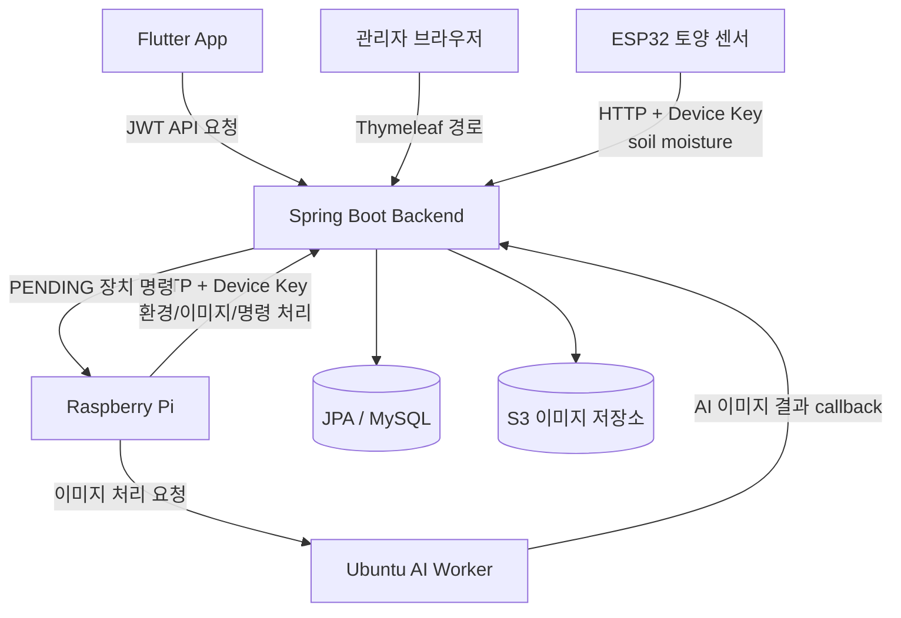
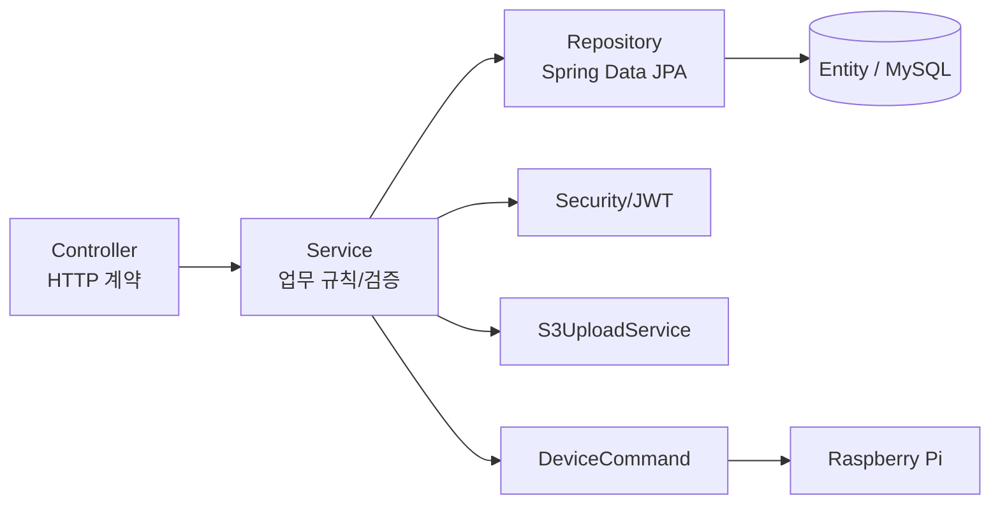
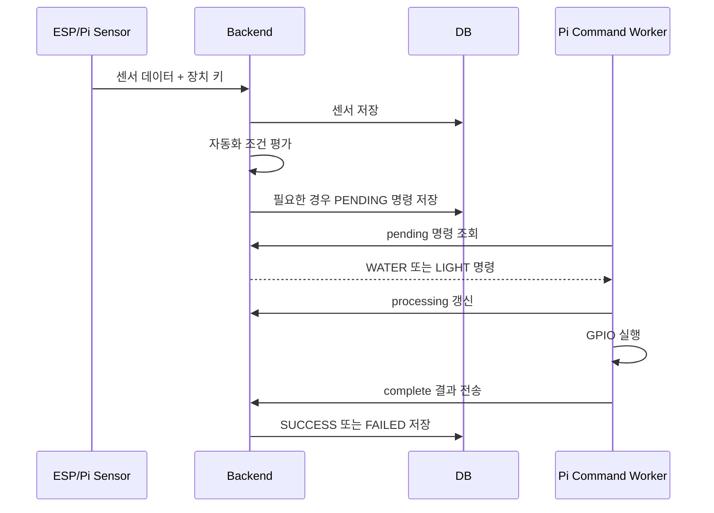

# Backend 코드 분석

## 분석 범위와 역할

`greenlink_back/`는 GreenLink의 중앙 API 서버입니다. 회원과 식물 육성 데이터를 관리하고, ESP 및 Raspberry Pi가 올리는 센서/이미지 데이터를 저장하며, 장치 제어 명령과 자동화 판단을 담당합니다. Ubuntu AI 작업자가 처리한 식물 이미지 결과도 이 서버에 다시 연결됩니다.

이 문서는 실제 Java 소스, Gradle 설정, 리소스 설정, 템플릿 및 테스트를 확인하여 작성했습니다. 비밀키, 장치 키, 외부 호스트 주소 등은 값 자체를 기록하지 않습니다.

## 기술 스택

| 구분 | 코드상 확인 내용 | 근거 파일 |
| --- | --- | --- |
| 언어 / 런타임 | Java 17 toolchain | `build.gradle` |
| 서버 프레임워크 | Spring Boot 4.0.6, Spring Web MVC | `build.gradle` |
| 데이터 접근 | Spring Data JPA, MySQL runtime connector | `build.gradle`, `repository/`, `domain/` |
| 인증 / 인가 | Spring Security, JWT (`jjwt`), BCrypt, OAuth 로그인 연계 | `SecurityConfig.java`, `security/`, `service/oauth/` |
| 파일 저장 | AWS SDK S3 클라이언트 | `S3Config.java`, `S3UploadService.java` |
| 화면 렌더링 | Thymeleaf 기반 관리자 템플릿 | `templates/admin/` |
| 검증 / 편의 | Jakarta Validation, Lombok | DTO 및 서비스 코드 |
| 테스트 | Spring Boot context 테스트 1개 확인 | `GreenlinkApplicationTests.java` |

## 전체 폴더 및 파일 구조

생성 산출물 및 외부 테마 파일은 축약 표시했습니다.

```text
greenlink_back/
├── build.gradle
├── settings.gradle
├── gradlew
├── gradlew.bat
├── gradle/wrapper/
│   ├── gradle-wrapper.jar
│   └── gradle-wrapper.properties
└── src/
    ├── main/
    │   ├── java/com/greenlink/greenlink/
    │   │   ├── GreenlinkApplication.java
    │   │   ├── common/
    │   │   │   ├── ApiResponse.java
    │   │   │   ├── BaseEntity.java
    │   │   │   └── GlobalExceptionHandler.java
    │   │   ├── config/
    │   │   │   ├── S3Config.java
    │   │   │   └── SecurityConfig.java
    │   │   ├── security/
    │   │   │   ├── JwtAuthenticationFilter.java
    │   │   │   ├── JwtTokenProvider.java
    │   │   │   ├── CustomUserDetails.java
    │   │   │   └── CustomUserDetailsService.java
    │   │   ├── controller/
    │   │   │   ├── AuthController.java
    │   │   │   ├── UserController.java
    │   │   │   ├── HomeController.java
    │   │   │   ├── PlantController.java
    │   │   │   ├── ItemController.java
    │   │   │   ├── QuestController.java
    │   │   │   ├── UserPlantController.java
    │   │   │   ├── UserItemController.java
    │   │   │   ├── UserQuestController.java
    │   │   │   ├── AttendController.java
    │   │   │   ├── CollectionController.java
    │   │   │   ├── AutomationController.java
    │   │   │   ├── IotAppController.java
    │   │   │   ├── IotDeviceController.java
    │   │   │   ├── IotSetupController.java
    │   │   │   ├── AiPlantImageController.java
    │   │   │   ├── AdminController.java
    │   │   │   └── AdminWebController.java
    │   │   ├── service/
    │   │   │   ├── AuthService.java
    │   │   │   ├── HomeService.java
    │   │   │   ├── UserPlantService.java
    │   │   │   ├── UserItemService.java
    │   │   │   ├── UserQuestService.java
    │   │   │   ├── AttendService.java
    │   │   │   ├── CollectionService.java
    │   │   │   ├── IotDeviceDataService.java
    │   │   │   ├── IotAppService.java
    │   │   │   ├── IotCommandService.java
    │   │   │   ├── IotSetupService.java
    │   │   │   ├── AutomationService.java
    │   │   │   ├── AutomationLearningService.java
    │   │   │   ├── AiPlantImageService.java
    │   │   │   ├── S3UploadService.java
    │   │   │   └── oauth/
    │   │   ├── repository/
    │   │   ├── domain/
    │   │   │   ├── user/
    │   │   │   ├── plant/
    │   │   │   ├── item/
    │   │   │   ├── quest/
    │   │   │   ├── attend/
    │   │   │   ├── iot/
    │   │   │   ├── ai/
    │   │   │   └── automation/
    │   │   └── dto/
    │   │       ├── iot/
    │   │       └── ai/
    │   └── resources/
    │       ├── application.yaml
    │       ├── templates/
    │       │   ├── admin/
    │       │   └── *.html
    │       └── static/
    │           ├── greenlink/theme-portal.css
    │           └── sb-admin/  (관리자 테마 정적 자산 묶음)
    └── test/java/com/greenlink/greenlink/
        └── GreenlinkApplicationTests.java
```

`build/`, `.gradle/`, `.git/`, IDE 캐시와 로그는 위 구조에서 제외했습니다.

## 주요 파일 역할

| 파일 경로 | 역할 | 중요도 | 연결되는 파일/기능 |
| --- | --- | --- | --- |
| `src/main/java/.../GreenlinkApplication.java` | Spring Boot 애플리케이션 시작점 | 높음 | 전체 Bean 및 Controller |
| `build.gradle` | Java, Spring, JPA, Security, S3, JWT 의존성 및 빌드 정의 | 높음 | 실행/빌드 |
| `src/main/resources/application.yaml` | JPA, 파일 업로드, JWT, 클라우드 및 추가 키 설정 import | 높음 | DB, JWT, S3 |
| `config/SecurityConfig.java` | 공개/인증/관리자 URL 정책과 JWT 필터 등록 | 높음 | 인증 및 장치 API |
| `security/JwtTokenProvider.java` | JWT 발급 및 검증 | 높음 | 로그인, API 인증 |
| `security/JwtAuthenticationFilter.java` | 헤더 또는 쿠키 JWT를 SecurityContext로 변환 | 높음 | 보호 API 전체 |
| `controller/AuthController.java` | 회원가입, 일반 로그인, OAuth 로그인 API | 높음 | `AuthService` |
| `service/AuthService.java` | 계정 생성, 비밀번호 검사, 초기 아이템/퀘스트 부여 | 높음 | User/Item/Quest 저장소 |
| `controller/IotDeviceController.java` | Pi/ESP 데이터 수신, 이미지 업로드, 명령 폴링/완료 API | 높음 | IoT 장치 전체 |
| `service/IotDeviceDataService.java` | 장치 키 검증, 센서/이미지 저장, 자동화 평가 호출 | 높음 | 센서 DB, S3, 자동화 |
| `service/IotCommandService.java` | Pi가 수행할 제어 명령의 조회 및 상태 전환 | 높음 | `DeviceCommand` |
| `service/IotAppService.java` | 앱용 최신 IoT 상태 조회 및 수동 물/조명 명령 생성 | 높음 | Flutter, Pi |
| `service/AutomationService.java` | 센서값 기반 자동 물주기/조명 명령 판단 | 높음 | ESP, Pi, 명령 |
| `service/AutomationLearningService.java` | 최근 데이터로 자동화 모델과 임계치 생성 | 중간 | 자동화 설정 |
| `service/S3UploadService.java` | 업로드 이미지 검증 및 S3 저장 | 높음 | Pi 이미지 |
| `controller/AiPlantImageController.java` | AI 변환 이미지 결과 URL 수신 | 높음 | Ubuntu 작업자 |
| `domain/**` | JPA Entity 및 상태 열거형 | 높음 | DB 스키마 |
| `repository/**` | Entity별 JPA 조회/저장 계층 | 높음 | Service |
| `controller/AdminWebController.java` | Thymeleaf 관리자 페이지 라우팅과 관리 작업 | 중간 | 템플릿, 관리자 인증 |
| `templates/admin/**` | 관리자 화면 HTML | 중간 | 관리자 웹 |
| `GreenlinkApplicationTests.java` | 애플리케이션 컨텍스트 구동 테스트 | 낮음 | 테스트 |

## 설정 및 실행 방식

### 확인된 설정

| 설정 항목 | 코드상 사용 위치 | 확인 상태 / 주의사항 |
| --- | --- | --- |
| `yaml/application-keys.yaml` import | `application.yaml` | 선택적 import로 선언되지만 저장소에는 파일이 없음 |
| Datasource URL/사용자/비밀번호 | JPA 및 MySQL 사용에 필요 | 확인한 설정 파일에는 없음. 외부 설정 필요 여부 확인 필요 |
| JWT 서명 키/만료 | `application.yaml`, `JwtTokenProvider` | 서명 키 종류의 민감값이 파일에 하드코딩되어 있음. 값은 문서에 노출하지 않음 |
| AWS access/secret/region/bucket | `S3Config`, `S3UploadService` | 외부 설정 필요. 실제 값 확인되지 않음 |
| OAuth 제공자 client 설정 | `service/oauth/` | Kakao/Google 설정 프로퍼티 필요. 실제 값 확인되지 않음 |
| JPA schema 정책 | `application.yaml` | `ddl-auto: update`, SQL 출력 활성화가 확인됨 |
| 파일 업로드 | `application.yaml`, `S3UploadService` | multipart 최대 20MB, 이미지 확장자/콘텐츠 타입 검사 |

### 실행 명령

Gradle Wrapper와 Java 17을 사용하는 실행 방식이 코드에서 확인됩니다.

```bash
cd greenlink_back
./gradlew bootRun
./gradlew test
./gradlew build
```

실행 전에는 최소한 DB 접속 설정, JWT 서명 키, S3 설정, OAuth를 사용할 경우 제공자 설정이 외부에서 주입되어야 합니다. 저장소의 선택적 keys 파일이 누락된 상태에서는 배포 환경 설정이 없으면 일부 기능이 시작 또는 실행 중 실패할 수 있습니다.

### 배포 및 서버 운영

Jar 빌드가 가능한 Gradle 프로젝트이지만, 컨테이너 파일, 배포 스크립트, 운영 프로세스 정의, CI 설정은 확인되지 않았습니다. 관리자 화면은 같은 Spring Boot 애플리케이션의 Thymeleaf 경로로 제공됩니다.

## 운영 구조와 데이터 흐름



### 주요 동작 순서

1. 사용자는 앱에서 로그인하고 JWT를 발급받아 식물, 아이템, 퀘스트, 출석 및 IoT API를 호출합니다.
2. ESP는 토양 수분 값을 측정하여 장치 키와 함께 `/api/iot/esp/soil-moisture`로 직접 전송합니다.
3. Pi는 온도/습도/조도 데이터를 `/api/iot/raspberry/environment`에 올리고, 카메라 이미지를 `/api/iot/plant-images`에 업로드합니다.
4. 서버는 센서 데이터를 저장한 직후 자동화 설정을 평가하여 필요 시 `DeviceCommand`를 생성합니다.
5. 사용자가 앱에서 물주기 또는 조명 버튼을 눌러도 같은 명령 저장 구조를 사용합니다.
6. Pi 명령 워커가 대기 명령을 폴링하고 GPIO를 제어한 후 성공/실패 결과를 서버에 전송합니다.
7. Pi가 업로드된 이미지에 대한 AI 작업을 Ubuntu 작업자에 요청하고, 작업자는 변환 결과를 서버의 AI 결과 API에 연결합니다.

ESP가 Raspberry Pi를 거쳐 서버에 전송된다는 흐름은 코드상 확인되지 않습니다. ESP는 백엔드로 직접 HTTP 요청합니다.

## API 목록

모든 일반 응답은 주로 `ApiResponse<T>` 구조(`success`, `message`, `data`)로 반환됩니다.

### 인증, 사용자 및 게임 데이터 API

| Method | URL | 설명 | Request | Response | 관련 파일 |
| --- | --- | --- | --- | --- | --- |
| POST | `/api/auth/signup` | 회원가입 | 이메일, 비밀번호, 닉네임 | 가입 사용자 정보 | `AuthController`, `AuthService` |
| POST | `/api/auth/login` | 일반 로그인 | 이메일, 비밀번호 | 접근 토큰과 사용자 정보 | `AuthController`, `AuthService` |
| POST | `/api/auth/oauth/kakao` | Kakao OAuth 로그인 | 인가 코드, redirect URI | 접근 토큰과 사용자 정보 | `AuthController`, OAuth 서비스 |
| POST | `/api/auth/oauth/google` | Google OAuth 로그인 | 인가 코드, redirect URI | 접근 토큰과 사용자 정보 | `AuthController`, OAuth 서비스 |
| GET | `/api/users/me` | 내 정보 조회 | 인증 | 사용자 정보 | `UserController` |
| PATCH | `/api/users/me` | 내 정보 수정 | 닉네임 등 수정 DTO | 수정 사용자 | `UserController` |
| GET | `/api/home` | 홈 요약 데이터 | 인증 | 현재 식물/요약 정보 | `HomeController`, `HomeService` |
| GET | `/api/plants` | 식물 마스터 목록 | 없음 | 식물 목록 | `PlantController` |
| GET | `/api/plants/{plantId}` | 식물 마스터 상세 | 경로 ID | 식물 상세 | `PlantController` |
| GET | `/api/items` | 아이템 마스터 목록 | 선택 `itemType` | 아이템 목록 | `ItemController` |
| GET | `/api/quests` | 퀘스트 마스터 목록 | 선택 `questType` | 퀘스트 목록 | `QuestController` |
| POST | `/api/user-plants` | 보유 씨앗으로 식재 | 식재 요청 | 사용자 식물 | `UserPlantController`, `UserPlantService` |
| GET | `/api/user-plants` | 사용자 식물 목록 | 선택 상태 | 목록 | `UserPlantController` |
| GET | `/api/user-plants/{id}` | 사용자 식물 상세 | ID | 상세 | `UserPlantController` |
| PATCH | `/api/user-plants/{id}` | 식물 별명 수정 | 별명 | 수정 식물 | `UserPlantController` |
| POST | `/api/user-plants/{id}/harvest` | 수확 처리 | ID | 수확 결과 | `UserPlantController` |
| GET | `/api/user-items` | 보유 아이템 조회 | 선택 유형/상태 | 그룹화 목록 | `UserItemController` |
| POST | `/api/user-items/{id}/equip-pot` | 화분 장착 | 아이템 ID | 처리 결과 | `UserItemController` |
| POST | `/api/user-items/{id}/unequip-pot` | 화분 해제 | 아이템 ID | 처리 결과 | `UserItemController` |
| POST | `/api/user-items/{id}/use-nutrient` | 영양제 사용 | 아이템 ID | 처리 결과 | `UserItemController` |
| GET | `/api/user-quests` | 내 퀘스트 조회 | 필터 | 목록 | `UserQuestController` |
| POST | `/api/user-quests/{id}/reward` | 보상 수령 | ID | 지급 결과 | `UserQuestController` |
| POST | `/api/attends/today` | 오늘 출석 | 인증 | 출석 결과 | `AttendController` |
| GET | `/api/attends` | 월별 출석 조회 | year, month | 달력 데이터 | `AttendController` |
| GET | `/api/collections` | 수확 컬렉션 조회 | 인증 | 컬렉션 목록 | `CollectionController` |
| GET | `/api/collections/{plantId}` | 컬렉션 상세 | 식물 ID | 상세 | `CollectionController` |

### IoT, 자동화 및 AI API

| Method | URL | 설명 | Request | Response | 관련 파일 |
| --- | --- | --- | --- | --- | --- |
| POST | `/api/iot/raspberry/environment` | Pi 환경 센서값 저장 | 장치 키 헤더, 온도/습도/조도/시각 | 저장 결과 | `IotDeviceController`, `IotDeviceDataService` |
| POST | `/api/iot/esp/soil-moisture` | ESP 토양 수분 저장 | 장치 키 헤더, raw/퍼센트/시각 | 저장 결과 | `IotDeviceController`, `IotDeviceDataService` |
| POST | `/api/iot/plant-images` | Pi 식물 이미지 업로드 | 장치 키, multipart 이미지, 식물 ID/시각 | 이미지 URL 및 식별자 | `IotDeviceController`, `S3UploadService` |
| GET | `/api/iot/commands/pending` | Pi 대기 명령 조회 | 장치 키 | 명령 목록 | `IotDeviceController`, `IotCommandService` |
| PATCH | `/api/iot/commands/{id}/processing` | 명령 실행 시작 표시 | 장치 키 | 상태 | `IotDeviceController` |
| PATCH | `/api/iot/commands/{id}/complete` | 명령 결과 저장 | 성공 여부, 메시지 | 상태 | `IotDeviceController` |
| GET | `/api/user-plants/{id}/iot/latest` | 앱 최신 센서/이미지 조회 | JWT | IoT 상태 | `IotAppController`, `IotAppService` |
| GET | `/api/user-plants/{id}/iot/images` | 식물 사진 기록 조회 | JWT | 원본/AI 이미지 목록 | `IotAppController` |
| POST | `/api/user-plants/{id}/iot/water` | 수동 물주기 요청 | JWT | 장치 명령 | `IotAppController` |
| POST | `/api/user-plants/{id}/iot/light/on` | 수동 조명 켜기 요청 | JWT | 장치 명령 | `IotAppController` |
| POST | `/api/user-plants/{id}/iot/light/off` | 수동 조명 끄기 요청 | JWT | 장치 명령 | `IotAppController` |
| GET | `/api/user-plants/{id}/automation` | 자동화 설정 조회 | JWT | 설정 | `AutomationController` |
| PATCH | `/api/user-plants/{id}/automation` | 자동화 설정 변경 | 임계치/모드 등 | 설정 | `AutomationController` |
| GET | `/api/user-plants/{id}/automation/logs` | 판단 로그 조회 | JWT | 로그 | `AutomationController` |
| POST | `/api/user-plants/{id}/automation/train` | 모델 학습/산출 실행 | JWT | 모델 | `AutomationController`, `AutomationLearningService` |
| GET | `/api/user-plants/{id}/automation/model` | 최신 모델 조회 | JWT | 모델 | `AutomationController` |
| POST | `/api/ai/plant-images/{plantImageId}/result` | AI 변환 결과 등록 | 최종 이미지 URL | 저장 결과 | `AiPlantImageController` |

### 장치 구성 및 관리자 API

| Method | URL | 설명 | Request | Response | 관련 파일 |
| --- | --- | --- | --- | --- | --- |
| POST/GET | `/api/iot/grow-spaces` | 재배 공간 생성/조회 | 구성 DTO | 공간 데이터 | `IotSetupController` |
| POST/GET | `/api/iot/grow-spaces/{growSpaceId}/plants` | 공간-식물 연결 관리 | 연결 DTO | 연결 데이터 | `IotSetupController` |
| POST/GET | `/api/iot/devices` | IoT 장치 등록/조회 | 장치 DTO | 장치 데이터 | `IotSetupController` |
| POST/GET | `/api/iot/pump-channels` | 펌프 채널 구성 | GPIO/연결 DTO | 채널 데이터 | `IotSetupController` |
| POST | `/api/admin/plants` | 식물 마스터 생성 | 관리자 JWT, DTO | 식물 | `AdminController` |
| POST | `/api/admin/items` | 아이템 마스터 생성 | 관리자 JWT, DTO | 아이템 | `AdminController` |
| POST | `/api/admin/quests` | 퀘스트 마스터 생성 | 관리자 JWT, DTO | 퀘스트 | `AdminController` |
| GET/POST | `/admin/**` | 관리자 Thymeleaf 화면과 관리 동작 | 웹 요청 | HTML/redirect | `AdminWebController` |

프론트엔드가 호출하는 `/api/user-plants/{id}/iot/refresh` 엔드포인트는 백엔드 Controller에서 확인되지 않습니다.

## Controller, Service, Repository 구조



| 계층 | 담당 내용 | 예시 |
| --- | --- | --- |
| Controller | URL, 요청 DTO 검증, 응답 메시지 구성 | `IotDeviceController`, `AutomationController` |
| Service | 소유권 검사, 상태 전환, 자동화 판단, 외부 연동 | `IotAppService`, `AutomationService` |
| Repository | JPA 기반 단건/목록/최신값 조회 | `PlantImageRepository`, `DeviceCommandRepository` |
| Domain | 영속 데이터와 상태 규칙 | `UserPlant`, `IotDevice`, `AutomationSetting` |
| DTO | 앱/장치/AI와 교환할 JSON 형태 | `IotDeviceDto`, `AutomationDto` |

## 핵심 기능 설명

### 회원가입, 로그인 및 인증

* 목적: 사용자 계정 생성, 로그인 토큰 발급, 보호된 앱 API 접근 통제입니다.
* 관련 파일: `AuthController.java`, `AuthService.java`, `JwtTokenProvider.java`, `JwtAuthenticationFilter.java`, `SecurityConfig.java`.
* 실행 흐름: 회원가입 요청은 이메일 중복을 검사하고 BCrypt로 비밀번호를 저장한 뒤 기본 아이템과 초기 퀘스트를 부여합니다. 로그인은 비밀번호를 검증하고 JWT를 생성합니다. 이후 필터가 Bearer 토큰 또는 지정 쿠키에서 토큰을 추출하여 인증 객체를 설정합니다.
* 입력값: 회원가입 정보, 로그인 정보, OAuth 인가 코드와 redirect URI.
* 출력값: 사용자 정보와 접근 토큰을 포함한 인증 응답.
* 내부 처리 과정: User 저장, 초기 씨앗/화분 조회 및 지급, 업적 퀘스트 생성, JWT subject/권한 claim 구성.
* 예외 처리: 이메일 중복, 로그인 실패, 기본 아이템 누락 등은 서비스 예외가 전역 핸들러를 통해 오류 응답으로 변환됩니다.
* 다른 기능과의 연결: 식재, IoT 조회, 퀘스트, 출석, 자동화 설정 API의 사용자 인증 기반입니다.
* 주의할 점: JWT 서명용 민감 설정이 저장소 설정 파일에 포함되어 있습니다. 운영 환경에서는 외부 비밀 저장소 주입이 필요합니다.

### 센서 데이터 수집과 장치 명령

* 목적: 물리 장치가 측정한 환경과 토양 상태를 저장하고, 앱 또는 자동화가 요청한 액추에이터 동작을 Pi에서 실행하게 합니다.
* 관련 파일: `IotDeviceController.java`, `IotDeviceDataService.java`, `IotCommandService.java`, `IotAppService.java`, `domain/iot/**`.
* 실행 흐름: ESP/Pi가 장치 키 헤더를 포함해 측정값을 전송합니다. 서버가 활성 장치를 확인하고 센서를 저장한 뒤 자동화 평가를 실행합니다. 생성된 대기 명령을 Pi가 조회하여 처리 상태와 완료 결과를 갱신합니다.
* 입력값: 센서 JSON, 이미지 multipart 파일, 장치 키 헤더, 제어 요청.
* 출력값: 저장 레코드 요약, 앱용 최신 상태, Pi용 명령 목록과 완료 상태.
* 내부 처리 과정: 장치 유형 및 연결 재배 공간/식물 확인, 최신 연결 시각 갱신, 데이터 저장, 명령 중복 검사.
* 예외 처리: 유효하지 않은 장치 키, 연결 관계 불일치, 진행 중 명령 충돌, 업로드 파일 검증 실패를 거부합니다.
* 다른 기능과의 연결: 자동 물주기/조명, AI 이미지 변환, 앱 대시보드.
* 주의할 점: 장치 API는 Spring Security상 공개 허용 경로이며 자체 장치 키만으로 인증합니다. 키 저장 및 전송 보호가 중요합니다.

### 자동화 판단과 학습 모델 생성

* 목적: 센서 기준 또는 데이터로 산출한 임계치에 따라 물주기와 조명을 자동 제어합니다.
* 관련 파일: `AutomationService.java`, `AutomationLearningService.java`, `AutomationController.java`, `AutomationSetting.java`, `AutomationModel.java`, `AutomationLog.java`.
* 실행 흐름: ESP 토양 데이터 저장 시 자동 물주기를, Pi 환경 데이터 저장 시 자동 조명을 평가합니다. 사용자가 학습 API를 호출하면 최근 14일 데이터로 새 모델을 생성할 수 있습니다.
* 입력값: 수분/조도 센서 기록, 자동화 설정, 최근 장치 명령 이력.
* 출력값: `DeviceCommand`, 자동화 판단 로그, 모델과 선택적 갱신 임계치.
* 내부 처리 과정: 자동화 활성 여부, 임계치, 허용 시간, cooldown, 중복 명령, 활성 Pi/펌프를 검증합니다. 학습은 수분 건조율과 조도 분위수를 이용해 임계치와 confidence를 계산합니다.
* 예외 처리: 데이터 부족 시 불충분 모델을 저장하고 제어에 사용하지 않습니다. 장치/펌프 누락 또는 대기 명령 존재 시 실행을 건너뛰고 로그를 남깁니다.
* 다른 기능과의 연결: IoT 수집, 앱 자동화 설정 화면, Pi 명령 실행.
* 주의할 점: 모델 사용에는 READY 상태와 confidence 기준이 필요하며, 학습 파일이나 외부 ML 모델은 코드상 확인되지 않습니다.

### 식물 이미지 저장과 AI 결과 연결

* 목적: Pi 촬영 이미지를 저장하고 AI 변환 이미지가 앱의 식물 화면에 표시되도록 연결합니다.
* 관련 파일: `IotDeviceController.java`, `IotDeviceDataService.java`, `S3UploadService.java`, `AiPlantImageController.java`, `AiPlantImageService.java`.
* 실행 흐름: Pi가 식물 이미지 파일을 업로드하면 서버가 이미지 형식/크기를 검사하고 S3에 저장하여 `PlantImage`를 생성합니다. Ubuntu 작업자가 변환을 마친 후 AI 결과 URL을 callback API로 저장합니다.
* 입력값: 이미지 파일, 대상 사용자 식물 ID, 촬영 시각, AI 결과 URL.
* 출력값: 원본 이미지 식별자와 URL, 이후 최신/기록 응답의 AI 이미지 URL.
* 내부 처리 과정: Pi와 재배 공간 검증, 대상 식물 연결 검증, 업로드 key 생성, AI 결과 Entity 연결.
* 예외 처리: 빈 파일, 허용되지 않은 이미지 종류, 파일 크기 초과, 유효하지 않은 식물 연결을 거부합니다.
* 다른 기능과의 연결: Flutter 홈/상세 사진 표시, Pi AI 요청, Ubuntu 변환 처리.
* 주의할 점: AI callback 경로에는 별도의 서비스 인증 검증이 확인되지 않습니다.

### 식물 육성, 아이템, 퀘스트 및 출석

* 목적: 앱의 육성 게임 흐름을 구성합니다.
* 관련 파일: `UserPlantService.java`, `UserItemService.java`, `UserQuestService.java`, `AttendService.java`, `CollectionService.java`, `HomeService.java`.
* 실행 흐름: 사용자가 보유 씨앗을 사용해 식재하고, 화분/영양제를 적용하며, 성장한 식물을 수확합니다. 출석과 수확은 퀘스트 진행도 및 보상 지급에 연결됩니다.
* 입력값: 식물/아이템/퀘스트 식별자, 출석 요청, 별명 변경.
* 출력값: 사용자 식물, 보유 아이템, 퀘스트 진행/보상, 컬렉션 데이터.
* 내부 처리 과정: 소유권과 상태를 검사하고 식재 시 씨앗을 소비하며 수확 가능 여부를 갱신합니다. 퀘스트는 기간 상태와 완료 여부에 따라 보상을 지급합니다.
* 예외 처리: 이미 소비된 아이템, 수확 불가 상태, 잘못된 소유권, 보상 수령 불가 상태를 거부합니다.
* 다른 기능과의 연결: 홈 화면과 IoT 식물 식별자, 회원가입 초기 지급.
* 주의할 점: 회원가입 시 필요한 기본 마스터 아이템이 미리 생성되어 있지 않으면 가입 흐름이 실패할 수 있습니다.

## 핵심 함수 / 클래스 상세 설명

### `AuthService`

* 위치: `src/main/java/com/greenlink/greenlink/service/AuthService.java`
* 역할: 회원가입, 비밀번호 로그인 및 OAuth 로그인 결과의 사용자 등록/토큰 발급을 처리합니다.
* 호출되는 시점: `/api/auth/signup`, `/login`, `/oauth/*` 요청 시.
* 매개변수: 인증 DTO와 OAuth에서 확보한 사용자 프로필 정보.
* 반환값: 가입 결과 또는 토큰을 포함한 로그인 응답 DTO.
* 내부 동작 순서:
  1. 이메일로 기존 사용자를 확인합니다.
  2. 신규 계정이면 BCrypt 해시 비밀번호와 사용자 정보를 저장합니다.
  3. 코드에서 지정한 기본 씨앗 및 화분 마스터를 조회해 사용자 아이템을 만듭니다.
  4. 업적 퀘스트 사용자 레코드를 생성합니다.
  5. 로그인 성공 시 JWT를 생성하여 반환합니다.
* 관련 데이터: `User`, `UserItem`, `Item`, `UserQuest`, `Quest`.
* 의존하는 다른 함수/클래스: 각 Repository, `PasswordEncoder`, `JwtTokenProvider`, OAuth 서비스.
* 에러 처리 방식: 중복 또는 인증 실패와 초기 데이터 부족 상태에서 예외를 발생시켜 전역 응답으로 변환합니다.
* 개선 가능성: 초기 마스터 데이터 존재 여부를 시작 시 검증하고, OAuth/일반 가입의 초기화 로직 중복을 명시적 컴포넌트로 분리할 수 있습니다.

### `JwtAuthenticationFilter` / `JwtTokenProvider`

* 위치: `security/JwtAuthenticationFilter.java`, `security/JwtTokenProvider.java`
* 역할: 접근 토큰을 발급, 서명 검증하고 요청별 Spring Security 인증을 구성합니다.
* 호출되는 시점: 로그인 응답 생성 시 발급, 보호 URL 요청 필터 처리 시 검증.
* 매개변수: 사용자 ID/이메일/권한 또는 HTTP 요청에 포함된 토큰.
* 반환값: JWT 문자열 또는 SecurityContext에 저장되는 인증 상태.
* 내부 동작 순서:
  1. 필터가 Authorization Bearer 헤더 또는 쿠키에서 토큰을 찾습니다.
  2. provider가 서명과 유효 기간을 파싱하여 검증합니다.
  3. 토큰 subject를 기준으로 사용자 상세를 로드합니다.
  4. 인증 객체를 요청 컨텍스트에 저장합니다.
* 관련 데이터: 사용자 이메일, 사용자 ID, 권한 claim.
* 의존하는 다른 함수/클래스: `CustomUserDetailsService`, Spring Security 필터 체인.
* 에러 처리 방식: 유효하지 않은 토큰은 인증이 설정되지 않아 이후 인가 정책에 따라 거부됩니다.
* 개선 가능성: 설정 파일에 포함된 서명 키를 비밀 관리 시스템으로 이동하고 토큰 폐기/회전 정책을 명시해야 합니다.

### `IotDeviceDataService`

* 위치: `src/main/java/com/greenlink/greenlink/service/IotDeviceDataService.java`
* 역할: 물리 장치에서 온 센서값과 사진을 검증하여 저장하고 자동화 진입점을 호출합니다.
* 호출되는 시점: Pi 환경 전송, ESP 토양 전송, Pi 이미지 업로드 API 요청 시.
* 매개변수: 장치 키, 환경/토양 DTO, 이미지 파일 및 식물 식별자.
* 반환값: 저장된 센서 또는 이미지 응답 데이터.
* 내부 동작 순서:
  1. 장치 키로 활성 장치를 조회합니다.
  2. 요청 종류와 실제 장치 유형, 재배 공간 또는 식물 연결을 검사합니다.
  3. 센서 레코드를 저장하거나 이미지 파일을 S3에 업로드하고 `PlantImage`를 저장합니다.
  4. 장치 최종 연결 시간을 갱신합니다.
  5. 센서 종류에 맞는 자동화 판단을 호출합니다.
* 관련 데이터: `IotDevice`, `GrowSpace`, `UserPlant`, `RaspberrySensorData`, `EspSensorData`, `PlantImage`.
* 의존하는 다른 함수/클래스: `S3UploadService`, `AutomationService`, IoT Repository.
* 에러 처리 방식: 장치 인증 실패, 비활성 장치, 잘못 연결된 식물/공간과 업로드 유효성 실패를 예외 처리합니다.
* 개선 가능성: 장치 키를 해시 또는 별도 자격 증명 저장소에서 검증하고 장치별 요청 rate 제한을 추가할 수 있습니다.

### `IotAppService`

* 위치: `src/main/java/com/greenlink/greenlink/service/IotAppService.java`
* 역할: 앱 사용자 관점의 최신 센서/사진 조회와 수동 제어 명령 생성을 담당합니다.
* 호출되는 시점: IoT 상태 화면 진입, 이미지 기록 조회, 물/조명 조작 시.
* 매개변수: 인증 사용자, 사용자 식물 ID, 명령 유형.
* 반환값: 최신 환경/토양/원본 및 AI 이미지 DTO 또는 생성된 명령 DTO.
* 내부 동작 순서:
  1. 사용자 식물의 소유권을 검증합니다.
  2. 식물이 배치된 공간을 기준으로 최신 환경값과 식물별 토양값을 조회합니다.
  3. 최신 사진 및 연결된 AI 결과가 있으면 응답에 포함합니다.
  4. 제어 요청이면 유효한 Pi/펌프 채널을 확인합니다.
  5. 이미 진행 중인 충돌 명령이 없을 때 `DeviceCommand`를 저장합니다.
* 관련 데이터: `UserPlant`, `GrowSpace`, 센서 Entity, `PlantImage`, `AiPlantImage`, `DeviceCommand`, `PumpChannel`.
* 의존하는 다른 함수/클래스: 각 Repository.
* 에러 처리 방식: 소유권 불일치, 장치/채널 누락, 중복 진행 명령 상태를 거부합니다.
* 개선 가능성: 프론트엔드가 기대하는 센서 갱신 명령 API를 계약에 맞게 추가하거나 앱 호출을 제거해야 합니다.

### `AutomationService`

* 위치: `src/main/java/com/greenlink/greenlink/service/AutomationService.java`
* 역할: 센서 저장 이벤트에서 자동 물주기와 자동 조명 실행 여부를 결정합니다.
* 호출되는 시점: 새 ESP 수분값 또는 새 Pi 환경값을 저장한 직후.
* 매개변수: 대상 식물/공간 및 최신 센서 데이터.
* 반환값: 직접 반환 중심이 아니라 명령 및 판단 로그 저장 효과.
* 내부 동작 순서:
  1. 식물별 자동화 설정을 조회하고 없으면 기본 설정을 준비합니다.
  2. 자동 기능 활성 여부, 판단 모드 및 적용할 임계치를 결정합니다.
  3. 센서값, 실행 허용 시간, cooldown, 진행 중 명령을 확인합니다.
  4. 필요한 Pi와 펌프 채널을 확인합니다.
  5. 조건이 충족되면 명령을 저장하고, 실행 또는 건너뜀 판단을 로그로 남깁니다.
* 관련 데이터: `AutomationSetting`, `AutomationModel`, `AutomationLog`, `DeviceCommand`.
* 의존하는 다른 함수/클래스: 장치/명령/센서 Repository.
* 에러 처리 방식: 조건 미충족이나 장치 누락은 자동 제어를 생성하지 않으며 사유를 로그로 남기는 경로가 있습니다.
* 개선 가능성: 센서 이상치 판정과 동시 실행 경쟁 제어를 DB 제약/락 수준에서도 보장할 필요가 있습니다.

### `AutomationLearningService`

* 위치: `src/main/java/com/greenlink/greenlink/service/AutomationLearningService.java`
* 역할: 최근 수집 데이터를 분석하여 사용할 수 있는 자동화 임계치 모델을 산출합니다.
* 호출되는 시점: 사용자가 자동화 학습 API를 실행할 때.
* 매개변수: 사용자 식물 ID와 설정.
* 반환값: 데이터 수, confidence, 추천 임계치 등을 가진 모델.
* 내부 동작 순서:
  1. 최근 14일의 수분, 조도, 물주기 이력 등을 조회합니다.
  2. 최소 수분 데이터 수를 충족하지 못하면 데이터 부족 모델을 저장합니다.
  3. 수분 건조 속도와 물주기 직전 수준을 이용해 수분 임계치를 산출합니다.
  4. 조도 샘플이 충분하면 분위수 기반 조명 임계치를 산출합니다.
  5. 데이터량과 명령/회복 정보로 confidence를 계산합니다.
  6. 자동 최적화가 켜져 있고 confidence 기준을 충족하면 설정에 임계치를 반영합니다.
* 관련 데이터: 센서 이력, `AutomationSetting`, `AutomationModel`, 장치 명령 이력.
* 의존하는 다른 함수/클래스: Automation 및 IoT Repository.
* 에러 처리 방식: 부족한 데이터는 실패 예외보다 사용할 수 없는 모델 상태로 저장됩니다.
* 개선 가능성: 이 알고리즘은 코드상 규칙/통계 산출이며 별도 학습 모델 파일이 없습니다. 용어와 UI 표현을 이에 맞추고 검증 데이터 테스트를 추가할 수 있습니다.

## 데이터 구조

### 공통 응답과 주요 요청/응답 DTO

| 구조 | 핵심 필드 | 사용 흐름 |
| --- | --- | --- |
| `ApiResponse<T>` | `success`, `message`, `data` | 대부분의 REST 응답 공통 래퍼 |
| 인증 가입 요청 | 이메일, 비밀번호, 닉네임 | 앱 -> 회원가입 |
| 인증 로그인 응답 | 접근 토큰, 사용자 정보 | 백엔드 -> 앱 |
| Pi 환경 요청 | `temperature`, `humidity`, `light`, `measuredAt` | Pi -> 센서 저장 |
| ESP 토양 요청 | `soilMoistureRaw`, `soilMoisturePercent`, `measuredAt` | ESP -> 센서 저장 |
| 사진 업로드 응답 | 이미지 ID, 공간/식물/장치 ID, 원본 이미지 URL, 파일명, 촬영 시각 | Pi -> 백엔드 -> Pi |
| 대기 명령 응답 | 명령 ID/유형/지속시간/식물 ID/펌프 채널/요청 시각 | 백엔드 -> Pi |
| 명령 완료 요청 | 성공 여부, 결과 메시지 | Pi -> 백엔드 |
| 앱 최신 IoT 응답 | 재배 공간, 환경, 토양, 최신 원본/AI 이미지 | 백엔드 -> 앱 |
| 자동화 설정/모델/로그 DTO | 기능 활성, 모드, 임계치, confidence, 판단 기록 | 앱 <-> 백엔드 |
| AI 결과 요청 | 최종 AI 이미지 URL | Ubuntu 작업자 -> 백엔드 |

### Entity 및 저장 데이터

| Entity / 테이블 역할 | 주요 관계와 저장 내용 | 생성 또는 사용 지점 |
| --- | --- | --- |
| `User` | 사용자 계정과 권한 | 인증, 관리자 |
| `Plant`, `Item`, `Quest` | 마스터 식물/아이템/퀘스트 | 공개/관리자 API |
| `UserPlant` | 사용자가 심고 키우는 식물 | 식재, 수확, IoT 연결 |
| `UserItem` | 보유 씨앗/화분/영양제와 사용 상태 | 인벤토리 |
| `UserQuest` | 사용자별 퀘스트 진행과 보상 상태 | 퀘스트 |
| `Attend` | 날짜별 출석과 연속 기록 | 출석 |
| `GrowSpace`, `GrowSpacePlant` | 물리 재배 공간과 배치 식물 | 장치 구성 |
| `IotDevice` | Pi/ESP 장치, 장치 키, 활성/연결 상태 | 장치 인증 |
| `PumpChannel` | 식물과 Pi GPIO 펌프 채널 연결 | 물주기 명령 |
| `RaspberrySensorData` | 온도/습도/조도 기록 | Pi 환경 수집 |
| `EspSensorData` | 토양 raw/퍼센트 기록 | ESP 수집 |
| `PlantImage` | 원본 촬영 이미지 저장 정보 | Pi 사진 업로드 |
| `AiPlantImage` | 원본 사진에 연결된 AI 최종 이미지 | AI callback |
| `DeviceCommand` | WATER/LIGHT 등 명령과 처리 상태 | 앱/자동화 -> Pi |
| `AutomationSetting` | 식물별 자동화 활성/임계치/cooldown | 설정 화면/판단 |
| `AutomationModel` | 산출된 임계치와 confidence 상태 | 학습 API |
| `AutomationLog` | 자동 판단의 실행/건너뜀 이력 | 로그 조회 |

### 주요 Entity 원문 기준 컬럼/기본값

| Entity | 컬럼/필드 | Java 타입 | DB/JPA 조건 | 기본값/생성 규칙 |
| --- | --- | --- | --- | --- |
| `DeviceCommand` | `DEFAULT_WATER_DURATION_SECONDS` | `int` | 상수 | `1` |
| `DeviceCommand` | `growSpace`, `userPlant`, `iotDevice` | 연관 Entity | `@ManyToOne`, `nullable = false` | 명령 생성 시 필수 |
| `DeviceCommand` | `pumpChannel` | `PumpChannel` | `@ManyToOne`, nullable | WATER는 채널 지정, LIGHT 명령은 `null` |
| `DeviceCommand` | `commandType` | `CommandType` | `EnumType.STRING`, `nullable = false`, `length = 30` | WATER/LIGHT 명령 생성 시 지정 |
| `DeviceCommand` | `commandStatus` | `CommandStatus` | `EnumType.STRING`, `nullable = false`, `length = 30` | 생성 시 `PENDING` |
| `DeviceCommand` | `durationSeconds` | `Integer` | 별도 `nullable=false` 없음 | WATER는 `1`, LIGHT는 `null` |
| `DeviceCommand` | `requestedAt`, `processedAt`, `completedAt` | `LocalDateTime` | `requestedAt`만 `nullable = false` | 생성 시 `requestedAt = now`, 처리/완료 시각은 상태 전환 시 설정 |
| `DeviceCommand` | `resultMessage` | `String` | `length = 500` | 성공/실패/취소 처리 시 설정 |
| `AutomationSetting` | `autoWaterEnabled`, `autoLightEnabled`, `autoOptimizeEnabled` | `Boolean` | `nullable = false` | 모두 기본 `false` |
| `AutomationSetting` | `decisionMode` | `AutomationDecisionMode` | `EnumType.STRING`, `nullable = false` | 기본 `HYBRID` |
| `AutomationSetting` | `minLearningDataCount` | `Integer` | `nullable = false` | 기본 `30` |
| `AutomationSetting` | `waterThresholdPercent` | `Double` | `nullable = false` | 기본 `35.0` |
| `AutomationSetting` | `waterCooldownMinutes` | `Integer` | `nullable = false` | 기본 `30` |
| `AutomationSetting` | `lightOnThresholdLux`, `lightOffThresholdLux` | `Double` | `nullable = false` | 기본 `300.0`, `500.0` |
| `AutomationSetting` | `lightStartTime`, `lightEndTime` | `LocalTime` | `nullable = false` | 기본 `08:00`, `18:00` |
| `AutomationSetting` | `lightCooldownMinutes` | `Integer` | `nullable = false` | 기본 `10` |
| `AutomationSetting` | `wateringSafetyEnabled` | `boolean` | `nullable = false` | 기본 `false`, 수동/자동 급수 safety 체크 |
| `AutomationModel` | 추천 임계치 3종 | `Double` | nullable | READY 모델 생성 시 계산값 저장 |
| `AutomationModel` | `soilDataCount`, `lightDataCount`, `waterCommandCount` | `Integer` | nullable | 학습/부족 데이터 모델 생성 시 저장 |
| `AutomationModel` | `avgDryRatePerHour`, `avgWaterRecoveryPercent`, `confidenceScore` | `Double` | nullable | `confidenceScore`는 부족/실패 모델에서 `0.0` |
| `AutomationModel` | `modelStatus` | `AutomationModelStatus` | `EnumType.STRING`, `nullable = false` | 기본 `INSUFFICIENT_DATA`, READY/FAILED factory에서 지정 |
| `AutomationModel` | `trainedFrom`, `trainedTo`, `lastTrainedAt` | `LocalDateTime` | nullable | `lastTrainedAt`은 `@PrePersist`에서 없으면 `now` |
| `AutomationSetting`, `AutomationModel` | `deleted`, `createdAt`, `modifiedAt` | `Boolean`, `LocalDateTime` | `deleted`, timestamp는 `nullable = false` | `deleted=false`, 생성/수정 시각은 lifecycle callback에서 설정 |

주의할 점: WATER 명령 생성 상수, API 설명, Pi fallback의 급수 시간 기준은 `1`초입니다. `wateringSafetyEnabled`는 Backend 설정에 저장되며 토양수분이 기준값보다 충분히 높으면 수동/자동 급수를 차단합니다.

### 장치 명령 데이터 흐름



## 예외 처리, 로그 및 보안 설정

### 예외 처리

| 예외 유형 | 응답 상태 처리 | 확인 위치 |
| --- | --- | --- |
| 잘못된 요청 인자, 검증 실패, 필수 헤더/파라미터 누락 | HTTP 400 | `GlobalExceptionHandler` |
| 현재 상태에서 수행 불가능한 동작 | HTTP 409 | `GlobalExceptionHandler` |
| 인증 실패 / 접근 권한 없음 | HTTP 401 / 403 처리 정의 | `GlobalExceptionHandler`, Security |
| 지원하지 않는 HTTP method | HTTP 405 | `GlobalExceptionHandler` |
| 예상하지 못한 오류 | HTTP 500 | `GlobalExceptionHandler` |

`@Slf4j` 사용은 확인되지만, 주요 서비스의 체계적인 운영 로그/감사 로그 정책은 코드상 확인되지 않습니다.

### 인가 정책

| 경로 분류 | 접근 정책 | 비고 |
| --- | --- | --- |
| 회원가입/로그인/OAuth 및 마스터 조회 일부 | 공개 | 앱 시작과 인증용 |
| `/api/iot/raspberry/**`, `/api/iot/esp/**`, 명령 및 이미지 업로드 | Spring 인증 없이 허용 | 각 서비스에서 장치 키 검사 |
| `/api/ai/**` | 공개 허용 | AI 결과 callback 추가 검증 확인되지 않음 |
| `/api/admin/**` | ADMIN 권한 | REST 관리자 |
| `/admin/**` | 로그인 페이지 외 ADMIN 권한 | Thymeleaf 관리자 |
| 그 외 API | 로그인 필요 | JWT 기반 |

## 주의사항 및 개선 가능성

| 항목 | 실제 코드 근거 | 주의 / 개선 방향 |
| --- | --- | --- |
| 민감 설정 하드코딩 | `application.yaml`에 JWT 서명용 값 존재 | 값은 즉시 외부 비밀 관리로 이전하고 기존 키는 회전해야 함 |
| 배포 설정 누락 | 선택적 keys import는 있으나 해당 파일과 DB 연결 설정이 저장소에 없음 | 실행 환경별 필수 프로퍼티 목록과 예제 템플릿 제공 필요 |
| 장치 인증 수준 | 장치 경로는 공개 허용 후 원문 장치 키로 검증 | HTTPS 강제, 키 해시 저장/회전, 장치별 권한 및 rate limit 필요 |
| AI callback 인증 | AI 결과 등록 URL이 공개이며 추가 인증 로직 확인되지 않음 | 작업자 전용 서명 또는 서비스 자격 증명 검증 필요 |
| SQL/스키마 운영 설정 | `ddl-auto: update`, SQL 출력 활성화 | 운영 DB에는 migration 도구와 로그 민감값 정책 적용 필요 |
| 명령 지속시간 기준 | WATER 기본값, API 설명, Pi fallback은 1초로 통일 | 통합 테스트로 계약 유지 필요 |
| 프론트 계약 불일치 | 앱이 센서 refresh API를 호출하지만 Controller 없음 | API 추가 또는 프론트 호출 제거 후 통합 테스트 필요 |
| 자동화 필드 불일치 | 앱의 안전 물주기 필드에 대응하는 Backend DTO/Entity 확인되지 않음 | 계약 스키마를 합의하고 저장/반환 테스트 추가 필요 |
| 관리자 로그인 완결성 | 관리자 로그인 화면은 있으나 form login 비활성 및 대응 POST 경로 확인되지 않음 | 실제 인증 진입 방식을 정리하거나 화면/설정을 일치시켜야 함 |
| 테스트 범위 | 컨텍스트 테스트 1개만 확인 | 인증, 장치 키, 자동화, 명령 상태 전환, 업로드의 서비스/API 테스트 필요 |

<!-- BEGIN GENERATED SOURCE APPENDIX -->
## 소스 코드 원문 부록

### 포함 범위와 마스킹 원칙

애플리케이션 Java 소스, Gradle 설정, application 설정, 자체 Thymeleaf 템플릿/CSS 및 테스트를 포함한다. `static/sb-admin/`은 외부 관리자 테마 묶음이고 Gradle Wrapper 실행 파일은 생성/도구 파일이므로 제외한다.

아래 코드는 확인한 저장소 파일의 원문을 문서에 수록한 것이다. 다만 소스에 존재하는 비밀키, 토큰/장치 키, Wi-Fi 자격 정보, 실서버 주소 및 외부 저장소 URL은 `<REDACTED_SECRET>`, `<REDACTED_DEVICE_KEY>`, `<REDACTED_URL>` 또는 `<REDACTED_IP>`로 치환했으므로 그대로 빌드하기 위한 사본이 아니라 분석용 사본이다.

### 수록 파일 목록

* `build.gradle`
* `settings.gradle`
* `gradle/wrapper/gradle-wrapper.properties`
* `src/main/java/com/greenlink/greenlink/GreenlinkApplication.java`
* `src/main/java/com/greenlink/greenlink/common/ApiResponse.java`
* `src/main/java/com/greenlink/greenlink/common/BaseEntity.java`
* `src/main/java/com/greenlink/greenlink/common/GlobalExceptionHandler.java`
* `src/main/java/com/greenlink/greenlink/config/S3Config.java`
* `src/main/java/com/greenlink/greenlink/config/SecurityConfig.java`
* `src/main/java/com/greenlink/greenlink/controller/AdminController.java`
* `src/main/java/com/greenlink/greenlink/controller/AdminWebController.java`
* `src/main/java/com/greenlink/greenlink/controller/AiPlantImageController.java`
* `src/main/java/com/greenlink/greenlink/controller/AttendController.java`
* `src/main/java/com/greenlink/greenlink/controller/AuthController.java`
* `src/main/java/com/greenlink/greenlink/controller/AutomationController.java`
* `src/main/java/com/greenlink/greenlink/controller/CollectionController.java`
* `src/main/java/com/greenlink/greenlink/controller/HomeController.java`
* `src/main/java/com/greenlink/greenlink/controller/IotAppController.java`
* `src/main/java/com/greenlink/greenlink/controller/IotDeviceController.java`
* `src/main/java/com/greenlink/greenlink/controller/IotSetupController.java`
* `src/main/java/com/greenlink/greenlink/controller/ItemController.java`
* `src/main/java/com/greenlink/greenlink/controller/PlantController.java`
* `src/main/java/com/greenlink/greenlink/controller/QuestController.java`
* `src/main/java/com/greenlink/greenlink/controller/UserController.java`
* `src/main/java/com/greenlink/greenlink/controller/UserItemController.java`
* `src/main/java/com/greenlink/greenlink/controller/UserPlantController.java`
* `src/main/java/com/greenlink/greenlink/controller/UserQuestController.java`
* `src/main/java/com/greenlink/greenlink/domain/ai/AiImageStatus.java`
* `src/main/java/com/greenlink/greenlink/domain/ai/AiPlantImage.java`
* `src/main/java/com/greenlink/greenlink/domain/attend/Attend.java`
* `src/main/java/com/greenlink/greenlink/domain/automation/AutomationDecisionMode.java`
* `src/main/java/com/greenlink/greenlink/domain/automation/AutomationLog.java`
* `src/main/java/com/greenlink/greenlink/domain/automation/AutomationModel.java`
* `src/main/java/com/greenlink/greenlink/domain/automation/AutomationModelStatus.java`
* `src/main/java/com/greenlink/greenlink/domain/automation/AutomationSetting.java`
* `src/main/java/com/greenlink/greenlink/domain/automation/AutomationType.java`
* `src/main/java/com/greenlink/greenlink/domain/automation/TriggerSensorType.java`
* `src/main/java/com/greenlink/greenlink/domain/iot/CommandStatus.java`
* `src/main/java/com/greenlink/greenlink/domain/iot/CommandType.java`
* `src/main/java/com/greenlink/greenlink/domain/iot/DeviceCommand.java`
* `src/main/java/com/greenlink/greenlink/domain/iot/DeviceType.java`
* `src/main/java/com/greenlink/greenlink/domain/iot/EspSensorData.java`
* `src/main/java/com/greenlink/greenlink/domain/iot/GrowSpace.java`
* `src/main/java/com/greenlink/greenlink/domain/iot/GrowSpacePlant.java`
* `src/main/java/com/greenlink/greenlink/domain/iot/IotDevice.java`
* `src/main/java/com/greenlink/greenlink/domain/iot/PlantImage.java`
* `src/main/java/com/greenlink/greenlink/domain/iot/PumpChannel.java`
* `src/main/java/com/greenlink/greenlink/domain/iot/RaspberrySensorData.java`
* `src/main/java/com/greenlink/greenlink/domain/item/Item.java`
* `src/main/java/com/greenlink/greenlink/domain/item/ItemType.java`
* `src/main/java/com/greenlink/greenlink/domain/item/UserItem.java`
* `src/main/java/com/greenlink/greenlink/domain/item/UserItemStatus.java`
* `src/main/java/com/greenlink/greenlink/domain/plant/Plant.java`
* `src/main/java/com/greenlink/greenlink/domain/plant/UserPlant.java`
* `src/main/java/com/greenlink/greenlink/domain/plant/UserPlantStatus.java`
* `src/main/java/com/greenlink/greenlink/domain/quest/Quest.java`
* `src/main/java/com/greenlink/greenlink/domain/quest/QuestType.java`
* `src/main/java/com/greenlink/greenlink/domain/quest/ResetCycle.java`
* `src/main/java/com/greenlink/greenlink/domain/quest/TargetType.java`
* `src/main/java/com/greenlink/greenlink/domain/quest/UserQuest.java`
* `src/main/java/com/greenlink/greenlink/domain/quest/UserQuestStatus.java`
* `src/main/java/com/greenlink/greenlink/domain/user/LoginProvider.java`
* `src/main/java/com/greenlink/greenlink/domain/user/User.java`
* `src/main/java/com/greenlink/greenlink/domain/user/UserRole.java`
* `src/main/java/com/greenlink/greenlink/dto/AdminDto.java`
* `src/main/java/com/greenlink/greenlink/dto/AttendDto.java`
* `src/main/java/com/greenlink/greenlink/dto/AuthDto.java`
* `src/main/java/com/greenlink/greenlink/dto/AutomationDto.java`
* `src/main/java/com/greenlink/greenlink/dto/CollectionDto.java`
* `src/main/java/com/greenlink/greenlink/dto/HomeDto.java`
* `src/main/java/com/greenlink/greenlink/dto/ItemDto.java`
* `src/main/java/com/greenlink/greenlink/dto/PlantDto.java`
* `src/main/java/com/greenlink/greenlink/dto/QuestDto.java`
* `src/main/java/com/greenlink/greenlink/dto/UserDto.java`
* `src/main/java/com/greenlink/greenlink/dto/UserItemDto.java`
* `src/main/java/com/greenlink/greenlink/dto/UserPlantDto.java`
* `src/main/java/com/greenlink/greenlink/dto/ai/AiPlantImageDto.java`
* `src/main/java/com/greenlink/greenlink/dto/iot/IotAppDto.java`
* `src/main/java/com/greenlink/greenlink/dto/iot/IotDeviceDto.java`
* `src/main/java/com/greenlink/greenlink/dto/iot/IotSetupDto.java`
* `src/main/java/com/greenlink/greenlink/repository/AiPlantImageRepository.java`
* `src/main/java/com/greenlink/greenlink/repository/AttendRepository.java`
* `src/main/java/com/greenlink/greenlink/repository/AutomationLogRepository.java`
* `src/main/java/com/greenlink/greenlink/repository/AutomationModelRepository.java`
* `src/main/java/com/greenlink/greenlink/repository/AutomationSettingRepository.java`
* `src/main/java/com/greenlink/greenlink/repository/DeviceCommandRepository.java`
* `src/main/java/com/greenlink/greenlink/repository/EspSensorDataRepository.java`
* `src/main/java/com/greenlink/greenlink/repository/GrowSpacePlantRepository.java`
* `src/main/java/com/greenlink/greenlink/repository/GrowSpaceRepository.java`
* `src/main/java/com/greenlink/greenlink/repository/IotDeviceRepository.java`
* `src/main/java/com/greenlink/greenlink/repository/ItemRepository.java`
* `src/main/java/com/greenlink/greenlink/repository/PlantImageRepository.java`
* `src/main/java/com/greenlink/greenlink/repository/PlantRepository.java`
* `src/main/java/com/greenlink/greenlink/repository/PumpChannelRepository.java`
* `src/main/java/com/greenlink/greenlink/repository/QuestRepository.java`
* `src/main/java/com/greenlink/greenlink/repository/RaspberrySensorDataRepository.java`
* `src/main/java/com/greenlink/greenlink/repository/UserItemRepository.java`
* `src/main/java/com/greenlink/greenlink/repository/UserPlantRepository.java`
* `src/main/java/com/greenlink/greenlink/repository/UserQuestRepository.java`
* `src/main/java/com/greenlink/greenlink/repository/UserRepository.java`
* `src/main/java/com/greenlink/greenlink/security/CustomUserDetails.java`
* `src/main/java/com/greenlink/greenlink/security/CustomUserDetailsService.java`
* `src/main/java/com/greenlink/greenlink/security/JwtAuthenticationFilter.java`
* `src/main/java/com/greenlink/greenlink/security/JwtTokenProvider.java`
* `src/main/java/com/greenlink/greenlink/service/AdminService.java`
* `src/main/java/com/greenlink/greenlink/service/AiPlantImageService.java`
* `src/main/java/com/greenlink/greenlink/service/AttendService.java`
* `src/main/java/com/greenlink/greenlink/service/AuthService.java`
* `src/main/java/com/greenlink/greenlink/service/AutomationLearningService.java`
* `src/main/java/com/greenlink/greenlink/service/AutomationService.java`
* `src/main/java/com/greenlink/greenlink/service/CollectionService.java`
* `src/main/java/com/greenlink/greenlink/service/HomeService.java`
* `src/main/java/com/greenlink/greenlink/service/IotAppService.java`
* `src/main/java/com/greenlink/greenlink/service/IotCommandService.java`
* `src/main/java/com/greenlink/greenlink/service/IotDeviceDataService.java`
* `src/main/java/com/greenlink/greenlink/service/IotSetupService.java`
* `src/main/java/com/greenlink/greenlink/service/ItemService.java`
* `src/main/java/com/greenlink/greenlink/service/PlantService.java`
* `src/main/java/com/greenlink/greenlink/service/QuestProgressService.java`
* `src/main/java/com/greenlink/greenlink/service/QuestService.java`
* `src/main/java/com/greenlink/greenlink/service/S3UploadService.java`
* `src/main/java/com/greenlink/greenlink/service/UserItemService.java`
* `src/main/java/com/greenlink/greenlink/service/UserPlantService.java`
* `src/main/java/com/greenlink/greenlink/service/UserQuestService.java`
* `src/main/java/com/greenlink/greenlink/service/UserService.java`
* `src/main/java/com/greenlink/greenlink/service/oauth/GoogleOAuthClient.java`
* `src/main/java/com/greenlink/greenlink/service/oauth/KakaoOAuthClient.java`
* `src/main/java/com/greenlink/greenlink/service/oauth/OAuthLoginService.java`
* `src/main/java/com/greenlink/greenlink/service/oauth/OAuthUserInfo.java`
* `src/main/resources/application.yaml`
* `src/main/resources/templates/admin/faq/detail.html`
* `src/main/resources/templates/admin/faq/list.html`
* `src/main/resources/templates/admin/index.html`
* `src/main/resources/templates/admin/iot/create.html`
* `src/main/resources/templates/admin/iot/list.html`
* `src/main/resources/templates/admin/item/create.html`
* `src/main/resources/templates/admin/item/list.html`
* `src/main/resources/templates/admin/login.html`
* `src/main/resources/templates/admin/notice/detail.html`
* `src/main/resources/templates/admin/notice/list.html`
* `src/main/resources/templates/admin/plant/create.html`
* `src/main/resources/templates/admin/plant/list.html`
* `src/main/resources/templates/admin/quest/create.html`
* `src/main/resources/templates/admin/quest/list.html`
* `src/main/resources/templates/admin/role/detail.html`
* `src/main/resources/templates/admin/role/list.html`
* `src/main/resources/templates/admin/user/detail.html`
* `src/main/resources/templates/admin/user/list.html`
* `src/main/resources/templates/blank.html`
* `src/main/resources/templates/home.html`
* `src/main/resources/templates/includes/admin/footer.html`
* `src/main/resources/templates/includes/admin/head.html`
* `src/main/resources/templates/includes/admin/logout.html`
* `src/main/resources/templates/includes/admin/script.html`
* `src/main/resources/templates/includes/admin/sidebar.html`
* `src/main/resources/templates/includes/admin/topper.html`
* `src/main/resources/templates/plants.html`
* `src/main/resources/templates/quests.html`
* `src/main/resources/static/greenlink/theme-portal.css`
* `src/test/java/com/greenlink/greenlink/GreenlinkApplicationTests.java`

### 원문 코드

#### `build.gradle`

~~~~groovy
plugins {
    id 'java'
    id 'org.springframework.boot' version '4.0.6'
    id 'io.spring.dependency-management' version '1.1.7'
}

group = 'com.greenlink'
version = '0.0.1-SNAPSHOT'
description = 'greenlink'

java {
    toolchain {
        languageVersion = JavaLanguageVersion.of(17)
    }
}

repositories {
    mavenCentral()
}

dependencies {
    implementation 'org.springframework.boot:spring-boot-starter-data-jpa'
    implementation 'org.springframework.boot:spring-boot-starter-security'
    implementation 'org.springframework.boot:spring-boot-starter-validation'
    implementation 'org.springframework.boot:spring-boot-starter-webmvc'
    implementation 'org.springframework.boot:spring-boot-starter-thymeleaf'
    compileOnly 'org.projectlombok:lombok'
    developmentOnly 'org.springframework.boot:spring-boot-devtools'
    runtimeOnly 'com.mysql:mysql-connector-j'
    annotationProcessor 'org.projectlombok:lombok'
    testImplementation 'org.springframework.boot:spring-boot-starter-data-jpa-test'
    testImplementation 'org.springframework.boot:spring-boot-starter-security-test'
    testImplementation 'org.springframework.boot:spring-boot-starter-validation-test'
    testImplementation 'org.springframework.boot:spring-boot-starter-webmvc-test'
    testCompileOnly 'org.projectlombok:lombok'
    testRuntimeOnly 'org.junit.platform:junit-platform-launcher'
    testAnnotationProcessor 'org.projectlombok:lombok'
    implementation 'software.amazon.awssdk:s3:2.25.60'


    implementation 'io.jsonwebtoken:jjwt-api:0.12.6'
    runtimeOnly 'io.jsonwebtoken:jjwt-impl:0.12.6'
    runtimeOnly 'io.jsonwebtoken:jjwt-jackson:0.12.6'
}

tasks.named('test') {
    useJUnitPlatform()
}
~~~~

#### `settings.gradle`

~~~~groovy
rootProject.name = 'greenlink'
~~~~

#### `gradle/wrapper/gradle-wrapper.properties`

~~~~properties
distributionBase=GRADLE_USER_HOME
distributionPath=wrapper/dists
distributionUrl=https\://services.gradle.org/distributions/gradle-9.4.1-bin.zip
networkTimeout=10000
validateDistributionUrl=true
zipStoreBase=GRADLE_USER_HOME
zipStorePath=wrapper/dists
~~~~

#### `src/main/java/com/greenlink/greenlink/GreenlinkApplication.java`

~~~~java
package com.greenlink.greenlink;

import org.springframework.boot.SpringApplication;
import org.springframework.boot.autoconfigure.SpringBootApplication;

@SpringBootApplication
public class GreenlinkApplication {

    public static void main(String[] args) {
        SpringApplication.run(GreenlinkApplication.class, args);
    }

}
~~~~

#### `src/main/java/com/greenlink/greenlink/common/ApiResponse.java`

~~~~java
package com.greenlink.greenlink.common;

import lombok.Getter;

@Getter
public class ApiResponse<T> {

    private final boolean success;
    private final String message;
    private final T data;

    private ApiResponse(boolean success, String message, T data) {
        this.success = success;
        this.message = message;
        this.data = data;
    }

    public static <T> ApiResponse<T> success(String message, T data) {
        return new ApiResponse<>(true, message, data);
    }

    public static <T> ApiResponse<T> fail(String message) {
        return new ApiResponse<>(false, message, null);
    }

    public static <T> ApiResponse<T> fail(String message, T data) {
        return new ApiResponse<>(false, message, data);
    }
}
~~~~

#### `src/main/java/com/greenlink/greenlink/common/BaseEntity.java`

~~~~java
package com.greenlink.greenlink.common;

import jakarta.persistence.Column;
import jakarta.persistence.MappedSuperclass;
import jakarta.persistence.PrePersist;
import jakarta.persistence.PreUpdate;
import lombok.Getter;

import java.time.LocalDateTime;

@Getter
@MappedSuperclass
public abstract class BaseEntity {

    @Column(name = "created_at", nullable = false, updatable = false)
    private LocalDateTime createdAt;

    @Column(name = "modified_at")
    private LocalDateTime modifiedAt;

    @Column(nullable = false)
    private boolean deleted = false;

    @PrePersist
    protected void onCreate() {
        LocalDateTime now = LocalDateTime.now();
        this.createdAt = now;
        this.modifiedAt = now;
    }

    @PreUpdate
    protected void onUpdate() {
        this.modifiedAt = LocalDateTime.now();
    }

    public void delete() {
        this.deleted = true;
    }

    public void restore() {
        this.deleted = false;
    }
}
~~~~

#### `src/main/java/com/greenlink/greenlink/common/GlobalExceptionHandler.java`

~~~~java
package com.greenlink.greenlink.common;

import lombok.extern.slf4j.Slf4j;
import org.springframework.http.HttpStatus;
import org.springframework.http.ResponseEntity;
import org.springframework.validation.FieldError;
import org.springframework.web.HttpRequestMethodNotSupportedException;
import org.springframework.web.bind.MethodArgumentNotValidException;
import org.springframework.web.bind.MissingRequestHeaderException;
import org.springframework.web.bind.MissingServletRequestParameterException;
import org.springframework.web.bind.annotation.ExceptionHandler;
import org.springframework.web.bind.annotation.RestControllerAdvice;
import org.springframework.web.method.annotation.MethodArgumentTypeMismatchException;
import org.springframework.security.access.AccessDeniedException;
import org.springframework.security.core.AuthenticationException;

@Slf4j
@RestControllerAdvice
public class GlobalExceptionHandler {

    /**
     * 잘못된 요청 값 처리
     *
     * 예:
     * - 존재하지 않는 사용자
     * - 존재하지 않는 아이템
     * - 존재하지 않는 식물
     */
    @ExceptionHandler(IllegalArgumentException.class)
    public ResponseEntity<ApiResponse<Void>> handleIllegalArgumentException(
            IllegalArgumentException e
    ) {
        return ResponseEntity
                .status(HttpStatus.BAD_REQUEST)
                .body(ApiResponse.fail(e.getMessage()));
    }

    /**
     * 현재 상태상 수행할 수 없는 요청 처리
     *
     * 예:
     * - 이미 출석함
     * - 이미 사용한 씨앗 재사용
     * - 장착 중이 아닌 화분 해제
     * - 보상 수령 불가능한 퀘스트
     */
    @ExceptionHandler(IllegalStateException.class)
    public ResponseEntity<ApiResponse<Void>> handleIllegalStateException(
            IllegalStateException e
    ) {
        return ResponseEntity
                .status(HttpStatus.CONFLICT)
                .body(ApiResponse.fail(e.getMessage()));
    }

    /**
     * @Valid 검증 실패 처리
     *
     * 예:
     * - email 형식 오류
     * - nickname 빈 값
     * - growthDays 1 미만
     */
    @ExceptionHandler(MethodArgumentNotValidException.class)
    public ResponseEntity<ApiResponse<Void>> handleValidationException(
            MethodArgumentNotValidException e
    ) {
        FieldError fieldError = e.getBindingResult().getFieldErrors()
                .stream()
                .findFirst()
                .orElse(null);

        String message = fieldError == null
                ? "요청 값이 올바르지 않습니다."
                : fieldError.getDefaultMessage();

        return ResponseEntity
                .status(HttpStatus.BAD_REQUEST)
                .body(ApiResponse.fail(message));
    }

    /**
     * 필수 Header 누락 처리
     *
     * 예:
     * - X-USER-ID 누락
     */
    @ExceptionHandler(MissingRequestHeaderException.class)
    public ResponseEntity<ApiResponse<Void>> handleMissingRequestHeaderException(
            MissingRequestHeaderException e
    ) {
        String message = "필수 헤더가 누락되었습니다: " + e.getHeaderName();

        return ResponseEntity
                .status(HttpStatus.BAD_REQUEST)
                .body(ApiResponse.fail(message));
    }

    /**
     * 필수 Query Parameter 누락 처리
     */
    @ExceptionHandler(MissingServletRequestParameterException.class)
    public ResponseEntity<ApiResponse<Void>> handleMissingServletRequestParameterException(
            MissingServletRequestParameterException e
    ) {
        String message = "필수 요청 파라미터가 누락되었습니다: " + e.getParameterName();

        return ResponseEntity
                .status(HttpStatus.BAD_REQUEST)
                .body(ApiResponse.fail(message));
    }

    /**
     * Enum 변환 실패, 타입 불일치 처리
     *
     * 예:
     * - itemType=seed 처럼 소문자 전달
     * - status=ABC 전달
     */
    @ExceptionHandler(MethodArgumentTypeMismatchException.class)
    public ResponseEntity<ApiResponse<Void>> handleTypeMismatchException(
            MethodArgumentTypeMismatchException e
    ) {
        String message = "요청 파라미터 형식이 올바르지 않습니다: " + e.getName();

        return ResponseEntity
                .status(HttpStatus.BAD_REQUEST)
                .body(ApiResponse.fail(message));
    }

    /**
     * 지원하지 않는 HTTP Method 처리
     *
     * 예:
     * - GET만 가능한 API에 POST 요청
     */
    @ExceptionHandler(HttpRequestMethodNotSupportedException.class)
    public ResponseEntity<ApiResponse<Void>> handleMethodNotSupportedException(
            HttpRequestMethodNotSupportedException e
    ) {
        return ResponseEntity
                .status(HttpStatus.METHOD_NOT_ALLOWED)
                .body(ApiResponse.fail("지원하지 않는 HTTP 메서드입니다."));
    }

    /**
     * 그 외 예상하지 못한 서버 오류 처리
     */
    @ExceptionHandler(Exception.class)
    public ResponseEntity<ApiResponse<Void>> handleException(Exception e) {
        return ResponseEntity
                .status(HttpStatus.INTERNAL_SERVER_ERROR)
                .body(ApiResponse.fail("서버 내부 오류가 발생했습니다."));
    }

    @ExceptionHandler(AuthenticationException.class)
    public ResponseEntity<ApiResponse<Void>> handleAuthenticationException(
            AuthenticationException e
    ) {
        return ResponseEntity
                .status(HttpStatus.UNAUTHORIZED)
                .body(ApiResponse.fail("인증이 필요합니다."));
    }

    @ExceptionHandler(AccessDeniedException.class)
    public ResponseEntity<ApiResponse<Void>> handleAccessDeniedException(
            AccessDeniedException e
    ) {
        return ResponseEntity
                .status(HttpStatus.FORBIDDEN)
                .body(ApiResponse.fail("접근 권한이 없습니다."));
    }
}
~~~~

#### `src/main/java/com/greenlink/greenlink/config/S3Config.java`

~~~~java
package com.greenlink.greenlink.config;

import org.springframework.beans.factory.annotation.Value;
import org.springframework.context.annotation.Bean;
import org.springframework.context.annotation.Configuration;
import software.amazon.awssdk.auth.credentials.AwsBasicCredentials;
import software.amazon.awssdk.auth.credentials.StaticCredentialsProvider;
import software.amazon.awssdk.regions.Region;
import software.amazon.awssdk.services.s3.S3Client;

@Configuration
public class S3Config {

    @Value("${aws.access-key}")
    private String accessKey;

    @Value("${aws.secret-key}")
    private String secretKey;

    @Value("${cloud.aws.region}")
    private String region;

    @Bean
    public S3Client s3Client() {
        AwsBasicCredentials credentials = AwsBasicCredentials.create(
                accessKey,
                secretKey
        );

        return S3Client.builder()
                .region(Region.of(region))
                .credentialsProvider(StaticCredentialsProvider.create(credentials))
                .build();
    }
}
~~~~

#### `src/main/java/com/greenlink/greenlink/config/SecurityConfig.java`

~~~~java
package com.greenlink.greenlink.config;

import com.greenlink.greenlink.security.JwtAuthenticationFilter;
import lombok.RequiredArgsConstructor;
import org.springframework.context.annotation.Bean;
import org.springframework.context.annotation.Configuration;
import org.springframework.security.authentication.AuthenticationManager;
import org.springframework.security.config.annotation.authentication.configuration.AuthenticationConfiguration;
import org.springframework.security.config.annotation.web.builders.HttpSecurity;
import org.springframework.security.config.annotation.web.configuration.EnableWebSecurity;
import org.springframework.security.config.annotation.web.configurers.AbstractHttpConfigurer;
import org.springframework.security.config.http.SessionCreationPolicy;
import org.springframework.security.crypto.bcrypt.BCryptPasswordEncoder;
import org.springframework.security.crypto.password.PasswordEncoder;
import org.springframework.security.web.SecurityFilterChain;
import org.springframework.security.web.authentication.UsernamePasswordAuthenticationFilter;

@Configuration
@EnableWebSecurity
@RequiredArgsConstructor
public class SecurityConfig {

    private final JwtAuthenticationFilter jwtAuthenticationFilter;

    @Bean
    public PasswordEncoder passwordEncoder() {
        return new BCryptPasswordEncoder();
    }

    /**
     * 나중에 Spring Security의 AuthenticationManager를 사용할 수 있도록 등록.
     * 현재 로그인은 AuthService에서 직접 PasswordEncoder로 검증하므로 필수는 아니지만,
     * 확장성을 위해 둔다.
     */
    @Bean
    public AuthenticationManager authenticationManager(
            AuthenticationConfiguration authenticationConfiguration
    ) throws Exception {
        return authenticationConfiguration.getAuthenticationManager();
    }

    @Bean
    public SecurityFilterChain filterChain(HttpSecurity http) throws Exception {
        http
                .csrf(AbstractHttpConfigurer::disable)
                .formLogin(AbstractHttpConfigurer::disable)
                .httpBasic(AbstractHttpConfigurer::disable)

                // JWT 방식이므로 세션 사용 안 함
                .sessionManagement(session ->
                        session.sessionCreationPolicy(SessionCreationPolicy.STATELESS)
                )

                .exceptionHandling(exception -> exception
                        .authenticationEntryPoint((request, response, authException) -> {
                            String path = request.getServletPath();
                            if (path.startsWith("/admin") && !path.contains("/login")) {
                                response.sendRedirect("/admin/login");
                            } else {
                                response.sendError(jakarta.servlet.http.HttpServletResponse.SC_UNAUTHORIZED, "Unauthorized");
                            }
                        })
                        .accessDeniedHandler((request, response, accessDeniedException) -> {
                            String path = request.getServletPath();
                            if (path.startsWith("/admin") && !path.contains("/login")) {
                                response.sendRedirect("/admin/login");
                            } else {
                                response.sendError(jakarta.servlet.http.HttpServletResponse.SC_FORBIDDEN, "Forbidden");
                            }
                        })
                )
                .authorizeHttpRequests(auth -> auth
                        // 인증 없이 허용
                        .requestMatchers("/api/auth/signup", "/api/auth/login").permitAll()

                        // Static resources
                        .requestMatchers("/css/**", "/js/**", "/img/**", "/sb-admin/**", "/vendor/**", "/favicon.ico").permitAll()

                        // Admin Web - Permit both with and without trailing slash
                        .requestMatchers("/admin/login", "/admin/login/").permitAll()
                        .requestMatchers("/admin", "/admin/").hasRole("ADMIN")
                        .requestMatchers("/admin/**").hasRole("ADMIN")

                        // Admin API
                        .requestMatchers("/api/admin/**").hasRole("ADMIN")

                        // 마스터 조회는 공개 가능
                        .requestMatchers("/api/plants/**").permitAll()
                        .requestMatchers("/api/items/**").permitAll()
                        .requestMatchers("/api/quests/**").permitAll()

                        // IoT 기기용 API
                        .requestMatchers("/api/iot/raspberry/**", "/api/iot/esp/**", "/api/iot/commands/**", "/api/iot/plant-images").permitAll()
                        .requestMatchers("/api/auth/oauth/kakao", "/api/auth/oauth/google").permitAll()
                        
                        .requestMatchers("/error").permitAll()

                        .requestMatchers("/api/ai/**").permitAll()

                        // 그 외 API는 JWT 인증 필요
                        .anyRequest().authenticated()
                )

                .addFilterBefore(
                        jwtAuthenticationFilter,
                        UsernamePasswordAuthenticationFilter.class
                );

        return http.build();
    }
}
~~~~

#### `src/main/java/com/greenlink/greenlink/controller/AdminController.java`

~~~~java
package com.greenlink.greenlink.controller;

import com.greenlink.greenlink.common.ApiResponse;
import com.greenlink.greenlink.dto.AdminDto;
import com.greenlink.greenlink.service.AdminService;
import jakarta.validation.Valid;
import lombok.RequiredArgsConstructor;
import org.springframework.web.bind.annotation.*;

@RestController
@RequiredArgsConstructor
@RequestMapping("/api/admin")
public class AdminController {

    private final AdminService adminService;

    @PostMapping("/plants")
    public ApiResponse<AdminDto.PlantResDto> createPlant(
            @Valid @RequestBody AdminDto.CreatePlantReqDto request
    ) {
        AdminDto.PlantResDto response = adminService.createPlant(request);

        return ApiResponse.success("식물이 등록되었습니다.", response);
    }

    @PostMapping("/items")
    public ApiResponse<AdminDto.ItemResDto> createItem(
            @Valid @RequestBody AdminDto.CreateItemReqDto request
    ) {
        AdminDto.ItemResDto response = adminService.createItem(request);

        return ApiResponse.success("아이템이 등록되었습니다.", response);
    }

    @PostMapping("/quests")
    public ApiResponse<AdminDto.QuestResDto> createQuest(
            @Valid @RequestBody AdminDto.CreateQuestReqDto request
    ) {
        AdminDto.QuestResDto response = adminService.createQuest(request);

        return ApiResponse.success("퀘스트가 등록되었습니다.", response);
    }
}
~~~~

#### `src/main/java/com/greenlink/greenlink/controller/AdminWebController.java`

~~~~java
package com.greenlink.greenlink.controller;

import com.greenlink.greenlink.domain.iot.DeviceType;
import com.greenlink.greenlink.domain.item.ItemType;
import com.greenlink.greenlink.domain.quest.QuestType;
import com.greenlink.greenlink.domain.quest.ResetCycle;
import com.greenlink.greenlink.domain.quest.TargetType;
import com.greenlink.greenlink.dto.AdminDto;
import com.greenlink.greenlink.service.AdminService;
import lombok.RequiredArgsConstructor;
import org.springframework.stereotype.Controller;
import org.springframework.ui.Model;
import org.springframework.web.bind.annotation.*;

@Controller
@RequestMapping("/admin")
@RequiredArgsConstructor
public class AdminWebController {

    private final AdminService adminService;

    @GetMapping("/login")
    public String login() {
        return "admin/login";
    }

    @GetMapping({"", "/", "/index"})
    public String index() {
        return "admin/index";
    }

    // --- User Management ---
    @GetMapping("/users")
    public String userList(Model model) {
        model.addAttribute("users", adminService.getAllUsers());
        return "admin/user/list";
    }

    @GetMapping("/users/{id}")
    public String userDetail(@PathVariable Long id, Model model) {
        model.addAttribute("user", adminService.getUser(id));
        return "admin/user/detail";
    }

    @PostMapping("/users/{id}/toggle-role")
    public String toggleUserRole(@PathVariable Long id) {
        adminService.toggleUserRole(id);
        return "redirect:/admin/users";
    }

    @PostMapping("/users/{id}/delete")
    public String deleteUser(@PathVariable Long id) {
        adminService.deleteUser(id);
        return "redirect:/admin/users";
    }

    // --- Plant Management ---
    @GetMapping("/plants")
    public String plantList(Model model) {
        model.addAttribute("plants", adminService.getAllPlants());
        return "admin/plant/list";
    }

    @GetMapping("/plants/new")
    public String createPlantForm(Model model) {
        model.addAttribute("plantDto", new AdminDto.CreatePlantReqDto());
        return "admin/plant/create";
    }

    @PostMapping("/plants")
    public String createPlant(@ModelAttribute AdminDto.CreatePlantReqDto plantDto, Model model) {
        try {
            adminService.createPlant(plantDto);
            return "redirect:/admin/plants";
        } catch (Exception e) {
            model.addAttribute("errorMessage", e.getMessage());
            model.addAttribute("plantDto", plantDto);
            return "admin/plant/create";
        }
    }

    // --- Item Management ---
    @GetMapping("/items")
    public String itemList(Model model) {
        model.addAttribute("items", adminService.getAllItems());
        return "admin/item/list";
    }

    @GetMapping("/items/new")
    public String createItemForm(Model model) {
        model.addAttribute("itemDto", new AdminDto.CreateItemReqDto());
        model.addAttribute("itemTypes", ItemType.values());
        return "admin/item/create";
    }

    @PostMapping("/items")
    public String createItem(@ModelAttribute AdminDto.CreateItemReqDto itemDto, Model model) {
        try {
            adminService.createItem(itemDto);
            return "redirect:/admin/items";
        } catch (Exception e) {
            model.addAttribute("errorMessage", e.getMessage());
            model.addAttribute("itemDto", itemDto);
            model.addAttribute("itemTypes", ItemType.values());
            return "admin/item/create";
        }
    }

    // --- Quest Management ---
    @GetMapping("/quests")
    public String questList(Model model) {
        model.addAttribute("quests", adminService.getAllQuests());
        return "admin/quest/list";
    }

    @GetMapping("/quests/new")
    public String createQuestForm(Model model) {
        model.addAttribute("questDto", new AdminDto.CreateQuestReqDto());
        model.addAttribute("questTypes", QuestType.values());
        model.addAttribute("targetTypes", TargetType.values());
        model.addAttribute("resetCycles", ResetCycle.values());
        return "admin/quest/create";
    }

    @PostMapping("/quests")
    public String createQuest(@ModelAttribute AdminDto.CreateQuestReqDto questDto, Model model) {
        try {
            adminService.createQuest(questDto);
            return "redirect:/admin/quests";
        } catch (Exception e) {
            model.addAttribute("errorMessage", e.getMessage());
            model.addAttribute("questDto", questDto);
            model.addAttribute("questTypes", QuestType.values());
            model.addAttribute("targetTypes", TargetType.values());
            model.addAttribute("resetCycles", ResetCycle.values());
            return "admin/quest/create";
        }
    }

    // --- IoT Management ---
    @GetMapping("/iot")
    public String iotList(Model model) {
        model.addAttribute("devices", adminService.getAllIotDevices());
        return "admin/iot/list";
    }

    @GetMapping("/iot/new")
    public String createIotForm(Model model) {
        model.addAttribute("iotDto", new AdminDto.CreateIotDeviceReqDto());
        model.addAttribute("deviceTypes", DeviceType.values());
        return "admin/iot/create";
    }

    @PostMapping("/iot")
    public String createIot(@ModelAttribute AdminDto.CreateIotDeviceReqDto iotDto, Model model) {
        try {
            adminService.createIotDevice(iotDto);
            return "redirect:/admin/iot";
        } catch (Exception e) {
            model.addAttribute("errorMessage", e.getMessage());
            model.addAttribute("iotDto", iotDto);
            model.addAttribute("deviceTypes", DeviceType.values());
            return "admin/iot/create";
        }
    }
}
~~~~

#### `src/main/java/com/greenlink/greenlink/controller/AiPlantImageController.java`

~~~~java
package com.greenlink.greenlink.controller;

import com.greenlink.greenlink.common.ApiResponse;
import com.greenlink.greenlink.dto.ai.AiPlantImageDto;
import com.greenlink.greenlink.service.AiPlantImageService;
import lombok.RequiredArgsConstructor;
import org.springframework.web.bind.annotation.*;

@RestController
@RequestMapping("/api/ai/plant-images")
@RequiredArgsConstructor
public class AiPlantImageController {

    private final AiPlantImageService aiPlantImageService;

    /**
     * AI 변환 결과 저장
     *
     * POST /api/ai/plant-images/{plantImageId}/result
     */
    @PostMapping("/{plantImageId}/result")
    public ApiResponse<AiPlantImageDto.AiImageResDto> saveAiImageResult(
            @PathVariable Long plantImageId,
            @RequestBody AiPlantImageDto.SaveAiImageReqDto request
    ) {
        AiPlantImageDto.AiImageResDto response =
                aiPlantImageService.saveAiImageResult(
                        plantImageId,
                        request
                );

        return ApiResponse.success("AI 식물 이미지 결과가 저장되었습니다.", response);
    }
}
~~~~

#### `src/main/java/com/greenlink/greenlink/controller/AttendController.java`

~~~~java
package com.greenlink.greenlink.controller;

import com.greenlink.greenlink.common.ApiResponse;
import com.greenlink.greenlink.dto.AttendDto;
import com.greenlink.greenlink.security.CustomUserDetails;
import com.greenlink.greenlink.service.AttendService;
import lombok.RequiredArgsConstructor;
import org.springframework.security.core.annotation.AuthenticationPrincipal;
import org.springframework.web.bind.annotation.*;

@RestController
@RequiredArgsConstructor
@RequestMapping("/api/attends")
public class AttendController {

    private final AttendService attendService;

    @PostMapping("/today")
    public ApiResponse<AttendDto.AttendTodayResDto> attendToday(
            @AuthenticationPrincipal CustomUserDetails userDetails
    ) {
        AttendDto.AttendTodayResDto response = attendService.attendToday(userDetails.getUserId());

        return ApiResponse.success("출석이 완료되었습니다.", response);
    }

    @GetMapping
    public ApiResponse<AttendDto.AttendMonthResDto> getMyAttends(
            @AuthenticationPrincipal CustomUserDetails userDetails,
            @RequestParam(required = false) Integer year,
            @RequestParam(required = false) Integer month
    ) {
        AttendDto.AttendMonthResDto response = attendService.getMyAttends(userDetails.getUserId(), year, month);

        return ApiResponse.success("출석 현황 조회 성공", response);
    }
}
~~~~

#### `src/main/java/com/greenlink/greenlink/controller/AuthController.java`

~~~~java
package com.greenlink.greenlink.controller;

import com.greenlink.greenlink.common.ApiResponse;
import com.greenlink.greenlink.dto.AuthDto;
import com.greenlink.greenlink.service.AuthService;
import com.greenlink.greenlink.service.oauth.OAuthLoginService;
import jakarta.validation.Valid;
import lombok.RequiredArgsConstructor;
import org.springframework.web.bind.annotation.*;

@RestController
@RequiredArgsConstructor
@RequestMapping("/api/auth")
public class AuthController {

    private final AuthService authService;
    private final OAuthLoginService oauthLoginService;

    @PostMapping("/signup")
    public ApiResponse<AuthDto.SignupResDto> signup(
            @Valid @RequestBody AuthDto.SignupReqDto request
    ) {
        AuthDto.SignupResDto response = authService.signup(request);

        return ApiResponse.success("회원가입이 완료되었습니다.", response);
    }

    @PostMapping("/login")
    public ApiResponse<AuthDto.LoginResDto> login(
            @Valid @RequestBody AuthDto.LoginReqDto request
    ) {
        AuthDto.LoginResDto response = authService.login(request);

        return ApiResponse.success("로그인에 성공했습니다.", response);
    }

    @PostMapping("/oauth/kakao")
    public ApiResponse<AuthDto.LoginResDto> kakaoLogin(
            @RequestBody AuthDto.OAuthLoginReqDto request
    ) {
        AuthDto.LoginResDto response = oauthLoginService.loginWithKakao(request);
        return ApiResponse.success("카카오 로그인 성공", response);
    }

    @PostMapping("/oauth/google")
    public ApiResponse<AuthDto.LoginResDto> googleLogin(
            @RequestBody AuthDto.OAuthLoginReqDto request
    ) {
        AuthDto.LoginResDto response = oauthLoginService.loginWithGoogle(request);
        return ApiResponse.success("구글 로그인 성공", response);
    }
}
~~~~

#### `src/main/java/com/greenlink/greenlink/controller/AutomationController.java`

~~~~java
package com.greenlink.greenlink.controller;

import com.greenlink.greenlink.common.ApiResponse;
import com.greenlink.greenlink.dto.AutomationDto;
import com.greenlink.greenlink.security.CustomUserDetails;
import com.greenlink.greenlink.service.AutomationLearningService;
import com.greenlink.greenlink.service.AutomationService;
import lombok.RequiredArgsConstructor;
import org.springframework.security.core.annotation.AuthenticationPrincipal;
import org.springframework.web.bind.annotation.*;

import java.util.List;

@RestController
@RequiredArgsConstructor
@RequestMapping("/api/user-plants/{userPlantId}/automation")
public class AutomationController {

    private final AutomationService automationService;
    private final AutomationLearningService automationLearningService;

    /**
     * 자동화 설정 조회
     *
     * GET /api/user-plants/{userPlantId}/automation
     */
    @GetMapping
    public ApiResponse<AutomationDto.SettingResDto> getSetting(
            @AuthenticationPrincipal CustomUserDetails userDetails,
            @PathVariable Long userPlantId
    ) {
        AutomationDto.SettingResDto response =
                automationService.getSetting(
                        userDetails.getUserId(),
                        userPlantId
                );

        return ApiResponse.success("자동화 설정 조회 성공", response);
    }

    /**
     * 자동화 설정 수정
     *
     * PATCH /api/user-plants/{userPlantId}/automation
     */
    @PatchMapping
    public ApiResponse<AutomationDto.SettingResDto> updateSetting(
            @AuthenticationPrincipal CustomUserDetails userDetails,
            @PathVariable Long userPlantId,
            @RequestBody AutomationDto.UpdateSettingReqDto request
    ) {
        AutomationDto.SettingResDto response =
                automationService.updateSetting(
                        userDetails.getUserId(),
                        userPlantId,
                        request
                );

        return ApiResponse.success("자동화 설정 수정 성공", response);
    }

    /**
     * 자동화 로그 조회
     *
     * GET /api/user-plants/{userPlantId}/automation/logs
     */
    @GetMapping("/logs")
    public ApiResponse<List<AutomationDto.LogResDto>> getLogs(
            @AuthenticationPrincipal CustomUserDetails userDetails,
            @PathVariable Long userPlantId
    ) {
        List<AutomationDto.LogResDto> response =
                automationService.getLogs(
                        userDetails.getUserId(),
                        userPlantId
                );

        return ApiResponse.success("자동화 로그 조회 성공", response);
    }

    /**
     * 학습 모델 수동 실행
     *
     * POST /api/user-plants/{userPlantId}/automation/train
     *
     * 최근 14일 센서 데이터와 제어 기록을 분석해서
     * automation_model에 학습 결과를 저장한다.
     *
     * autoOptimizeEnabled = true이고 신뢰도가 충분하면
     * automation_setting의 기준값도 자동 반영된다.
     */
    @PostMapping("/train")
    public ApiResponse<AutomationDto.ModelResDto> trainModel(
            @AuthenticationPrincipal CustomUserDetails userDetails,
            @PathVariable Long userPlantId
    ) {
        AutomationDto.ModelResDto response =
                automationLearningService.trainUserPlantModel(
                        userDetails.getUserId(),
                        userPlantId
                );

        return ApiResponse.success("자동화 학습 모델 생성 성공", response);
    }

    /**
     * 최신 학습 모델 조회
     *
     * GET /api/user-plants/{userPlantId}/automation/model
     */
    @GetMapping("/model")
    public ApiResponse<AutomationDto.ModelResDto> getLatestModel(
            @AuthenticationPrincipal CustomUserDetails userDetails,
            @PathVariable Long userPlantId
    ) {
        AutomationDto.ModelResDto response =
                automationLearningService.getLatestModel(
                        userDetails.getUserId(),
                        userPlantId
                );

        return ApiResponse.success("최신 자동화 학습 모델 조회 성공", response);
    }
}
~~~~

#### `src/main/java/com/greenlink/greenlink/controller/CollectionController.java`

~~~~java
package com.greenlink.greenlink.controller;

import com.greenlink.greenlink.common.ApiResponse;
import com.greenlink.greenlink.dto.CollectionDto;
import com.greenlink.greenlink.security.CustomUserDetails;
import com.greenlink.greenlink.service.CollectionService;
import lombok.RequiredArgsConstructor;
import org.springframework.security.core.annotation.AuthenticationPrincipal;
import org.springframework.web.bind.annotation.*;

import java.util.List;

@RestController
@RequiredArgsConstructor
@RequestMapping("/api/collections")
public class CollectionController {

    private final CollectionService collectionService;

    @GetMapping
    public ApiResponse<List<CollectionDto.ListResDto>> getCollections(
            @AuthenticationPrincipal CustomUserDetails userDetails
    ) {
        List<CollectionDto.ListResDto> response =
                collectionService.getCollections(userDetails.getUserId());

        return ApiResponse.success("도감 조회 성공", response);
    }

    @GetMapping("/{plantId}")
    public ApiResponse<CollectionDto.DetailResDto> getCollection(
            @AuthenticationPrincipal CustomUserDetails userDetails,
            @PathVariable Long plantId
    ) {
        CollectionDto.DetailResDto response =
                collectionService.getCollection(userDetails.getUserId(), plantId);

        return ApiResponse.success("도감 상세 조회 성공", response);
    }
}
~~~~

#### `src/main/java/com/greenlink/greenlink/controller/HomeController.java`

~~~~java
package com.greenlink.greenlink.controller;

import com.greenlink.greenlink.common.ApiResponse;
import com.greenlink.greenlink.dto.HomeDto;
import com.greenlink.greenlink.security.CustomUserDetails;
import com.greenlink.greenlink.service.HomeService;
import lombok.RequiredArgsConstructor;
import org.springframework.security.core.annotation.AuthenticationPrincipal;
import org.springframework.web.bind.annotation.*;

@RestController
@RequiredArgsConstructor
@RequestMapping("/api/home")
public class HomeController {

    private final HomeService homeService;

    @GetMapping
    public ApiResponse<HomeDto.ResDto> getHome(
            @AuthenticationPrincipal CustomUserDetails userDetails
    ) {
        HomeDto.ResDto response = homeService.getHome(userDetails.getUserId());

        return ApiResponse.success("홈 데이터 조회 성공", response);
    }
}
~~~~

#### `src/main/java/com/greenlink/greenlink/controller/IotAppController.java`

~~~~java
package com.greenlink.greenlink.controller;

import com.greenlink.greenlink.common.ApiResponse;
import com.greenlink.greenlink.dto.iot.IotAppDto;
import com.greenlink.greenlink.security.CustomUserDetails;
import com.greenlink.greenlink.service.IotAppService;
import lombok.RequiredArgsConstructor;
import org.springframework.security.core.annotation.AuthenticationPrincipal;
import org.springframework.web.bind.annotation.*;

import java.util.List;

@RestController
@RequiredArgsConstructor
@RequestMapping("/api/user-plants/{userPlantId}/iot")
public class IotAppController {

    private final IotAppService iotAppService;

    /**
     * 내 식물 IoT 최신 상태 조회
     *
     * GET /api/user-plants/{userPlantId}/iot/latest
     *
     * 조회 내용:
     * - 재배 공간 정보
     * - 라즈베리파이 최신 환경 데이터
     * - ESP 최신 토양수분 데이터
     * - 최신 식물 이미지
     */
    @GetMapping("/latest")
    public ApiResponse<IotAppDto.IotLatestResDto> getLatestIotStatus(
            @AuthenticationPrincipal CustomUserDetails userDetails,
            @PathVariable Long userPlantId
    ) {
        IotAppDto.IotLatestResDto response =
                iotAppService.getLatestIotStatus(
                        userDetails.getUserId(),
                        userPlantId
                );

        return ApiResponse.success("최신 IoT 상태 조회 성공", response);
    }

    /**
     * 내 식물 사진 기록 조회
     *
     * GET /api/user-plants/{userPlantId}/iot/images
     */
    @GetMapping("/images")
    public ApiResponse<List<IotAppDto.PlantImageDto>> getPlantImages(
            @AuthenticationPrincipal CustomUserDetails userDetails,
            @PathVariable Long userPlantId
    ) {
        List<IotAppDto.PlantImageDto> response =
                iotAppService.getPlantImages(
                        userDetails.getUserId(),
                        userPlantId
                );

        return ApiResponse.success("식물 이미지 목록 조회 성공", response);
    }

    /**
     * 물 주기 요청
     *
     * POST /api/user-plants/{userPlantId}/iot/water
     *
     * Request Body 없음.
     *
     * 서버에서 고정 급수 시간 1초로 DeviceCommand를 생성한다.
     */
    @PostMapping("/water")
    public ApiResponse<IotAppDto.WaterCommandResDto> requestWater(
            @AuthenticationPrincipal CustomUserDetails userDetails,
            @PathVariable Long userPlantId
    ) {
        IotAppDto.WaterCommandResDto response =
                iotAppService.requestWater(
                        userDetails.getUserId(),
                        userPlantId
                );

        return ApiResponse.success("급수 명령이 요청되었습니다.", response);
    }

    /**
     * 조명 켜기 요청
     *
     * POST /api/user-plants/{userPlantId}/iot/light/on
     */
    @PostMapping("/light/on")
    public ApiResponse<IotAppDto.LightCommandResDto> requestLightOn(
            @AuthenticationPrincipal CustomUserDetails userDetails,
            @PathVariable Long userPlantId
    ) {
        IotAppDto.LightCommandResDto response =
                iotAppService.requestLightOn(
                        userDetails.getUserId(),
                        userPlantId
                );

        return ApiResponse.success("조명 켜기 명령이 요청되었습니다.", response);
    }

    /**
     * 조명 끄기 요청
     *
     * POST /api/user-plants/{userPlantId}/iot/light/off
     */
    @PostMapping("/light/off")
    public ApiResponse<IotAppDto.LightCommandResDto> requestLightOff(
            @AuthenticationPrincipal CustomUserDetails userDetails,
            @PathVariable Long userPlantId
    ) {
        IotAppDto.LightCommandResDto response =
                iotAppService.requestLightOff(
                        userDetails.getUserId(),
                        userPlantId
                );

        return ApiResponse.success("조명 끄기 명령이 요청되었습니다.", response);
    }
}
~~~~

#### `src/main/java/com/greenlink/greenlink/controller/IotDeviceController.java`

~~~~java
package com.greenlink.greenlink.controller;

import com.greenlink.greenlink.common.ApiResponse;
import com.greenlink.greenlink.dto.iot.IotDeviceDto;
import com.greenlink.greenlink.service.IotCommandService;
import com.greenlink.greenlink.service.IotDeviceDataService;
import jakarta.validation.Valid;
import lombok.RequiredArgsConstructor;
import org.springframework.format.annotation.DateTimeFormat;
import org.springframework.http.MediaType;
import org.springframework.web.bind.annotation.*;
import org.springframework.web.multipart.MultipartFile;

import java.time.LocalDateTime;
import java.util.List;

@RestController
@RequiredArgsConstructor
@RequestMapping("/api/iot")
public class IotDeviceController {

    private final IotDeviceDataService iotDeviceDataService;
    private final IotCommandService iotCommandService;

    /**
     * 라즈베리파이 환경 데이터 전송
     *
     * POST /api/iot/raspberry/environment
     *
     * Header:
     * X-DEVICE-KEY: <REDACTED_DEVICE_KEY>
     */
    @PostMapping("/raspberry/environment")
    public ApiResponse<IotDeviceDto.RaspberryEnvironmentResDto> saveRaspberryEnvironment(
            @RequestHeader("X-DEVICE-KEY") String deviceKey,
            @Valid @RequestBody IotDeviceDto.RaspberryEnvironmentReqDto request
    ) {
        IotDeviceDto.RaspberryEnvironmentResDto response =
                iotDeviceDataService.saveRaspberryEnvironment(deviceKey, request);

        return ApiResponse.success("라즈베리파이 환경 데이터가 저장되었습니다.", response);
    }

    /**
     * ESP 토양수분 데이터 전송
     *
     * POST /api/iot/esp/soil-moisture
     *
     * Header:
     * X-DEVICE-KEY: <REDACTED_DEVICE_KEY>
     */
    @PostMapping("/esp/soil-moisture")
    public ApiResponse<IotDeviceDto.EspSoilMoistureResDto> saveEspSoilMoisture(
            @RequestHeader("X-DEVICE-KEY") String deviceKey,
            @Valid @RequestBody IotDeviceDto.EspSoilMoistureReqDto request
    ) {
        IotDeviceDto.EspSoilMoistureResDto response =
                iotDeviceDataService.saveEspSoilMoisture(deviceKey, request);

        return ApiResponse.success("ESP 토양수분 데이터가 저장되었습니다.", response);
    }

    /**
     * 라즈베리파이 식물 이미지 업로드
     *
     * POST /api/iot/plant-images
     *
     * Header:
     * X-DEVICE-KEY: <REDACTED_DEVICE_KEY>
     *
     * Content-Type:
     * multipart/form-data
     *
     * Form Data:
     * file: image.jpg
     * userPlantId: 1
     * capturedAt: 2026-04-27T09:00:00
     */
    @PostMapping(
            value = "/plant-images",
            consumes = MediaType.MULTIPART_FORM_DATA_VALUE
    )
    public ApiResponse<IotDeviceDto.PlantImageUploadResDto> uploadPlantImage(
            @RequestHeader("X-DEVICE-KEY") String deviceKey,
            @RequestPart("file") MultipartFile file,
            @RequestParam(required = false) Long userPlantId,
            @RequestParam(required = false)
            @DateTimeFormat(iso = DateTimeFormat.ISO.DATE_TIME)
            LocalDateTime capturedAt
    ) {
        IotDeviceDto.PlantImageUploadResDto response =
                iotDeviceDataService.savePlantImage(
                        deviceKey,
                        file,
                        userPlantId,
                        capturedAt
                );

        return ApiResponse.success("식물 이미지가 저장되었습니다.", response);
    }

    /**
     * 라즈베리파이 대기 명령 조회
     *
     * GET /api/iot/commands/pending
     *
     * Header:
     * X-DEVICE-KEY: <REDACTED_DEVICE_KEY>
     */
    @GetMapping("/commands/pending")
    public ApiResponse<List<IotDeviceDto.PendingCommandResDto>> getPendingCommands(
            @RequestHeader("X-DEVICE-KEY") String deviceKey
    ) {
        List<IotDeviceDto.PendingCommandResDto> response =
                iotCommandService.getPendingCommands(deviceKey);

        return ApiResponse.success("대기 중인 명령 조회 성공", response);
    }

    /**
     * 명령 처리 시작 보고
     *
     * PATCH /api/iot/commands/{commandId}/processing
     *
     * Header:
     * X-DEVICE-KEY: <REDACTED_DEVICE_KEY>
     */
    @PatchMapping("/commands/{commandId}/processing")
    public ApiResponse<IotDeviceDto.CommandProcessingResDto> markCommandProcessing(
            @RequestHeader("X-DEVICE-KEY") String deviceKey,
            @PathVariable Long commandId
    ) {
        IotDeviceDto.CommandProcessingResDto response =
                iotCommandService.markCommandProcessing(deviceKey, commandId);

        return ApiResponse.success("명령 처리 상태가 변경되었습니다.", response);
    }

    /**
     * 명령 처리 완료 보고
     *
     * PATCH /api/iot/commands/{commandId}/complete
     *
     * Header:
     * X-DEVICE-KEY: <REDACTED_DEVICE_KEY>
     *
     * Body:
     * {
     *   "success": true,
     *   "resultMessage": "급수 완료"
     * }
     */
    @PatchMapping("/commands/{commandId}/complete")
    public ApiResponse<IotDeviceDto.CommandCompleteResDto> completeCommand(
            @RequestHeader("X-DEVICE-KEY") String deviceKey,
            @PathVariable Long commandId,
            @Valid @RequestBody IotDeviceDto.CommandCompleteReqDto request
    ) {
        IotDeviceDto.CommandCompleteResDto response =
                iotCommandService.completeCommand(
                        deviceKey,
                        commandId,
                        request
                );

        return ApiResponse.success("명령 처리 결과가 저장되었습니다.", response);
    }
}
~~~~

#### `src/main/java/com/greenlink/greenlink/controller/IotSetupController.java`

~~~~java
package com.greenlink.greenlink.controller;

import com.greenlink.greenlink.common.ApiResponse;
import com.greenlink.greenlink.dto.iot.IotSetupDto;
import com.greenlink.greenlink.security.CustomUserDetails;
import com.greenlink.greenlink.service.IotSetupService;
import jakarta.validation.Valid;
import lombok.RequiredArgsConstructor;
import org.springframework.security.core.annotation.AuthenticationPrincipal;
import org.springframework.web.bind.annotation.*;

import java.util.List;

@RestController
@RequiredArgsConstructor
@RequestMapping("/api/iot")
public class IotSetupController {

    private final IotSetupService iotSetupService;

    /**
     * 재배 공간 생성
     *
     * POST /api/iot/grow-spaces
     */
    @PostMapping("/grow-spaces")
    public ApiResponse<IotSetupDto.GrowSpaceResDto> createGrowSpace(
            @Valid @RequestBody IotSetupDto.GrowSpaceCreateReqDto request
    ) {
        IotSetupDto.GrowSpaceResDto response =
                iotSetupService.createGrowSpace(request);

        return ApiResponse.success("재배 공간이 생성되었습니다.", response);
    }

    /**
     * 재배 공간 목록 조회
     *
     * GET /api/iot/grow-spaces
     */
    @GetMapping("/grow-spaces")
    public ApiResponse<List<IotSetupDto.GrowSpaceResDto>> getGrowSpaces() {
        List<IotSetupDto.GrowSpaceResDto> response =
                iotSetupService.getGrowSpaces();

        return ApiResponse.success("재배 공간 목록 조회 성공", response);
    }

    /**
     * 재배 공간에 식물 연결
     *
     * POST /api/iot/grow-spaces/{growSpaceId}/plants
     */
    @PostMapping("/grow-spaces/{growSpaceId}/plants")
    public ApiResponse<IotSetupDto.GrowSpacePlantResDto> connectPlantToGrowSpace(
            @AuthenticationPrincipal CustomUserDetails userDetails,
            @PathVariable Long growSpaceId,
            @Valid @RequestBody IotSetupDto.ConnectPlantReqDto request
    ) {
        IotSetupDto.GrowSpacePlantResDto response =
                iotSetupService.connectPlantToGrowSpace(
                        userDetails.getUserId(),
                        growSpaceId,
                        request
                );

        return ApiResponse.success("재배 공간에 식물이 연결되었습니다.", response);
    }

    /**
     * 재배 공간에 연결된 식물 목록 조회
     *
     * GET /api/iot/grow-spaces/{growSpaceId}/plants
     */
    @GetMapping("/grow-spaces/{growSpaceId}/plants")
    public ApiResponse<List<IotSetupDto.GrowSpacePlantResDto>> getGrowSpacePlants(
            @PathVariable Long growSpaceId
    ) {
        List<IotSetupDto.GrowSpacePlantResDto> response =
                iotSetupService.getGrowSpacePlants(growSpaceId);

        return ApiResponse.success("재배 공간 식물 목록 조회 성공", response);
    }

    /**
     * IoT 기기 등록
     *
     * POST /api/iot/devices
     */
    @PostMapping("/devices")
    public ApiResponse<IotSetupDto.DeviceResDto> createDevice(
            @AuthenticationPrincipal CustomUserDetails userDetails,
            @Valid @RequestBody IotSetupDto.DeviceCreateReqDto request
    ) {
        IotSetupDto.DeviceResDto response =
                iotSetupService.createDevice(
                        userDetails.getUserId(),
                        request
                );

        return ApiResponse.success("IoT 기기가 등록되었습니다.", response);
    }

    /**
     * IoT 기기 목록 조회
     *
     * GET /api/iot/devices
     */
    @GetMapping("/devices")
    public ApiResponse<List<IotSetupDto.DeviceResDto>> getDevices() {
        List<IotSetupDto.DeviceResDto> response =
                iotSetupService.getDevices();

        return ApiResponse.success("IoT 기기 목록 조회 성공", response);
    }

    /**
     * 펌프 채널 등록
     *
     * POST /api/iot/pump-channels
     */
    @PostMapping("/pump-channels")
    public ApiResponse<IotSetupDto.PumpChannelResDto> createPumpChannel(
            @AuthenticationPrincipal CustomUserDetails userDetails,
            @Valid @RequestBody IotSetupDto.PumpChannelCreateReqDto request
    ) {
        IotSetupDto.PumpChannelResDto response =
                iotSetupService.createPumpChannel(
                        userDetails.getUserId(),
                        request
                );

        return ApiResponse.success("펌프 채널이 등록되었습니다.", response);
    }

    /**
     * 펌프 채널 목록 조회
     *
     * GET /api/iot/pump-channels
     */
    @GetMapping("/pump-channels")
    public ApiResponse<List<IotSetupDto.PumpChannelResDto>> getPumpChannels() {
        List<IotSetupDto.PumpChannelResDto> response =
                iotSetupService.getPumpChannels();

        return ApiResponse.success("펌프 채널 목록 조회 성공", response);
    }
}
~~~~

#### `src/main/java/com/greenlink/greenlink/controller/ItemController.java`

~~~~java
package com.greenlink.greenlink.controller;

import com.greenlink.greenlink.common.ApiResponse;
import com.greenlink.greenlink.domain.item.ItemType;
import com.greenlink.greenlink.dto.ItemDto;
import com.greenlink.greenlink.service.ItemService;
import lombok.RequiredArgsConstructor;
import org.springframework.web.bind.annotation.*;

import java.util.List;

@RestController
@RequiredArgsConstructor
@RequestMapping("/api/items")
public class ItemController {

    private final ItemService itemService;

    @GetMapping
    public ApiResponse<List<ItemDto.ListResDto>> getItems(
            @RequestParam(required = false) ItemType itemType
    ) {
        List<ItemDto.ListResDto> response = itemService.getItems(itemType);

        return ApiResponse.success("아이템 목록 조회 성공", response);
    }

    @GetMapping("/{itemId}")
    public ApiResponse<ItemDto.DetailResDto> getItem(
            @PathVariable Long itemId
    ) {
        ItemDto.DetailResDto response = itemService.getItem(itemId);

        return ApiResponse.success("아이템 상세 조회 성공", response);
    }
}
~~~~

#### `src/main/java/com/greenlink/greenlink/controller/PlantController.java`

~~~~java
package com.greenlink.greenlink.controller;

import com.greenlink.greenlink.common.ApiResponse;
import com.greenlink.greenlink.dto.PlantDto;
import com.greenlink.greenlink.service.PlantService;
import lombok.RequiredArgsConstructor;
import org.springframework.web.bind.annotation.*;

import java.util.List;

@RestController
@RequiredArgsConstructor
@RequestMapping("/api/plants")
public class PlantController {

    private final PlantService plantService;

    @GetMapping
    public ApiResponse<List<PlantDto.ListResDto>> getPlants() {
        List<PlantDto.ListResDto> response = plantService.getPlants();

        return ApiResponse.success("식물 목록 조회 성공", response);
    }

    @GetMapping("/{plantId}")
    public ApiResponse<PlantDto.DetailResDto> getPlant(
            @PathVariable Long plantId
    ) {
        PlantDto.DetailResDto response = plantService.getPlant(plantId);

        return ApiResponse.success("식물 상세 조회 성공", response);
    }
}
~~~~

#### `src/main/java/com/greenlink/greenlink/controller/QuestController.java`

~~~~java
package com.greenlink.greenlink.controller;

import com.greenlink.greenlink.common.ApiResponse;
import com.greenlink.greenlink.domain.quest.QuestType;
import com.greenlink.greenlink.dto.QuestDto;
import com.greenlink.greenlink.service.QuestService;
import lombok.RequiredArgsConstructor;
import org.springframework.web.bind.annotation.*;

import java.util.List;

@RestController
@RequiredArgsConstructor
@RequestMapping("/api/quests")
public class QuestController {

    private final QuestService questService;

    @GetMapping
    public ApiResponse<List<QuestDto.ListResDto>> getQuests(
            @RequestParam(required = false) QuestType questType
    ) {
        List<QuestDto.ListResDto> response = questService.getQuests(questType);

        return ApiResponse.success("퀘스트 목록 조회 성공", response);
    }

    @GetMapping("/{questId}")
    public ApiResponse<QuestDto.DetailResDto> getQuest(
            @PathVariable Long questId
    ) {
        QuestDto.DetailResDto response = questService.getQuest(questId);

        return ApiResponse.success("퀘스트 상세 조회 성공", response);
    }
}
~~~~

#### `src/main/java/com/greenlink/greenlink/controller/UserController.java`

~~~~java
package com.greenlink.greenlink.controller;

import com.greenlink.greenlink.common.ApiResponse;
import com.greenlink.greenlink.dto.UserDto;
import com.greenlink.greenlink.security.CustomUserDetails;
import com.greenlink.greenlink.service.UserService;
import jakarta.validation.Valid;
import lombok.RequiredArgsConstructor;
import org.springframework.security.core.annotation.AuthenticationPrincipal;
import org.springframework.web.bind.annotation.*;

@RestController
@RequiredArgsConstructor
@RequestMapping("/api/users")
public class UserController {

    private final UserService userService;

    @GetMapping("/me")
    public ApiResponse<UserDto.MeResDto> getMe(
            @AuthenticationPrincipal CustomUserDetails userDetails
    ) {
        UserDto.MeResDto response = userService.getMe(userDetails.getUserId());

        return ApiResponse.success("내 정보 조회 성공", response);
    }

    @PatchMapping("/me")
    public ApiResponse<UserDto.UpdateNicknameResDto> updateNickname(
            @AuthenticationPrincipal CustomUserDetails userDetails,
            @Valid @RequestBody UserDto.UpdateNicknameReqDto request
    ) {
        UserDto.UpdateNicknameResDto response = userService.updateNickname(
                userDetails.getUserId(),
                request
        );

        return ApiResponse.success("닉네임이 수정되었습니다.", response);
    }
}
~~~~

#### `src/main/java/com/greenlink/greenlink/controller/UserItemController.java`

~~~~java
package com.greenlink.greenlink.controller;

import com.greenlink.greenlink.common.ApiResponse;
import com.greenlink.greenlink.domain.item.ItemType;
import com.greenlink.greenlink.domain.item.UserItemStatus;
import com.greenlink.greenlink.dto.UserItemDto;
import com.greenlink.greenlink.security.CustomUserDetails;
import com.greenlink.greenlink.service.UserItemService;
import jakarta.validation.Valid;
import lombok.RequiredArgsConstructor;
import org.springframework.security.core.annotation.AuthenticationPrincipal;
import org.springframework.web.bind.annotation.*;

import java.util.List;

@RestController
@RequiredArgsConstructor
@RequestMapping("/api/user-items")
public class UserItemController {

    private final UserItemService userItemService;

    @GetMapping
    public ApiResponse<List<UserItemDto.ListResDto>> getUserItems(
            @AuthenticationPrincipal CustomUserDetails userDetails,
            @RequestParam(required = false) ItemType itemType,
            @RequestParam(required = false) UserItemStatus status
    ) {
        List<UserItemDto.ListResDto> response = userItemService.getUserItems(
                userDetails.getUserId(),
                itemType,
                status
        );

        return ApiResponse.success("내 아이템 조회 성공", response);
    }

    @PostMapping("/{userItemId}/equip-pot")
    public ApiResponse<UserItemDto.EquipPotResDto> equipPot(
            @AuthenticationPrincipal CustomUserDetails userDetails,
            @PathVariable Long userItemId,
            @Valid @RequestBody UserItemDto.EquipPotReqDto request
    ) {
        UserItemDto.EquipPotResDto response = userItemService.equipPot(
                userDetails.getUserId(),
                userItemId,
                request
        );

        return ApiResponse.success("화분이 장착되었습니다.", response);
    }

    @PostMapping("/{userItemId}/unequip-pot")
    public ApiResponse<UserItemDto.UnequipPotResDto> unequipPot(
            @AuthenticationPrincipal CustomUserDetails userDetails,
            @PathVariable Long userItemId
    ) {
        UserItemDto.UnequipPotResDto response = userItemService.unequipPot(
                userDetails.getUserId(),
                userItemId
        );

        return ApiResponse.success("화분 장착이 해제되었습니다.", response);
    }

    @PostMapping("/{userItemId}/use-nutrient")
    public ApiResponse<UserItemDto.UseNutrientResDto> useNutrient(
            @AuthenticationPrincipal CustomUserDetails userDetails,
            @PathVariable Long userItemId,
            @Valid @RequestBody UserItemDto.UseNutrientReqDto request
    ) {
        UserItemDto.UseNutrientResDto response = userItemService.useNutrient(
                userDetails.getUserId(),
                userItemId,
                request
        );

        return ApiResponse.success("영양제를 사용했습니다.", response);
    }
}
~~~~

#### `src/main/java/com/greenlink/greenlink/controller/UserPlantController.java`

~~~~java
package com.greenlink.greenlink.controller;

import com.greenlink.greenlink.common.ApiResponse;
import com.greenlink.greenlink.domain.plant.UserPlantStatus;
import com.greenlink.greenlink.dto.UserPlantDto;
import com.greenlink.greenlink.security.CustomUserDetails;
import com.greenlink.greenlink.service.UserPlantService;
import jakarta.validation.Valid;
import lombok.RequiredArgsConstructor;
import org.springframework.security.core.annotation.AuthenticationPrincipal;
import org.springframework.web.bind.annotation.*;

import java.util.List;

@RestController
@RequiredArgsConstructor
@RequestMapping("/api/user-plants")
public class UserPlantController {

    private final UserPlantService userPlantService;

    @PostMapping
    public ApiResponse<UserPlantDto.CreateResDto> createUserPlant(
            @AuthenticationPrincipal CustomUserDetails userDetails,
            @Valid @RequestBody UserPlantDto.CreateReqDto request
    ) {
        UserPlantDto.CreateResDto response = userPlantService.createUserPlant(
                userDetails.getUserId(),
                request
        );

        return ApiResponse.success("식물이 생성되었습니다.", response);
    }

    @GetMapping
    public ApiResponse<List<UserPlantDto.ListResDto>> getUserPlants(
            @AuthenticationPrincipal CustomUserDetails userDetails,
            @RequestParam(required = false) UserPlantStatus status
    ) {
        List<UserPlantDto.ListResDto> response = userPlantService.getUserPlants(
                userDetails.getUserId(),
                status
        );

        return ApiResponse.success("내 식물 목록 조회 성공", response);
    }

    @GetMapping("/{userPlantId}")
    public ApiResponse<UserPlantDto.DetailResDto> getUserPlant(
            @AuthenticationPrincipal CustomUserDetails userDetails,
            @PathVariable Long userPlantId
    ) {
        UserPlantDto.DetailResDto response = userPlantService.getUserPlant(
                userDetails.getUserId(),
                userPlantId
        );

        return ApiResponse.success("내 식물 상세 조회 성공", response);
    }

    @PatchMapping("/{userPlantId}")
    public ApiResponse<UserPlantDto.UpdateNicknameResDto> updateNickname(
            @AuthenticationPrincipal CustomUserDetails userDetails,
            @PathVariable Long userPlantId,
            @Valid @RequestBody UserPlantDto.UpdateNicknameReqDto request
    ) {
        UserPlantDto.UpdateNicknameResDto response = userPlantService.updateNickname(
                userDetails.getUserId(),
                userPlantId,
                request
        );

        return ApiResponse.success("식물 이름이 수정되었습니다.", response);
    }

    @PostMapping("/{userPlantId}/harvest")
    public ApiResponse<UserPlantDto.HarvestResDto> harvestUserPlant(
            @AuthenticationPrincipal CustomUserDetails userDetails,
            @PathVariable Long userPlantId
    ) {
        UserPlantDto.HarvestResDto response = userPlantService.harvestUserPlant(
                userDetails.getUserId(),
                userPlantId
        );

        return ApiResponse.success("식물 수확이 완료되었습니다.", response);
    }
}
~~~~

#### `src/main/java/com/greenlink/greenlink/controller/UserQuestController.java`

~~~~java
package com.greenlink.greenlink.controller;

import com.greenlink.greenlink.common.ApiResponse;
import com.greenlink.greenlink.domain.quest.QuestType;
import com.greenlink.greenlink.domain.quest.UserQuestStatus;
import com.greenlink.greenlink.dto.QuestDto;
import com.greenlink.greenlink.security.CustomUserDetails;
import com.greenlink.greenlink.service.UserQuestService;
import lombok.RequiredArgsConstructor;
import org.springframework.security.core.annotation.AuthenticationPrincipal;
import org.springframework.web.bind.annotation.*;

import java.util.List;

@RestController
@RequiredArgsConstructor
@RequestMapping("/api/user-quests")
public class UserQuestController {

    private final UserQuestService userQuestService;

    @GetMapping
    public ApiResponse<List<QuestDto.UserQuestListResDto>> getUserQuests(
            @AuthenticationPrincipal CustomUserDetails userDetails,
            @RequestParam(required = false) QuestType questType,
            @RequestParam(required = false) UserQuestStatus status
    ) {
        List<QuestDto.UserQuestListResDto> response = userQuestService.getUserQuests(
                userDetails.getUserId(),
                questType,
                status
        );

        return ApiResponse.success("내 퀘스트 목록 조회 성공", response);
    }

    @GetMapping("/{userQuestId}")
    public ApiResponse<QuestDto.UserQuestDetailResDto> getUserQuest(
            @AuthenticationPrincipal CustomUserDetails userDetails,
            @PathVariable Long userQuestId
    ) {
        QuestDto.UserQuestDetailResDto response = userQuestService.getUserQuest(
                userDetails.getUserId(),
                userQuestId
        );

        return ApiResponse.success("내 퀘스트 상세 조회 성공", response);
    }

    @PostMapping("/{userQuestId}/reward")
    public ApiResponse<QuestDto.UserQuestRewardResDto> receiveReward(
            @AuthenticationPrincipal CustomUserDetails userDetails,
            @PathVariable Long userQuestId
    ) {
        QuestDto.UserQuestRewardResDto response = userQuestService.receiveReward(
                userDetails.getUserId(),
                userQuestId
        );

        return ApiResponse.success("퀘스트 보상을 수령했습니다.", response);
    }
}
~~~~

#### `src/main/java/com/greenlink/greenlink/domain/ai/AiImageStatus.java`

~~~~java
package com.greenlink.greenlink.domain.ai;

public enum AiImageStatus {
    SUCCESS,
    FAILED
}
~~~~

#### `src/main/java/com/greenlink/greenlink/domain/ai/AiPlantImage.java`

~~~~java
package com.greenlink.greenlink.domain.ai;

import com.greenlink.greenlink.domain.plant.UserPlant;
import com.greenlink.greenlink.domain.iot.PlantImage;
import jakarta.persistence.*;
import lombok.*;

import java.time.LocalDateTime;

@Entity
@Table(name = "ai_plant_image")
@Getter
@NoArgsConstructor(access = AccessLevel.PROTECTED)
@AllArgsConstructor
@Builder
public class AiPlantImage {

    @Id
    @GeneratedValue(strategy = GenerationType.IDENTITY)
    @Column(name = "ai_plant_image_id")
    private Long id;

    @ManyToOne(fetch = FetchType.LAZY)
    @JoinColumn(name = "plant_image_id", nullable = false)
    private PlantImage plantImage;

    @ManyToOne(fetch = FetchType.LAZY)
    @JoinColumn(name = "user_plant_id", nullable = false)
    private UserPlant userPlant;

    @Column(name = "original_image_url", nullable = false, columnDefinition = "TEXT")
    private String originalImageUrl;

    @Column(name = "ai_image_url", nullable = false, columnDefinition = "TEXT")
    private String aiImageUrl;

    @Enumerated(EnumType.STRING)
    @Column(name = "status", nullable = false, length = 30)
    private AiImageStatus status;

    @Column(name = "error_message", columnDefinition = "TEXT")
    private String errorMessage;

    @Column(name = "deleted", nullable = false)
    @Builder.Default
    private Boolean deleted = false;

    @Column(name = "created_at", nullable = false)
    private LocalDateTime createdAt;

    @Column(name = "modified_at", nullable = false)
    private LocalDateTime modifiedAt;

    @PrePersist
    public void prePersist() {
        LocalDateTime now = LocalDateTime.now();

        if (createdAt == null) {
            createdAt = now;
        }

        if (modifiedAt == null) {
            modifiedAt = now;
        }

        if (deleted == null) {
            deleted = false;
        }

        if (status == null) {
            status = AiImageStatus.SUCCESS;
        }
    }

    @PreUpdate
    public void preUpdate() {
        modifiedAt = LocalDateTime.now();
    }

    public static AiPlantImage success(
            PlantImage plantImage,
            UserPlant userPlant,
            String aiImageUrl
    ) {
        return AiPlantImage.builder()
                .plantImage(plantImage)
                .userPlant(userPlant)
                .originalImageUrl(plantImage.getImageUrl())
                .aiImageUrl(aiImageUrl)
                .status(AiImageStatus.SUCCESS)
                .deleted(false)
                .build();
    }
}
~~~~

#### `src/main/java/com/greenlink/greenlink/domain/attend/Attend.java`

~~~~java
package com.greenlink.greenlink.domain.attend;

import com.greenlink.greenlink.domain.user.User;
import jakarta.persistence.*;
import lombok.AccessLevel;
import lombok.Getter;
import lombok.NoArgsConstructor;

import java.time.LocalDate;
import java.time.LocalDateTime;

@Getter
@Entity
@Table(
        name = "attend",
        uniqueConstraints = {
                @UniqueConstraint(
                        name = "uk_attend_user_date",
                        columnNames = {"user_id", "attend_date"}
                )
        }
)
@NoArgsConstructor(access = AccessLevel.PROTECTED)
public class Attend {

    @Id
    @GeneratedValue(strategy = GenerationType.IDENTITY)
    private Long id;

    // 출석한 사용자
    @ManyToOne(fetch = FetchType.LAZY)
    @JoinColumn(name = "user_id", nullable = false)
    private User user;

    // 출석 날짜
    @Column(name = "attend_date", nullable = false)
    private LocalDate attendDate;

    // 출석 시간
    @Column(name = "created_at", nullable = false, updatable = false)
    private LocalDateTime createdAt;

    // 연속 출석 일수
    @Column(name = "streak_count", nullable = false)
    private Integer streakCount;

    private Attend(User user, LocalDate attendDate, Integer streakCount) {
        this.user = user;
        this.attendDate = attendDate;
        this.streakCount = streakCount;
    }

    public static Attend create(User user, LocalDate attendDate, Integer streakCount) {
        return new Attend(user, attendDate, streakCount);
    }

    @PrePersist
    protected void onCreate() {
        this.createdAt = LocalDateTime.now();
    }
}
~~~~

#### `src/main/java/com/greenlink/greenlink/domain/automation/AutomationDecisionMode.java`

~~~~java
package com.greenlink.greenlink.domain.automation;

public enum AutomationDecisionMode {

    /**
     * 사용자가 설정한 고정 기준값만 사용
     */
    RULE_BASED,

    /**
     * 학습 모델 기준값만 사용
     */
    LEARNING_BASED,

    /**
     * 학습 모델이 충분하면 학습값 사용,
     * 부족하면 기본 규칙값 사용
     */
    HYBRID
}
~~~~

#### `src/main/java/com/greenlink/greenlink/domain/automation/AutomationLog.java`

~~~~java
package com.greenlink.greenlink.domain.automation;

import com.greenlink.greenlink.domain.iot.DeviceCommand;
import com.greenlink.greenlink.domain.plant.UserPlant;
import jakarta.persistence.*;
import lombok.*;

import java.time.LocalDateTime;

@Entity
@Getter
@Setter
@Builder
@NoArgsConstructor
@AllArgsConstructor
@Table(name = "automation_log")
public class AutomationLog {

    @Id
    @GeneratedValue(strategy = GenerationType.IDENTITY)
    private Long id;

    /**
     * 자동화 판단 대상 식물
     */
    @ManyToOne(fetch = FetchType.LAZY)
    @JoinColumn(name = "user_plant_id", nullable = false)
    private UserPlant userPlant;

    /**
     * 자동화 판단/실행 유형
     *
     * 예:
     * AUTO_WATER
     * AUTO_LIGHT_ON
     * AUTO_LIGHT_OFF
     * SKIP_WATER
     * SKIP_LIGHT
     */
    @Enumerated(EnumType.STRING)
    @Column(name = "automation_type", nullable = false, length = 50)
    private AutomationType automationType;

    /**
     * 자동화 판단 근거 센서/조건
     *
     * 예:
     * SOIL_MOISTURE
     * LIGHT
     * TIME
     * COOLDOWN
     * COMMAND_DUPLICATED
     */
    @Enumerated(EnumType.STRING)
    @Column(name = "trigger_sensor_type", nullable = false, length = 50)
    private TriggerSensorType triggerSensorType;

    /**
     * 자동화 판단에 사용된 실제 값
     *
     * 예:
     * 토양수분 29.7
     * 조도 120.0
     */
    @Column(name = "trigger_value")
    private Double triggerValue;

    /**
     * 자동화 판단 기준값
     *
     * 예:
     * 물 주기 기준 35.0
     * LED ON 기준 300.0
     * LED OFF 기준 500.0
     */
    @Column(name = "threshold_value")
    private Double thresholdValue;

    /**
     * 자동화로 생성된 명령
     *
     * 자동화가 실제 명령을 생성하지 않고 스킵된 경우 null일 수 있다.
     */
    @ManyToOne(fetch = FetchType.LAZY)
    @JoinColumn(name = "command_id")
    private DeviceCommand command;

    /**
     * 자동화 판단 결과 메시지
     *
     * 예:
     * 토양수분 29.7%로 자동 급수 명령 생성
     * 최근 30분 안에 급수 명령이 있어 자동 급수 스킵
     */
    @Column(name = "message", length = 500)
    private String message;

    /**
     * 소프트 삭제 여부
     */
    @Builder.Default
    @Column(nullable = false)
    private Boolean deleted = false;

    @Column(name = "created_at", nullable = false)
    private LocalDateTime createdAt;

    @PrePersist
    public void onCreate() {
        if (createdAt == null) {
            createdAt = LocalDateTime.now();
        }

        if (deleted == null) {
            deleted = false;
        }
    }

    /**
     * 자동화 실행 로그 생성
     */
    public static AutomationLog createExecutedLog(
            UserPlant userPlant,
            AutomationType automationType,
            TriggerSensorType triggerSensorType,
            Double triggerValue,
            Double thresholdValue,
            DeviceCommand command,
            String message
    ) {
        return AutomationLog.builder()
                .userPlant(userPlant)
                .automationType(automationType)
                .triggerSensorType(triggerSensorType)
                .triggerValue(triggerValue)
                .thresholdValue(thresholdValue)
                .command(command)
                .message(message)
                .deleted(false)
                .build();
    }

    /**
     * 자동화 스킵 로그 생성
     */
    public static AutomationLog createSkippedLog(
            UserPlant userPlant,
            AutomationType automationType,
            TriggerSensorType triggerSensorType,
            Double triggerValue,
            Double thresholdValue,
            String message
    ) {
        return AutomationLog.builder()
                .userPlant(userPlant)
                .automationType(automationType)
                .triggerSensorType(triggerSensorType)
                .triggerValue(triggerValue)
                .thresholdValue(thresholdValue)
                .command(null)
                .message(message)
                .deleted(false)
                .build();
    }

    public void softDelete() {
        this.deleted = true;
    }
}
~~~~

#### `src/main/java/com/greenlink/greenlink/domain/automation/AutomationModel.java`

~~~~java
package com.greenlink.greenlink.domain.automation;

import com.greenlink.greenlink.domain.plant.UserPlant;
import jakarta.persistence.*;
import lombok.*;

import java.time.LocalDateTime;

@Entity
@Getter
@Builder
@NoArgsConstructor(access = AccessLevel.PROTECTED)
@AllArgsConstructor
@Table(name = "automation_model")
public class AutomationModel {

    @Id
    @GeneratedValue(strategy = GenerationType.IDENTITY)
    private Long id;

    /**
     * 학습 대상 식물
     */
    @ManyToOne(fetch = FetchType.LAZY)
    @JoinColumn(name = "user_plant_id", nullable = false)
    private UserPlant userPlant;

    /**
     * 학습된 추천 자동 급수 기준값
     *
     * 예:
     * 34.5라면 토양수분이 34.5% 이하일 때 물 주기 추천
     */
    @Column(name = "recommended_water_threshold_percent")
    private Double recommendedWaterThresholdPercent;

    /**
     * 학습된 추천 LED ON 기준값
     */
    @Column(name = "recommended_light_on_threshold_lux")
    private Double recommendedLightOnThresholdLux;

    /**
     * 학습된 추천 LED OFF 기준값
     */
    @Column(name = "recommended_light_off_threshold_lux")
    private Double recommendedLightOffThresholdLux;

    /**
     * 학습에 사용된 토양수분 데이터 개수
     */
    @Column(name = "soil_data_count")
    private Integer soilDataCount;

    /**
     * 학습에 사용된 조도 데이터 개수
     */
    @Column(name = "light_data_count")
    private Integer lightDataCount;

    /**
     * 학습에 사용된 급수 명령 개수
     */
    @Column(name = "water_command_count")
    private Integer waterCommandCount;

    /**
     * 시간당 평균 토양수분 감소량
     *
     * 예:
     * 1.8이면 시간당 토양수분이 평균 1.8% 감소한다는 의미
     */
    @Column(name = "avg_dry_rate_per_hour")
    private Double avgDryRatePerHour;

    /**
     * 물 주기 후 평균 토양수분 회복량
     *
     * 예:
     * 22.4이면 물을 준 뒤 평균 22.4% 회복
     */
    @Column(name = "avg_water_recovery_percent")
    private Double avgWaterRecoveryPercent;

    /**
     * 모델 신뢰도
     *
     * 0.0 ~ 1.0 사이 값
     */
    @Column(name = "confidence_score")
    private Double confidenceScore;

    @Enumerated(EnumType.STRING)
    @Column(name = "model_status", nullable = false)
    private AutomationModelStatus modelStatus;

    /**
     * 학습에 사용한 데이터 시작 시점
     */
    @Column(name = "trained_from")
    private LocalDateTime trainedFrom;

    /**
     * 학습에 사용한 데이터 종료 시점
     */
    @Column(name = "trained_to")
    private LocalDateTime trainedTo;

    /**
     * 마지막 학습 시각
     */
    @Column(name = "last_trained_at")
    private LocalDateTime lastTrainedAt;

    @Column(nullable = false)
    @Builder.Default
    private Boolean deleted = false;

    @Column(nullable = false, updatable = false)
    private LocalDateTime createdAt;

    @Column(nullable = false)
    private LocalDateTime modifiedAt;

    @PrePersist
    protected void onCreate() {
        LocalDateTime now = LocalDateTime.now();

        if (createdAt == null) {
            createdAt = now;
        }

        if (modifiedAt == null) {
            modifiedAt = now;
        }

        if (lastTrainedAt == null) {
            lastTrainedAt = now;
        }

        if (deleted == null) {
            deleted = false;
        }

        if (modelStatus == null) {
            modelStatus = AutomationModelStatus.INSUFFICIENT_DATA;
        }
    }

    @PreUpdate
    protected void onUpdate() {
        modifiedAt = LocalDateTime.now();
    }

    public static AutomationModel createReadyModel(
            UserPlant userPlant,
            Double recommendedWaterThresholdPercent,
            Double recommendedLightOnThresholdLux,
            Double recommendedLightOffThresholdLux,
            Integer soilDataCount,
            Integer lightDataCount,
            Integer waterCommandCount,
            Double avgDryRatePerHour,
            Double avgWaterRecoveryPercent,
            Double confidenceScore,
            LocalDateTime trainedFrom,
            LocalDateTime trainedTo
    ) {
        return AutomationModel.builder()
                .userPlant(userPlant)
                .recommendedWaterThresholdPercent(recommendedWaterThresholdPercent)
                .recommendedLightOnThresholdLux(recommendedLightOnThresholdLux)
                .recommendedLightOffThresholdLux(recommendedLightOffThresholdLux)
                .soilDataCount(soilDataCount)
                .lightDataCount(lightDataCount)
                .waterCommandCount(waterCommandCount)
                .avgDryRatePerHour(avgDryRatePerHour)
                .avgWaterRecoveryPercent(avgWaterRecoveryPercent)
                .confidenceScore(confidenceScore)
                .modelStatus(AutomationModelStatus.READY)
                .trainedFrom(trainedFrom)
                .trainedTo(trainedTo)
                .lastTrainedAt(LocalDateTime.now())
                .deleted(false)
                .build();
    }

    public static AutomationModel createInsufficientDataModel(
            UserPlant userPlant,
            Integer soilDataCount,
            Integer lightDataCount,
            Integer waterCommandCount,
            LocalDateTime trainedFrom,
            LocalDateTime trainedTo
    ) {
        return AutomationModel.builder()
                .userPlant(userPlant)
                .soilDataCount(soilDataCount)
                .lightDataCount(lightDataCount)
                .waterCommandCount(waterCommandCount)
                .confidenceScore(0.0)
                .modelStatus(AutomationModelStatus.INSUFFICIENT_DATA)
                .trainedFrom(trainedFrom)
                .trainedTo(trainedTo)
                .lastTrainedAt(LocalDateTime.now())
                .deleted(false)
                .build();
    }

    public static AutomationModel createFailedModel(
            UserPlant userPlant,
            String reason,
            LocalDateTime trainedFrom,
            LocalDateTime trainedTo
    ) {
        return AutomationModel.builder()
                .userPlant(userPlant)
                .confidenceScore(0.0)
                .modelStatus(AutomationModelStatus.FAILED)
                .trainedFrom(trainedFrom)
                .trainedTo(trainedTo)
                .lastTrainedAt(LocalDateTime.now())
                .deleted(false)
                .build();
    }

    public void softDelete() {
        this.deleted = true;
    }
}
~~~~

#### `src/main/java/com/greenlink/greenlink/domain/automation/AutomationModelStatus.java`

~~~~java
package com.greenlink.greenlink.domain.automation;

public enum AutomationModelStatus {

    /**
     * 데이터가 부족해서 아직 학습 기준값을 사용할 수 없음
     */
    INSUFFICIENT_DATA,

    /**
     * 학습 완료, 자동화 판단에 사용할 수 있음
     */
    READY,

    /**
     * 학습 과정에서 오류 발생
     */
    FAILED
}
~~~~

#### `src/main/java/com/greenlink/greenlink/domain/automation/AutomationSetting.java`

~~~~java
package com.greenlink.greenlink.domain.automation;

import com.greenlink.greenlink.domain.plant.UserPlant;
import com.greenlink.greenlink.domain.user.User;
import jakarta.persistence.*;
import lombok.*;

import java.time.LocalDateTime;
import java.time.LocalTime;

@Entity
@Getter
@Builder
@NoArgsConstructor(access = AccessLevel.PROTECTED)
@AllArgsConstructor
@Table(
        name = "automation_setting",
        uniqueConstraints = {
                @UniqueConstraint(
                        name = "uk_automation_setting_user_plant",
                        columnNames = "user_plant_id"
                )
        }
)
public class AutomationSetting {

    @Id
    @GeneratedValue(strategy = GenerationType.IDENTITY)
    private Long id;

    /**
     * 자동화 설정 소유 사용자
     */
    @ManyToOne(fetch = FetchType.LAZY)
    @JoinColumn(name = "user_id", nullable = false)
    private User user;

    /**
     * 자동화 설정 대상 식물
     */
    @OneToOne(fetch = FetchType.LAZY)
    @JoinColumn(name = "user_plant_id", nullable = false)
    private UserPlant userPlant;

    /**
     * 자동 물 주기 사용 여부
     */
    @Column(name = "auto_water_enabled", nullable = false)
    @Builder.Default
    private Boolean autoWaterEnabled = false;

    /**
     * 자동 조명 사용 여부
     */
    @Column(name = "auto_light_enabled", nullable = false)
    @Builder.Default
    private Boolean autoLightEnabled = false;

    /**
     * 학습 기반 자동 최적화 사용 여부
     *
     * false:
     * - 학습 모델이 있어도 자동으로 기준값을 수정하지 않음
     *
     * true:
     * - 데이터가 충분하고 신뢰도가 높으면 학습 결과를 자동화 판단에 반영
     */
    @Column(name = "auto_optimize_enabled", nullable = false)
    @Builder.Default
    private Boolean autoOptimizeEnabled = false;

    /**
     * 자동화 판단 방식
     *
     * RULE_BASED:
     * - 사용자가 설정한 기본 기준값만 사용
     *
     * LEARNING_BASED:
     * - 학습 모델 기준값만 사용
     *
     * HYBRID:
     * - 학습 모델이 충분하면 학습값 사용
     * - 부족하면 기본 기준값 사용
     */
    @Enumerated(EnumType.STRING)
    @Column(name = "decision_mode", nullable = false)
    @Builder.Default
    private AutomationDecisionMode decisionMode = AutomationDecisionMode.HYBRID;

    /**
     * 학습 모델을 사용하기 위한 최소 센서 데이터 개수
     */
    @Column(name = "min_learning_data_count", nullable = false)
    @Builder.Default
    private Integer minLearningDataCount = 30;

    /**
     * 자동 급수 기준 토양수분 퍼센트
     *
     * 예:
     * 35.0이면 토양수분이 35% 이하일 때 물 주기 후보
     */
    @Column(name = "water_threshold_percent", nullable = false)
    @Builder.Default
    private Double waterThresholdPercent = 35.0;

    /**
     * 자동 급수 쿨다운 시간
     *
     * 단위: 분
     */
    @Column(name = "water_cooldown_minutes", nullable = false)
    @Builder.Default
    private Integer waterCooldownMinutes = 30;

    /**
     * LED ON 기준 조도
     *
     * 예:
     * 300.0이면 조도가 300 lux 이하일 때 LED ON 후보
     */
    @Column(name = "light_on_threshold_lux", nullable = false)
    @Builder.Default
    private Double lightOnThresholdLux = 300.0;

    /**
     * LED OFF 기준 조도
     *
     * 예:
     * 500.0이면 조도가 500 lux 이상일 때 LED OFF 후보
     */
    @Column(name = "light_off_threshold_lux", nullable = false)
    @Builder.Default
    private Double lightOffThresholdLux = 500.0;

    /**
     * 자동 조명 시작 시간
     */
    @Column(name = "light_start_time", nullable = false)
    @Builder.Default
    private LocalTime lightStartTime = LocalTime.of(8, 0);

    /**
     * 자동 조명 종료 시간
     */
    @Column(name = "light_end_time", nullable = false)
    @Builder.Default
    private LocalTime lightEndTime = LocalTime.of(18, 0);

    /**
     * 자동 조명 쿨다운 시간
     *
     * 단위: 분
     */
    @Column(name = "light_cooldown_minutes", nullable = false)
    @Builder.Default
    private Integer lightCooldownMinutes = 10;

    @Column(nullable = false)
    @Builder.Default
    private Boolean deleted = false;

    @Column(nullable = false, updatable = false)
    private LocalDateTime createdAt;

    @Column(nullable = false)
    private LocalDateTime modifiedAt;

    @PrePersist
    protected void onCreate() {
        LocalDateTime now = LocalDateTime.now();

        if (createdAt == null) {
            createdAt = now;
        }

        if (modifiedAt == null) {
            modifiedAt = now;
        }

        if (deleted == null) {
            deleted = false;
        }

        if (autoWaterEnabled == null) {
            autoWaterEnabled = false;
        }

        if (autoLightEnabled == null) {
            autoLightEnabled = false;
        }

        if (autoOptimizeEnabled == null) {
            autoOptimizeEnabled = false;
        }

        if (decisionMode == null) {
            decisionMode = AutomationDecisionMode.HYBRID;
        }

        if (minLearningDataCount == null) {
            minLearningDataCount = 30;
        }

        if (waterThresholdPercent == null) {
            waterThresholdPercent = 35.0;
        }

        if (waterCooldownMinutes == null) {
            waterCooldownMinutes = 30;
        }

        if (lightOnThresholdLux == null) {
            lightOnThresholdLux = 300.0;
        }

        if (lightOffThresholdLux == null) {
            lightOffThresholdLux = 500.0;
        }

        if (lightStartTime == null) {
            lightStartTime = LocalTime.of(8, 0);
        }

        if (lightEndTime == null) {
            lightEndTime = LocalTime.of(18, 0);
        }

        if (lightCooldownMinutes == null) {
            lightCooldownMinutes = 10;
        }
    }

    @PreUpdate
    protected void onUpdate() {
        modifiedAt = LocalDateTime.now();
    }

    /**
     * 자동화 설정 수정
     *
     * null로 들어온 값은 기존 값을 유지한다.
     */
    public void updateSetting(
            Boolean autoWaterEnabled,
            Boolean autoLightEnabled,
            Double waterThresholdPercent,
            Integer waterCooldownMinutes,
            Double lightOnThresholdLux,
            Double lightOffThresholdLux,
            LocalTime lightStartTime,
            LocalTime lightEndTime,
            Integer lightCooldownMinutes,
            Boolean autoOptimizeEnabled,
            AutomationDecisionMode decisionMode,
            Integer minLearningDataCount
    ) {
        if (autoWaterEnabled != null) {
            this.autoWaterEnabled = autoWaterEnabled;
        }

        if (autoLightEnabled != null) {
            this.autoLightEnabled = autoLightEnabled;
        }

        if (waterThresholdPercent != null) {
            this.waterThresholdPercent = waterThresholdPercent;
        }

        if (waterCooldownMinutes != null) {
            this.waterCooldownMinutes = waterCooldownMinutes;
        }

        if (lightOnThresholdLux != null) {
            this.lightOnThresholdLux = lightOnThresholdLux;
        }

        if (lightOffThresholdLux != null) {
            this.lightOffThresholdLux = lightOffThresholdLux;
        }

        if (lightStartTime != null) {
            this.lightStartTime = lightStartTime;
        }

        if (lightEndTime != null) {
            this.lightEndTime = lightEndTime;
        }

        if (lightCooldownMinutes != null) {
            this.lightCooldownMinutes = lightCooldownMinutes;
        }

        if (autoOptimizeEnabled != null) {
            this.autoOptimizeEnabled = autoOptimizeEnabled;
        }

        if (decisionMode != null) {
            this.decisionMode = decisionMode;
        }

        if (minLearningDataCount != null) {
            this.minLearningDataCount = minLearningDataCount;
        }
    }

    /**
     * 학습 결과를 자동 설정값에 반영
     *
     * 학습 모델의 추천값을 automation_setting에 실제 적용할 때 사용한다.
     */
    public void applyLearningThresholds(
            Double recommendedWaterThresholdPercent,
            Double recommendedLightOnThresholdLux,
            Double recommendedLightOffThresholdLux
    ) {
        if (recommendedWaterThresholdPercent != null) {
            this.waterThresholdPercent = recommendedWaterThresholdPercent;
        }

        if (recommendedLightOnThresholdLux != null) {
            this.lightOnThresholdLux = recommendedLightOnThresholdLux;
        }

        if (recommendedLightOffThresholdLux != null) {
            this.lightOffThresholdLux = recommendedLightOffThresholdLux;
        }
    }

    public static AutomationSetting createDefault(
            User user,
            UserPlant userPlant
    ) {
        return AutomationSetting.builder()
                .user(user)
                .userPlant(userPlant)
                .autoWaterEnabled(false)
                .autoLightEnabled(false)
                .autoOptimizeEnabled(false)
                .decisionMode(AutomationDecisionMode.HYBRID)
                .minLearningDataCount(30)
                .waterThresholdPercent(35.0)
                .waterCooldownMinutes(30)
                .lightOnThresholdLux(300.0)
                .lightOffThresholdLux(500.0)
                .lightStartTime(LocalTime.of(8, 0))
                .lightEndTime(LocalTime.of(18, 0))
                .lightCooldownMinutes(10)
                .deleted(false)
                .build();
    }

    public void softDelete() {
        this.deleted = true;
    }
}
~~~~

#### `src/main/java/com/greenlink/greenlink/domain/automation/AutomationType.java`

~~~~java
package com.greenlink.greenlink.domain.automation;

public enum AutomationType {

    /**
     * 자동 급수 명령 생성
     */
    AUTO_WATER,

    /**
     * 자동 조명 켜기 명령 생성
     */
    AUTO_LIGHT_ON,

    /**
     * 자동 조명 끄기 명령 생성
     */
    AUTO_LIGHT_OFF,

    /**
     * 자동 급수 조건을 확인했지만 실행하지 않음
     */
    SKIP_WATER,

    /**
     * 자동 조명 조건을 확인했지만 실행하지 않음
     */
    SKIP_LIGHT
}
~~~~

#### `src/main/java/com/greenlink/greenlink/domain/automation/TriggerSensorType.java`

~~~~java
package com.greenlink.greenlink.domain.automation;

public enum TriggerSensorType {

    /**
     * ESP 토양수분 센서값 기준
     */
    SOIL_MOISTURE,

    /**
     * 라즈베리파이 조도 센서값 기준
     */
    LIGHT,

    /**
     * 현재 시간이 조명 허용 시간대인지 여부 기준
     */
    TIME,

    /**
     * 최근 자동화 실행 후 쿨다운 시간 기준
     */
    COOLDOWN,

    /**
     * 이미 PENDING 또는 PROCESSING 상태의 명령이 있는 경우
     */
    COMMAND_DUPLICATED,

    /**
     * 자동화 설정이 꺼져 있는 경우
     */
    DISABLED,

    /**
     * 필요한 기기 또는 펌프 채널이 연결되어 있지 않은 경우
     */
    DEVICE_NOT_READY,

    /**
     * 기타 사유
     */
    ETC
}
~~~~

#### `src/main/java/com/greenlink/greenlink/domain/iot/CommandStatus.java`

~~~~java
package com.greenlink.greenlink.domain.iot;

public enum CommandStatus {
    PENDING,
    PROCESSING,
    SUCCESS,
    FAILED,
    CANCELLED
}
~~~~

#### `src/main/java/com/greenlink/greenlink/domain/iot/CommandType.java`

~~~~java
package com.greenlink.greenlink.domain.iot;

public enum CommandType {
    WATER,
    LIGHT_ON,
    LIGHT_OFF
}
~~~~

#### `src/main/java/com/greenlink/greenlink/domain/iot/DeviceCommand.java`

~~~~java
package com.greenlink.greenlink.domain.iot;

import com.greenlink.greenlink.domain.plant.UserPlant;
import jakarta.persistence.*;
import lombok.*;

import java.time.LocalDateTime;

@Entity
@Getter
@NoArgsConstructor(access = AccessLevel.PROTECTED)
@Table(name = "device_command")
public class DeviceCommand {

    private static final int DEFAULT_WATER_DURATION_SECONDS = 1;

    @Id
    @GeneratedValue(strategy = GenerationType.IDENTITY)
    private Long id;

    /**
     * 명령이 발생한 재배 공간
     */
    @ManyToOne(fetch = FetchType.LAZY)
    @JoinColumn(name = "grow_space_id", nullable = false)
    private GrowSpace growSpace;

    /**
     * 명령 대상 식물
     */
    @ManyToOne(fetch = FetchType.LAZY)
    @JoinColumn(name = "user_plant_id", nullable = false)
    private UserPlant userPlant;

    /**
     * 명령을 처리할 라즈베리파이
     */
    @ManyToOne(fetch = FetchType.LAZY)
    @JoinColumn(name = "iot_device_id", nullable = false)
    private IotDevice iotDevice;

    /**
     * WATER 명령일 때 사용할 펌프 채널
     */
    @ManyToOne(fetch = FetchType.LAZY)
    @JoinColumn(name = "pump_channel_id")
    private PumpChannel pumpChannel;

    @Enumerated(EnumType.STRING)
    @Column(nullable = false, length = 30)
    private CommandType commandType;

    @Enumerated(EnumType.STRING)
    @Column(nullable = false, length = 30)
    private CommandStatus commandStatus;

    /**
     * 실제 라즈베리파이가 펌프를 작동시킬 시간
     * 현재 MVP에서는 서버 고정값 1초를 사용한다.
     */
    private Integer durationSeconds;

    @Column(nullable = false)
    private LocalDateTime requestedAt;

    private LocalDateTime processedAt;

    private LocalDateTime completedAt;

    @Column(length = 500)
    private String resultMessage;

    @Column(nullable = false)
    private boolean deleted;

    @Column(nullable = false)
    private LocalDateTime createdAt;

    @Column(nullable = false)
    private LocalDateTime modifiedAt;

    @Builder
    private DeviceCommand(
            GrowSpace growSpace,
            UserPlant userPlant,
            IotDevice iotDevice,
            PumpChannel pumpChannel,
            CommandType commandType,
            Integer durationSeconds
    ) {
        if (!iotDevice.isRaspberryPi()) {
            throw new IllegalStateException("명령은 라즈베리파이 기기로만 전달할 수 있습니다.");
        }

        this.growSpace = growSpace;
        this.userPlant = userPlant;
        this.iotDevice = iotDevice;
        this.pumpChannel = pumpChannel;
        this.commandType = commandType;
        this.commandStatus = CommandStatus.PENDING;
        this.durationSeconds = durationSeconds;
        this.requestedAt = LocalDateTime.now();
        this.deleted = false;
    }

    public static DeviceCommand createWaterCommand(
            GrowSpace growSpace,
            UserPlant userPlant,
            IotDevice raspberryDevice,
            PumpChannel pumpChannel
    ) {
        return DeviceCommand.builder()
                .growSpace(growSpace)
                .userPlant(userPlant)
                .iotDevice(raspberryDevice)
                .pumpChannel(pumpChannel)
                .commandType(CommandType.WATER)
                .durationSeconds(DEFAULT_WATER_DURATION_SECONDS)
                .build();
    }

    public static DeviceCommand createLightCommand(
            GrowSpace growSpace,
            UserPlant userPlant,
            IotDevice raspberryDevice,
            CommandType commandType
    ) {
        if (commandType != CommandType.LIGHT_ON &&
                commandType != CommandType.LIGHT_OFF) {
            throw new IllegalArgumentException("조명 명령 타입이 아닙니다.");
        }

        return DeviceCommand.builder()
                .growSpace(growSpace)
                .userPlant(userPlant)
                .iotDevice(raspberryDevice)
                .pumpChannel(null)
                .commandType(commandType)
                .durationSeconds(null)
                .build();
    }

    public void markProcessing() {
        if (this.commandStatus != CommandStatus.PENDING) {
            throw new IllegalStateException("대기 중인 명령만 처리 시작할 수 있습니다.");
        }

        this.commandStatus = CommandStatus.PROCESSING;
        this.processedAt = LocalDateTime.now();
    }

    public void completeSuccess(String resultMessage) {
        if (this.commandStatus != CommandStatus.PROCESSING) {
            throw new IllegalStateException("처리 중인 명령만 완료 처리할 수 있습니다.");
        }

        this.commandStatus = CommandStatus.SUCCESS;
        this.completedAt = LocalDateTime.now();
        this.resultMessage = resultMessage;
    }

    public void completeFailed(String resultMessage) {
        if (this.commandStatus != CommandStatus.PROCESSING) {
            throw new IllegalStateException("처리 중인 명령만 실패 처리할 수 있습니다.");
        }

        this.commandStatus = CommandStatus.FAILED;
        this.completedAt = LocalDateTime.now();
        this.resultMessage = resultMessage;
    }

    public void cancel(String resultMessage) {
        if (this.commandStatus == CommandStatus.SUCCESS ||
                this.commandStatus == CommandStatus.FAILED) {
            throw new IllegalStateException("이미 완료된 명령은 취소할 수 없습니다.");
        }

        this.commandStatus = CommandStatus.CANCELLED;
        this.completedAt = LocalDateTime.now();
        this.resultMessage = resultMessage;
    }

    public void delete() {
        this.deleted = true;
    }

    public boolean isPendingOrProcessing() {
        return this.commandStatus == CommandStatus.PENDING ||
                this.commandStatus == CommandStatus.PROCESSING;
    }

    @PrePersist
    public void prePersist() {
        LocalDateTime now = LocalDateTime.now();
        this.createdAt = now;
        this.modifiedAt = now;
    }

    @PreUpdate
    public void preUpdate() {
        this.modifiedAt = LocalDateTime.now();
    }
}
~~~~

#### `src/main/java/com/greenlink/greenlink/domain/iot/DeviceType.java`

~~~~java
package com.greenlink.greenlink.domain.iot;

public enum DeviceType {
    RASPBERRY_PI,
    ESP32
}
~~~~

#### `src/main/java/com/greenlink/greenlink/domain/iot/EspSensorData.java`

~~~~java
package com.greenlink.greenlink.domain.iot;

import com.greenlink.greenlink.domain.plant.UserPlant;
import jakarta.persistence.*;
import lombok.*;

import java.time.LocalDateTime;

@Entity
@Getter
@NoArgsConstructor(access = AccessLevel.PROTECTED)
@Table(name = "esp_sensor_data")
public class EspSensorData {

    @Id
    @GeneratedValue(strategy = GenerationType.IDENTITY)
    private Long id;

    /**
     * ESP가 속한 재배 공간
     */
    @ManyToOne(fetch = FetchType.LAZY)
    @JoinColumn(name = "grow_space_id")
    private GrowSpace growSpace;

    /**
     * ESP가 담당하는 특정 식물
     */
    @ManyToOne(fetch = FetchType.LAZY)
    @JoinColumn(name = "user_plant_id", nullable = false)
    private UserPlant userPlant;

    /**
     * 데이터를 보낸 ESP32 기기
     */
    @ManyToOne(fetch = FetchType.LAZY)
    @JoinColumn(name = "iot_device_id", nullable = false)
    private IotDevice iotDevice;

    private Integer soilMoistureRaw;

    private Double soilMoisturePercent;

    @Column(nullable = false)
    private LocalDateTime measuredAt;

    @Column(nullable = false)
    private boolean deleted;

    @Column(nullable = false)
    private LocalDateTime createdAt;

    @Column(nullable = false)
    private LocalDateTime modifiedAt;

    @Builder
    private EspSensorData(
            GrowSpace growSpace,
            UserPlant userPlant,
            IotDevice iotDevice,
            Integer soilMoistureRaw,
            Double soilMoisturePercent,
            LocalDateTime measuredAt
    ) {
        if (!iotDevice.isEsp32()) {
            throw new IllegalStateException("ESP32 기기만 토양수분 데이터를 전송할 수 있습니다.");
        }

        this.growSpace = growSpace;
        this.userPlant = userPlant;
        this.iotDevice = iotDevice;
        this.soilMoistureRaw = soilMoistureRaw;
        this.soilMoisturePercent = soilMoisturePercent;
        this.measuredAt = measuredAt == null ? LocalDateTime.now() : measuredAt;
        this.deleted = false;
    }

    public static EspSensorData create(
            GrowSpace growSpace,
            UserPlant userPlant,
            IotDevice iotDevice,
            Integer soilMoistureRaw,
            Double soilMoisturePercent,
            LocalDateTime measuredAt
    ) {
        return EspSensorData.builder()
                .growSpace(growSpace)
                .userPlant(userPlant)
                .iotDevice(iotDevice)
                .soilMoistureRaw(soilMoistureRaw)
                .soilMoisturePercent(soilMoisturePercent)
                .measuredAt(measuredAt)
                .build();
    }

    @PrePersist
    public void prePersist() {
        LocalDateTime now = LocalDateTime.now();
        this.createdAt = now;
        this.modifiedAt = now;
    }

    @PreUpdate
    public void preUpdate() {
        this.modifiedAt = LocalDateTime.now();
    }
}
~~~~

#### `src/main/java/com/greenlink/greenlink/domain/iot/GrowSpace.java`

~~~~java
package com.greenlink.greenlink.domain.iot;

import jakarta.persistence.*;
import lombok.*;

import java.time.LocalDateTime;

@Entity
@Getter
@NoArgsConstructor(access = AccessLevel.PROTECTED)
@Table(name = "grow_space")
public class GrowSpace {

    @Id
    @GeneratedValue(strategy = GenerationType.IDENTITY)
    private Long id;

    /**
     * 재배 공간 이름
     * 예: 캡스톤 재배 공간, 연구실 재배 공간
     */
    @Column(nullable = false, length = 100)
    private String name;

    @Column(length = 500)
    private String description;

    @Column(nullable = false)
    private Boolean active;

    @Column(nullable = false)
    private boolean deleted;

    @Column(nullable = false)
    private LocalDateTime createdAt;

    @Column(nullable = false)
    private LocalDateTime modifiedAt;

    @Builder
    private GrowSpace(
            String name,
            String description
    ) {
        this.name = name;
        this.description = description;
        this.active = true;
        this.deleted = false;
    }

    public static GrowSpace create(
            String name,
            String description
    ) {
        return GrowSpace.builder()
                .name(name)
                .description(description)
                .build();
    }

    public void updateInfo(
            String name,
            String description
    ) {
        this.name = name;
        this.description = description;
    }

    public void deactivate() {
        this.active = false;
    }

    public void activate() {
        this.active = true;
    }

    public void delete() {
        this.deleted = true;
        this.active = false;
    }

    @PrePersist
    public void prePersist() {
        LocalDateTime now = LocalDateTime.now();
        this.createdAt = now;
        this.modifiedAt = now;

        if (this.active == null) {
            this.active = true;
        }
    }

    @PreUpdate
    public void preUpdate() {
        this.modifiedAt = LocalDateTime.now();
    }
}
~~~~

#### `src/main/java/com/greenlink/greenlink/domain/iot/GrowSpacePlant.java`

~~~~java
package com.greenlink.greenlink.domain.iot;

import com.greenlink.greenlink.domain.plant.UserPlant;
import jakarta.persistence.*;
import lombok.*;

import java.time.LocalDateTime;

@Entity
@Getter
@NoArgsConstructor(access = AccessLevel.PROTECTED)
@Table(
        name = "grow_space_plant",
        uniqueConstraints = {
                @UniqueConstraint(
                        name = "uq_grow_space_plant_user_plant",
                        columnNames = "user_plant_id"
                )
        }
)
public class GrowSpacePlant {

    @Id
    @GeneratedValue(strategy = GenerationType.IDENTITY)
    private Long id;

    /**
     * 식물이 배치된 재배 공간
     */
    @ManyToOne(fetch = FetchType.LAZY)
    @JoinColumn(name = "grow_space_id", nullable = false)
    private GrowSpace growSpace;

    /**
     * 재배 공간에 연결된 사용자 식물
     */
    @OneToOne(fetch = FetchType.LAZY)
    @JoinColumn(name = "user_plant_id", nullable = false)
    private UserPlant userPlant;

    @Column(nullable = false)
    private Boolean active;

    @Column(nullable = false)
    private boolean deleted;

    @Column(nullable = false)
    private LocalDateTime createdAt;

    @Column(nullable = false)
    private LocalDateTime modifiedAt;

    @Builder
    private GrowSpacePlant(
            GrowSpace growSpace,
            UserPlant userPlant
    ) {
        this.growSpace = growSpace;
        this.userPlant = userPlant;
        this.active = true;
        this.deleted = false;
    }

    public static GrowSpacePlant connect(
            GrowSpace growSpace,
            UserPlant userPlant
    ) {
        return GrowSpacePlant.builder()
                .growSpace(growSpace)
                .userPlant(userPlant)
                .build();
    }

    public void disconnect() {
        this.active = false;
        this.deleted = true;
    }

    @PrePersist
    public void prePersist() {
        LocalDateTime now = LocalDateTime.now();
        this.createdAt = now;
        this.modifiedAt = now;

        if (this.active == null) {
            this.active = true;
        }
    }

    @PreUpdate
    public void preUpdate() {
        this.modifiedAt = LocalDateTime.now();
    }
}
~~~~

#### `src/main/java/com/greenlink/greenlink/domain/iot/IotDevice.java`

~~~~java
package com.greenlink.greenlink.domain.iot;

import com.greenlink.greenlink.domain.plant.UserPlant;
import jakarta.persistence.*;
import lombok.*;

import java.time.LocalDateTime;

@Entity
@Getter
@NoArgsConstructor(access = AccessLevel.PROTECTED)
@Table(
        name = "iot_device",
        uniqueConstraints = {
                @UniqueConstraint(
                        name = "uq_iot_device_device_key",
                        columnNames = "device_key"
                )
        }
)
public class IotDevice {

    @Id
    @GeneratedValue(strategy = GenerationType.IDENTITY)
    private Long id;

    /**
     * 라즈베리파이는 growSpace 기준으로 연결된다.
     * ESP도 같은 공간 소속을 표시하기 위해 growSpace를 가질 수 있다.
     */
    @ManyToOne(fetch = FetchType.LAZY)
    @JoinColumn(name = "grow_space_id")
    private GrowSpace growSpace;

    /**
     * ESP32는 특정 userPlant에 연결된다.
     * RASPBERRY_PI는 userPlant가 null이다.
     */
    @ManyToOne(fetch = FetchType.LAZY)
    @JoinColumn(name = "user_plant_id")
    private UserPlant userPlant;

    @Column(nullable = false, length = 100)
    private String deviceName;

    @Enumerated(EnumType.STRING)
    @Column(nullable = false, length = 30)
    private DeviceType deviceType;

    @Column(nullable = false, unique = true, length = 100)
    private String deviceKey;

    @Column(nullable = false)
    private Boolean active;

    private LocalDateTime lastConnectedAt;

    @Column(nullable = false)
    private boolean deleted;

    @Column(nullable = false)
    private LocalDateTime createdAt;

    @Column(nullable = false)
    private LocalDateTime modifiedAt;

    @Builder
    private IotDevice(
            GrowSpace growSpace,
            UserPlant userPlant,
            String deviceName,
            DeviceType deviceType,
            String deviceKey
    ) {
        this.growSpace = growSpace;
        this.userPlant = userPlant;
        this.deviceName = deviceName;
        this.deviceType = deviceType;
        this.deviceKey = deviceKey;
        this.active = true;
        this.deleted = false;
        validateDeviceConnection();
    }

    public static IotDevice createRaspberryPi(
            GrowSpace growSpace,
            String deviceName,
            String deviceKey
    ) {
        return IotDevice.builder()
                .growSpace(growSpace)
                .userPlant(null)
                .deviceName(deviceName)
                .deviceType(DeviceType.RASPBERRY_PI)
                .deviceKey(deviceKey)
                .build();
    }

    public static IotDevice createEsp32(
            GrowSpace growSpace,
            UserPlant userPlant,
            String deviceName,
            String deviceKey
    ) {
        return IotDevice.builder()
                .growSpace(growSpace)
                .userPlant(userPlant)
                .deviceName(deviceName)
                .deviceType(DeviceType.ESP32)
                .deviceKey(deviceKey)
                .build();
    }

    private void validateDeviceConnection() {
        if (this.deviceType == DeviceType.RASPBERRY_PI) {
            if (this.growSpace == null) {
                throw new IllegalStateException("라즈베리파이는 재배 공간에 연결되어야 합니다.");
            }

            if (this.userPlant != null) {
                throw new IllegalStateException("라즈베리파이는 특정 식물에 직접 연결할 수 없습니다.");
            }
        }

        if (this.deviceType == DeviceType.ESP32) {
            if (this.userPlant == null) {
                throw new IllegalStateException("ESP32는 특정 식물에 연결되어야 합니다.");
            }
        }
    }

    public void updateLastConnectedAt() {
        this.lastConnectedAt = LocalDateTime.now();
    }

    public void deactivate() {
        this.active = false;
    }

    public void activate() {
        this.active = true;
    }

    public void delete() {
        this.deleted = true;
        this.active = false;
    }

    public boolean isRaspberryPi() {
        return this.deviceType == DeviceType.RASPBERRY_PI;
    }

    public boolean isEsp32() {
        return this.deviceType == DeviceType.ESP32;
    }

    @PrePersist
    public void prePersist() {
        LocalDateTime now = LocalDateTime.now();
        this.createdAt = now;
        this.modifiedAt = now;

        if (this.active == null) {
            this.active = true;
        }
    }

    @PreUpdate
    public void preUpdate() {
        this.modifiedAt = LocalDateTime.now();
    }
}
~~~~

#### `src/main/java/com/greenlink/greenlink/domain/iot/PlantImage.java`

~~~~java
package com.greenlink.greenlink.domain.iot;

import com.greenlink.greenlink.domain.plant.UserPlant;
import jakarta.persistence.*;
import lombok.*;

import java.time.LocalDateTime;

@Entity
@Getter
@NoArgsConstructor(access = AccessLevel.PROTECTED)
@Table(name = "plant_image")
public class PlantImage {

    @Id
    @GeneratedValue(strategy = GenerationType.IDENTITY)
    private Long id;

    /**
     * 사진이 촬영된 재배 공간
     */
    @ManyToOne(fetch = FetchType.LAZY)
    @JoinColumn(name = "grow_space_id", nullable = false)
    private GrowSpace growSpace;

    /**
     * 특정 식물 사진이면 userPlant가 들어간다.
     * 공간 전체 사진이면 null 가능.
     */
    @ManyToOne(fetch = FetchType.LAZY)
    @JoinColumn(name = "user_plant_id")
    private UserPlant userPlant;

    /**
     * 사진을 촬영한 라즈베리파이
     */
    @ManyToOne(fetch = FetchType.LAZY)
    @JoinColumn(name = "iot_device_id", nullable = false)
    private IotDevice iotDevice;

    @Column(nullable = false, length = 500)
    private String imageUrl;

    @Column(length = 255)
    private String originalFilename;

    @Column(nullable = false)
    private LocalDateTime capturedAt;

    @Column(nullable = false)
    private boolean deleted;

    @Column(nullable = false)
    private LocalDateTime createdAt;

    @Column(nullable = false)
    private LocalDateTime modifiedAt;

    @Builder
    private PlantImage(
            GrowSpace growSpace,
            UserPlant userPlant,
            IotDevice iotDevice,
            String imageUrl,
            String originalFilename,
            LocalDateTime capturedAt
    ) {
        if (!iotDevice.isRaspberryPi()) {
            throw new IllegalStateException("라즈베리파이 기기만 식물 이미지를 업로드할 수 있습니다.");
        }

        this.growSpace = growSpace;
        this.userPlant = userPlant;
        this.iotDevice = iotDevice;
        this.imageUrl = imageUrl;
        this.originalFilename = originalFilename;
        this.capturedAt = capturedAt == null ? LocalDateTime.now() : capturedAt;
        this.deleted = false;
    }

    public static PlantImage create(
            GrowSpace growSpace,
            UserPlant userPlant,
            IotDevice iotDevice,
            String imageUrl,
            String originalFilename,
            LocalDateTime capturedAt
    ) {
        return PlantImage.builder()
                .growSpace(growSpace)
                .userPlant(userPlant)
                .iotDevice(iotDevice)
                .imageUrl(imageUrl)
                .originalFilename(originalFilename)
                .capturedAt(capturedAt)
                .build();
    }

    public boolean isPlantSpecificImage() {
        return this.userPlant != null;
    }

    @PrePersist
    public void prePersist() {
        LocalDateTime now = LocalDateTime.now();
        this.createdAt = now;
        this.modifiedAt = now;
    }

    @PreUpdate
    public void preUpdate() {
        this.modifiedAt = LocalDateTime.now();
    }
}
~~~~

#### `src/main/java/com/greenlink/greenlink/domain/iot/PumpChannel.java`

~~~~java
package com.greenlink.greenlink.domain.iot;

import com.greenlink.greenlink.domain.plant.UserPlant;
import jakarta.persistence.*;
import lombok.*;

import java.time.LocalDateTime;

@Entity
@Getter
@NoArgsConstructor(access = AccessLevel.PROTECTED)
@Table(
        name = "pump_channel",
        uniqueConstraints = {
                @UniqueConstraint(
                        name = "uq_pump_channel_user_plant",
                        columnNames = "user_plant_id"
                )
        }
)
public class PumpChannel {

    @Id
    @GeneratedValue(strategy = GenerationType.IDENTITY)
    private Long id;

    /**
     * 펌프가 속한 재배 공간
     */
    @ManyToOne(fetch = FetchType.LAZY)
    @JoinColumn(name = "grow_space_id", nullable = false)
    private GrowSpace growSpace;

    /**
     * 이 펌프가 물을 주는 대상 식물
     */
    @OneToOne(fetch = FetchType.LAZY)
    @JoinColumn(name = "user_plant_id", nullable = false)
    private UserPlant userPlant;

    /**
     * 펌프를 실제로 제어하는 라즈베리파이
     */
    @ManyToOne(fetch = FetchType.LAZY)
    @JoinColumn(name = "raspberry_device_id", nullable = false)
    private IotDevice raspberryDevice;

    @Column(nullable = false, length = 100)
    private String channelName;

    /**
     * 라즈베리파이 GPIO 번호
     */
    private Integer gpioPin;

    /**
     * 릴레이 모듈 기준 채널 번호
     */
    private Integer relayChannel;

    @Column(nullable = false)
    private Boolean active;

    @Column(nullable = false)
    private boolean deleted;

    @Column(nullable = false)
    private LocalDateTime createdAt;

    @Column(nullable = false)
    private LocalDateTime modifiedAt;

    @Builder
    private PumpChannel(
            GrowSpace growSpace,
            UserPlant userPlant,
            IotDevice raspberryDevice,
            String channelName,
            Integer gpioPin,
            Integer relayChannel
    ) {
        if (!raspberryDevice.isRaspberryPi()) {
            throw new IllegalStateException("펌프 채널은 라즈베리파이 기기에만 연결할 수 있습니다.");
        }

        this.growSpace = growSpace;
        this.userPlant = userPlant;
        this.raspberryDevice = raspberryDevice;
        this.channelName = channelName;
        this.gpioPin = gpioPin;
        this.relayChannel = relayChannel;
        this.active = true;
        this.deleted = false;
    }

    public static PumpChannel create(
            GrowSpace growSpace,
            UserPlant userPlant,
            IotDevice raspberryDevice,
            String channelName,
            Integer gpioPin,
            Integer relayChannel
    ) {
        return PumpChannel.builder()
                .growSpace(growSpace)
                .userPlant(userPlant)
                .raspberryDevice(raspberryDevice)
                .channelName(channelName)
                .gpioPin(gpioPin)
                .relayChannel(relayChannel)
                .build();
    }

    public void updateChannelInfo(
            String channelName,
            Integer gpioPin,
            Integer relayChannel
    ) {
        this.channelName = channelName;
        this.gpioPin = gpioPin;
        this.relayChannel = relayChannel;
    }

    public void deactivate() {
        this.active = false;
    }

    public void activate() {
        this.active = true;
    }

    public void delete() {
        this.deleted = true;
        this.active = false;
    }

    @PrePersist
    public void prePersist() {
        LocalDateTime now = LocalDateTime.now();
        this.createdAt = now;
        this.modifiedAt = now;

        if (this.active == null) {
            this.active = true;
        }
    }

    @PreUpdate
    public void preUpdate() {
        this.modifiedAt = LocalDateTime.now();
    }
}
~~~~

#### `src/main/java/com/greenlink/greenlink/domain/iot/RaspberrySensorData.java`

~~~~java
package com.greenlink.greenlink.domain.iot;

import jakarta.persistence.*;
import lombok.*;

import java.time.LocalDateTime;

@Entity
@Getter
@NoArgsConstructor(access = AccessLevel.PROTECTED)
@Table(name = "raspberry_sensor_data")
public class RaspberrySensorData {

    @Id
    @GeneratedValue(strategy = GenerationType.IDENTITY)
    private Long id;

    /**
     * 환경 센서 데이터는 식물 단위가 아니라 재배 공간 단위다.
     */
    @ManyToOne(fetch = FetchType.LAZY)
    @JoinColumn(name = "grow_space_id", nullable = false)
    private GrowSpace growSpace;

    /**
     * 데이터를 보낸 라즈베리파이 기기
     */
    @ManyToOne(fetch = FetchType.LAZY)
    @JoinColumn(name = "iot_device_id", nullable = false)
    private IotDevice iotDevice;

    private Double temperature;

    private Double humidity;

    private Double light;

    @Column(nullable = false)
    private LocalDateTime measuredAt;

    @Column(nullable = false)
    private boolean deleted;

    @Column(nullable = false)
    private LocalDateTime createdAt;

    @Column(nullable = false)
    private LocalDateTime modifiedAt;

    @Builder
    private RaspberrySensorData(
            GrowSpace growSpace,
            IotDevice iotDevice,
            Double temperature,
            Double humidity,
            Double light,
            LocalDateTime measuredAt
    ) {
        if (!iotDevice.isRaspberryPi()) {
            throw new IllegalStateException("라즈베리파이 기기만 환경 센서 데이터를 전송할 수 있습니다.");
        }

        this.growSpace = growSpace;
        this.iotDevice = iotDevice;
        this.temperature = temperature;
        this.humidity = humidity;
        this.light = light;
        this.measuredAt = measuredAt == null ? LocalDateTime.now() : measuredAt;
        this.deleted = false;
    }

    public static RaspberrySensorData create(
            GrowSpace growSpace,
            IotDevice iotDevice,
            Double temperature,
            Double humidity,
            Double light,
            LocalDateTime measuredAt
    ) {
        return RaspberrySensorData.builder()
                .growSpace(growSpace)
                .iotDevice(iotDevice)
                .temperature(temperature)
                .humidity(humidity)
                .light(light)
                .measuredAt(measuredAt)
                .build();
    }

    @PrePersist
    public void prePersist() {
        LocalDateTime now = LocalDateTime.now();
        this.createdAt = now;
        this.modifiedAt = now;
    }

    @PreUpdate
    public void preUpdate() {
        this.modifiedAt = LocalDateTime.now();
    }
}
~~~~

#### `src/main/java/com/greenlink/greenlink/domain/item/Item.java`

~~~~java
package com.greenlink.greenlink.domain.item;

import com.greenlink.greenlink.common.BaseEntity;
import com.greenlink.greenlink.domain.plant.Plant;
import jakarta.persistence.*;
import lombok.AccessLevel;
import lombok.Getter;
import lombok.NoArgsConstructor;

@Getter
@Entity
@Table(name = "item")
@NoArgsConstructor(access = AccessLevel.PROTECTED)
public class Item extends BaseEntity {

    @Id
    @GeneratedValue(strategy = GenerationType.IDENTITY)
    private Long id;

    // 아이템 이름: 바질 씨앗, 기본 화분, 영양제 등
    @Column(nullable = false, length = 50)
    private String name;

    // 아이템 타입: SEED, POT, NUTRIENT
    @Enumerated(EnumType.STRING)
    @Column(name = "item_type", nullable = false, length = 30)
    private ItemType itemType;

    // 아이템 설명
    @Column(columnDefinition = "TEXT")
    private String description;

    // 아이템 이미지
    @Column(name = "image_url", length = 500)
    private String imageUrl;

    // 씨앗일 경우 연결되는 식물
    @ManyToOne(fetch = FetchType.LAZY)
    @JoinColumn(name = "linked_plant_id")
    private Plant linkedPlant;

    private Item(String name, ItemType itemType, String description, String imageUrl, Plant linkedPlant) {
        this.name = name;
        this.itemType = itemType;
        this.description = description;
        this.imageUrl = imageUrl;
        this.linkedPlant = linkedPlant;
    }

    public static Item createSeed(String name, String description, String imageUrl, Plant linkedPlant) {
        if (linkedPlant == null) {
            throw new IllegalArgumentException("씨앗 아이템은 연결된 식물이 필요합니다.");
        }

        return new Item(name, ItemType.SEED, description, imageUrl, linkedPlant);
    }

    public static Item createPot(String name, String description, String imageUrl) {
        return new Item(name, ItemType.POT, description, imageUrl, null);
    }

    public static Item createNutrient(String name, String description, String imageUrl) {
        return new Item(name, ItemType.NUTRIENT, description, imageUrl, null);
    }

    public void update(String name, String description, String imageUrl) {
        this.name = name;
        this.description = description;
        this.imageUrl = imageUrl;
    }
}
~~~~

#### `src/main/java/com/greenlink/greenlink/domain/item/ItemType.java`

~~~~java
package com.greenlink.greenlink.domain.item;

public enum ItemType {
    SEED,
    POT,
    NUTRIENT
}
~~~~

#### `src/main/java/com/greenlink/greenlink/domain/item/UserItem.java`

~~~~java
package com.greenlink.greenlink.domain.item;

import com.greenlink.greenlink.common.BaseEntity;
import com.greenlink.greenlink.domain.plant.UserPlant;
import com.greenlink.greenlink.domain.user.User;
import jakarta.persistence.*;
import lombok.AccessLevel;
import lombok.Getter;
import lombok.NoArgsConstructor;

@Getter
@Entity
@Table(name = "user_item")
@NoArgsConstructor(access = AccessLevel.PROTECTED)
public class UserItem extends BaseEntity {

    @Id
    @GeneratedValue(strategy = GenerationType.IDENTITY)
    private Long id;

    // 아이템을 보유한 사용자
    @ManyToOne(fetch = FetchType.LAZY)
    @JoinColumn(name = "user_id", nullable = false)
    private User user;

    // 어떤 아이템인지
    @ManyToOne(fetch = FetchType.LAZY)
    @JoinColumn(name = "item_id", nullable = false)
    private Item item;

    // 화분 장착 또는 영양제 사용 대상 식물
    @ManyToOne(fetch = FetchType.LAZY)
    @JoinColumn(name = "user_plant_id")
    private UserPlant userPlant;

    // OWNED, EQUIPPED, USED
    @Enumerated(EnumType.STRING)
    @Column(nullable = false, length = 30)
    private UserItemStatus status;

    private UserItem(User user, Item item, UserItemStatus status) {
        this.user = user;
        this.item = item;
        this.status = status;
    }

    public static UserItem createOwned(User user, Item item) {
        return new UserItem(user, item, UserItemStatus.OWNED);
    }

    public boolean isOwner(User user) {
        return this.user.getId().equals(user.getId());
    }

    public boolean isOwned() {
        return this.status == UserItemStatus.OWNED && !this.isDeleted();
    }

    public boolean isEquipped() {
        return this.status == UserItemStatus.EQUIPPED && !this.isDeleted();
    }

    public boolean isUsed() {
        return this.status == UserItemStatus.USED && !this.isDeleted();
    }

    public void useSeed() {
        validateItemType(ItemType.SEED);
        validateOwned();

        this.status = UserItemStatus.USED;
        this.userPlant = null;
    }

    public void equipPot(UserPlant userPlant) {
        validateItemType(ItemType.POT);
        validateOwned();

        this.userPlant = userPlant;
        this.status = UserItemStatus.EQUIPPED;
    }

    public void unequipPot() {
        validateItemType(ItemType.POT);

        if (this.status != UserItemStatus.EQUIPPED) {
            throw new IllegalStateException("장착 중인 화분만 해제할 수 있습니다.");
        }

        this.userPlant = null;
        this.status = UserItemStatus.OWNED;
    }

    public void useNutrient(UserPlant userPlant) {
        validateItemType(ItemType.NUTRIENT);
        validateOwned();

        this.userPlant = userPlant;
        this.status = UserItemStatus.USED;
    }

    private void validateOwned() {
        if (this.status != UserItemStatus.OWNED) {
            throw new IllegalStateException("보유 중인 아이템만 사용할 수 있습니다.");
        }

        if (this.isDeleted()) {
            throw new IllegalStateException("삭제된 아이템은 사용할 수 없습니다.");
        }
    }

    private void validateItemType(ItemType requiredType) {
        if (this.item.getItemType() != requiredType) {
            throw new IllegalStateException(requiredType + " 타입의 아이템이 아닙니다.");
        }
    }
}
~~~~

#### `src/main/java/com/greenlink/greenlink/domain/item/UserItemStatus.java`

~~~~java
package com.greenlink.greenlink.domain.item;

public enum UserItemStatus {
    OWNED,
    EQUIPPED,
    USED
}
~~~~

#### `src/main/java/com/greenlink/greenlink/domain/plant/Plant.java`

~~~~java
package com.greenlink.greenlink.domain.plant;

import com.greenlink.greenlink.common.BaseEntity;
import jakarta.persistence.*;
import lombok.AccessLevel;
import lombok.Getter;
import lombok.NoArgsConstructor;

@Getter
@Entity
@Table(name = "plant")
@NoArgsConstructor(access = AccessLevel.PROTECTED)
public class Plant extends BaseEntity {

    @Id
    @GeneratedValue(strategy = GenerationType.IDENTITY)
    private Long id;

    // 식물 이름: 바질, 민트, 깻잎 등
    @Column(nullable = false, length = 50)
    private String name;

    // 식물 카테고리: HERB, VEGETABLE, FLOWER 등
    @Column(nullable = false, length = 30)
    private String category;

    // 식물 설명
    @Column(columnDefinition = "TEXT")
    private String description;

    // 식물 기본 이미지
    @Column(name = "image_url", length = 500)
    private String imageUrl;

    // 수확 가능 상태까지 필요한 기본 성장 일수
    @Column(name = "growth_days", nullable = false)
    private Integer growthDays;

    private Plant(String name, String category, String description, String imageUrl, Integer growthDays) {
        this.name = name;
        this.category = category;
        this.description = description;
        this.imageUrl = imageUrl;
        this.growthDays = growthDays;
    }

    public static Plant create(String name, String category, String description, String imageUrl, Integer growthDays) {
        return new Plant(name, category, description, imageUrl, growthDays);
    }

    public void update(String name, String category, String description, String imageUrl, Integer growthDays) {
        this.name = name;
        this.category = category;
        this.description = description;
        this.imageUrl = imageUrl;
        this.growthDays = growthDays;
    }
}
~~~~

#### `src/main/java/com/greenlink/greenlink/domain/plant/UserPlant.java`

~~~~java
package com.greenlink.greenlink.domain.plant;

import com.greenlink.greenlink.common.BaseEntity;
import com.greenlink.greenlink.domain.user.User;
import jakarta.persistence.*;
import lombok.AccessLevel;
import lombok.Getter;
import lombok.NoArgsConstructor;

import java.time.LocalDate;
import java.time.LocalDateTime;
import java.time.temporal.ChronoUnit;

@Getter
@Entity
@Table(name = "user_plant")
@NoArgsConstructor(access = AccessLevel.PROTECTED)
public class UserPlant extends BaseEntity {

    @Id
    @GeneratedValue(strategy = GenerationType.IDENTITY)
    private Long id;

    // 이 식물을 키우는 사용자
    @ManyToOne(fetch = FetchType.LAZY)
    @JoinColumn(name = "user_id", nullable = false)
    private User user;

    // 어떤 식물 종인지
    @ManyToOne(fetch = FetchType.LAZY)
    @JoinColumn(name = "plant_id", nullable = false)
    private Plant plant;

    // 사용자가 붙인 식물 별명
    @Column(length = 50)
    private String nickname;

    // 식물 상태: GROWING, HARVESTABLE, HARVESTED
    @Enumerated(EnumType.STRING)
    @Column(nullable = false, length = 30)
    private UserPlantStatus status;

    // 심은 날짜
    @Column(name = "planted_at", nullable = false)
    private LocalDateTime plantedAt;

    // 수확 날짜
    @Column(name = "harvested_at")
    private LocalDateTime harvestedAt;

    // 대표 이미지
    @Column(name = "image_url", length = 500)
    private String imageUrl;

    private UserPlant(User user, Plant plant, String nickname, LocalDateTime plantedAt, String imageUrl) {
        this.user = user;
        this.plant = plant;
        this.nickname = nickname;
        this.status = UserPlantStatus.GROWING;
        this.plantedAt = plantedAt;
        this.imageUrl = imageUrl;
    }

    public static UserPlant create(User user, Plant plant, String nickname) {
        return new UserPlant(user, plant, nickname, LocalDateTime.now(), plant.getImageUrl());
    }

    public void updateNickname(String nickname) {
        this.nickname = nickname;
    }

    public boolean isOwner(User user) {
        return this.user.getId().equals(user.getId());
    }

    public boolean isHarvestable(LocalDate today) {
        LocalDate harvestableDate = this.plantedAt.toLocalDate().plusDays(this.plant.getGrowthDays());
        return !today.isBefore(harvestableDate);
    }

    public void refreshHarvestableStatus(LocalDate today) {
        if (this.status == UserPlantStatus.GROWING && isHarvestable(today)) {
            this.status = UserPlantStatus.HARVESTABLE;
        }
    }

    public void harvest(LocalDateTime harvestedAt) {
        if (this.status == UserPlantStatus.HARVESTED) {
            throw new IllegalStateException("이미 수확 완료된 식물입니다.");
        }

        this.status = UserPlantStatus.HARVESTED;
        this.harvestedAt = harvestedAt;
    }

    public long getDaysAfterPlanting(LocalDate today) {
        return ChronoUnit.DAYS.between(this.plantedAt.toLocalDate(), today);
    }

    public long getRemainingDays(LocalDate today) {
        LocalDate harvestableDate = this.plantedAt.toLocalDate().plusDays(this.plant.getGrowthDays());
        long remainingDays = ChronoUnit.DAYS.between(today, harvestableDate);

        return Math.max(remainingDays, 0);
    }
}
~~~~

#### `src/main/java/com/greenlink/greenlink/domain/plant/UserPlantStatus.java`

~~~~java
package com.greenlink.greenlink.domain.plant;

public enum UserPlantStatus {
    GROWING,
    HARVESTABLE,
    HARVESTED
}
~~~~

#### `src/main/java/com/greenlink/greenlink/domain/quest/Quest.java`

~~~~java
package com.greenlink.greenlink.domain.quest;

import com.greenlink.greenlink.common.BaseEntity;
import com.greenlink.greenlink.domain.item.Item;
import jakarta.persistence.*;
import lombok.AccessLevel;
import lombok.Getter;
import lombok.NoArgsConstructor;

@Getter
@Entity
@Table(name = "quest")
@NoArgsConstructor(access = AccessLevel.PROTECTED)
public class Quest extends BaseEntity {

    @Id
    @GeneratedValue(strategy = GenerationType.IDENTITY)
    private Long id;

    // 퀘스트 제목
    @Column(nullable = false, length = 100)
    private String title;

    // 퀘스트 설명
    @Column(columnDefinition = "TEXT")
    private String description;

    // DAILY, WEEKLY, MONTHLY, ACHIEVEMENT
    @Enumerated(EnumType.STRING)
    @Column(name = "quest_type", nullable = false, length = 30)
    private QuestType questType;

    // ATTEND, WATERING, GROW_PLANT, HARVEST
    @Enumerated(EnumType.STRING)
    @Column(name = "target_type", nullable = false, length = 50)
    private TargetType targetType;

    // 목표 수치
    @Column(name = "target_value", nullable = false)
    private Integer targetValue;

    // 보상 아이템
    @ManyToOne(fetch = FetchType.LAZY)
    @JoinColumn(name = "reward_item_id")
    private Item rewardItem;

    // 보상 수량
    @Column(name = "reward_quantity", nullable = false)
    private Integer rewardQuantity;

    // DAILY, WEEKLY, MONTHLY, NONE
    @Enumerated(EnumType.STRING)
    @Column(name = "reset_cycle", nullable = false, length = 30)
    private ResetCycle resetCycle;

    // 활성화 여부
    @Column(nullable = false)
    private Boolean active;

    private Quest(
            String title,
            String description,
            QuestType questType,
            TargetType targetType,
            Integer targetValue,
            Item rewardItem,
            Integer rewardQuantity,
            ResetCycle resetCycle,
            Boolean active
    ) {
        this.title = title;
        this.description = description;
        this.questType = questType;
        this.targetType = targetType;
        this.targetValue = targetValue;
        this.rewardItem = rewardItem;
        this.rewardQuantity = rewardQuantity;
        this.resetCycle = resetCycle;
        this.active = active;
    }

    public static Quest create(
            String title,
            String description,
            QuestType questType,
            TargetType targetType,
            Integer targetValue,
            Item rewardItem,
            Integer rewardQuantity,
            ResetCycle resetCycle
    ) {
        return new Quest(
                title,
                description,
                questType,
                targetType,
                targetValue,
                rewardItem,
                rewardQuantity,
                resetCycle,
                true
        );
    }

    public void update(
            String title,
            String description,
            QuestType questType,
            TargetType targetType,
            Integer targetValue,
            Item rewardItem,
            Integer rewardQuantity,
            ResetCycle resetCycle,
            Boolean active
    ) {
        this.title = title;
        this.description = description;
        this.questType = questType;
        this.targetType = targetType;
        this.targetValue = targetValue;
        this.rewardItem = rewardItem;
        this.rewardQuantity = rewardQuantity;
        this.resetCycle = resetCycle;
        this.active = active;
    }

    public boolean isAchievement() {
        return this.questType == QuestType.ACHIEVEMENT;
    }

    public boolean isDaily() {
        return this.questType == QuestType.DAILY;
    }

    public boolean isWeekly() {
        return this.questType == QuestType.WEEKLY;
    }

    public boolean isMonthly() {
        return this.questType == QuestType.MONTHLY;
    }

    public boolean isActive() {
        return Boolean.TRUE.equals(this.active) && !this.isDeleted();
    }
}
~~~~

#### `src/main/java/com/greenlink/greenlink/domain/quest/QuestType.java`

~~~~java
package com.greenlink.greenlink.domain.quest;

public enum QuestType {
    DAILY,
    WEEKLY,
    MONTHLY,
    ACHIEVEMENT
}
~~~~

#### `src/main/java/com/greenlink/greenlink/domain/quest/ResetCycle.java`

~~~~java
package com.greenlink.greenlink.domain.quest;

public enum ResetCycle {
    DAILY,
    WEEKLY,
    MONTHLY,
    NONE
}
~~~~

#### `src/main/java/com/greenlink/greenlink/domain/quest/TargetType.java`

~~~~java
package com.greenlink.greenlink.domain.quest;

public enum TargetType {
    ATTEND,
    WATERING,
    GROW_PLANT,
    HARVEST
}
~~~~

#### `src/main/java/com/greenlink/greenlink/domain/quest/UserQuest.java`

~~~~java
package com.greenlink.greenlink.domain.quest;

import com.greenlink.greenlink.common.BaseEntity;
import com.greenlink.greenlink.domain.user.User;
import jakarta.persistence.*;
import lombok.AccessLevel;
import lombok.Getter;
import lombok.NoArgsConstructor;

import java.time.LocalDateTime;

@Getter
@Entity
@Table(
        name = "user_quest",
        uniqueConstraints = {
                @UniqueConstraint(
                        name = "uk_user_quest_user_quest_started",
                        columnNames = {"user_id", "quest_id", "started_at"}
                )
        }
)
@NoArgsConstructor(access = AccessLevel.PROTECTED)
public class UserQuest extends BaseEntity {

    @Id
    @GeneratedValue(strategy = GenerationType.IDENTITY)
    private Long id;

    // 퀘스트를 진행하는 사용자
    @ManyToOne(fetch = FetchType.LAZY)
    @JoinColumn(name = "user_id", nullable = false)
    private User user;

    // 어떤 퀘스트인지
    @ManyToOne(fetch = FetchType.LAZY)
    @JoinColumn(name = "quest_id", nullable = false)
    private Quest quest;

    // 현재 진행도
    @Column(name = "progress_value", nullable = false)
    private Integer progressValue;

    // IN_PROGRESS, ACHIEVABLE, COMPLETED, EXPIRED
    @Enumerated(EnumType.STRING)
    @Column(nullable = false, length = 30)
    private UserQuestStatus status;

    // 실제 퀘스트 시작 시간
    @Column(name = "started_at", nullable = false)
    private LocalDateTime startedAt;

    // 퀘스트 완료 시간
    @Column(name = "completed_at")
    private LocalDateTime completedAt;

    // 보상 수령 시간
    @Column(name = "reward_received_at")
    private LocalDateTime rewardReceivedAt;

    private UserQuest(User user, Quest quest, LocalDateTime startedAt) {
        this.user = user;
        this.quest = quest;
        this.progressValue = 0;
        this.status = UserQuestStatus.IN_PROGRESS;
        this.startedAt = startedAt;
    }

    public static UserQuest create(User user, Quest quest, LocalDateTime startedAt) {
        return new UserQuest(user, quest, startedAt);
    }

    public boolean isOwner(User user) {
        return this.user.getId().equals(user.getId());
    }

    public boolean isAchievable() {
        return this.status == UserQuestStatus.ACHIEVABLE;
    }

    public boolean isCompleted() {
        return this.status == UserQuestStatus.COMPLETED;
    }

    public boolean isExpired() {
        return this.status == UserQuestStatus.EXPIRED;
    }

    public void increaseProgress(int amount) {
        if (amount <= 0) {
            return;
        }

        if (this.status != UserQuestStatus.IN_PROGRESS) {
            return;
        }

        this.progressValue += amount;

        if (this.progressValue >= this.quest.getTargetValue()) {
            this.progressValue = this.quest.getTargetValue();
            this.status = UserQuestStatus.ACHIEVABLE;
            this.completedAt = LocalDateTime.now();
        }
    }

    public void completeReward() {
        if (this.status != UserQuestStatus.ACHIEVABLE) {
            throw new IllegalStateException("보상을 수령할 수 있는 상태가 아닙니다.");
        }

        this.status = UserQuestStatus.COMPLETED;
        this.rewardReceivedAt = LocalDateTime.now();
    }

    public void expire() {
        if (this.status == UserQuestStatus.COMPLETED) {
            return;
        }

        this.status = UserQuestStatus.EXPIRED;
    }

    public LocalDateTime getExpiredAt() {
        return switch (this.quest.getResetCycle()) {
            case DAILY -> this.startedAt.plusDays(1);
            case WEEKLY -> this.startedAt.plusDays(7);
            case MONTHLY -> this.startedAt.plusDays(28);
            case NONE -> null;
        };
    }

    public boolean isExpiredBy(LocalDateTime now) {
        LocalDateTime expiredAt = getExpiredAt();

        if (expiredAt == null) {
            return false;
        }

        return !now.isBefore(expiredAt);
    }
}
~~~~

#### `src/main/java/com/greenlink/greenlink/domain/quest/UserQuestStatus.java`

~~~~java
package com.greenlink.greenlink.domain.quest;

public enum UserQuestStatus {
    IN_PROGRESS,
    ACHIEVABLE,
    COMPLETED,
    EXPIRED
}
~~~~

#### `src/main/java/com/greenlink/greenlink/domain/user/LoginProvider.java`

~~~~java
package com.greenlink.greenlink.domain.user;

public enum LoginProvider {
    LOCAL,
    KAKAO,
    GOOGLE
}
~~~~

#### `src/main/java/com/greenlink/greenlink/domain/user/User.java`

~~~~java
package com.greenlink.greenlink.domain.user;

import com.greenlink.greenlink.common.BaseEntity;
import jakarta.persistence.*;
import lombok.AccessLevel;
import lombok.Getter;
import lombok.NoArgsConstructor;

@Getter
@Entity
@Table(name = "users")
@NoArgsConstructor(access = AccessLevel.PROTECTED)
public class User extends BaseEntity {

    @Id
    @GeneratedValue(strategy = GenerationType.IDENTITY)
    private Long id;

    // 로그인 이메일
    @Column(nullable = false, unique = true, length = 100)
    private String email;

    // 암호화된 비밀번호
    @Column(nullable = false)
    private String password;

    // 닉네임
    @Column(nullable = false, length = 50)
    private String nickname;

    // 사용자 권한
    @Enumerated(EnumType.STRING)
    @Column(nullable = false, length = 20)
    private UserRole role;

    @Enumerated(EnumType.STRING)
    @Column(nullable = false)
    private LoginProvider provider;

    @Column
    private String providerId;

    @Column
    private String profileImageUrl;

    private User(
            String email,
            String password,
            String nickname,
            UserRole role,
            LoginProvider provider,
            String providerId,
            String profileImageUrl) {
        this.email = email;
        this.password = password;
        this.nickname = nickname;
        this.role = role;
        this.provider = provider;
        this.providerId = providerId;
        this.profileImageUrl = profileImageUrl;
    }

    public static User createUser(String email, String encodedPassword, String nickname) {
        return new User(
                email,
                encodedPassword,
                nickname,
                UserRole.USER,
                LoginProvider.LOCAL,
                null,
                null);
    }

    public static User createAdmin(String email, String encodedPassword, String nickname) {
        return new User(
                email,
                encodedPassword,
                nickname,
                UserRole.ADMIN,
                LoginProvider.LOCAL,
                null,
                null);
    }

    public static User createOAuthUser(
            String email,
            String encodedPassword,
            String nickname,
            LoginProvider provider,
            String providerId,
            String profileImageUrl) {
        return new User(
                email,
                encodedPassword,
                nickname,
                UserRole.USER,
                provider,
                providerId,
                profileImageUrl);
    }

    public void toggleRole() {
        this.role = (this.role == UserRole.USER) ? UserRole.ADMIN : UserRole.USER;
    }

    public void updateNickname(String nickname) {
        this.nickname = nickname;
    }
}
~~~~

#### `src/main/java/com/greenlink/greenlink/domain/user/UserRole.java`

~~~~java
package com.greenlink.greenlink.domain.user;

public enum UserRole {
    USER,
    ADMIN
}
~~~~

#### `src/main/java/com/greenlink/greenlink/dto/AdminDto.java`

~~~~java
package com.greenlink.greenlink.dto;

import com.greenlink.greenlink.domain.item.Item;
import com.greenlink.greenlink.domain.item.ItemType;
import com.greenlink.greenlink.domain.plant.Plant;
import com.greenlink.greenlink.domain.quest.Quest;
import com.greenlink.greenlink.domain.quest.QuestType;
import com.greenlink.greenlink.domain.quest.ResetCycle;
import com.greenlink.greenlink.domain.quest.TargetType;
import jakarta.validation.constraints.Min;
import jakarta.validation.constraints.NotBlank;
import jakarta.validation.constraints.NotNull;
import lombok.*;

public class AdminDto {

    /**
     * 관리자 식물 등록 요청 DTO
     *
     * POST /api/admin/plants
     */
    @Getter
    @Setter
    @NoArgsConstructor
    @AllArgsConstructor
    public static class CreatePlantReqDto {

        @NotBlank(message = "식물 이름은 필수입니다.")
        private String name;

        @NotBlank(message = "식물 카테고리는 필수입니다.")
        private String category;

        private String description;

        private String imageUrl;

        @NotNull(message = "성장 일수는 필수입니다.")
        @Min(value = 1, message = "성장 일수는 1일 이상이어야 합니다.")
        private Integer growthDays;
    }

    /**
     * 관리자 식물 등록 응답 DTO
     */
    @Getter
    @Setter
    @Builder
    @NoArgsConstructor
    @AllArgsConstructor
    public static class PlantResDto {
        private Long plantId;
        private String name;
        private String category;
        private String description;
        private String imageUrl;
        private Integer growthDays;

        public static PlantResDto from(Plant plant) {
            return PlantResDto.builder()
                    .plantId(plant.getId())
                    .name(plant.getName())
                    .category(plant.getCategory())
                    .description(plant.getDescription())
                    .imageUrl(plant.getImageUrl())
                    .growthDays(plant.getGrowthDays())
                    .build();
        }
    }

    /**
     * 관리자 아이템 등록 요청 DTO
     *
     * POST /api/admin/items
     */
    @Getter
    @Setter
    @NoArgsConstructor
    @AllArgsConstructor
    public static class CreateItemReqDto {

        @NotBlank(message = "아이템 이름은 필수입니다.")
        private String name;

        @NotNull(message = "아이템 타입은 필수입니다.")
        private ItemType itemType;

        private String description;

        private String imageUrl;

        private Long linkedPlantId;
    }

    /**
     * 관리자 아이템 등록 응답 DTO
     */
    @Getter
    @Setter
    @Builder
    @NoArgsConstructor
    @AllArgsConstructor
    public static class ItemResDto {
        private Long itemId;
        private String name;
        private ItemType itemType;
        private String description;
        private String imageUrl;
        private Long linkedPlantId;

        public static ItemResDto from(Item item) {
            Long linkedPlantId = item.getLinkedPlant() == null
                    ? null
                    : item.getLinkedPlant().getId();

            return ItemResDto.builder()
                    .itemId(item.getId())
                    .name(item.getName())
                    .itemType(item.getItemType())
                    .description(item.getDescription())
                    .imageUrl(item.getImageUrl())
                    .linkedPlantId(linkedPlantId)
                    .build();
        }
    }

    /**
     * 관리자 퀘스트 등록 요청 DTO
     *
     * POST /api/admin/quests
     */
    @Getter
    @Setter
    @NoArgsConstructor
    @AllArgsConstructor
    public static class CreateQuestReqDto {

        @NotBlank(message = "퀘스트 제목은 필수입니다.")
        private String title;

        private String description;

        @NotNull(message = "퀘스트 타입은 필수입니다.")
        private QuestType questType;

        @NotNull(message = "목표 타입은 필수입니다.")
        private TargetType targetType;

        @NotNull(message = "목표 수치는 필수입니다.")
        @Min(value = 1, message = "목표 수치는 1 이상이어야 합니다.")
        private Integer targetValue;

        private Long rewardItemId;

        @NotNull(message = "보상 수량은 필수입니다.")
        @Min(value = 0, message = "보상 수량은 0 이상이어야 합니다.")
        private Integer rewardQuantity;

        @NotNull(message = "반복 주기는 필수입니다.")
        private ResetCycle resetCycle;
    }

    /**
     * 관리자 퀘스트 등록 응답 DTO
     */
    @Getter
    @Setter
    @Builder
    @NoArgsConstructor
    @AllArgsConstructor
    public static class QuestResDto {
        private Long questId;
        private String title;
        private String description;
        private QuestType questType;
        private TargetType targetType;
        private Integer targetValue;
        private Long rewardItemId;
        private String rewardItemName;
        private Integer rewardQuantity;
        private ResetCycle resetCycle;
        private Boolean active;

        public static QuestResDto from(Quest quest) {
            Long rewardItemId = quest.getRewardItem() == null
                    ? null
                    : quest.getRewardItem().getId();

            String rewardItemName = quest.getRewardItem() == null
                    ? null
                    : quest.getRewardItem().getName();

            return QuestResDto.builder()
                    .questId(quest.getId())
                    .title(quest.getTitle())
                    .description(quest.getDescription())
                    .questType(quest.getQuestType())
                    .targetType(quest.getTargetType())
                    .targetValue(quest.getTargetValue())
                    .rewardItemId(rewardItemId)
                    .rewardItemName(rewardItemName)
                    .rewardQuantity(quest.getRewardQuantity())
                    .resetCycle(quest.getResetCycle())
                    .active(quest.getActive())
                    .build();
        }
    }

    /**
     * 관리자 IoT 기기 등록 요청 DTO
     */
    @Getter
    @Setter
    @NoArgsConstructor
    @AllArgsConstructor
    public static class CreateIotDeviceReqDto {
        @NotBlank(message = "기기 이름은 필수입니다.")
        private String deviceName;

        @NotNull(message = "기기 타입은 필수입니다.")
        private com.greenlink.greenlink.domain.iot.DeviceType deviceType;

        @NotBlank(message = "기기 고유 키는 필수입니다.")
        private String deviceKey;

        private Long growSpaceId;
        private Long userPlantId;
    }

    /**
     * 관리자 IoT 기기 응답 DTO
     */
    @Getter
    @Setter
    @Builder
    @NoArgsConstructor
    @AllArgsConstructor
    public static class IotDeviceResDto {
        private Long deviceId;
        private String deviceName;
        private com.greenlink.greenlink.domain.iot.DeviceType deviceType;
        private Boolean active;
        private Long growSpaceId;
        private Long userPlantId;

        public static IotDeviceResDto from(com.greenlink.greenlink.domain.iot.IotDevice iotDevice) {
            Long growSpaceId = iotDevice.getGrowSpace() == null ? null : iotDevice.getGrowSpace().getId();
            Long userPlantId = iotDevice.getUserPlant() == null ? null : iotDevice.getUserPlant().getId();
            
            return IotDeviceResDto.builder()
                    .deviceId(iotDevice.getId())
                    .deviceName(iotDevice.getDeviceName())
                    .deviceType(iotDevice.getDeviceType())
                    .active(iotDevice.getActive())
                    .growSpaceId(growSpaceId)
                    .userPlantId(userPlantId)
                    .build();
        }
    }
}
~~~~

#### `src/main/java/com/greenlink/greenlink/dto/AttendDto.java`

~~~~java
package com.greenlink.greenlink.dto;

import com.greenlink.greenlink.domain.attend.Attend;
import lombok.*;

import java.time.LocalDate;
import java.util.List;

public class AttendDto {

    @Getter
    @Setter
    @Builder
    @NoArgsConstructor
    @AllArgsConstructor
    public static class AttendTodayResDto {
        private Long attendId;
        private LocalDate attendDate;
        private Integer streakCount;

        public static AttendTodayResDto from(Attend attend) {
            return AttendTodayResDto.builder()
                    .attendId(attend.getId())
                    .attendDate(attend.getAttendDate())
                    .streakCount(attend.getStreakCount())
                    .build();
        }
    }

    @Getter
    @Setter
    @Builder
    @NoArgsConstructor
    @AllArgsConstructor
    public static class AttendDayResDto {
        private LocalDate attendDate;
        private Integer streakCount;

        public static AttendDayResDto from(Attend attend) {
            return AttendDayResDto.builder()
                    .attendDate(attend.getAttendDate())
                    .streakCount(attend.getStreakCount())
                    .build();
        }
    }

    @Getter
    @Setter
    @Builder
    @NoArgsConstructor
    @AllArgsConstructor
    public static class AttendMonthResDto {
        private Integer year;
        private Integer month;
        private Integer totalAttendCount;
        private Integer currentStreakCount;
        private List<AttendDayResDto> attends;

        public static AttendMonthResDto of(
                Integer year,
                Integer month,
                List<Attend> attends,
                Integer currentStreakCount
        ) {
            return AttendMonthResDto.builder()
                    .year(year)
                    .month(month)
                    .totalAttendCount(attends.size())
                    .currentStreakCount(currentStreakCount)
                    .attends(
                            attends.stream()
                                    .map(AttendDayResDto::from)
                                    .toList()
                    )
                    .build();
        }
    }
}
~~~~

#### `src/main/java/com/greenlink/greenlink/dto/AuthDto.java`

~~~~java
package com.greenlink.greenlink.dto;

import com.greenlink.greenlink.domain.item.UserItem;
import com.greenlink.greenlink.domain.user.User;
import jakarta.validation.constraints.Email;
import jakarta.validation.constraints.NotBlank;
import jakarta.validation.constraints.Size;
import lombok.*;

import java.util.List;

public class AuthDto {

    /**
     * 회원가입 요청 DTO
     */
    @Getter
    @Setter
    @NoArgsConstructor
    @AllArgsConstructor
    public static class SignupReqDto {

        @NotBlank(message = "이메일은 필수입니다.")
        @Email(message = "올바른 이메일 형식이 아닙니다.")
        private String email;

        @NotBlank(message = "비밀번호는 필수입니다.")
        @Size(min = 4, message = "비밀번호는 4자 이상이어야 합니다.")
        private String password;

        @NotBlank(message = "닉네임은 필수입니다.")
        @Size(max = 50, message = "닉네임은 50자 이하로 입력해야 합니다.")
        private String nickname;
    }

    /**
     * 회원가입 응답 DTO
     */
    @Getter
    @Setter
    @Builder
    @NoArgsConstructor
    @AllArgsConstructor
    public static class SignupResDto {
        private Long userId;
        private String email;
        private String nickname;
        private List<GrantedItemDto> grantedItems;

        public static SignupResDto of(User user, List<UserItem> grantedUserItems) {
            return SignupResDto.builder()
                    .userId(user.getId())
                    .email(user.getEmail())
                    .nickname(user.getNickname())
                    .grantedItems(
                            grantedUserItems.stream()
                                    .map(GrantedItemDto::from)
                                    .toList()
                    )
                    .build();
        }
    }

    /**
     * 회원가입 시 기본 지급 아이템 DTO
     */
    @Getter
    @Setter
    @Builder
    @NoArgsConstructor
    @AllArgsConstructor
    public static class GrantedItemDto {
        private Long itemId;
        private String name;
        private String itemType;
        private String status;

        public static GrantedItemDto from(UserItem userItem) {
            return GrantedItemDto.builder()
                    .itemId(userItem.getItem().getId())
                    .name(userItem.getItem().getName())
                    .itemType(userItem.getItem().getItemType().name())
                    .status(userItem.getStatus().name())
                    .build();
        }
    }

    /**
     * 로그인 요청 DTO
     */
    @Getter
    @Setter
    @NoArgsConstructor
    @AllArgsConstructor
    public static class LoginReqDto {

        @NotBlank(message = "이메일은 필수입니다.")
        @Email(message = "올바른 이메일 형식이 아닙니다.")
        private String email;

        @NotBlank(message = "비밀번호는 필수입니다.")
        private String password;
    }

    /**
     * 로그인 응답 DTO
     */
    @Getter
    @Setter
    @Builder
    @NoArgsConstructor
    @AllArgsConstructor
    public static class LoginResDto {
        private String accessToken;
        private LoginUserDto user;

        public static LoginResDto of(String accessToken, User user) {
            return LoginResDto.builder()
                    .accessToken(accessToken)
                    .user(LoginUserDto.from(user))
                    .build();
        }
    }

    /**
     * 로그인 응답 내부 사용자 정보 DTO
     */
    @Getter
    @Setter
    @Builder
    @NoArgsConstructor
    @AllArgsConstructor
    public static class LoginUserDto {
        private Long userId;
        private String email;
        private String nickname;
        private String role;

        public static LoginUserDto from(User user) {
            return LoginUserDto.builder()
                    .userId(user.getId())
                    .email(user.getEmail())
                    .nickname(user.getNickname())
                    .role(user.getRole().name())
                    .build();
        }
    }

    @Getter
    @Setter
    @NoArgsConstructor
    @AllArgsConstructor
    public static class OAuthLoginReqDto {
        private String code;
        private String redirectUri;
    }
}
~~~~

#### `src/main/java/com/greenlink/greenlink/dto/AutomationDto.java`

~~~~java
package com.greenlink.greenlink.dto;

import com.greenlink.greenlink.domain.automation.AutomationDecisionMode;
import com.greenlink.greenlink.domain.automation.AutomationLog;
import com.greenlink.greenlink.domain.automation.AutomationModel;
import com.greenlink.greenlink.domain.automation.AutomationModelStatus;
import com.greenlink.greenlink.domain.automation.AutomationSetting;
import com.greenlink.greenlink.domain.automation.AutomationType;
import com.greenlink.greenlink.domain.automation.TriggerSensorType;
import lombok.*;

import java.time.LocalDateTime;
import java.time.LocalTime;

public class AutomationDto {

    /**
     * 자동화 설정 조회 응답 DTO
     *
     * GET /api/user-plants/{userPlantId}/automation
     */
    @Getter
    @Setter
    @Builder
    @NoArgsConstructor
    @AllArgsConstructor
    public static class SettingResDto {

        private Long automationSettingId;

        private Long userPlantId;

        private Boolean autoWaterEnabled;

        private Boolean autoLightEnabled;

        /**
         * 학습 기반 자동 최적화 사용 여부
         */
        private Boolean autoOptimizeEnabled;

        /**
         * 자동화 판단 방식
         *
         * RULE_BASED / LEARNING_BASED / HYBRID
         */
        private AutomationDecisionMode decisionMode;

        /**
         * 학습 모델을 사용하기 위한 최소 센서 데이터 개수
         */
        private Integer minLearningDataCount;

        private Double waterThresholdPercent;

        private Integer waterCooldownMinutes;

        private Double lightOnThresholdLux;

        private Double lightOffThresholdLux;

        private LocalTime lightStartTime;

        private LocalTime lightEndTime;

        private Integer lightCooldownMinutes;

        private LocalDateTime createdAt;

        private LocalDateTime modifiedAt;

        public static SettingResDto from(AutomationSetting setting) {
            return SettingResDto.builder()
                    .automationSettingId(setting.getId())
                    .userPlantId(setting.getUserPlant().getId())
                    .autoWaterEnabled(setting.getAutoWaterEnabled())
                    .autoLightEnabled(setting.getAutoLightEnabled())
                    .autoOptimizeEnabled(setting.getAutoOptimizeEnabled())
                    .decisionMode(setting.getDecisionMode())
                    .minLearningDataCount(setting.getMinLearningDataCount())
                    .waterThresholdPercent(setting.getWaterThresholdPercent())
                    .waterCooldownMinutes(setting.getWaterCooldownMinutes())
                    .lightOnThresholdLux(setting.getLightOnThresholdLux())
                    .lightOffThresholdLux(setting.getLightOffThresholdLux())
                    .lightStartTime(setting.getLightStartTime())
                    .lightEndTime(setting.getLightEndTime())
                    .lightCooldownMinutes(setting.getLightCooldownMinutes())
                    .createdAt(setting.getCreatedAt())
                    .modifiedAt(setting.getModifiedAt())
                    .build();
        }
    }

    /**
     * 자동화 설정 수정 요청 DTO
     *
     * PATCH /api/user-plants/{userPlantId}/automation
     *
     * null 값은 기존 설정을 유지한다.
     */
    @Getter
    @Setter
    @Builder
    @NoArgsConstructor
    @AllArgsConstructor
    public static class UpdateSettingReqDto {

        private Boolean autoWaterEnabled;

        private Boolean autoLightEnabled;

        /**
         * 학습 기반 자동 최적화 사용 여부
         */
        private Boolean autoOptimizeEnabled;

        /**
         * 자동화 판단 방식
         *
         * RULE_BASED / LEARNING_BASED / HYBRID
         */
        private AutomationDecisionMode decisionMode;

        /**
         * 학습 모델을 사용하기 위한 최소 센서 데이터 개수
         */
        private Integer minLearningDataCount;

        private Double waterThresholdPercent;

        private Integer waterCooldownMinutes;

        private Double lightOnThresholdLux;

        private Double lightOffThresholdLux;

        private LocalTime lightStartTime;

        private LocalTime lightEndTime;

        private Integer lightCooldownMinutes;
    }

    /**
     * 자동화 로그 조회 응답 DTO
     *
     * GET /api/user-plants/{userPlantId}/automation/logs
     */
    @Getter
    @Setter
    @Builder
    @NoArgsConstructor
    @AllArgsConstructor
    public static class LogResDto {

        private Long automationLogId;

        private Long userPlantId;

        private AutomationType automationType;

        private TriggerSensorType triggerSensorType;

        private Double triggerValue;

        private Double thresholdValue;

        private Long commandId;

        private String message;

        private LocalDateTime createdAt;

        public static LogResDto from(AutomationLog log) {
            return LogResDto.builder()
                    .automationLogId(log.getId())
                    .userPlantId(log.getUserPlant().getId())
                    .automationType(log.getAutomationType())
                    .triggerSensorType(log.getTriggerSensorType())
                    .triggerValue(log.getTriggerValue())
                    .thresholdValue(log.getThresholdValue())
                    .commandId(
                            log.getCommand() == null
                                    ? null
                                    : log.getCommand().getId()
                    )
                    .message(log.getMessage())
                    .createdAt(log.getCreatedAt())
                    .build();
        }
    }

    /**
     * 학습 모델 조회 응답 DTO
     *
     * 이후 학습 결과 조회 API에서 사용한다.
     */
    @Getter
    @Setter
    @Builder
    @NoArgsConstructor
    @AllArgsConstructor
    public static class ModelResDto {

        private Long automationModelId;

        private Long userPlantId;

        private Double recommendedWaterThresholdPercent;

        private Double recommendedLightOnThresholdLux;

        private Double recommendedLightOffThresholdLux;

        private Integer soilDataCount;

        private Integer lightDataCount;

        private Integer waterCommandCount;

        private Double avgDryRatePerHour;

        private Double avgWaterRecoveryPercent;

        private Double confidenceScore;

        private AutomationModelStatus modelStatus;

        private LocalDateTime trainedFrom;

        private LocalDateTime trainedTo;

        private LocalDateTime lastTrainedAt;

        private LocalDateTime createdAt;

        private LocalDateTime modifiedAt;

        public static ModelResDto from(AutomationModel model) {
            return ModelResDto.builder()
                    .automationModelId(model.getId())
                    .userPlantId(model.getUserPlant().getId())
                    .recommendedWaterThresholdPercent(model.getRecommendedWaterThresholdPercent())
                    .recommendedLightOnThresholdLux(model.getRecommendedLightOnThresholdLux())
                    .recommendedLightOffThresholdLux(model.getRecommendedLightOffThresholdLux())
                    .soilDataCount(model.getSoilDataCount())
                    .lightDataCount(model.getLightDataCount())
                    .waterCommandCount(model.getWaterCommandCount())
                    .avgDryRatePerHour(model.getAvgDryRatePerHour())
                    .avgWaterRecoveryPercent(model.getAvgWaterRecoveryPercent())
                    .confidenceScore(model.getConfidenceScore())
                    .modelStatus(model.getModelStatus())
                    .trainedFrom(model.getTrainedFrom())
                    .trainedTo(model.getTrainedTo())
                    .lastTrainedAt(model.getLastTrainedAt())
                    .createdAt(model.getCreatedAt())
                    .modifiedAt(model.getModifiedAt())
                    .build();
        }
    }
}
~~~~

#### `src/main/java/com/greenlink/greenlink/dto/CollectionDto.java`

~~~~java
package com.greenlink.greenlink.dto;

import com.greenlink.greenlink.domain.plant.Plant;
import com.greenlink.greenlink.domain.plant.UserPlant;
import lombok.*;

import java.time.LocalDateTime;
import java.util.List;

public class CollectionDto {

    /**
     * 도감 목록 응답 DTO
     *
     * GET /api/collections
     */
    @Getter
    @Setter
    @Builder
    @NoArgsConstructor
    @AllArgsConstructor
    public static class ListResDto {
        private Long plantId;
        private String name;
        private String category;
        private String imageUrl;

        private boolean collected;
        private long harvestCount;
        private LocalDateTime firstHarvestedAt;

        public static ListResDto of(
                Plant plant,
                boolean collected,
                long harvestCount,
                LocalDateTime firstHarvestedAt
        ) {
            return ListResDto.builder()
                    .plantId(plant.getId())
                    .name(plant.getName())
                    .category(plant.getCategory())
                    .imageUrl(plant.getImageUrl())
                    .collected(collected)
                    .harvestCount(harvestCount)
                    .firstHarvestedAt(firstHarvestedAt)
                    .build();
        }
    }

    /**
     * 도감 상세에 포함되는 수확 식물 DTO
     *
     * 사용자가 실제로 수확한 user_plant 목록입니다.
     */
    @Getter
    @Setter
    @Builder
    @NoArgsConstructor
    @AllArgsConstructor
    public static class HarvestedPlantDto {
        private Long userPlantId;
        private String nickname;
        private String imageUrl;
        private LocalDateTime plantedAt;
        private LocalDateTime harvestedAt;

        public static HarvestedPlantDto from(UserPlant userPlant) {
            return HarvestedPlantDto.builder()
                    .userPlantId(userPlant.getId())
                    .nickname(userPlant.getNickname())
                    .imageUrl(userPlant.getImageUrl())
                    .plantedAt(userPlant.getPlantedAt())
                    .harvestedAt(userPlant.getHarvestedAt())
                    .build();
        }
    }

    /**
     * 도감 상세 응답 DTO
     *
     * GET /api/collections/{plantId}
     */
    @Getter
    @Setter
    @Builder
    @NoArgsConstructor
    @AllArgsConstructor
    public static class DetailResDto {
        private Long plantId;
        private String name;
        private String category;
        private String description;
        private String imageUrl;

        private boolean collected;
        private long harvestCount;
        private List<HarvestedPlantDto> harvestedPlants;

        public static DetailResDto of(
                Plant plant,
                List<UserPlant> harvestedPlants
        ) {
            return DetailResDto.builder()
                    .plantId(plant.getId())
                    .name(plant.getName())
                    .category(plant.getCategory())
                    .description(plant.getDescription())
                    .imageUrl(plant.getImageUrl())
                    .collected(!harvestedPlants.isEmpty())
                    .harvestCount(harvestedPlants.size())
                    .harvestedPlants(
                            harvestedPlants.stream()
                                    .map(HarvestedPlantDto::from)
                                    .toList()
                    )
                    .build();
        }
    }
}
~~~~

#### `src/main/java/com/greenlink/greenlink/dto/HomeDto.java`

~~~~java
package com.greenlink.greenlink.dto;

import com.greenlink.greenlink.domain.plant.UserPlant;
import com.greenlink.greenlink.domain.user.User;
import lombok.*;

import java.time.LocalDate;
import java.time.LocalDateTime;

public class HomeDto {

    /**
     * 홈 화면 전체 응답 DTO
     *
     * GET /api/home
     */
    @Getter
    @Setter
    @Builder
    @NoArgsConstructor
    @AllArgsConstructor
    public static class ResDto {
        private UserDto user;
        private UserPlantDto mainUserPlant;

        public static ResDto of(
                User user,
                UserPlant mainUserPlant,
                LocalDate today
        ) {
            return ResDto.builder()
                    .user(UserDto.from(user))
                    .mainUserPlant(UserPlantDto.from(mainUserPlant, today))
                    .build();
        }
    }

    /**
     * 홈 화면 사용자 정보 DTO
     */
    @Getter
    @Setter
    @Builder
    @NoArgsConstructor
    @AllArgsConstructor
    public static class UserDto {
        private Long userId;
        private String nickname;
        private String profileImageUrl;

        public static UserDto from(User user) {
            return UserDto.builder()
                    .userId(user.getId())
                    .nickname(user.getNickname())
                    .profileImageUrl(user.getProfileImageUrl())
                    .build();
        }
    }

    /**
     * 홈 화면 대표 식물 DTO
     */
    @Getter
    @Setter
    @Builder
    @NoArgsConstructor
    @AllArgsConstructor
    public static class UserPlantDto {
        private Long userPlantId;
        private String plantName;
        private String nickname;
        private String status;
        private String imageUrl;
        private LocalDateTime plantedAt;
        private long daysAfterPlanting;
        private long remainingDays;

        public static UserPlantDto from(UserPlant userPlant, LocalDate today) {
            if (userPlant == null) {
                return null;
            }

            return UserPlantDto.builder()
                    .userPlantId(userPlant.getId())
                    .plantName(userPlant.getPlant().getName())
                    .nickname(userPlant.getNickname())
                    .status(userPlant.getStatus().name())
                    .imageUrl(userPlant.getImageUrl())
                    .plantedAt(userPlant.getPlantedAt())
                    .daysAfterPlanting(userPlant.getDaysAfterPlanting(today))
                    .remainingDays(userPlant.getRemainingDays(today))
                    .build();
        }
    }
}
~~~~

#### `src/main/java/com/greenlink/greenlink/dto/ItemDto.java`

~~~~java
package com.greenlink.greenlink.dto;

import com.greenlink.greenlink.domain.item.Item;
import lombok.*;

public class ItemDto {

    @Getter
    @Setter
    @Builder
    @NoArgsConstructor
    @AllArgsConstructor
    public static class ListResDto {
        private Long itemId;
        private String name;
        private String itemType;
        private String imageUrl;

        public static ListResDto from(Item item) {
            return ListResDto.builder()
                    .itemId(item.getId())
                    .name(item.getName())
                    .itemType(item.getItemType().name())
                    .imageUrl(item.getImageUrl())
                    .build();
        }
    }

    @Getter
    @Setter
    @Builder
    @NoArgsConstructor
    @AllArgsConstructor
    public static class DetailResDto {
        private Long itemId;
        private String name;
        private String itemType;
        private String description;
        private String imageUrl;
        private Long linkedPlantId;

        public static DetailResDto from(Item item) {
            Long linkedPlantId = item.getLinkedPlant() == null
                    ? null
                    : item.getLinkedPlant().getId();

            return DetailResDto.builder()
                    .itemId(item.getId())
                    .name(item.getName())
                    .itemType(item.getItemType().name())
                    .description(item.getDescription())
                    .imageUrl(item.getImageUrl())
                    .linkedPlantId(linkedPlantId)
                    .build();
        }
    }
}
~~~~

#### `src/main/java/com/greenlink/greenlink/dto/PlantDto.java`

~~~~java
package com.greenlink.greenlink.dto;

import com.greenlink.greenlink.domain.plant.Plant;
import lombok.*;

public class PlantDto {

    @Getter
    @Setter
    @Builder
    @NoArgsConstructor
    @AllArgsConstructor
    public static class ListResDto {
        private Long plantId;
        private String name;
        private String category;
        private String imageUrl;

        public static ListResDto from(Plant plant) {
            return ListResDto.builder()
                    .plantId(plant.getId())
                    .name(plant.getName())
                    .category(plant.getCategory())
                    .imageUrl(plant.getImageUrl())
                    .build();
        }
    }

    @Getter
    @Setter
    @Builder
    @NoArgsConstructor
    @AllArgsConstructor
    public static class DetailResDto {
        private Long plantId;
        private String name;
        private String category;
        private String description;
        private String imageUrl;
        private Integer growthDays;

        public static DetailResDto from(Plant plant) {
            return DetailResDto.builder()
                    .plantId(plant.getId())
                    .name(plant.getName())
                    .category(plant.getCategory())
                    .description(plant.getDescription())
                    .imageUrl(plant.getImageUrl())
                    .growthDays(plant.getGrowthDays())
                    .build();
        }
    }
}
~~~~

#### `src/main/java/com/greenlink/greenlink/dto/QuestDto.java`

~~~~java
package com.greenlink.greenlink.dto;

import com.greenlink.greenlink.domain.item.Item;
import com.greenlink.greenlink.domain.item.UserItem;
import com.greenlink.greenlink.domain.quest.Quest;
import com.greenlink.greenlink.domain.quest.UserQuest;
import lombok.*;

import java.time.LocalDateTime;
import java.util.List;

public class QuestDto {

    /**
     * 퀘스트 보상 아이템 응답 DTO
     */
    @Getter
    @Setter
    @Builder
    @NoArgsConstructor
    @AllArgsConstructor
    public static class RewardItemDto {
        private Long itemId;
        private String name;
        private String itemType;
        private String imageUrl;

        public static RewardItemDto from(Item item) {
            if (item == null) {
                return null;
            }

            return RewardItemDto.builder()
                    .itemId(item.getId())
                    .name(item.getName())
                    .itemType(item.getItemType().name())
                    .imageUrl(item.getImageUrl())
                    .build();
        }
    }

    /**
     * 퀘스트 목록 응답 DTO
     *
     * GET /api/quests
     */
    @Getter
    @Setter
    @Builder
    @NoArgsConstructor
    @AllArgsConstructor
    public static class ListResDto {
        private Long questId;
        private String title;
        private String questType;
        private String targetType;
        private Integer targetValue;
        private String resetCycle;
        private Boolean active;

        public static ListResDto from(Quest quest) {
            return ListResDto.builder()
                    .questId(quest.getId())
                    .title(quest.getTitle())
                    .questType(quest.getQuestType().name())
                    .targetType(quest.getTargetType().name())
                    .targetValue(quest.getTargetValue())
                    .resetCycle(quest.getResetCycle().name())
                    .active(quest.getActive())
                    .build();
        }
    }

    /**
     * 퀘스트 상세 응답 DTO
     *
     * GET /api/quests/{questId}
     */
    @Getter
    @Setter
    @Builder
    @NoArgsConstructor
    @AllArgsConstructor
    public static class DetailResDto {
        private Long questId;
        private String title;
        private String description;
        private String questType;
        private String targetType;
        private Integer targetValue;
        private RewardItemDto rewardItem;
        private Integer rewardQuantity;
        private String resetCycle;
        private Boolean active;

        public static DetailResDto from(Quest quest) {
            return DetailResDto.builder()
                    .questId(quest.getId())
                    .title(quest.getTitle())
                    .description(quest.getDescription())
                    .questType(quest.getQuestType().name())
                    .targetType(quest.getTargetType().name())
                    .targetValue(quest.getTargetValue())
                    .rewardItem(RewardItemDto.from(quest.getRewardItem()))
                    .rewardQuantity(quest.getRewardQuantity())
                    .resetCycle(quest.getResetCycle().name())
                    .active(quest.getActive())
                    .build();
        }
    }

    /**
     * 내 퀘스트 목록 응답 DTO
     *
     * GET /api/user-quests
     */
    @Getter
    @Setter
    @Builder
    @NoArgsConstructor
    @AllArgsConstructor
    public static class UserQuestListResDto {
        private Long userQuestId;
        private Long questId;
        private String title;
        private String questType;
        private String targetType;
        private Integer targetValue;
        private Integer progressValue;
        private String status;
        private LocalDateTime startedAt;
        private LocalDateTime expiredAt;

        public static UserQuestListResDto from(UserQuest userQuest) {
            return UserQuestListResDto.builder()
                    .userQuestId(userQuest.getId())
                    .questId(userQuest.getQuest().getId())
                    .title(userQuest.getQuest().getTitle())
                    .questType(userQuest.getQuest().getQuestType().name())
                    .targetType(userQuest.getQuest().getTargetType().name())
                    .targetValue(userQuest.getQuest().getTargetValue())
                    .progressValue(userQuest.getProgressValue())
                    .status(userQuest.getStatus().name())
                    .startedAt(userQuest.getStartedAt())
                    .expiredAt(userQuest.getExpiredAt())
                    .build();
        }
    }

    /**
     * 내 퀘스트 상세 응답 DTO
     *
     * GET /api/user-quests/{userQuestId}
     */
    @Getter
    @Setter
    @Builder
    @NoArgsConstructor
    @AllArgsConstructor
    public static class UserQuestDetailResDto {
        private Long userQuestId;
        private Long questId;
        private String title;
        private String description;
        private String questType;
        private String targetType;
        private Integer targetValue;
        private Integer progressValue;
        private String status;
        private LocalDateTime startedAt;
        private LocalDateTime expiredAt;
        private LocalDateTime createdAt;
        private LocalDateTime modifiedAt;
        private RewardItemDto rewardItem;
        private Integer rewardQuantity;

        public static UserQuestDetailResDto from(UserQuest userQuest) {
            Quest quest = userQuest.getQuest();

            return UserQuestDetailResDto.builder()
                    .userQuestId(userQuest.getId())
                    .questId(quest.getId())
                    .title(quest.getTitle())
                    .description(quest.getDescription())
                    .questType(quest.getQuestType().name())
                    .targetType(quest.getTargetType().name())
                    .targetValue(quest.getTargetValue())
                    .progressValue(userQuest.getProgressValue())
                    .status(userQuest.getStatus().name())
                    .startedAt(userQuest.getStartedAt())
                    .expiredAt(userQuest.getExpiredAt())
                    .createdAt(userQuest.getCreatedAt())
                    .modifiedAt(userQuest.getModifiedAt())
                    .rewardItem(RewardItemDto.from(quest.getRewardItem()))
                    .rewardQuantity(quest.getRewardQuantity())
                    .build();
        }
    }

    /**
     * 퀘스트 보상 수령 응답 DTO
     *
     * POST /api/user-quests/{userQuestId}/reward
     */
    @Getter
    @Setter
    @Builder
    @NoArgsConstructor
    @AllArgsConstructor
    public static class UserQuestRewardResDto {
        private Long userQuestId;
        private String status;
        private RewardResDto reward;
        private List<CreatedUserItemDto> createdUserItems;

        public static UserQuestRewardResDto of(
                UserQuest userQuest,
                Item rewardItem,
                Integer quantity,
                List<UserItem> createdUserItems
        ) {
            return UserQuestRewardResDto.builder()
                    .userQuestId(userQuest.getId())
                    .status(userQuest.getStatus().name())
                    .reward(RewardResDto.of(rewardItem, quantity))
                    .createdUserItems(
                            createdUserItems.stream()
                                    .map(CreatedUserItemDto::from)
                                    .toList()
                    )
                    .build();
        }
    }

    /**
     * 보상 정보 DTO
     */
    @Getter
    @Setter
    @Builder
    @NoArgsConstructor
    @AllArgsConstructor
    public static class RewardResDto {
        private Long itemId;
        private String itemName;
        private String itemType;
        private Integer quantity;

        public static RewardResDto of(Item item, Integer quantity) {
            if (item == null) {
                return null;
            }

            return RewardResDto.builder()
                    .itemId(item.getId())
                    .itemName(item.getName())
                    .itemType(item.getItemType().name())
                    .quantity(quantity)
                    .build();
        }
    }

    /**
     * 보상 수령으로 생성된 user_item DTO
     */
    @Getter
    @Setter
    @Builder
    @NoArgsConstructor
    @AllArgsConstructor
    public static class CreatedUserItemDto {
        private Long userItemId;
        private Long itemId;
        private String status;

        public static CreatedUserItemDto from(UserItem userItem) {
            return CreatedUserItemDto.builder()
                    .userItemId(userItem.getId())
                    .itemId(userItem.getItem().getId())
                    .status(userItem.getStatus().name())
                    .build();
        }
    }
}
~~~~

#### `src/main/java/com/greenlink/greenlink/dto/UserDto.java`

~~~~java
package com.greenlink.greenlink.dto;

import com.greenlink.greenlink.domain.user.User;
import jakarta.validation.constraints.NotBlank;
import jakarta.validation.constraints.Size;
import lombok.*;

import java.time.LocalDateTime;

public class UserDto {

    @Getter
    @Setter
    @Builder
    @NoArgsConstructor
    @AllArgsConstructor
    public static class MeResDto {
        private Long userId;
        private String email;
        private String nickname;
        private String role;
        private LocalDateTime createdAt;

        public static MeResDto from(User user) {
            return MeResDto.builder()
                    .userId(user.getId())
                    .email(user.getEmail())
                    .nickname(user.getNickname())
                    .role(user.getRole().name())
                    .createdAt(user.getCreatedAt())
                    .build();
        }
    }

    @Getter
    @Setter
    @NoArgsConstructor
    @AllArgsConstructor
    public static class UpdateNicknameReqDto {

        @NotBlank(message = "닉네임은 필수입니다.")
        @Size(max = 50, message = "닉네임은 50자 이하로 입력해야 합니다.")
        private String nickname;
    }

    @Getter
    @Setter
    @Builder
    @NoArgsConstructor
    @AllArgsConstructor
    public static class UpdateNicknameResDto {
        private Long userId;
        private String nickname;

        public static UpdateNicknameResDto from(User user) {
            return UpdateNicknameResDto.builder()
                    .userId(user.getId())
                    .nickname(user.getNickname())
                    .build();
        }
    }
}
~~~~

#### `src/main/java/com/greenlink/greenlink/dto/UserItemDto.java`

~~~~java
package com.greenlink.greenlink.dto;

import com.greenlink.greenlink.domain.item.Item;
import com.greenlink.greenlink.domain.item.UserItem;
import jakarta.validation.constraints.NotNull;
import lombok.*;

import java.time.LocalDateTime;
import java.util.List;

public class UserItemDto {

    /**
     * 내 보유 아이템 목록 응답 DTO
     *
     * item 단위로 묶어서 내려주는 DTO입니다.
     * 예: 바질 씨앗 3개 → ListResDto 1개 + 내부 items 3개
     */
    @Getter
    @Setter
    @Builder
    @NoArgsConstructor
    @AllArgsConstructor
    public static class ListResDto {
        private Long itemId;
        private String name;
        private String itemType;
        private String description;
        private String imageUrl;
        private Long linkedPlantId;

        private long ownedCount;
        private long usableCount;
        private long usedCount;

        private List<DetailResDto> items;

        public static ListResDto of(
                Item item,
                long ownedCount,
                long usableCount,
                long usedCount,
                List<UserItem> userItems
        ) {
            Long linkedPlantId = item.getLinkedPlant() == null
                    ? null
                    : item.getLinkedPlant().getId();

            return ListResDto.builder()
                    .itemId(item.getId())
                    .name(item.getName())
                    .itemType(item.getItemType().name())
                    .description(item.getDescription())
                    .imageUrl(item.getImageUrl())
                    .linkedPlantId(linkedPlantId)
                    .ownedCount(ownedCount)
                    .usableCount(usableCount)
                    .usedCount(usedCount)
                    .items(
                            userItems.stream()
                                    .map(DetailResDto::from)
                                    .toList()
                    )
                    .build();
        }
    }

    /**
     * 개별 user_item row 응답 DTO
     */
    @Getter
    @Setter
    @Builder
    @NoArgsConstructor
    @AllArgsConstructor
    public static class DetailResDto {
        private Long userItemId;
        private String status;
        private Long userPlantId;
        private LocalDateTime createdAt;

        public static DetailResDto from(UserItem userItem) {
            Long userPlantId = userItem.getUserPlant() == null
                    ? null
                    : userItem.getUserPlant().getId();

            return DetailResDto.builder()
                    .userItemId(userItem.getId())
                    .status(userItem.getStatus().name())
                    .userPlantId(userPlantId)
                    .createdAt(userItem.getCreatedAt())
                    .build();
        }
    }

    /**
     * 화분 장착 요청 DTO
     */
    @Getter
    @Setter
    @NoArgsConstructor
    @AllArgsConstructor
    public static class EquipPotReqDto {

        @NotNull(message = "장착할 식물 ID는 필수입니다.")
        private Long userPlantId;
    }

    /**
     * 화분 장착 응답 DTO
     */
    @Getter
    @Setter
    @Builder
    @NoArgsConstructor
    @AllArgsConstructor
    public static class EquipPotResDto {
        private Long userItemId;
        private Long itemId;
        private String itemName;
        private String itemType;
        private String status;
        private Long userPlantId;

        public static EquipPotResDto from(UserItem userItem) {
            Long userPlantId = userItem.getUserPlant() == null
                    ? null
                    : userItem.getUserPlant().getId();

            return EquipPotResDto.builder()
                    .userItemId(userItem.getId())
                    .itemId(userItem.getItem().getId())
                    .itemName(userItem.getItem().getName())
                    .itemType(userItem.getItem().getItemType().name())
                    .status(userItem.getStatus().name())
                    .userPlantId(userPlantId)
                    .build();
        }
    }

    /**
     * 화분 장착 해제 응답 DTO
     */
    @Getter
    @Setter
    @Builder
    @NoArgsConstructor
    @AllArgsConstructor
    public static class UnequipPotResDto {
        private Long userItemId;
        private String status;
        private Long userPlantId;

        public static UnequipPotResDto from(UserItem userItem) {
            Long userPlantId = userItem.getUserPlant() == null
                    ? null
                    : userItem.getUserPlant().getId();

            return UnequipPotResDto.builder()
                    .userItemId(userItem.getId())
                    .status(userItem.getStatus().name())
                    .userPlantId(userPlantId)
                    .build();
        }
    }

    /**
     * 영양제 사용 요청 DTO
     */
    @Getter
    @Setter
    @NoArgsConstructor
    @AllArgsConstructor
    public static class UseNutrientReqDto {

        @NotNull(message = "영양제를 사용할 식물 ID는 필수입니다.")
        private Long userPlantId;
    }

    /**
     * 영양제 사용 응답 DTO
     */
    @Getter
    @Setter
    @Builder
    @NoArgsConstructor
    @AllArgsConstructor
    public static class UseNutrientResDto {
        private Long userItemId;
        private String itemType;
        private String status;
        private Long userPlantId;

        public static UseNutrientResDto from(UserItem userItem) {
            Long userPlantId = userItem.getUserPlant() == null
                    ? null
                    : userItem.getUserPlant().getId();

            return UseNutrientResDto.builder()
                    .userItemId(userItem.getId())
                    .itemType(userItem.getItem().getItemType().name())
                    .status(userItem.getStatus().name())
                    .userPlantId(userPlantId)
                    .build();
        }
    }
}
~~~~

#### `src/main/java/com/greenlink/greenlink/dto/UserPlantDto.java`

~~~~java
package com.greenlink.greenlink.dto;

import com.greenlink.greenlink.domain.item.UserItem;
import com.greenlink.greenlink.domain.plant.UserPlant;
import jakarta.validation.constraints.NotNull;
import jakarta.validation.constraints.Size;
import lombok.*;

import java.time.LocalDate;
import java.time.LocalDateTime;

public class UserPlantDto {

    /**
     * 내 식물 생성 요청 DTO
     */
    @Getter
    @Setter
    @NoArgsConstructor
    @AllArgsConstructor
    public static class CreateReqDto {

        @NotNull(message = "사용할 씨앗 아이템 ID는 필수입니다.")
        private Long userItemId;

        @Size(max = 50, message = "식물 이름은 50자 이하로 입력해야 합니다.")
        private String nickname;
    }

    /**
     * 내 식물 생성 응답 DTO
     */
    @Getter
    @Setter
    @Builder
    @NoArgsConstructor
    @AllArgsConstructor
    public static class CreateResDto {
        private Long userPlantId;
        private Long plantId;
        private String plantName;
        private String nickname;
        private String status;
        private LocalDateTime plantedAt;
        private LocalDateTime expectedHarvestableAt;

        public static CreateResDto from(UserPlant userPlant) {
            LocalDateTime expectedHarvestableAt = userPlant.getPlantedAt()
                    .plusDays(userPlant.getPlant().getGrowthDays());

            return CreateResDto.builder()
                    .userPlantId(userPlant.getId())
                    .plantId(userPlant.getPlant().getId())
                    .plantName(userPlant.getPlant().getName())
                    .nickname(userPlant.getNickname())
                    .status(userPlant.getStatus().name())
                    .plantedAt(userPlant.getPlantedAt())
                    .expectedHarvestableAt(expectedHarvestableAt)
                    .build();
        }
    }

    /**
     * 내 식물 목록 응답 DTO
     */
    @Getter
    @Setter
    @Builder
    @NoArgsConstructor
    @AllArgsConstructor
    public static class ListResDto {
        private Long userPlantId;
        private Long plantId;
        private String plantName;
        private String nickname;
        private String status;
        private LocalDateTime plantedAt;
        private long daysAfterPlanting;
        private long remainingDays;
        private String imageUrl;

        public static ListResDto from(UserPlant userPlant, LocalDate today) {
            return ListResDto.builder()
                    .userPlantId(userPlant.getId())
                    .plantId(userPlant.getPlant().getId())
                    .plantName(userPlant.getPlant().getName())
                    .nickname(userPlant.getNickname())
                    .status(userPlant.getStatus().name())
                    .plantedAt(userPlant.getPlantedAt())
                    .daysAfterPlanting(userPlant.getDaysAfterPlanting(today))
                    .remainingDays(userPlant.getRemainingDays(today))
                    .imageUrl(userPlant.getImageUrl())
                    .build();
        }
    }

    /**
     * 장착 화분 응답 DTO
     */
    @Getter
    @Setter
    @Builder
    @NoArgsConstructor
    @AllArgsConstructor
    public static class EquippedPotDto {
        private Long userItemId;
        private Long itemId;
        private String name;
        private String imageUrl;

        public static EquippedPotDto from(UserItem userItem) {
            return EquippedPotDto.builder()
                    .userItemId(userItem.getId())
                    .itemId(userItem.getItem().getId())
                    .name(userItem.getItem().getName())
                    .imageUrl(userItem.getItem().getImageUrl())
                    .build();
        }
    }

    /**
     * 내 식물 상세 응답 DTO
     */
    @Getter
    @Setter
    @Builder
    @NoArgsConstructor
    @AllArgsConstructor
    public static class DetailResDto {
        private Long userPlantId;
        private Long plantId;
        private String plantName;
        private String nickname;
        private String imageUrl;
        private String status;
        private LocalDateTime plantedAt;
        private LocalDateTime harvestedAt;
        private long daysAfterPlanting;
        private long remainingDays;
        private EquippedPotDto equippedPot;

        public static DetailResDto of(
                UserPlant userPlant,
                LocalDate today,
                UserItem equippedPot
        ) {
            return DetailResDto.builder()
                    .userPlantId(userPlant.getId())
                    .plantId(userPlant.getPlant().getId())
                    .plantName(userPlant.getPlant().getName())
                    .nickname(userPlant.getNickname())
                    .imageUrl(userPlant.getImageUrl())
                    .status(userPlant.getStatus().name())
                    .plantedAt(userPlant.getPlantedAt())
                    .harvestedAt(userPlant.getHarvestedAt())
                    .daysAfterPlanting(userPlant.getDaysAfterPlanting(today))
                    .remainingDays(userPlant.getRemainingDays(today))
                    .equippedPot(equippedPot == null ? null : EquippedPotDto.from(equippedPot))
                    .build();
        }
    }

    /**
     * 식물 이름 수정 요청 DTO
     */
    @Getter
    @Setter
    @NoArgsConstructor
    @AllArgsConstructor
    public static class UpdateNicknameReqDto {

        @Size(max = 50, message = "식물 이름은 50자 이하로 입력해야 합니다.")
        private String nickname;
    }

    /**
     * 식물 이름 수정 응답 DTO
     */
    @Getter
    @Setter
    @Builder
    @NoArgsConstructor
    @AllArgsConstructor
    public static class UpdateNicknameResDto {
        private Long userPlantId;
        private String nickname;

        public static UpdateNicknameResDto from(UserPlant userPlant) {
            return UpdateNicknameResDto.builder()
                    .userPlantId(userPlant.getId())
                    .nickname(userPlant.getNickname())
                    .build();
        }
    }

    /**
     * 식물 수확 응답 DTO
     */
    @Getter
    @Setter
    @Builder
    @NoArgsConstructor
    @AllArgsConstructor
    public static class HarvestResDto {
        private Long userPlantId;
        private Long plantId;
        private String plantName;
        private String status;
        private LocalDateTime harvestedAt;

        public static HarvestResDto from(UserPlant userPlant) {
            return HarvestResDto.builder()
                    .userPlantId(userPlant.getId())
                    .plantId(userPlant.getPlant().getId())
                    .plantName(userPlant.getPlant().getName())
                    .status(userPlant.getStatus().name())
                    .harvestedAt(userPlant.getHarvestedAt())
                    .build();
        }
    }
}
~~~~

#### `src/main/java/com/greenlink/greenlink/dto/ai/AiPlantImageDto.java`

~~~~java
package com.greenlink.greenlink.dto.ai;

import com.greenlink.greenlink.domain.ai.AiImageStatus;
import com.greenlink.greenlink.domain.ai.AiPlantImage;
import lombok.*;

import java.time.LocalDateTime;

public class AiPlantImageDto {

    @Getter
    @Setter
    @NoArgsConstructor
    @AllArgsConstructor
    public static class SaveAiImageReqDto {
        private String finalAiUrl;
    }

    @Getter
    @Builder
    @NoArgsConstructor
    @AllArgsConstructor
    public static class AiImageResDto {
        private Long aiPlantImageId;
        private Long plantImageId;
        private Long userPlantId;
        private String originalImageUrl;
        private String aiImageUrl;
        private AiImageStatus status;
        private LocalDateTime createdAt;

        public static AiImageResDto from(AiPlantImage aiPlantImage) {
            return AiImageResDto.builder()
                    .aiPlantImageId(aiPlantImage.getId())
                    .plantImageId(aiPlantImage.getPlantImage().getId())
                    .userPlantId(aiPlantImage.getUserPlant().getId())
                    .originalImageUrl(aiPlantImage.getOriginalImageUrl())
                    .aiImageUrl(aiPlantImage.getAiImageUrl())
                    .status(aiPlantImage.getStatus())
                    .createdAt(aiPlantImage.getCreatedAt())
                    .build();
        }
    }
}
~~~~

#### `src/main/java/com/greenlink/greenlink/dto/iot/IotAppDto.java`

~~~~java
package com.greenlink.greenlink.dto.iot;

import com.greenlink.greenlink.domain.iot.CommandStatus;
import com.greenlink.greenlink.domain.iot.CommandType;
import com.greenlink.greenlink.domain.iot.DeviceCommand;
import com.greenlink.greenlink.domain.iot.EspSensorData;
import com.greenlink.greenlink.domain.iot.GrowSpace;
import com.greenlink.greenlink.domain.iot.PlantImage;
import com.greenlink.greenlink.domain.iot.RaspberrySensorData;
import com.greenlink.greenlink.domain.ai.AiPlantImage;
import lombok.*;

import java.time.LocalDateTime;

public class IotAppDto {

    /**
     * 내 식물 IoT 최신 상태 응답 DTO
     *
     * GET /api/user-plants/{userPlantId}/iot/latest
     *
     * environment:
     * - 라즈베리파이가 측정한 재배 공간 단위 환경 데이터
     *
     * soil:
     * - ESP가 측정한 해당 식물 단위 토양수분 데이터
     *
     * latestImage:
     * - 해당 식물의 최신 이미지
     */
    @Getter
    @Setter
    @Builder
    @NoArgsConstructor
    @AllArgsConstructor
    public static class IotLatestResDto {
        private Long userPlantId;
        private GrowSpaceSimpleDto growSpace;
        private EnvironmentDto environment;
        private SoilDto soil;
        private PlantImageDto latestImage;

        public static IotLatestResDto of(
                Long userPlantId,
                GrowSpace growSpace,
                RaspberrySensorData raspberrySensorData,
                EspSensorData espSensorData,
                PlantImage latestImage,
                AiPlantImage latestAiImage
        ) {
            return IotLatestResDto.builder()
                    .userPlantId(userPlantId)
                    .growSpace(GrowSpaceSimpleDto.from(growSpace))
                    .environment(EnvironmentDto.from(raspberrySensorData))
                    .soil(SoilDto.from(espSensorData))
                    .latestImage(PlantImageDto.from(latestImage, latestAiImage))
                    .build();
        }
    }

    /**
     * 앱 화면에 표시할 간단한 재배 공간 정보 DTO
     */
    @Getter
    @Setter
    @Builder
    @NoArgsConstructor
    @AllArgsConstructor
    public static class GrowSpaceSimpleDto {
        private Long growSpaceId;
        private String name;

        public static GrowSpaceSimpleDto from(GrowSpace growSpace) {
            if (growSpace == null) {
                return null;
            }

            return GrowSpaceSimpleDto.builder()
                    .growSpaceId(growSpace.getId())
                    .name(growSpace.getName())
                    .build();
        }
    }

    /**
     * 라즈베리파이 환경 센서 데이터 DTO
     *
     * 온도, 습도, 조도는 특정 식물 하나의 값이 아니라
     * 해당 식물이 속한 재배 공간의 공통 환경값이다.
     */
    @Getter
    @Setter
    @Builder
    @NoArgsConstructor
    @AllArgsConstructor
    public static class EnvironmentDto {
        private Long sensorDataId;
        private Double temperature;
        private Double humidity;
        private Double light;
        private LocalDateTime measuredAt;

        public static EnvironmentDto from(RaspberrySensorData data) {
            if (data == null) {
                return null;
            }

            return EnvironmentDto.builder()
                    .sensorDataId(data.getId())
                    .temperature(data.getTemperature())
                    .humidity(data.getHumidity())
                    .light(data.getLight())
                    .measuredAt(data.getMeasuredAt())
                    .build();
        }
    }

    /**
     * ESP 토양수분 데이터 DTO
     *
     * 토양수분은 식물마다 다르므로 userPlant 기준 데이터다.
     */
    @Getter
    @Setter
    @Builder
    @NoArgsConstructor
    @AllArgsConstructor
    public static class SoilDto {
        private Long sensorDataId;
        private Integer soilMoistureRaw;
        private Double soilMoisturePercent;
        private LocalDateTime measuredAt;

        public static SoilDto from(EspSensorData data) {
            if (data == null) {
                return null;
            }

            return SoilDto.builder()
                    .sensorDataId(data.getId())
                    .soilMoistureRaw(data.getSoilMoistureRaw())
                    .soilMoisturePercent(data.getSoilMoisturePercent())
                    .measuredAt(data.getMeasuredAt())
                    .build();
        }
    }

    @Getter
    @Setter
    @Builder
    @NoArgsConstructor
    @AllArgsConstructor
    public static class PlantImageDto {
        private Long plantImageId;

        /**
         * 라즈베리파이 원본 이미지 URL
         */
        private String imageUrl;

        /**
         * AI 변환 이미지 URL
         * 값이 있으면 앱에서는 이 이미지를 우선 표시한다.
         */
        private String aiImageUrl;

        private LocalDateTime capturedAt;

        public static PlantImageDto from(PlantImage plantImage) {
            return from(plantImage, null);
        }

        public static PlantImageDto from(
                PlantImage plantImage,
                AiPlantImage aiPlantImage
        ) {
            if (plantImage == null) {
                return null;
            }

            String aiImageUrl = aiPlantImage == null
                    ? null
                    : aiPlantImage.getAiImageUrl();

            return PlantImageDto.builder()
                    .plantImageId(plantImage.getId())
                    .imageUrl(plantImage.getImageUrl())
                    .aiImageUrl(aiImageUrl)
                    .capturedAt(plantImage.getCapturedAt())
                    .build();
        }
    }

    /**
     * 물 주기 명령 응답 DTO
     *
     * POST /api/user-plants/{userPlantId}/iot/water
     *
     * Request Body는 없다.
     * 서버에서 고정 급수 시간 1초로 DeviceCommand를 생성한다.
     */
    @Getter
    @Setter
    @Builder
    @NoArgsConstructor
    @AllArgsConstructor
    public static class WaterCommandResDto {
        private Long commandId;
        private Long userPlantId;
        private Long growSpaceId;
        private Long deviceId;
        private Long pumpChannelId;
        private CommandType commandType;
        private CommandStatus commandStatus;
        private Integer durationSeconds;
        private LocalDateTime requestedAt;

        public static WaterCommandResDto from(DeviceCommand command) {
            Long pumpChannelId = command.getPumpChannel() == null
                    ? null
                    : command.getPumpChannel().getId();

            return WaterCommandResDto.builder()
                    .commandId(command.getId())
                    .userPlantId(command.getUserPlant().getId())
                    .growSpaceId(command.getGrowSpace().getId())
                    .deviceId(command.getIotDevice().getId())
                    .pumpChannelId(pumpChannelId)
                    .commandType(command.getCommandType())
                    .commandStatus(command.getCommandStatus())
                    .durationSeconds(command.getDurationSeconds())
                    .requestedAt(command.getRequestedAt())
                    .build();
        }
    }

    /**
     * 조명 명령 응답 DTO
     *
     * POST /api/user-plants/{userPlantId}/iot/light/on
     * POST /api/user-plants/{userPlantId}/iot/light/off
     */
    @Getter
    @Setter
    @Builder
    @NoArgsConstructor
    @AllArgsConstructor
    public static class LightCommandResDto {
        private Long commandId;
        private Long userPlantId;
        private Long growSpaceId;
        private Long deviceId;
        private CommandType commandType;
        private CommandStatus commandStatus;
        private LocalDateTime requestedAt;

        public static LightCommandResDto from(DeviceCommand command) {
            return LightCommandResDto.builder()
                    .commandId(command.getId())
                    .userPlantId(command.getUserPlant().getId())
                    .growSpaceId(command.getGrowSpace().getId())
                    .deviceId(command.getIotDevice().getId())
                    .commandType(command.getCommandType())
                    .commandStatus(command.getCommandStatus())
                    .requestedAt(command.getRequestedAt())
                    .build();
        }
    }
}
~~~~

#### `src/main/java/com/greenlink/greenlink/dto/iot/IotDeviceDto.java`

~~~~java
package com.greenlink.greenlink.dto.iot;

import com.greenlink.greenlink.domain.iot.CommandStatus;
import com.greenlink.greenlink.domain.iot.CommandType;
import com.greenlink.greenlink.domain.iot.DeviceCommand;
import com.greenlink.greenlink.domain.iot.EspSensorData;
import com.greenlink.greenlink.domain.iot.PlantImage;
import com.greenlink.greenlink.domain.iot.PumpChannel;
import com.greenlink.greenlink.domain.iot.RaspberrySensorData;
import jakarta.validation.constraints.NotNull;
import lombok.*;

import java.time.LocalDateTime;

public class IotDeviceDto {

    /**
     * 라즈베리파이 환경 데이터 전송 요청 DTO
     *
     * POST /api/iot/raspberry/environment
     *
     * Header:
     * X-DEVICE-KEY: <REDACTED_DEVICE_KEY>
     */
    @Getter
    @Setter
    @NoArgsConstructor
    @AllArgsConstructor
    public static class RaspberryEnvironmentReqDto {

        private Double temperature;

        private Double humidity;

        private Double light;

        /**
         * 라즈베리파이에서 측정한 시각.
         * null이면 서버에서 현재 시각으로 저장한다.
         */
        private LocalDateTime measuredAt;
    }

    /**
     * 라즈베리파이 환경 데이터 저장 응답 DTO
     *
     * 온도/습도/조도는 특정 식물 데이터가 아니라
     * 재배 공간 단위의 환경 데이터다.
     */
    @Getter
    @Setter
    @Builder
    @NoArgsConstructor
    @AllArgsConstructor
    public static class RaspberryEnvironmentResDto {
        private Long sensorDataId;

        private Long growSpaceId;
        private Long deviceId;

        private Double temperature;
        private Double humidity;
        private Double light;

        private LocalDateTime measuredAt;

        public static RaspberryEnvironmentResDto from(RaspberrySensorData data) {
            return RaspberryEnvironmentResDto.builder()
                    .sensorDataId(data.getId())
                    .growSpaceId(data.getGrowSpace().getId())
                    .deviceId(data.getIotDevice().getId())
                    .temperature(data.getTemperature())
                    .humidity(data.getHumidity())
                    .light(data.getLight())
                    .measuredAt(data.getMeasuredAt())
                    .build();
        }
    }

    /**
     * ESP 토양수분 데이터 전송 요청 DTO
     *
     * POST /api/iot/esp/soil-moisture
     *
     * Header:
     * X-DEVICE-KEY: <REDACTED_DEVICE_KEY>
     */
    @Getter
    @Setter
    @NoArgsConstructor
    @AllArgsConstructor
    public static class EspSoilMoistureReqDto {

        private Integer soilMoistureRaw;

        private Double soilMoisturePercent;

        /**
         * ESP에서 측정한 시각.
         * null이면 서버에서 현재 시각으로 저장한다.
         */
        private LocalDateTime measuredAt;
    }

    /**
     * ESP 토양수분 데이터 저장 응답 DTO
     *
     * 토양수분은 식물별 데이터이므로 userPlantId가 포함된다.
     */
    @Getter
    @Setter
    @Builder
    @NoArgsConstructor
    @AllArgsConstructor
    public static class EspSoilMoistureResDto {
        private Long sensorDataId;

        private Long growSpaceId;
        private Long userPlantId;
        private Long deviceId;

        private Integer soilMoistureRaw;
        private Double soilMoisturePercent;

        private LocalDateTime measuredAt;

        public static EspSoilMoistureResDto from(EspSensorData data) {
            Long growSpaceId = data.getGrowSpace() == null
                    ? null
                    : data.getGrowSpace().getId();

            return EspSoilMoistureResDto.builder()
                    .sensorDataId(data.getId())
                    .growSpaceId(growSpaceId)
                    .userPlantId(data.getUserPlant().getId())
                    .deviceId(data.getIotDevice().getId())
                    .soilMoistureRaw(data.getSoilMoistureRaw())
                    .soilMoisturePercent(data.getSoilMoisturePercent())
                    .measuredAt(data.getMeasuredAt())
                    .build();
        }
    }

    /**
     * 라즈베리파이가 조회하는 대기 명령 응답 DTO
     *
     * GET /api/iot/commands/pending
     *
     * Header:
     * X-DEVICE-KEY: <REDACTED_DEVICE_KEY>
     */
    @Getter
    @Setter
    @Builder
    @NoArgsConstructor
    @AllArgsConstructor
    public static class PendingCommandResDto {
        private Long commandId;

        private CommandType commandType;

        private Integer durationSeconds;

        private Long userPlantId;

        private PumpChannelCommandDto pumpChannel;

        private LocalDateTime requestedAt;

        public static PendingCommandResDto from(DeviceCommand command) {
            return PendingCommandResDto.builder()
                    .commandId(command.getId())
                    .commandType(command.getCommandType())
                    .durationSeconds(command.getDurationSeconds())
                    .userPlantId(command.getUserPlant().getId())
                    .pumpChannel(PumpChannelCommandDto.from(command.getPumpChannel()))
                    .requestedAt(command.getRequestedAt())
                    .build();
        }
    }

    /**
     * 라즈베리파이 명령 처리용 펌프 채널 DTO
     *
     * 앱 사용자에게 보여주는 정보가 아니라,
     * 실제 라즈베리파이 코드가 펌프를 제어하기 위해 사용하는 정보다.
     */
    @Getter
    @Setter
    @Builder
    @NoArgsConstructor
    @AllArgsConstructor
    public static class PumpChannelCommandDto {
        private Long pumpChannelId;

        private Integer gpioPin;

        private Integer relayChannel;

        public static PumpChannelCommandDto from(PumpChannel pumpChannel) {
            if (pumpChannel == null) {
                return null;
            }

            return PumpChannelCommandDto.builder()
                    .pumpChannelId(pumpChannel.getId())
                    .gpioPin(pumpChannel.getGpioPin())
                    .relayChannel(pumpChannel.getRelayChannel())
                    .build();
        }
    }

    /**
     * 명령 처리 시작 응답 DTO
     *
     * PATCH /api/iot/commands/{commandId}/processing
     */
    @Getter
    @Setter
    @Builder
    @NoArgsConstructor
    @AllArgsConstructor
    public static class CommandProcessingResDto {
        private Long commandId;

        private CommandStatus commandStatus;

        private LocalDateTime processedAt;

        public static CommandProcessingResDto from(DeviceCommand command) {
            return CommandProcessingResDto.builder()
                    .commandId(command.getId())
                    .commandStatus(command.getCommandStatus())
                    .processedAt(command.getProcessedAt())
                    .build();
        }
    }

    /**
     * 명령 처리 완료 요청 DTO
     *
     * PATCH /api/iot/commands/{commandId}/complete
     */
    @Getter
    @Setter
    @NoArgsConstructor
    @AllArgsConstructor
    public static class CommandCompleteReqDto {

        @NotNull(message = "명령 처리 성공 여부는 필수입니다.")
        private Boolean success;

        private String resultMessage;
    }

    /**
     * 명령 처리 완료 응답 DTO
     *
     * success == true  → commandStatus = SUCCESS
     * success == false → commandStatus = FAILED
     */
    @Getter
    @Setter
    @Builder
    @NoArgsConstructor
    @AllArgsConstructor
    public static class CommandCompleteResDto {
        private Long commandId;

        private CommandStatus commandStatus;

        private String resultMessage;

        private LocalDateTime completedAt;

        public static CommandCompleteResDto from(DeviceCommand command) {
            return CommandCompleteResDto.builder()
                    .commandId(command.getId())
                    .commandStatus(command.getCommandStatus())
                    .resultMessage(command.getResultMessage())
                    .completedAt(command.getCompletedAt())
                    .build();
        }
    }

    /**
     * 라즈베리파이 식물 이미지 업로드 응답 DTO
     *
     * POST /api/iot/plant-images
     */
    @Getter
    @Setter
    @Builder
    @NoArgsConstructor
    @AllArgsConstructor
    public static class PlantImageUploadResDto {
        private Long plantImageId;

        private Long growSpaceId;
        private Long userPlantId;
        private Long deviceId;

        private String imageUrl;
        private String originalFilename;

        private LocalDateTime capturedAt;

        public static PlantImageUploadResDto from(PlantImage plantImage) {
            Long userPlantId = plantImage.getUserPlant() == null
                    ? null
                    : plantImage.getUserPlant().getId();

            return PlantImageUploadResDto.builder()
                    .plantImageId(plantImage.getId())
                    .growSpaceId(plantImage.getGrowSpace().getId())
                    .userPlantId(userPlantId)
                    .deviceId(plantImage.getIotDevice().getId())
                    .imageUrl(plantImage.getImageUrl())
                    .originalFilename(plantImage.getOriginalFilename())
                    .capturedAt(plantImage.getCapturedAt())
                    .build();
        }
    }
}
~~~~

#### `src/main/java/com/greenlink/greenlink/dto/iot/IotSetupDto.java`

~~~~java
package com.greenlink.greenlink.dto.iot;

import com.greenlink.greenlink.domain.iot.DeviceType;
import com.greenlink.greenlink.domain.iot.GrowSpace;
import com.greenlink.greenlink.domain.iot.GrowSpacePlant;
import com.greenlink.greenlink.domain.iot.IotDevice;
import com.greenlink.greenlink.domain.iot.PumpChannel;
import jakarta.validation.constraints.NotBlank;
import jakarta.validation.constraints.NotNull;
import lombok.*;

import java.time.LocalDateTime;

public class IotSetupDto {

    /**
     * 재배 공간 생성 요청 DTO
     *
     * POST /api/iot/grow-spaces
     */
    @Getter
    @Setter
    @NoArgsConstructor
    @AllArgsConstructor
    public static class GrowSpaceCreateReqDto {

        @NotBlank(message = "재배 공간 이름은 필수입니다.")
        private String name;

        private String description;
    }

    /**
     * 재배 공간 응답 DTO
     *
     * GET /api/iot/grow-spaces
     * POST /api/iot/grow-spaces
     */
    @Getter
    @Setter
    @Builder
    @NoArgsConstructor
    @AllArgsConstructor
    public static class GrowSpaceResDto {
        private Long growSpaceId;
        private String name;
        private String description;
        private Boolean active;
        private LocalDateTime createdAt;

        public static GrowSpaceResDto from(GrowSpace growSpace) {
            return GrowSpaceResDto.builder()
                    .growSpaceId(growSpace.getId())
                    .name(growSpace.getName())
                    .description(growSpace.getDescription())
                    .active(growSpace.getActive())
                    .createdAt(growSpace.getCreatedAt())
                    .build();
        }
    }

    /**
     * 재배 공간에 식물 연결 요청 DTO
     *
     * POST /api/iot/grow-spaces/{growSpaceId}/plants
     */
    @Getter
    @Setter
    @NoArgsConstructor
    @AllArgsConstructor
    public static class ConnectPlantReqDto {

        @NotNull(message = "연결할 식물 ID는 필수입니다.")
        private Long userPlantId;
    }

    /**
     * 재배 공간-식물 연결 응답 DTO
     *
     * grow_space_plant 응답
     */
    @Getter
    @Setter
    @Builder
    @NoArgsConstructor
    @AllArgsConstructor
    public static class GrowSpacePlantResDto {
        private Long growSpacePlantId;

        private Long growSpaceId;
        private String growSpaceName;

        private Long userPlantId;
        private String plantNickname;
        private String plantName;

        private Boolean active;
        private LocalDateTime createdAt;

        public static GrowSpacePlantResDto from(GrowSpacePlant growSpacePlant) {
            return GrowSpacePlantResDto.builder()
                    .growSpacePlantId(growSpacePlant.getId())

                    .growSpaceId(growSpacePlant.getGrowSpace().getId())
                    .growSpaceName(growSpacePlant.getGrowSpace().getName())

                    .userPlantId(growSpacePlant.getUserPlant().getId())
                    .plantNickname(growSpacePlant.getUserPlant().getNickname())
                    .plantName(growSpacePlant.getUserPlant().getPlant().getName())

                    .active(growSpacePlant.getActive())
                    .createdAt(growSpacePlant.getCreatedAt())
                    .build();
        }
    }

    /**
     * IoT 기기 등록 요청 DTO
     *
     * POST /api/iot/devices
     *
     * RASPBERRY_PI 등록 예:
     * {
     *   "deviceName": "캡스톤 라즈베리파이",
     *   "deviceType": "RASPBERRY_PI",
     *   "deviceKey": "<REDACTED_SECRET>",
     *   "growSpaceId": 1
     * }
     *
     * ESP32 등록 예:
     * {
     *   "deviceName": "바질 ESP",
     *   "deviceType": "ESP32",
     *   "deviceKey": "<REDACTED_SECRET>",
     *   "growSpaceId": 1,
     *   "userPlantId": 1
     * }
     */
    @Getter
    @Setter
    @NoArgsConstructor
    @AllArgsConstructor
    public static class DeviceCreateReqDto {

        @NotBlank(message = "기기 이름은 필수입니다.")
        private String deviceName;

        @NotNull(message = "기기 타입은 필수입니다.")
        private DeviceType deviceType;

        @NotBlank(message = "기기 키는 필수입니다.")
        private String deviceKey;

        private Long growSpaceId;

        private Long userPlantId;
    }

    /**
     * IoT 기기 응답 DTO
     *
     * RASPBERRY_PI / ESP32 공통 응답
     */
    @Getter
    @Setter
    @Builder
    @NoArgsConstructor
    @AllArgsConstructor
    public static class DeviceResDto {
        private Long deviceId;

        private String deviceName;
        private DeviceType deviceType;

        private Long growSpaceId;
        private String growSpaceName;

        private Long userPlantId;
        private String plantNickname;
        private String plantName;

        private Boolean active;
        private LocalDateTime lastConnectedAt;
        private LocalDateTime createdAt;

        public static DeviceResDto from(IotDevice device) {
            Long growSpaceId = device.getGrowSpace() == null
                    ? null
                    : device.getGrowSpace().getId();

            String growSpaceName = device.getGrowSpace() == null
                    ? null
                    : device.getGrowSpace().getName();

            Long userPlantId = device.getUserPlant() == null
                    ? null
                    : device.getUserPlant().getId();

            String plantNickname = device.getUserPlant() == null
                    ? null
                    : device.getUserPlant().getNickname();

            String plantName = device.getUserPlant() == null
                    ? null
                    : device.getUserPlant().getPlant().getName();

            return DeviceResDto.builder()
                    .deviceId(device.getId())
                    .deviceName(device.getDeviceName())
                    .deviceType(device.getDeviceType())

                    .growSpaceId(growSpaceId)
                    .growSpaceName(growSpaceName)

                    .userPlantId(userPlantId)
                    .plantNickname(plantNickname)
                    .plantName(plantName)

                    .active(device.getActive())
                    .lastConnectedAt(device.getLastConnectedAt())
                    .createdAt(device.getCreatedAt())
                    .build();
        }
    }

    /**
     * 펌프 채널 등록 요청 DTO
     *
     * POST /api/iot/pump-channels
     *
     * 예:
     * {
     *   "growSpaceId": 1,
     *   "userPlantId": 1,
     *   "raspberryDeviceId": 1,
     *   "channelName": "바질 펌프",
     *   "gpioPin": 17,
     *   "relayChannel": 1
     * }
     */
    @Getter
    @Setter
    @NoArgsConstructor
    @AllArgsConstructor
    public static class PumpChannelCreateReqDto {

        @NotNull(message = "재배 공간 ID는 필수입니다.")
        private Long growSpaceId;

        @NotNull(message = "식물 ID는 필수입니다.")
        private Long userPlantId;

        @NotNull(message = "라즈베리파이 기기 ID는 필수입니다.")
        private Long raspberryDeviceId;

        @NotBlank(message = "펌프 채널 이름은 필수입니다.")
        private String channelName;

        private Integer gpioPin;

        private Integer relayChannel;
    }

    /**
     * 펌프 채널 응답 DTO
     */
    @Getter
    @Setter
    @Builder
    @NoArgsConstructor
    @AllArgsConstructor
    public static class PumpChannelResDto {
        private Long pumpChannelId;

        private Long growSpaceId;
        private String growSpaceName;

        private Long userPlantId;
        private String plantNickname;
        private String plantName;

        private Long raspberryDeviceId;
        private String raspberryDeviceName;

        private String channelName;
        private Integer gpioPin;
        private Integer relayChannel;

        private Boolean active;
        private LocalDateTime createdAt;

        public static PumpChannelResDto from(PumpChannel pumpChannel) {
            return PumpChannelResDto.builder()
                    .pumpChannelId(pumpChannel.getId())

                    .growSpaceId(pumpChannel.getGrowSpace().getId())
                    .growSpaceName(pumpChannel.getGrowSpace().getName())

                    .userPlantId(pumpChannel.getUserPlant().getId())
                    .plantNickname(pumpChannel.getUserPlant().getNickname())
                    .plantName(pumpChannel.getUserPlant().getPlant().getName())

                    .raspberryDeviceId(pumpChannel.getRaspberryDevice().getId())
                    .raspberryDeviceName(pumpChannel.getRaspberryDevice().getDeviceName())

                    .channelName(pumpChannel.getChannelName())
                    .gpioPin(pumpChannel.getGpioPin())
                    .relayChannel(pumpChannel.getRelayChannel())

                    .active(pumpChannel.getActive())
                    .createdAt(pumpChannel.getCreatedAt())
                    .build();
        }
    }
}
~~~~

#### `src/main/java/com/greenlink/greenlink/repository/AiPlantImageRepository.java`

~~~~java
package com.greenlink.greenlink.repository;

import com.greenlink.greenlink.domain.ai.AiPlantImage;
import com.greenlink.greenlink.domain.iot.PlantImage;
import com.greenlink.greenlink.domain.plant.UserPlant;
import org.springframework.data.jpa.repository.JpaRepository;

import java.util.Optional;

public interface AiPlantImageRepository extends JpaRepository<AiPlantImage, Long> {

    Optional<AiPlantImage> findTopByPlantImageAndDeletedFalseOrderByIdDesc(
            PlantImage plantImage
    );

    Optional<AiPlantImage> findTopByUserPlantAndDeletedFalseOrderByIdDesc(
            UserPlant userPlant
    );
}
~~~~

#### `src/main/java/com/greenlink/greenlink/repository/AttendRepository.java`

~~~~java
package com.greenlink.greenlink.repository;

import com.greenlink.greenlink.domain.attend.Attend;
import com.greenlink.greenlink.domain.user.User;
import org.springframework.data.jpa.repository.JpaRepository;

import java.time.LocalDate;
import java.util.List;
import java.util.Optional;

public interface AttendRepository extends JpaRepository<Attend, Long> {

    Optional<Attend> findByUserAndAttendDate(User user, LocalDate attendDate);

    boolean existsByUserAndAttendDate(User user, LocalDate attendDate);

    List<Attend> findAllByUserAndAttendDateBetweenOrderByAttendDateAsc(
            User user,
            LocalDate startDate,
            LocalDate endDate
    );

    Optional<Attend> findTopByUserAndAttendDateLessThanEqualOrderByAttendDateDesc(
            User user,
            LocalDate attendDate
    );
}
~~~~

#### `src/main/java/com/greenlink/greenlink/repository/AutomationLogRepository.java`

~~~~java
package com.greenlink.greenlink.repository;

import com.greenlink.greenlink.domain.automation.AutomationLog;
import com.greenlink.greenlink.domain.automation.AutomationType;
import com.greenlink.greenlink.domain.plant.UserPlant;
import org.springframework.data.jpa.repository.JpaRepository;

import java.time.LocalDateTime;
import java.util.List;

public interface AutomationLogRepository extends JpaRepository<AutomationLog, Long> {

    /**
     * 특정 식물의 자동화 로그 최신순 조회
     */
    List<AutomationLog> findByUserPlantAndDeletedFalseOrderByCreatedAtDesc(
            UserPlant userPlant
    );

    /**
     * 특정 식물의 자동화 로그 중 최근 N개 조회용
     *
     * Service에서 Pageable로 처리해도 되지만,
     * 일단 간단하게 최신 30개 정도만 보고 싶을 때 사용할 수 있다.
     */
    List<AutomationLog> findTop30ByUserPlantAndDeletedFalseOrderByCreatedAtDesc(
            UserPlant userPlant
    );

    /**
     * 특정 식물의 특정 자동화 타입 로그 조회
     */
    List<AutomationLog> findByUserPlantAndAutomationTypeAndDeletedFalseOrderByCreatedAtDesc(
            UserPlant userPlant,
            AutomationType automationType
    );

    /**
     * 특정 시간 이후의 자동화 로그 조회
     *
     * 나중에 학습/분석할 때 최근 7일, 최근 24시간 로그를 볼 수 있게 사용한다.
     */
    List<AutomationLog> findByUserPlantAndCreatedAtAfterAndDeletedFalseOrderByCreatedAtDesc(
            UserPlant userPlant,
            LocalDateTime createdAt
    );
}
~~~~

#### `src/main/java/com/greenlink/greenlink/repository/AutomationModelRepository.java`

~~~~java
package com.greenlink.greenlink.repository;

import com.greenlink.greenlink.domain.automation.AutomationModel;
import com.greenlink.greenlink.domain.automation.AutomationModelStatus;
import com.greenlink.greenlink.domain.plant.UserPlant;
import org.springframework.data.jpa.repository.JpaRepository;

import java.util.List;
import java.util.Optional;

public interface AutomationModelRepository extends JpaRepository<AutomationModel, Long> {

    /**
     * 특정 식물의 최신 학습 모델 조회
     *
     * 자동화 판단 시 가장 최근에 학습된 모델을 사용하기 위해 필요하다.
     */
    Optional<AutomationModel> findTopByUserPlantAndDeletedFalseOrderByLastTrainedAtDesc(
            UserPlant userPlant
    );

    /**
     * 특정 식물의 사용 가능한 최신 학습 모델 조회
     *
     * modelStatus = READY 인 모델만 조회한다.
     */
    Optional<AutomationModel> findTopByUserPlantAndModelStatusAndDeletedFalseOrderByLastTrainedAtDesc(
            UserPlant userPlant,
            AutomationModelStatus modelStatus
    );

    /**
     * 특정 식물의 학습 이력 조회
     */
    List<AutomationModel> findByUserPlantAndDeletedFalseOrderByLastTrainedAtDesc(
            UserPlant userPlant
    );
}
~~~~

#### `src/main/java/com/greenlink/greenlink/repository/AutomationSettingRepository.java`

~~~~java
package com.greenlink.greenlink.repository;

import com.greenlink.greenlink.domain.automation.AutomationSetting;
import com.greenlink.greenlink.domain.plant.UserPlant;
import com.greenlink.greenlink.domain.user.User;
import org.springframework.data.jpa.repository.JpaRepository;

import java.util.Optional;

public interface AutomationSettingRepository extends JpaRepository<AutomationSetting, Long> {

    /**
     * 특정 식물의 자동화 설정 조회
     */
    Optional<AutomationSetting> findByUserPlantAndDeletedFalse(
            UserPlant userPlant
    );

    /**
     * 특정 사용자의 특정 식물 자동화 설정 조회
     *
     * 사용자가 자기 식물의 자동화 설정만 조회/수정할 수 있도록 확인할 때 사용한다.
     */
    Optional<AutomationSetting> findByUserAndUserPlantAndDeletedFalse(
            User user,
            UserPlant userPlant
    );

    /**
     * 특정 식물에 자동화 설정이 이미 존재하는지 확인
     */
    boolean existsByUserPlantAndDeletedFalse(
            UserPlant userPlant
    );
}
~~~~

#### `src/main/java/com/greenlink/greenlink/repository/DeviceCommandRepository.java`

~~~~java
package com.greenlink.greenlink.repository;

import com.greenlink.greenlink.domain.iot.CommandStatus;
import com.greenlink.greenlink.domain.iot.CommandType;
import com.greenlink.greenlink.domain.iot.DeviceCommand;
import com.greenlink.greenlink.domain.iot.GrowSpace;
import com.greenlink.greenlink.domain.iot.IotDevice;
import com.greenlink.greenlink.domain.iot.PumpChannel;
import com.greenlink.greenlink.domain.plant.UserPlant;
import org.springframework.data.jpa.repository.JpaRepository;

import java.time.LocalDateTime;
import java.util.Collection;
import java.util.List;
import java.util.Optional;

public interface DeviceCommandRepository extends JpaRepository<DeviceCommand, Long> {

    Optional<DeviceCommand> findByIdAndDeletedFalse(Long id);

    List<DeviceCommand> findAllByGrowSpaceAndDeletedFalseOrderByRequestedAtDesc(
            GrowSpace growSpace
    );

    List<DeviceCommand> findAllByUserPlantAndDeletedFalseOrderByRequestedAtDesc(
            UserPlant userPlant
    );

    List<DeviceCommand> findAllByIotDeviceAndDeletedFalseOrderByRequestedAtAsc(
            IotDevice iotDevice
    );

    List<DeviceCommand> findAllByIotDeviceAndCommandStatusAndDeletedFalseOrderByRequestedAtAsc(
            IotDevice iotDevice,
            CommandStatus commandStatus
    );

    List<DeviceCommand> findAllByIotDeviceAndCommandStatusInAndDeletedFalseOrderByRequestedAtAsc(
            IotDevice iotDevice,
            Collection<CommandStatus> commandStatuses
    );

    List<DeviceCommand> findAllByIotDeviceAndCommandTypeAndCommandStatusAndDeletedFalseOrderByRequestedAtAsc(
            IotDevice iotDevice,
            CommandType commandType,
            CommandStatus commandStatus
    );

    boolean existsByUserPlantAndCommandTypeAndCommandStatusInAndDeletedFalse(
            UserPlant userPlant,
            CommandType commandType,
            Collection<CommandStatus> commandStatuses
    );

    boolean existsByPumpChannelAndCommandTypeAndCommandStatusInAndDeletedFalse(
            PumpChannel pumpChannel,
            CommandType commandType,
            Collection<CommandStatus> commandStatuses
    );


    /**
     * 특정 식물의 특정 명령 타입 중 가장 최근 명령 조회
     *
     * 물 주기 쿨다운 확인에 사용한다.
     */
    Optional<DeviceCommand> findTopByUserPlantAndCommandTypeAndDeletedFalseOrderByRequestedAtDesc(
            UserPlant userPlant,
            CommandType commandType
    );

    List<DeviceCommand> findByUserPlantAndCommandTypeAndRequestedAtBetweenAndDeletedFalseOrderByRequestedAtAsc(
            UserPlant userPlant,
            CommandType commandType,
            LocalDateTime start,
            LocalDateTime end
    );
}
~~~~

#### `src/main/java/com/greenlink/greenlink/repository/EspSensorDataRepository.java`

~~~~java
package com.greenlink.greenlink.repository;

import com.greenlink.greenlink.domain.iot.GrowSpace;
import com.greenlink.greenlink.domain.iot.IotDevice;
import com.greenlink.greenlink.domain.iot.EspSensorData;
import com.greenlink.greenlink.domain.plant.UserPlant;
import org.springframework.data.jpa.repository.JpaRepository;

import java.time.LocalDateTime;
import java.util.List;
import java.util.Optional;

public interface EspSensorDataRepository extends JpaRepository<EspSensorData, Long> {

    List<EspSensorData> findAllByGrowSpaceAndDeletedFalseOrderByMeasuredAtDesc(
            GrowSpace growSpace
    );

    List<EspSensorData> findAllByUserPlantAndDeletedFalseOrderByMeasuredAtDesc(
            UserPlant userPlant
    );

    Optional<EspSensorData> findFirstByUserPlantAndDeletedFalseOrderByMeasuredAtDesc(
            UserPlant userPlant
    );

    List<EspSensorData> findAllByIotDeviceAndDeletedFalseOrderByMeasuredAtDesc(
            IotDevice iotDevice
    );

    Optional<EspSensorData> findFirstByIotDeviceAndDeletedFalseOrderByMeasuredAtDesc(
            IotDevice iotDevice
    );

    List<EspSensorData> findByUserPlantAndMeasuredAtBetweenOrderByMeasuredAtAsc(
            UserPlant userPlant,
            LocalDateTime start,
            LocalDateTime end
    );

    Optional<EspSensorData> findTopByUserPlantAndMeasuredAtLessThanEqualOrderByMeasuredAtDesc(
            UserPlant userPlant,
            LocalDateTime measuredAt
    );

    Optional<EspSensorData> findTopByUserPlantAndMeasuredAtGreaterThanEqualOrderByMeasuredAtAsc(
            UserPlant userPlant,
            LocalDateTime measuredAt
    );
}
~~~~

#### `src/main/java/com/greenlink/greenlink/repository/GrowSpacePlantRepository.java`

~~~~java
package com.greenlink.greenlink.repository;

import com.greenlink.greenlink.domain.iot.GrowSpace;
import com.greenlink.greenlink.domain.iot.GrowSpacePlant;
import com.greenlink.greenlink.domain.plant.UserPlant;
import org.springframework.data.jpa.repository.JpaRepository;

import java.util.List;
import java.util.Optional;

public interface GrowSpacePlantRepository extends JpaRepository<GrowSpacePlant, Long> {

    List<GrowSpacePlant> findAllByGrowSpaceAndDeletedFalse(GrowSpace growSpace);

    List<GrowSpacePlant> findAllByGrowSpaceAndActiveTrueAndDeletedFalse(GrowSpace growSpace);

    Optional<GrowSpacePlant> findByUserPlantAndDeletedFalse(UserPlant userPlant);

    Optional<GrowSpacePlant> findByUserPlantAndActiveTrueAndDeletedFalse(UserPlant userPlant);

    Optional<GrowSpacePlant> findByGrowSpaceAndUserPlantAndDeletedFalse(
            GrowSpace growSpace,
            UserPlant userPlant
    );

    boolean existsByUserPlantAndDeletedFalse(UserPlant userPlant);

    boolean existsByGrowSpaceAndUserPlantAndDeletedFalse(
            GrowSpace growSpace,
            UserPlant userPlant
    );

    /**
     * 특정 재배 공간에 연결된 활성 식물 목록 조회
     *
     * 자동 LED 판단에서 growSpace 안의 식물 자동화 설정을 확인할 때 사용한다.
     */
    List<GrowSpacePlant> findByGrowSpaceAndActiveTrueAndDeletedFalse(
            GrowSpace growSpace
    );


    Optional<GrowSpacePlant> findTopByUserPlantAndActiveTrueAndDeletedFalse(
            UserPlant userPlant
    );
}
~~~~

#### `src/main/java/com/greenlink/greenlink/repository/GrowSpaceRepository.java`

~~~~java
package com.greenlink.greenlink.repository;

import com.greenlink.greenlink.domain.iot.GrowSpace;
import org.springframework.data.jpa.repository.JpaRepository;

import java.util.List;
import java.util.Optional;

public interface GrowSpaceRepository extends JpaRepository<GrowSpace, Long> {

    List<GrowSpace> findAllByDeletedFalse();

    List<GrowSpace> findAllByActiveTrueAndDeletedFalse();

    Optional<GrowSpace> findByIdAndDeletedFalse(Long id);

    Optional<GrowSpace> findByIdAndActiveTrueAndDeletedFalse(Long id);

    boolean existsByNameAndDeletedFalse(String name);
}
~~~~

#### `src/main/java/com/greenlink/greenlink/repository/IotDeviceRepository.java`

~~~~java
package com.greenlink.greenlink.repository;

import com.greenlink.greenlink.domain.iot.DeviceType;
import com.greenlink.greenlink.domain.iot.GrowSpace;
import com.greenlink.greenlink.domain.iot.IotDevice;
import com.greenlink.greenlink.domain.plant.UserPlant;
import org.springframework.data.jpa.repository.JpaRepository;

import java.util.List;
import java.util.Optional;

public interface IotDeviceRepository extends JpaRepository<IotDevice, Long> {

    List<IotDevice> findAllByDeletedFalse();

    List<IotDevice> findAllByActiveTrueAndDeletedFalse();

    Optional<IotDevice> findByIdAndDeletedFalse(Long id);

    Optional<IotDevice> findByIdAndActiveTrueAndDeletedFalse(Long id);

    Optional<IotDevice> findByDeviceKeyAndDeletedFalse(String deviceKey);

    Optional<IotDevice> findByDeviceKeyAndActiveTrueAndDeletedFalse(String deviceKey);

    boolean existsByDeviceKeyAndDeletedFalse(String deviceKey);

    List<IotDevice> findAllByGrowSpaceAndDeletedFalse(GrowSpace growSpace);

    List<IotDevice> findAllByGrowSpaceAndActiveTrueAndDeletedFalse(GrowSpace growSpace);

    List<IotDevice> findAllByGrowSpaceAndDeviceTypeAndDeletedFalse(
            GrowSpace growSpace,
            DeviceType deviceType
    );

    List<IotDevice> findAllByGrowSpaceAndDeviceTypeAndActiveTrueAndDeletedFalse(
            GrowSpace growSpace,
            DeviceType deviceType
    );

    Optional<IotDevice> findFirstByGrowSpaceAndDeviceTypeAndActiveTrueAndDeletedFalse(
            GrowSpace growSpace,
            DeviceType deviceType
    );

    Optional<IotDevice> findFirstByUserPlantAndDeviceTypeAndActiveTrueAndDeletedFalse(
            UserPlant userPlant,
            DeviceType deviceType
    );

    List<IotDevice> findAllByUserPlantAndDeletedFalse(UserPlant userPlant);

    List<IotDevice> findAllByUserPlantAndActiveTrueAndDeletedFalse(UserPlant userPlant);

}
~~~~

#### `src/main/java/com/greenlink/greenlink/repository/ItemRepository.java`

~~~~java
package com.greenlink.greenlink.repository;

import com.greenlink.greenlink.domain.item.Item;
import com.greenlink.greenlink.domain.item.ItemType;
import org.springframework.data.jpa.repository.JpaRepository;

import java.util.List;
import java.util.Optional;

public interface ItemRepository extends JpaRepository<Item, Long> {

    List<Item> findAllByDeletedFalse();

    List<Item> findAllByItemTypeAndDeletedFalse(ItemType itemType);

    Optional<Item> findByIdAndDeletedFalse(Long id);

    Optional<Item> findByNameAndDeletedFalse(String name);

    boolean existsByNameAndDeletedFalse(String name);
}
~~~~

#### `src/main/java/com/greenlink/greenlink/repository/PlantImageRepository.java`

~~~~java
package com.greenlink.greenlink.repository;

import com.greenlink.greenlink.domain.iot.GrowSpace;
import com.greenlink.greenlink.domain.iot.IotDevice;
import com.greenlink.greenlink.domain.iot.PlantImage;
import com.greenlink.greenlink.domain.plant.UserPlant;
import org.springframework.data.jpa.repository.JpaRepository;

import java.util.List;
import java.util.Optional;

public interface PlantImageRepository extends JpaRepository<PlantImage, Long> {

    List<PlantImage> findAllByGrowSpaceAndDeletedFalseOrderByCapturedAtDesc(
            GrowSpace growSpace
    );

    Optional<PlantImage> findFirstByGrowSpaceAndDeletedFalseOrderByCapturedAtDesc(
            GrowSpace growSpace
    );

    List<PlantImage> findAllByUserPlantAndDeletedFalseOrderByCapturedAtDesc(
            UserPlant userPlant
    );

    Optional<PlantImage> findFirstByUserPlantAndDeletedFalseOrderByCapturedAtDesc(
            UserPlant userPlant
    );

    List<PlantImage> findAllByIotDeviceAndDeletedFalseOrderByCapturedAtDesc(
            IotDevice iotDevice
    );

    Optional<PlantImage> findFirstByIotDeviceAndDeletedFalseOrderByCapturedAtDesc(
            IotDevice iotDevice
    );
}
~~~~

#### `src/main/java/com/greenlink/greenlink/repository/PlantRepository.java`

~~~~java
package com.greenlink.greenlink.repository;

import com.greenlink.greenlink.domain.plant.Plant;
import org.springframework.data.jpa.repository.JpaRepository;

import java.util.List;
import java.util.Optional;

public interface PlantRepository extends JpaRepository<Plant, Long> {

    List<Plant> findAllByDeletedFalse();

    Optional<Plant> findByIdAndDeletedFalse(Long id);

    Optional<Plant> findByNameAndDeletedFalse(String name);

    boolean existsByNameAndDeletedFalse(String name);
}
~~~~

#### `src/main/java/com/greenlink/greenlink/repository/PumpChannelRepository.java`

~~~~java
package com.greenlink.greenlink.repository;

import com.greenlink.greenlink.domain.iot.GrowSpace;
import com.greenlink.greenlink.domain.iot.IotDevice;
import com.greenlink.greenlink.domain.iot.PumpChannel;
import com.greenlink.greenlink.domain.plant.UserPlant;
import org.springframework.data.jpa.repository.JpaRepository;

import java.util.List;
import java.util.Optional;

public interface PumpChannelRepository extends JpaRepository<PumpChannel, Long> {

    List<PumpChannel> findAllByDeletedFalse();

    Optional<PumpChannel> findByIdAndDeletedFalse(Long id);

    Optional<PumpChannel> findByIdAndActiveTrueAndDeletedFalse(Long id);

    List<PumpChannel> findAllByGrowSpaceAndDeletedFalse(GrowSpace growSpace);

    List<PumpChannel> findAllByGrowSpaceAndActiveTrueAndDeletedFalse(GrowSpace growSpace);

    Optional<PumpChannel> findByUserPlantAndDeletedFalse(UserPlant userPlant);

    Optional<PumpChannel> findByUserPlantAndActiveTrueAndDeletedFalse(UserPlant userPlant);

    boolean existsByUserPlantAndDeletedFalse(UserPlant userPlant);

    List<PumpChannel> findAllByRaspberryDeviceAndDeletedFalse(IotDevice raspberryDevice);

    List<PumpChannel> findAllByRaspberryDeviceAndActiveTrueAndDeletedFalse(IotDevice raspberryDevice);

    Optional<PumpChannel> findByGrowSpaceAndUserPlantAndActiveTrueAndDeletedFalse(
            GrowSpace growSpace,
            UserPlant userPlant
    );
}
~~~~

#### `src/main/java/com/greenlink/greenlink/repository/QuestRepository.java`

~~~~java
package com.greenlink.greenlink.repository;

import com.greenlink.greenlink.domain.quest.Quest;
import com.greenlink.greenlink.domain.quest.QuestType;
import com.greenlink.greenlink.domain.quest.TargetType;
import org.springframework.data.jpa.repository.JpaRepository;

import java.util.List;
import java.util.Optional;

public interface QuestRepository extends JpaRepository<Quest, Long> {
    List<Quest> findAllByDeletedFalse();

    List<Quest> findAllByActiveTrueAndDeletedFalse();

    List<Quest> findAllByQuestTypeAndActiveTrueAndDeletedFalse(QuestType questType);

    List<Quest> findAllByTargetTypeAndActiveTrueAndDeletedFalse(TargetType targetType);

    List<Quest> findAllByQuestTypeAndTargetTypeAndActiveTrueAndDeletedFalse(
            QuestType questType,
            TargetType targetType
    );

    Optional<Quest> findByIdAndActiveTrueAndDeletedFalse(Long id);

    boolean existsByTitleAndDeletedFalse(String title);
}
~~~~

#### `src/main/java/com/greenlink/greenlink/repository/RaspberrySensorDataRepository.java`

~~~~java
package com.greenlink.greenlink.repository;

import com.greenlink.greenlink.domain.iot.GrowSpace;
import com.greenlink.greenlink.domain.iot.IotDevice;
import com.greenlink.greenlink.domain.iot.RaspberrySensorData;
import org.springframework.data.jpa.repository.JpaRepository;

import java.time.LocalDateTime;
import java.util.List;
import java.util.Optional;

public interface RaspberrySensorDataRepository extends JpaRepository<RaspberrySensorData, Long> {

    List<RaspberrySensorData> findAllByGrowSpaceAndDeletedFalseOrderByMeasuredAtDesc(
            GrowSpace growSpace
    );

    Optional<RaspberrySensorData> findFirstByGrowSpaceAndDeletedFalseOrderByMeasuredAtDesc(
            GrowSpace growSpace
    );

    List<RaspberrySensorData> findAllByIotDeviceAndDeletedFalseOrderByMeasuredAtDesc(
            IotDevice iotDevice
    );

    Optional<RaspberrySensorData> findFirstByIotDeviceAndDeletedFalseOrderByMeasuredAtDesc(
            IotDevice iotDevice
    );

    List<RaspberrySensorData> findByGrowSpaceAndMeasuredAtBetweenOrderByMeasuredAtAsc(
            GrowSpace growSpace,
            LocalDateTime start,
            LocalDateTime end
    );
}
~~~~

#### `src/main/java/com/greenlink/greenlink/repository/UserItemRepository.java`

~~~~java
package com.greenlink.greenlink.repository;

import com.greenlink.greenlink.domain.item.Item;
import com.greenlink.greenlink.domain.item.ItemType;
import com.greenlink.greenlink.domain.item.UserItem;
import com.greenlink.greenlink.domain.item.UserItemStatus;
import com.greenlink.greenlink.domain.plant.UserPlant;
import com.greenlink.greenlink.domain.user.User;
import org.springframework.data.jpa.repository.JpaRepository;

import java.util.Collection;
import java.util.List;
import java.util.Optional;

public interface UserItemRepository extends JpaRepository<UserItem, Long> {

    Optional<UserItem> findByIdAndUserAndDeletedFalse(Long id, User user);

    boolean existsByUserAndItemAndDeletedFalse(User user, Item item);

    List<UserItem> findAllByUserAndDeletedFalse(User user);

    List<UserItem> findAllByUserAndStatusAndDeletedFalse(
            User user,
            UserItemStatus status
    );

    List<UserItem> findAllByUserAndItem_ItemTypeAndDeletedFalse(
            User user,
            ItemType itemType
    );

    List<UserItem> findAllByUserAndItem_ItemTypeAndStatusAndDeletedFalse(
            User user,
            ItemType itemType,
            UserItemStatus status
    );

    List<UserItem> findAllByUserAndItemAndDeletedFalse(
            User user,
            Item item
    );

    long countByUserAndItemAndStatusInAndDeletedFalse(
            User user,
            Item item,
            Collection<UserItemStatus> statuses
    );

    long countByUserAndItemAndStatusAndDeletedFalse(
            User user,
            Item item,
            UserItemStatus status
    );

    Optional<UserItem> findFirstByUserAndItem_ItemTypeAndUserPlantAndStatusAndDeletedFalse(
            User user,
            ItemType itemType,
            UserPlant userPlant,
            UserItemStatus status
    );

    List<UserItem> findAllByUserAndItem_ItemTypeAndUserPlantAndStatusAndDeletedFalse(
            User user,
            ItemType itemType,
            UserPlant userPlant,
            UserItemStatus status
    );
}
~~~~

#### `src/main/java/com/greenlink/greenlink/repository/UserPlantRepository.java`

~~~~java
package com.greenlink.greenlink.repository;

import com.greenlink.greenlink.domain.plant.Plant;
import com.greenlink.greenlink.domain.plant.UserPlant;
import com.greenlink.greenlink.domain.plant.UserPlantStatus;
import com.greenlink.greenlink.domain.user.User;
import org.springframework.data.jpa.repository.JpaRepository;

import java.util.Collection;
import java.util.List;
import java.util.Optional;

public interface UserPlantRepository extends JpaRepository<UserPlant, Long> {

    List<UserPlant> findAllByUserAndDeletedFalse(User user);

    List<UserPlant> findAllByUserAndStatusAndDeletedFalse(User user, UserPlantStatus status);

    Optional<UserPlant> findByIdAndUserAndDeletedFalse(Long id, User user);

    long countByUserAndPlantAndStatusAndDeletedFalse(
            User user,
            Plant plant,
            UserPlantStatus status
    );

    boolean existsByUserAndPlantAndStatusAndDeletedFalse(
            User user,
            Plant plant,
            UserPlantStatus status
    );

    List<UserPlant> findAllByUserAndPlantAndStatusAndDeletedFalse(
            User user,
            Plant plant,
            UserPlantStatus status
    );

    List<UserPlant> findAllByUserAndPlantAndStatusAndDeletedFalseOrderByHarvestedAtAsc(
            User user,
            Plant plant,
            UserPlantStatus status
    );

    Optional<UserPlant> findFirstByUserAndStatusInAndDeletedFalseOrderByCreatedAtDesc(
            User user,
            Collection<UserPlantStatus> statuses
    );

    Optional<UserPlant> findFirstByUserAndDeletedFalseOrderByCreatedAtDesc(User user);

    Optional<UserPlant> findByIdAndDeletedFalse(Long id);
}
~~~~

#### `src/main/java/com/greenlink/greenlink/repository/UserQuestRepository.java`

~~~~java
package com.greenlink.greenlink.repository;

import com.greenlink.greenlink.domain.quest.Quest;
import com.greenlink.greenlink.domain.quest.QuestType;
import com.greenlink.greenlink.domain.quest.UserQuest;
import com.greenlink.greenlink.domain.quest.UserQuestStatus;
import com.greenlink.greenlink.domain.user.User;
import org.springframework.data.jpa.repository.JpaRepository;

import java.time.LocalDateTime;
import java.util.List;
import java.util.Optional;

public interface UserQuestRepository extends JpaRepository<UserQuest, Long> {

    Optional<UserQuest> findByIdAndUserAndDeletedFalse(Long id, User user);

    List<UserQuest> findAllByUserAndDeletedFalse(User user);

    boolean existsByUserAndQuestAndDeletedFalse(User user, Quest quest);

    List<UserQuest> findAllByUserAndQuest_QuestTypeAndDeletedFalse(
            User user,
            QuestType questType
    );

    List<UserQuest> findAllByUserAndStatusAndDeletedFalse(
            User user,
            UserQuestStatus status
    );

    List<UserQuest> findAllByUserAndQuest_QuestTypeAndStatusAndDeletedFalse(
            User user,
            QuestType questType,
            UserQuestStatus status
    );

    Optional<UserQuest> findByUserAndQuestAndStartedAtAndDeletedFalse(
            User user,
            Quest quest,
            LocalDateTime startedAt
    );

    boolean existsByUserAndQuestAndStartedAtAndDeletedFalse(
            User user,
            Quest quest,
            LocalDateTime startedAt
    );

    Optional<UserQuest> findFirstByUserAndQuestAndDeletedFalse(
            User user,
            Quest quest
    );
}
~~~~

#### `src/main/java/com/greenlink/greenlink/repository/UserRepository.java`

~~~~java
package com.greenlink.greenlink.repository;

import com.greenlink.greenlink.domain.user.LoginProvider;
import com.greenlink.greenlink.domain.user.User;
import org.springframework.data.jpa.repository.JpaRepository;

import java.util.Optional;

public interface UserRepository extends JpaRepository<User, Long> {

    Optional<User> findByEmailAndDeletedFalse(String email);

    boolean existsByEmailAndDeletedFalse(String email);

    Optional<User> findByProviderAndProviderIdAndDeletedFalse(
            LoginProvider provider,
            String providerId);

    java.util.List<User> findAllByDeletedFalse();
}
~~~~

#### `src/main/java/com/greenlink/greenlink/security/CustomUserDetails.java`

~~~~java
package com.greenlink.greenlink.security;

import com.greenlink.greenlink.domain.user.User;
import lombok.Getter;
import org.springframework.security.core.GrantedAuthority;
import org.springframework.security.core.userdetails.UserDetails;

import java.util.Collection;
import java.util.List;

@Getter
public class CustomUserDetails implements UserDetails {

    private final Long userId;
    private final String email;
    private final String password;
    private final String role;

    public CustomUserDetails(User user) {
        this.userId = user.getId();
        this.email = user.getEmail();
        this.password = user.getPassword();
        this.role = user.getRole().name();
    }

    @Override
    public Collection<? extends GrantedAuthority> getAuthorities() {
        return List.of(() -> "ROLE_" + role);
    }

    @Override
    public String getUsername() {
        return email;
    }

    @Override
    public String getPassword() {
        return password;
    }

    // 1차 MVP에서는 계정 잠금/만료 정책을 따로 두지 않음
    @Override
    public boolean isAccountNonExpired() {
        return true;
    }

    @Override
    public boolean isAccountNonLocked() {
        return true;
    }

    @Override
    public boolean isCredentialsNonExpired() {
        return true;
    }

    @Override
    public boolean isEnabled() {
        return true;
    }
}
~~~~

#### `src/main/java/com/greenlink/greenlink/security/CustomUserDetailsService.java`

~~~~java
package com.greenlink.greenlink.security;

import com.greenlink.greenlink.domain.user.User;
import com.greenlink.greenlink.repository.UserRepository;
import lombok.RequiredArgsConstructor;
import org.springframework.security.core.userdetails.UserDetails;
import org.springframework.security.core.userdetails.UserDetailsService;
import org.springframework.security.core.userdetails.UsernameNotFoundException;
import org.springframework.stereotype.Service;
import org.springframework.transaction.annotation.Transactional;

@Service
@RequiredArgsConstructor
@Transactional(readOnly = true)
public class CustomUserDetailsService implements UserDetailsService {

    private final UserRepository userRepository;

    @Override
    public UserDetails loadUserByUsername(String email) throws UsernameNotFoundException {
        User user = userRepository.findByEmailAndDeletedFalse(email)
                .orElseThrow(() -> new UsernameNotFoundException("사용자를 찾을 수 없습니다."));

        return new CustomUserDetails(user);
    }
}
~~~~

#### `src/main/java/com/greenlink/greenlink/security/JwtAuthenticationFilter.java`

~~~~java
package com.greenlink.greenlink.security;

import jakarta.servlet.FilterChain;
import jakarta.servlet.ServletException;
import jakarta.servlet.http.HttpServletRequest;
import jakarta.servlet.http.HttpServletResponse;
import lombok.RequiredArgsConstructor;
import org.springframework.security.authentication.UsernamePasswordAuthenticationToken;
import org.springframework.security.core.context.SecurityContextHolder;
import org.springframework.security.core.userdetails.UserDetails;
import org.springframework.security.web.authentication.WebAuthenticationDetailsSource;
import org.springframework.stereotype.Component;
import org.springframework.util.StringUtils;
import org.springframework.web.filter.OncePerRequestFilter;

import java.io.IOException;

@Component
@RequiredArgsConstructor
public class JwtAuthenticationFilter extends OncePerRequestFilter {

    private final JwtTokenProvider jwtTokenProvider;
    private final CustomUserDetailsService customUserDetailsService;

    @Override
    protected void doFilterInternal(
            HttpServletRequest request,
            HttpServletResponse response,
            FilterChain filterChain
    ) throws ServletException, IOException {

        String token = resolveToken(request);

        if (token != null && jwtTokenProvider.validateToken(token)) {
            String email = jwtTokenProvider.getEmail(token);

            UserDetails userDetails = customUserDetailsService.loadUserByUsername(email);

            UsernamePasswordAuthenticationToken authentication =
                    new UsernamePasswordAuthenticationToken(
                            userDetails,
                            null,
                            userDetails.getAuthorities()
                    );

            authentication.setDetails(
                    new WebAuthenticationDetailsSource().buildDetails(request)
            );

            SecurityContextHolder.getContext().setAuthentication(authentication);
        }

        filterChain.doFilter(request, response);
    }

    private String resolveToken(HttpServletRequest request) {
        String bearerToken = request.getHeader("Authorization");

        if (StringUtils.hasText(bearerToken) && bearerToken.startsWith("Bearer ")) {
            return bearerToken.substring(7);
        }

        if (request.getCookies() != null) {
            for (jakarta.servlet.http.Cookie cookie : request.getCookies()) {
                if ("jwt_token".equals(cookie.getName())) {
                    return cookie.getValue();
                }
            }
        }

        return null;
    }
}
~~~~

#### `src/main/java/com/greenlink/greenlink/security/JwtTokenProvider.java`

~~~~java
package com.greenlink.greenlink.security;

import io.jsonwebtoken.Claims;
import io.jsonwebtoken.Jwts;
import io.jsonwebtoken.security.Keys;
import jakarta.annotation.PostConstruct;
import org.springframework.beans.factory.annotation.Value;
import org.springframework.stereotype.Component;

import javax.crypto.SecretKey;
import java.nio.charset.StandardCharsets;
import java.util.Date;

@Component
public class JwtTokenProvider {

    @Value("${jwt.secret}")
    private String secret;

    @Value("${jwt.access-token-validity-ms}")
    private long accessTokenValidityMs;

    private SecretKey secretKey;

    @PostConstruct
    protected void init() {
        this.secretKey = Keys.hmacShaKeyFor(secret.getBytes(StandardCharsets.UTF_8));
    }

    public String createAccessToken(Long userId, String email, String role) {
        Date now = new Date();
        Date expiryDate = new Date(now.getTime() + accessTokenValidityMs);

        return Jwts.builder()
                .subject(email)
                .claim("userId", userId)
                .claim("role", role)
                .issuedAt(now)
                .expiration(expiryDate)
                .signWith(secretKey)
                .compact();
    }

    public boolean validateToken(String token) {
        try {
            parseClaims(token);
            return true;
        } catch (Exception e) {
            return false;
        }
    }

    public String getEmail(String token) {
        return parseClaims(token).getSubject();
    }

    public Long getUserId(String token) {
        Claims claims = parseClaims(token);
        return claims.get("userId", Long.class);
    }

    private Claims parseClaims(String token) {
        return Jwts.parser()
                .verifyWith(secretKey)
                .build()
                .parseSignedClaims(token)
                .getPayload();
    }
}
~~~~

#### `src/main/java/com/greenlink/greenlink/service/AdminService.java`

~~~~java
package com.greenlink.greenlink.service;

import com.greenlink.greenlink.domain.item.Item;
import com.greenlink.greenlink.domain.item.ItemType;
import com.greenlink.greenlink.domain.plant.Plant;
import com.greenlink.greenlink.domain.quest.Quest;
import com.greenlink.greenlink.dto.AdminDto;
import com.greenlink.greenlink.repository.ItemRepository;
import com.greenlink.greenlink.repository.PlantRepository;
import com.greenlink.greenlink.repository.QuestRepository;
import lombok.RequiredArgsConstructor;
import org.springframework.stereotype.Service;
import org.springframework.transaction.annotation.Transactional;

@Service
@RequiredArgsConstructor
@Transactional(readOnly = true)
public class AdminService {

    private final PlantRepository plantRepository;
    private final ItemRepository itemRepository;
    private final QuestRepository questRepository;

    @Transactional
    public AdminDto.PlantResDto createPlant(AdminDto.CreatePlantReqDto request) {
        if (plantRepository.existsByNameAndDeletedFalse(request.getName())) {
            throw new IllegalArgumentException("이미 등록된 식물 이름입니다.");
        }

        Plant plant = Plant.create(
                request.getName(),
                request.getCategory(),
                request.getDescription(),
                request.getImageUrl(),
                request.getGrowthDays());

        Plant savedPlant = plantRepository.save(plant);

        return AdminDto.PlantResDto.from(savedPlant);
    }

    @Transactional
    public AdminDto.ItemResDto createItem(AdminDto.CreateItemReqDto request) {
        if (itemRepository.existsByNameAndDeletedFalse(request.getName())) {
            throw new IllegalArgumentException("이미 등록된 아이템 이름입니다.");
        }

        Item item;

        if (request.getItemType() == ItemType.SEED) {
            if (request.getLinkedPlantId() == null) {
                throw new IllegalArgumentException("씨앗 아이템은 linkedPlantId가 필요합니다.");
            }

            Plant linkedPlant = plantRepository.findByIdAndDeletedFalse(request.getLinkedPlantId())
                    .orElseThrow(() -> new IllegalArgumentException("연결할 식물을 찾을 수 없습니다."));

            item = Item.createSeed(
                    request.getName(),
                    request.getDescription(),
                    request.getImageUrl(),
                    linkedPlant);
        } else if (request.getItemType() == ItemType.POT) {
            item = Item.createPot(
                    request.getName(),
                    request.getDescription(),
                    request.getImageUrl());
        } else if (request.getItemType() == ItemType.NUTRIENT) {
            item = Item.createNutrient(
                    request.getName(),
                    request.getDescription(),
                    request.getImageUrl());
        } else {
            throw new IllegalArgumentException("지원하지 않는 아이템 타입입니다.");
        }

        Item savedItem = itemRepository.save(item);

        return AdminDto.ItemResDto.from(savedItem);
    }

    @Transactional
    public AdminDto.QuestResDto createQuest(AdminDto.CreateQuestReqDto request) {
        if (questRepository.existsByTitleAndDeletedFalse(request.getTitle())) {
            throw new IllegalArgumentException("이미 등록된 퀘스트 제목입니다.");
        }

        Item rewardItem = null;

        if (request.getRewardItemId() != null) {
            rewardItem = itemRepository.findByIdAndDeletedFalse(request.getRewardItemId())
                    .orElseThrow(() -> new IllegalArgumentException("보상 아이템을 찾을 수 없습니다."));
        }

        if (request.getRewardQuantity() > 0 && rewardItem == null) {
            throw new IllegalArgumentException("보상 수량이 1개 이상이면 rewardItemId가 필요합니다.");
        }

        Quest quest = Quest.create(
                request.getTitle(),
                request.getDescription(),
                request.getQuestType(),
                request.getTargetType(),
                request.getTargetValue(),
                rewardItem,
                request.getRewardQuantity(),
                request.getResetCycle());

        Quest savedQuest = questRepository.save(quest);

        return AdminDto.QuestResDto.from(savedQuest);
    }

    private final com.greenlink.greenlink.repository.UserRepository userRepository;
    private final com.greenlink.greenlink.repository.IotDeviceRepository iotDeviceRepository;
    private final com.greenlink.greenlink.repository.GrowSpaceRepository growSpaceRepository;
    private final com.greenlink.greenlink.repository.UserPlantRepository userPlantRepository;

    public java.util.List<com.greenlink.greenlink.domain.user.User> getAllUsers() {
        return userRepository.findAllByDeletedFalse();
    }

    public com.greenlink.greenlink.domain.user.User getUser(Long id) {
        return userRepository.findById(id).orElse(null);
    }

    @Transactional
    public void toggleUserRole(Long id) {
        userRepository.findById(id).ifPresent(com.greenlink.greenlink.domain.user.User::toggleRole);
    }

    @Transactional
    public void deleteUser(Long id) {
        userRepository.findById(id).ifPresent(com.greenlink.greenlink.domain.user.User::delete);
    }

    public java.util.List<Plant> getAllPlants() {
        return plantRepository.findAllByDeletedFalse();
    }

    public java.util.List<Item> getAllItems() {
        return itemRepository.findAllByDeletedFalse();
    }

    public java.util.List<Quest> getAllQuests() {
        return questRepository.findAllByDeletedFalse();
    }

    public java.util.List<com.greenlink.greenlink.domain.iot.IotDevice> getAllIotDevices() {
        return iotDeviceRepository.findAllByDeletedFalse();
    }

    @Transactional
    public AdminDto.IotDeviceResDto createIotDevice(AdminDto.CreateIotDeviceReqDto request) {
        if (iotDeviceRepository.existsByDeviceKeyAndDeletedFalse(request.getDeviceKey())) {
            throw new IllegalArgumentException("이미 존재하는 기기 키입니다.");
        }

        com.greenlink.greenlink.domain.iot.IotDevice device;

        if (request.getDeviceType() == com.greenlink.greenlink.domain.iot.DeviceType.RASPBERRY_PI) {
            if (request.getGrowSpaceId() == null) {
                throw new IllegalArgumentException("라즈베리파이는 GrowSpace ID가 필요합니다.");
            }
            com.greenlink.greenlink.domain.iot.GrowSpace growSpace = growSpaceRepository.findByIdAndDeletedFalse(request.getGrowSpaceId())
                    .orElseThrow(() -> new IllegalArgumentException("유효하지 않은 GrowSpace ID입니다."));
            device = com.greenlink.greenlink.domain.iot.IotDevice.createRaspberryPi(growSpace, request.getDeviceName(), request.getDeviceKey());
        } else if (request.getDeviceType() == com.greenlink.greenlink.domain.iot.DeviceType.ESP32) {
            if (request.getUserPlantId() == null) {
                throw new IllegalArgumentException("ESP32는 UserPlant ID가 필요합니다.");
            }
            com.greenlink.greenlink.domain.iot.GrowSpace growSpace = null;
            if (request.getGrowSpaceId() != null) {
                 growSpace = growSpaceRepository.findByIdAndDeletedFalse(request.getGrowSpaceId()).orElse(null);
            }
            com.greenlink.greenlink.domain.plant.UserPlant userPlant = userPlantRepository.findByIdAndDeletedFalse(request.getUserPlantId())
                    .orElseThrow(() -> new IllegalArgumentException("유효하지 않은 UserPlant ID입니다."));
            device = com.greenlink.greenlink.domain.iot.IotDevice.createEsp32(growSpace, userPlant, request.getDeviceName(), request.getDeviceKey());
        } else {
            throw new IllegalArgumentException("지원하지 않는 기기 타입입니다.");
        }

        return AdminDto.IotDeviceResDto.from(iotDeviceRepository.save(device));
    }
}
~~~~

#### `src/main/java/com/greenlink/greenlink/service/AiPlantImageService.java`

~~~~java
package com.greenlink.greenlink.service;

import com.greenlink.greenlink.domain.plant.UserPlant;
import com.greenlink.greenlink.domain.ai.AiPlantImage;
import com.greenlink.greenlink.domain.iot.PlantImage;
import com.greenlink.greenlink.dto.ai.AiPlantImageDto;
import com.greenlink.greenlink.repository.AiPlantImageRepository;
import com.greenlink.greenlink.repository.PlantImageRepository;
import lombok.RequiredArgsConstructor;
import org.springframework.stereotype.Service;
import org.springframework.transaction.annotation.Transactional;

@Service
@RequiredArgsConstructor
public class AiPlantImageService {

    private final PlantImageRepository plantImageRepository;
    private final AiPlantImageRepository aiPlantImageRepository;

    @Transactional
    public AiPlantImageDto.AiImageResDto saveAiImageResult(
            Long plantImageId,
            AiPlantImageDto.SaveAiImageReqDto request
    ) {
        if (request.getFinalAiUrl() == null || request.getFinalAiUrl().isBlank()) {
            throw new IllegalArgumentException("finalAiUrl은 필수입니다.");
        }

        PlantImage plantImage = plantImageRepository.findById(plantImageId)
                .orElseThrow(() -> new IllegalArgumentException("원본 식물 이미지를 찾을 수 없습니다."));

        UserPlant userPlant = plantImage.getUserPlant();

        if (userPlant == null) {
            throw new IllegalStateException("원본 이미지에 연결된 userPlant가 없습니다.");
        }

        AiPlantImage aiPlantImage = AiPlantImage.success(
                plantImage,
                userPlant,
                request.getFinalAiUrl()
        );

        AiPlantImage saved = aiPlantImageRepository.save(aiPlantImage);

        return AiPlantImageDto.AiImageResDto.from(saved);
    }
}
~~~~

#### `src/main/java/com/greenlink/greenlink/service/AttendService.java`

~~~~java
package com.greenlink.greenlink.service;

import com.greenlink.greenlink.domain.attend.Attend;
import com.greenlink.greenlink.domain.quest.TargetType;
import com.greenlink.greenlink.domain.user.User;
import com.greenlink.greenlink.dto.AttendDto;
import com.greenlink.greenlink.repository.AttendRepository;
import com.greenlink.greenlink.repository.UserRepository;
import lombok.RequiredArgsConstructor;
import org.springframework.stereotype.Service;
import org.springframework.transaction.annotation.Transactional;

import java.time.LocalDate;
import java.time.YearMonth;
import java.util.List;

@Service
@RequiredArgsConstructor
@Transactional(readOnly = true)
public class AttendService {

    private final UserRepository userRepository;
    private final AttendRepository attendRepository;
    private final QuestProgressService questProgressService;

    @Transactional
    public AttendDto.AttendTodayResDto attendToday(Long userId) {
        User user = findActiveUser(userId);
        LocalDate today = LocalDate.now();

        if (attendRepository.existsByUserAndAttendDate(user, today)) {
            throw new IllegalStateException("오늘은 이미 출석했습니다.");
        }

        LocalDate yesterday = today.minusDays(1);

        int streakCount = attendRepository.findByUserAndAttendDate(user, yesterday)
                .map(previousAttend -> previousAttend.getStreakCount() + 1)
                .orElse(1);

        Attend attend = Attend.create(user, today, streakCount);
        Attend savedAttend = attendRepository.save(attend);

        questProgressService.increaseProgress(user, TargetType.ATTEND, 1);

        return AttendDto.AttendTodayResDto.from(savedAttend);
    }

    public AttendDto.AttendMonthResDto getMyAttends(Long userId, Integer year, Integer month) {
        User user = findActiveUser(userId);

        YearMonth targetMonth = resolveYearMonth(year, month);

        LocalDate startDate = targetMonth.atDay(1);
        LocalDate endDate = targetMonth.atEndOfMonth();

        List<Attend> attends = attendRepository
                .findAllByUserAndAttendDateBetweenOrderByAttendDateAsc(user, startDate, endDate);

        Integer currentStreakCount = attendRepository
                .findTopByUserAndAttendDateLessThanEqualOrderByAttendDateDesc(user, LocalDate.now())
                .map(Attend::getStreakCount)
                .orElse(0);

        return AttendDto.AttendMonthResDto.of(
                targetMonth.getYear(),
                targetMonth.getMonthValue(),
                attends,
                currentStreakCount
        );
    }

    private YearMonth resolveYearMonth(Integer year, Integer month) {
        if (year == null && month == null) {
            return YearMonth.now();
        }

        if (year == null || month == null) {
            throw new IllegalArgumentException("year와 month는 함께 전달해야 합니다.");
        }

        if (month < 1 || month > 12) {
            throw new IllegalArgumentException("month는 1부터 12 사이여야 합니다.");
        }

        return YearMonth.of(year, month);
    }

    private User findActiveUser(Long userId) {
        return userRepository.findById(userId)
                .filter(user -> !user.isDeleted())
                .orElseThrow(() -> new IllegalArgumentException("사용자를 찾을 수 없습니다."));
    }
}
~~~~

#### `src/main/java/com/greenlink/greenlink/service/AuthService.java`

~~~~java
package com.greenlink.greenlink.service;

import com.greenlink.greenlink.domain.item.Item;
import com.greenlink.greenlink.domain.item.UserItem;
import com.greenlink.greenlink.domain.quest.Quest;
import com.greenlink.greenlink.domain.quest.QuestType;
import com.greenlink.greenlink.domain.quest.UserQuest;
import com.greenlink.greenlink.domain.user.User;
import com.greenlink.greenlink.dto.AuthDto;
import com.greenlink.greenlink.repository.ItemRepository;
import com.greenlink.greenlink.repository.QuestRepository;
import com.greenlink.greenlink.repository.UserItemRepository;
import com.greenlink.greenlink.repository.UserQuestRepository;
import com.greenlink.greenlink.repository.UserRepository;
import com.greenlink.greenlink.security.JwtTokenProvider;
import com.greenlink.greenlink.service.oauth.OAuthUserInfo;
import lombok.RequiredArgsConstructor;
import org.springframework.security.crypto.password.PasswordEncoder;
import org.springframework.stereotype.Service;
import org.springframework.transaction.annotation.Transactional;

import java.time.LocalDateTime;
import java.util.ArrayList;
import java.util.List;

@Service
@RequiredArgsConstructor
@Transactional(readOnly = true)
public class AuthService {

    private static final String DEFAULT_SEED_NAME = "바질 씨앗";
    private static final String DEFAULT_POT_NAME = "기본 화분";

    private final UserRepository userRepository;
    private final ItemRepository itemRepository;
    private final UserItemRepository userItemRepository;
    private final QuestRepository questRepository;
    private final UserQuestRepository userQuestRepository;
    private final PasswordEncoder passwordEncoder;
    private final JwtTokenProvider jwtTokenProvider;

    @Transactional
    public AuthDto.SignupResDto signup(AuthDto.SignupReqDto request) {
        validateDuplicateEmail(request.getEmail());

        String encodedPassword = passwordEncoder.encode(request.getPassword());

        User user = User.createUser(
                request.getEmail(),
                encodedPassword,
                request.getNickname()
        );

        User savedUser = userRepository.save(user);

        List<UserItem> grantedItems = grantDefaultItemsIfMissing(savedUser);

        createAchievementUserQuestsIfMissing(savedUser);

        return AuthDto.SignupResDto.of(savedUser, grantedItems);
    }

    public AuthDto.LoginResDto login(AuthDto.LoginReqDto request) {
        User user = userRepository.findByEmailAndDeletedFalse(request.getEmail())
                .orElseThrow(() -> new IllegalArgumentException("이메일 또는 비밀번호가 올바르지 않습니다."));

        if (!passwordEncoder.matches(request.getPassword(), user.getPassword())) {
            throw new IllegalArgumentException("이메일 또는 비밀번호가 올바르지 않습니다.");
        }

        String accessToken = jwtTokenProvider.createAccessToken(
                user.getId(),
                user.getEmail(),
                user.getRole().name()
        );

        return AuthDto.LoginResDto.of(accessToken, user);
    }

    @Transactional
    public AuthDto.LoginResDto oauthLogin(OAuthUserInfo userInfo) {
        User user = userRepository
                .findByProviderAndProviderIdAndDeletedFalse(
                        userInfo.getProvider(),
                        userInfo.getProviderId()
                )
                .orElseGet(() -> createOAuthUserFromOAuthInfo(userInfo));

        /*
         * 중요:
         * 기존에 OAuth로 가입되어 있었지만 기본 아이템을 못 받은 유저를 보정한다.
         * 이미 받은 유저는 중복 지급되지 않는다.
         */
        grantDefaultItemsIfMissing(user);

        createAchievementUserQuestsIfMissing(user);

        String accessToken = jwtTokenProvider.createAccessToken(
                user.getId(),
                user.getEmail(),
                user.getRole().name()
        );

        return AuthDto.LoginResDto.of(accessToken, user);
    }

    private User createOAuthUserFromOAuthInfo(OAuthUserInfo userInfo) {
        String socialPassword = passwordEncoder.encode(
                "SOCIAL_LOGIN_" + userInfo.getProvider() + "_" + userInfo.getProviderId()
        );

        User user = User.createOAuthUser(
                userInfo.getEmail(),
                socialPassword,
                userInfo.getNickname(),
                userInfo.getProvider(),
                userInfo.getProviderId(),
                userInfo.getProfileImageUrl()
        );

        return userRepository.save(user);
    }

    private void validateDuplicateEmail(String email) {
        if (userRepository.existsByEmailAndDeletedFalse(email)) {
            throw new IllegalArgumentException("이미 사용 중인 이메일입니다.");
        }
    }

    private List<UserItem> grantDefaultItemsIfMissing(User user) {
        Item basilSeed = itemRepository.findByNameAndDeletedFalse(DEFAULT_SEED_NAME)
                .orElseThrow(() -> new IllegalStateException("기본 지급 아이템인 바질 씨앗이 등록되어 있지 않습니다."));

        Item basicPot = itemRepository.findByNameAndDeletedFalse(DEFAULT_POT_NAME)
                .orElseThrow(() -> new IllegalStateException("기본 지급 아이템인 기본 화분이 등록되어 있지 않습니다."));

        List<UserItem> grantedItems = new ArrayList<>();

        boolean hasBasilSeed = userItemRepository.existsByUserAndItemAndDeletedFalse(
                user,
                basilSeed
        );

        if (!hasBasilSeed) {
            UserItem basilSeedItem = userItemRepository.save(
                    UserItem.createOwned(user, basilSeed)
            );
            grantedItems.add(basilSeedItem);
        }

        boolean hasBasicPot = userItemRepository.existsByUserAndItemAndDeletedFalse(
                user,
                basicPot
        );

        if (!hasBasicPot) {
            UserItem basicPotItem = userItemRepository.save(
                    UserItem.createOwned(user, basicPot)
            );
            grantedItems.add(basicPotItem);
        }

        return grantedItems;
    }

    private void createAchievementUserQuestsIfMissing(User user) {
        List<Quest> achievementQuests =
                questRepository.findAllByQuestTypeAndActiveTrueAndDeletedFalse(
                        QuestType.ACHIEVEMENT
                );

        LocalDateTime now = LocalDateTime.now();

        for (Quest quest : achievementQuests) {
            boolean alreadyExists = userQuestRepository.existsByUserAndQuestAndDeletedFalse(
                    user,
                    quest
            );

            if (alreadyExists) {
                continue;
            }

            UserQuest userQuest = UserQuest.create(user, quest, now);
            userQuestRepository.save(userQuest);
        }
    }
}
~~~~

#### `src/main/java/com/greenlink/greenlink/service/AutomationLearningService.java`

~~~~java
package com.greenlink.greenlink.service;

import com.greenlink.greenlink.domain.automation.AutomationModel;
import com.greenlink.greenlink.domain.automation.AutomationModelStatus;
import com.greenlink.greenlink.domain.automation.AutomationSetting;
import com.greenlink.greenlink.domain.iot.CommandType;
import com.greenlink.greenlink.domain.iot.DeviceCommand;
import com.greenlink.greenlink.domain.iot.EspSensorData;
import com.greenlink.greenlink.domain.iot.GrowSpace;
import com.greenlink.greenlink.domain.iot.GrowSpacePlant;
import com.greenlink.greenlink.domain.iot.RaspberrySensorData;
import com.greenlink.greenlink.domain.plant.UserPlant;
import com.greenlink.greenlink.domain.user.User;
import com.greenlink.greenlink.dto.AutomationDto;
import com.greenlink.greenlink.repository.AutomationModelRepository;
import com.greenlink.greenlink.repository.AutomationSettingRepository;
import com.greenlink.greenlink.repository.DeviceCommandRepository;
import com.greenlink.greenlink.repository.EspSensorDataRepository;
import com.greenlink.greenlink.repository.GrowSpacePlantRepository;
import com.greenlink.greenlink.repository.RaspberrySensorDataRepository;
import com.greenlink.greenlink.repository.UserPlantRepository;
import com.greenlink.greenlink.repository.UserRepository;
import lombok.RequiredArgsConstructor;
import org.springframework.stereotype.Service;
import org.springframework.transaction.annotation.Transactional;

import java.time.Duration;
import java.time.LocalDateTime;
import java.util.ArrayList;
import java.util.Comparator;
import java.util.List;

@Service
@RequiredArgsConstructor
@Transactional(readOnly = true)
public class AutomationLearningService {

    private static final int DEFAULT_TRAINING_DAYS = 14;

    private static final double MIN_WATER_THRESHOLD = 20.0;
    private static final double MAX_WATER_THRESHOLD = 45.0;

    private static final double MIN_LIGHT_ON_THRESHOLD = 50.0;
    private static final double MAX_LIGHT_ON_THRESHOLD = 800.0;

    private static final double MIN_LIGHT_OFF_THRESHOLD = 100.0;
    private static final double MAX_LIGHT_OFF_THRESHOLD = 1200.0;

    private static final double READY_CONFIDENCE_SCORE = 0.6;

    private final UserRepository userRepository;
    private final UserPlantRepository userPlantRepository;

    private final AutomationSettingRepository automationSettingRepository;
    private final AutomationModelRepository automationModelRepository;

    private final EspSensorDataRepository espSensorDataRepository;
    private final RaspberrySensorDataRepository raspberrySensorDataRepository;
    private final DeviceCommandRepository deviceCommandRepository;
    private final GrowSpacePlantRepository growSpacePlantRepository;

    /**
     * 특정 식물의 최근 14일 데이터를 기반으로 자동화 모델 학습
     */
    @Transactional
    public AutomationDto.ModelResDto trainUserPlantModel(
            Long userId,
            Long userPlantId
    ) {
        User user = findUser(userId);
        UserPlant userPlant = findMyUserPlant(userPlantId, user);

        AutomationSetting setting = getOrCreateDefaultSetting(user, userPlant);

        LocalDateTime trainedTo = LocalDateTime.now();
        LocalDateTime trainedFrom = trainedTo.minusDays(DEFAULT_TRAINING_DAYS);

        List<EspSensorData> soilDataList =
                espSensorDataRepository.findByUserPlantAndMeasuredAtBetweenOrderByMeasuredAtAsc(
                        userPlant,
                        trainedFrom,
                        trainedTo
                );

        List<DeviceCommand> waterCommands =
                deviceCommandRepository.findByUserPlantAndCommandTypeAndRequestedAtBetweenAndDeletedFalseOrderByRequestedAtAsc(
                        userPlant,
                        CommandType.WATER,
                        trainedFrom,
                        trainedTo
                );

        GrowSpace growSpace = findGrowSpaceByUserPlant(userPlant);

        List<RaspberrySensorData> lightDataList = new ArrayList<>();

        if (growSpace != null) {
            lightDataList =
                    raspberrySensorDataRepository.findByGrowSpaceAndMeasuredAtBetweenOrderByMeasuredAtAsc(
                            growSpace,
                            trainedFrom,
                            trainedTo
                    );
        }

        int soilDataCount = soilDataList.size();
        int lightDataCount = lightDataList.size();
        int waterCommandCount = waterCommands.size();

        int minLearningDataCount =
                setting.getMinLearningDataCount() == null
                        ? 30
                        : setting.getMinLearningDataCount();

        if (soilDataCount < minLearningDataCount) {
            AutomationModel model = AutomationModel.createInsufficientDataModel(
                    userPlant,
                    soilDataCount,
                    lightDataCount,
                    waterCommandCount,
                    trainedFrom,
                    trainedTo
            );

            AutomationModel savedModel = automationModelRepository.save(model);

            return AutomationDto.ModelResDto.from(savedModel);
        }

        Double avgDryRatePerHour = calculateAverageDryRatePerHour(soilDataList);

        WaterLearningResult waterLearningResult =
                calculateWaterLearningResult(
                        userPlant,
                        waterCommands,
                        setting.getWaterThresholdPercent()
                );

        Double recommendedWaterThreshold =
                calculateRecommendedWaterThreshold(
                        waterLearningResult,
                        setting.getWaterThresholdPercent()
                );

        LightLearningResult lightLearningResult =
                calculateLightLearningResult(
                        lightDataList,
                        setting.getLightOnThresholdLux(),
                        setting.getLightOffThresholdLux()
                );

        Double confidenceScore =
                calculateConfidenceScore(
                        soilDataCount,
                        lightDataCount,
                        waterCommandCount,
                        waterLearningResult.getRecoverySampleCount()
                );

        AutomationModel model = AutomationModel.createReadyModel(
                userPlant,
                recommendedWaterThreshold,
                lightLearningResult.getRecommendedLightOnThresholdLux(),
                lightLearningResult.getRecommendedLightOffThresholdLux(),
                soilDataCount,
                lightDataCount,
                waterCommandCount,
                avgDryRatePerHour,
                waterLearningResult.getAvgWaterRecoveryPercent(),
                confidenceScore,
                trainedFrom,
                trainedTo
        );

        AutomationModel savedModel = automationModelRepository.save(model);

        /**
         * autoOptimizeEnabled = true이고,
         * confidenceScore가 충분하면 학습 결과를 실제 자동화 설정값에 반영한다.
         */
        if (Boolean.TRUE.equals(setting.getAutoOptimizeEnabled())
                && confidenceScore >= READY_CONFIDENCE_SCORE) {
            setting.applyLearningThresholds(
                    savedModel.getRecommendedWaterThresholdPercent(),
                    savedModel.getRecommendedLightOnThresholdLux(),
                    savedModel.getRecommendedLightOffThresholdLux()
            );
        }

        return AutomationDto.ModelResDto.from(savedModel);
    }

    /**
     * 특정 식물의 최신 학습 모델 조회
     */
    public AutomationDto.ModelResDto getLatestModel(
            Long userId,
            Long userPlantId
    ) {
        User user = findUser(userId);
        UserPlant userPlant = findMyUserPlant(userPlantId, user);

        AutomationModel model =
                automationModelRepository
                        .findTopByUserPlantAndDeletedFalseOrderByLastTrainedAtDesc(userPlant)
                        .orElseThrow(() -> new IllegalArgumentException("학습 모델이 아직 없습니다."));

        return AutomationDto.ModelResDto.from(model);
    }

    /**
     * 토양수분 감소 속도 계산
     *
     * 예:
     * 2시간 동안 40% → 36%
     * 감소량 4%
     * 시간당 감소량 2%
     */
    private Double calculateAverageDryRatePerHour(
            List<EspSensorData> soilDataList
    ) {
        if (soilDataList == null || soilDataList.size() < 2) {
            return null;
        }

        List<Double> dryRates = new ArrayList<>();

        for (int i = 1; i < soilDataList.size(); i++) {
            EspSensorData prev = soilDataList.get(i - 1);
            EspSensorData curr = soilDataList.get(i);

            if (prev.getSoilMoisturePercent() == null
                    || curr.getSoilMoisturePercent() == null
                    || prev.getMeasuredAt() == null
                    || curr.getMeasuredAt() == null) {
                continue;
            }

            double prevPercent = prev.getSoilMoisturePercent();
            double currPercent = curr.getSoilMoisturePercent();

            if (currPercent >= prevPercent) {
                continue;
            }

            long minutes =
                    Duration.between(
                            prev.getMeasuredAt(),
                            curr.getMeasuredAt()
                    ).toMinutes();

            if (minutes <= 0 || minutes > 24 * 60) {
                continue;
            }

            double hours = minutes / 60.0;
            double dryRate = (prevPercent - currPercent) / hours;

            if (dryRate > 0 && dryRate <= 20) {
                dryRates.add(dryRate);
            }
        }

        if (dryRates.isEmpty()) {
            return null;
        }

        return average(dryRates);
    }

    /**
     * 물 주기 전후 토양수분 회복량 계산
     */
    private WaterLearningResult calculateWaterLearningResult(
            UserPlant userPlant,
            List<DeviceCommand> waterCommands,
            Double fallbackWaterThreshold
    ) {
        if (waterCommands == null || waterCommands.isEmpty()) {
            return new WaterLearningResult(
                    fallbackWaterThreshold,
                    null,
                    0
            );
        }

        List<Double> beforeWaterPercents = new ArrayList<>();
        List<Double> recoveryPercents = new ArrayList<>();

        for (DeviceCommand command : waterCommands) {
            if (command.getRequestedAt() == null) {
                continue;
            }

            LocalDateTime waterTime = command.getRequestedAt();

            EspSensorData beforeData =
                    espSensorDataRepository
                            .findTopByUserPlantAndMeasuredAtLessThanEqualOrderByMeasuredAtDesc(
                                    userPlant,
                                    waterTime
                            )
                            .orElse(null);

            EspSensorData afterData =
                    espSensorDataRepository
                            .findTopByUserPlantAndMeasuredAtGreaterThanEqualOrderByMeasuredAtAsc(
                                    userPlant,
                                    waterTime.plusMinutes(30)
                            )
                            .orElse(null);

            if (beforeData == null || afterData == null) {
                continue;
            }

            if (beforeData.getSoilMoisturePercent() == null
                    || afterData.getSoilMoisturePercent() == null) {
                continue;
            }

            double beforePercent = beforeData.getSoilMoisturePercent();
            double afterPercent = afterData.getSoilMoisturePercent();

            double recovery = afterPercent - beforePercent;

            beforeWaterPercents.add(beforePercent);

            if (recovery > 0 && recovery <= 80) {
                recoveryPercents.add(recovery);
            }
        }

        Double avgBeforeWaterPercent =
                beforeWaterPercents.isEmpty()
                        ? fallbackWaterThreshold
                        : average(beforeWaterPercents);

        Double avgRecoveryPercent =
                recoveryPercents.isEmpty()
                        ? null
                        : average(recoveryPercents);

        return new WaterLearningResult(
                avgBeforeWaterPercent,
                avgRecoveryPercent,
                recoveryPercents.size()
        );
    }

    /**
     * 추천 급수 기준값 계산
     *
     * 기본 원리:
     * 최근 물 주기 직전 평균 토양수분보다 약간 높은 값으로 기준 설정
     *
     * 예:
     * 물 주기 직전 평균이 31.5%
     * 추천 기준 = 33.5%
     */
    private Double calculateRecommendedWaterThreshold(
            WaterLearningResult waterLearningResult,
            Double fallbackWaterThreshold
    ) {
        if (waterLearningResult == null
                || waterLearningResult.getAvgBeforeWaterPercent() == null) {
            return fallbackWaterThreshold;
        }

        double calculated =
                waterLearningResult.getAvgBeforeWaterPercent() + 2.0;

        return clamp(
                calculated,
                MIN_WATER_THRESHOLD,
                MAX_WATER_THRESHOLD
        );
    }

    /**
     * 조도 데이터 기반 LED 기준값 계산
     *
     * 단순 통계 방식:
     * - 조도 하위 25% 지점을 LED ON 기준 후보로 사용
     * - 조도 상위 75% 지점을 LED OFF 기준 후보로 사용
     */
    private LightLearningResult calculateLightLearningResult(
            List<RaspberrySensorData> lightDataList,
            Double fallbackLightOnThreshold,
            Double fallbackLightOffThreshold
    ) {
        if (lightDataList == null || lightDataList.size() < 10) {
            return new LightLearningResult(
                    fallbackLightOnThreshold,
                    fallbackLightOffThreshold
            );
        }

        List<Double> lightValues =
                lightDataList.stream()
                        .map(RaspberrySensorData::getLight)
                        .filter(value -> value != null && value >= 0)
                        .sorted()
                        .toList();

        if (lightValues.size() < 10) {
            return new LightLearningResult(
                    fallbackLightOnThreshold,
                    fallbackLightOffThreshold
            );
        }

        double p25 = percentile(lightValues, 0.25);
        double p75 = percentile(lightValues, 0.75);

        double recommendedOn =
                clamp(
                        p25,
                        MIN_LIGHT_ON_THRESHOLD,
                        MAX_LIGHT_ON_THRESHOLD
                );

        double recommendedOff =
                clamp(
                        p75,
                        MIN_LIGHT_OFF_THRESHOLD,
                        MAX_LIGHT_OFF_THRESHOLD
                );

        if (recommendedOff <= recommendedOn) {
            recommendedOff = recommendedOn + 200.0;
        }

        return new LightLearningResult(
                recommendedOn,
                recommendedOff
        );
    }

    /**
     * 모델 신뢰도 계산
     *
     * 0.0 ~ 1.0 사이 값
     */
    private Double calculateConfidenceScore(
            int soilDataCount,
            int lightDataCount,
            int waterCommandCount,
            int recoverySampleCount
    ) {
        double soilScore = Math.min(soilDataCount / 100.0, 1.0) * 0.45;
        double lightScore = Math.min(lightDataCount / 100.0, 1.0) * 0.20;
        double waterCommandScore = Math.min(waterCommandCount / 10.0, 1.0) * 0.25;
        double recoveryScore = Math.min(recoverySampleCount / 10.0, 1.0) * 0.10;

        return clamp(
                soilScore + lightScore + waterCommandScore + recoveryScore,
                0.0,
                1.0
        );
    }

    private GrowSpace findGrowSpaceByUserPlant(UserPlant userPlant) {
        GrowSpacePlant growSpacePlant =
                growSpacePlantRepository
                        .findTopByUserPlantAndActiveTrueAndDeletedFalse(userPlant)
                        .orElse(null);

        if (growSpacePlant == null) {
            return null;
        }

        return growSpacePlant.getGrowSpace();
    }

    private AutomationSetting getOrCreateDefaultSetting(
            User user,
            UserPlant userPlant
    ) {
        return automationSettingRepository
                .findByUserPlantAndDeletedFalse(userPlant)
                .orElseGet(() -> automationSettingRepository.save(
                        AutomationSetting.createDefault(user, userPlant)
                ));
    }

    private User findUser(Long userId) {
        return userRepository.findById(userId)
                .orElseThrow(() -> new IllegalArgumentException("사용자를 찾을 수 없습니다."));
    }

    private UserPlant findMyUserPlant(
            Long userPlantId,
            User user
    ) {
        return userPlantRepository.findById(userPlantId)
                .filter(userPlant -> userPlant.getUser().getId().equals(user.getId()))
                .orElseThrow(() -> new IllegalArgumentException("해당 식물을 찾을 수 없습니다."));
    }

    private Double average(List<Double> values) {
        if (values == null || values.isEmpty()) {
            return null;
        }

        return values.stream()
                .mapToDouble(Double::doubleValue)
                .average()
                .orElse(0.0);
    }

    private double percentile(
            List<Double> sortedValues,
            double percentile
    ) {
        if (sortedValues == null || sortedValues.isEmpty()) {
            return 0.0;
        }

        List<Double> values =
                sortedValues.stream()
                        .sorted(Comparator.naturalOrder())
                        .toList();

        int index =
                (int) Math.floor((values.size() - 1) * percentile);

        return values.get(index);
    }

    private double clamp(
            double value,
            double min,
            double max
    ) {
        return Math.max(min, Math.min(max, value));
    }

    private static class WaterLearningResult {

        private final Double avgBeforeWaterPercent;

        private final Double avgWaterRecoveryPercent;

        private final int recoverySampleCount;

        public WaterLearningResult(
                Double avgBeforeWaterPercent,
                Double avgWaterRecoveryPercent,
                int recoverySampleCount
        ) {
            this.avgBeforeWaterPercent = avgBeforeWaterPercent;
            this.avgWaterRecoveryPercent = avgWaterRecoveryPercent;
            this.recoverySampleCount = recoverySampleCount;
        }

        public Double getAvgBeforeWaterPercent() {
            return avgBeforeWaterPercent;
        }

        public Double getAvgWaterRecoveryPercent() {
            return avgWaterRecoveryPercent;
        }

        public int getRecoverySampleCount() {
            return recoverySampleCount;
        }
    }

    private static class LightLearningResult {

        private final Double recommendedLightOnThresholdLux;

        private final Double recommendedLightOffThresholdLux;

        public LightLearningResult(
                Double recommendedLightOnThresholdLux,
                Double recommendedLightOffThresholdLux
        ) {
            this.recommendedLightOnThresholdLux = recommendedLightOnThresholdLux;
            this.recommendedLightOffThresholdLux = recommendedLightOffThresholdLux;
        }

        public Double getRecommendedLightOnThresholdLux() {
            return recommendedLightOnThresholdLux;
        }

        public Double getRecommendedLightOffThresholdLux() {
            return recommendedLightOffThresholdLux;
        }
    }
}
~~~~

#### `src/main/java/com/greenlink/greenlink/service/AutomationService.java`

~~~~java
package com.greenlink.greenlink.service;

import com.greenlink.greenlink.domain.automation.AutomationDecisionMode;
import com.greenlink.greenlink.domain.automation.AutomationLog;
import com.greenlink.greenlink.domain.automation.AutomationModel;
import com.greenlink.greenlink.domain.automation.AutomationModelStatus;
import com.greenlink.greenlink.domain.automation.AutomationSetting;
import com.greenlink.greenlink.domain.automation.AutomationType;
import com.greenlink.greenlink.domain.automation.TriggerSensorType;
import com.greenlink.greenlink.domain.iot.CommandStatus;
import com.greenlink.greenlink.domain.iot.CommandType;
import com.greenlink.greenlink.domain.iot.DeviceCommand;
import com.greenlink.greenlink.domain.iot.DeviceType;
import com.greenlink.greenlink.domain.iot.EspSensorData;
import com.greenlink.greenlink.domain.iot.GrowSpace;
import com.greenlink.greenlink.domain.iot.GrowSpacePlant;
import com.greenlink.greenlink.domain.iot.IotDevice;
import com.greenlink.greenlink.domain.iot.PumpChannel;
import com.greenlink.greenlink.domain.iot.RaspberrySensorData;
import com.greenlink.greenlink.domain.plant.UserPlant;
import com.greenlink.greenlink.domain.user.User;
import com.greenlink.greenlink.dto.AutomationDto;
import com.greenlink.greenlink.repository.AutomationLogRepository;
import com.greenlink.greenlink.repository.AutomationModelRepository;
import com.greenlink.greenlink.repository.AutomationSettingRepository;
import com.greenlink.greenlink.repository.DeviceCommandRepository;
import com.greenlink.greenlink.repository.GrowSpacePlantRepository;
import com.greenlink.greenlink.repository.IotDeviceRepository;
import com.greenlink.greenlink.repository.PumpChannelRepository;
import com.greenlink.greenlink.repository.UserPlantRepository;
import com.greenlink.greenlink.repository.UserRepository;
import lombok.RequiredArgsConstructor;
import org.springframework.stereotype.Service;
import org.springframework.transaction.annotation.Transactional;

import java.time.LocalDateTime;
import java.time.LocalTime;
import java.util.List;

@Service
@RequiredArgsConstructor
@Transactional(readOnly = true)
public class AutomationService {

    private static final double MODEL_CONFIDENCE_THRESHOLD = 0.6;

    private final AutomationSettingRepository automationSettingRepository;
    private final AutomationLogRepository automationLogRepository;
    private final AutomationModelRepository automationModelRepository;

    private final UserRepository userRepository;
    private final UserPlantRepository userPlantRepository;

    private final DeviceCommandRepository deviceCommandRepository;
    private final PumpChannelRepository pumpChannelRepository;
    private final IotDeviceRepository iotDeviceRepository;
    private final GrowSpacePlantRepository growSpacePlantRepository;

    /**
     * 자동화 설정 조회
     *
     * 설정이 없으면 기본 설정을 생성해서 반환한다.
     */
    @Transactional
    public AutomationDto.SettingResDto getSetting(
            Long userId,
            Long userPlantId
    ) {
        User user = findActiveUser(userId);
        UserPlant userPlant = findMyUserPlant(userPlantId, user);

        AutomationSetting setting = getOrCreateDefaultSetting(user, userPlant);

        return AutomationDto.SettingResDto.from(setting);
    }

    /**
     * 자동화 설정 수정
     */
    @Transactional
    public AutomationDto.SettingResDto updateSetting(
            Long userId,
            Long userPlantId,
            AutomationDto.UpdateSettingReqDto request
    ) {
        User user = findActiveUser(userId);
        UserPlant userPlant = findMyUserPlant(userPlantId, user);

        AutomationSetting setting = getOrCreateDefaultSetting(user, userPlant);

        validateSettingRequest(request);

        setting.updateSetting(
                request.getAutoWaterEnabled(),
                request.getAutoLightEnabled(),
                request.getWaterThresholdPercent(),
                request.getWaterCooldownMinutes(),
                request.getLightOnThresholdLux(),
                request.getLightOffThresholdLux(),
                request.getLightStartTime(),
                request.getLightEndTime(),
                request.getLightCooldownMinutes(),
                request.getAutoOptimizeEnabled(),
                request.getDecisionMode(),
                request.getMinLearningDataCount()
        );

        return AutomationDto.SettingResDto.from(setting);
    }

    /**
     * 자동화 로그 조회
     */
    public List<AutomationDto.LogResDto> getLogs(
            Long userId,
            Long userPlantId
    ) {
        User user = findActiveUser(userId);
        UserPlant userPlant = findMyUserPlant(userPlantId, user);

        return automationLogRepository
                .findTop30ByUserPlantAndDeletedFalseOrderByCreatedAtDesc(userPlant)
                .stream()
                .map(AutomationDto.LogResDto::from)
                .toList();
    }

    /**
     * ESP 토양수분 데이터 저장 직후 호출된다.
     *
     * 학습 모델 기준값이 사용 가능하면 학습 기준값을 사용하고,
     * 사용 불가능하면 automation_setting의 기본 기준값을 사용한다.
     */
    @Transactional
    public void evaluateAutoWater(EspSensorData sensorData) {
        if (sensorData == null) {
            return;
        }

        UserPlant userPlant = sensorData.getUserPlant();

        if (userPlant == null) {
            return;
        }

        User user = userPlant.getUser();

        if (user == null) {
            return;
        }

        GrowSpace growSpace = sensorData.getGrowSpace();

        if (growSpace == null) {
            saveSkipLog(
                    userPlant,
                    AutomationType.SKIP_WATER,
                    TriggerSensorType.DEVICE_NOT_READY,
                    sensorData.getSoilMoisturePercent(),
                    null,
                    "재배 공간 정보가 없어 자동 급수를 건너뜁니다."
            );
            return;
        }

        AutomationSetting setting = getOrCreateDefaultSetting(user, userPlant);

        Double soilMoisturePercent = sensorData.getSoilMoisturePercent();
        Double waterThreshold = resolveWaterThreshold(userPlant, setting);

        if (soilMoisturePercent == null) {
            saveSkipLog(
                    userPlant,
                    AutomationType.SKIP_WATER,
                    TriggerSensorType.SOIL_MOISTURE,
                    null,
                    waterThreshold,
                    "토양수분 퍼센트 값이 없어 자동 급수를 건너뜁니다."
            );
            return;
        }

        if (!Boolean.TRUE.equals(setting.getAutoWaterEnabled())) {
            saveSkipLog(
                    userPlant,
                    AutomationType.SKIP_WATER,
                    TriggerSensorType.DISABLED,
                    soilMoisturePercent,
                    waterThreshold,
                    "자동 물 주기가 꺼져 있어 자동 급수를 실행하지 않습니다."
            );
            return;
        }

        if (soilMoisturePercent > waterThreshold) {
            saveSkipLog(
                    userPlant,
                    AutomationType.SKIP_WATER,
                    TriggerSensorType.SOIL_MOISTURE,
                    soilMoisturePercent,
                    waterThreshold,
                    "토양수분이 기준값보다 높아 자동 급수를 실행하지 않습니다."
            );
            return;
        }

        if (hasRunningCommand(userPlant, CommandType.WATER)) {
            saveSkipLog(
                    userPlant,
                    AutomationType.SKIP_WATER,
                    TriggerSensorType.COMMAND_DUPLICATED,
                    soilMoisturePercent,
                    waterThreshold,
                    "이미 처리 대기 또는 처리 중인 급수 명령이 있어 자동 급수를 건너뜁니다."
            );
            return;
        }

        if (isRecentlyCommandCreated(
                userPlant,
                CommandType.WATER,
                setting.getWaterCooldownMinutes()
        )) {
            saveSkipLog(
                    userPlant,
                    AutomationType.SKIP_WATER,
                    TriggerSensorType.COOLDOWN,
                    soilMoisturePercent,
                    waterThreshold,
                    "최근 급수 명령이 있어 쿨다운 시간 동안 자동 급수를 건너뜁니다."
            );
            return;
        }

        IotDevice raspberryDevice = iotDeviceRepository
                .findFirstByGrowSpaceAndDeviceTypeAndActiveTrueAndDeletedFalse(
                        growSpace,
                        DeviceType.RASPBERRY_PI
                )
                .orElse(null);

        if (raspberryDevice == null) {
            saveSkipLog(
                    userPlant,
                    AutomationType.SKIP_WATER,
                    TriggerSensorType.DEVICE_NOT_READY,
                    soilMoisturePercent,
                    waterThreshold,
                    "재배 공간에 연결된 라즈베리파이가 없어 자동 급수를 건너뜁니다."
            );
            return;
        }

        PumpChannel pumpChannel = pumpChannelRepository
                .findByGrowSpaceAndUserPlantAndActiveTrueAndDeletedFalse(
                        growSpace,
                        userPlant
                )
                .orElse(null);

        if (pumpChannel == null) {
            saveSkipLog(
                    userPlant,
                    AutomationType.SKIP_WATER,
                    TriggerSensorType.DEVICE_NOT_READY,
                    soilMoisturePercent,
                    waterThreshold,
                    "식물에 연결된 펌프 채널이 없어 자동 급수를 건너뜁니다."
            );
            return;
        }

        DeviceCommand command = DeviceCommand.createWaterCommand(
                growSpace,
                userPlant,
                raspberryDevice,
                pumpChannel
        );

        DeviceCommand savedCommand = deviceCommandRepository.save(command);

        saveExecutedLog(
                userPlant,
                AutomationType.AUTO_WATER,
                TriggerSensorType.SOIL_MOISTURE,
                soilMoisturePercent,
                waterThreshold,
                savedCommand,
                "토양수분 "
                        + soilMoisturePercent
                        + "%가 기준 "
                        + waterThreshold
                        + "% 이하라 자동 급수 명령을 생성했습니다."
        );
    }

    /**
     * Raspberry 환경 데이터 저장 직후 호출된다.
     *
     * 학습 모델 기준값이 사용 가능하면 학습 조도 기준값을 사용하고,
     * 사용 불가능하면 automation_setting의 기본 조도 기준값을 사용한다.
     */
    @Transactional
    public void evaluateAutoLight(RaspberrySensorData sensorData) {
        if (sensorData == null) {
            return;
        }

        GrowSpace growSpace = sensorData.getGrowSpace();

        if (growSpace == null) {
            return;
        }

        Double light = sensorData.getLight();

        if (light == null) {
            return;
        }

        IotDevice raspberryDevice = iotDeviceRepository
                .findFirstByGrowSpaceAndDeviceTypeAndActiveTrueAndDeletedFalse(
                        growSpace,
                        DeviceType.RASPBERRY_PI
                )
                .orElse(null);

        if (raspberryDevice == null) {
            return;
        }

        List<GrowSpacePlant> growSpacePlants =
                growSpacePlantRepository.findByGrowSpaceAndActiveTrueAndDeletedFalse(growSpace);

        if (growSpacePlants.isEmpty()) {
            return;
        }

        for (GrowSpacePlant growSpacePlant : growSpacePlants) {
            UserPlant userPlant = growSpacePlant.getUserPlant();

            if (userPlant == null || userPlant.getUser() == null) {
                continue;
            }

            evaluateAutoLightForUserPlant(
                    userPlant,
                    growSpace,
                    raspberryDevice,
                    light
            );
        }
    }

    /**
     * 특정 식물 기준으로 자동 LED 판단
     *
     * LED는 growSpace 단위 장치이지만,
     * 자동화 설정은 userPlant 단위로 관리한다.
     */
    private void evaluateAutoLightForUserPlant(
            UserPlant userPlant,
            GrowSpace growSpace,
            IotDevice raspberryDevice,
            Double light
    ) {
        AutomationSetting setting =
                getOrCreateDefaultSetting(userPlant.getUser(), userPlant);

        Double lightOnThreshold = resolveLightOnThreshold(userPlant, setting);
        Double lightOffThreshold = resolveLightOffThreshold(userPlant, setting);

        if (!Boolean.TRUE.equals(setting.getAutoLightEnabled())) {
            saveSkipLog(
                    userPlant,
                    AutomationType.SKIP_LIGHT,
                    TriggerSensorType.DISABLED,
                    light,
                    lightOnThreshold,
                    "자동 조명이 꺼져 있어 자동 조명 제어를 실행하지 않습니다."
            );
            return;
        }

        LocalTime now = LocalTime.now();

        boolean inLightTime = isTimeWithinRange(
                now,
                setting.getLightStartTime(),
                setting.getLightEndTime()
        );

        if (!inLightTime) {
            createLightCommandIfPossible(
                    userPlant,
                    growSpace,
                    raspberryDevice,
                    CommandType.LIGHT_OFF,
                    AutomationType.AUTO_LIGHT_OFF,
                    TriggerSensorType.TIME,
                    light,
                    lightOffThreshold,
                    setting.getLightCooldownMinutes(),
                    "자동 조명 작동 시간이 아니므로 LED OFF 명령을 생성했습니다."
            );
            return;
        }

        if (light <= lightOnThreshold) {
            createLightCommandIfPossible(
                    userPlant,
                    growSpace,
                    raspberryDevice,
                    CommandType.LIGHT_ON,
                    AutomationType.AUTO_LIGHT_ON,
                    TriggerSensorType.LIGHT,
                    light,
                    lightOnThreshold,
                    setting.getLightCooldownMinutes(),
                    "조도 "
                            + light
                            + " lux가 ON 기준 "
                            + lightOnThreshold
                            + " lux 이하라 LED ON 명령을 생성했습니다."
            );
            return;
        }

        if (light >= lightOffThreshold) {
            createLightCommandIfPossible(
                    userPlant,
                    growSpace,
                    raspberryDevice,
                    CommandType.LIGHT_OFF,
                    AutomationType.AUTO_LIGHT_OFF,
                    TriggerSensorType.LIGHT,
                    light,
                    lightOffThreshold,
                    setting.getLightCooldownMinutes(),
                    "조도 "
                            + light
                            + " lux가 OFF 기준 "
                            + lightOffThreshold
                            + " lux 이상이라 LED OFF 명령을 생성했습니다."
            );
            return;
        }

        saveSkipLog(
                userPlant,
                AutomationType.SKIP_LIGHT,
                TriggerSensorType.LIGHT,
                light,
                lightOnThreshold,
                "조도값이 자동 조명 제어 구간에 해당하지 않아 명령을 생성하지 않습니다."
        );
    }

    /**
     * LIGHT_ON / LIGHT_OFF 명령 생성 공통 로직
     */
    private void createLightCommandIfPossible(
            UserPlant userPlant,
            GrowSpace growSpace,
            IotDevice raspberryDevice,
            CommandType commandType,
            AutomationType automationType,
            TriggerSensorType triggerSensorType,
            Double triggerValue,
            Double thresholdValue,
            Integer cooldownMinutes,
            String successMessage
    ) {
        if (hasRunningCommand(userPlant, CommandType.LIGHT_ON)
                || hasRunningCommand(userPlant, CommandType.LIGHT_OFF)) {
            saveSkipLog(
                    userPlant,
                    AutomationType.SKIP_LIGHT,
                    TriggerSensorType.COMMAND_DUPLICATED,
                    triggerValue,
                    thresholdValue,
                    "이미 처리 대기 또는 처리 중인 조명 명령이 있어 자동 조명 제어를 건너뜁니다."
            );
            return;
        }

        boolean recentlyLightOn = isRecentlyCommandCreated(
                userPlant,
                CommandType.LIGHT_ON,
                cooldownMinutes
        );

        boolean recentlyLightOff = isRecentlyCommandCreated(
                userPlant,
                CommandType.LIGHT_OFF,
                cooldownMinutes
        );

        if (recentlyLightOn || recentlyLightOff) {
            saveSkipLog(
                    userPlant,
                    AutomationType.SKIP_LIGHT,
                    TriggerSensorType.COOLDOWN,
                    triggerValue,
                    thresholdValue,
                    "최근 조명 명령이 있어 쿨다운 시간 동안 자동 조명 제어를 건너뜁니다."
            );
            return;
        }

        DeviceCommand command = DeviceCommand.createLightCommand(
                growSpace,
                userPlant,
                raspberryDevice,
                commandType
        );

        DeviceCommand savedCommand = deviceCommandRepository.save(command);

        saveExecutedLog(
                userPlant,
                automationType,
                triggerSensorType,
                triggerValue,
                thresholdValue,
                savedCommand,
                successMessage
        );
    }

    /**
     * 자동 급수 기준값 결정
     *
     * RULE_BASED:
     * - automation_setting.waterThresholdPercent 사용
     *
     * HYBRID / LEARNING_BASED:
     * - 사용 가능한 학습 모델이 있으면 recommendedWaterThresholdPercent 사용
     * - 없으면 안전하게 기본 설정값 사용
     */
    private Double resolveWaterThreshold(
            UserPlant userPlant,
            AutomationSetting setting
    ) {
        Double fallbackThreshold = setting.getWaterThresholdPercent();

        if (fallbackThreshold == null) {
            fallbackThreshold = 35.0;
        }

        if (setting.getDecisionMode() == AutomationDecisionMode.RULE_BASED) {
            return fallbackThreshold;
        }

        AutomationModel model = findUsableLearningModel(userPlant, setting);

        if (model == null) {
            return fallbackThreshold;
        }

        if (model.getRecommendedWaterThresholdPercent() == null) {
            return fallbackThreshold;
        }

        return model.getRecommendedWaterThresholdPercent();
    }

    /**
     * 자동 LED ON 기준값 결정
     */
    private Double resolveLightOnThreshold(
            UserPlant userPlant,
            AutomationSetting setting
    ) {
        Double fallbackThreshold = setting.getLightOnThresholdLux();

        if (fallbackThreshold == null) {
            fallbackThreshold = 300.0;
        }

        if (setting.getDecisionMode() == AutomationDecisionMode.RULE_BASED) {
            return fallbackThreshold;
        }

        AutomationModel model = findUsableLearningModel(userPlant, setting);

        if (model == null) {
            return fallbackThreshold;
        }

        if (model.getRecommendedLightOnThresholdLux() == null) {
            return fallbackThreshold;
        }

        return model.getRecommendedLightOnThresholdLux();
    }

    /**
     * 자동 LED OFF 기준값 결정
     */
    private Double resolveLightOffThreshold(
            UserPlant userPlant,
            AutomationSetting setting
    ) {
        Double fallbackThreshold = setting.getLightOffThresholdLux();

        if (fallbackThreshold == null) {
            fallbackThreshold = 500.0;
        }

        if (setting.getDecisionMode() == AutomationDecisionMode.RULE_BASED) {
            return fallbackThreshold;
        }

        AutomationModel model = findUsableLearningModel(userPlant, setting);

        if (model == null) {
            return fallbackThreshold;
        }

        if (model.getRecommendedLightOffThresholdLux() == null) {
            return fallbackThreshold;
        }

        return model.getRecommendedLightOffThresholdLux();
    }

    /**
     * 자동화 판단에 사용할 수 있는 최신 학습 모델 조회
     *
     * 조건:
     * 1. READY 상태
     * 2. confidenceScore >= MODEL_CONFIDENCE_THRESHOLD
     * 3. soilDataCount >= minLearningDataCount
     */
    private AutomationModel findUsableLearningModel(
            UserPlant userPlant,
            AutomationSetting setting
    ) {
        if (setting.getDecisionMode() == null) {
            return null;
        }

        if (setting.getDecisionMode() == AutomationDecisionMode.RULE_BASED) {
            return null;
        }

        AutomationModel model =
                automationModelRepository
                        .findTopByUserPlantAndModelStatusAndDeletedFalseOrderByLastTrainedAtDesc(
                                userPlant,
                                AutomationModelStatus.READY
                        )
                        .orElse(null);

        if (model == null) {
            return null;
        }

        if (model.getConfidenceScore() == null
                || model.getConfidenceScore() < MODEL_CONFIDENCE_THRESHOLD) {
            return null;
        }

        int minLearningDataCount =
                setting.getMinLearningDataCount() == null
                        ? 30
                        : setting.getMinLearningDataCount();

        if (model.getSoilDataCount() == null
                || model.getSoilDataCount() < minLearningDataCount) {
            return null;
        }

        return model;
    }

    /**
     * 자동화 설정이 없으면 기본값으로 생성
     */
    private AutomationSetting getOrCreateDefaultSetting(
            User user,
            UserPlant userPlant
    ) {
        return automationSettingRepository
                .findByUserPlantAndDeletedFalse(userPlant)
                .orElseGet(() -> automationSettingRepository.save(
                        AutomationSetting.createDefault(user, userPlant)
                ));
    }

    /**
     * 이미 PENDING 또는 PROCESSING 명령이 있는지 확인
     */
    private boolean hasRunningCommand(
            UserPlant userPlant,
            CommandType commandType
    ) {
        return deviceCommandRepository
                .existsByUserPlantAndCommandTypeAndCommandStatusInAndDeletedFalse(
                        userPlant,
                        commandType,
                        List.of(CommandStatus.PENDING, CommandStatus.PROCESSING)
                );
    }

    /**
     * 최근 N분 안에 해당 명령이 생성되었는지 확인
     */
    private boolean isRecentlyCommandCreated(
            UserPlant userPlant,
            CommandType commandType,
            Integer cooldownMinutes
    ) {
        if (cooldownMinutes == null || cooldownMinutes <= 0) {
            return false;
        }

        return deviceCommandRepository
                .findTopByUserPlantAndCommandTypeAndDeletedFalseOrderByRequestedAtDesc(
                        userPlant,
                        commandType
                )
                .map(command -> {
                    LocalDateTime requestedAt = command.getRequestedAt();

                    if (requestedAt == null) {
                        return false;
                    }

                    LocalDateTime cooldownBoundary =
                            LocalDateTime.now().minusMinutes(cooldownMinutes);

                    return requestedAt.isAfter(cooldownBoundary);
                })
                .orElse(false);
    }

    /**
     * 조명 작동 시간대 확인
     *
     * 일반 케이스:
     * 08:00 ~ 18:00
     *
     * 자정을 넘기는 케이스:
     * 20:00 ~ 06:00
     */
    private boolean isTimeWithinRange(
            LocalTime now,
            LocalTime start,
            LocalTime end
    ) {
        if (start == null || end == null) {
            return true;
        }

        if (start.equals(end)) {
            return true;
        }

        if (start.isBefore(end)) {
            return !now.isBefore(start) && !now.isAfter(end);
        }

        return !now.isBefore(start) || !now.isAfter(end);
    }

    private void saveExecutedLog(
            UserPlant userPlant,
            AutomationType automationType,
            TriggerSensorType triggerSensorType,
            Double triggerValue,
            Double thresholdValue,
            DeviceCommand command,
            String message
    ) {
        automationLogRepository.save(
                AutomationLog.createExecutedLog(
                        userPlant,
                        automationType,
                        triggerSensorType,
                        triggerValue,
                        thresholdValue,
                        command,
                        message
                )
        );
    }

    private void saveSkipLog(
            UserPlant userPlant,
            AutomationType automationType,
            TriggerSensorType triggerSensorType,
            Double triggerValue,
            Double thresholdValue,
            String message
    ) {
        automationLogRepository.save(
                AutomationLog.createSkippedLog(
                        userPlant,
                        automationType,
                        triggerSensorType,
                        triggerValue,
                        thresholdValue,
                        message
                )
        );
    }

    private User findActiveUser(Long userId) {
        return userRepository.findById(userId)
                .orElseThrow(() -> new IllegalArgumentException("사용자를 찾을 수 없습니다."));
    }

    private UserPlant findMyUserPlant(
            Long userPlantId,
            User user
    ) {
        return userPlantRepository.findById(userPlantId)
                .filter(userPlant -> userPlant.getUser().getId().equals(user.getId()))
                .orElseThrow(() -> new IllegalArgumentException("해당 식물을 찾을 수 없습니다."));
    }

    private void validateSettingRequest(
            AutomationDto.UpdateSettingReqDto request
    ) {
        if (request == null) {
            throw new IllegalArgumentException("자동화 설정 요청이 비어 있습니다.");
        }

        if (request.getWaterThresholdPercent() != null) {
            if (request.getWaterThresholdPercent() < 0
                    || request.getWaterThresholdPercent() > 100) {
                throw new IllegalArgumentException("물 주기 기준값은 0~100 사이여야 합니다.");
            }
        }

        if (request.getWaterCooldownMinutes() != null) {
            if (request.getWaterCooldownMinutes() < 0) {
                throw new IllegalArgumentException("물 주기 쿨다운은 0 이상이어야 합니다.");
            }
        }

        if (request.getLightOnThresholdLux() != null) {
            if (request.getLightOnThresholdLux() < 0) {
                throw new IllegalArgumentException("LED ON 조도 기준은 0 이상이어야 합니다.");
            }
        }

        if (request.getLightOffThresholdLux() != null) {
            if (request.getLightOffThresholdLux() < 0) {
                throw new IllegalArgumentException("LED OFF 조도 기준은 0 이상이어야 합니다.");
            }
        }

        if (request.getLightOnThresholdLux() != null
                && request.getLightOffThresholdLux() != null) {
            if (request.getLightOnThresholdLux()
                    >= request.getLightOffThresholdLux()) {
                throw new IllegalArgumentException("LED OFF 기준 조도는 LED ON 기준 조도보다 커야 합니다.");
            }
        }

        if (request.getLightCooldownMinutes() != null) {
            if (request.getLightCooldownMinutes() < 0) {
                throw new IllegalArgumentException("조명 쿨다운은 0 이상이어야 합니다.");
            }
        }

        if (request.getMinLearningDataCount() != null) {
            if (request.getMinLearningDataCount() < 1) {
                throw new IllegalArgumentException("최소 학습 데이터 개수는 1 이상이어야 합니다.");
            }
        }
    }
}
~~~~

#### `src/main/java/com/greenlink/greenlink/service/CollectionService.java`

~~~~java
package com.greenlink.greenlink.service;

import com.greenlink.greenlink.domain.plant.Plant;
import com.greenlink.greenlink.domain.plant.UserPlant;
import com.greenlink.greenlink.domain.plant.UserPlantStatus;
import com.greenlink.greenlink.domain.user.User;
import com.greenlink.greenlink.dto.CollectionDto;
import com.greenlink.greenlink.repository.PlantRepository;
import com.greenlink.greenlink.repository.UserPlantRepository;
import com.greenlink.greenlink.repository.UserRepository;
import lombok.RequiredArgsConstructor;
import org.springframework.stereotype.Service;
import org.springframework.transaction.annotation.Transactional;

import java.time.LocalDateTime;
import java.util.List;

@Service
@RequiredArgsConstructor
@Transactional(readOnly = true)
public class CollectionService {

    private final UserRepository userRepository;
    private final PlantRepository plantRepository;
    private final UserPlantRepository userPlantRepository;

    public List<CollectionDto.ListResDto> getCollections(Long userId) {
        User user = findActiveUser(userId);

        List<Plant> plants = plantRepository.findAllByDeletedFalse();

        return plants.stream()
                .map(plant -> toCollectionListResponse(user, plant))
                .toList();
    }

    public CollectionDto.DetailResDto getCollection(Long userId, Long plantId) {
        User user = findActiveUser(userId);

        Plant plant = plantRepository.findByIdAndDeletedFalse(plantId)
                .orElseThrow(() -> new IllegalArgumentException("식물을 찾을 수 없습니다."));

        List<UserPlant> harvestedPlants =
                userPlantRepository.findAllByUserAndPlantAndStatusAndDeletedFalseOrderByHarvestedAtAsc(
                        user,
                        plant,
                        UserPlantStatus.HARVESTED
                );

        return CollectionDto.DetailResDto.of(plant, harvestedPlants);
    }

    private CollectionDto.ListResDto toCollectionListResponse(User user, Plant plant) {
        List<UserPlant> harvestedPlants =
                userPlantRepository.findAllByUserAndPlantAndStatusAndDeletedFalseOrderByHarvestedAtAsc(
                        user,
                        plant,
                        UserPlantStatus.HARVESTED
                );

        boolean collected = !harvestedPlants.isEmpty();
        long harvestCount = harvestedPlants.size();

        LocalDateTime firstHarvestedAt = collected
                ? harvestedPlants.get(0).getHarvestedAt()
                : null;

        return CollectionDto.ListResDto.of(
                plant,
                collected,
                harvestCount,
                firstHarvestedAt
        );
    }

    private User findActiveUser(Long userId) {
        return userRepository.findById(userId)
                .filter(user -> !user.isDeleted())
                .orElseThrow(() -> new IllegalArgumentException("사용자를 찾을 수 없습니다."));
    }
}
~~~~

#### `src/main/java/com/greenlink/greenlink/service/HomeService.java`

~~~~java
package com.greenlink.greenlink.service;

import com.greenlink.greenlink.domain.plant.UserPlant;
import com.greenlink.greenlink.domain.plant.UserPlantStatus;
import com.greenlink.greenlink.domain.user.User;
import com.greenlink.greenlink.dto.HomeDto;
import com.greenlink.greenlink.repository.UserPlantRepository;
import com.greenlink.greenlink.repository.UserRepository;
import lombok.RequiredArgsConstructor;
import org.springframework.stereotype.Service;
import org.springframework.transaction.annotation.Transactional;

import java.time.LocalDate;
import java.util.EnumSet;

@Service
@RequiredArgsConstructor
@Transactional(readOnly = true)
public class HomeService {

    private final UserRepository userRepository;
    private final UserPlantRepository userPlantRepository;

    @Transactional
    public HomeDto.ResDto getHome(Long userId) {
        User user = findActiveUser(userId);
        LocalDate today = LocalDate.now();

        UserPlant mainUserPlant = findMainUserPlant(user);

        if (mainUserPlant != null) {
            mainUserPlant.refreshHarvestableStatus(today);
        }

        return HomeDto.ResDto.of(user, mainUserPlant, today);
    }

    private UserPlant findMainUserPlant(User user) {
        return userPlantRepository
                .findFirstByUserAndStatusInAndDeletedFalseOrderByCreatedAtDesc(
                        user,
                        EnumSet.of(
                                UserPlantStatus.GROWING,
                                UserPlantStatus.HARVESTABLE
                        )
                )
                .orElseGet(() ->
                        userPlantRepository
                                .findFirstByUserAndDeletedFalseOrderByCreatedAtDesc(user)
                                .orElse(null)
                );
    }

    private User findActiveUser(Long userId) {
        return userRepository.findById(userId)
                .filter(user -> !user.isDeleted())
                .orElseThrow(() -> new IllegalArgumentException("사용자를 찾을 수 없습니다."));
    }
}
~~~~

#### `src/main/java/com/greenlink/greenlink/service/IotAppService.java`

~~~~java
package com.greenlink.greenlink.service;

import com.greenlink.greenlink.domain.ai.AiPlantImage;
import com.greenlink.greenlink.domain.iot.CommandStatus;
import com.greenlink.greenlink.domain.iot.CommandType;
import com.greenlink.greenlink.domain.iot.DeviceCommand;
import com.greenlink.greenlink.domain.iot.EspSensorData;
import com.greenlink.greenlink.domain.iot.GrowSpace;
import com.greenlink.greenlink.domain.iot.GrowSpacePlant;
import com.greenlink.greenlink.domain.iot.PlantImage;
import com.greenlink.greenlink.domain.iot.PumpChannel;
import com.greenlink.greenlink.domain.iot.RaspberrySensorData;
import com.greenlink.greenlink.domain.iot.DeviceType;
import com.greenlink.greenlink.domain.iot.IotDevice;
import com.greenlink.greenlink.domain.plant.UserPlant;
import com.greenlink.greenlink.domain.user.User;
import com.greenlink.greenlink.dto.iot.IotAppDto;
import com.greenlink.greenlink.repository.AiPlantImageRepository;
import com.greenlink.greenlink.repository.DeviceCommandRepository;
import com.greenlink.greenlink.repository.EspSensorDataRepository;
import com.greenlink.greenlink.repository.GrowSpacePlantRepository;
import com.greenlink.greenlink.repository.IotDeviceRepository;
import com.greenlink.greenlink.repository.PlantImageRepository;
import com.greenlink.greenlink.repository.PumpChannelRepository;
import com.greenlink.greenlink.repository.RaspberrySensorDataRepository;
import com.greenlink.greenlink.repository.UserPlantRepository;
import com.greenlink.greenlink.repository.UserRepository;
import lombok.RequiredArgsConstructor;
import org.springframework.stereotype.Service;
import org.springframework.transaction.annotation.Transactional;

import java.util.List;

@Service
@RequiredArgsConstructor
@Transactional(readOnly = true)
public class IotAppService {

    private final UserRepository userRepository;
    private final UserPlantRepository userPlantRepository;

    private final GrowSpacePlantRepository growSpacePlantRepository;
    private final RaspberrySensorDataRepository raspberrySensorDataRepository;
    private final EspSensorDataRepository espSensorDataRepository;
    private final PlantImageRepository plantImageRepository;
    private final AiPlantImageRepository aiPlantImageRepository;
    private final PumpChannelRepository pumpChannelRepository;
    private final DeviceCommandRepository deviceCommandRepository;
    private final IotDeviceRepository iotDeviceRepository;

    /**
     * 내 식물 IoT 최신 상태 조회
     *
     * 조회 데이터:
     * 1. 식물이 속한 재배 공간
     * 2. 재배 공간의 최신 라즈베리파이 환경 데이터
     * 3. 해당 식물의 최신 ESP 토양수분 데이터
     * 4. 해당 식물의 최신 원본 이미지
     * 5. 해당 원본 이미지에 연결된 최신 AI 이미지
     */
    public IotAppDto.IotLatestResDto getLatestIotStatus(
            Long userId,
            Long userPlantId
    ) {
        User user = findActiveUser(userId);

        UserPlant userPlant = findMyUserPlant(userPlantId, user);

        GrowSpace growSpace = findGrowSpaceByUserPlant(userPlant);

        RaspberrySensorData latestEnvironment =
                raspberrySensorDataRepository
                        .findFirstByGrowSpaceAndDeletedFalseOrderByMeasuredAtDesc(growSpace)
                        .orElse(null);

        EspSensorData latestSoil =
                espSensorDataRepository
                        .findFirstByUserPlantAndDeletedFalseOrderByMeasuredAtDesc(userPlant)
                        .orElse(null);

        PlantImage latestImage =
                plantImageRepository
                        .findFirstByUserPlantAndDeletedFalseOrderByCapturedAtDesc(userPlant)
                        .orElseGet(() ->
                                plantImageRepository
                                        .findFirstByGrowSpaceAndDeletedFalseOrderByCapturedAtDesc(growSpace)
                                        .orElse(null)
                        );

        AiPlantImage latestAiImage = null;

        if (latestImage != null) {
            latestAiImage = aiPlantImageRepository
                    .findTopByPlantImageAndDeletedFalseOrderByIdDesc(latestImage)
                    .orElse(null);
        }

        return IotAppDto.IotLatestResDto.of(
                userPlant.getId(),
                growSpace,
                latestEnvironment,
                latestSoil,
                latestImage,
                latestAiImage
        );
    }

    /**
     * 내 식물 사진 기록 조회
     *
     * 기본 정책:
     * - 특정 userPlant 사진이 있으면 그것만 조회
     * - 각 원본 이미지에 연결된 AI 이미지가 있으면 aiImageUrl도 함께 내려준다.
     */
    public List<IotAppDto.PlantImageDto> getPlantImages(
            Long userId,
            Long userPlantId
    ) {
        User user = findActiveUser(userId);

        UserPlant userPlant = findMyUserPlant(userPlantId, user);

        return plantImageRepository
                .findAllByUserPlantAndDeletedFalseOrderByCapturedAtDesc(userPlant)
                .stream()
                .map(plantImage -> {
                    AiPlantImage aiPlantImage = aiPlantImageRepository
                            .findTopByPlantImageAndDeletedFalseOrderByIdDesc(plantImage)
                            .orElse(null);

                    return IotAppDto.PlantImageDto.from(
                            plantImage,
                            aiPlantImage
                    );
                })
                .toList();
    }

    /**
     * 물 주기 요청
     *
     * Request Body 없음.
     * 서버에서 DeviceCommand를 생성한다.
     */
    @Transactional
    public IotAppDto.WaterCommandResDto requestWater(
            Long userId,
            Long userPlantId
    ) {
        User user = findActiveUser(userId);

        UserPlant userPlant = findMyUserPlant(userPlantId, user);

        GrowSpace growSpace = findGrowSpaceByUserPlant(userPlant);

        PumpChannel pumpChannel = pumpChannelRepository
                .findByUserPlantAndActiveTrueAndDeletedFalse(userPlant)
                .orElseThrow(() -> new IllegalStateException("해당 식물에 연결된 펌프 채널이 없습니다."));

        validatePumpChannel(growSpace, userPlant, pumpChannel);

        validateNoPendingWaterCommand(userPlant);

        DeviceCommand command = DeviceCommand.createWaterCommand(
                growSpace,
                userPlant,
                pumpChannel.getRaspberryDevice(),
                pumpChannel
        );

        DeviceCommand savedCommand = deviceCommandRepository.save(command);

        return IotAppDto.WaterCommandResDto.from(savedCommand);
    }

    @Transactional
    public IotAppDto.LightCommandResDto requestLightOn(
            Long userId,
            Long userPlantId
    ) {
        return requestLightCommand(
                userId,
                userPlantId,
                CommandType.LIGHT_ON
        );
    }

    @Transactional
    public IotAppDto.LightCommandResDto requestLightOff(
            Long userId,
            Long userPlantId
    ) {
        return requestLightCommand(
                userId,
                userPlantId,
                CommandType.LIGHT_OFF
        );
    }

    private IotAppDto.LightCommandResDto requestLightCommand(
            Long userId,
            Long userPlantId,
            CommandType commandType
    ) {
        User user = findActiveUser(userId);

        UserPlant userPlant = findMyUserPlant(userPlantId, user);

        GrowSpace growSpace = findGrowSpaceByUserPlant(userPlant);

        IotDevice raspberryDevice = iotDeviceRepository
                .findFirstByGrowSpaceAndDeviceTypeAndActiveTrueAndDeletedFalse(
                        growSpace,
                        DeviceType.RASPBERRY_PI
                )
                .orElseThrow(() -> new IllegalStateException("재배 공간에 연결된 라즈베리파이가 없습니다."));

        validateNoPendingLightCommand(userPlant);

        DeviceCommand command = DeviceCommand.createLightCommand(
                growSpace,
                userPlant,
                raspberryDevice,
                commandType
        );

        DeviceCommand savedCommand = deviceCommandRepository.save(command);

        return IotAppDto.LightCommandResDto.from(savedCommand);
    }

    private void validateNoPendingLightCommand(UserPlant userPlant) {
        boolean lightOnExists = deviceCommandRepository
                .existsByUserPlantAndCommandTypeAndCommandStatusInAndDeletedFalse(
                        userPlant,
                        CommandType.LIGHT_ON,
                        List.of(CommandStatus.PENDING, CommandStatus.PROCESSING)
                );

        boolean lightOffExists = deviceCommandRepository
                .existsByUserPlantAndCommandTypeAndCommandStatusInAndDeletedFalse(
                        userPlant,
                        CommandType.LIGHT_OFF,
                        List.of(CommandStatus.PENDING, CommandStatus.PROCESSING)
                );

        if (lightOnExists || lightOffExists) {
            throw new IllegalStateException("이미 처리 중인 조명 명령이 있습니다.");
        }
    }

    private void validatePumpChannel(
            GrowSpace growSpace,
            UserPlant userPlant,
            PumpChannel pumpChannel
    ) {
        if (!pumpChannel.getGrowSpace().getId().equals(growSpace.getId())) {
            throw new IllegalStateException("펌프 채널이 해당 재배 공간에 속해 있지 않습니다.");
        }

        if (!pumpChannel.getUserPlant().getId().equals(userPlant.getId())) {
            throw new IllegalStateException("펌프 채널이 해당 식물에 연결되어 있지 않습니다.");
        }

        if (pumpChannel.getRaspberryDevice() == null) {
            throw new IllegalStateException("펌프 채널에 연결된 라즈베리파이가 없습니다.");
        }

        if (!pumpChannel.getRaspberryDevice().isRaspberryPi()) {
            throw new IllegalStateException("펌프 채널은 라즈베리파이 기기에 연결되어야 합니다.");
        }

        if (!pumpChannel.getRaspberryDevice().getActive()) {
            throw new IllegalStateException("라즈베리파이 기기가 비활성화되어 있습니다.");
        }
    }

    private void validateNoPendingWaterCommand(UserPlant userPlant) {
        boolean exists = deviceCommandRepository
                .existsByUserPlantAndCommandTypeAndCommandStatusInAndDeletedFalse(
                        userPlant,
                        CommandType.WATER,
                        List.of(CommandStatus.PENDING, CommandStatus.PROCESSING)
                );

        if (exists) {
            throw new IllegalStateException("이미 처리 중인 급수 명령이 있습니다.");
        }
    }

    private GrowSpace findGrowSpaceByUserPlant(UserPlant userPlant) {
        GrowSpacePlant growSpacePlant = growSpacePlantRepository
                .findByUserPlantAndActiveTrueAndDeletedFalse(userPlant)
                .orElseThrow(() -> new IllegalStateException("해당 식물이 재배 공간에 연결되어 있지 않습니다."));

        return growSpacePlant.getGrowSpace();
    }

    private UserPlant findMyUserPlant(
            Long userPlantId,
            User user
    ) {
        return userPlantRepository.findByIdAndUserAndDeletedFalse(userPlantId, user)
                .orElseThrow(() -> new IllegalArgumentException("식물을 찾을 수 없습니다."));
    }

    private User findActiveUser(Long userId) {
        return userRepository.findById(userId)
                .filter(user -> !user.isDeleted())
                .orElseThrow(() -> new IllegalArgumentException("사용자를 찾을 수 없습니다."));
    }
}
~~~~

#### `src/main/java/com/greenlink/greenlink/service/IotCommandService.java`

~~~~java
package com.greenlink.greenlink.service;

import com.greenlink.greenlink.domain.iot.CommandStatus;
import com.greenlink.greenlink.domain.iot.DeviceCommand;
import com.greenlink.greenlink.domain.iot.IotDevice;
import com.greenlink.greenlink.dto.iot.IotDeviceDto;
import com.greenlink.greenlink.repository.DeviceCommandRepository;
import com.greenlink.greenlink.repository.IotDeviceRepository;
import lombok.RequiredArgsConstructor;
import org.springframework.stereotype.Service;
import org.springframework.transaction.annotation.Transactional;

import java.util.List;

@Service
@RequiredArgsConstructor
@Transactional(readOnly = true)
public class IotCommandService {

    private final IotDeviceRepository iotDeviceRepository;
    private final DeviceCommandRepository deviceCommandRepository;

    /**
     * 라즈베리파이 대기 명령 조회
     *
     * Header:
     * X-DEVICE-KEY: <REDACTED_DEVICE_KEY>
     *
     * 조회 대상:
     * - 해당 라즈베리파이 기기
     * - commandStatus = PENDING
     * - deleted = false
     */
    public List<IotDeviceDto.PendingCommandResDto> getPendingCommands(
            String deviceKey
    ) {
        IotDevice raspberryDevice = findActiveDeviceByKey(deviceKey);

        validateRaspberryDevice(raspberryDevice);

        return deviceCommandRepository
                .findAllByIotDeviceAndCommandStatusAndDeletedFalseOrderByRequestedAtAsc(
                        raspberryDevice,
                        CommandStatus.PENDING
                )
                .stream()
                .map(IotDeviceDto.PendingCommandResDto::from)
                .toList();
    }

    /**
     * 명령 처리 시작
     *
     * PENDING → PROCESSING
     */
    @Transactional
    public IotDeviceDto.CommandProcessingResDto markCommandProcessing(
            String deviceKey,
            Long commandId
    ) {
        IotDevice raspberryDevice = findActiveDeviceByKey(deviceKey);

        validateRaspberryDevice(raspberryDevice);

        DeviceCommand command = findCommandForDevice(commandId, raspberryDevice);

        command.markProcessing();

        return IotDeviceDto.CommandProcessingResDto.from(command);
    }

    /**
     * 명령 처리 완료
     *
     * success == true  → SUCCESS
     * success == false → FAILED
     */
    @Transactional
    public IotDeviceDto.CommandCompleteResDto completeCommand(
            String deviceKey,
            Long commandId,
            IotDeviceDto.CommandCompleteReqDto request
    ) {
        IotDevice raspberryDevice = findActiveDeviceByKey(deviceKey);

        validateRaspberryDevice(raspberryDevice);

        DeviceCommand command = findCommandForDevice(commandId, raspberryDevice);

        String resultMessage = request.getResultMessage();

        if (request.getSuccess()) {
            command.completeSuccess(
                    resultMessage == null || resultMessage.isBlank()
                            ? "명령 처리 성공"
                            : resultMessage
            );
        } else {
            command.completeFailed(
                    resultMessage == null || resultMessage.isBlank()
                            ? "명령 처리 실패"
                            : resultMessage
            );
        }

        return IotDeviceDto.CommandCompleteResDto.from(command);
    }

    private DeviceCommand findCommandForDevice(
            Long commandId,
            IotDevice raspberryDevice
    ) {
        DeviceCommand command = deviceCommandRepository.findByIdAndDeletedFalse(commandId)
                .orElseThrow(() -> new IllegalArgumentException("명령을 찾을 수 없습니다."));

        if (!command.getIotDevice().getId().equals(raspberryDevice.getId())) {
            throw new IllegalStateException("해당 기기가 처리할 수 있는 명령이 아닙니다.");
        }

        return command;
    }

    private IotDevice findActiveDeviceByKey(String deviceKey) {
        if (deviceKey == null || deviceKey.isBlank()) {
            throw new IllegalArgumentException("X-DEVICE-KEY가 필요합니다.");
        }

        return iotDeviceRepository.findByDeviceKeyAndActiveTrueAndDeletedFalse(deviceKey)
                .orElseThrow(() -> new IllegalArgumentException("등록되지 않았거나 비활성화된 기기입니다."));
    }

    private void validateRaspberryDevice(IotDevice device) {
        if (!device.isRaspberryPi()) {
            throw new IllegalStateException("라즈베리파이 기기만 명령을 처리할 수 있습니다.");
        }
    }
}
~~~~

#### `src/main/java/com/greenlink/greenlink/service/IotDeviceDataService.java`

~~~~java
package com.greenlink.greenlink.service;

import com.greenlink.greenlink.domain.iot.EspSensorData;
import com.greenlink.greenlink.domain.iot.GrowSpace;
import com.greenlink.greenlink.domain.iot.IotDevice;
import com.greenlink.greenlink.domain.iot.PlantImage;
import com.greenlink.greenlink.domain.iot.RaspberrySensorData;
import com.greenlink.greenlink.domain.plant.UserPlant;
import com.greenlink.greenlink.dto.iot.IotDeviceDto;
import com.greenlink.greenlink.repository.EspSensorDataRepository;
import com.greenlink.greenlink.repository.GrowSpacePlantRepository;
import com.greenlink.greenlink.repository.IotDeviceRepository;
import com.greenlink.greenlink.repository.PlantImageRepository;
import com.greenlink.greenlink.repository.RaspberrySensorDataRepository;
import com.greenlink.greenlink.repository.UserPlantRepository;
import lombok.RequiredArgsConstructor;
import org.springframework.stereotype.Service;
import org.springframework.transaction.annotation.Transactional;
import org.springframework.web.multipart.MultipartFile;

import java.time.LocalDateTime;

@Service
@RequiredArgsConstructor
@Transactional(readOnly = true)
public class IotDeviceDataService {

    private final IotDeviceRepository iotDeviceRepository;
    private final RaspberrySensorDataRepository raspberrySensorDataRepository;
    private final EspSensorDataRepository espSensorDataRepository;
    private final PlantImageRepository plantImageRepository;
    private final UserPlantRepository userPlantRepository;
    private final GrowSpacePlantRepository growSpacePlantRepository;
    private final S3UploadService s3UploadService;
    private final AutomationService automationService;

    @Transactional
    public IotDeviceDto.RaspberryEnvironmentResDto saveRaspberryEnvironment(
            String deviceKey,
            IotDeviceDto.RaspberryEnvironmentReqDto request
    ) {
        IotDevice raspberryDevice = findActiveDeviceByKey(deviceKey);

        validateRaspberryDevice(raspberryDevice);

        GrowSpace growSpace = raspberryDevice.getGrowSpace();

        if (growSpace == null) {
            throw new IllegalStateException("라즈베리파이에 연결된 재배 공간이 없습니다.");
        }

        RaspberrySensorData sensorData = RaspberrySensorData.create(
                growSpace,
                raspberryDevice,
                request.getTemperature(),
                request.getHumidity(),
                request.getLight(),
                request.getMeasuredAt()
        );

        RaspberrySensorData savedSensorData =
                raspberrySensorDataRepository.save(sensorData);

        raspberryDevice.updateLastConnectedAt();

        automationService.evaluateAutoLight(savedSensorData);

        return IotDeviceDto.RaspberryEnvironmentResDto.from(savedSensorData);
    }

    @Transactional
    public IotDeviceDto.EspSoilMoistureResDto saveEspSoilMoisture(
            String deviceKey,
            IotDeviceDto.EspSoilMoistureReqDto request
    ) {
        IotDevice espDevice = findActiveDeviceByKey(deviceKey);

        validateEspDevice(espDevice);

        UserPlant userPlant = espDevice.getUserPlant();

        if (userPlant == null) {
            throw new IllegalStateException("ESP32에 연결된 식물이 없습니다.");
        }

        EspSensorData sensorData = EspSensorData.create(
                espDevice.getGrowSpace(),
                userPlant,
                espDevice,
                request.getSoilMoistureRaw(),
                request.getSoilMoisturePercent(),
                request.getMeasuredAt()
        );

        EspSensorData savedSensorData =
                espSensorDataRepository.save(sensorData);

        espDevice.updateLastConnectedAt();

        automationService.evaluateAutoWater(savedSensorData);

        return IotDeviceDto.EspSoilMoistureResDto.from(savedSensorData);
    }

    @Transactional
    public IotDeviceDto.PlantImageUploadResDto savePlantImage(
            String deviceKey,
            MultipartFile file,
            Long userPlantId,
            LocalDateTime capturedAt
    ) {
        IotDevice raspberryDevice = findActiveDeviceByKey(deviceKey);

        validateRaspberryDevice(raspberryDevice);

        GrowSpace growSpace = raspberryDevice.getGrowSpace();

        if (growSpace == null) {
            throw new IllegalStateException("라즈베리파이에 연결된 재배 공간이 없습니다.");
        }

        UserPlant userPlant = null;

        if (userPlantId != null) {
            userPlant = userPlantRepository.findByIdAndDeletedFalse(userPlantId)
                    .orElseThrow(() -> new IllegalArgumentException("이미지를 연결할 식물을 찾을 수 없습니다."));

            boolean connected = growSpacePlantRepository.existsByGrowSpaceAndUserPlantAndDeletedFalse(
                    growSpace,
                    userPlant
            );

            if (!connected) {
                throw new IllegalStateException("해당 식물은 라즈베리파이의 재배 공간에 연결되어 있지 않습니다.");
            }
        }

        String imageUrl = s3UploadService.uploadUserPlantImage(file, userPlantId);
        String originalFilename = file.getOriginalFilename();

        PlantImage plantImage = PlantImage.create(
                growSpace,
                userPlant,
                raspberryDevice,
                imageUrl,
                originalFilename,
                capturedAt
        );

        PlantImage savedPlantImage = plantImageRepository.save(plantImage);

        raspberryDevice.updateLastConnectedAt();

        return IotDeviceDto.PlantImageUploadResDto.from(savedPlantImage);
    }

    private IotDevice findActiveDeviceByKey(String deviceKey) {
        if (deviceKey == null || deviceKey.isBlank()) {
            throw new IllegalArgumentException("X-DEVICE-KEY가 필요합니다.");
        }

        return iotDeviceRepository.findByDeviceKeyAndActiveTrueAndDeletedFalse(deviceKey)
                .orElseThrow(() -> new IllegalArgumentException("등록되지 않았거나 비활성화된 기기입니다."));
    }

    private void validateRaspberryDevice(IotDevice device) {
        if (!device.isRaspberryPi()) {
            throw new IllegalStateException("라즈베리파이 기기만 환경 데이터 또는 이미지를 전송할 수 있습니다.");
        }
    }

    private void validateEspDevice(IotDevice device) {
        if (!device.isEsp32()) {
            throw new IllegalStateException("ESP32 기기만 토양수분 데이터를 전송할 수 있습니다.");
        }
    }
}
~~~~

#### `src/main/java/com/greenlink/greenlink/service/IotSetupService.java`

~~~~java
package com.greenlink.greenlink.service;

import com.greenlink.greenlink.domain.iot.DeviceType;
import com.greenlink.greenlink.domain.iot.GrowSpace;
import com.greenlink.greenlink.domain.iot.GrowSpacePlant;
import com.greenlink.greenlink.domain.iot.IotDevice;
import com.greenlink.greenlink.domain.iot.PumpChannel;
import com.greenlink.greenlink.domain.plant.UserPlant;
import com.greenlink.greenlink.domain.user.User;
import com.greenlink.greenlink.dto.iot.IotSetupDto;
import com.greenlink.greenlink.repository.GrowSpacePlantRepository;
import com.greenlink.greenlink.repository.GrowSpaceRepository;
import com.greenlink.greenlink.repository.IotDeviceRepository;
import com.greenlink.greenlink.repository.PumpChannelRepository;
import com.greenlink.greenlink.repository.UserPlantRepository;
import com.greenlink.greenlink.repository.UserRepository;
import lombok.RequiredArgsConstructor;
import org.springframework.stereotype.Service;
import org.springframework.transaction.annotation.Transactional;

import java.util.List;

@Service
@RequiredArgsConstructor
@Transactional(readOnly = true)
public class IotSetupService {

    private final UserRepository userRepository;
    private final UserPlantRepository userPlantRepository;

    private final GrowSpaceRepository growSpaceRepository;
    private final GrowSpacePlantRepository growSpacePlantRepository;
    private final IotDeviceRepository iotDeviceRepository;
    private final PumpChannelRepository pumpChannelRepository;

    /**
     * 재배 공간 생성
     */
    @Transactional
    public IotSetupDto.GrowSpaceResDto createGrowSpace(
            IotSetupDto.GrowSpaceCreateReqDto request
    ) {
        if (growSpaceRepository.existsByNameAndDeletedFalse(request.getName())) {
            throw new IllegalArgumentException("이미 등록된 재배 공간 이름입니다.");
        }

        GrowSpace growSpace = GrowSpace.create(
                request.getName(),
                request.getDescription()
        );

        GrowSpace savedGrowSpace = growSpaceRepository.save(growSpace);

        return IotSetupDto.GrowSpaceResDto.from(savedGrowSpace);
    }

    /**
     * 재배 공간 목록 조회
     */
    public List<IotSetupDto.GrowSpaceResDto> getGrowSpaces() {
        return growSpaceRepository.findAllByDeletedFalse()
                .stream()
                .map(IotSetupDto.GrowSpaceResDto::from)
                .toList();
    }

    /**
     * 재배 공간에 식물 연결
     *
     * grow_space에는 user_id가 없으므로,
     * userPlant가 로그인 사용자의 식물인지 먼저 검증한다.
     */
    @Transactional
    public IotSetupDto.GrowSpacePlantResDto connectPlantToGrowSpace(
            Long userId,
            Long growSpaceId,
            IotSetupDto.ConnectPlantReqDto request
    ) {
        User user = findActiveUser(userId);

        GrowSpace growSpace = growSpaceRepository.findByIdAndActiveTrueAndDeletedFalse(growSpaceId)
                .orElseThrow(() -> new IllegalArgumentException("재배 공간을 찾을 수 없습니다."));

        UserPlant userPlant = userPlantRepository.findByIdAndUserAndDeletedFalse(
                        request.getUserPlantId(),
                        user
                )
                .orElseThrow(() -> new IllegalArgumentException("연결할 식물을 찾을 수 없습니다."));

        if (growSpacePlantRepository.existsByUserPlantAndDeletedFalse(userPlant)) {
            throw new IllegalStateException("이미 재배 공간에 연결된 식물입니다.");
        }

        GrowSpacePlant growSpacePlant = GrowSpacePlant.connect(growSpace, userPlant);

        GrowSpacePlant savedGrowSpacePlant = growSpacePlantRepository.save(growSpacePlant);

        return IotSetupDto.GrowSpacePlantResDto.from(savedGrowSpacePlant);
    }

    /**
     * 특정 재배 공간에 연결된 식물 목록 조회
     */
    public List<IotSetupDto.GrowSpacePlantResDto> getGrowSpacePlants(
            Long growSpaceId
    ) {
        GrowSpace growSpace = growSpaceRepository.findByIdAndActiveTrueAndDeletedFalse(growSpaceId)
                .orElseThrow(() -> new IllegalArgumentException("재배 공간을 찾을 수 없습니다."));

        return growSpacePlantRepository.findAllByGrowSpaceAndActiveTrueAndDeletedFalse(growSpace)
                .stream()
                .map(IotSetupDto.GrowSpacePlantResDto::from)
                .toList();
    }

    /**
     * IoT 기기 등록
     *
     * RASPBERRY_PI:
     * - growSpaceId 필수
     * - userPlantId 없어야 함
     *
     * ESP32:
     * - userPlantId 필수
     * - growSpaceId는 가능하면 함께 사용
     */
    @Transactional
    public IotSetupDto.DeviceResDto createDevice(
            Long userId,
            IotSetupDto.DeviceCreateReqDto request
    ) {
        User user = findActiveUser(userId);

        if (iotDeviceRepository.existsByDeviceKeyAndDeletedFalse(request.getDeviceKey())) {
            throw new IllegalArgumentException("이미 등록된 deviceKey입니다.");
        }

        IotDevice device;

        if (request.getDeviceType() == DeviceType.RASPBERRY_PI) {
            device = createRaspberryDevice(request);
        } else if (request.getDeviceType() == DeviceType.ESP32) {
            device = createEspDevice(user, request);
        } else {
            throw new IllegalArgumentException("지원하지 않는 기기 타입입니다.");
        }

        IotDevice savedDevice = iotDeviceRepository.save(device);

        return IotSetupDto.DeviceResDto.from(savedDevice);
    }

    /**
     * IoT 기기 목록 조회
     *
     * 현재는 전체 기기 조회.
     * grow_space에 user_id가 없기 때문에 사용자별 필터링은 별도 조인이 필요하다.
     * 캡스톤 개발 단계에서는 전체 조회로 충분하다.
     */
    public List<IotSetupDto.DeviceResDto> getDevices() {
        return iotDeviceRepository.findAllByDeletedFalse()
                .stream()
                .map(IotSetupDto.DeviceResDto::from)
                .toList();
    }

    /**
     * 펌프 채널 등록
     *
     * 한 식물당 펌프 채널 1개만 연결한다.
     */
    @Transactional
    public IotSetupDto.PumpChannelResDto createPumpChannel(
            Long userId,
            IotSetupDto.PumpChannelCreateReqDto request
    ) {
        User user = findActiveUser(userId);

        GrowSpace growSpace = growSpaceRepository.findByIdAndActiveTrueAndDeletedFalse(
                        request.getGrowSpaceId()
                )
                .orElseThrow(() -> new IllegalArgumentException("재배 공간을 찾을 수 없습니다."));

        UserPlant userPlant = userPlantRepository.findByIdAndUserAndDeletedFalse(
                        request.getUserPlantId(),
                        user
                )
                .orElseThrow(() -> new IllegalArgumentException("펌프를 연결할 식물을 찾을 수 없습니다."));

        validateUserPlantConnectedToGrowSpace(growSpace, userPlant);

        IotDevice raspberryDevice = iotDeviceRepository.findByIdAndActiveTrueAndDeletedFalse(
                        request.getRaspberryDeviceId()
                )
                .orElseThrow(() -> new IllegalArgumentException("라즈베리파이 기기를 찾을 수 없습니다."));

        validateRaspberryDeviceInGrowSpace(raspberryDevice, growSpace);

        if (pumpChannelRepository.existsByUserPlantAndDeletedFalse(userPlant)) {
            throw new IllegalStateException("이미 펌프 채널이 연결된 식물입니다.");
        }

        PumpChannel pumpChannel = PumpChannel.create(
                growSpace,
                userPlant,
                raspberryDevice,
                request.getChannelName(),
                request.getGpioPin(),
                request.getRelayChannel()
        );

        PumpChannel savedPumpChannel = pumpChannelRepository.save(pumpChannel);

        return IotSetupDto.PumpChannelResDto.from(savedPumpChannel);
    }

    /**
     * 펌프 채널 목록 조회
     */
    public List<IotSetupDto.PumpChannelResDto> getPumpChannels() {
        return pumpChannelRepository.findAllByDeletedFalse()
                .stream()
                .map(IotSetupDto.PumpChannelResDto::from)
                .toList();
    }

    private IotDevice createRaspberryDevice(
            IotSetupDto.DeviceCreateReqDto request
    ) {
        if (request.getGrowSpaceId() == null) {
            throw new IllegalArgumentException("라즈베리파이는 growSpaceId가 필요합니다.");
        }

        if (request.getUserPlantId() != null) {
            throw new IllegalArgumentException("라즈베리파이는 특정 식물에 직접 연결할 수 없습니다.");
        }

        GrowSpace growSpace = growSpaceRepository.findByIdAndActiveTrueAndDeletedFalse(
                        request.getGrowSpaceId()
                )
                .orElseThrow(() -> new IllegalArgumentException("재배 공간을 찾을 수 없습니다."));

        return IotDevice.createRaspberryPi(
                growSpace,
                request.getDeviceName(),
                request.getDeviceKey()
        );
    }

    private IotDevice createEspDevice(
            User user,
            IotSetupDto.DeviceCreateReqDto request
    ) {
        if (request.getUserPlantId() == null) {
            throw new IllegalArgumentException("ESP32는 userPlantId가 필요합니다.");
        }

        UserPlant userPlant = userPlantRepository.findByIdAndUserAndDeletedFalse(
                        request.getUserPlantId(),
                        user
                )
                .orElseThrow(() -> new IllegalArgumentException("ESP32를 연결할 식물을 찾을 수 없습니다."));

        GrowSpace growSpace = null;

        if (request.getGrowSpaceId() != null) {
            growSpace = growSpaceRepository.findByIdAndActiveTrueAndDeletedFalse(
                            request.getGrowSpaceId()
                    )
                    .orElseThrow(() -> new IllegalArgumentException("재배 공간을 찾을 수 없습니다."));

            validateUserPlantConnectedToGrowSpace(growSpace, userPlant);
        }

        return IotDevice.createEsp32(
                growSpace,
                userPlant,
                request.getDeviceName(),
                request.getDeviceKey()
        );
    }

    private void validateUserPlantConnectedToGrowSpace(
            GrowSpace growSpace,
            UserPlant userPlant
    ) {
        boolean connected = growSpacePlantRepository.existsByGrowSpaceAndUserPlantAndDeletedFalse(
                growSpace,
                userPlant
        );

        if (!connected) {
            throw new IllegalStateException("해당 식물은 이 재배 공간에 연결되어 있지 않습니다.");
        }
    }

    private void validateRaspberryDeviceInGrowSpace(
            IotDevice raspberryDevice,
            GrowSpace growSpace
    ) {
        if (!raspberryDevice.isRaspberryPi()) {
            throw new IllegalStateException("펌프 채널은 라즈베리파이 기기에만 연결할 수 있습니다.");
        }

        if (raspberryDevice.getGrowSpace() == null ||
                !raspberryDevice.getGrowSpace().getId().equals(growSpace.getId())) {
            throw new IllegalStateException("라즈베리파이 기기가 해당 재배 공간에 연결되어 있지 않습니다.");
        }
    }

    private User findActiveUser(Long userId) {
        return userRepository.findById(userId)
                .filter(user -> !user.isDeleted())
                .orElseThrow(() -> new IllegalArgumentException("사용자를 찾을 수 없습니다."));
    }
}
~~~~

#### `src/main/java/com/greenlink/greenlink/service/ItemService.java`

~~~~java
package com.greenlink.greenlink.service;

import com.greenlink.greenlink.domain.item.Item;
import com.greenlink.greenlink.domain.item.ItemType;
import com.greenlink.greenlink.dto.ItemDto;
import com.greenlink.greenlink.repository.ItemRepository;
import lombok.RequiredArgsConstructor;
import org.springframework.stereotype.Service;
import org.springframework.transaction.annotation.Transactional;

import java.util.List;

@Service
@RequiredArgsConstructor
@Transactional(readOnly = true)
public class ItemService {

    private final ItemRepository itemRepository;

    public List<ItemDto.ListResDto> getItems(ItemType itemType) {
        List<Item> items;

        if (itemType == null) {
            items = itemRepository.findAllByDeletedFalse();
        } else {
            items = itemRepository.findAllByItemTypeAndDeletedFalse(itemType);
        }

        return items.stream()
                .map(ItemDto.ListResDto::from)
                .toList();
    }

    public ItemDto.DetailResDto getItem(Long itemId) {
        Item item = itemRepository.findByIdAndDeletedFalse(itemId)
                .orElseThrow(() -> new IllegalArgumentException("아이템을 찾을 수 없습니다."));

        return ItemDto.DetailResDto.from(item);
    }
}
~~~~

#### `src/main/java/com/greenlink/greenlink/service/PlantService.java`

~~~~java
package com.greenlink.greenlink.service;

import com.greenlink.greenlink.domain.plant.Plant;
import com.greenlink.greenlink.dto.PlantDto;
import com.greenlink.greenlink.repository.PlantRepository;
import lombok.RequiredArgsConstructor;
import org.springframework.stereotype.Service;
import org.springframework.transaction.annotation.Transactional;

import java.util.List;

@Service
@RequiredArgsConstructor
@Transactional(readOnly = true)
public class PlantService {

    private final PlantRepository plantRepository;

    public List<PlantDto.ListResDto> getPlants() {
        return plantRepository.findAllByDeletedFalse()
                .stream()
                .map(PlantDto.ListResDto::from)
                .toList();
    }

    public PlantDto.DetailResDto getPlant(Long plantId) {
        Plant plant = plantRepository.findByIdAndDeletedFalse(plantId)
                .orElseThrow(() -> new IllegalArgumentException("식물을 찾을 수 없습니다."));

        return PlantDto.DetailResDto.from(plant);
    }
}
~~~~

#### `src/main/java/com/greenlink/greenlink/service/QuestProgressService.java`

~~~~java
package com.greenlink.greenlink.service;

import com.greenlink.greenlink.domain.quest.Quest;
import com.greenlink.greenlink.domain.quest.QuestType;
import com.greenlink.greenlink.domain.quest.ResetCycle;
import com.greenlink.greenlink.domain.quest.TargetType;
import com.greenlink.greenlink.domain.quest.UserQuest;
import com.greenlink.greenlink.domain.quest.UserQuestStatus;
import com.greenlink.greenlink.domain.user.User;
import com.greenlink.greenlink.repository.QuestRepository;
import com.greenlink.greenlink.repository.UserQuestRepository;
import lombok.RequiredArgsConstructor;
import org.springframework.stereotype.Service;
import org.springframework.transaction.annotation.Transactional;

import java.time.DayOfWeek;
import java.time.LocalDate;
import java.time.LocalDateTime;
import java.time.temporal.TemporalAdjusters;
import java.util.List;

@Service
@RequiredArgsConstructor
@Transactional(readOnly = true)
public class QuestProgressService {

    private final QuestRepository questRepository;
    private final UserQuestRepository userQuestRepository;

    @Transactional
    public void increaseProgress(User user, TargetType targetType, int amount) {
        List<Quest> quests = questRepository.findAllByTargetTypeAndActiveTrueAndDeletedFalse(targetType);

        LocalDate today = LocalDate.now();

        for (Quest quest : quests) {
            UserQuest userQuest = getOrCreateCurrentUserQuest(user, quest, today);

            expireIfNeeded(userQuest);

            if (userQuest.getStatus() == UserQuestStatus.IN_PROGRESS) {
                userQuest.increaseProgress(amount);
            }
        }
    }

    private UserQuest getOrCreateCurrentUserQuest(User user, Quest quest, LocalDate today) {
        if (quest.getQuestType() == QuestType.ACHIEVEMENT) {
            return userQuestRepository.findFirstByUserAndQuestAndDeletedFalse(user, quest)
                    .orElseGet(() -> userQuestRepository.save(
                            UserQuest.create(user, quest, LocalDateTime.now())
                    ));
        }

        LocalDateTime periodStart = getPeriodStart(quest.getResetCycle(), today);

        return userQuestRepository.findByUserAndQuestAndStartedAtAndDeletedFalse(user, quest, periodStart)
                .orElseGet(() -> userQuestRepository.save(
                        UserQuest.create(user, quest, periodStart)
                ));
    }

    private LocalDateTime getPeriodStart(ResetCycle resetCycle, LocalDate today) {
        return switch (resetCycle) {
            case DAILY -> today.atStartOfDay();

            case WEEKLY -> today
                    .with(TemporalAdjusters.previousOrSame(DayOfWeek.MONDAY))
                    .atStartOfDay();

            case MONTHLY -> today
                    .withDayOfMonth(1)
                    .atStartOfDay();

            case NONE -> today.atStartOfDay();
        };
    }

    private void expireIfNeeded(UserQuest userQuest) {
        if (userQuest.getStatus() != UserQuestStatus.IN_PROGRESS) {
            return;
        }

        if (userQuest.isExpiredBy(LocalDateTime.now())) {
            userQuest.expire();
        }
    }
}
~~~~

#### `src/main/java/com/greenlink/greenlink/service/QuestService.java`

~~~~java
package com.greenlink.greenlink.service;

import com.greenlink.greenlink.domain.quest.Quest;
import com.greenlink.greenlink.domain.quest.QuestType;
import com.greenlink.greenlink.dto.QuestDto;
import com.greenlink.greenlink.repository.QuestRepository;
import lombok.RequiredArgsConstructor;
import org.springframework.stereotype.Service;
import org.springframework.transaction.annotation.Transactional;

import java.util.List;

@Service
@RequiredArgsConstructor
@Transactional(readOnly = true)
public class QuestService {

    private final QuestRepository questRepository;

    public List<QuestDto.ListResDto> getQuests(QuestType questType) {
        List<Quest> quests;

        if (questType == null) {
            quests = questRepository.findAllByActiveTrueAndDeletedFalse();
        } else {
            quests = questRepository.findAllByQuestTypeAndActiveTrueAndDeletedFalse(questType);
        }

        return quests.stream()
                .map(QuestDto.ListResDto::from)
                .toList();
    }

    public QuestDto.DetailResDto getQuest(Long questId) {
        Quest quest = questRepository.findByIdAndActiveTrueAndDeletedFalse(questId)
                .orElseThrow(() -> new IllegalArgumentException("퀘스트를 찾을 수 없습니다."));

        return QuestDto.DetailResDto.from(quest);
    }
}
~~~~

#### `src/main/java/com/greenlink/greenlink/service/S3UploadService.java`

~~~~java
package com.greenlink.greenlink.service;

import lombok.RequiredArgsConstructor;
import org.springframework.beans.factory.annotation.Value;
import org.springframework.stereotype.Service;
import org.springframework.web.multipart.MultipartFile;
import software.amazon.awssdk.core.sync.RequestBody;
import software.amazon.awssdk.services.s3.S3Client;
import software.amazon.awssdk.services.s3.model.PutObjectRequest;

import java.io.IOException;
import java.time.LocalDateTime;
import java.time.format.DateTimeFormatter;
import java.util.Set;
import java.util.UUID;

@Service
@RequiredArgsConstructor
public class S3UploadService {

    private static final String USER_PLANT_IMAGE_PREFIX = "greenlink/userplant/";

    private final S3Client s3Client;

    @Value("${cloud.aws.s3.bucket}")
    private String bucket;

    @Value("${cloud.aws.region}")
    private String region;

    public String uploadUserPlantImage(
            MultipartFile file,
            Long userPlantId
    ) {
        validateImageFile(file);

        String originalFilename = file.getOriginalFilename();
        String storedFilename = createStoredFilename(originalFilename, userPlantId);
        String key = USER_PLANT_IMAGE_PREFIX + storedFilename;

        try {
            PutObjectRequest putObjectRequest = PutObjectRequest.builder()
                    .bucket(bucket)
                    .key(key)
                    .contentType(file.getContentType())
                    .contentLength(file.getSize())
                    .build();

            s3Client.putObject(
                    putObjectRequest,
                    RequestBody.fromInputStream(file.getInputStream(), file.getSize())
            );

            return createS3Url(key);
        } catch (IOException e) {
            throw new IllegalStateException("S3 이미지 업로드에 실패했습니다.");
        }
    }

    private void validateImageFile(MultipartFile file) {
        if (file == null || file.isEmpty()) {
            throw new IllegalArgumentException("업로드할 이미지 파일이 필요합니다.");
        }

        String contentType = file.getContentType();

        if (contentType == null || !contentType.startsWith("image/")) {
            throw new IllegalArgumentException("이미지 파일만 업로드할 수 있습니다.");
        }

        long maxSize = 20 * 1024 * 1024;

        if (file.getSize() > maxSize) {
            throw new IllegalArgumentException("이미지 파일은 20MB 이하만 업로드할 수 있습니다.");
        }

        String originalFilename = file.getOriginalFilename();

        if (originalFilename == null || originalFilename.isBlank()) {
            throw new IllegalArgumentException("파일명이 올바르지 않습니다.");
        }

        String extension = getExtension(originalFilename).toLowerCase();

        Set<String> allowedExtensions = Set.of("jpg", "jpeg", "png", "webp");

        if (!allowedExtensions.contains(extension)) {
            throw new IllegalArgumentException("jpg, jpeg, png, webp 파일만 업로드할 수 있습니다.");
        }
    }

    private String createStoredFilename(String originalFilename, Long userPlantId) {
        String extension = getExtension(originalFilename).toLowerCase();
        String timestamp = LocalDateTime.now().format(DateTimeFormatter.ofPattern("yyyyMMdd-HHmmss"));
        String uuid = UUID.randomUUID().toString().substring(0, 8);

        if (userPlantId == null) {
            return "grow-space-" + timestamp + "-" + uuid + "." + extension;
        }

        return "user-plant-" + userPlantId + "-" + timestamp + "-" + uuid + "." + extension;
    }

    private String getExtension(String filename) {
        int dotIndex = filename.lastIndexOf(".");

        if (dotIndex == -1 || dotIndex == filename.length() - 1) {
            throw new IllegalArgumentException("파일 확장자가 없습니다.");
        }

        return filename.substring(dotIndex + 1);
    }

    private String createS3Url(String key) {
        return "<REDACTED_URL_PREFIX>" + bucket + ".s3." + region + ".amazonaws.com/" + key;
    }
}
~~~~

#### `src/main/java/com/greenlink/greenlink/service/UserItemService.java`

~~~~java
package com.greenlink.greenlink.service;

import com.greenlink.greenlink.domain.item.Item;
import com.greenlink.greenlink.domain.item.ItemType;
import com.greenlink.greenlink.domain.item.UserItem;
import com.greenlink.greenlink.domain.item.UserItemStatus;
import com.greenlink.greenlink.domain.plant.UserPlant;
import com.greenlink.greenlink.domain.user.User;
import com.greenlink.greenlink.dto.UserItemDto;
import com.greenlink.greenlink.repository.UserItemRepository;
import com.greenlink.greenlink.repository.UserPlantRepository;
import com.greenlink.greenlink.repository.UserRepository;
import lombok.RequiredArgsConstructor;
import org.springframework.stereotype.Service;
import org.springframework.transaction.annotation.Transactional;

import java.util.EnumSet;
import java.util.LinkedHashMap;
import java.util.List;
import java.util.Map;

@Service
@RequiredArgsConstructor
@Transactional(readOnly = true)
public class UserItemService {

    private final UserRepository userRepository;
    private final UserItemRepository userItemRepository;
    private final UserPlantRepository userPlantRepository;

    public List<UserItemDto.ListResDto> getUserItems(
            Long userId,
            ItemType itemType,
            UserItemStatus status
    ) {
        User user = findActiveUser(userId);

        List<UserItem> userItems = findUserItems(user, itemType, status);

        Map<Long, List<UserItem>> groupedByItemId = groupByItemId(userItems);

        return groupedByItemId.values()
                .stream()
                .map(groupedItems -> toUserItemListResponse(user, groupedItems))
                .toList();
    }

    @Transactional
    public UserItemDto.EquipPotResDto equipPot(
            Long userId,
            Long userItemId,
            UserItemDto.EquipPotReqDto request
    ) {
        User user = findActiveUser(userId);

        UserItem potUserItem = userItemRepository.findByIdAndUserAndDeletedFalse(userItemId, user)
                .orElseThrow(() -> new IllegalArgumentException("장착할 화분 아이템을 찾을 수 없습니다."));

        UserPlant userPlant = userPlantRepository.findByIdAndUserAndDeletedFalse(request.getUserPlantId(), user)
                .orElseThrow(() -> new IllegalArgumentException("장착 대상 식물을 찾을 수 없습니다."));

        validatePotCanBeEquipped(potUserItem);

        unequipExistingPot(user, userPlant);

        potUserItem.equipPot(userPlant);

        return UserItemDto.EquipPotResDto.from(potUserItem);
    }

    @Transactional
    public UserItemDto.UnequipPotResDto unequipPot(
            Long userId,
            Long userItemId
    ) {
        User user = findActiveUser(userId);

        UserItem potUserItem = userItemRepository.findByIdAndUserAndDeletedFalse(userItemId, user)
                .orElseThrow(() -> new IllegalArgumentException("장착 해제할 화분 아이템을 찾을 수 없습니다."));

        validatePotCanBeUnequipped(potUserItem);

        potUserItem.unequipPot();

        return UserItemDto.UnequipPotResDto.from(potUserItem);
    }

    @Transactional
    public UserItemDto.UseNutrientResDto useNutrient(
            Long userId,
            Long userItemId,
            UserItemDto.UseNutrientReqDto request
    ) {
        User user = findActiveUser(userId);

        UserItem nutrientUserItem = userItemRepository.findByIdAndUserAndDeletedFalse(userItemId, user)
                .orElseThrow(() -> new IllegalArgumentException("사용할 영양제 아이템을 찾을 수 없습니다."));

        UserPlant userPlant = userPlantRepository.findByIdAndUserAndDeletedFalse(request.getUserPlantId(), user)
                .orElseThrow(() -> new IllegalArgumentException("영양제를 사용할 식물을 찾을 수 없습니다."));

        validateNutrientCanBeUsed(nutrientUserItem);

        nutrientUserItem.useNutrient(userPlant);

        return UserItemDto.UseNutrientResDto.from(nutrientUserItem);
    }

    private List<UserItem> findUserItems(
            User user,
            ItemType itemType,
            UserItemStatus status
    ) {
        if (itemType == null && status == null) {
            return userItemRepository.findAllByUserAndDeletedFalse(user);
        }

        if (itemType != null && status == null) {
            return userItemRepository.findAllByUserAndItem_ItemTypeAndDeletedFalse(
                    user,
                    itemType
            );
        }

        if (itemType == null) {
            return userItemRepository.findAllByUserAndStatusAndDeletedFalse(
                    user,
                    status
            );
        }

        return userItemRepository.findAllByUserAndItem_ItemTypeAndStatusAndDeletedFalse(
                user,
                itemType,
                status
        );
    }

    private Map<Long, List<UserItem>> groupByItemId(List<UserItem> userItems) {
        return userItems.stream()
                .collect(
                        LinkedHashMap::new,
                        (map, userItem) -> map.computeIfAbsent(
                                userItem.getItem().getId(),
                                key -> new java.util.ArrayList<>()
                        ).add(userItem),
                        LinkedHashMap::putAll
                );
    }

    private UserItemDto.ListResDto toUserItemListResponse(
            User user,
            List<UserItem> groupedItems
    ) {
        Item item = groupedItems.get(0).getItem();

        long ownedCount = userItemRepository.countByUserAndItemAndStatusInAndDeletedFalse(
                user,
                item,
                EnumSet.of(UserItemStatus.OWNED, UserItemStatus.EQUIPPED)
        );

        long usableCount = userItemRepository.countByUserAndItemAndStatusAndDeletedFalse(
                user,
                item,
                UserItemStatus.OWNED
        );

        long usedCount = userItemRepository.countByUserAndItemAndStatusAndDeletedFalse(
                user,
                item,
                UserItemStatus.USED
        );

        return UserItemDto.ListResDto.of(
                item,
                ownedCount,
                usableCount,
                usedCount,
                groupedItems
        );
    }

    private void unequipExistingPot(
            User user,
            UserPlant userPlant
    ) {
        userItemRepository
                .findAllByUserAndItem_ItemTypeAndUserPlantAndStatusAndDeletedFalse(
                        user,
                        ItemType.POT,
                        userPlant,
                        UserItemStatus.EQUIPPED
                )
                .forEach(UserItem::unequipPot);
    }

    private void validatePotCanBeEquipped(UserItem userItem) {
        if (userItem.getItem().getItemType() != ItemType.POT) {
            throw new IllegalStateException("화분 아이템만 장착할 수 있습니다.");
        }

        if (userItem.getStatus() != UserItemStatus.OWNED) {
            throw new IllegalStateException("보유 중인 화분만 장착할 수 있습니다.");
        }
    }

    private void validatePotCanBeUnequipped(UserItem userItem) {
        if (userItem.getItem().getItemType() != ItemType.POT) {
            throw new IllegalStateException("화분 아이템만 장착 해제할 수 있습니다.");
        }

        if (userItem.getStatus() != UserItemStatus.EQUIPPED) {
            throw new IllegalStateException("장착 중인 화분만 해제할 수 있습니다.");
        }
    }

    private void validateNutrientCanBeUsed(UserItem userItem) {
        if (userItem.getItem().getItemType() != ItemType.NUTRIENT) {
            throw new IllegalStateException("영양제 아이템만 사용할 수 있습니다.");
        }

        if (userItem.getStatus() != UserItemStatus.OWNED) {
            throw new IllegalStateException("보유 중인 영양제만 사용할 수 있습니다.");
        }
    }

    private User findActiveUser(Long userId) {
        return userRepository.findById(userId)
                .filter(user -> !user.isDeleted())
                .orElseThrow(() -> new IllegalArgumentException("사용자를 찾을 수 없습니다."));
    }
}
~~~~

#### `src/main/java/com/greenlink/greenlink/service/UserPlantService.java`

~~~~java
package com.greenlink.greenlink.service;

import com.greenlink.greenlink.domain.item.Item;
import com.greenlink.greenlink.domain.item.ItemType;
import com.greenlink.greenlink.domain.item.UserItem;
import com.greenlink.greenlink.domain.item.UserItemStatus;
import com.greenlink.greenlink.domain.plant.Plant;
import com.greenlink.greenlink.domain.plant.UserPlant;
import com.greenlink.greenlink.domain.plant.UserPlantStatus;
import com.greenlink.greenlink.domain.quest.TargetType;
import com.greenlink.greenlink.domain.user.User;
import com.greenlink.greenlink.dto.UserPlantDto;
import com.greenlink.greenlink.repository.UserItemRepository;
import com.greenlink.greenlink.repository.UserPlantRepository;
import com.greenlink.greenlink.repository.UserRepository;
import lombok.RequiredArgsConstructor;
import org.springframework.stereotype.Service;
import org.springframework.transaction.annotation.Transactional;

import java.time.LocalDate;
import java.time.LocalDateTime;
import java.util.List;

@Service
@RequiredArgsConstructor
@Transactional(readOnly = true)
public class UserPlantService {

    private final UserRepository userRepository;
    private final UserItemRepository userItemRepository;
    private final UserPlantRepository userPlantRepository;
    private final QuestProgressService questProgressService;

    @Transactional
    public UserPlantDto.CreateResDto createUserPlant(
            Long userId,
            UserPlantDto.CreateReqDto request
    ) {
        User user = findActiveUser(userId);

        UserItem seedUserItem = userItemRepository.findByIdAndUserAndDeletedFalse(
                        request.getUserItemId(),
                        user
                )
                .orElseThrow(() -> new IllegalArgumentException("사용할 씨앗 아이템을 찾을 수 없습니다."));

        validateSeedUserItem(seedUserItem);

        Item seedItem = seedUserItem.getItem();
        Plant linkedPlant = seedItem.getLinkedPlant();

        if (linkedPlant == null) {
            throw new IllegalStateException("씨앗 아이템에 연결된 식물이 없습니다.");
        }

        UserPlant userPlant = UserPlant.create(
                user,
                linkedPlant,
                request.getNickname()
        );

        UserPlant savedUserPlant = userPlantRepository.save(userPlant);

        seedUserItem.useSeed();

        return UserPlantDto.CreateResDto.from(savedUserPlant);
    }

    @Transactional
    public List<UserPlantDto.ListResDto> getUserPlants(Long userId, UserPlantStatus status) {
        User user = findActiveUser(userId);
        LocalDate today = LocalDate.now();

        List<UserPlant> userPlants;

        if (status == null) {
            userPlants = userPlantRepository.findAllByUserAndDeletedFalse(user);
        } else {
            userPlants = userPlantRepository.findAllByUserAndStatusAndDeletedFalse(user, status);
        }

        userPlants.forEach(userPlant -> userPlant.refreshHarvestableStatus(today));

        if (status != null) {
            userPlants = userPlants.stream()
                    .filter(userPlant -> userPlant.getStatus() == status)
                    .toList();
        }

        return userPlants.stream()
                .map(userPlant -> UserPlantDto.ListResDto.from(userPlant, today))
                .toList();
    }

    @Transactional
    public UserPlantDto.DetailResDto getUserPlant(Long userId, Long userPlantId) {
        User user = findActiveUser(userId);
        LocalDate today = LocalDate.now();

        UserPlant userPlant = userPlantRepository.findByIdAndUserAndDeletedFalse(userPlantId, user)
                .orElseThrow(() -> new IllegalArgumentException("식물을 찾을 수 없습니다."));

        userPlant.refreshHarvestableStatus(today);

        UserItem equippedPot = findEquippedPot(user, userPlant);

        return UserPlantDto.DetailResDto.of(userPlant, today, equippedPot);
    }

    @Transactional
    public UserPlantDto.UpdateNicknameResDto updateNickname(
            Long userId,
            Long userPlantId,
            UserPlantDto.UpdateNicknameReqDto request
    ) {
        User user = findActiveUser(userId);

        UserPlant userPlant = userPlantRepository.findByIdAndUserAndDeletedFalse(userPlantId, user)
                .orElseThrow(() -> new IllegalArgumentException("식물을 찾을 수 없습니다."));

        userPlant.updateNickname(request.getNickname());

        return UserPlantDto.UpdateNicknameResDto.from(userPlant);
    }

    @Transactional
    public UserPlantDto.HarvestResDto harvestUserPlant(Long userId, Long userPlantId) {
        User user = findActiveUser(userId);
        LocalDate today = LocalDate.now();

        UserPlant userPlant = userPlantRepository.findByIdAndUserAndDeletedFalse(userPlantId, user)
                .orElseThrow(() -> new IllegalArgumentException("식물을 찾을 수 없습니다."));

        userPlant.refreshHarvestableStatus(today);

        if (userPlant.getStatus() == UserPlantStatus.HARVESTED) {
            throw new IllegalStateException("이미 수확 완료된 식물입니다.");
        }

        if (!userPlant.isHarvestable(today)) {
            throw new IllegalStateException("아직 수확 가능한 날짜가 아닙니다.");
        }

        userPlant.harvest(LocalDateTime.now());

        questProgressService.increaseProgress(user, TargetType.HARVEST, 1);

        return UserPlantDto.HarvestResDto.from(userPlant);
    }

    private UserItem findEquippedPot(User user, UserPlant userPlant) {
        return userItemRepository
                .findFirstByUserAndItem_ItemTypeAndUserPlantAndStatusAndDeletedFalse(
                        user,
                        ItemType.POT,
                        userPlant,
                        UserItemStatus.EQUIPPED
                )
                .orElse(null);
    }

    private void validateSeedUserItem(UserItem userItem) {
        if (userItem.getStatus() != UserItemStatus.OWNED) {
            throw new IllegalStateException("보유 중인 씨앗만 사용할 수 있습니다.");
        }

        if (userItem.getItem().getItemType() != ItemType.SEED) {
            throw new IllegalStateException("씨앗 아이템만 식물 생성에 사용할 수 있습니다.");
        }

        if (userItem.isDeleted()) {
            throw new IllegalStateException("삭제된 아이템은 사용할 수 없습니다.");
        }
    }

    private User findActiveUser(Long userId) {
        return userRepository.findById(userId)
                .filter(user -> !user.isDeleted())
                .orElseThrow(() -> new IllegalArgumentException("사용자를 찾을 수 없습니다."));
    }
}
~~~~

#### `src/main/java/com/greenlink/greenlink/service/UserQuestService.java`

~~~~java
package com.greenlink.greenlink.service;

import com.greenlink.greenlink.domain.item.Item;
import com.greenlink.greenlink.domain.item.UserItem;
import com.greenlink.greenlink.domain.quest.Quest;
import com.greenlink.greenlink.domain.quest.QuestType;
import com.greenlink.greenlink.domain.quest.ResetCycle;
import com.greenlink.greenlink.domain.quest.UserQuest;
import com.greenlink.greenlink.domain.quest.UserQuestStatus;
import com.greenlink.greenlink.domain.user.User;
import com.greenlink.greenlink.dto.QuestDto;
import com.greenlink.greenlink.repository.QuestRepository;
import com.greenlink.greenlink.repository.UserItemRepository;
import com.greenlink.greenlink.repository.UserQuestRepository;
import com.greenlink.greenlink.repository.UserRepository;
import lombok.RequiredArgsConstructor;
import org.springframework.stereotype.Service;
import org.springframework.transaction.annotation.Transactional;

import java.time.DayOfWeek;
import java.time.LocalDate;
import java.time.LocalDateTime;
import java.time.temporal.TemporalAdjusters;
import java.util.ArrayList;
import java.util.List;

@Service
@RequiredArgsConstructor
@Transactional(readOnly = true)
public class UserQuestService {

    private final UserRepository userRepository;
    private final QuestRepository questRepository;
    private final UserQuestRepository userQuestRepository;
    private final UserItemRepository userItemRepository;

    @Transactional
    public List<QuestDto.UserQuestListResDto> getUserQuests(
            Long userId,
            QuestType questType,
            UserQuestStatus status
    ) {
        User user = findActiveUser(userId);

        /*
         * 현재 날짜 기준으로 오늘/이번 주/이번 달에 해당하는 user_quest가 없으면 생성한다.
         * DAILY, WEEKLY, MONTHLY는 현재 기간 기준으로 생성되고,
         * ACHIEVEMENT는 한 번만 생성된다.
         */
        createCurrentUserQuestsIfNotExists(user);

        LocalDate today = LocalDate.now();

        List<UserQuest> userQuests = userQuestRepository.findAllByUserAndDeletedFalse(user);

        /*
         * 기존에 생성되어 있던 과거 기간 퀘스트는 상태를 EXPIRED로 갱신할 수 있다.
         * 단, 목록 응답에서는 아래 isVisibleCurrentQuest()로 현재 기간 퀘스트만 보여준다.
         */
        userQuests.forEach(this::expireIfNeeded);

        return userQuests.stream()
                .filter(userQuest -> isVisibleCurrentQuest(userQuest, today))
                .filter(userQuest -> questType == null || userQuest.getQuest().getQuestType() == questType)
                .filter(userQuest -> status == null || userQuest.getStatus() == status)
                .map(QuestDto.UserQuestListResDto::from)
                .toList();
    }

    @Transactional
    public QuestDto.UserQuestDetailResDto getUserQuest(Long userId, Long userQuestId) {
        User user = findActiveUser(userId);

        UserQuest userQuest = userQuestRepository.findByIdAndUserAndDeletedFalse(userQuestId, user)
                .orElseThrow(() -> new IllegalArgumentException("내 퀘스트를 찾을 수 없습니다."));

        expireIfNeeded(userQuest);

        /*
         * 1차 MVP에서는 상세 조회는 그대로 허용한다.
         * 목록에서는 과거 DAILY/WEEKLY/MONTHLY를 숨기지만,
         * 상세 API는 이미 알고 있는 ID에 대한 조회이므로 막지 않는다.
         *
         * 만약 과거 기간 퀘스트 상세 조회도 막고 싶다면 아래 주석을 해제하면 된다.
         *
         * if (!isVisibleCurrentQuest(userQuest, LocalDate.now())) {
         *     throw new IllegalArgumentException("현재 조회할 수 없는 퀘스트입니다.");
         * }
         */

        return QuestDto.UserQuestDetailResDto.from(userQuest);
    }

    @Transactional
    public QuestDto.UserQuestRewardResDto receiveReward(Long userId, Long userQuestId) {
        User user = findActiveUser(userId);

        UserQuest userQuest = userQuestRepository.findByIdAndUserAndDeletedFalse(userQuestId, user)
                .orElseThrow(() -> new IllegalArgumentException("내 퀘스트를 찾을 수 없습니다."));

        expireIfNeeded(userQuest);

        /*
         * 보상 수령은 과거 기간 퀘스트를 막는 편이 안전하다.
         * 예를 들어 지난주 WEEKLY 퀘스트가 ACHIEVABLE 상태로 남아 있더라도,
         * 현재 목록에는 보이지 않게 했으므로 보상도 현재 기간 퀘스트 또는 업적 퀘스트만 허용한다.
         */
        if (!isVisibleCurrentQuest(userQuest, LocalDate.now())) {
            throw new IllegalStateException("현재 기간의 퀘스트만 보상을 수령할 수 있습니다.");
        }

        if (userQuest.getStatus() != UserQuestStatus.ACHIEVABLE) {
            throw new IllegalStateException("아직 보상을 수령할 수 없는 퀘스트입니다.");
        }

        Quest quest = userQuest.getQuest();
        Item rewardItem = quest.getRewardItem();
        Integer rewardQuantity = quest.getRewardQuantity();

        if (rewardItem == null || rewardQuantity == null || rewardQuantity <= 0) {
            throw new IllegalStateException("지급할 보상 아이템이 없습니다.");
        }

        List<UserItem> createdUserItems = new ArrayList<>();

        for (int i = 0; i < rewardQuantity; i++) {
            UserItem userItem = UserItem.createOwned(user, rewardItem);
            createdUserItems.add(userItemRepository.save(userItem));
        }

        userQuest.completeReward();

        return QuestDto.UserQuestRewardResDto.of(
                userQuest,
                rewardItem,
                rewardQuantity,
                createdUserItems
        );
    }

    private void createCurrentUserQuestsIfNotExists(User user) {
        List<Quest> activeQuests = questRepository.findAllByActiveTrueAndDeletedFalse();
        LocalDate today = LocalDate.now();

        for (Quest quest : activeQuests) {
            createCurrentUserQuestIfNotExists(user, quest, today);
        }
    }

    private void createCurrentUserQuestIfNotExists(User user, Quest quest, LocalDate today) {
        if (quest.getQuestType() == QuestType.ACHIEVEMENT || quest.getResetCycle() == ResetCycle.NONE) {
            userQuestRepository.findFirstByUserAndQuestAndDeletedFalse(user, quest)
                    .orElseGet(() -> userQuestRepository.save(
                            UserQuest.create(user, quest, LocalDateTime.now())
                    ));
            return;
        }

        LocalDateTime periodStart = getPeriodStart(quest.getResetCycle(), today);

        userQuestRepository.findByUserAndQuestAndStartedAtAndDeletedFalse(user, quest, periodStart)
                .orElseGet(() -> userQuestRepository.save(
                        UserQuest.create(user, quest, periodStart)
                ));
    }

    private boolean isVisibleCurrentQuest(UserQuest userQuest, LocalDate today) {
        Quest quest = userQuest.getQuest();

        /*
         * 업적 퀘스트는 기간형 퀘스트가 아니므로 계속 보여준다.
         * 예: 허브 3종 키우기, 식물 10개 수확하기 등
         */
        if (quest.getQuestType() == QuestType.ACHIEVEMENT) {
            return true;
        }

        /*
         * resetCycle이 NONE인 퀘스트도 기간 제한이 없으므로 계속 보여준다.
         */
        if (quest.getResetCycle() == ResetCycle.NONE) {
            return true;
        }

        LocalDateTime currentPeriodStart = getPeriodStart(quest.getResetCycle(), today);

        return userQuest.getStartedAt() != null
                && userQuest.getStartedAt().isEqual(currentPeriodStart);
    }

    private LocalDateTime getPeriodStart(ResetCycle resetCycle, LocalDate today) {
        return switch (resetCycle) {
            case DAILY -> today.atStartOfDay();

            case WEEKLY -> today
                    .with(TemporalAdjusters.previousOrSame(DayOfWeek.MONDAY))
                    .atStartOfDay();

            case MONTHLY -> today
                    .withDayOfMonth(1)
                    .atStartOfDay();

            case NONE -> today.atStartOfDay();
        };
    }

    private void expireIfNeeded(UserQuest userQuest) {
        if (userQuest.getStatus() != UserQuestStatus.IN_PROGRESS) {
            return;
        }

        if (userQuest.isExpiredBy(LocalDateTime.now())) {
            userQuest.expire();
        }
    }

    private User findActiveUser(Long userId) {
        return userRepository.findById(userId)
                .filter(user -> !user.isDeleted())
                .orElseThrow(() -> new IllegalArgumentException("사용자를 찾을 수 없습니다."));
    }
}
~~~~

#### `src/main/java/com/greenlink/greenlink/service/UserService.java`

~~~~java
package com.greenlink.greenlink.service;

import com.greenlink.greenlink.domain.user.User;
import com.greenlink.greenlink.dto.UserDto;
import com.greenlink.greenlink.repository.UserRepository;
import lombok.RequiredArgsConstructor;
import org.springframework.stereotype.Service;
import org.springframework.transaction.annotation.Transactional;

@Service
@RequiredArgsConstructor
@Transactional(readOnly = true)
public class UserService {

    private final UserRepository userRepository;

    public UserDto.MeResDto getMe(Long userId) {
        User user = findActiveUser(userId);

        return UserDto.MeResDto.from(user);
    }

    @Transactional
    public UserDto.UpdateNicknameResDto updateNickname(
            Long userId,
            UserDto.UpdateNicknameReqDto request
    ) {
        User user = findActiveUser(userId);

        user.updateNickname(request.getNickname());

        return UserDto.UpdateNicknameResDto.from(user);
    }

    private User findActiveUser(Long userId) {
        return userRepository.findById(userId)
                .filter(user -> !user.isDeleted())
                .orElseThrow(() -> new IllegalArgumentException("사용자를 찾을 수 없습니다."));
    }
}
~~~~

#### `src/main/java/com/greenlink/greenlink/service/oauth/GoogleOAuthClient.java`

~~~~java
package com.greenlink.greenlink.service.oauth;

import com.greenlink.greenlink.domain.user.LoginProvider;
import lombok.RequiredArgsConstructor;
import org.springframework.beans.factory.annotation.Value;
import org.springframework.http.*;
import org.springframework.stereotype.Component;
import org.springframework.util.LinkedMultiValueMap;
import org.springframework.util.MultiValueMap;
import org.springframework.web.client.RestTemplate;
import org.springframework.web.client.RestClientException;

import java.util.Map;

@Component
@RequiredArgsConstructor
public class GoogleOAuthClient {

    private final RestTemplate restTemplate = new RestTemplate();

    @Value("${oauth.google.client-id}")
    private String clientId;

    @Value("${oauth.google.client-secret}")
    private String clientSecret;

    @Value("${oauth.google.token-uri}")
    private String tokenUri;

    @Value("${oauth.google.user-info-uri}")
    private String userInfoUri;

    public OAuthUserInfo getUserInfo(String code, String redirectUri) {
        String accessToken = requestAccessToken(code, redirectUri);
        return requestUserInfo(accessToken);
    }

    private String requestAccessToken(String code, String redirectUri) {
        HttpHeaders headers = new HttpHeaders();
        headers.setContentType(MediaType.APPLICATION_FORM_URLENCODED);

        MultiValueMap<String, String> body = new LinkedMultiValueMap<>();
        body.add("grant_type", "authorization_code");
        body.add("client_id", clientId);
        body.add("client_secret", clientSecret);
        body.add("redirect_uri", redirectUri);
        body.add("code", code);

        HttpEntity<MultiValueMap<String, String>> requestEntity =
                new HttpEntity<>(body, headers);

        try {
            ResponseEntity<Map> response = restTemplate.exchange(
                    tokenUri,
                    HttpMethod.POST,
                    requestEntity,
                    Map.class
            );

            Map<String, Object> responseBody = response.getBody();

            if (responseBody == null || responseBody.get("access_token") == null) {
                throw new IllegalStateException("구글 access_token 응답이 비어 있습니다.");
            }

            return responseBody.get("access_token").toString();

        } catch (RestClientException e) {
            throw new IllegalStateException("구글 토큰 요청 실패: " + e.getMessage(), e);
        }
    }

    private OAuthUserInfo requestUserInfo(String accessToken) {
        HttpHeaders headers = new HttpHeaders();
        headers.setBearerAuth(accessToken);

        HttpEntity<Void> requestEntity = new HttpEntity<>(headers);

        try {
            ResponseEntity<Map> response = restTemplate.exchange(
                    userInfoUri,
                    HttpMethod.GET,
                    requestEntity,
                    Map.class
            );

            Map<String, Object> body = response.getBody();

            if (body == null || body.get("sub") == null) {
                throw new IllegalStateException("구글 사용자 정보 응답이 비어 있습니다.");
            }

            String providerId = body.get("sub").toString();

            String email = null;
            String nickname = null;
            String profileImageUrl = null;

            if (body.get("email") != null) {
                email = body.get("email").toString();
            }

            if (body.get("name") != null) {
                nickname = body.get("name").toString();
            }

            if (body.get("picture") != null) {
                profileImageUrl = body.get("picture").toString();
            }

            if (email == null || email.isBlank()) {
                email = "google_" + providerId + "@social.greenlink";
            }

            if (nickname == null || nickname.isBlank()) {
                nickname = "구글사용자";
            }

            return OAuthUserInfo.builder()
                    .provider(LoginProvider.GOOGLE)
                    .providerId(providerId)
                    .email(email)
                    .nickname(nickname)
                    .profileImageUrl(profileImageUrl)
                    .build();

        } catch (RestClientException e) {
            throw new IllegalStateException("구글 사용자 정보 요청 실패: " + e.getMessage(), e);
        }
    }
}
~~~~

#### `src/main/java/com/greenlink/greenlink/service/oauth/KakaoOAuthClient.java`

~~~~java
package com.greenlink.greenlink.service.oauth;

import com.greenlink.greenlink.domain.user.LoginProvider;
import lombok.RequiredArgsConstructor;
import org.springframework.beans.factory.annotation.Value;
import org.springframework.http.*;
import org.springframework.stereotype.Component;
import org.springframework.util.LinkedMultiValueMap;
import org.springframework.util.MultiValueMap;
import org.springframework.web.client.RestTemplate;
import org.springframework.web.client.RestClientException;

import java.util.Map;

@Component
@RequiredArgsConstructor
public class KakaoOAuthClient {

    private final RestTemplate restTemplate = new RestTemplate();

    @Value("${oauth.kakao.client-id}")
    private String clientId;

    @Value("${oauth.kakao.client-secret:}")
    private String clientSecret;

    @Value("${oauth.kakao.token-uri}")
    private String tokenUri;

    @Value("${oauth.kakao.user-info-uri}")
    private String userInfoUri;

    public OAuthUserInfo getUserInfo(String code, String redirectUri) {
        String accessToken = requestAccessToken(code, redirectUri);
        return requestUserInfo(accessToken);
    }

    private String requestAccessToken(String code, String redirectUri) {
        HttpHeaders headers = new HttpHeaders();
        headers.setContentType(MediaType.APPLICATION_FORM_URLENCODED);

        MultiValueMap<String, String> body = new LinkedMultiValueMap<>();
        body.add("grant_type", "authorization_code");
        body.add("client_id", clientId);
        body.add("redirect_uri", redirectUri);
        body.add("code", code);

        if (clientSecret != null && !clientSecret.isBlank()) {
            body.add("client_secret", clientSecret);
        }

        HttpEntity<MultiValueMap<String, String>> requestEntity =
                new HttpEntity<>(body, headers);

        try {
            ResponseEntity<Map> response = restTemplate.exchange(
                    tokenUri,
                    HttpMethod.POST,
                    requestEntity,
                    Map.class
            );

            Map<String, Object> responseBody = response.getBody();

            if (responseBody == null || responseBody.get("access_token") == null) {
                throw new IllegalStateException("카카오 access_token 응답이 비어 있습니다.");
            }

            return responseBody.get("access_token").toString();

        } catch (RestClientException e) {
            throw new IllegalStateException("카카오 토큰 요청 실패: " + e.getMessage(), e);
        }
    }

    private OAuthUserInfo requestUserInfo(String accessToken) {
        HttpHeaders headers = new HttpHeaders();
        headers.setBearerAuth(accessToken);

        HttpEntity<Void> requestEntity = new HttpEntity<>(headers);

        try {
            ResponseEntity<Map> response = restTemplate.exchange(
                    userInfoUri,
                    HttpMethod.GET,
                    requestEntity,
                    Map.class
            );

            Map<String, Object> body = response.getBody();

            if (body == null || body.get("id") == null) {
                throw new IllegalStateException("카카오 사용자 정보 응답이 비어 있습니다.");
            }

            String providerId = body.get("id").toString();

            Map<String, Object> kakaoAccount =
                    (Map<String, Object>) body.get("kakao_account");

            String email = null;
            String nickname = null;
            String profileImageUrl = null;

            if (kakaoAccount != null) {
                Object emailObj = kakaoAccount.get("email");
                if (emailObj != null) {
                    email = emailObj.toString();
                }

                Map<String, Object> profile =
                        (Map<String, Object>) kakaoAccount.get("profile");

                if (profile != null) {
                    Object nicknameObj = profile.get("nickname");
                    Object profileImageObj = profile.get("profile_image_url");

                    if (nicknameObj != null) {
                        nickname = nicknameObj.toString();
                    }

                    if (profileImageObj != null) {
                        profileImageUrl = profileImageObj.toString();
                    }
                }
            }

            if (email == null || email.isBlank()) {
                email = "kakao_" + providerId + "@social.greenlink";
            }

            if (nickname == null || nickname.isBlank()) {
                nickname = "카카오사용자";
            }

            return OAuthUserInfo.builder()
                    .provider(LoginProvider.KAKAO)
                    .providerId(providerId)
                    .email(email)
                    .nickname(nickname)
                    .profileImageUrl(profileImageUrl)
                    .build();

        } catch (RestClientException e) {
            throw new IllegalStateException("카카오 사용자 정보 요청 실패: " + e.getMessage(), e);
        }
    }
}
~~~~

#### `src/main/java/com/greenlink/greenlink/service/oauth/OAuthLoginService.java`

~~~~java
package com.greenlink.greenlink.service.oauth;

import com.greenlink.greenlink.dto.AuthDto;
import com.greenlink.greenlink.service.AuthService;
import lombok.RequiredArgsConstructor;
import org.springframework.stereotype.Service;
import org.springframework.transaction.annotation.Transactional;

@Service
@RequiredArgsConstructor
public class OAuthLoginService {

    private final KakaoOAuthClient kakaoOAuthClient;
    private final GoogleOAuthClient googleOAuthClient;
    private final AuthService authService;

    @Transactional
    public AuthDto.LoginResDto loginWithKakao(AuthDto.OAuthLoginReqDto request) {
        OAuthUserInfo userInfo = kakaoOAuthClient.getUserInfo(
                request.getCode(),
                request.getRedirectUri()
        );

        return authService.oauthLogin(userInfo);
    }

    @Transactional
    public AuthDto.LoginResDto loginWithGoogle(AuthDto.OAuthLoginReqDto request) {
        OAuthUserInfo userInfo = googleOAuthClient.getUserInfo(
                request.getCode(),
                request.getRedirectUri()
        );

        return authService.oauthLogin(userInfo);
    }
}
~~~~

#### `src/main/java/com/greenlink/greenlink/service/oauth/OAuthUserInfo.java`

~~~~java
package com.greenlink.greenlink.service.oauth;

import com.greenlink.greenlink.domain.user.LoginProvider;
import lombok.Builder;
import lombok.Getter;

@Getter
@Builder
public class OAuthUserInfo {
    private LoginProvider provider;
    private String providerId;
    private String email;
    private String nickname;
    private String profileImageUrl;
}
~~~~

#### `src/main/resources/application.yaml`

~~~~yaml
spring:
  config:
    import:
      - optional:classpath:/yaml/application-keys.yaml

  jpa:
    hibernate:
      ddl-auto: update
    show-sql: true
    properties:
      hibernate:
        format_sql: true

  sql:
    init:
      mode: never

  servlet:
    multipart:
      max-file-size: 20MB
      max-request-size: 20MB

file:
  upload-dir: uploads

cloud:
  aws:
    region: ap-northeast-2
    s3:
      bucket: <REDACTED_SECRET>

jwt:
  secret: <REDACTED_SECRET>
  access-token-validity-ms: 86400000
~~~~

#### `src/main/resources/templates/admin/faq/detail.html`

~~~~html
<!DOCTYPE html>
<html lang="en">

<!-- Head -->
<th:block th:replace="~{includes/admin/head}" />

<body id="page-top">

    <!-- Page Wrapper -->
    <div id="wrapper">

        <!-- Sidebar -->
        <th:block th:replace="~{includes/admin/sidebar}" />

        <!-- Content Wrapper -->
        <div id="content-wrapper" class="d-flex flex-column">

            <!-- Main Content -->
            <div id="content">

                <!-- Topper -->
                <th:block th:replace="~{includes/admin/topper}" />

                <!-- Begin Page Content -->
                <div class="container-fluid">

                    <!-- Page Heading -->
                    <h1 class="h3 mb-2 text-gray-800">FAQ Detail</h1>
                    <p class="mb-4">FAQ Detail example</p>

                    <div class="form-group row">
                        <label class="col-sm-1 col-form-label">Id</label>
                        <div class="col-sm-1">
                            <input type="text" class="input_param form-control" id="faq_id" name="id" readonly/>
                        </div>
                        <label class="col-sm-1 col-form-label">Deleted</label>
                        <div class="col-sm-1">
                            <input type="text" class="input_param input_required form-control" id="faq_deleted" name="deleted" readonly/>
                        </div>
                        <label class="col-sm-1 col-form-label">CreatedAt</label>
                        <div class="col-sm-2">
                            <input type="text" class="input_param input_required form-control" id="faq_created_at" name="createdAt" readonly/>
                        </div>
                        <label class="col-sm-1 col-form-label">ModifiedAt</label>
                        <div class="col-sm-2">
                            <input type="text" class="input_param form-control" id="faq_modified_at" name="modifiedAt" readonly/>
                        </div>
                    </div>

                    <div class="form-group row">
                        <label class="col-sm-1 col-form-label">Title</label>
                        <div class="col-sm-6">
                            <input type="text" class="input_param input_required form-control" id="faq_title" name="title" required/>
                        </div>
                    </div>

                    <div class="form-group row">
                        <label class="col-sm-1 col-form-label">Content</label>
                        <div class="col-sm-6">
                            <textarea class="input_param form-control" id="faq_content" name="content" required></textarea>
                        </div>
                    </div>

                    <div class="form-group row mt-6">
                        <div class="col-sm-8 offset-sm-8 text-end">
                            <button class="btn btn-primary m-1" id="update_faq_btn" onclick="update_faq()">Update</button>
                            <button class="btn btn-danger m-1" id="delete_faq_btn" onclick="delete_faq()">Delete</button>
                        </div>
                    </div>

                </div>
                <!-- /.container-fluid -->

            </div>
            <!-- End of Main Content -->

            <!-- Footer -->
            <th:block th:replace="~{includes/admin/footer}" />

        </div>
        <!-- End of Content Wrapper -->

    </div>
    <!-- End of Page Wrapper -->

    <!-- Scroll to Top Button-->
    <a class="scroll-to-top rounded" href="#page-top">
        <i class="fas fa-angle-up"></i>
    </a>

    <!-- Logout Modal-->
    <th:block th:replace="~{includes/admin/logout}" />

    <!-- Script-->
    <th:block th:replace="~{includes/admin/script}" />

    <!-- Function-->
    <script>
        let faq_id = window.location.pathname.split("/").pop();

        $(document).ready(function(){
            detail_faq();
        });

        function detail_faq() {
            $.ajax({
                url: "/api/faq/detail",
                method: "GET",
                contentType: 'application/json; charset=utf-8',
                headers:{
                    "Authorization" : localStorage.getItem("Authorization")
                },
                data:{
                    id: Number(faq_id)
                },
                success: (data, status, xhr)=>{
                    $("#faq_id").val(data["id"]);
                    $("#faq_deleted").val(data["deleted"]);
                    $("#faq_created_at").val(data["createdAt"]);
                    $("#faq_modified_at").val(data["modifiedAt"]);
                    $("#faq_title").val(data["title"]);
                    $("#faq_content").val(data["content"]);
                },
                error: (data, status, xhr) => {
                    alert(JSON.stringify(data));
                }
            });
        }

        function update_faq(){
            const data = {
                id: Number(faq_id),
                title: $('#faq_title').val(),
                content: $('#faq_content').val()
            };

            $.ajax({
                url: "/api/faq",
                method: "PUT",
                contentType: 'application/json; charset=utf-8',
                headers:{
                    "Authorization" : localStorage.getItem("Authorization")
                },
                data:JSON.stringify(data),
                success: (data, status, xhr)=>{
                    alert(JSON.stringify(status));
                },
                error: (data, status, xhr) => {
                    alert(JSON.stringify(data));
                }
            });
        }

        function delete_faq(){
            $.ajax({
                url: "/api/faq",
                method: "DELETE",
                contentType: 'application/json; charset=utf-8',
                headers: {
                    "Authorization": localStorage.getItem("Authorization")
                },
                data: JSON.stringify({
                    id: Number(faq_id)
                }),
                success: (data, status, xhr)=>{
                    alert(status);
                    location.href = "/admin/faq/list";
                },
                error: (data, status, xhr)=>{
                    alert(JSON.stringify(data));
                }
            });
        }

    </script>

</body>

</html>
~~~~

#### `src/main/resources/templates/admin/faq/list.html`

~~~~html
<!DOCTYPE html>
<html lang="en">

<!-- Head -->
<th:block th:replace="~{includes/admin/head}" />

<script id="list-template" type="text/x-handlebars-template">
    <tr>
        <td>{{id}}</td>
        <td class='cursor_pointer' onclick='location.href = "/admin/faq/detail/{{id}}"'>{{title}}</td>
        <td>{{createUserId}}</td>
        <td>{{deleted}}</td>
        <td>{{createdAt}}</td>
        <td>{{modifiedAt}}</td>
    </tr>
</script>

<body id="page-top">

    <!-- Page Wrapper -->
    <div id="wrapper">

        <!-- Sidebar -->
        <th:block th:replace="~{includes/admin/sidebar}" />

        <!-- Content Wrapper -->
        <div id="content-wrapper" class="d-flex flex-column">

            <!-- Main Content -->
            <div id="content">

                <!-- Topper -->
                <th:block th:replace="~{includes/admin/topper}" />

                <!-- Begin Page Content -->
                <div class="container-fluid">

                    <!-- Page Heading -->
                    <h1 class="h3 mb-2 text-gray-800">FAQ List</h1>
                    <p class="mb-4">FAQ List example</p>

                    <!-- DataTales Example -->
                    <div class="card shadow mb-4">
                        <div class="card-header py-3">
                            <a class="btn btn-primary m-1" href="#" style="float: right" data-toggle="modal" data-target="#createModal">Create</a>
                        </div>
                        <div class="card-body">
                            <div class="table-responsive">
                                <table class="table table-bordered" id="dataTable" width="100%" cellspacing="0">
                                    <thead>
                                    <tr>
                                        <th>#</th>
                                        <th>Title</th>
                                        <th>Made by</th>
                                        <th>Deleted</th>
                                        <th>Create Date</th>
                                        <th>Modified date</th>
                                    </tr>
                                    </thead>
                                    <tfoot>
                                    <tr>
                                        <th>#</th>
                                        <th>Title</th>
                                        <th>Made by</th>
                                        <th>Deleted</th>
                                        <th>Create Date</th>
                                        <th>Modified date</th>
                                    </tr>
                                    </tfoot>
                                    <tbody id = "table_body">
                                    </tbody>
                                </table>
                            </div>
                        </div>
                    </div>

                </div>
                <!-- /.container-fluid -->

            </div>
            <!-- End of Main Content -->

            <!-- Footer -->
            <th:block th:replace="~{includes/admin/footer}" />

        </div>
        <!-- End of Content Wrapper -->

    </div>
    <!-- End of Page Wrapper -->

    <!-- Create Modal-->
    <div class="modal fade" id="createModal" tabindex="-1" role="dialog" aria-labelledby="exampleModalLabel"
         aria-hidden="true">
        <div class="modal-dialog modal-lg" role="document">
            <div class="modal-content">
                <div class="modal-header">
                    <h5 class="modal-title" id="exampleModalLabel">FAQ Create</h5>
                    <button class="close" type="button" data-dismiss="modal" aria-label="Close">
                        <span aria-hidden="true">×</span>
                    </button>
                </div>
                <div class="modal-body">
                    <div class="form-group row">
                        <label class="col-sm-2 col-form-label">Title</label>
                        <div class="col-sm-10">
                            <input type="text" class="input_param input_required form-control" id="faq_title" name="title" placeholder="Enter title" required/>
                        </div>
                    </div>

                    <div class="form-group row">
                        <label class="col-sm-2 col-form-label">Content</label>
                        <div class="col-sm-10">
                            <textarea class="input_param form-control" id="faq_content" name="content" placeholder="Enter content" rows="6" required></textarea>
                        </div>
                    </div>
                </div>
                <div class="modal-footer">
                    <button class="btn btn-secondary" type="button" data-dismiss="modal">Cancel</button>
                    <button class="btn btn-primary" id="create_faq_btn" onclick="create_faq()">Create</button>
                </div>
            </div>
        </div>
    </div>

    <!-- Scroll to Top Button-->
    <a class="scroll-to-top rounded" href="#page-top">
        <i class="fas fa-angle-up"></i>
    </a>

    <!-- Logout Modal-->
    <th:block th:replace="~{includes/admin/logout}" />

    <!-- Script-->
    <th:block th:replace="~{includes/admin/script}" />


    <!-- Page level plugins -->
    <script src="/sb-admin/vendor/datatables/jquery.dataTables.min.js"></script>
    <script src="/sb-admin/vendor/datatables/dataTables.bootstrap4.min.js"></script>

    <script>
        $(document).ready(function(){
            list_faq();
        });

        var list_source = $("#list-template").html();
        var list_template = Handlebars.compile(list_source);

        function create_faq() {
            $.ajax({
                url: "/api/faq",
                method: "POST",
                contentType: 'application/json; charset=utf-8',
                headers:{
                    "Authorization" : localStorage.getItem("Authorization")
                },
                data:JSON.stringify({
                    title: $('#faq_title').val(),
                    content: $('#faq_content').val()
                }),
                success: (data, status, xhr)=>{
                    alert(JSON.stringify(data));
                    list_faq();
                },
                error: (data, status, xhr)=>{
                    alert(JSON.stringify(data));
                }
            });
        }

        function list_faq() {
            $.ajax({
                url: "/api/faq/list",
                method: "GET",
                contentType : 'application/json; charset=utf-8',
                headers:{
                    "Authorization" : localStorage.getItem("Authorization")
                },
                success: (data, status, xhr)=>{
                    if ($.fn.DataTable.isDataTable('#dataTable')) {
                        $('#dataTable').DataTable().clear().destroy();
                    }
                    $("#table_body").html("");
                    for(let each of data){
                        $("#table_body").append(list_template(each));
                    }
                    $('#dataTable').DataTable();
                },
                error: (data, status, xhr)=>{
                    alert(JSON.stringify(data));
                }
            });
        }

    </script>

</body>

</html>
~~~~

#### `src/main/resources/templates/admin/index.html`

~~~~html
<!DOCTYPE html>
<html lang="en">

<!-- Head -->
<th:block th:replace="~{includes/admin/head}" />

<body id="page-top">

    <!-- Page Wrapper -->
    <div id="wrapper">

        <!-- Sidebar -->
        <th:block th:replace="~{includes/admin/sidebar}" />

        <!-- Content Wrapper -->
        <div id="content-wrapper" class="d-flex flex-column">

            <!-- Main Content -->
            <div id="content">

                <!-- Topper -->
                <th:block th:replace="~{includes/admin/topper}" />

                <!-- Begin Page Content -->
                <div class="container-fluid">

                    <!-- Page Heading -->
                    <div class="d-sm-flex align-items-center justify-content-between mb-4">
                        <h1 class="h3 mb-0 text-gray-800">Dashboard</h1>
                        <a href="#" class="d-none d-sm-inline-block btn btn-sm btn-primary shadow-sm"><i
                                class="fas fa-download fa-sm text-white-50"></i> Generate Report</a>
                    </div>

                    <!-- Content Row -->
                    <div class="row">

                        <!-- Earnings (Monthly) Card Example -->
                        <div class="col-xl-3 col-md-6 mb-4">
                            <div class="card border-left-primary shadow h-100 py-2">
                                <div class="card-body">
                                    <div class="row no-gutters align-items-center">
                                        <div class="col mr-2">
                                            <div class="text-xs font-weight-bold text-primary text-uppercase mb-1">
                                                Earnings (Monthly)</div>
                                            <div class="h5 mb-0 font-weight-bold text-gray-800">$40,000</div>
                                        </div>
                                        <div class="col-auto">
                                            <i class="fas fa-calendar fa-2x text-gray-300"></i>
                                        </div>
                                    </div>
                                </div>
                            </div>
                        </div>

                        <!-- Earnings (Monthly) Card Example -->
                        <div class="col-xl-3 col-md-6 mb-4">
                            <div class="card border-left-success shadow h-100 py-2">
                                <div class="card-body">
                                    <div class="row no-gutters align-items-center">
                                        <div class="col mr-2">
                                            <div class="text-xs font-weight-bold text-success text-uppercase mb-1">
                                                Earnings (Annual)</div>
                                            <div class="h5 mb-0 font-weight-bold text-gray-800">$215,000</div>
                                        </div>
                                        <div class="col-auto">
                                            <i class="fas fa-dollar-sign fa-2x text-gray-300"></i>
                                        </div>
                                    </div>
                                </div>
                            </div>
                        </div>

                        <!-- Earnings (Monthly) Card Example -->
                        <div class="col-xl-3 col-md-6 mb-4">
                            <div class="card border-left-info shadow h-100 py-2">
                                <div class="card-body">
                                    <div class="row no-gutters align-items-center">
                                        <div class="col mr-2">
                                            <div class="text-xs font-weight-bold text-info text-uppercase mb-1">Tasks
                                            </div>
                                            <div class="row no-gutters align-items-center">
                                                <div class="col-auto">
                                                    <div class="h5 mb-0 mr-3 font-weight-bold text-gray-800">50%</div>
                                                </div>
                                                <div class="col">
                                                    <div class="progress progress-sm mr-2">
                                                        <div class="progress-bar bg-info" role="progressbar"
                                                            style="width: 50%" aria-valuenow="50" aria-valuemin="0"
                                                            aria-valuemax="100"></div>
                                                    </div>
                                                </div>
                                            </div>
                                        </div>
                                        <div class="col-auto">
                                            <i class="fas fa-clipboard-list fa-2x text-gray-300"></i>
                                        </div>
                                    </div>
                                </div>
                            </div>
                        </div>

                        <!-- Pending Requests Card Example -->
                        <div class="col-xl-3 col-md-6 mb-4">
                            <div class="card border-left-warning shadow h-100 py-2">
                                <div class="card-body">
                                    <div class="row no-gutters align-items-center">
                                        <div class="col mr-2">
                                            <div class="text-xs font-weight-bold text-warning text-uppercase mb-1">
                                                Pending Requests</div>
                                            <div class="h5 mb-0 font-weight-bold text-gray-800">18</div>
                                        </div>
                                        <div class="col-auto">
                                            <i class="fas fa-comments fa-2x text-gray-300"></i>
                                        </div>
                                    </div>
                                </div>
                            </div>
                        </div>
                    </div>

                    <!-- Content Row -->
                    <div class="row">
                        <div class="col-lg-12 mb-4">
                            <div class="card shadow mb-4">
                                <div class="card-header py-3">
                                    <h6 class="m-0 font-weight-bold text-primary">Welcome to GreenLink Admin</h6>
                                </div>
                                <div class="card-body">
                                    <p>Select a management menu from the sidebar to begin.</p>
                                    <a href="/admin/users" class="btn btn-primary">Manage Users</a>
                                    <a href="/admin/plants" class="btn btn-success">Manage Plants</a>
                                    <a href="/admin/items" class="btn btn-info">Manage Items</a>
                                    <a href="/admin/quests" class="btn btn-warning">Manage Quests</a>
                                    <a href="/admin/iot" class="btn btn-danger">Manage IoT</a>
                                </div>
                            </div>
                        </div>
                    </div>

                </div>
                <!-- /.container-fluid -->

            </div>
            <!-- End of Main Content -->

            <!-- Footer -->
            <th:block th:replace="~{includes/admin/footer}" />

        </div>
        <!-- End of Content Wrapper -->

    </div>
    <!-- End of Page Wrapper -->

    <!-- Scroll to Top Button-->
    <a class="scroll-to-top rounded" href="#page-top">
        <i class="fas fa-angle-up"></i>
    </a>

    <!-- Logout Modal-->
    <th:block th:replace="~{includes/admin/logout}" />

    <!-- Script-->
    <th:block th:replace="~{includes/admin/script}" />

</body>

</html>
~~~~

#### `src/main/resources/templates/admin/iot/create.html`

~~~~html
<!DOCTYPE html>
<html lang="en" xmlns:th="<REDACTED_URL>">

<th:block th:replace="~{includes/admin/head}" />

<body id="page-top">
    <div id="wrapper">
        <th:block th:replace="~{includes/admin/sidebar}" />

        <div id="content-wrapper" class="d-flex flex-column">
            <div id="content">
                <th:block th:replace="~{includes/admin/topper}" />

                <div class="container-fluid">
                    <h1 class="h3 mb-2 text-gray-800">Register IoT Device</h1>

                    <div class="card shadow mb-4">
                        <div class="card-header py-3">
                            <h6 class="m-0 font-weight-bold text-primary">IoT Device Form</h6>
                        </div>
                        <div class="card-body">
                            <div th:if="${errorMessage}" class="alert alert-danger" th:text="${errorMessage}"></div>
                            
                            <form th:action="@{/admin/iot}" th:object="${iotDto}" method="post">
                                <div class="form-group">
                                    <label for="deviceName">Device Name *</label>
                                    <input type="text" class="form-control" id="deviceName" th:field="*{deviceName}" required>
                                </div>
                                <div class="form-group">
                                    <label for="deviceType">Device Type *</label>
                                    <select class="form-control" id="deviceType" th:field="*{deviceType}" required>
                                        <option th:each="type : ${deviceTypes}" th:value="${type}" th:text="${type.name()}"></option>
                                    </select>
                                </div>
                                <div class="form-group">
                                    <label for="deviceKey">Device Key *</label>
                                    <input type="text" class="form-control" id="deviceKey" th:field="*{deviceKey}" required>
                                </div>
                                <div class="form-group">
                                    <label for="growSpaceId">GrowSpace ID (Required for RASPBERRY_PI)</label>
                                    <input type="number" class="form-control" id="growSpaceId" th:field="*{growSpaceId}">
                                </div>
                                <div class="form-group">
                                    <label for="userPlantId">UserPlant ID (Required for ESP32)</label>
                                    <input type="number" class="form-control" id="userPlantId" th:field="*{userPlantId}">
                                </div>
                                <button type="submit" class="btn btn-primary">Submit</button>
                                <a href="/admin/iot" class="btn btn-secondary">Cancel</a>
                            </form>
                        </div>
                    </div>
                </div>
            </div>
            <th:block th:replace="~{includes/admin/footer}" />
        </div>
    </div>
    <a class="scroll-to-top rounded" href="#page-top">
        <i class="fas fa-angle-up"></i>
    </a>
    <th:block th:replace="~{includes/admin/logout}" />
    <th:block th:replace="~{includes/admin/script}" />
</body>
</html>
~~~~

#### `src/main/resources/templates/admin/iot/list.html`

~~~~html
<!DOCTYPE html>
<html lang="en" xmlns:th="<REDACTED_URL>">

<th:block th:replace="~{includes/admin/head}" />

<body id="page-top">
    <div id="wrapper">
        <th:block th:replace="~{includes/admin/sidebar}" />

        <div id="content-wrapper" class="d-flex flex-column">
            <div id="content">
                <th:block th:replace="~{includes/admin/topper}" />

                <div class="container-fluid">
                    <h1 class="h3 mb-2 text-gray-800">IoT Management</h1>
                    
                    <div class="card shadow mb-4">
                        <div class="card-header py-3 d-flex flex-row align-items-center justify-content-between">
                            <h6 class="m-0 font-weight-bold text-primary">IoT Device List</h6>
                            <a href="/admin/iot/new" class="d-none d-sm-inline-block btn btn-sm btn-primary shadow-sm"><i
                                    class="fas fa-plus fa-sm text-white-50"></i> Register Device</a>
                        </div>
                        <div class="card-body">
                            <div class="table-responsive">
                                <table class="table table-bordered" id="dataTable" width="100%" cellspacing="0">
                                    <thead>
                                    <tr>
                                        <th>ID</th>
                                        <th>Device Name</th>
                                        <th>Type</th>
                                        <th>Device Key</th>
                                        <th>GrowSpace ID</th>
                                        <th>UserPlant ID</th>
                                        <th>Active</th>
                                    </tr>
                                    </thead>
                                    <tbody>
                                    <tr th:each="device : ${devices}">
                                        <td th:text="${device.id}"></td>
                                        <td th:text="${device.deviceName}"></td>
                                        <td th:text="${device.deviceType}"></td>
                                        <td th:text="${device.deviceKey}"></td>
                                        <td th:text="${device.growSpace != null ? device.growSpace.id : ''}"></td>
                                        <td th:text="${device.userPlant != null ? device.userPlant.id : ''}"></td>
                                        <td th:text="${device.active}"></td>
                                    </tr>
                                    </tbody>
                                </table>
                            </div>
                        </div>
                    </div>
                </div>
            </div>
            <th:block th:replace="~{includes/admin/footer}" />
        </div>
    </div>
    <a class="scroll-to-top rounded" href="#page-top">
        <i class="fas fa-angle-up"></i>
    </a>
    <th:block th:replace="~{includes/admin/logout}" />
    <th:block th:replace="~{includes/admin/script}" />
    
    <script src="/sb-admin/vendor/datatables/jquery.dataTables.min.js"></script>
    <script src="/sb-admin/vendor/datatables/dataTables.bootstrap4.min.js"></script>
    <script>
        $(document).ready(function() {
            $('#dataTable').DataTable();
        });
    </script>
</body>
</html>
~~~~

#### `src/main/resources/templates/admin/item/create.html`

~~~~html
<!DOCTYPE html>
<html lang="en" xmlns:th="<REDACTED_URL>">

<th:block th:replace="~{includes/admin/head}" />

<body id="page-top">
    <div id="wrapper">
        <th:block th:replace="~{includes/admin/sidebar}" />

        <div id="content-wrapper" class="d-flex flex-column">
            <div id="content">
                <th:block th:replace="~{includes/admin/topper}" />

                <div class="container-fluid">
                    <h1 class="h3 mb-2 text-gray-800">Create Item</h1>

                    <div class="card shadow mb-4">
                        <div class="card-header py-3">
                            <h6 class="m-0 font-weight-bold text-primary">Item Form</h6>
                        </div>
                        <div class="card-body">
                            <div th:if="${errorMessage}" class="alert alert-danger" th:text="${errorMessage}"></div>
                            
                            <form th:action="@{/admin/items}" th:object="${itemDto}" method="post">
                                <div class="form-group">
                                    <label for="name">Item Name *</label>
                                    <input type="text" class="form-control" id="name" th:field="*{name}" required>
                                </div>
                                <div class="form-group">
                                    <label for="itemType">Item Type *</label>
                                    <select class="form-control" id="itemType" th:field="*{itemType}" required>
                                        <option th:each="type : ${itemTypes}" th:value="${type}" th:text="${type.name()}"></option>
                                    </select>
                                </div>
                                <div class="form-group">
                                    <label for="description">Description</label>
                                    <textarea class="form-control" id="description" th:field="*{description}"></textarea>
                                </div>
                                <div class="form-group">
                                    <label for="imageUrl">Image URL</label>
                                    <input type="text" class="form-control" id="imageUrl" th:field="*{imageUrl}">
                                </div>
                                <div class="form-group">
                                    <label for="linkedPlantId">Linked Plant ID (Required for SEED)</label>
                                    <input type="number" class="form-control" id="linkedPlantId" th:field="*{linkedPlantId}">
                                </div>
                                <button type="submit" class="btn btn-primary">Submit</button>
                                <a href="/admin/items" class="btn btn-secondary">Cancel</a>
                            </form>
                        </div>
                    </div>
                </div>
            </div>
            <th:block th:replace="~{includes/admin/footer}" />
        </div>
    </div>
    <a class="scroll-to-top rounded" href="#page-top">
        <i class="fas fa-angle-up"></i>
    </a>
    <th:block th:replace="~{includes/admin/logout}" />
    <th:block th:replace="~{includes/admin/script}" />
</body>
</html>
~~~~

#### `src/main/resources/templates/admin/item/list.html`

~~~~html
<!DOCTYPE html>
<html lang="en" xmlns:th="<REDACTED_URL>">

<th:block th:replace="~{includes/admin/head}" />

<body id="page-top">
    <div id="wrapper">
        <th:block th:replace="~{includes/admin/sidebar}" />

        <div id="content-wrapper" class="d-flex flex-column">
            <div id="content">
                <th:block th:replace="~{includes/admin/topper}" />

                <div class="container-fluid">
                    <h1 class="h3 mb-2 text-gray-800">Item Management</h1>
                    
                    <div class="card shadow mb-4">
                        <div class="card-header py-3 d-flex flex-row align-items-center justify-content-between">
                            <h6 class="m-0 font-weight-bold text-primary">Item List</h6>
                            <a href="/admin/items/new" class="d-none d-sm-inline-block btn btn-sm btn-primary shadow-sm"><i
                                    class="fas fa-plus fa-sm text-white-50"></i> Create Item</a>
                        </div>
                        <div class="card-body">
                            <div class="table-responsive">
                                <table class="table table-bordered" id="dataTable" width="100%" cellspacing="0">
                                    <thead>
                                    <tr>
                                        <th>ID</th>
                                        <th>Name</th>
                                        <th>Type</th>
                                        <th>Linked Plant ID</th>
                                    </tr>
                                    </thead>
                                    <tbody>
                                    <tr th:each="item : ${items}">
                                        <td th:text="${item.id}"></td>
                                        <td th:text="${item.name}"></td>
                                        <td th:text="${item.itemType}"></td>
                                        <td th:text="${item.linkedPlant != null ? item.linkedPlant.id : ''}"></td>
                                    </tr>
                                    </tbody>
                                </table>
                            </div>
                        </div>
                    </div>
                </div>
            </div>
            <th:block th:replace="~{includes/admin/footer}" />
        </div>
    </div>
    <a class="scroll-to-top rounded" href="#page-top">
        <i class="fas fa-angle-up"></i>
    </a>
    <th:block th:replace="~{includes/admin/logout}" />
    <th:block th:replace="~{includes/admin/script}" />
    
    <script src="/sb-admin/vendor/datatables/jquery.dataTables.min.js"></script>
    <script src="/sb-admin/vendor/datatables/dataTables.bootstrap4.min.js"></script>
    <script>
        $(document).ready(function() {
            $('#dataTable').DataTable();
        });
    </script>
</body>
</html>
~~~~

#### `src/main/resources/templates/admin/login.html`

~~~~html
<!DOCTYPE html>
<html lang="en">

<head>
    <meta charset="utf-8">
    <meta http-equiv="X-UA-Compatible" content="IE=edge">
    <meta name="viewport" content="width=device-width, initial-scale=1, shrink-to-fit=no">
    <title>GreenLink Admin - Login</title>

    <link href="/sb-admin/vendor/fontawesome-free/css/all.min.css" rel="stylesheet" type="text/css">
    <link href="<REDACTED_URL>" rel="stylesheet">
    <link href="/sb-admin/css/sb-admin-2.min.css" rel="stylesheet">
</head>

<body class="bg-gradient-primary">

    <div class="container">

        <div class="row justify-content-center">

            <div class="col-xl-10 col-lg-12 col-md-9">

                <div class="card o-hidden border-0 shadow-lg my-5">
                    <div class="card-body p-0">
                        <div class="row">
                            <div class="col-lg-6 d-none d-lg-block bg-login-image"></div>
                            <div class="col-lg-6">
                                <div class="p-5">
                                    <div class="text-center">
                                        <h1 class="h4 text-gray-900 mb-4">Welcome Back!</h1>
                                    </div>
                                    <form class="user" id="loginForm" onsubmit="event.preventDefault(); handleLogin();">
                                        <div class="form-group">
                                            <input type="email" class="form-control form-control-user" id="email"
                                                aria-describedby="emailHelp" placeholder="Enter Email Address..." required>
                                        </div>
                                        <div class="form-group">
                                            <input type="password" class="form-control form-control-user" id="password"
                                                placeholder="Password" required>
                                        </div>
                                        <div class="form-group text-danger text-center" id="errorMessage" style="display: none;">
                                            Invalid email or password.
                                        </div>
                                        <button type="submit" class="btn btn-primary btn-user btn-block">
                                            Login
                                        </button>
                                    </form>
                                </div>
                            </div>
                        </div>
                    </div>
                </div>

            </div>

        </div>

    </div>

    <script src="/sb-admin/vendor/jquery/jquery.min.js"></script>
    <script src="/sb-admin/vendor/bootstrap/js/bootstrap.bundle.min.js"></script>
    <script src="/sb-admin/vendor/jquery-easing/jquery.easing.min.js"></script>
    <script src="/sb-admin/js/sb-admin-2.min.js"></script>

    <script>
        function handleLogin() {
            var email = $('#email').val();
            var password = $('#password').val();

            $.ajax({
                url: '/api/auth/login',
                type: 'POST',
                contentType: 'application/json',
                data: JSON.stringify({
                    email: email,
                    password: password
                }),
                success: function(response) {
                    if(response.data && response.data.accessToken) {
                        // Set cookie with SameSite=Lax and path=/
                        document.cookie = "jwt_token=" + response.data.accessToken + "; path=/; max-age=86400; SameSite=Lax";
                        window.location.href = "/admin";
                    } else {
                        $('#errorMessage').show();
                    }
                },
                error: function(xhr) {
                    $('#errorMessage').show();
                }
            });
        }
    </script>
</body>
</html>
~~~~

#### `src/main/resources/templates/admin/notice/detail.html`

~~~~html
<!DOCTYPE html>
<html lang="en">

<!-- Head -->
<th:block th:replace="~{includes/admin/head}" />

<body id="page-top">

    <!-- Page Wrapper -->
    <div id="wrapper">

        <!-- Sidebar -->
        <th:block th:replace="~{includes/admin/sidebar}" />

        <!-- Content Wrapper -->
        <div id="content-wrapper" class="d-flex flex-column">

            <!-- Main Content -->
            <div id="content">

                <!-- Topper -->
                <th:block th:replace="~{includes/admin/topper}" />

                <!-- Begin Page Content -->
                <div class="container-fluid">

                    <!-- Page Heading -->
                    <h1 class="h3 mb-2 text-gray-800">Notice Detail</h1>
                    <p class="mb-4">Notice Detail example</p>

                    <div class="form-group row">
                        <label class="col-sm-1 col-form-label">Id</label>
                        <div class="col-sm-1">
                            <input type="text" class="input_param form-control" id="notice_id" name="id" readonly/>
                        </div>
                        <label class="col-sm-1 col-form-label">Deleted</label>
                        <div class="col-sm-1">
                            <input type="text" class="input_param input_required form-control" id="notice_deleted" name="deleted" readonly/>
                        </div>
                        <label class="col-sm-1 col-form-label">CreatedAt</label>
                        <div class="col-sm-2">
                            <input type="text" class="input_param input_required form-control" id="notice_created_at" name="createdAt" readonly/>
                        </div>
                        <label class="col-sm-1 col-form-label">ModifiedAt</label>
                        <div class="col-sm-2">
                            <input type="text" class="input_param form-control" id="notice_modified_at" name="modifiedAt" readonly/>
                        </div>
                    </div>

                    <div class="form-group row">
                        <label class="col-sm-1 col-form-label">Title</label>
                        <div class="col-sm-6">
                            <input type="text" class="input_param input_required form-control" id="notice_title" name="title" required/>
                        </div>
                    </div>

                    <div class="form-group row">
                        <label class="col-sm-1 col-form-label">Content</label>
                        <div class="col-sm-6">
                            <div id="div_content_editor" style="background-color: #FFFFFF"></div>
                            <input type="hidden" class="input_param" id="div_content_editor_html" name="content" required>
                        </div>
                    </div>

                    <div class="form-group row mt-6">
                        <div class="col-sm-8 offset-sm-8 text-end">
                            <button class="btn btn-primary m-1" id="update_notice_btn" onclick="update_notice()">Update</button>
                            <button class="btn btn-danger m-1" id="delete_notice_btn" onclick="delete_notice()">Delete</button>
                        </div>
                    </div>

                </div>
                <!-- /.container-fluid -->

            </div>
            <!-- End of Main Content -->

            <!-- Footer -->
            <th:block th:replace="~{includes/admin/footer}" />

        </div>
        <!-- End of Content Wrapper -->

    </div>
    <!-- End of Page Wrapper -->

    <!-- Scroll to Top Button-->
    <a class="scroll-to-top rounded" href="#page-top">
        <i class="fas fa-angle-up"></i>
    </a>

    <!-- Logout Modal-->
    <th:block th:replace="~{includes/admin/logout}" />

    <!-- Script-->
    <th:block th:replace="~{includes/admin/script}" />

    <!-- Function-->
    <script>
        let notice_id = window.location.pathname.split("/").pop();

        $(document).ready(function(){
            detail_notice();
        });

        function detail_notice() {
            $.ajax({
                url: "/api/notice/detail",
                method: "GET",
                contentType: 'application/json; charset=utf-8',
                headers:{
                    "Authorization" : localStorage.getItem("Authorization")
                },
                data:{
                    id: Number(notice_id)
                },
                success: (data, status, xhr)=>{
                    $("#notice_id").val(data["id"]);
                    $("#notice_deleted").val(data["deleted"]);
                    $("#notice_created_at").val(data["createdAt"]);
                    $("#notice_modified_at").val(data["modifiedAt"]);
                    $("#notice_title").val(data["title"]);
                    $("#div_content_editor").html(data["content"]);
                    $("#div_content_editor_html").val(data["content"]);
                    init_editor();
                },
                error: (data, status, xhr) => {
                    alert(JSON.stringify(data));
                }
            });
        }

        function init_editor(){
            let tempId = "div_content_editor";
            quilljsediterInit(tempId);
        }
        function quilljsediterInit(tempId){
            var option = {
                modules: {
                    toolbar: [
                        [{header: [1,2,false] }],
                        ['bold', 'italic', 'underline'],
                        ['image', 'code-block'],
                        [{ list: 'ordered' }, { list: 'bullet' }]
                    ]
                },
                placeholder: 'Enter content',
                theme: 'snow'
            };

            let quill = null;
            quill = new Quill('#' + tempId, option);
            quill.on('text-change', function() {
                document.getElementById(tempId + "_html").value = quill.root.innerHTML;
            });
            quill.getModule('toolbar').addHandler('image', function () {
                selectLocalImage(quill);
            });
        }
        function selectLocalImage(obj_quill) {
            const fileInput = document.createElement('input');
            fileInput.setAttribute('type', 'file');
            console.log("input.type " + fileInput.type);

            fileInput.click();

            fileInput.addEventListener("change", function () {  // change 이벤트로 input 값이 바뀌면 실행
                uploadFile(fileInput, obj_quill);
            });
        }
        function uploadFile(fileInput, obj_quill) {
            // 파일 담기
            let tempFile = null;
            let inputFile = fileInput;
            if (inputFile.files.length > 0) {
                tempFile = inputFile.files[0];
            }
            let fileData = new FormData();
            fileData.append("file", tempFile);

            $.ajax({
                url: "/api/notice/uploadFile",
                type: "POST",
                data: fileData ,
                cache : false,
                contentType : false,
                processData : false,
                success: (data, status, xhr)=>{
                    let range = obj_quill.getSelection(); // 사용자가 선택한 에디터 범위
                    obj_quill.insertEmbed(range.index, 'image', "/image/" + data);
                },
                error: (data)=>{
                    alert("error")
                },
            });
        }

        function update_notice(){
            const data = {
                id: Number(notice_id),
                title: $('#notice_title').val(),
                content: $('#div_content_editor_html').val()
            };

            $.ajax({
                url: "/api/notice",
                method: "PUT",
                contentType: 'application/json; charset=utf-8',
                headers:{
                    "Authorization" : localStorage.getItem("Authorization")
                },
                data:JSON.stringify(data),
                success: (data, status, xhr)=>{
                    alert(JSON.stringify(status));
                },
                error: (data, status, xhr) => {
                    alert(JSON.stringify(data));
                }
            });
        }

        function delete_notice(){
            $.ajax({
                url: "/api/notice",
                method: "DELETE",
                contentType: 'application/json; charset=utf-8',
                headers: {
                    "Authorization": localStorage.getItem("Authorization")
                },
                data: JSON.stringify({
                    id: Number(notice_id)
                }),
                success: (data, status, xhr)=>{
                    alert(status);
                    location.href = "/admin/notice/list";
                },
                error: (data, status, xhr)=>{
                    alert(JSON.stringify(data));
                }
            });
        }

    </script>

</body>

</html>
~~~~

#### `src/main/resources/templates/admin/notice/list.html`

~~~~html
<!DOCTYPE html>
<html lang="en">

<!-- Head -->
<th:block th:replace="~{includes/admin/head}" />

<script id="list-template" type="text/x-handlebars-template">
    <tr>
        <td>{{id}}</td>
        <td class='cursor_pointer' onclick='location.href = "/admin/notice/detail/{{id}}"'>{{title}}</td>
        <td>{{createUserId}}</td>
        <td>{{deleted}}</td>
        <td>{{createdAt}}</td>
        <td>{{modifiedAt}}</td>
    </tr>
</script>

<body id="page-top">

    <!-- Page Wrapper -->
    <div id="wrapper">

        <!-- Sidebar -->
        <th:block th:replace="~{includes/admin/sidebar}" />

        <!-- Content Wrapper -->
        <div id="content-wrapper" class="d-flex flex-column">

            <!-- Main Content -->
            <div id="content">

                <!-- Topper -->
                <th:block th:replace="~{includes/admin/topper}" />

                <!-- Begin Page Content -->
                <div class="container-fluid">

                    <!-- Page Heading -->
                    <h1 class="h3 mb-2 text-gray-800">Notice List</h1>
                    <p class="mb-4">Notice List example</p>

                    <!-- DataTales Example -->
                    <div class="card shadow mb-4">
                        <div class="card-header py-3">
                            <a class="btn btn-primary m-1" href="#" style="float: right" data-toggle="modal" data-target="#createModal">Create</a>
                        </div>
                        <div class="card-body">
                            <div class="table-responsive">
                                <table class="table table-bordered" id="dataTable">
                                    <thead>
                                    <tr>
                                        <th>#</th>
                                        <th>Title</th>
                                        <th>Made by</th>
                                        <th>Deleted</th>
                                        <th>Create Date</th>
                                        <th>Modified date</th>
                                    </tr>
                                    </thead>
                                    <tfoot>
                                    <tr>
                                        <th>#</th>
                                        <th>Title</th>
                                        <th>Made by</th>
                                        <th>Deleted</th>
                                        <th>Create Date</th>
                                        <th>Modified date</th>
                                    </tr>
                                    </tfoot>
                                    <tbody id = "table_body">
                                    </tbody>
                                </table>
                            </div>
                        </div>
                    </div>

                </div>
                <!-- /.container-fluid -->

            </div>
            <!-- End of Main Content -->

            <!-- Footer -->
            <th:block th:replace="~{includes/admin/footer}" />

        </div>
        <!-- End of Content Wrapper -->

    </div>
    <!-- End of Page Wrapper -->

    <!-- Create Modal-->
    <div class="modal fade" id="createModal" tabindex="-1" role="dialog" aria-labelledby="exampleModalLabel"
         aria-hidden="true">
        <div class="modal-dialog modal-lg" role="document">
            <div class="modal-content">
                <div class="modal-header">
                    <h5 class="modal-title" id="exampleModalLabel">Notice Create</h5>
                    <button class="close" type="button" data-dismiss="modal" aria-label="Close">
                        <span aria-hidden="true">×</span>
                    </button>
                </div>

                <div class="modal-body">
                    <div class="form-group row">
                        <label class="col-sm-2 col-form-label">Title</label>
                        <div class="col-sm-10">
                            <input type="text" class="input_param input_required form-control" id="notice_title" name="title" placeholder="Enter title" required/>
                        </div>
                    </div>

                    <div class="form-group row">
                        <label class="col-sm-2 col-form-label">Content</label>
                        <div class="col-sm-10">
                            <div id="div_content_editor" style="background-color: #FFFFFF"></div>
                            <input type="hidden" class="input_param" id="div_content_editor_html" name="content" required>
                        </div>
                    </div>
                </div>

                <br/>

                <div class="modal-footer">
                    <button class="btn btn-secondary" type="button" data-dismiss="modal">Cancel</button>
                    <button class="btn btn-primary" id="create_notice_btn" onclick="create_notice()">Create</button>
                </div>
            </div>
        </div>
    </div>

    <!-- Scroll to Top Button-->
    <a class="scroll-to-top rounded" href="#page-top">
        <i class="fas fa-angle-up"></i>
    </a>

    <!-- Logout Modal-->
    <th:block th:replace="~{includes/admin/logout}" />

    <!-- Script-->
    <th:block th:replace="~{includes/admin/script}" />


    <!-- Page level plugins -->
    <script src="/sb-admin/vendor/datatables/jquery.dataTables.min.js"></script>
    <script src="/sb-admin/vendor/datatables/dataTables.bootstrap4.min.js"></script>

    <script>
        $(document).ready(function(){
            list_notice();
        });

        $(function(){
            init_editor();
        });
        function init_editor(){
            let tempId = "div_content_editor";
            quilljsediterInit(tempId);
        }
        function quilljsediterInit(tempId){
            var option = {
                modules: {
                    toolbar: [
                        [{header: [1,2,false] }],
                        ['bold', 'italic', 'underline'],
                        ['image', 'code-block'],
                        [{ list: 'ordered' }, { list: 'bullet' }]
                    ]
                },
                placeholder: 'Enter content',
                theme: 'snow'
            };

            let quill = null;
            quill = new Quill('#' + tempId, option);
            quill.on('text-change', function() {
                document.getElementById(tempId + "_html").value = quill.root.innerHTML;
            });
            quill.getModule('toolbar').addHandler('image', function () {
                selectLocalImage(quill);
            });
        }
        function selectLocalImage(obj_quill) {
            const fileInput = document.createElement('input');
            fileInput.setAttribute('type', 'file');
            console.log("input.type " + fileInput.type);

            fileInput.click();

            fileInput.addEventListener("change", function () {  // change 이벤트로 input 값이 바뀌면 실행
                uploadFile(fileInput, obj_quill);
            });
        }
        function uploadFile(fileInput, obj_quill) {
            // 파일 담기
            let tempFile = null;
            let inputFile = fileInput;
            if (inputFile.files.length > 0) {
                tempFile = inputFile.files[0];
            }
            let fileData = new FormData();
            fileData.append("file", tempFile);

            $.ajax({
                url: "/api/notice/uploadFile",
                type: "POST",
                data: fileData ,
                cache : false,
                contentType : false,
                processData : false,
                success: (data, status, xhr)=>{
                    let range = obj_quill.getSelection(); // 사용자가 선택한 에디터 범위
                    obj_quill.insertEmbed(range.index, 'image', "/image/" + data);
                },
                error: (data)=>{
                    alert("error")
                },
            });
        }

        var list_source = $("#list-template").html();
        var list_template = Handlebars.compile(list_source);

        function create_notice() {
            $.ajax({
                url: "/api/notice",
                method: "POST",
                contentType: 'application/json; charset=utf-8',
                headers:{
                    "Authorization" : localStorage.getItem("Authorization")
                },
                data:JSON.stringify({
                    title: $('#notice_title').val(),
                    content: $('#div_content_editor_html').val()
                }),
                success: (data, status, xhr)=>{
                    alert(JSON.stringify(data));
                    list_notice();
                },
                error: (data, status, xhr)=>{
                    alert(JSON.stringify(data));
                }
            });
        }

        function list_notice() {
            $.ajax({
                url: "/api/notice/list",
                method: "GET",
                contentType : 'application/json; charset=utf-8',
                headers:{
                    "Authorization" : localStorage.getItem("Authorization")
                },
                success: (data, status, xhr)=>{
                    if ($.fn.DataTable.isDataTable('#dataTable')) {
                        $('#dataTable').DataTable().clear().destroy();
                    }
                    $("#table_body").html("");
                    for(let each of data){
                        $("#table_body").append(list_template(each));
                    }
                    $('#dataTable').DataTable();
                },
                error: (data, status, xhr)=>{
                    alert(JSON.stringify(data));
                }
            });
        }

    </script>

</body>

</html>
~~~~

#### `src/main/resources/templates/admin/plant/create.html`

~~~~html
<!DOCTYPE html>
<html lang="en" xmlns:th="<REDACTED_URL>">

<!-- Head -->
<th:block th:replace="~{includes/admin/head}" />

<body id="page-top">

    <!-- Page Wrapper -->
    <div id="wrapper">

        <!-- Sidebar -->
        <th:block th:replace="~{includes/admin/sidebar}" />

        <!-- Content Wrapper -->
        <div id="content-wrapper" class="d-flex flex-column">

            <!-- Main Content -->
            <div id="content">

                <!-- Topper -->
                <th:block th:replace="~{includes/admin/topper}" />

                <!-- Begin Page Content -->
                <div class="container-fluid">

                    <!-- Page Heading -->
                    <h1 class="h3 mb-2 text-gray-800">Create Plant</h1>

                    <div class="card shadow mb-4">
                        <div class="card-header py-3">
                            <h6 class="m-0 font-weight-bold text-primary">Plant Form</h6>
                        </div>
                        <div class="card-body">
                            <div th:if="${errorMessage}" class="alert alert-danger" th:text="${errorMessage}"></div>
                            
                            <form th:action="@{/admin/plants}" th:object="${plantDto}" method="post">
                                <div class="form-group">
                                    <label for="name">Plant Name *</label>
                                    <input type="text" class="form-control" id="name" th:field="*{name}" required>
                                </div>
                                <div class="form-group">
                                    <label for="category">Category *</label>
                                    <input type="text" class="form-control" id="category" th:field="*{category}" required>
                                </div>
                                <div class="form-group">
                                    <label for="description">Description</label>
                                    <textarea class="form-control" id="description" th:field="*{description}"></textarea>
                                </div>
                                <div class="form-group">
                                    <label for="imageUrl">Image URL</label>
                                    <input type="text" class="form-control" id="imageUrl" th:field="*{imageUrl}">
                                </div>
                                <div class="form-group">
                                    <label for="growthDays">Growth Days *</label>
                                    <input type="number" class="form-control" id="growthDays" th:field="*{growthDays}" required min="1">
                                </div>
                                <button type="submit" class="btn btn-primary">Submit</button>
                                <a href="/admin/plants" class="btn btn-secondary">Cancel</a>
                            </form>
                        </div>
                    </div>

                </div>
                <!-- /.container-fluid -->

            </div>
            <!-- End of Main Content -->

            <!-- Footer -->
            <th:block th:replace="~{includes/admin/footer}" />

        </div>
        <!-- End of Content Wrapper -->

    </div>
    <!-- End of Page Wrapper -->

    <!-- Scroll to Top Button-->
    <a class="scroll-to-top rounded" href="#page-top">
        <i class="fas fa-angle-up"></i>
    </a>

    <!-- Logout Modal-->
    <th:block th:replace="~{includes/admin/logout}" />

    <!-- Script-->
    <th:block th:replace="~{includes/admin/script}" />

</body>

</html>
~~~~

#### `src/main/resources/templates/admin/plant/list.html`

~~~~html
<!DOCTYPE html>
<html lang="en" xmlns:th="<REDACTED_URL>">

<!-- Head -->
<th:block th:replace="~{includes/admin/head}" />

<body id="page-top">

    <!-- Page Wrapper -->
    <div id="wrapper">

        <!-- Sidebar -->
        <th:block th:replace="~{includes/admin/sidebar}" />

        <!-- Content Wrapper -->
        <div id="content-wrapper" class="d-flex flex-column">

            <!-- Main Content -->
            <div id="content">

                <!-- Topper -->
                <th:block th:replace="~{includes/admin/topper}" />

                <!-- Begin Page Content -->
                <div class="container-fluid">

                    <!-- Page Heading -->
                    <h1 class="h3 mb-2 text-gray-800">Plant Management</h1>
                    
                    <!-- DataTales Example -->
                    <div class="card shadow mb-4">
                        <div class="card-header py-3 d-flex flex-row align-items-center justify-content-between">
                            <h6 class="m-0 font-weight-bold text-primary">Plant List</h6>
                            <a href="/admin/plants/new" class="d-none d-sm-inline-block btn btn-sm btn-primary shadow-sm"><i
                                    class="fas fa-plus fa-sm text-white-50"></i> Create Plant</a>
                        </div>
                        <div class="card-body">
                            <div class="table-responsive">
                                <table class="table table-bordered" id="dataTable" width="100%" cellspacing="0">
                                    <thead>
                                    <tr>
                                        <th>ID</th>
                                        <th>Image</th>
                                        <th>Name</th>
                                        <th>Category</th>
                                        <th>Growth Days</th>
                                    </tr>
                                    </thead>
                                    <tbody>
                                    <tr th:each="plant : ${plants}">
                                        <td th:text="${plant.id}"></td>
                                        <td></td>
                                        <td th:text="${plant.name}"></td>
                                        <td th:text="${plant.category}"></td>
                                        <td th:text="${plant.growthDays}"></td>
                                    </tr>
                                    </tbody>
                                </table>
                            </div>
                        </div>
                    </div>

                </div>
                <!-- /.container-fluid -->

            </div>
            <!-- End of Main Content -->

            <!-- Footer -->
            <th:block th:replace="~{includes/admin/footer}" />

        </div>
        <!-- End of Content Wrapper -->

    </div>
    <!-- End of Page Wrapper -->

    <!-- Scroll to Top Button-->
    <a class="scroll-to-top rounded" href="#page-top">
        <i class="fas fa-angle-up"></i>
    </a>

    <!-- Logout Modal-->
    <th:block th:replace="~{includes/admin/logout}" />

    <!-- Script-->
    <th:block th:replace="~{includes/admin/script}" />

    <!-- Page level plugins -->
    <script src="/sb-admin/vendor/datatables/jquery.dataTables.min.js"></script>
    <script src="/sb-admin/vendor/datatables/dataTables.bootstrap4.min.js"></script>

    <script>
        $(document).ready(function() {
            $('#dataTable').DataTable();
        });
    </script>

</body>

</html>
~~~~

#### `src/main/resources/templates/admin/quest/create.html`

~~~~html
<!DOCTYPE html>
<html lang="en" xmlns:th="<REDACTED_URL>">

<th:block th:replace="~{includes/admin/head}" />

<body id="page-top">
    <div id="wrapper">
        <th:block th:replace="~{includes/admin/sidebar}" />

        <div id="content-wrapper" class="d-flex flex-column">
            <div id="content">
                <th:block th:replace="~{includes/admin/topper}" />

                <div class="container-fluid">
                    <h1 class="h3 mb-2 text-gray-800">Create Quest</h1>

                    <div class="card shadow mb-4">
                        <div class="card-header py-3">
                            <h6 class="m-0 font-weight-bold text-primary">Quest Form</h6>
                        </div>
                        <div class="card-body">
                            <div th:if="${errorMessage}" class="alert alert-danger" th:text="${errorMessage}"></div>
                            
                            <form th:action="@{/admin/quests}" th:object="${questDto}" method="post">
                                <div class="form-group">
                                    <label for="title">Title *</label>
                                    <input type="text" class="form-control" id="title" th:field="*{title}" required>
                                </div>
                                <div class="form-group">
                                    <label for="description">Description</label>
                                    <textarea class="form-control" id="description" th:field="*{description}"></textarea>
                                </div>
                                <div class="form-group">
                                    <label for="questType">Quest Type *</label>
                                    <select class="form-control" id="questType" th:field="*{questType}" required>
                                        <option th:each="type : ${questTypes}" th:value="${type}" th:text="${type.name()}"></option>
                                    </select>
                                </div>
                                <div class="form-group">
                                    <label for="targetType">Target Type *</label>
                                    <select class="form-control" id="targetType" th:field="*{targetType}" required>
                                        <option th:each="type : ${targetTypes}" th:value="${type}" th:text="${type.name()}"></option>
                                    </select>
                                </div>
                                <div class="form-group">
                                    <label for="targetValue">Target Value *</label>
                                    <input type="number" class="form-control" id="targetValue" th:field="*{targetValue}" required min="1">
                                </div>
                                <div class="form-group">
                                    <label for="rewardItemId">Reward Item ID</label>
                                    <input type="number" class="form-control" id="rewardItemId" th:field="*{rewardItemId}">
                                </div>
                                <div class="form-group">
                                    <label for="rewardQuantity">Reward Quantity *</label>
                                    <input type="number" class="form-control" id="rewardQuantity" th:field="*{rewardQuantity}" required min="0">
                                </div>
                                <div class="form-group">
                                    <label for="resetCycle">Reset Cycle *</label>
                                    <select class="form-control" id="resetCycle" th:field="*{resetCycle}" required>
                                        <option th:each="type : ${resetCycles}" th:value="${type}" th:text="${type.name()}"></option>
                                    </select>
                                </div>
                                <button type="submit" class="btn btn-primary">Submit</button>
                                <a href="/admin/quests" class="btn btn-secondary">Cancel</a>
                            </form>
                        </div>
                    </div>
                </div>
            </div>
            <th:block th:replace="~{includes/admin/footer}" />
        </div>
    </div>
    <a class="scroll-to-top rounded" href="#page-top">
        <i class="fas fa-angle-up"></i>
    </a>
    <th:block th:replace="~{includes/admin/logout}" />
    <th:block th:replace="~{includes/admin/script}" />
</body>
</html>
~~~~

#### `src/main/resources/templates/admin/quest/list.html`

~~~~html
<!DOCTYPE html>
<html lang="en" xmlns:th="<REDACTED_URL>">

<th:block th:replace="~{includes/admin/head}" />

<body id="page-top">
    <div id="wrapper">
        <th:block th:replace="~{includes/admin/sidebar}" />

        <div id="content-wrapper" class="d-flex flex-column">
            <div id="content">
                <th:block th:replace="~{includes/admin/topper}" />

                <div class="container-fluid">
                    <h1 class="h3 mb-2 text-gray-800">Quest Management</h1>
                    
                    <div class="card shadow mb-4">
                        <div class="card-header py-3 d-flex flex-row align-items-center justify-content-between">
                            <h6 class="m-0 font-weight-bold text-primary">Quest List</h6>
                            <a href="/admin/quests/new" class="d-none d-sm-inline-block btn btn-sm btn-primary shadow-sm"><i
                                    class="fas fa-plus fa-sm text-white-50"></i> Create Quest</a>
                        </div>
                        <div class="card-body">
                            <div class="table-responsive">
                                <table class="table table-bordered" id="dataTable" width="100%" cellspacing="0">
                                    <thead>
                                    <tr>
                                        <th>ID</th>
                                        <th>Title</th>
                                        <th>Type</th>
                                        <th>Target</th>
                                        <th>Reward Item</th>
                                        <th>Active</th>
                                    </tr>
                                    </thead>
                                    <tbody>
                                    <tr th:each="quest : ${quests}">
                                        <td th:text="${quest.id}"></td>
                                        <td th:text="${quest.title}"></td>
                                        <td th:text="${quest.questType}"></td>
                                        <td th:text="${quest.targetType.name() + ' (' + quest.targetValue + ')'}"></td>
                                        <td th:text="${quest.rewardItem != null ? quest.rewardItem.name : 'None'}"></td>
                                        <td th:text="${quest.active}"></td>
                                    </tr>
                                    </tbody>
                                </table>
                            </div>
                        </div>
                    </div>
                </div>
            </div>
            <th:block th:replace="~{includes/admin/footer}" />
        </div>
    </div>
    <a class="scroll-to-top rounded" href="#page-top">
        <i class="fas fa-angle-up"></i>
    </a>
    <th:block th:replace="~{includes/admin/logout}" />
    <th:block th:replace="~{includes/admin/script}" />
    
    <script src="/sb-admin/vendor/datatables/jquery.dataTables.min.js"></script>
    <script src="/sb-admin/vendor/datatables/dataTables.bootstrap4.min.js"></script>
    <script>
        $(document).ready(function() {
            $('#dataTable').DataTable();
        });
    </script>
</body>
</html>
~~~~

#### `src/main/resources/templates/admin/role/detail.html`

~~~~html
<!DOCTYPE html>
<html lang="en">

<!-- Head -->
<th:block th:replace="~{includes/admin/head}" />

<script id="permission-list-template" type="text/x-handlebars-template">
    <tr>
        <td>{{title}}</td>
        <td><input type="checkbox" class='checkbox_all_{{permission}}' id="{{permission}}_0" onchange="listener_chk_permission('{{permission}}','0')"/></td>
        <td><input type="checkbox" class='checkbox_each_{{permission}}' id="{{permission}}_120" onchange="listener_chk_permission('{{permission}}','120')"/></td>
        <td><input type="checkbox" class='checkbox_each_{{permission}}' id="{{permission}}_150" onchange="listener_chk_permission('{{permission}}','150')"/></td>
        <td><input type="checkbox" class='checkbox_each_{{permission}}' id="{{permission}}_180" onchange="listener_chk_permission('{{permission}}','180')"/></td>
        <td><input type="checkbox" class='checkbox_each_{{permission}}' id="{{permission}}_200" onchange="listener_chk_permission('{{permission}}','200')"/></td>
    </tr>
</script>

<script id="role-user-list-template" type="text/x-handlebars-template">
    <tr>
        <td>{{resId}}</td>
        <td>{{resName}}</td>
        <td>{{resDeleted}}</td>
        <td>{{addUserId}}</td>
        <td>{{addedAt}}</td>
        <td><button class="btn btn-danger btn-sm" id='delete_{{resId}}' onclick="delete_role_user(this)">Delete</button></td>
    </tr>
</script>

<script id="add-role-user-list-template" type="text/x-handlebars-template">
    <tr>
        <td><input type="checkbox" class='checkbox_role_user' id="list_{{resId}}" onclick="listener_chk_role_user(this)"/></td>
        <td>{{resId}}</td>
        <td>{{resName}}</td>
        <td>{{resDeleted}}</td>
    </tr>
</script>

<body id="page-top">

    <!-- Page Wrapper -->
    <div id="wrapper">

        <!-- Sidebar -->
        <th:block th:replace="~{includes/admin/sidebar}" />

        <!-- Content Wrapper -->
        <div id="content-wrapper" class="d-flex flex-column">

            <!-- Main Content -->
            <div id="content">

                <!-- Topper -->
                <th:block th:replace="~{includes/admin/topper}" />

                <!-- Begin Page Content -->
                <div class="container-fluid">

                    <!-- Page Heading -->
                    <h1 class="h3 mb-2 text-gray-800">Role Detail</h1>
                    <p class="mb-4">Role Detail example</p>

                    <div class="form-group row">
                        <label class="col-sm-1 col-form-label">Id</label>
                        <div class="col-sm-1">
                            <input type="text" class="input_param form-control" id="role_id" name="id" readonly/>
                        </div>
                        <label class="col-sm-1 col-form-label">Deleted</label>
                        <div class="col-sm-1">
                            <input type="text" class="input_param input_required form-control" id="role_deleted" name="deleted" readonly/>
                        </div>
                        <label class="col-sm-1 col-form-label">CreatedAt</label>
                        <div class="col-sm-2">
                            <input type="text" class="input_param input_required form-control" id="role_created_at" name="createdAt" readonly/>
                        </div>
                        <label class="col-sm-1 col-form-label">ModifiedAt</label>
                        <div class="col-sm-2">
                            <input type="text" class="input_param form-control" id="role_modified_at" name="modifiedAt" readonly/>
                        </div>
                    </div>

                    <div class="form-group row">
                        <label class="col-sm-1 col-form-label">Name</label>
                        <div class="col-sm-4">
                            <input type="text" class="input_param input_required form-control" id="role_name" name="title" required/>
                        </div>
                    </div>

                    <div class="form-group row">
                        <label class="col-sm-1 col-form-label">Content</label>
                        <div class="col-sm-4">
                            <textarea class="input_param form-control" id="role_content" name="content" required></textarea>
                        </div>
                    </div>

                    <div class="form-group row mt-6">
                        <div class="col-sm-8 offset-sm-8 text-end">
                            <button class="btn btn-primary m-1" id="update_role_btn" onclick="update_role()">Update</button>
                            <button class="btn btn-danger m-1" id="delete_role_btn" onclick="delete_role()">Delete</button>
                        </div>
                    </div>

                    <!-- Permission Table -->
                    <div class="card shadow mb-4">
                        <div class="card-header py-3 nav nav-tabs" style="position: relative; height: 65px;">
                            <a class="nav-link active" style="position: absolute; bottom: 0; left: 20px;" data-toggle="tab" href="#tab-part">Permission</a>
                            <a class="nav-link"  style="position: absolute; bottom: 0; left: 135px;" data-toggle="tab" href="#tab-user">User</a>
                        </div>
                        <div class="tab-content card-body">
                            <div id="tab-part" class="tab-pane active">
                                <div class="table-responsive">
                                    <table class="table table-bordered">
                                        <thead>
                                        <tr>
                                            <th>Permission</th>
                                            <th>All</th>
                                            <th>Create</th>
                                            <th>Read</th>
                                            <th>Update</th>
                                            <th>Delete</th>
                                        </tr>
                                        </thead>
                                        <tbody id="permission_list">
                                        </tbody>
                                    </table>
                                </div>
                            </div>

                            <div id="tab-user" class="tab-pane">
                                <table class="table table-bordered" id="dataTable_user">
                                    <thead>
                                    <tr>
                                        <th>#</th>
                                        <th>Username</th>
                                        <th>Deleted</th>
                                        <th>Added By</th>
                                        <th>Added At</th>
                                        <th><button class="btn btn-success btn-sm" data-toggle="modal" data-target="#addModal" onclick="list_role_user()">Add</button></th>
                                    </tr>
                                    </thead>
                                    <tbody id="role_user_list">
                                    </tbody>
                                </table>
                            </div>
                        </div>
                    </div>

                </div>
                <!-- /.container-fluid -->

            </div>
            <!-- End of Main Content -->

            <!-- Footer -->
            <th:block th:replace="~{includes/admin/footer}" />

        </div>
        <!-- End of Content Wrapper -->

    </div>
    <!-- End of Page Wrapper -->

    <!-- Add Modal-->
    <div class="modal fade" id="addModal" tabindex="-1" role="dialog" aria-labelledby="exampleModalLabel"
         aria-hidden="true">
        <div class="modal-dialog modal-lg" role="document">
            <div class="modal-content">
                <div class="modal-header">
                    <h5 class="modal-title" id="exampleModalLabel">RoleUser Add</h5>
                    <button class="close" type="button" data-dismiss="modal" aria-label="Close">
                        <span aria-hidden="true">×</span>
                    </button>
                </div>
                <div class="modal-body">
                    <table class="table table-bordered" id="dataTable_add_user">
                        <thead>
                            <tr>
                                <th><input type="checkbox" id="list_all" onclick="listener_chk_role_user(this)"/></th>
                                <th>#</th>
                                <th>Username</th>
                                <th>Deleted</th>
                            </tr>
                        </thead>
                        <tbody id = "add_role_user">
                        </tbody>
                    </table>
                </div>
                <div class="modal-footer">
                    <button class="btn btn-secondary" type="button" data-dismiss="modal">Cancel</button>
                    <button class="btn btn-success" id="add_role_user_btn" onclick="add_role_user()">Add</button>
                </div>
            </div>
        </div>
    </div>

    <!-- Scroll to Top Button-->
    <a class="scroll-to-top rounded" href="#page-top">
        <i class="fas fa-angle-up"></i>
    </a>

    <!-- Logout Modal-->
    <th:block th:replace="~{includes/admin/logout}" />

    <!-- Script-->
    <th:block th:replace="~{includes/admin/script}" />

    <!-- Page level plugins -->
    <script src="/sb-admin/vendor/datatables/jquery.dataTables.min.js"></script>
    <script src="/sb-admin/vendor/datatables/dataTables.bootstrap4.min.js"></script>

    <!-- Function-->
    <script>
        let role_id = window.location.pathname.split("/").pop();

        let detail_permission = new Set();

        $(document).ready(function(){
            detail_role();
        });

        var permission_list_source = $("#permission-list-template").html();
        var permission_list_template = Handlebars.compile(permission_list_source);

        var role_user_list_source = $("#role-user-list-template").html();
        var role_user_list_template = Handlebars.compile(role_user_list_source);

        var add_role_user_list_source = $("#add-role-user-list-template").html();
        var add_role_user_list_template = Handlebars.compile(add_role_user_list_source);

        function detail_role() {
            $.ajax({
                url: "/api/role/detail",
                method: "GET",
                contentType: 'application/json; charset=utf-8',
                headers:{
                    "Authorization" : localStorage.getItem("Authorization")
                },
                data:{
                    id: Number(role_id)
                },
                success: (data, status, xhr)=>{
                    $("#role_id").val(data["roleId"]);
                    $("#role_deleted").val(data["deleted"]);
                    $("#role_created_at").val(data["createdAt"]);
                    $("#role_modified_at").val(data["modifiedAt"]);
                    $("#role_name").val(data["roleName"]);
                    $("#role_content").val(data["content"]);
                    $("#permission_list").html("");

                    let permissions = data["permissions"];
                    for (let each of permissions) {
                        let tList = [];
                        let eachData = {};
                        eachData["permission"] = each[0];
                        eachData["title"] = each[1];
                        tList.push(eachData);
                        $("#permission_list").append(permission_list_template(eachData));
                    }

                    let permissionList = data["permissionList"];
                    for (let each of permissionList) {
                        $("#" + each["permission"] + "_" + each["func"]).prop("checked", true);

                        const key = `${each["permission"]}_${each["func"]}`;
                        detail_permission.add(key);
                        $("#" + key).prop("checked", true);
                        listener_chk_permission(each["permission"], each["func"]);
                    }

                    let role_user = data["roleUserList"];
                    if ($.fn.DataTable.isDataTable('#dataTable_user')) {
                        $('#dataTable_user').DataTable().clear().destroy();
                    }
                    $("#role_user_list").html("");
                    for (let each of role_user) {
                        $("#role_user_list").append(role_user_list_template(each));
                    }
                    $('#dataTable_user').DataTable();
                },
                error: (data, status, xhr) => {
                    alert(JSON.stringify(data));
                }
            });
        }

        function update_role(){
            const update_permission = [];

            $("input[type='checkbox']").each(function () {
                const id = $(this).attr("id");
                const now_checked = $(this).prop("checked");
                const old_checked = detail_permission.has(id);

                if (now_checked !== old_checked) {
                    const [permission, func] = id.split("_");
                    update_permission.push({
                        active: now_checked,
                        roleId: Number(role_id),
                        permission: permission,
                        func: parseInt(func)
                    });
                }
            });

            const data = {
                id: Number(role_id),
                roleName: $('#role_name').val(),
                content: $('#role_content').val(),
                permissionUpdate: update_permission
            };

            $.ajax({
                url: "/api/role",
                method: "PUT",
                contentType: 'application/json; charset=utf-8',
                headers:{
                    "Authorization" : localStorage.getItem("Authorization")
                },
                data:JSON.stringify(data),
                success: (data, status, xhr)=>{
                    alert(JSON.stringify(status));
                },
                error: (data, status, xhr) => {
                    alert(JSON.stringify(data));
                }
            });
        }

        function delete_role(){
            $.ajax({
                url: "/api/role",
                method: "DELETE",
                contentType: 'application/json; charset=utf-8',
                headers: {
                    "Authorization": localStorage.getItem("Authorization")
                },
                data: JSON.stringify({
                    id: Number(role_id)
                }),
                success: (data, status, xhr)=>{
                    alert(status);
                    location.href = "/admin/role/list";
                },
                error: (data, status, xhr)=>{
                    alert(JSON.stringify(data));
                }
            });
        }

        function list_role_user(){
            $.ajax({
                url: "/api/roleUser/addUserList",
                method: "GET",
                contentType: 'application/json; charset=utf-8',
                headers:{
                    "Authorization" : localStorage.getItem("Authorization")
                },
                data:{
                    reqId: Number(role_id)
                },
                success: (data, status, xhr)=>{
                    if ($.fn.DataTable.isDataTable('#dataTable_add_user')) {
                        $('#dataTable_add_user').DataTable().clear().destroy();
                    }
                    $("#add_role_user").html("");
                    for (let each of data) {
                        $("#add_role_user").append(add_role_user_list_template(each));
                    }
                    $('#dataTable_add_user').DataTable();
                },
                error: (data, status, xhr) => {
                    alert(JSON.stringify(data));
                }
            });
        }

        function add_role_user(){
            const add_role_user = [];

            $("input[type='checkbox'].checkbox_role_user").each(function () {
                const id = $(this).attr("id");
                const user_checked = $(this).prop("checked");

                if (user_checked) {
                    const [func, user_id] = id.split("_");
                    add_role_user.push({
                        roleId: Number(role_id),
                        userId: Number(user_id)
                    });
                }
            });

            const data = {
                addSevDtoList: add_role_user
            };

            $.ajax({
                url: "/api/roleUser/add",
                method: "POST",
                contentType: 'application/json; charset=utf-8',
                headers:{
                    "Authorization" : localStorage.getItem("Authorization")
                },
                data:JSON.stringify(data),
                success: (data, status, xhr)=>{
                    list_role_user();
                    detail_role();
                },
                error: (data, status, xhr) => {
                    alert(JSON.stringify(data));
                }
            });
        }

        function delete_role_user(button){
            const id = button.id;
            const [func, user_id] = id.split("_");

            const data = {
                roleId: Number(role_id),
                userId: Number(user_id)
            };

            $.ajax({
                url: "/api/roleUser",
                method: "DELETE",
                contentType: 'application/json; charset=utf-8',
                headers:{
                    "Authorization" : localStorage.getItem("Authorization")
                },
                data:JSON.stringify(data),
                success: (data, status, xhr)=>{
                    detail_role();
                },
                error: (data, status, xhr) => {
                    alert(JSON.stringify(data));
                }
            });
        }

        function listener_chk_permission(permission, func){
            if (func === '0') {
                let checked = $("#" + permission + "_" + func).prop("checked");
                let input_chk_each = $(".checkbox_each_" + permission);
                for(let each of input_chk_each){
                    $(each).prop("checked", checked);
                }
            } else {
                let isOn = true;
                let input_chk_each = $(".checkbox_each_" + permission);
                for (let each of input_chk_each) {
                    let each_checked = $(each).prop("checked");
                    if (!each_checked) {
                        isOn = false;
                    }
                }
                $("#" + permission + "_0").prop("checked", isOn);
            }
        }

        function listener_chk_role_user(obj){
            if (obj.id === "list_all") {
                let checked = $("#list_all").prop("checked");
                let input_chk_each = $(".checkbox_role_user");
                for(let each of input_chk_each){
                    $(each).prop("checked", checked);
                }
            } else {
                let isOn = true;
                let input_chk_each = $(".checkbox_role_user");
                for (let each of input_chk_each) {
                    let each_checked = $(each).prop("checked");
                    if (!each_checked) {
                        isOn = false;
                    }
                }
                $("#list_all").prop("checked", isOn);
            }
        }
    </script>

</body>

</html>
~~~~

#### `src/main/resources/templates/admin/role/list.html`

~~~~html
<!DOCTYPE html>
<html lang="en">

<!-- Head -->
<th:block th:replace="~{includes/admin/head}" />

<script id="list-template" type="text/x-handlebars-template">
    <tr>
        <td>{{id}}</td>
        <td class='cursor_pointer' onclick='location.href = "/admin/role/detail/{{id}}"'>{{roleName}}</td>
        <td>{{createUserId}}</td>
        <td>{{deleted}}</td>
        <td>{{createdAt}}</td>
        <td>{{modifiedAt}}</td>
    </tr>
</script>

<body id="page-top">

    <!-- Page Wrapper -->
    <div id="wrapper">

        <!-- Sidebar -->
        <th:block th:replace="~{includes/admin/sidebar}" />

        <!-- Content Wrapper -->
        <div id="content-wrapper" class="d-flex flex-column">

            <!-- Main Content -->
            <div id="content">

                <!-- Topper -->
                <th:block th:replace="~{includes/admin/topper}" />

                <!-- Begin Page Content -->
                <div class="container-fluid">

                    <!-- Page Heading -->
                    <h1 class="h3 mb-2 text-gray-800">Role List</h1>
                    <p class="mb-4">Role List example</p>

                    <!-- DataTales Example -->
                    <div class="card shadow mb-4">
                        <div class="card-header py-3">
                            <a class="btn btn-primary m-1" href="#" style="float: right" data-toggle="modal" data-target="#createModal">Create</a>
                        </div>
                        <div class="card-body">
                            <div class="table-responsive">
                                <table class="table table-bordered" id="dataTable" width="100%" cellspacing="0">
                                    <thead>
                                    <tr>
                                        <th>#</th>
                                        <th>Name</th>
                                        <th>Made by</th>
                                        <th>Deleted</th>
                                        <th>Create Date</th>
                                        <th>Modified date</th>
                                    </tr>
                                    </thead>
                                    <tfoot>
                                    <tr>
                                        <th>#</th>
                                        <th>Name</th>
                                        <th>Made by</th>
                                        <th>Deleted</th>
                                        <th>Create Date</th>
                                        <th>Modified date</th>
                                    </tr>
                                    </tfoot>
                                    <tbody id = "table_body">
                                    </tbody>
                                </table>
                            </div>
                        </div>
                    </div>

                </div>
                <!-- /.container-fluid -->

            </div>
            <!-- End of Main Content -->

            <!-- Footer -->
            <th:block th:replace="~{includes/admin/footer}" />

        </div>
        <!-- End of Content Wrapper -->

    </div>
    <!-- End of Page Wrapper -->

    <!-- Create Modal-->
    <div class="modal fade" id="createModal" tabindex="-1" role="dialog" aria-labelledby="exampleModalLabel"
         aria-hidden="true">
        <div class="modal-dialog modal-lg" role="document">
            <div class="modal-content">
                <div class="modal-header">
                    <h5 class="modal-title" id="exampleModalLabel">Role Create</h5>
                    <button class="close" type="button" data-dismiss="modal" aria-label="Close">
                        <span aria-hidden="true">×</span>
                    </button>
                </div>
                <div class="modal-body">
                    <div class="form-group row">
                        <label class="col-sm-2 col-form-label">Name</label>
                        <div class="col-sm-10">
                            <input type="text" class="input_param input_required form-control" id="role_name" name="title" placeholder="Enter name" />
                        </div>
                    </div>

                    <div class="form-group row">
                        <label class="col-sm-2 col-form-label">Content</label>
                        <div class="col-sm-10">
                            <textarea class="input_param form-control" id="role_content" name="content" placeholder="Enter content" rows="6" ></textarea>
                        </div>
                    </div>
                </div>
                <div class="modal-footer">
                    <button class="btn btn-secondary" type="button" data-dismiss="modal">Cancel</button>
                    <button class="btn btn-primary" id="create_role_btn" onclick="create_role()">Create</button>
                </div>
            </div>
        </div>
    </div>

    <!-- Scroll to Top Button-->
    <a class="scroll-to-top rounded" href="#page-top">
        <i class="fas fa-angle-up"></i>
    </a>

    <!-- Logout Modal-->
    <th:block th:replace="~{includes/admin/logout}" />

    <!-- Script-->
    <th:block th:replace="~{includes/admin/script}" />


    <!-- Page level plugins -->
    <script src="/sb-admin/vendor/datatables/jquery.dataTables.min.js"></script>
    <script src="/sb-admin/vendor/datatables/dataTables.bootstrap4.min.js"></script>

    <script>
        $(document).ready(function(){
            list_role();
        });

        var list_source = $("#list-template").html();
        var list_template = Handlebars.compile(list_source);

        function create_role() {
            $.ajax({
                url: "/api/role",
                method: "POST",
                contentType: 'application/json; charset=utf-8',
                headers:{
                    "Authorization" : localStorage.getItem("Authorization")
                },
                data:JSON.stringify({
                    roleName: $('#role_name').val(),
                    content: $('#role_content').val()
                }),
                success: (data, status, xhr)=>{
                    alert(JSON.stringify(data));
                    list_role();
                },
                error: (data, status, xhr)=>{
                    alert(JSON.stringify(data));
                }
            });
        }

        function list_role() {
            $.ajax({
                url: "/api/role/list",
                method: "GET",
                contentType : 'application/json; charset=utf-8',
                headers:{
                    "Authorization" : localStorage.getItem("Authorization")
                },
                success: (data, status, xhr)=>{
                    if ($.fn.DataTable.isDataTable('#dataTable')) {
                        $('#dataTable').DataTable().clear().destroy();
                    }
                    $("#table_body").html("");
                    for(let each of data){
                        $("#table_body").append(list_template(each));
                    }
                    $('#dataTable').DataTable();
                },
                error: (data, status, xhr)=>{
                    alert(JSON.stringify(data));
                }
            });
        }

    </script>

</body>

</html>
~~~~

#### `src/main/resources/templates/admin/user/detail.html`

~~~~html
<!DOCTYPE html>
<html lang="en" xmlns:th="<REDACTED_URL>">

<th:block th:replace="~{includes/admin/head}" />

<body id="page-top">
    <div id="wrapper">
        <th:block th:replace="~{includes/admin/sidebar}" />

        <div id="content-wrapper" class="d-flex flex-column">
            <div id="content">
                <th:block th:replace="~{includes/admin/topper}" />

                <div class="container-fluid">
                    <h1 class="h3 mb-2 text-gray-800">User Detail</h1>

                    <div class="card shadow mb-4">
                        <div class="card-header py-3">
                            <h6 class="m-0 font-weight-bold text-primary" th:text="${user.nickname} + ' Profile'"></h6>
                        </div>
                        <div class="card-body">
                            <div class="table-responsive">
                                <table class="table table-bordered">
                                    <tbody>
                                        <tr>
                                            <th>ID</th>
                                            <td th:text="${user.id}"></td>
                                        </tr>
                                        <tr>
                                            <th>Email</th>
                                            <td th:text="${user.email}"></td>
                                        </tr>
                                        <tr>
                                            <th>Nickname</th>
                                            <td th:text="${user.nickname}"></td>
                                        </tr>
                                        <tr>
                                            <th>Role</th>
                                            <td th:text="${user.role}"></td>
                                        </tr>
                                        <tr>
                                            <th>Provider</th>
                                            <td th:text="${user.provider}"></td>
                                        </tr>
                                        <tr>
                                            <th>Created At</th>
                                            <td th:text="${#temporals.format(user.createdAt, 'yyyy-MM-dd HH:mm:ss')}"></td>
                                        </tr>
                                        <tr>
                                            <th>Modified At</th>
                                            <td th:text="${#temporals.format(user.modifiedAt, 'yyyy-MM-dd HH:mm:ss')}"></td>
                                        </tr>
                                    </tbody>
                                </table>
                            </div>
                            <a href="/admin/users" class="btn btn-secondary mt-3">Back to List</a>
                        </div>
                    </div>
                </div>
            </div>
            <th:block th:replace="~{includes/admin/footer}" />
        </div>
    </div>
    <a class="scroll-to-top rounded" href="#page-top">
        <i class="fas fa-angle-up"></i>
    </a>
    <th:block th:replace="~{includes/admin/logout}" />
    <th:block th:replace="~{includes/admin/script}" />
</body>
</html>
~~~~

#### `src/main/resources/templates/admin/user/list.html`

~~~~html
<!DOCTYPE html>
<html lang="en" xmlns:th="<REDACTED_URL>">

<!-- Head -->
<th:block th:replace="~{includes/admin/head}" />

<body id="page-top">

    <!-- Page Wrapper -->
    <div id="wrapper">

        <!-- Sidebar -->
        <th:block th:replace="~{includes/admin/sidebar}" />

        <!-- Content Wrapper -->
        <div id="content-wrapper" class="d-flex flex-column">

            <!-- Main Content -->
            <div id="content">

                <!-- Topper -->
                <th:block th:replace="~{includes/admin/topper}" />

                <!-- Begin Page Content -->
                <div class="container-fluid">

                    <!-- Page Heading -->
                    <h1 class="h3 mb-2 text-gray-800">User Management</h1>
                    <p class="mb-4">Manage users and their roles.</p>

                    <!-- DataTales Example -->
                    <div class="card shadow mb-4">
                        <div class="card-header py-3">
                            <h6 class="m-0 font-weight-bold text-primary">User List</h6>
                        </div>
                        <div class="card-body">
                            <div class="table-responsive">
                                <table class="table table-bordered" id="dataTable" width="100%" cellspacing="0">
                                    <thead>
                                    <tr>
                                        <th>ID</th>
                                        <th>Email</th>
                                        <th>Nickname</th>
                                        <th>Role</th>
                                        <th>Provider</th>
                                        <th>Created At</th>
                                        <th>Actions</th>
                                    </tr>
                                    </thead>
                                    <tbody>
                                    <tr th:each="user : ${users}">
                                        <td th:text="${user.id}"></td>
                                        <td th:text="${user.email}"></td>
                                        <td th:text="${user.nickname}"></td>
                                        <td th:text="${user.role}"></td>
                                        <td th:text="${user.provider}"></td>
                                        <td th:text="${#temporals.format(user.createdAt, 'yyyy-MM-dd HH:mm')}"></td>
                                        <td>
                                            <form th:action="@{/admin/users/{id}/toggle-role(id=${user.id})}" method="post" class="d-inline">
                                                <button type="submit" class="btn btn-sm btn-warning" th:text="${user.role.name() == 'ADMIN' ? 'Demote to USER' : 'Promote to ADMIN'}"></button>
                                            </form>
                                            <form th:action="@{/admin/users/{id}/delete(id=${user.id})}" method="post" class="d-inline" onsubmit="return confirm('Are you sure you want to delete this user?');">
                                                <button type="submit" class="btn btn-sm btn-danger">Delete</button>
                                            </form>
                                        </td>
                                    </tr>
                                    </tbody>
                                </table>
                            </div>
                        </div>
                    </div>

                </div>
                <!-- /.container-fluid -->

            </div>
            <!-- End of Main Content -->

            <!-- Footer -->
            <th:block th:replace="~{includes/admin/footer}" />

        </div>
        <!-- End of Content Wrapper -->

    </div>
    <!-- End of Page Wrapper -->

    <!-- Scroll to Top Button-->
    <a class="scroll-to-top rounded" href="#page-top">
        <i class="fas fa-angle-up"></i>
    </a>

    <!-- Logout Modal-->
    <th:block th:replace="~{includes/admin/logout}" />

    <!-- Script-->
    <th:block th:replace="~{includes/admin/script}" />

    <!-- Page level plugins -->
    <script src="/sb-admin/vendor/datatables/jquery.dataTables.min.js"></script>
    <script src="/sb-admin/vendor/datatables/dataTables.bootstrap4.min.js"></script>

    <script>
        $(document).ready(function() {
            $('#dataTable').DataTable();
        });
    </script>

</body>

</html>
~~~~

#### `src/main/resources/templates/blank.html`

~~~~html
<!DOCTYPE html>
<html lang="en">

<!-- Head -->
<th:block th:replace="~{includes/admin/head}" />

<body id="page-top">

    <!-- Page Wrapper -->
    <div id="wrapper">

        <!-- Sidebar -->
        <th:block th:replace="~{includes/admin/sidebar}" />

        <!-- Content Wrapper -->
        <div id="content-wrapper" class="d-flex flex-column">

            <!-- Main Content -->
            <div id="content">

                <!-- Topper -->
                <th:block th:replace="~{includes/admin/topper}" />

                <!-- Begin Page Content -->
                <div class="container-fluid">

                    <!-- Page Heading -->
                    <h1 class="h3 mb-4 text-gray-800">Blank Page</h1>

                </div>
                <!-- /.container-fluid -->

            </div>
            <!-- End of Main Content -->


            <!-- Footer -->
            <th:block th:replace="~{includes/admin/footer}" />

        </div>
        <!-- End of Content Wrapper -->

    </div>
    <!-- End of Page Wrapper -->

    <!-- Scroll to Top Button-->
    <a class="scroll-to-top rounded" href="#page-top">
        <i class="fas fa-angle-up"></i>
    </a>

    <!-- Logout Modal-->
    <th:block th:replace="~{includes/admin/logout}" />

    <!-- Script-->
    <th:block th:replace="~{includes/admin/script}" />

</body>

</html>
~~~~

#### `src/main/resources/templates/home.html`

~~~~html
<!doctype html>
<html lang="ko">
<head>
    <meta charset="UTF-8">
    <meta name="viewport" content="width=device-width, initial-scale=1.0">
    <title>그린링크 대시보드</title>
    <link rel="preconnect" href="<REDACTED_URL>">
    <link rel="preconnect" href="<REDACTED_URL>" crossorigin>
    <link href="<REDACTED_URL>" rel="stylesheet">
    <link rel="stylesheet" href="/greenlink/theme-portal.css">
</head>
<body>
<div class="gl-shell gl-fade">
    <header class="gl-topbar">
        <div class="gl-brand">
            <div class="gl-brand-mark">🌿</div>
            <span>GreenLink</span>
        </div>
        <nav class="gl-nav">
            <a href="/home" class="active">내 식물</a>
            <a href="/plants">식물 도감</a>
            <a href="/quests">퀘스트</a>
            <a href="#inventoryCard">인벤토리</a>
            <a href="#calendarCard">캘린더</a>
        </nav>
        <div class="gl-icons">
            <button class="gl-btn alt" onclick="location.href='/user/login'">로그인</button>
        </div>
    </header>

    <section class="gl-grid" style="grid-template-columns: 1fr 380px;">
        <section class="gl-card">
            <div class="gl-card-head">
                <h2 class="gl-title">정원 대시보드</h2>
                <div class="gl-sub">정원 입장, 식물 확인, 계정 이동을 한 흐름으로 모았습니다.</div>
            </div>

            <div class="gl-stat-grid" style="margin-bottom:12px;">
                <div class="gl-stat-card">
                    <div class="gl-sub">접속 상태</div>
                    <strong id="sessionState">게스트</strong>
                </div>
                <div class="gl-stat-card">
                    <div class="gl-sub">식물 도감</div>
                    <strong>열림</strong>
                </div>
                <div class="gl-stat-card">
                    <div class="gl-sub">오늘의 상태</div>
                    <strong>준비 완료</strong>
                </div>
            </div>

            <div class="gl-quick-grid">
                <article class="gl-quick-card">
                    <div class="gl-quick-emoji">🪴</div>
                    <div>
                        <strong>내 식물</strong>
                        <div class="gl-sub">식물 목록과 상태를 확인하는 메인 공간입니다.</div>
                    </div>
                    <button class="gl-btn" onclick="location.href='/plants'">열기</button>
                </article>

                <article class="gl-quick-card" id="dailyQuestCard">
                    <div class="gl-quick-emoji">📋</div>
                    <div>
                        <strong>퀘스트</strong>
                        <div class="gl-sub">오늘 진행 중인 퀘스트와 보상 수령 상태를 확인합니다.</div>
                    </div>
                    <button class="gl-btn alt" onclick="location.href='/quests'">열기</button>
                </article>

                <article class="gl-quick-card" id="inventoryCard">
                    <div class="gl-quick-emoji">🛒</div>
                    <div>
                        <strong>인벤토리</strong>
                        <div class="gl-sub">보유 중인 아이템과 정원 소품을 확인하는 공간입니다.</div>
                    </div>
                    <button class="gl-btn alt" onclick="location.href='/home#inventoryCard'">보기</button>
                </article>
            </div>
        </section>

        <aside class="gl-card">
            <h2 class="gl-title">빠른 이동</h2>
            <div class="gl-feature-image" style="height:220px; margin-top:10px;">🌼</div>
            <div style="margin-top:12px; display:grid; gap:10px;">
                <div class="gl-info-card">
                    <div class="gl-sub">현재 상태</div>
                    <strong id="accessMessage">로그인 후 개인 정원을 불러올 수 있습니다.</strong>
                </div>
                <div class="gl-info-card" id="calendarCard">
                    <div class="gl-sub">캘린더</div>
                    <strong>오늘의 흐름과 정원 일정을 이어서 확인하세요.</strong>
                </div>
                <div class="gl-actions">
                    <button class="gl-btn" onclick="location.href='/user/signup'">회원가입</button>
                    <button class="gl-btn alt" onclick="logout()">로그아웃</button>
                </div>
            </div>
        </aside>
    </section>

    <section class="gl-grid" id="questSection" style="grid-template-columns: 1fr 380px;">
        <section class="gl-card">
            <div class="gl-card-head">
                <h2 class="gl-title">퀘스트</h2>
                <div class="gl-sub" id="questCount">퀘스트 0개</div>
            </div>

            <div id="questNotice" class="gl-note" style="display:none; margin-bottom:12px;"></div>
            <div id="questList" class="gl-list">
                <div class="gl-empty">로그인 후 퀘스트 목록을 확인할 수 있습니다.</div>
            </div>
        </section>

        <aside class="gl-card">
            <h2 class="gl-title">퀘스트 상세</h2>
            <div id="questDetailEmpty" class="gl-empty" style="margin-top:12px;">왼쪽 목록에서 퀘스트를 선택하면 상세 정보가 표시됩니다.</div>
            <div id="questDetailBox" style="display:none;">
                <div class="gl-feature-image" style="height:220px; margin-top:10px;">📋</div>
                <div style="margin-top:12px; display:grid; gap:10px;">
                    <h3 class="gl-title" id="questTitle"></h3>
                    <div class="gl-sub" id="questDescription"></div>
                    <div class="gl-actions">
                        <div class="gl-pill" id="questState">-</div>
                        <div class="gl-pill alt" id="questTypeLabel">-</div>
                    </div>
                    <div class="gl-progress">
                        <div class="gl-progress-bar" id="questProgressBar" style="width:0%;"></div>
                    </div>
                    <div class="gl-metric-grid">
                        <div class="gl-metric">
                            <div class="gl-sub">목표</div>
                            <strong id="questTarget">-</strong>
                        </div>
                        <div class="gl-metric">
                            <div class="gl-sub">진행도</div>
                            <strong id="questProgress">-</strong>
                        </div>
                        <div class="gl-metric">
                            <div class="gl-sub">보상</div>
                            <strong id="questReward">-</strong>
                        </div>
                    </div>
                    <div id="questClaimNotice" class="gl-note">완료된 퀘스트는 여기서 보상을 받을 수 있습니다.</div>
                    <button class="gl-btn" id="claimQuestBtn" type="button" style="display:none;" onclick="claimQuest()">보상 받기</button>
                </div>
            </div>
        </aside>
    </section>
</div>

<script>
let questList = [];
let selectedUserQuestId = null;

function updateSessionState() {
    const accessToken = localStorage.getItem("Authorization");
    const refreshToken = localStorage.getItem("RefreshToken");

    if (accessToken && refreshToken) {
        document.getElementById("sessionState").textContent = "접속 중";
        document.getElementById("accessMessage").textContent = "개인 정원 화면으로 바로 이동할 수 있습니다.";
        return;
    }

    document.getElementById("sessionState").textContent = "게스트";
    document.getElementById("accessMessage").textContent = "로그인 후 개인 정원을 불러올 수 있습니다.";
}

function authHeaders() {
    const token = localStorage.getItem("Authorization");
    return token ? { Authorization: token } : {};
}

async function apiRequest(url, options = {}) {
    const response = await fetch(url, {
        ...options,
        headers: {
            ...authHeaders(),
            ...(options.headers || {})
        }
    });

    const contentType = response.headers.get("content-type") || "";
    const body = contentType.includes("application/json") ? await response.json() : null;
    return { ok: response.ok, body, status: response.status };
}

function setQuestNotice(message, isError = false) {
    const notice = document.getElementById("questNotice");
    if (!message) {
        notice.style.display = "none";
        notice.textContent = "";
        notice.className = "gl-note";
        return;
    }

    notice.style.display = "block";
    notice.textContent = message;
    notice.className = isError ? "gl-note error" : "gl-note";
}

function formatQuestType(type) {
    const map = {
        DAILY: "일일 퀘스트",
        WEEKLY: "주간 퀘스트",
        ACHIEVEMENT: "업적 퀘스트"
    };
    return map[type] || type || "-";
}

function formatTargetType(targetType) {
    const map = {
        ATTEND: "출석",
        WATER_ACTION: "물 주기",
        HARVEST: "수확",
        ATTEND_STREAK: "연속 출석"
    };
    return map[targetType] || targetType || "-";
}

function formatQuestState(state) {
    const map = {
        ONGOING: "진행 중",
        COMPLETED: "완료 가능",
        CLAIMED: "수령 완료"
    };
    return map[state] || state || "-";
}

function questStateClass(state) {
    if (state === "COMPLETED") return "gl-pill warn";
    if (state === "CLAIMED") return "gl-pill done";
    return "gl-pill idle";
}

function questEmoji(targetType) {
    const map = {
        ATTEND: "📅",
        WATER_ACTION: "💧",
        HARVEST: "🌾",
        ATTEND_STREAK: "🔥"
    };
    return map[targetType] || "📋";
}

function getQuestPercent(progress, targetValue) {
    if (!targetValue || targetValue <= 0) return 0;
    return Math.min(100, Math.round((progress / targetValue) * 100));
}

function renderQuestList(list) {
    const questListNode = document.getElementById("questList");
    document.getElementById("questCount").textContent = `퀘스트 ${list.length}개`;

    if (!list.length) {
        questListNode.innerHTML = '<div class="gl-empty">표시할 퀘스트가 없습니다.</div>';
        return;
    }

    questListNode.innerHTML = "";
    list.forEach(userQuest => {
        const percent = getQuestPercent(userQuest.progress, userQuest.targetValue);
        const item = document.createElement("article");
        item.className = "gl-quest-item";
        item.style.cursor = "pointer";
        item.onclick = () => loadQuestDetail(userQuest.userQuestId, userQuest.questId);
        item.innerHTML = `
            <div style="display:flex; align-items:center; justify-content:space-between; gap:12px;">
                <div style="display:flex; align-items:center; gap:12px;">
                    <div class="gl-quick-emoji">${questEmoji(userQuest.targetType)}</div>
                    <div>
                        <p class="gl-quest-title">${userQuest.title || "-"}</p>
                        <div class="gl-sub">${formatTargetType(userQuest.targetType)} · ${userQuest.progress}/${userQuest.targetValue}</div>
                    </div>
                </div>
                <div class="${questStateClass(userQuest.state)}">${formatQuestState(userQuest.state)}</div>
            </div>
            <div class="gl-progress">
                <div class="gl-progress-bar" style="width:${percent}%;"></div>
            </div>
        `;
        questListNode.appendChild(item);
    });
}

async function loadQuestList() {
    setQuestNotice("");
    const response = await apiRequest("/api/userQuest");

    if (!response.ok || !Array.isArray(response.body)) {
        questList = [];
        renderQuestList(questList);
        setQuestNotice("로그인 후 퀘스트를 확인할 수 있습니다.", true);
        return;
    }

    questList = response.body;
    renderQuestList(questList);

    if (questList.length) {
        loadQuestDetail(questList[0].userQuestId, questList[0].questId);
    }
}

async function loadQuestDetail(userQuestId, questId) {
    selectedUserQuestId = userQuestId;

    const [userQuestResponse, questResponse] = await Promise.all([
        apiRequest(`/api/userQuest/${userQuestId}`),
        apiRequest(`/api/quest/${questId}`)
    ]);

    if (!userQuestResponse.ok || !questResponse.ok || !userQuestResponse.body || !questResponse.body) {
        return;
    }

    const userQuest = userQuestResponse.body;
    const quest = questResponse.body;
    const percent = getQuestPercent(userQuest.progress, userQuest.targetValue);

    document.getElementById("questDetailEmpty").style.display = "none";
    document.getElementById("questDetailBox").style.display = "block";
    document.getElementById("questTitle").textContent = userQuest.title || "-";
    document.getElementById("questDescription").textContent = quest.description || "설명 정보가 아직 없습니다.";
    document.getElementById("questState").textContent = formatQuestState(userQuest.state);
    document.getElementById("questState").className = questStateClass(userQuest.state);
    document.getElementById("questTypeLabel").textContent = formatQuestType(quest.type);
    document.getElementById("questTypeLabel").className = "gl-pill";
    document.getElementById("questProgressBar").style.width = `${percent}%`;
    document.getElementById("questTarget").textContent = `${formatTargetType(userQuest.targetType)} ${userQuest.targetValue}회`;
    document.getElementById("questProgress").textContent = `${userQuest.progress} / ${userQuest.targetValue}`;
    document.getElementById("questReward").textContent = quest.rewardItem?.name || "보상 없음";

    const claimButton = document.getElementById("claimQuestBtn");
    const claimNotice = document.getElementById("questClaimNotice");
    if (userQuest.state === "COMPLETED") {
        claimButton.style.display = "inline-flex";
        claimNotice.textContent = "보상 수령이 가능합니다.";
        claimNotice.className = "gl-note";
    } else if (userQuest.state === "CLAIMED") {
        claimButton.style.display = "none";
        claimNotice.textContent = "이미 보상을 수령한 퀘스트입니다.";
        claimNotice.className = "gl-note";
    } else {
        claimButton.style.display = "none";
        claimNotice.textContent = "목표를 달성하면 여기서 보상을 받을 수 있습니다.";
        claimNotice.className = "gl-note";
    }
}

async function claimQuest() {
    if (!selectedUserQuestId) return;

    const response = await apiRequest(`/api/userQuest/${selectedUserQuestId}/claim`, {
        method: "POST"
    });

    if (!response.ok || !response.body) {
        document.getElementById("questClaimNotice").textContent = "보상 수령에 실패했습니다.";
        document.getElementById("questClaimNotice").className = "gl-note error";
        return;
    }

    document.getElementById("questClaimNotice").textContent = `보상을 받았습니다. 아이템 번호: ${response.body.reward?.itemId || "-"}`;
    document.getElementById("questClaimNotice").className = "gl-note";
    await loadQuestList();
}

function logout() {
    fetch("/api/auth", {
        method: "DELETE",
        headers: {
            "Authorization": localStorage.getItem("Authorization") || ""
        }
    }).finally(() => {
        localStorage.clear();
        updateSessionState();
    });
}

updateSessionState();
loadQuestList();
</script>
</body>
</html>
~~~~

#### `src/main/resources/templates/includes/admin/footer.html`

~~~~html
<!-- Footer -->
<footer class="sticky-footer bg-white">
    <div class="container my-auto">
        <div class="copyright text-center my-auto">
            <span>Copyright &copy; AGE 2025</span>
        </div>
    </div>
</footer>
<!-- End of Footer -->
~~~~

#### `src/main/resources/templates/includes/admin/head.html`

~~~~html
<!-- Head -->
<head>

    <meta charset="utf-8">
    <meta http-equiv="X-UA-Compatible" content="IE=edge">
    <meta name="viewport" content="width=device-width, initial-scale=1, shrink-to-fit=no">
    <meta name="description" content="">
    <meta name="author" content="">

    <title>Admin</title>

    <!-- Custom fonts for this template-->
    <link href="/sb-admin/vendor/fontawesome-free/css/all.min.css" rel="stylesheet" type="text/css">
    <link
            href="<REDACTED_URL>"
            rel="stylesheet">

    <!-- Custom styles for this template-->
    <link href="/sb-admin/css/sb-admin-2.min.css" rel="stylesheet">

    <!-- Custom styles for this page -->
    <link href="/sb-admin/vendor/datatables/dataTables.bootstrap4.min.css" rel="stylesheet">

    <!-- wysiwyg (quill)-->
    <link href="//cdn.quilljs.com/1.3.6/quill.snow.css" rel="stylesheet">
    <script src="//cdn.quilljs.com/1.3.6/quill.js"></script>

    <!-- Custom js for this template-->
    <script src="<REDACTED_URL>"></script>
    <script src="<REDACTED_URL>"></script>

</head>
~~~~

#### `src/main/resources/templates/includes/admin/logout.html`

~~~~html
<!-- Logout Modal-->
<div class="modal fade" id="logoutModal" tabindex="-1" role="dialog" aria-labelledby="exampleModalLabel"
     aria-hidden="true">
    <div class="modal-dialog" role="document">
        <div class="modal-content">
            <div class="modal-header">
                <h5 class="modal-title" id="exampleModalLabel">Ready to Leave?</h5>
                <button class="close" type="button" data-dismiss="modal" aria-label="Close">
                    <span aria-hidden="true">×</span>
                </button>
            </div>
            <div class="modal-body">Select "Logout" below if you are ready to end your current session.</div>
            <div class="modal-footer">
                <button class="btn btn-secondary" type="button" data-dismiss="modal">Cancel</button>
                <a class="btn btn-primary" onclick="Logout()">Logout</a>
            </div>
        </div>
    </div>
</div>

<script>
    function Logout(){
        document.cookie = "jwt_token=; path=/; max-age=0;";
        location.href = "/admin/login";
    }
</script>
~~~~

#### `src/main/resources/templates/includes/admin/script.html`

~~~~html
<!-- Bootstrap core JavaScript-->
<script src="/sb-admin/vendor/jquery/jquery.min.js"></script>
<script src="/sb-admin/vendor/bootstrap/js/bootstrap.bundle.min.js"></script>

<!-- Core plugin JavaScript-->
<script src="/sb-admin/vendor/jquery-easing/jquery.easing.min.js"></script>

<!-- Custom scripts for all pages-->
<script src="/sb-admin/js/sb-admin-2.min.js"></script>

<!-- Page level plugins -->
<script src="/sb-admin/vendor/chart.js/Chart.min.js"></script>

<!-- Page level custom scripts -->
<script src="/sb-admin/js/demo/chart-area-demo.js"></script>
<script src="/sb-admin/js/demo/chart-pie-demo.js"></script>
~~~~

#### `src/main/resources/templates/includes/admin/sidebar.html`

~~~~html
<!-- Sidebar -->
<ul class="navbar-nav bg-gradient-primary sidebar sidebar-dark accordion" id="accordionSidebar">

    <!-- Sidebar - Brand -->
    <a class="sidebar-brand d-flex align-items-center justify-content-center" href="/admin">
        <div class="sidebar-brand-icon rotate-n-15">
            <i class="fas fa-leaf"></i>
        </div>
        <div class="sidebar-brand-text mx-3"> GreenLink </div>
    </a>

    <!-- Divider -->
    <hr class="sidebar-divider my-0">

    <!-- Nav Item - Dashboard -->
    <li class="nav-item">
        <a class="nav-link" href="/admin">
            <i class="fas fa-fw fa-tachometer-alt"></i>
            <span>Dashboard</span></a>
    </li>

    <!-- Divider -->
    <hr class="sidebar-divider">

    <!-- Heading -->
    <div class="sidebar-heading">
        Management
    </div>

    <!-- Nav Item - User -->
    <li class="nav-item">
        <a class="nav-link" href="/admin/users">
            <i class="fas fa-fw fa-users"></i>
            <span>User Management</span>
        </a>
    </li>

    <!-- Nav Item - Plant -->
    <li class="nav-item">
        <a class="nav-link" href="/admin/plants">
            <i class="fas fa-fw fa-seedling"></i>
            <span>Plant Management</span>
        </a>
    </li>

    <!-- Nav Item - Item -->
    <li class="nav-item">
        <a class="nav-link" href="/admin/items">
            <i class="fas fa-fw fa-box"></i>
            <span>Item Management</span>
        </a>
    </li>

    <!-- Nav Item - Quest -->
    <li class="nav-item">
        <a class="nav-link" href="/admin/quests">
            <i class="fas fa-fw fa-tasks"></i>
            <span>Quest Management</span>
        </a>
    </li>

    <!-- Nav Item - IoT -->
    <li class="nav-item">
        <a class="nav-link" href="/admin/iot">
            <i class="fas fa-fw fa-microchip"></i>
            <span>IoT Management</span>
        </a>
    </li>

    <!-- Divider -->
    <hr class="sidebar-divider d-none d-md-block">

    <!-- Sidebar Toggler (Sidebar) -->
    <div class="text-center d-none d-md-inline">
        <button class="rounded-circle border-0" id="sidebarToggle"></button>
    </div>

</ul>
<!-- End of Sidebar -->
<!-- End of Sidebar -->
~~~~

#### `src/main/resources/templates/includes/admin/topper.html`

~~~~html
<!-- Topbar -->
<nav class="navbar navbar-expand navbar-light bg-white topbar mb-4 static-top shadow">

    <!-- Sidebar Toggle (Topbar) -->
    <button id="sidebarToggleTop" class="btn btn-link d-md-none rounded-circle mr-3">
        <i class="fa fa-bars"></i>
    </button>

    <!-- Topbar Search -->
    <form
            class="d-none d-sm-inline-block form-inline mr-auto ml-md-3 my-2 my-md-0 mw-100 navbar-search">
        <div class="input-group">
            <input type="text" class="form-control bg-light border-0 small" placeholder="Search for..."
                   aria-label="Search" aria-describedby="basic-addon2">
            <div class="input-group-append">
                <button class="btn btn-primary" type="button">
                    <i class="fas fa-search fa-sm"></i>
                </button>
            </div>
        </div>
    </form>

    <!-- Topbar Navbar -->
    <ul class="navbar-nav ml-auto">

        <!-- Nav Item - Search Dropdown (Visible Only XS) -->
        <li class="nav-item dropdown no-arrow d-sm-none">
            <a class="nav-link dropdown-toggle" href="#" id="searchDropdown" role="button"
               data-toggle="dropdown" aria-haspopup="true" aria-expanded="false">
                <i class="fas fa-search fa-fw"></i>
            </a>
            <!-- Dropdown - Messages -->
            <div class="dropdown-menu dropdown-menu-right p-3 shadow animated--grow-in"
                 aria-labelledby="searchDropdown">
                <form class="form-inline mr-auto w-100 navbar-search">
                    <div class="input-group">
                        <input type="text" class="form-control bg-light border-0 small"
                               placeholder="Search for..." aria-label="Search"
                               aria-describedby="basic-addon2">
                        <div class="input-group-append">
                            <button class="btn btn-primary" type="button">
                                <i class="fas fa-search fa-sm"></i>
                            </button>
                        </div>
                    </div>
                </form>
            </div>
        </li>

        <!-- Nav Item - Alerts -->
        <li class="nav-item dropdown no-arrow mx-1">
            <a class="nav-link dropdown-toggle" href="#" id="alertsDropdown" role="button"
               data-toggle="dropdown" aria-haspopup="true" aria-expanded="false">
                <i class="fas fa-bell fa-fw"></i>
                <!-- Counter - Alerts -->
                <span class="badge badge-danger badge-counter">3+</span>
            </a>
            <!-- Dropdown - Alerts -->
            <div class="dropdown-list dropdown-menu dropdown-menu-right shadow animated--grow-in"
                 aria-labelledby="alertsDropdown">
                <h6 class="dropdown-header">
                    Alerts Center
                </h6>
                <a class="dropdown-item d-flex align-items-center" href="#">
                    <div class="mr-3">
                        <div class="icon-circle bg-primary">
                            <i class="fas fa-file-alt text-white"></i>
                        </div>
                    </div>
                    <div>
                        <div class="small text-gray-500">December 12, 2019</div>
                        <span class="font-weight-bold">A new monthly report is ready to download!</span>
                    </div>
                </a>
                <a class="dropdown-item d-flex align-items-center" href="#">
                    <div class="mr-3">
                        <div class="icon-circle bg-success">
                            <i class="fas fa-donate text-white"></i>
                        </div>
                    </div>
                    <div>
                        <div class="small text-gray-500">December 7, 2019</div>
                        $290.29 has been deposited into your account!
                    </div>
                </a>
                <a class="dropdown-item d-flex align-items-center" href="#">
                    <div class="mr-3">
                        <div class="icon-circle bg-warning">
                            <i class="fas fa-exclamation-triangle text-white"></i>
                        </div>
                    </div>
                    <div>
                        <div class="small text-gray-500">December 2, 2019</div>
                        Spending Alert: We've noticed unusually high spending for your account.
                    </div>
                </a>
                <a class="dropdown-item text-center small text-gray-500" href="#">Show All Alerts</a>
            </div>
        </li>

        <!-- Nav Item - Messages -->
        <li class="nav-item dropdown no-arrow mx-1">
            <a class="nav-link dropdown-toggle" href="#" id="messagesDropdown" role="button"
               data-toggle="dropdown" aria-haspopup="true" aria-expanded="false">
                <i class="fas fa-envelope fa-fw"></i>
                <!-- Counter - Messages -->
                <span class="badge badge-danger badge-counter">7</span>
            </a>
            <!-- Dropdown - Messages -->
            <div class="dropdown-list dropdown-menu dropdown-menu-right shadow animated--grow-in"
                 aria-labelledby="messagesDropdown">
                <h6 class="dropdown-header">
                    Message Center
                </h6>
                <a class="dropdown-item d-flex align-items-center" href="#">
                    <div class="dropdown-list-image mr-3">
                        
                        <div class="status-indicator bg-success"></div>
                    </div>
                    <div class="font-weight-bold">
                        <div class="text-truncate">Hi there! I am wondering if you can help me with a
                            problem I've been having.</div>
                        <div class="small text-gray-500">Emily Fowler · 58m</div>
                    </div>
                </a>
                <a class="dropdown-item d-flex align-items-center" href="#">
                    <div class="dropdown-list-image mr-3">
                        
                        <div class="status-indicator"></div>
                    </div>
                    <div>
                        <div class="text-truncate">I have the photos that you ordered last month, how
                            would you like them sent to you?</div>
                        <div class="small text-gray-500">Jae Chun · 1d</div>
                    </div>
                </a>
                <a class="dropdown-item d-flex align-items-center" href="#">
                    <div class="dropdown-list-image mr-3">
                        
                        <div class="status-indicator bg-warning"></div>
                    </div>
                    <div>
                        <div class="text-truncate">Last month's report looks great, I am very happy with
                            the progress so far, keep up the good work!</div>
                        <div class="small text-gray-500">Morgan Alvarez · 2d</div>
                    </div>
                </a>
                <a class="dropdown-item d-flex align-items-center" href="#">
                    <div class="dropdown-list-image mr-3">
                        "
                             alt="...">
                        <div class="status-indicator bg-success"></div>
                    </div>
                    <div>
                        <div class="text-truncate">Am I a good boy? The reason I ask is because someone
                            told me that people say this to all dogs, even if they aren't good...</div>
                        <div class="small text-gray-500">Chicken the Dog · 2w</div>
                    </div>
                </a>
                <a class="dropdown-item text-center small text-gray-500" href="#">Read More Messages</a>
            </div>
        </li>

        <div class="topbar-divider d-none d-sm-block"></div>

        <!-- Nav Item - User Information -->
        <li class="nav-item dropdown no-arrow">
            <a class="nav-link dropdown-toggle" href="#" id="userDropdown" role="button"
               data-toggle="dropdown" aria-haspopup="true" aria-expanded="false">
                <span class="mr-2 d-none d-lg-inline text-gray-600 small">Douglas McGee</span>
                
            </a>
            <!-- Dropdown - User Information -->
            <div class="dropdown-menu dropdown-menu-right shadow animated--grow-in"
                 aria-labelledby="userDropdown">
                <a class="dropdown-item" href="#">
                    <i class="fas fa-user fa-sm fa-fw mr-2 text-gray-400"></i>
                    Profile
                </a>
                <a class="dropdown-item" href="#">
                    <i class="fas fa-cogs fa-sm fa-fw mr-2 text-gray-400"></i>
                    Settings
                </a>
                <a class="dropdown-item" href="#">
                    <i class="fas fa-list fa-sm fa-fw mr-2 text-gray-400"></i>
                    Activity Log
                </a>
                <div class="dropdown-divider"></div>
                <a class="dropdown-item" href="#" data-toggle="modal" data-target="#logoutModal">
                    <i class="fas fa-sign-out-alt fa-sm fa-fw mr-2 text-gray-400"></i>
                    Logout
                </a>
            </div>
        </li>

    </ul>

</nav>
<!-- End of Topbar -->
~~~~

#### `src/main/resources/templates/plants.html`

~~~~html
<!doctype html>
<html lang="ko">
<head>
    <meta charset="UTF-8">
    <meta name="viewport" content="width=device-width, initial-scale=1.0">
    <title>그린링크 식물 도감</title>
    <link rel="preconnect" href="<REDACTED_URL>">
    <link rel="preconnect" href="<REDACTED_URL>" crossorigin>
    <link href="<REDACTED_URL>" rel="stylesheet">
    <link rel="stylesheet" href="/greenlink/theme-portal.css">
</head>
<body>
<div class="gl-shell gl-fade">
    <header class="gl-topbar">
        <div class="gl-brand">
            <div class="gl-brand-mark">🌿</div>
            <span>GreenLink</span>
        </div>
        <nav class="gl-nav">
            <a href="/home">내 식물</a>
            <a href="/plants" class="active">식물 도감</a>
            <a href="/quests">퀘스트</a>
            <a href="/home#inventoryCard">인벤토리</a>
            <a href="/home#calendarCard">캘린더</a>
        </nav>
        <div class="gl-icons">
            <button class="gl-btn alt" onclick="location.href='/home'">대시보드</button>
        </div>
    </header>

    <section class="gl-grid" style="grid-template-columns: 1fr 380px;">
        <section class="gl-card">
            <div class="gl-card-head">
                <h2 class="gl-title">식물 도감</h2>
                <div class="gl-sub" id="totalCount">식물 0개</div>
            </div>

            <div class="gl-row-2" style="margin-bottom:12px;">
                <input id="searchName" class="gl-input" placeholder="식물 이름 검색 (예: 바질)">
                <select id="difficultyFilter" class="gl-select">
                    <option value="">난이도 전체</option>
                    <option value="EASY">EASY</option>
                    <option value="NORMAL">NORMAL</option>
                    <option value="HARD">HARD</option>
                </select>
            </div>

            <div id="listNotice" class="gl-note" style="display:none; margin-bottom:12px;"></div>
            <div id="plantGrid" class="gl-list"></div>
        </section>

        <aside class="gl-card">
            <h2 class="gl-title">상세 정보</h2>
            <div id="detailEmpty" class="gl-empty" style="margin-top:12px;">왼쪽 목록에서 식물을 선택하면 상세 정보가 표시됩니다.</div>
            <div id="detailBox" style="display:none;">
                <div id="detailImage" class="gl-feature-image" style="height:220px; margin-top:10px;">🌱</div>
                <div style="margin-top:12px; display:grid; gap:10px;">
                    <h3 class="gl-title" id="detailName"></h3>
                    <div class="gl-sub" id="detailCategory"></div>
                    <div class="gl-pill" id="detailDifficulty"></div>
                    <div class="gl-sub" id="detailDescription"></div>
                    <div class="gl-metric-grid">
                        <div class="gl-metric">
                            <div class="gl-sub">성장 기간</div>
                            <strong id="detailGrowth"></strong>
                        </div>
                        <div class="gl-metric">
                            <div class="gl-sub">광량</div>
                            <strong id="detailLight"></strong>
                        </div>
                        <div class="gl-metric">
                            <div class="gl-sub">권장 급수</div>
                            <strong id="detailWater"></strong>
                        </div>
                    </div>
                    <div class="gl-metric-grid">
                        <div class="gl-metric">
                            <div class="gl-sub">별명</div>
                            <strong id="detailUnlock"></strong>
                        </div>
                        <div class="gl-metric">
                            <div class="gl-sub">사진 상태</div>
                            <strong id="detailImageState"></strong>
                        </div>
                        <div class="gl-metric">
                            <div class="gl-sub">도감 번호</div>
                            <strong id="detailPlantId"></strong>
                        </div>
                    </div>
                </div>
            </div>
        </aside>
    </section>
</div>

<script>
let fullList = [];

function authHeaders() {
    const token = localStorage.getItem("Authorization");
    return token ? { Authorization: token } : {};
}

async function request(url) {
    const res = await fetch(url, { headers: authHeaders() });
    const contentType = res.headers.get("content-type") || "";
    const body = contentType.includes("application/json") ? await res.json() : null;
    return { ok: res.ok, body };
}

function cardEmoji(index) {
    const emojis = ['🌻', '🌵', '🍀', '🌱', '🪴', '🌼', '🌿'];
    return emojis[index % emojis.length];
}

function setListNotice(message, isError = false) {
    const notice = document.getElementById("listNotice");
    if (!message) {
        notice.style.display = "none";
        notice.textContent = "";
        notice.className = "gl-note";
        return;
    }

    notice.style.display = "block";
    notice.textContent = message;
    notice.className = isError ? "gl-note error" : "gl-note";
}

function filterList(list) {
    const keyword = document.getElementById("searchName").value.trim().toLowerCase();
    const difficulty = document.getElementById("difficultyFilter").value;

    return list.filter(item => {
        const matchesKeyword = !keyword || `${item.name || ""}`.toLowerCase().includes(keyword);
        const matchesDifficulty = !difficulty || item.difficulty === difficulty;
        return matchesKeyword && matchesDifficulty;
    });
}

function renderList(list) {
    const grid = document.getElementById('plantGrid');
    document.getElementById('totalCount').textContent = `식물 ${list.length}개`;

    if (!list.length) {
        grid.innerHTML = '<div class="gl-empty">검색 결과가 없습니다.</div>';
        return;
    }

    grid.innerHTML = '';
    list.forEach((plant, idx) => {
        const row = document.createElement('article');
        row.className = 'gl-plant-item';
        row.style.cursor = 'pointer';
        row.onclick = () => detailPlant(plant.plantId);
        row.innerHTML = `
            <div class="gl-plant-thumb">${plant.imageUrl ? `` : cardEmoji(idx)}</div>
            <div>
                <p class="gl-plant-name">${plant.name || '-'}</p>
                <div class="gl-sub">${plant.category || '분류 없음'} · ${plant.difficulty || '-'}</div>
            </div>
            <div style="font-size:22px;color:#839186;">›</div>
        `;
        grid.appendChild(row);
    });
}

async function loadPlants() {
    setListNotice("");
    const resp = await request('/api/plant');

    if (!resp.ok || !Array.isArray(resp.body)) {
        fullList = [];
        renderList(fullList);
        setListNotice("로그인 후 식물 목록을 확인할 수 있습니다.", true);
        return;
    }

    fullList = resp.body;
    renderList(filterList(fullList));
}

async function detailPlant(plantId) {
    const plantResp = await request(`/api/plant/${plantId}`);
    if (!plantResp.ok || !plantResp.body) return;

    const plant = plantResp.body;

    document.getElementById('detailEmpty').style.display = 'none';
    document.getElementById('detailBox').style.display = 'block';
    document.getElementById('detailName').textContent = plant.name || '-';
    document.getElementById('detailCategory').textContent = `카테고리: ${plant.category || '-'}`;
    document.getElementById('detailDifficulty').textContent = plant.difficulty || '-';
    document.getElementById('detailDescription').textContent = plant.description || '설명이 아직 등록되지 않았습니다.';
    document.getElementById('detailGrowth').textContent = plant.growthPeriodDays ? `${plant.growthPeriodDays}일` : '-';
    document.getElementById('detailLight').textContent = plant.lightPref || '-';
    document.getElementById('detailWater').textContent = plant.waterPreMlPerDay ? `${plant.waterPreMlPerDay}ml/day` : '-';
    document.getElementById('detailUnlock').textContent = plant.unlockCondition || '조건 없음';
    document.getElementById('detailImageState').textContent = plant.imageUrl ? '등록됨' : '기본 아이콘';
    document.getElementById('detailPlantId').textContent = String(plantId);

    const detailImage = document.getElementById('detailImage');
    const imageUrl = plant.imageUrl;
    detailImage.innerHTML = imageUrl ? `` : '🌱';
}

document.getElementById('searchName').addEventListener('input', () => {
    renderList(filterList(fullList));
});

document.getElementById('difficultyFilter').addEventListener('change', () => {
    renderList(filterList(fullList));
});

loadPlants();
</script>
</body>
</html>
~~~~

#### `src/main/resources/templates/quests.html`

~~~~html
<!doctype html>
<html lang="ko">
<head>
    <meta charset="UTF-8">
    <meta name="viewport" content="width=device-width, initial-scale=1.0">
    <title>그린링크 퀘스트</title>
    <link rel="preconnect" href="<REDACTED_URL>">
    <link rel="preconnect" href="<REDACTED_URL>" crossorigin>
    <link href="<REDACTED_URL>" rel="stylesheet">
    <link rel="stylesheet" href="/greenlink/theme-portal.css">
</head>
<body>
<div class="gl-shell gl-fade">
    <header class="gl-topbar">
        <div class="gl-brand">
            <div class="gl-brand-mark">🌿</div>
            <span>GreenLink</span>
        </div>
        <nav class="gl-nav">
            <a href="/home">내 식물</a>
            <a href="/plants">식물 도감</a>
            <a href="/quests" class="active">퀘스트</a>
            <a href="/home#inventoryCard">인벤토리</a>
            <a href="/home#calendarCard">캘린더</a>
        </nav>
        <div class="gl-icons">
            <button class="gl-btn alt" onclick="location.href='/home'">대시보드</button>
        </div>
    </header>

    <section class="gl-grid" style="grid-template-columns: 1fr 380px;">
        <section class="gl-card">
            <div class="gl-card-head">
                <div>
                    <h2 class="gl-title">전체 퀘스트</h2>
                    <div class="gl-sub">진행 중인 퀘스트와 전체 보상 구성을 한 화면에서 확인합니다.</div>
                </div>
                <div class="gl-sub" id="questCount">퀘스트 0개</div>
            </div>

            <div class="gl-row-2" style="margin-bottom:12px;">
                <input id="searchQuest" class="gl-input" placeholder="퀘스트 이름 검색">
                <select id="typeFilter" class="gl-select">
                    <option value="">종류 전체</option>
                    <option value="DAILY">일일 퀘스트</option>
                    <option value="WEEKLY">주간 퀘스트</option>
                    <option value="ACHIEVEMENT">업적 퀘스트</option>
                </select>
            </div>

            <div id="questNotice" class="gl-note" style="display:none; margin-bottom:12px;"></div>
            <div id="questList" class="gl-list">
                <div class="gl-empty">로그인 후 퀘스트 목록을 확인할 수 있습니다.</div>
            </div>
        </section>

        <aside class="gl-card">
            <h2 class="gl-title">퀘스트 상세</h2>
            <div id="questDetailEmpty" class="gl-empty" style="margin-top:12px;">왼쪽 목록에서 퀘스트를 선택하면 상세 정보가 표시됩니다.</div>
            <div id="questDetailBox" style="display:none;">
                <div class="gl-feature-image" style="height:220px; margin-top:10px;" id="questHero">📋</div>
                <div style="margin-top:12px; display:grid; gap:10px;">
                    <h3 class="gl-title" id="questTitle"></h3>
                    <div class="gl-sub" id="questDescription"></div>
                    <div class="gl-actions">
                        <div class="gl-pill" id="questState">진행 정보 없음</div>
                        <div class="gl-pill alt" id="questTypeLabel">-</div>
                    </div>
                    <div class="gl-progress">
                        <div class="gl-progress-bar" id="questProgressBar" style="width:0%;"></div>
                    </div>
                    <div class="gl-metric-grid">
                        <div class="gl-metric">
                            <div class="gl-sub">목표</div>
                            <strong id="questTarget">-</strong>
                        </div>
                        <div class="gl-metric">
                            <div class="gl-sub">진행도</div>
                            <strong id="questProgress">-</strong>
                        </div>
                        <div class="gl-metric">
                            <div class="gl-sub">보상</div>
                            <strong id="questReward">-</strong>
                        </div>
                    </div>
                    <div id="questClaimNotice" class="gl-note">진행 중인 퀘스트를 선택하면 보상 수령 가능 여부가 표시됩니다.</div>
                    <button class="gl-btn" id="claimQuestBtn" type="button" style="display:none;" onclick="claimQuest()">보상 받기</button>
                </div>
            </div>
        </aside>
    </section>
</div>

<script>
let questCatalog = [];
let userQuestMap = new Map();
let selectedQuestId = null;
let selectedUserQuestId = null;

function authHeaders() {
    const token = localStorage.getItem("Authorization");
    return token ? { Authorization: token } : {};
}

async function apiRequest(url, options = {}) {
    const response = await fetch(url, {
        ...options,
        headers: {
            ...authHeaders(),
            ...(options.headers || {})
        }
    });

    const contentType = response.headers.get("content-type") || "";
    const body = contentType.includes("application/json") ? await response.json() : null;
    return { ok: response.ok, body, status: response.status };
}

function setQuestNotice(message, isError = false) {
    const notice = document.getElementById("questNotice");
    if (!message) {
        notice.style.display = "none";
        notice.textContent = "";
        notice.className = "gl-note";
        return;
    }

    notice.style.display = "block";
    notice.textContent = message;
    notice.className = isError ? "gl-note error" : "gl-note";
}

function formatQuestType(type) {
    const map = {
        DAILY: "일일 퀘스트",
        WEEKLY: "주간 퀘스트",
        ACHIEVEMENT: "업적 퀘스트"
    };
    return map[type] || type || "-";
}

function formatTargetType(targetType) {
    const map = {
        ATTEND: "출석",
        WATER_ACTION: "물 주기",
        HARVEST: "수확",
        ATTEND_STREAK: "연속 출석"
    };
    return map[targetType] || targetType || "-";
}

function formatQuestState(state) {
    const map = {
        ONGOING: "진행 중",
        COMPLETED: "완료 가능",
        CLAIMED: "수령 완료"
    };
    return map[state] || "진행 정보 없음";
}

function questStateClass(state) {
    if (state === "COMPLETED") return "gl-pill warn";
    if (state === "CLAIMED") return "gl-pill done";
    if (state === "ONGOING") return "gl-pill idle";
    return "gl-pill";
}

function questEmoji(targetType) {
    const map = {
        ATTEND: "📅",
        WATER_ACTION: "💧",
        HARVEST: "🌾",
        ATTEND_STREAK: "🔥"
    };
    return map[targetType] || "📋";
}

function getQuestPercent(progress, targetValue) {
    if (!targetValue || targetValue <= 0) return 0;
    return Math.min(100, Math.round((progress / targetValue) * 100));
}

function resetQuestDetail() {
    selectedQuestId = null;
    selectedUserQuestId = null;
    document.getElementById("questDetailEmpty").style.display = "block";
    document.getElementById("questDetailBox").style.display = "none";
}

function filterQuestList(list) {
    const keyword = document.getElementById("searchQuest").value.trim().toLowerCase();
    const type = document.getElementById("typeFilter").value;

    return list.filter(quest => {
        const matchesKeyword = !keyword || `${quest.title || ""}`.toLowerCase().includes(keyword);
        const matchesType = !type || quest.type === type;
        return matchesKeyword && matchesType;
    });
}

function renderQuestList(list) {
    const questListNode = document.getElementById("questList");
    document.getElementById("questCount").textContent = `퀘스트 ${list.length}개`;

    if (!list.length) {
        questListNode.innerHTML = '<div class="gl-empty">표시할 퀘스트가 없습니다.</div>';
        resetQuestDetail();
        return;
    }

    questListNode.innerHTML = "";
    list.forEach(quest => {
        const userQuest = userQuestMap.get(quest.questId);
        const progress = userQuest?.progress ?? 0;
        const targetValue = userQuest?.targetValue ?? quest.targetValue ?? 0;
        const percent = getQuestPercent(progress, targetValue);
        const state = userQuest?.state;

        const item = document.createElement("article");
        item.className = "gl-quest-item";
        item.style.cursor = "pointer";
        item.onclick = () => loadQuestDetail(quest.questId);
        item.innerHTML = `
            <div style="display:flex; align-items:center; justify-content:space-between; gap:12px;">
                <div style="display:flex; align-items:center; gap:12px;">
                    <div class="gl-quick-emoji">${questEmoji(quest.targetType)}</div>
                    <div>
                        <p class="gl-quest-title">${quest.title || "-"}</p>
                        <div class="gl-sub">${formatQuestType(quest.type)} · ${formatTargetType(quest.targetType)}</div>
                    </div>
                </div>
                <div class="${questStateClass(state)}">${formatQuestState(state)}</div>
            </div>
            <div class="gl-progress">
                <div class="gl-progress-bar" style="width:${percent}%;"></div>
            </div>
            <div class="gl-sub">${progress}/${targetValue || "-"}</div>
        `;
        questListNode.appendChild(item);
    });
}

async function loadQuestList() {
    setQuestNotice("");

    const [questResponse, userQuestResponse] = await Promise.all([
        apiRequest("/api/quest"),
        apiRequest("/api/userQuest")
    ]);

    if (!questResponse.ok || !Array.isArray(questResponse.body)) {
        questCatalog = [];
        userQuestMap = new Map();
        renderQuestList(questCatalog);
        setQuestNotice("로그인 후 전체 퀘스트를 확인할 수 있습니다.", true);
        resetQuestDetail();
        return;
    }

    questCatalog = questResponse.body;
    userQuestMap = new Map();

    if (userQuestResponse.ok && Array.isArray(userQuestResponse.body)) {
        userQuestResponse.body.forEach(userQuest => {
            userQuestMap.set(userQuest.questId, userQuest);
        });
    } else {
        setQuestNotice("진행 상태를 불러오지 못해 전체 퀘스트만 표시합니다.", false);
    }

    const filteredList = filterQuestList(questCatalog);
    renderQuestList(filteredList);

    if (filteredList.length) {
        loadQuestDetail(filteredList[0].questId);
    }
}

async function loadQuestDetail(questId) {
    selectedQuestId = questId;
    const userQuest = userQuestMap.get(questId);
    selectedUserQuestId = userQuest?.userQuestId || null;

    const requests = [apiRequest(`/api/quest/${questId}`)];
    if (selectedUserQuestId) {
        requests.push(apiRequest(`/api/userQuest/${selectedUserQuestId}`));
    }

    const responses = await Promise.all(requests);
    const questResponse = responses[0];
    const userQuestResponse = responses[1];

    if (!questResponse.ok || !questResponse.body) {
        return;
    }

    const quest = questResponse.body;
    const userQuestDetail = userQuestResponse?.ok ? userQuestResponse.body : null;
    const progress = userQuestDetail?.progress ?? userQuest?.progress ?? 0;
    const targetValue = userQuestDetail?.targetValue ?? quest.targetValue ?? 0;
    const percent = getQuestPercent(progress, targetValue);
    const state = userQuestDetail?.state ?? userQuest?.state ?? null;

    document.getElementById("questDetailEmpty").style.display = "none";
    document.getElementById("questDetailBox").style.display = "block";
    document.getElementById("questHero").textContent = questEmoji(quest.targetType);
    document.getElementById("questTitle").textContent = quest.title || "-";
    document.getElementById("questDescription").textContent = quest.description || quest.Description || "설명 정보가 아직 없습니다.";
    document.getElementById("questState").textContent = formatQuestState(state);
    document.getElementById("questState").className = questStateClass(state);
    document.getElementById("questTypeLabel").textContent = formatQuestType(quest.type);
    document.getElementById("questTypeLabel").className = "gl-pill";
    document.getElementById("questProgressBar").style.width = `${percent}%`;
    document.getElementById("questTarget").textContent = `${formatTargetType(quest.targetType)} ${quest.targetValue}회`;
    document.getElementById("questProgress").textContent = selectedUserQuestId ? `${progress} / ${targetValue}` : "진행 정보 없음";
    document.getElementById("questReward").textContent = quest.rewardItem?.name || "보상 없음";

    const claimButton = document.getElementById("claimQuestBtn");
    const claimNotice = document.getElementById("questClaimNotice");
    if (!selectedUserQuestId) {
        claimButton.style.display = "none";
        claimNotice.textContent = "현재 계정의 진행 정보가 없는 퀘스트입니다.";
        claimNotice.className = "gl-note";
    } else if (state === "COMPLETED") {
        claimButton.style.display = "inline-flex";
        claimNotice.textContent = "보상 수령이 가능합니다.";
        claimNotice.className = "gl-note";
    } else if (state === "CLAIMED") {
        claimButton.style.display = "none";
        claimNotice.textContent = "이미 보상을 수령한 퀘스트입니다.";
        claimNotice.className = "gl-note";
    } else {
        claimButton.style.display = "none";
        claimNotice.textContent = "목표를 달성하면 여기서 보상을 받을 수 있습니다.";
        claimNotice.className = "gl-note";
    }
}

async function claimQuest() {
    if (!selectedUserQuestId || !selectedQuestId) {
        return;
    }

    const response = await apiRequest(`/api/userQuest/${selectedUserQuestId}/claim`, {
        method: "POST"
    });

    if (!response.ok || !response.body) {
        document.getElementById("questClaimNotice").textContent = "보상 수령에 실패했습니다.";
        document.getElementById("questClaimNotice").className = "gl-note error";
        return;
    }

    document.getElementById("questClaimNotice").textContent = `보상을 받았습니다. 아이템 번호: ${response.body.reward?.itemId || "-"}`;
    document.getElementById("questClaimNotice").className = "gl-note";
    await loadQuestList();
    await loadQuestDetail(selectedQuestId);
}

document.getElementById("searchQuest").addEventListener("input", () => {
    const filteredList = filterQuestList(questCatalog);
    renderQuestList(filteredList);
    if (filteredList.length) {
        loadQuestDetail(filteredList[0].questId);
    }
});

document.getElementById("typeFilter").addEventListener("change", () => {
    const filteredList = filterQuestList(questCatalog);
    renderQuestList(filteredList);
    if (filteredList.length) {
        loadQuestDetail(filteredList[0].questId);
    }
});

loadQuestList();
</script>
</body>
</html>
~~~~

#### `src/main/resources/static/greenlink/theme-portal.css`

~~~~css
:root {
    --gl-bg-top: #f6f1e8;
    --gl-bg-bottom: #edf4e5;
    --gl-card: rgba(255, 251, 244, 0.9);
    --gl-card-strong: #fffdf8;
    --gl-line: rgba(69, 87, 63, 0.12);
    --gl-text: #253126;
    --gl-sub: #6e7b67;
    --gl-brand: #2f6f45;
    --gl-brand-deep: #1f5734;
    --gl-brand-soft: #e6f2dc;
    --gl-accent: #f0b55f;
    --gl-shadow: 0 24px 50px rgba(70, 84, 58, 0.12);
    --gl-radius-xl: 30px;
    --gl-radius-lg: 24px;
    --gl-radius-md: 18px;
}

* {
    box-sizing: border-box;
}

html,
body {
    margin: 0;
    min-height: 100%;
}

body {
    color: var(--gl-text);
    font-family: "Nunito Sans", "Noto Sans KR", sans-serif;
    background:
        radial-gradient(circle at top left, rgba(255, 229, 168, 0.45), transparent 30%),
        radial-gradient(circle at top right, rgba(144, 189, 132, 0.28), transparent 24%),
        linear-gradient(180deg, var(--gl-bg-top) 0%, var(--gl-bg-bottom) 100%);
}

a {
    color: inherit;
    text-decoration: none;
}

button,
input,
select,
textarea {
    font: inherit;
}

.gl-shell {
    width: min(1240px, calc(100% - 32px));
    margin: 0 auto;
    padding: 28px 0 36px;
}

.gl-fade {
    animation: gl-fade-in 0.35s ease;
}

@keyframes gl-fade-in {
    from {
        opacity: 0;
        transform: translateY(8px);
    }
    to {
        opacity: 1;
        transform: translateY(0);
    }
}

.gl-topbar {
    display: flex;
    align-items: center;
    justify-content: space-between;
    gap: 16px;
    padding: 18px 22px;
    border: 1px solid var(--gl-line);
    border-radius: 28px;
    background: rgba(255, 252, 246, 0.78);
    backdrop-filter: blur(18px);
    box-shadow: var(--gl-shadow);
}

.gl-brand {
    display: flex;
    align-items: center;
    gap: 12px;
    min-width: 0;
    font-family: "Baloo 2", cursive;
    font-size: 1.55rem;
    font-weight: 700;
}

.gl-brand-mark {
    width: 48px;
    height: 48px;
    display: grid;
    place-items: center;
    border-radius: 18px;
    font-size: 24px;
    background: linear-gradient(145deg, var(--gl-brand), #7dad62);
    color: #fff;
    box-shadow: inset 0 1px 0 rgba(255, 255, 255, 0.3);
}

.gl-nav {
    display: flex;
    align-items: center;
    justify-content: center;
    gap: 6px;
    flex-wrap: wrap;
}

.gl-nav a {
    padding: 10px 14px;
    border-radius: 999px;
    color: var(--gl-sub);
    font-weight: 700;
    transition: background-color 0.2s ease, color 0.2s ease, transform 0.2s ease;
}

.gl-nav a:hover {
    color: var(--gl-brand-deep);
    background: rgba(255, 255, 255, 0.7);
    transform: translateY(-1px);
}

.gl-nav a.active {
    color: #fff;
    background: linear-gradient(135deg, var(--gl-brand), var(--gl-brand-deep));
    box-shadow: 0 14px 24px rgba(47, 111, 69, 0.2);
}

.gl-icons,
.gl-actions {
    display: flex;
    align-items: center;
    gap: 10px;
    flex-wrap: wrap;
}

.gl-btn {
    border: 0;
    border-radius: 999px;
    cursor: pointer;
    padding: 12px 18px;
    font-weight: 800;
    color: #fff;
    background: linear-gradient(135deg, var(--gl-brand), var(--gl-brand-deep));
    box-shadow: 0 14px 24px rgba(47, 111, 69, 0.22);
    transition: transform 0.18s ease, box-shadow 0.18s ease;
}

.gl-btn:hover {
    transform: translateY(-1px);
}

.gl-btn.alt {
    color: var(--gl-brand-deep);
    background: rgba(255, 255, 255, 0.92);
    border: 1px solid rgba(47, 111, 69, 0.14);
    box-shadow: none;
}

.gl-grid {
    margin-top: 18px;
    display: grid;
    gap: 18px;
}

.gl-card {
    border: 1px solid var(--gl-line);
    border-radius: var(--gl-radius-xl);
    background: var(--gl-card);
    box-shadow: var(--gl-shadow);
    padding: 24px;
}

.gl-card-head {
    display: flex;
    align-items: end;
    justify-content: space-between;
    gap: 12px;
    margin-bottom: 16px;
}

.gl-title {
    margin: 0;
    font-family: "Baloo 2", cursive;
    font-size: 1.9rem;
    font-weight: 700;
    line-height: 1;
}

.gl-sub {
    color: var(--gl-sub);
    line-height: 1.6;
    font-size: 0.95rem;
}

.gl-row-2,
.gl-row-3 {
    display: grid;
    gap: 12px;
}

.gl-row-2 {
    grid-template-columns: repeat(2, minmax(0, 1fr));
}

.gl-row-3 {
    grid-template-columns: repeat(3, minmax(0, 1fr));
}

.gl-list {
    display: grid;
    gap: 10px;
}

.gl-plant-item,
.gl-quest-item,
.gl-quick-card,
.gl-stat-card,
.gl-info-card {
    border-radius: var(--gl-radius-lg);
    background: rgba(255, 255, 255, 0.88);
    border: 1px solid rgba(47, 111, 69, 0.08);
    box-shadow: 0 10px 18px rgba(51, 62, 44, 0.06);
}

.gl-plant-item {
    display: grid;
    grid-template-columns: 68px minmax(0, 1fr) auto;
    gap: 14px;
    align-items: center;
    padding: 14px;
}

.gl-quest-item {
    display: grid;
    gap: 10px;
    padding: 16px 18px;
}

.gl-plant-thumb {
    width: 68px;
    height: 68px;
    display: grid;
    place-items: center;
    border-radius: 20px;
    overflow: hidden;
    font-size: 1.8rem;
    background: linear-gradient(135deg, #dcefc7, #fff2d5);
    color: var(--gl-brand-deep);
    font-weight: 800;
}

.gl-plant-thumb img,
.gl-feature-image img {
    width: 100%;
    height: 100%;
    object-fit: cover;
    display: block;
}

.gl-plant-name {
    margin: 0 0 4px;
    font-size: 1rem;
    font-weight: 800;
}

.gl-quest-title {
    margin: 0;
    font-size: 1rem;
    font-weight: 800;
}

.gl-empty {
    padding: 22px 18px;
    border-radius: var(--gl-radius-lg);
    text-align: center;
    color: var(--gl-sub);
    background: rgba(255, 255, 255, 0.74);
    border: 1px dashed rgba(47, 111, 69, 0.16);
    line-height: 1.6;
}

.gl-feature-image {
    width: 100%;
    border-radius: 28px;
    overflow: hidden;
    background: linear-gradient(135deg, #e2f0cf 0%, #fff3d0 100%);
    display: grid;
    place-items: center;
    color: rgba(31, 87, 52, 0.9);
    font-size: 4.2rem;
}

.gl-pill {
    display: inline-flex;
    align-items: center;
    justify-content: center;
    width: fit-content;
    min-height: 38px;
    padding: 8px 14px;
    border-radius: 999px;
    font-size: 0.8rem;
    font-weight: 800;
    color: var(--gl-brand-deep);
    background: var(--gl-brand-soft);
}

.gl-pill.warn {
    color: #9a6c12;
    background: rgba(240, 181, 95, 0.22);
}

.gl-pill.done {
    color: #2d7840;
    background: rgba(76, 162, 88, 0.16);
}

.gl-pill.idle {
    color: #5e6a61;
    background: rgba(110, 123, 103, 0.14);
}

.gl-metric-grid {
    display: grid;
    grid-template-columns: repeat(3, minmax(0, 1fr));
    gap: 12px;
}

.gl-metric,
.gl-stat-card,
.gl-info-card,
.gl-quick-card {
    padding: 16px 18px;
}

.gl-metric strong,
.gl-stat-card strong,
.gl-info-card strong,
.gl-quick-card strong {
    display: block;
    margin-top: 6px;
    font-size: 1.08rem;
}

.gl-stat-grid,
.gl-quick-grid {
    display: grid;
    gap: 12px;
}

.gl-stat-grid {
    grid-template-columns: repeat(3, minmax(0, 1fr));
}

.gl-quick-grid {
    grid-template-columns: repeat(3, minmax(0, 1fr));
}

.gl-quick-card {
    display: grid;
    gap: 14px;
}

.gl-quick-emoji {
    width: 64px;
    height: 64px;
    border-radius: 20px;
    display: grid;
    place-items: center;
    font-size: 1.8rem;
    background: linear-gradient(135deg, #dcefc7, #fff2d5);
}

.gl-form {
    display: grid;
    gap: 12px;
}

.gl-input,
.gl-select,
.gl-textarea,
input,
select,
textarea {
    width: 100%;
    border: 1px solid rgba(47, 111, 69, 0.14);
    border-radius: var(--gl-radius-md);
    padding: 14px 16px;
    background: rgba(255, 255, 255, 0.88);
    color: var(--gl-text);
}

.gl-input:focus,
.gl-select:focus,
.gl-textarea:focus,
input:focus,
select:focus,
textarea:focus {
    outline: 2px solid rgba(47, 111, 69, 0.18);
    border-color: rgba(47, 111, 69, 0.26);
}

.gl-textarea {
    min-height: 120px;
    resize: vertical;
}

.gl-note {
    padding: 14px 16px;
    border-radius: var(--gl-radius-md);
    background: rgba(255, 255, 255, 0.82);
    border: 1px solid rgba(47, 111, 69, 0.1);
    color: var(--gl-sub);
    line-height: 1.6;
}

.gl-note.error {
    color: #9b4230;
    background: rgba(255, 243, 239, 0.94);
    border-color: rgba(183, 77, 54, 0.16);
}

.gl-kpi {
    display: grid;
    gap: 10px;
}

.gl-kpi strong {
    font-size: 1.9rem;
    line-height: 1;
}

.gl-progress {
    width: 100%;
    height: 10px;
    overflow: hidden;
    border-radius: 999px;
    background: rgba(47, 111, 69, 0.12);
}

.gl-progress-bar {
    height: 100%;
    border-radius: inherit;
    background: linear-gradient(135deg, var(--gl-brand), var(--gl-accent));
}

.gl-divider {
    height: 1px;
    background: rgba(47, 111, 69, 0.1);
    margin: 2px 0;
}

@media (max-width: 1080px) {
    .gl-topbar {
        flex-direction: column;
        align-items: stretch;
    }

    .gl-nav {
        justify-content: flex-start;
    }

    .gl-row-3,
    .gl-stat-grid,
    .gl-quick-grid {
        grid-template-columns: 1fr;
    }
}

@media (max-width: 900px) {
    .gl-grid,
    .gl-row-2,
    .gl-metric-grid {
        grid-template-columns: 1fr !important;
    }
}

@media (max-width: 640px) {
    .gl-shell {
        width: min(100% - 20px, 100%);
        padding-top: 20px;
    }

    .gl-topbar,
    .gl-card {
        padding: 18px;
        border-radius: 24px;
    }

    .gl-plant-item {
        grid-template-columns: 56px minmax(0, 1fr) auto;
    }

    .gl-plant-thumb {
        width: 56px;
        height: 56px;
        border-radius: 16px;
    }
}
~~~~

#### `src/test/java/com/greenlink/greenlink/GreenlinkApplicationTests.java`

~~~~java
package com.greenlink.greenlink;

import org.junit.jupiter.api.Test;
import org.springframework.boot.test.context.SpringBootTest;

@SpringBootTest
class GreenlinkApplicationTests {

    @Test
    void contextLoads() {
    }

}
~~~~

<!-- END GENERATED SOURCE APPENDIX -->

## 정리 요약

백엔드는 Spring Boot와 JPA를 기반으로 계정/육성 도메인, IoT 데이터 저장, 자동 제어 명령, AI 이미지 결과 연계를 모두 담당하는 중앙 서비스입니다. ESP는 토양 값을 직접 전송하고 Pi는 환경 데이터, 이미지 및 GPIO 명령 실행을 담당하며, 이 모든 상태가 백엔드 Entity와 API를 중심으로 결합됩니다.

핵심 위험은 외부화되지 않은 민감 설정, 장치/AI 서비스 인증 강화 필요성, 그리고 프론트엔드 및 Pi와의 일부 API 계약 불일치입니다.

## 추가로 확인하면 좋은 점

* 실제 운영 환경에서 주입되는 DB, S3, OAuth, JWT 설정 방식과 비밀 회전 절차.
* DB migration 또는 초기 마스터 데이터 seed 방식과 회원가입 전제 조건.
* `/api/user-plants/{id}/iot/refresh` 및 자동화 안전 필드의 최종 API 계약.
* AI 결과 callback과 장치 키의 운영 인증/인가 및 네트워크 보호 방식.
* 관리자 웹 로그인 절차와 배포 서버의 실행/모니터링/로그 보존 구성.
