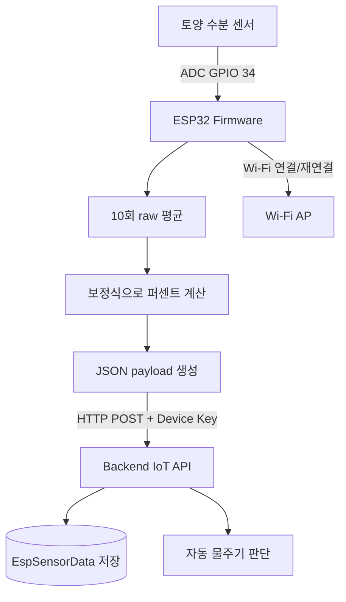

# ESP 코드 분석

## 분석 범위와 역할

`greenlink_esp/`는 토양 수분 센서를 읽어 GreenLink 백엔드에 전송하는 ESP32 펌웨어 프로젝트입니다. 실제 코드에서 Raspberry Pi와 통신하는 경로는 확인되지 않으며, ESP가 Wi-Fi를 통해 백엔드의 토양 수분 수집 API를 직접 호출합니다.

이 문서는 PlatformIO 설정과 `src/main.cpp`를 확인하여 작성했습니다. 소스 파일 안에 Wi-Fi 자격 증명, 장치 인증 키 및 서버 주소 종류의 민감 설정이 하드코딩되어 있으나 실제 값은 문서에 노출하지 않습니다.

## 사용 보드와 기술 스택

| 구분 | 확인 내용 | 근거 |
| --- | --- | --- |
| 보드 | ESP32 개발 보드 (`esp32dev`) | `platformio.ini` |
| 프레임워크 | Arduino for ESP32 | `platformio.ini` |
| 빌드/업로드 | PlatformIO | `platformio.ini` |
| 네트워크 | Wi-Fi STA 모드 | `src/main.cpp` |
| 서버 통신 | `HTTPClient`의 HTTP POST, JSON payload, 장치 키 헤더 | `src/main.cpp` |
| 센서 | 아날로그 토양 수분 센서 1개 | `src/main.cpp` |
| 출력/액추에이터 | ESP 코드에는 펌프/릴레이 GPIO 제어 없음 | `src/main.cpp` |

## 전체 파일 구조

```text
greenlink_esp/
├── platformio.ini
├── src/
│   └── main.cpp
├── include/
│   └── README
├── lib/
│   └── README
└── test/
    └── README
```

`.pio/`, `.git/`, `.vscode/`, `.idea/` 및 생성 바이너리는 구조 설명에서 제외했습니다. `include/`, `lib/`, `test/`에는 기본 안내 파일만 확인되어 실제 추가 라이브러리나 테스트 구현은 확인되지 않습니다.

## 주요 파일 역할

| 파일 경로 | 역할 | 중요도 | 연결되는 파일/기능 |
| --- | --- | --- | --- |
| `platformio.ini` | ESP32 보드, Arduino 프레임워크, upload/monitor 속도 설정 | 높음 | PlatformIO 실행 |
| `src/main.cpp` | Wi-Fi 연결, 센서 측정, 수분 변환, JSON POST의 전체 런타임 | 높음 | 백엔드 IoT API |
| `include/README` | include 폴더 안내 파일 | 낮음 | 없음 |
| `lib/README` | 로컬 library 폴더 안내 파일 | 낮음 | 없음 |
| `test/README` | test 폴더 안내 파일 | 낮음 | 테스트 코드 없음 |

## 핀 및 센서 연결 구조

### 핀 정보

| 핀 | 연결 대상 | 역할 | 코드상 위치 |
| --- | --- | --- | --- |
| GPIO 34 | 아날로그 토양 수분 센서 출력 | ADC 값을 읽어 토양 수분 raw 데이터 생성 | `src/main.cpp`의 `SOIL_SENSOR_PIN` |

GPIO 34 이외의 센서, 펌프, LED 또는 Serial 주변장치 핀 정의는 ESP 코드에서 확인되지 않습니다. 펌프 실행은 Raspberry Pi 코드가 담당합니다.

### ADC 및 보정 방식

| 항목 | 구현 내용 |
| --- | --- |
| ADC 해상도 | 12 bit로 설정 |
| 입력 감쇠 | 센서 핀에 ESP32 ADC 감쇠 설정 적용 |
| 샘플링 | 1회 측정 시 raw 값을 10번 읽어 평균 |
| 샘플 간 지연 | 각 raw 읽기 사이 짧은 지연 적용 |
| 보정 | 코드 상수로 정의한 건조 raw와 습윤 raw 사이를 0~100%로 선형 변환 |
| 범위 처리 | 변환값은 0~100 범위로 제한하고 소수 한 자리로 반올림 |

코드에는 식물별 보정 상수 구분과 아직 실측 보정이 필요함을 나타내는 주석이 존재합니다. 현재 선택된 대상의 보정값이 실제 토양/센서 조합에서 검증되었는지는 코드상 확인되지 않습니다.

## 센서 데이터 구조

| 데이터명 | 의미 | 단위 | 생성 위치 | 전송 위치 |
| --- | --- | --- | --- | --- |
| `soilMoistureRaw` | ADC raw 평균값 | ADC count | `readSoilRaw()` | 백엔드 `/api/iot/esp/soil-moisture` |
| `soilMoisturePercent` | 건조/습윤 보정값으로 변환한 수분 상태 | `%` | `convertRawToPercent()` | 백엔드 `/api/iot/esp/soil-moisture` |

ESP payload에는 측정 시각 필드가 포함되지 않습니다. 백엔드 DTO는 시각을 받을 수 있으나, 이 펌웨어 전송에서는 서버가 수신 시각을 기준으로 처리하게 되는 구조입니다.

```json
{
  "soilMoistureRaw": "<adc-average>",
  "soilMoisturePercent": "<calculated-percent>"
}
```

## Wi-Fi 및 서버 통신 방식



### 통신 세부 내용

| 항목 | 실제 코드 동작 |
| --- | --- |
| 접속 방식 | Wi-Fi Station 모드로 지정 SSID 접속 |
| 초기 연결 실패 | 제한된 재시도 횟수 후 장치를 재시작 |
| 동작 중 연결 끊김 | 전송 전에 연결 상태를 확인하고 재연결 함수 호출 |
| 전송 방식 | 토양 측정 후 서버 endpoint에 HTTP POST |
| 요청 헤더 | JSON content type과 장치 인증 키 헤더 |
| 성공 판단 | HTTP 2xx 응답 |
| HTTP timeout | 제한 시간 설정 확인 |
| 실패 데이터 재전송 | 큐 또는 영속 버퍼 기반 재시도는 확인되지 않음 |
| 암호화 전송 | 펌웨어 코드의 endpoint 구성상 TLS 강제 여부를 문서에서 확인할 수 있도록 분리되어 있지 않음; 운영 주소 값은 노출하지 않음 |

## 실행 및 업로드 방법

### 필요한 프로그램과 환경

* PlatformIO Core 또는 PlatformIO IDE extension.
* ESP32 USB 연결과 해당 환경에서 인식되는 serial port.
* 토양 수분 센서와 GPIO 34 배선.
* Wi-Fi, 백엔드 endpoint, 활성 ESP 장치 키 설정.

### 코드상 가능한 명령

```bash
cd greenlink_esp
pio run
pio run -t upload
pio device monitor
```

`platformio.ini`에는 serial monitor 및 upload baud rate가 설정되어 있습니다. 업로드 후 serial monitor에서 연결/측정/응답 로그를 확인할 수 있지만, 현재 코드가 장치 인증 키 종류의 값을 출력하는 경로가 있으므로 공유 로그 수집 전에 제거하거나 마스킹해야 합니다.

### 실행 순서

1. 백엔드에 해당 ESP 장치가 활성 상태로 등록되고 대상 사용자 식물에 연결되어 있어야 합니다.
2. 펌웨어의 네트워크/장치 설정을 안전하게 주입할 수 있도록 구성합니다.
3. 토양 센서를 GPIO 34와 전원/접지에 연결하고 보정값을 실제 센서 기준으로 확인합니다.
4. PlatformIO로 빌드 및 업로드합니다.
5. 장치가 부팅되면 즉시 한 번 측정/전송하며, 이후 코드상 10분 간격으로 반복합니다.
6. 백엔드 저장 데이터와 자동화 판단/명령 결과를 별도로 확인합니다.

## 핵심 기능 설명

### 토양 수분 측정

* 목적: 센서의 노이즈를 줄인 토양 수분 raw 값을 확보합니다.
* 관련 파일: `src/main.cpp`.
* 실행 흐름: 지정 ADC 핀에서 여러 샘플을 읽고 평균을 계산합니다.
* 입력값: GPIO 34의 아날로그 전압에 대응하는 ADC 값.
* 출력값: 평균 raw 수분 값.
* 내부 처리 과정: `analogRead()`를 10회 수행하고 합계를 샘플 수로 나눕니다.
* 예외 처리: 센서 미연결/단락을 명시적으로 감지하는 코드는 확인되지 않으며, 범위 경고 출력만 있습니다.
* 다른 기능과의 연결: 퍼센트 변환과 HTTP 전송의 입력입니다.
* 주의할 점: 센서 전원, 토질, 설치 깊이에 따라 raw 보정값이 크게 바뀔 수 있습니다.

### 수분 퍼센트 변환

* 목적: 장치 raw 값을 앱과 자동화에서 사용 가능한 0~100% 값으로 변환합니다.
* 관련 파일: `src/main.cpp`.
* 실행 흐름: 코드에 설정된 건조/습윤 기준값 사이에서 현재 raw 위치를 선형 환산합니다.
* 입력값: 평균 ADC raw 값과 건조/습윤 보정 상수.
* 출력값: 한 자리 소수로 반올림된 수분 퍼센트.
* 내부 처리 과정: 건조 상태를 0%, 습윤 상태를 100% 방향으로 계산하고 범위를 clamp합니다.
* 예외 처리: 건조값과 습윤값이 같아 계산할 수 없는 경우 방어 반환이 구현되어 있습니다. 보정 범위 밖 raw에는 경고 로그를 출력합니다.
* 다른 기능과의 연결: 백엔드 자동 물주기 판단 기준 데이터.
* 주의할 점: 주석상 일부 식물 보정값은 실측 확정 상태가 아닙니다.

### Wi-Fi 연결과 재연결

* 목적: 전원 인가 후 네트워크를 확보하고 측정 데이터를 전송할 수 있게 합니다.
* 관련 파일: `src/main.cpp`.
* 실행 흐름: `setup()`에서 Wi-Fi 연결을 시도하고, 전송 직전에도 연결 여부를 재검사합니다.
* 입력값: Wi-Fi SSID 및 비밀번호 설정.
* 출력값: 연결된 네트워크 상태 또는 장치 재시작.
* 내부 처리 과정: STA 모드 시작, 일정 주기 연결 상태 확인, 최대 시도 초과 시 restart.
* 예외 처리: 접속 불가가 장시간 지속되면 `ESP.restart()`를 실행합니다.
* 다른 기능과의 연결: 모든 HTTP 센서 업로드.
* 주의할 점: 네트워크 장애 중 측정값은 저장되지 않으므로 데이터 공백이 발생할 수 있습니다.

### 센서 데이터 HTTP 전송

* 목적: 측정값을 백엔드 저장 및 자동화 처리에 전달합니다.
* 관련 파일: `src/main.cpp`.
* 실행 흐름: JSON 문자열을 생성하고 토양 센서 API에 장치 키 헤더와 함께 POST합니다.
* 입력값: raw 값, percent 값, 서버 endpoint, 장치 키.
* 출력값: HTTP 결과와 serial 로그.
* 내부 처리 과정: 네트워크 보장, `HTTPClient` 생성, header 추가, timeout 설정, POST, 상태 코드 평가, 연결 종료.
* 예외 처리: 비정상 응답 또는 연결 오류를 기록하지만 실패 payload를 보존해 재전송하지는 않습니다.
* 다른 기능과의 연결: 백엔드 `IotDeviceDataService`, 자동화 서비스, Pi 펌프 명령.
* 주의할 점: 장치 키와 서버 주소를 소스 안에 직접 둘 경우 firmware 유출 및 로그 노출 위험이 있습니다.

## 핵심 함수 상세 설명

### `setup()`

* 위치: `src/main.cpp`
* 역할: 장치 부팅 직후 serial, ADC, 네트워크 및 최초 측정 전송을 초기화합니다.
* 호출되는 시점: ESP32 부팅 또는 재시작 시 1회.
* 매개변수: 없음.
* 반환값: 없음.
* 내부 동작 순서:
  1. Serial 통신을 시작합니다.
  2. 실행 설정과 장치 관련 정보를 로그로 출력합니다.
  3. 보정 상수 순서가 올바른지 확인합니다.
  4. ADC 해상도와 핀 감쇠를 설정합니다.
  5. Wi-Fi를 연결합니다.
  6. 최초 센서 측정/업로드를 즉시 수행합니다.
  7. 반복 전송 기준 시간을 기록합니다.
* 관련 데이터: 보정값, 네트워크 설정, 마지막 전송 시각.
* 의존하는 다른 함수/클래스: `connectWiFi()`, `measureAndSend()`, Arduino ADC/Wi-Fi API.
* 에러 처리 방식: 보정 설정 오류 로그, Wi-Fi 연결 실패 시 재시작.
* 개선 가능성: serial 출력에 자격 증명 종류가 포함되지 않도록 하고 설정값 유효성 실패 시 안전 상태를 명확히 해야 합니다.

### `loop()`

* 위치: `src/main.cpp`
* 역할: 정해진 주기마다 센서를 측정하고 업로드하는 메인 반복 루프입니다.
* 호출되는 시점: `setup()` 완료 후 계속 실행.
* 매개변수: 없음.
* 반환값: 없음.
* 내부 동작 순서:
  1. 현재 시간과 마지막 전송 시간을 비교합니다.
  2. 10분 전송 간격이 지나면 `measureAndSend()`를 실행합니다.
  3. 마지막 측정 시각을 갱신합니다.
  4. 짧은 대기 후 다시 반복합니다.
* 관련 데이터: `lastMeasurementTime`, 전송 interval.
* 의존하는 다른 함수/클래스: `millis()`, `measureAndSend()`.
* 에러 처리 방식: 개별 전송 실패 후에도 다음 주기를 계속 기다립니다.
* 개선 가능성: 실패 시 다음 정상 interval까지 기다리지 않고 제한적 재시도/오프라인 큐를 적용할 수 있습니다.

### `readSoilRaw()`

* 위치: `src/main.cpp`
* 역할: ADC 샘플 평균으로 토양 센서 raw 값을 생성합니다.
* 호출되는 시점: 매 측정 주기.
* 매개변수: 없음.
* 반환값: 정수형 평균 raw 값.
* 내부 동작 순서:
  1. 센서 핀을 10회 읽습니다.
  2. 각 읽기 사이 지연을 둡니다.
  3. 합계를 평균으로 변환합니다.
* 관련 데이터: GPIO 34 ADC 입력.
* 의존하는 다른 함수/클래스: Arduino `analogRead`.
* 에러 처리 방식: 하드웨어 읽기 예외 모델은 없으며 범위 검증은 이후 변환 함수에서 일부 수행됩니다.
* 개선 가능성: 이동 평균, 중앙값 필터, 비정상 단선 범위 판정을 추가할 수 있습니다.

### `convertRawToPercent(int raw)`

* 위치: `src/main.cpp`
* 역할: 보정 raw 기준을 사용해 사용자 의미가 있는 수분 퍼센트를 계산합니다.
* 호출되는 시점: raw 평균 계산 직후.
* 매개변수: 현재 측정 raw 값.
* 반환값: 0~100% 범위 실수 값.
* 내부 동작 순서:
  1. 보정 구간이 유효한지 확인합니다.
  2. 건조/습윤 간 비율을 계산합니다.
  3. 0~100 범위 밖 값은 제한합니다.
  4. 소수 첫째 자리 수준으로 정리합니다.
* 관련 데이터: 건조/습윤 calibration 상수.
* 의존하는 다른 함수/클래스: 수학 반올림 함수.
* 에러 처리 방식: 보정값 충돌 시 0을 반환하고 비정상 범위에는 로그를 출력합니다.
* 개선 가능성: 장치별 calibration을 서버 또는 안전한 설정 저장소에서 관리하고 현장 교정 절차를 제공할 수 있습니다.

### `sendSoilMoistureData(...)`

* 위치: `src/main.cpp`
* 역할: 변환된 센서 데이터를 백엔드 API로 전송합니다.
* 호출되는 시점: `measureAndSend()`가 측정 완료 후.
* 매개변수: raw 값과 percent 값.
* 반환값: 함수 자체 반환 없이 HTTP 성공/실패를 로그 처리.
* 내부 동작 순서:
  1. 연결이 끊겼으면 Wi-Fi를 다시 연결합니다.
  2. 요청 URL로 HTTP client를 시작합니다.
  3. content type과 장치 키 헤더를 추가합니다.
  4. JSON body를 POST합니다.
  5. 응답 코드를 확인하고 client를 종료합니다.
* 관련 데이터: JSON 센서 payload, 장치 키.
* 의존하는 다른 함수/클래스: `HTTPClient`, `WiFi`, JSON 문자열 생성 함수.
* 에러 처리 방식: 오류 상태를 serial로 출력하며 지속 저장/재전송은 하지 않습니다.
* 개선 가능성: TLS 인증서 검증, 실패 큐, 응답 JSON 검증 및 민감 로그 차단을 추가해야 합니다.

## 백엔드 및 Pi와의 연결

| 연결 대상 | 통신 방식 | ESP 코드에서 확인된 내용 |
| --- | --- | --- |
| Backend | Wi-Fi HTTP POST + 장치 키 헤더 | 토양 수분 API로 직접 전송 |
| Raspberry Pi | 해당 없음 | ESP가 Pi에 Serial/MQTT/HTTP로 전송하는 코드는 확인되지 않음 |
| MQTT broker | 해당 없음 | MQTT 라이브러리 및 topic 사용 확인되지 않음 |
| WebSocket | 해당 없음 | 사용 확인되지 않음 |

백엔드는 ESP 데이터를 저장한 뒤 자동 물주기 조건을 판단할 수 있고, 실제 펌프 실행 명령은 Pi가 처리합니다. 따라서 ESP는 센서 노드이며 액추에이터 게이트웨이는 아닙니다.

## 에러 처리 및 재연결 로직

| 실패 상황 | 현재 처리 | 한계 |
| --- | --- | --- |
| 부팅 시 Wi-Fi 연결 실패 | 일정 횟수 재시도 후 ESP restart | 장기 장애 시 재시작 반복 가능 |
| 전송 시 연결 해제 | 업로드 전 재연결 | 당시 측정 데이터의 영속 보관 없음 |
| HTTP 비정상 응답 | 로그 기록 | 즉시/지연 재전송 없음 |
| 센서 보정 범위 초과 | serial 경고 및 0~100 clamp | 하드웨어 고장과 실제 극단 상태 구분 없음 |
| 잘못된 calibration 구간 | 방어 반환과 로그 | 원격 알림/전송 차단 정책 확인되지 않음 |

## 전원 및 센서 주의사항

* GPIO 34는 ESP32의 입력 전용 ADC 핀으로 센서 출력 읽기에 사용되며, 코드에서 센서 전압 허용 범위 검증은 수행하지 않습니다.
* 정전용량식/아날로그 센서는 토양과 전원 조건에 따라 값이 변하므로 현장 dry/wet 교정 없이 자동 물주기에 바로 사용하는 것은 위험합니다.
* Wi-Fi 전송 순간 전류 변화가 ADC 값에 영향을 줄 수 있으므로 전원 안정성 및 측정 재현성을 실제 하드웨어에서 확인해야 합니다.
* ESP 코드에는 펌프 안전 차단이 없으며, 수분값이 백엔드 자동화 및 Pi 동작으로 이어지므로 오측정 방어가 중요합니다.

## 주의사항 및 개선 가능성

| 항목 | 코드 근거 | 개선 방향 |
| --- | --- | --- |
| 자격 증명 하드코딩 | `main.cpp`에 Wi-Fi/장치 키/서버 설정 종류가 포함 | 빌드 비밀 설정 또는 provisioning 방식으로 분리하고 기존 값 회전 |
| 민감 로그 | 초기화 로그에서 장치 키를 출력하는 경로 존재 | 모든 인증값 출력 제거 |
| 실패 데이터 유실 | 업로드 실패 후 보존/재시도 큐 없음 | 제한된 로컬 큐와 backoff 전송 추가 |
| 보정 신뢰성 | 식물별 calibration 주석 및 상수 방식 | 현장 교정 절차와 장치별 저장/검증 추가 |
| 시각 누락 | payload에 `measuredAt` 미포함 | 네트워크 지연/재전송을 고려한다면 측정 시각 포함 |
| 전송 보호 | endpoint/키 방식에 의존 | TLS 검증과 장치 키 회전/권한 관리 확인 |
| 테스트 부재 | `test/`에 구현 없음 | 변환식 경계값과 JSON 생성 테스트, 하드웨어 통합 시험 필요 |

<!-- BEGIN GENERATED SOURCE APPENDIX -->
## 소스 코드 원문 부록

### 포함 범위와 마스킹 원칙

실행 펌웨어 소스와 PlatformIO 빌드 설정을 포함한다. 안내 README, IDE 설정 및 `.pio` 빌드 산출물은 제외한다.

아래 코드는 확인한 저장소 파일의 원문을 문서에 수록한 것이다. 다만 소스에 존재하는 비밀키, 토큰/장치 키, Wi-Fi 자격 정보, 실서버 주소 및 외부 저장소 URL은 `<REDACTED_SECRET>`, `<REDACTED_DEVICE_KEY>`, `<REDACTED_URL>` 또는 `<REDACTED_IP>`로 치환했으므로 그대로 빌드하기 위한 사본이 아니라 분석용 사본이다.

### 수록 파일 목록

* `platformio.ini`
* `src/main.cpp`

### 원문 코드

#### `platformio.ini`

~~~~ini
[env:esp32dev]
platform = espressif32
board = esp32dev
framework = arduino

monitor_speed = 115200
upload_speed = 115200
#lib_deps =
~~~~

#### `src/main.cpp`

~~~~cpp
#include <Arduino.h>
#include <WiFi.h>
#include <HTTPClient.h>
#include <math.h>

// =====================================================
// 1. Wi-Fi 설정
// =====================================================

const char* WIFI_SSID = "<REDACTED_SECRET>";
const char* WIFI_PASSWORD = "<REDACTED_SECRET>";


// =====================================================
// 2. 서버 및 기기 설정
// =====================================================

const char* SERVER_URL = "<REDACTED_URL>";

// 해바라기용 ESP 키
// const char* DEVICE_KEY = "<REDACTED_SECRET>";

// 바질용으로 사용할 때는 위 해바라기 키를 주석 처리하고 아래를 사용
const char* DEVICE_KEY = "<REDACTED_SECRET>";


// =====================================================
// 3. 핀 설정
// =====================================================

const int SOIL_SENSOR_PIN = 34;


// =====================================================
// 4. 센서 보정값 설정
// =====================================================
//
// 토양수분센서는 보통:
// raw 값이 클수록 건조
// raw 값이 작을수록 습함
//
// 계산식:
// percent = (DRY_RAW - raw) / (DRY_RAW - WET_RAW) * 100
//
// 주의:
// 공기 중 raw 값은 센서 정상 확인용이고,
// 실제 계산에는 "마른 흙 raw"와 "충분히 젖은 흙 raw"를 사용한다.
//
// 해바라기 센서 기준 측정값:
// 공기 중: 2783, 2781
// 마른 흙: 2213, 2224
// 젖은 흙: 1711, 1710
// 물 더 줌: 1438, 1461
//
// 실제 DB에 최근 들어온 raw 값이 1420~1423이었으므로,
// WET_RAW = 1710으로 두면 현재 raw가 WET_RAW보다 작아져서
// percent가 100%로 계속 잘리는 문제가 생긴다.
//
// 그래서 현재 운영 기준에서는 충분히 젖은 상태를 1400 근처로 잡는다.

const int SUNFLOWER_DRY_RAW = 1700;
const int SUNFLOWER_WET_RAW = 1300;

// 바질은 나중에 바질 센서로 따로 보정해야 함.
// 지금은 임시값으로 해바라기와 동일하게 둔다.
const int BASIL_DRY_RAW = 1700;
const int BASIL_WET_RAW = 1300;

// 현재 이 코드는 해바라기 ESP용
// const int DRY_RAW = SUNFLOWER_DRY_RAW;
// const int WET_RAW = SUNFLOWER_WET_RAW;

// 바질 ESP에 넣을 때는 위 두 줄을 주석 처리하고 아래 두 줄 사용
const int DRY_RAW = BASIL_DRY_RAW;
const int WET_RAW = BASIL_WET_RAW;


// =====================================================
// 5. 측정 및 전송 설정
// =====================================================

const int SAMPLE_COUNT = 10;

// 테스트용: 10초마다 전송
//const unsigned long SEND_INTERVAL_MS = 10UL * 1000UL;

// 실제 운영용: 10분마다 전송
const unsigned long SEND_INTERVAL_MS = 10UL * 60UL * 1000UL;

unsigned long lastSendTime = 0;


// =====================================================
// 6. 함수 선언
// =====================================================

void connectWiFi();
void ensureWiFiConnected();

int readSoilRaw();
double convertRawToPercent(int raw);

String createJsonBody(int soilRaw, double soilPercent);
bool sendSoilMoistureData(int soilRaw, double soilPercent);

void measureAndSend();


// =====================================================
// 7. setup
// =====================================================

void setup() {
    Serial.begin(115200);
    delay(1000);

    Serial.println();
    Serial.println("====================================");
    Serial.println("GreenLink ESP32 Soil Moisture 시작");
    Serial.println("====================================");

    Serial.print("DEVICE_KEY: ");
    Serial.println(DEVICE_KEY);

    Serial.print("SOIL_SENSOR_PIN: ");
    Serial.println(SOIL_SENSOR_PIN);

    Serial.print("DRY_RAW: ");
    Serial.println(DRY_RAW);

    Serial.print("WET_RAW: ");
    Serial.println(WET_RAW);

    if (DRY_RAW <= WET_RAW) {
        Serial.println("[ERROR] DRY_RAW는 WET_RAW보다 커야 합니다.");
        Serial.println("[ERROR] 보정값을 다시 확인하세요.");
    }

    analogReadResolution(12);
    analogSetPinAttenuation(SOIL_SENSOR_PIN, ADC_11db);

    connectWiFi();

    measureAndSend();

    lastSendTime = millis();
}


// =====================================================
// 8. loop
// =====================================================

void loop() {
    unsigned long currentTime = millis();

    if (currentTime - lastSendTime >= SEND_INTERVAL_MS) {
        measureAndSend();
        lastSendTime = currentTime;
    }

    delay(1000);
}


// =====================================================
// 9. 토양수분 raw 값 읽기
// =====================================================

int readSoilRaw() {
    long sum = 0;

    Serial.println();
    Serial.println("[RAW 샘플 측정 시작]");

    for (int i = 0; i < SAMPLE_COUNT; i++) {
        int value = analogRead(SOIL_SENSOR_PIN);

        Serial.print("sample ");
        Serial.print(i + 1);
        Serial.print(": ");
        Serial.println(value);

        sum += value;
        delay(50);
    }

    int average = (int)(sum / SAMPLE_COUNT);

    Serial.print("[RAW 평균] ");
    Serial.println(average);

    return average;
}


// =====================================================
// 10. raw 값을 percent로 변환
// =====================================================

double convertRawToPercent(int raw) {
    if (DRY_RAW == WET_RAW) {
        Serial.println("[ERROR] DRY_RAW와 WET_RAW가 같습니다. 보정값을 다시 확인하세요.");
        return 0.0;
    }

    double percent = ((double)(DRY_RAW - raw) / (double)(DRY_RAW - WET_RAW)) * 100.0;

    if (raw > DRY_RAW) {
        Serial.println("[WARN] raw가 DRY_RAW보다 큽니다. 0%로 보정합니다.");
    }

    if (raw < WET_RAW) {
        Serial.println("[WARN] raw가 WET_RAW보다 작습니다. 100%로 보정합니다.");
    }

    if (percent < 0.0) {
        percent = 0.0;
    }

    if (percent > 100.0) {
        percent = 100.0;
    }

    return round(percent * 10.0) / 10.0;
}


// =====================================================
// 11. JSON Body 생성
// =====================================================

String createJsonBody(int soilRaw, double soilPercent) {
    String jsonBody = "{";
    jsonBody += "\"soilMoistureRaw\":";
    jsonBody += soilRaw;
    jsonBody += ",";
    jsonBody += "\"soilMoisturePercent\":";
    jsonBody += String(soilPercent, 1);
    jsonBody += "}";

    return jsonBody;
}


// =====================================================
// 12. Spring Boot 서버로 데이터 전송
// =====================================================

bool sendSoilMoistureData(int soilRaw, double soilPercent) {
    ensureWiFiConnected();

    HTTPClient http;

    http.setTimeout(5000);
    http.begin(SERVER_URL);
    http.addHeader("Content-Type", "application/json");
    http.addHeader("X-DEVICE-KEY", DEVICE_KEY);

    String jsonBody = createJsonBody(soilRaw, soilPercent);

    Serial.println();
    Serial.println("====================================");
    Serial.println("[서버 전송 시작]");
    Serial.print("SERVER_URL: ");
    Serial.println(SERVER_URL);
    Serial.print("DEVICE_KEY: ");
    Serial.println(DEVICE_KEY);
    Serial.println("[전송 JSON]");
    Serial.println(jsonBody);
    Serial.println("====================================");

    int httpResponseCode = http.POST(jsonBody);

    if (httpResponseCode > 0) {
        String responseBody = http.getString();

        Serial.print("HTTP Code: ");
        Serial.println(httpResponseCode);

        Serial.print("Response: ");
        Serial.println(responseBody);

        http.end();

        if (httpResponseCode >= 200 && httpResponseCode < 300) {
            Serial.println("[서버 전송 성공]");
            return true;
        }

        Serial.println("[서버 전송 실패]");
        return false;
    }

    Serial.print("HTTP Error: ");
    Serial.println(http.errorToString(httpResponseCode));

    http.end();

    return false;
}


// =====================================================
// 13. 측정 후 서버 전송
// =====================================================

void measureAndSend() {
    int raw = readSoilRaw();
    double percent = convertRawToPercent(raw);

    Serial.println();
    Serial.println("====================================");
    Serial.println("[측정 결과]");

    Serial.print("DRY_RAW: ");
    Serial.println(DRY_RAW);

    Serial.print("WET_RAW: ");
    Serial.println(WET_RAW);

    Serial.print("soilMoistureRaw: ");
    Serial.println(raw);

    Serial.print("soilMoisturePercent: ");
    Serial.print(percent, 1);
    Serial.println("%");

    if (raw > DRY_RAW) {
        Serial.println("[판단] 기준상 매우 건조 또는 공기 중/접촉 불량 가능성");
    } else if (raw < WET_RAW) {
        Serial.println("[판단] 기준상 매우 젖음 또는 과습 가능성");
    } else {
        Serial.println("[판단] dryRaw와 wetRaw 사이 정상 범위");
    }

    Serial.println("====================================");

    sendSoilMoistureData(raw, percent);
}


// =====================================================
// 14. Wi-Fi 연결
// =====================================================

void connectWiFi() {
    WiFi.mode(WIFI_STA);
    WiFi.begin(WIFI_SSID, WIFI_PASSWORD);

    Serial.println();
    Serial.println("====================================");
    Serial.println("[Wi-Fi 연결 시도]");
    Serial.print("SSID: ");
    Serial.println(WIFI_SSID);
    Serial.println("====================================");

    int retryCount = 0;

    while (WiFi.status() != WL_CONNECTED) {
        delay(500);
        Serial.print(".");

        retryCount++;

        if (retryCount >= 60) {
            Serial.println();
            Serial.println("[Wi-Fi 연결 실패] ESP32를 재시작합니다.");
            ESP.restart();
        }
    }

    Serial.println();
    Serial.print("[Wi-Fi 연결 성공] IP: ");
    Serial.println(WiFi.localIP());
}


// =====================================================
// 15. Wi-Fi 연결 상태 확인
// =====================================================

void ensureWiFiConnected() {
    if (WiFi.status() == WL_CONNECTED) {
        return;
    }

    Serial.println("[Wi-Fi 끊김] 재연결 시도");
    connectWiFi();
}
~~~~

<!-- END GENERATED SOURCE APPENDIX -->

## 정리 요약

ESP 영역은 ESP32 한 대가 GPIO 34 토양 수분 값을 평균/보정해 10분 간격으로 백엔드에 직접 전송하는 단순 센서 노드 구현입니다. 토양 값은 백엔드 자동 물주기 판단의 입력이 되고, 물리 펌프 동작은 별도 Pi 명령 워커가 실행합니다.

펌웨어의 핵심 운영 과제는 장치/Wi-Fi 설정의 안전한 관리, 실측 calibration 검증, 그리고 네트워크 실패 시 데이터 유실 방지입니다.

## 추가로 확인하면 좋은 점

* 사용 중인 실제 토양 센서 모델, 전압 조건, 식물별 dry/wet 교정 결과.
* 운영 firmware에서 Wi-Fi와 장치 키를 주입/회전하는 방법.
* 백엔드에 등록된 ESP 장치와 사용자 식물 연결 절차.
* HTTPS 및 인증서 검증을 포함한 실제 네트워크 보안 구성.
* 장시간 네트워크 장애 또는 센서 이상에서 자동 물주기를 중단하는 운영 정책.
