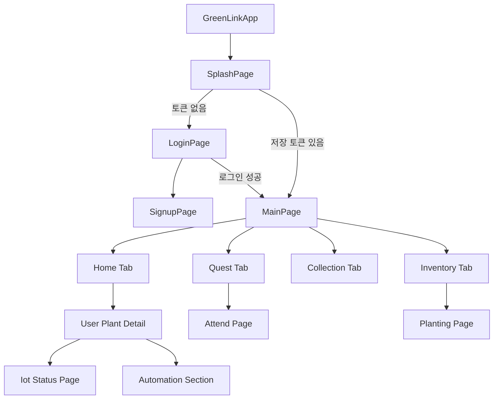
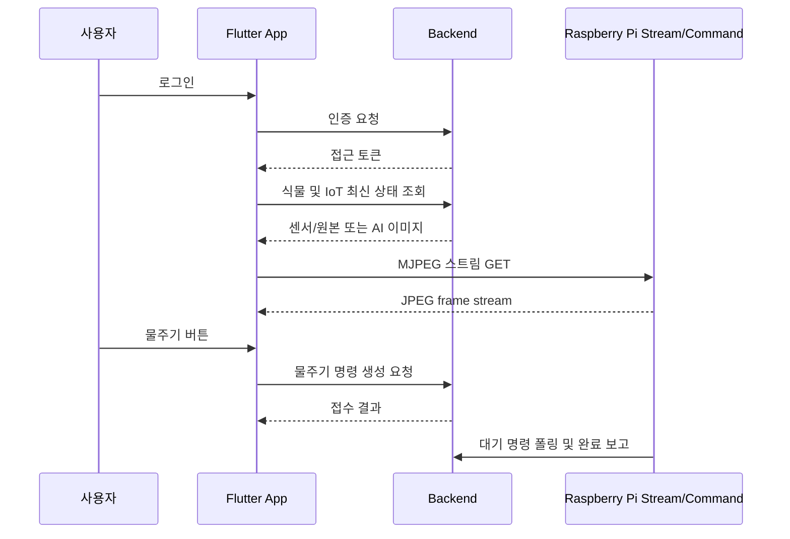

# Frontend 코드 분석

## 분석 범위와 역할

`greenlink_front/`는 Flutter 기반 사용자 애플리케이션입니다. 로그인 후 홈, 인벤토리, 컬렉션, 퀘스트/출석, 식물 상세와 IoT 제어 화면을 제공하고, HTTP API로 백엔드에 접근합니다. 또한 Raspberry Pi의 MJPEG 영상 스트림을 직접 재생합니다.

이 문서는 `lib/`, `test/`, 플랫폼 설정 및 `pubspec.yaml`을 확인하여 작성했습니다. 소스에 포함된 앱 키, OAuth 설정값, 서버 호스트 등 민감하거나 운영 식별이 가능한 값은 문서에 기록하지 않습니다.

## 기술 스택

| 구분 | 확인된 내용 | 근거 파일 |
| --- | --- | --- |
| 앱 프레임워크 | Flutter / Dart, Material UI | `pubspec.yaml`, `lib/main.dart` |
| Dart SDK 범위 | `^3.9.2` | `pubspec.yaml` |
| HTTP 통신 | `http` 패키지 기반 REST 및 MJPEG 스트림 읽기 | `pubspec.yaml`, `core/network/`, `widgets/mjpeg_stream_view.dart` |
| 토큰 저장 | `shared_preferences` | `token_storage.dart`, `splash_page.dart` |
| 소셜 로그인 | Kakao Flutter SDK, Google Sign-In | `pubspec.yaml`, 인증 화면/서비스 |
| 알림/플랫폼 설정 | Firebase core/messaging 의존성과 플랫폼 설정 파일 존재 | `pubspec.yaml`, 플랫폼 폴더 |
| 상태 관리 | 화면별 `StatefulWidget`/`setState`와 `GlobalKey` refresh | 화면 코드 |
| 테스트 | IoT 토양 상태 판정 단위 테스트 1개 | `test/iot_water_shortage_test.dart` |

`provider`, `firebase_core`, `firebase_messaging` 의존성은 선언되어 있으나 확인한 `lib/` 코드에서 실제 상태 관리 또는 메시징 초기화/사용 흐름은 확인되지 않습니다.

## 전체 폴더 및 파일 구조

```text
greenlink_front/
├── pubspec.yaml
├── pubspec.lock
├── analysis_options.yaml
├── README.md
├── lib/
│   ├── main.dart
│   ├── core/
│   │   ├── config/
│   │   │   └── camera_config.dart
│   │   ├── constants/
│   │   │   ├── api_paths.dart
│   │   │   ├── stream_urls.dart
│   │   │   └── iot_thresholds.dart
│   │   ├── network/
│   │   │   ├── api_client.dart
│   │   │   ├── api_response.dart
│   │   │   └── token_storage.dart
│   │   ├── utils/
│   │   └── widgets/
│   ├── models/
│   │   ├── auth_models.dart
│   │   ├── home_models.dart
│   │   ├── user_plant_models.dart
│   │   ├── user_item_models.dart
│   │   ├── collection_models.dart
│   │   ├── quest_models.dart
│   │   ├── attend_models.dart
│   │   ├── iot_models.dart
│   │   └── automation_models.dart
│   ├── services/
│   │   ├── auth_service.dart
│   │   ├── home_service.dart
│   │   ├── user_plant_service.dart
│   │   ├── user_item_service.dart
│   │   ├── collection_service.dart
│   │   ├── quest_service.dart
│   │   ├── attend_service.dart
│   │   ├── iot_service.dart
│   │   └── automation_service.dart
│   ├── screens/
│   │   ├── splash_page.dart
│   │   ├── main_page.dart
│   │   ├── settings_page.dart
│   │   ├── auth/
│   │   ├── home/
│   │   ├── inventory/
│   │   ├── collection/
│   │   ├── quest/
│   │   ├── attend/
│   │   ├── user_plant/
│   │   └── iot/
│   ├── widgets/
│   │   ├── mjpeg_stream_view.dart
│   │   └── ...
│   └── theme/
│       └── app_theme.dart
├── test/
│   └── iot_water_shortage_test.dart
├── android/       (Flutter 플랫폼 프로젝트 및 서비스 설정 포함)
├── ios/           (Flutter 플랫폼 프로젝트 및 서비스 설정 포함)
├── macos/
├── linux/
├── windows/
└── 설계/보조 스크립트 및 산출 문서 파일들
```

`.dart_tool/`, `build/`, `.git/`, IDE 캐시와 플랫폼 생성 산출물은 분석 구조에서 제외했습니다. Android/iOS 서비스 설정 파일에는 설정 식별자 종류가 포함될 수 있으므로 값을 문서화하지 않습니다.

## 주요 파일 역할

| 파일 경로 | 역할 | 중요도 | 연결되는 파일/기능 |
| --- | --- | --- | --- |
| `lib/main.dart` | 앱 시작, 테마와 초기 화면, Kakao SDK 초기화 | 높음 | Splash, 인증 |
| `lib/screens/splash_page.dart` | 저장 토큰 확인 후 로그인 또는 메인으로 이동 | 높음 | `TokenStorage`, `ApiClient` |
| `lib/screens/main_page.dart` | 하단 탭 기반 주요 화면 컨테이너 | 높음 | 홈, 인벤토리, 컬렉션, 퀘스트 |
| `lib/core/network/api_client.dart` | 백엔드 HTTP 공통 클라이언트와 인증 헤더/401 처리 | 높음 | 모든 Service |
| `lib/core/network/token_storage.dart` | 접근 토큰 저장/조회/삭제 | 높음 | 인증, API |
| `lib/core/constants/api_paths.dart` | REST 경로 조합 정의 | 높음 | Service |
| `lib/core/constants/stream_urls.dart` | 카메라 스트림 주소 정의 | 중간 | MJPEG 화면 |
| `lib/core/config/camera_config.dart` | 식물별 스트림 선택 매핑 | 중간 | IoT 영상 |
| `lib/services/auth_service.dart` | 회원가입, 로그인, OAuth API 호출 | 높음 | 인증 화면 |
| `lib/services/iot_service.dart` | 최신 센서/사진과 수동 제어 API 호출 | 높음 | IoT 상태 화면 |
| `lib/services/automation_service.dart` | 자동화 설정/학습/로그/모델 API 호출 | 높음 | 식물 상세 자동화 영역 |
| `lib/screens/home/**` | 현재 식물 및 이미지 중심 홈 UI | 높음 | Home/Iot 서비스 |
| `lib/screens/inventory/**` | 씨앗, 화분, 영양제 사용 UI | 높음 | UserItem 서비스 |
| `lib/screens/user_plant/**` | 식재, 목록, 상세, 자동화 접근 UI | 높음 | UserPlant/Iot/Automation |
| `lib/screens/iot/**` | 센서 현황, 영상, 물/조명 제어 UI | 높음 | IoT, MJPEG |
| `lib/widgets/mjpeg_stream_view.dart` | byte stream에서 JPEG 프레임 추출/표시 | 높음 | Pi 스트림 |
| `lib/models/**` | API JSON의 앱 객체 변환 | 중간 | 각 Service/화면 |
| `test/iot_water_shortage_test.dart` | 수분 부족/과습 표시 기준 테스트 | 낮음 | IoT 임계치 |

## 실행 방식

### 필요한 설치 프로그램

* Flutter SDK와 지원되는 Dart SDK.
* 실행 대상에 맞는 Android Studio/Xcode 또는 데스크톱 Flutter toolchain.
* 소셜 로그인과 플랫폼 서비스 기능을 실제 사용할 경우 해당 플랫폼 설정.

### 확인된 실행 및 빌드 명령

```bash
cd greenlink_front
flutter pub get
flutter run
flutter analyze
flutter test
flutter build <platform>
```

### 환경 변수 및 설정 파일

| 설정 종류 | 코드상 상태 | 실행 시 확인할 점 |
| --- | --- | --- |
| 백엔드 API base URL | Dart 상수에 외부 서버 주소가 하드코딩되어 있음 | 개발/운영 환경 분리 필요 |
| Pi MJPEG stream URL | Dart 상수에 외부 스트림 주소가 하드코딩되어 있음 | 스트림 공개 정책과 변경 가능성 확인 |
| Kakao SDK 앱 키 | 앱 시작 코드에 설정값이 포함되어 있음 | 환경별 안전한 주입/플랫폼 등록 확인 |
| Google 로그인 client 설정 | 인증 코드에 설정 정보 사용 | 플랫폼별 redirect/client 구성 확인 |
| Firebase 설정 파일 | 플랫폼 폴더에 존재 | 메시징 실제 사용 흐름은 `lib/`에서 확인되지 않음 |

별도의 `.env` 로딩 코드나 flavor별 설정 분리 코드는 확인되지 않습니다.

## 라우팅과 화면 구성

앱은 named route 테이블이 아니라 화면에서 `MaterialPageRoute`를 생성하여 이동합니다.



### 화면 / 페이지 목록

| 화면/페이지 | 경로 방식 | 역할 | 관련 컴포넌트 | 연결 API |
| --- | --- | --- | --- | --- |
| Splash | 시작 home 화면 | 로컬 토큰 검사와 자동 이동 | `SplashPage` | 직접 API 없음 |
| 로그인 / 회원가입 | push navigation | 일반/OAuth 인증 및 가입 | 인증 screens | `/api/auth/**` |
| Main | 로그인 후 루트 | 4개 하단 탭과 refresh 제어 | `MainPage` | 자식 화면 API |
| Home | Main 탭 | 대표 식물 및 최신 이미지 표시 | home screens | `/api/home`, `/api/user-plants`, IoT latest |
| Inventory | Main 탭 | 씨앗/화분/영양제 조회와 사용 | inventory screens | `/api/user-items/**` |
| Collection | Main 탭 | 수확 식물 도감 목록/상세 | collection screens | `/api/collections/**` |
| Quest | Main 탭 | 퀘스트 목록, 필터, 보상 | quest screens | `/api/user-quests/**` |
| Attend | Quest에서 이동 | 월별 출석과 오늘 출석 | attend screens | `/api/attends/**` |
| Planting | 인벤토리/목록에서 이동 | 씨앗으로 새 식물 생성 | user plant screens | `/api/user-plants` |
| Plant Detail | 홈/목록에서 이동 | 성장/이미지/자동화/IoT 진입 | user plant screens, Automation UI | user plant, IoT, automation API |
| IoT Status | 상세에서 이동 | 센서값, MJPEG, 물주기/조명 | `MjpegStreamView` | IoT API, Pi stream |
| Settings | 화면 내 이동 | 사용자 설정/로그아웃 관련 UI | `SettingsPage` | 사용자/토큰 관련 |

## 사용자 흐름과 운영 방식

1. 앱 시작 시 `SplashPage`가 로컬 저장소에서 접근 토큰을 조회합니다.
2. 토큰이 없으면 로그인 화면이 표시되고, 로그인 성공 시 토큰을 저장하고 `MainPage`로 이동합니다.
3. 메인 탭에서 사용자는 현재 식물, 보유 아이템, 수확 컬렉션 및 퀘스트를 확인합니다.
4. 식물 상세에서는 최신 이미지와 자동화 설정을 확인하며 IoT 상태 화면으로 이동할 수 있습니다.
5. IoT 상태 화면은 백엔드에서 저장된 센서 데이터와 사진을 가져오고, 동시에 Pi의 MJPEG 스트림을 HTTP로 직접 표시합니다.
6. 물주기 또는 조명 조작은 앱이 백엔드에 명령 생성 요청을 보내며, 실제 GPIO 실행은 Pi가 백엔드 명령을 폴링하여 수행합니다.
7. 최신 사진의 AI 이미지 URL이 존재하면 홈 또는 상세에서 변환 결과를 우선 표시하는 로직이 있습니다.



## 상태 관리 방식

| 범위 | 구현 방식 | 특징 |
| --- | --- | --- |
| 로그인 상태 | `SharedPreferences` 토큰 저장과 Splash 검사 | 앱 재실행 시 단순 토큰 존재 여부 사용 |
| API 인증 만료 | `ApiClient.onUnauthorized` callback | 401 수신 시 로그인 화면 이동 |
| 탭 상태 | `IndexedStack`와 화면 `GlobalKey` | 탭 재선택/동작 후 refresh 메서드 호출 |
| 화면 데이터 | `StatefulWidget`의 비동기 로딩 및 `setState` | 중앙 Store 또는 Provider 사용 확인되지 않음 |
| 입력/동작 상태 | 각 화면 로딩/버튼 처리 상태 | 화면별 구현 |

## API 호출 방식

### 공통 클라이언트

`ApiClient`가 GET/POST/PATCH 등 요청을 감싸며 `TokenStorage`에서 토큰을 읽어 Bearer 헤더를 추가합니다. HTTP 401 응답 시 등록된 callback으로 인증 화면 복귀를 유도합니다. 서비스 클래스는 이 클라이언트를 이용해 백엔드 API 경로를 호출하고 모델 객체로 파싱합니다.

| Service | 호출 기능 | 핵심 백엔드 경로 |
| --- | --- | --- |
| `AuthService` | 가입, 일반 및 소셜 로그인 | `/api/auth/**` |
| `HomeService` | 홈 대표 식물/상태 | `/api/home` |
| `UserPlantService` | 식재, 목록, 상세, 수정, 수확 | `/api/user-plants/**` |
| `UserItemService` | 인벤토리와 아이템 사용 | `/api/user-items/**` |
| `CollectionService` | 컬렉션 목록/상세 | `/api/collections/**` |
| `QuestService` | 퀘스트와 보상 | `/api/user-quests/**` |
| `AttendService` | 출석 기록/오늘 출석 | `/api/attends/**` |
| `IotService` | 최신 IoT, 사진, 물주기, 조명, 센서 refresh 요청 | `/api/user-plants/{id}/iot/**` |
| `AutomationService` | 자동화 설정, 학습, 모델, 로그 | `/api/user-plants/{id}/automation/**` |

### API 계약 상태

| 프론트엔드 동작 | 백엔드 확인 결과 | 영향 |
| --- | --- | --- |
| `IotService`가 `/api/user-plants/{id}/iot/refresh` POST 호출 | 대응하는 `IotAppController` endpoint 구현 완료 | 연결 가능. 진행 중 명령은 409로 처리 |
| 자동화 설정 모델/화면이 `wateringSafetyEnabled` 필드를 전송/표시 | 백엔드 `AutomationSetting`/DTO 반영 완료 | 일치. 수동/자동 급수 차단 정책에 반영 |

## 핵심 기능 설명

### 로그인 및 세션 유지

* 목적: 사용자 인증 후 보호 API에 접근할 수 있도록 합니다.
* 관련 파일: `main.dart`, `splash_page.dart`, `auth_service.dart`, 인증 화면, `api_client.dart`, `token_storage.dart`.
* 실행 흐름: 앱 시작 시 SDK가 초기화되고 Splash가 저장 토큰을 검사합니다. 로그인 요청 성공 시 접근 토큰을 저장하고 메인 화면으로 전환합니다. 이후 요청마다 토큰을 Authorization 헤더에 포함합니다.
* 입력값: 이메일/비밀번호 또는 소셜 로그인 인가 정보.
* 출력값: 로그인 상태, 메인 화면 접근, API 인증 헤더.
* 내부 처리 과정: JSON 요청, 응답 모델 파싱, SharedPreferences 저장, 401 callback 등록.
* 예외 처리: API 실패 시 화면 메시지/상태 변경 경로가 있으며 401은 로그인으로 이동합니다.
* 다른 기능과의 연결: 로그인 후 모든 사용자, 식물, IoT, 퀘스트 기능.
* 주의할 점: 접근 토큰은 보안 전용 저장소가 아닌 `SharedPreferences`에 저장됩니다. 공통 클라이언트의 token substring debug 로그는 제거되어 토큰 값은 출력하지 않습니다.

### 식물 홈 및 이미지 표시

* 목적: 사용자가 현재 키우는 식물과 시각적 상태를 즉시 확인하게 합니다.
* 관련 파일: home screens, `home_service.dart`, `user_plant_service.dart`, `iot_service.dart`.
* 실행 흐름: 홈 요약과 사용자 식물을 로드하고 활성 식물에 대해 최신 IoT 사진을 요청합니다. AI 결과 이미지 URL이 존재하면 원본 대신 우선 사용할 수 있습니다.
* 입력값: 인증된 사용자의 식물 목록.
* 출력값: 대표 식물 카드와 상태/이미지 UI.
* 내부 처리 과정: 여러 서비스 호출 결과를 화면 상태에 결합합니다.
* 예외 처리: 일부 이미지 또는 IoT 조회 실패 시 화면 로딩/대체 표시 경로가 구현된 화면 상태에 의존합니다.
* 다른 기능과의 연결: 식물 상세, 식재, 인벤토리, AI 이미지.
* 주의할 점: 식물 수 증가 시 개별 IoT 호출 수가 늘어날 수 있어 목록 응답 최적화가 필요할 수 있습니다.

### IoT 모니터링 및 원격 제어

* 목적: 센서 상태, 영상, 물주기와 조명 제어를 사용자에게 제공합니다.
* 관련 파일: IoT screens, `iot_service.dart`, `iot_models.dart`, `mjpeg_stream_view.dart`, `iot_thresholds.dart`, `camera_config.dart`.
* 실행 흐름: 식물별 최신 IoT API를 호출하고 센서값을 카드/배너로 표시합니다. 카메라 스트림은 앱이 Pi 제공 주소에 직접 접속해 표시합니다. 조작 버튼은 백엔드 명령 API를 호출합니다. 센서 새로고침 버튼은 `/iot/refresh` 요청 후 2.5초 뒤 latest를 재조회하며, 진행 중 409 응답은 스낵바로 안내합니다.
* 입력값: 사용자 식물 ID, 버튼 이벤트, 스트림 URL.
* 출력값: 센서 UI, 과습/물 부족 표시, 실시간 프레임, 명령 요청 결과.
* 내부 처리 과정: 수분 퍼센트가 기준보다 낮거나 높을 때 배너 판정, byte stream에서 JPEG 시작/끝 바이트를 찾아 프레임 생성.
* 예외 처리: 스트림 및 API 네트워크 실패를 화면 오류 상태로 다룹니다.
* 다른 기능과의 연결: Pi 카메라/명령 워커, Backend `IotAppService`.
* 주의할 점: 스트림 요청에는 앱 JWT가 사용되지 않으며, 스트림 공개 또는 별도 보호 정책은 코드상 확인되지 않습니다.

### 자동화 설정과 분석 결과 조회

* 목적: 사용자 식물별 자동 물주기/조명 설정과 산출된 모델, 판단 기록을 관리합니다.
* 관련 파일: `automation_service.dart`, `automation_models.dart`, 식물 상세의 automation UI.
* 실행 흐름: 상세 화면에서 자동화 설정을 읽고 수정합니다. 학습 실행 버튼을 통해 백엔드 모델 생성 API를 호출하고, 최신 모델 및 로그를 조회합니다.
* 입력값: 활성화 여부, 판단 모드, 수분/조도 임계치, 시간 및 cooldown 관련 설정.
* 출력값: 업데이트된 설정, 모델 confidence/임계치, 판단 로그 목록.
* 내부 처리 과정: 화면 입력을 모델 JSON으로 변환하여 PATCH/POST 요청합니다.
* 예외 처리: 요청 실패 시 화면 단위 오류 처리가 수행됩니다.
* 다른 기능과의 연결: 백엔드 자동화 판단, ESP/Pi 센서 및 Pi 명령.
* 주의할 점: `wateringSafetyEnabled`는 백엔드 자동화 설정에 저장되며 수동/자동 급수 판단에 반영됩니다.

### 육성 게임 흐름

* 목적: 식재, 아이템 활용, 수확, 퀘스트, 출석, 컬렉션을 UI로 제공합니다.
* 관련 파일: inventory, user plant, quest, attend, collection screens와 대응 서비스/모델.
* 실행 흐름: 사용자는 씨앗을 선택해 식물을 만들고 화분/영양제를 사용합니다. 성장 후 수확 결과는 컬렉션과 퀘스트 진행에 반영되며, 출석과 보상 획득도 같은 앱 흐름에서 처리됩니다.
* 입력값: 아이템/식물/퀘스트 ID와 사용자 조작.
* 출력값: 최신 인벤토리, 식물 상태, 퀘스트 보상, 출석 및 컬렉션 UI.
* 내부 처리 과정: API 결과를 화면별 모델로 변환하고 탭 상태를 refresh합니다.
* 예외 처리: 서비스 호출 오류를 UI 상태나 사용자 메시지로 표현합니다.
* 다른 기능과의 연결: 홈 대표 식물, 백엔드 계정 초기 보상.
* 주의할 점: 앱 내 탭 간 갱신이 `GlobalKey` 호출에 의존하므로 새 기능 추가 시 데이터 동기화 경로를 함께 관리해야 합니다.

## 핵심 Component / Function 상세 설명

### `GreenLinkApp` 및 `main()`

* 위치: `lib/main.dart`
* 역할: Flutter 실행점과 앱 SDK/테마/초기 화면을 구성합니다.
* 호출되는 시점: 앱 프로세스 시작 시.
* 매개변수: 없음.
* 반환값: Flutter 위젯 트리 실행.
* 내부 동작 순서:
  1. Flutter binding을 준비합니다.
  2. Kakao SDK를 앱 설정값으로 초기화합니다.
  3. `GreenLinkApp`을 실행합니다.
  4. Material 앱의 시작 화면으로 `SplashPage`를 제공합니다.
* 관련 데이터: 앱 SDK 설정, 테마.
* 의존하는 다른 함수/클래스: Flutter, Kakao SDK, `SplashPage`.
* 에러 처리 방식: 초기 설정 실패 별도 처리 코드는 확인되지 않습니다.
* 개선 가능성: 앱 키와 환경별 endpoint를 compile-time 환경 설정 또는 별도 비밀 관리 전략으로 분리할 필요가 있습니다.

### `SplashPage`

* 위치: `lib/screens/splash_page.dart`
* 역할: 저장된 토큰으로 초기 화면 전환을 결정하고 인증 만료 callback을 등록합니다.
* 호출되는 시점: 앱 첫 화면 렌더링 시.
* 매개변수: 위젯 생성자 입력.
* 반환값: 스플래시 UI 및 이후 navigation.
* 내부 동작 순서:
  1. 일정 시간 대기 후 로컬 저장소의 접근 토큰을 읽습니다.
  2. 유효한 형태로 저장된 토큰이 있으면 `MainPage`로 이동합니다.
  3. 없거나 테스트용 값이면 `LoginPage`로 이동합니다.
  4. API에서 401이 발생할 경우 로그인 페이지로 전환할 callback을 설정합니다.
* 관련 데이터: `access_token` 로컬 값.
* 의존하는 다른 함수/클래스: `SharedPreferences`, `ApiClient`, `MainPage`, `LoginPage`.
* 에러 처리 방식: 실제 토큰 유효성 사전 검증 API는 확인되지 않고 이후 401 처리에 의존합니다.
* 개선 가능성: 앱 시작 시 사용자 조회/토큰 검증을 수행하여 만료된 세션 화면 깜박임을 줄일 수 있습니다.

### `ApiClient`

* 위치: `lib/core/network/api_client.dart`
* 역할: REST 요청, JSON 처리, 인증 헤더 및 401 공통 처리를 제공합니다.
* 호출되는 시점: 각 서비스가 백엔드 작업을 요청할 때.
* 매개변수: 경로, HTTP body, 선택적 요청 옵션.
* 반환값: API 응답 객체 또는 예외.
* 내부 동작 순서:
  1. 상수로 정의된 base URL과 API path를 결합합니다.
  2. 저장된 토큰이 있으면 Bearer 헤더를 구성합니다.
  3. HTTP 요청을 수행하고 응답 코드를 평가합니다.
  4. JSON을 파싱하며 401이면 공통 callback을 실행합니다.
* 관련 데이터: 접근 토큰, 공통 API 응답 JSON.
* 의존하는 다른 함수/클래스: `http`, `TokenStorage`, 서비스 객체.
* 에러 처리 방식: 네트워크/상태 코드 오류를 예외 또는 공통 실패로 전달합니다.
* 개선 가능성: token substring debug 로그는 제거 완료되었습니다. base URL은 환경별 설정으로 분리할 필요가 있습니다.

### `MainPage`

* 위치: `lib/screens/main_page.dart`
* 역할: 로그인 사용자의 탭 내비게이션과 하위 화면 갱신을 관리합니다.
* 호출되는 시점: 로그인 또는 저장 토큰 진입 성공 후.
* 매개변수: 없음 또는 navigation 컨텍스트.
* 반환값: 하단 탭을 포함한 앱 메인 UI.
* 내부 동작 순서:
  1. 홈/인벤토리/컬렉션/퀘스트 화면을 `IndexedStack`에 구성합니다.
  2. 탭 선택 시 표시 인덱스를 변경합니다.
  3. 필요한 화면의 key를 이용해 데이터 reload를 유도합니다.
  4. `DebugPanel`은 삭제됨(개발용 디버그 패널) 상태이며 진입 UI를 렌더링하지 않습니다.
* 관련 데이터: 현재 탭 인덱스와 하위 화면 상태.
* 의존하는 다른 함수/클래스: 각 tab 화면.
* 에러 처리 방식: 자식 화면별 오류 처리에 위임합니다.
* 개선 가능성: 화면 간 갱신 이벤트를 명시적 상태 계층으로 통합하면 결합도를 줄일 수 있습니다.

### `IotStatusPage`

* 위치: `lib/screens/iot/` 내 IoT 상태 화면 파일
* 역할: 식물의 실시간/최근 환경 정보와 제어 인터페이스를 표시합니다.
* 호출되는 시점: 식물 상세에서 IoT 진입 시.
* 매개변수: 사용자 식물 식별자와 표시 정보.
* 반환값: 센서 카드, 경고 배너, 카메라 스트림, 제어 버튼 UI.
* 내부 동작 순서:
  1. `IotService`로 최신 상태를 로드합니다.
  2. 토양 퍼센트를 임계값과 비교해 부족/과습 안내를 표시합니다.
  3. 식물 매핑에 따른 MJPEG 스트림 위젯을 렌더링합니다.
  4. 물주기/조명/센서 새로고침 조작 시 백엔드 요청을 전송하고 상태를 갱신합니다.
* 관련 데이터: 환경/토양/최신 이미지 모델, 스트림 URL, 제어 결과.
* 의존하는 다른 함수/클래스: `IotService`, `MjpegStreamView`, 임계치 상수.
* 에러 처리 방식: 로딩 실패/버튼 요청 실패/영상 오류의 UI 상태를 관리합니다.
* 개선 가능성: 센서 refresh 버튼은 백엔드 `/iot/refresh`와 연결 완료되었습니다. 스트림 인증 정책은 별도 보완이 필요합니다.

### `MjpegStreamView`

* 위치: `lib/widgets/mjpeg_stream_view.dart`
* 역할: HTTP MJPEG byte stream을 화면에 표시 가능한 이미지 프레임으로 변환합니다.
* 호출되는 시점: IoT 상태 화면에서 실시간 영상 영역이 렌더링될 때.
* 매개변수: 스트림 URL 등 위젯 설정.
* 반환값: 최신 JPEG 프레임을 보여주는 위젯.
* 내부 동작 순서:
  1. `http.Client`로 스트림에 GET 요청을 보냅니다.
  2. 수신 byte buffer에서 JPEG 시작/끝 marker를 탐색합니다.
  3. 완성된 frame bytes를 `Image.memory` 표시 데이터로 갱신합니다.
  4. 새 프레임이 도착할 때마다 UI를 다시 그립니다.
* 관련 데이터: MJPEG binary stream.
* 의존하는 다른 함수/클래스: `http`, Flutter image rendering.
* 에러 처리 방식: 연결/프레임 파싱 오류를 영상 표시 상태로 반영합니다.
* 개선 가능성: 재접속 backoff, 인증, lifecycle 중 연결 해제 및 메모리 사용 측정이 필요합니다.

## 데이터 구조

| 모델 범주 | 대표 데이터 | 사용 화면/기능 |
| --- | --- | --- |
| 인증 모델 | 사용자 정보, 로그인 접근 토큰 응답 | Login, Splash |
| 홈 모델 | 대표 식물 및 요약 상태 | Home |
| 사용자 식물 모델 | 식물 ID, 상태, 별명, 성장/수확 데이터 | Home, Plant Detail, Planting |
| 사용자 아이템 모델 | 아이템 유형과 소유/장착/사용 상태 | Inventory |
| 컬렉션 모델 | 마스터 식물과 수확 기록 | Collection |
| 퀘스트 모델 | 유형, 진행량, 보상/상태 | Quest |
| 출석 모델 | 날짜와 출석/연속 상태 | Attend |
| IoT 모델 | 환경값, 토양값, 이미지/AI 이미지, 명령 응답 | IoT Status, Home |
| 자동화 모델 | 자동 실행, 판단 모드, 임계치, 모델/로그 | Plant Detail 자동화 |

### 센서 표시 데이터

| 데이터명 | 의미 | 생성 위치 | 프론트 사용 |
| --- | --- | --- | --- |
| temperature | 주변 온도 | Pi -> Backend | IoT 상태 카드 |
| humidity | 주변 습도 | Pi -> Backend | IoT 상태 카드 |
| light | 조도 | Pi -> Backend | IoT 상태 카드 / 자동화 표시 |
| soilMoisturePercent | 토양 수분 비율 | ESP -> Backend | 부족/과습 배너 및 표시 |
| imageUrl | 촬영 원본 이미지 | Pi/S3 -> Backend | 식물 이미지 |
| aiImageUrl | AI 변환 결과 | Ubuntu/S3 -> Backend | 존재 시 선호 표시 |

## 에러 처리 및 보안상 주의사항

| 항목 | 확인된 구현 | 주의사항 / 개선 |
| --- | --- | --- |
| API 인증 만료 | HTTP 401 callback으로 로그인 이동 | 토큰 refresh 흐름은 확인되지 않음 |
| 토큰 저장 | `SharedPreferences` 저장 | 민감 토큰은 안전 저장소 사용 검토 필요 |
| 디버그 로그 | API 클라이언트 token substring 로그 제거 완료 | Authorization 헤더 포함 여부만 출력 |
| endpoint 구성 | 서버/스트림 주소가 상수에 직접 있음 | flavor 또는 빌드 환경별 설정 필요 |
| 앱/플랫폼 키 | 앱 및 플랫폼 설정 파일에 식별/키 종류 존재 | 값을 저장소에 남길 범위와 회전 정책 검토 |
| 스트림 접근 | 공개 URL을 직접 요청하며 JWT 헤더 사용 확인되지 않음 | 네트워크 노출 및 사용자별 접근 통제 확인 필요 |
| API 계약 | `/iot/refresh` 및 `wateringSafetyEnabled` 백엔드 연결 완료 | 백엔드와 계약 테스트 추가 필요 |
| 테스트 범위 | 수분 기준 테스트 1개 확인 | 인증, 서비스 JSON, navigation, 제어 실패 UI 테스트 필요 |

## 주의사항 및 개선 가능성

* 센서 refresh 버튼은 백엔드 `/iot/refresh`와 연결 완료되었고, 요청 후 2.5초 뒤 latest를 재조회하며 진행 중 409 응답은 스낵바로 안내합니다.
* 자동화 설정의 `wateringSafetyEnabled`는 백엔드에 저장되고 수동/자동 급수 차단 정책에 반영됩니다.
* API base URL, 영상 stream URL, SDK 설정을 앱 코드에서 환경별로 분리하지 않으면 테스트와 운영 전환 시 잘못된 서버에 연결될 위험이 있습니다.
* 토큰 저장 방식은 여전히 검토 대상입니다. token substring debug 로그는 제거 완료되었습니다.
* 화면별 `setState` 중심 구조는 현재 기능에는 직접적이지만, IoT polling/자동화/인벤토리 간 데이터 동기화가 증가하면 공통 상태와 오류 정책이 필요합니다.
* Firebase 관련 의존성과 플랫폼 설정은 있으나 앱 코드의 사용이 확인되지 않으므로, 미사용이면 정리하고 사용할 예정이면 초기화 및 권한 흐름을 문서화해야 합니다.

<!-- BEGIN GENERATED SOURCE APPENDIX -->
## 소스 코드 원문 부록

### 포함 범위와 마스킹 원칙

Flutter 앱의 `lib/` 전체, 테스트, 앱 설정 YAML 및 저장소 루트의 코드 생성/수정용 Python 보조 스크립트를 포함한다. 플랫폼별 생성 scaffolding, 빌드 산출물, 서비스 credential 설정 파일과 설계 산출물은 제외한다.

아래 코드는 확인한 저장소 파일의 원문을 문서에 수록한 것이다. 다만 소스에 존재하는 비밀키, 토큰/장치 키, Wi-Fi 자격 정보, 실서버 주소 및 외부 저장소 URL은 `<REDACTED_SECRET>`, `<REDACTED_DEVICE_KEY>`, `<REDACTED_URL>` 또는 `<REDACTED_IP>`로 치환했으므로 그대로 빌드하기 위한 사본이 아니라 분석용 사본이다.

### 수록 파일 목록

* `pubspec.yaml`
* `analysis_options.yaml`
* `devtools_options.yaml`
* `lib/core/config/camera_config.dart`
* `lib/core/constants/api_paths.dart`
* `lib/core/constants/iot_thresholds.dart`
* `lib/core/constants/stream_urls.dart`
* `lib/core/network/api_client.dart`
* `lib/core/network/api_response.dart`
* `lib/core/network/token_storage.dart`
* `lib/core/utils/date_formatter.dart`
* `lib/core/utils/enum_label_mapper.dart`
* `lib/core/utils/plant_image_utils.dart`
* `lib/core/widgets/greenlink_button.dart`
* `lib/core/widgets/greenlink_card.dart`
* `lib/core/widgets/greenlink_chip.dart`
* `lib/core/widgets/greenlink_empty_state.dart`
* `lib/core/widgets/greenlink_loading.dart`
* `lib/main.dart`
* `lib/models/attend_models.dart`
* `lib/models/auth_models.dart`
* `lib/models/automation_models.dart`
* `lib/models/collection_models.dart`
* `lib/models/home_models.dart`
* `lib/models/iot_models.dart`
* `lib/models/quest_models.dart`
* `lib/models/user.dart`
* `lib/models/user_item_models.dart`
* `lib/models/user_plant_models.dart`
* `lib/screens/attend/attend_page.dart`
* `lib/screens/auth/login_page.dart`
* `lib/screens/auth/signup_page.dart`
* `lib/screens/collection/collection_detail_page.dart`
* `lib/screens/collection/collection_page.dart`
* `lib/screens/home/home_page.dart`
* `lib/screens/inventory/inventory_action_sheets.dart`
* `lib/screens/inventory/inventory_page.dart`
* `lib/screens/iot/iot_status_page.dart`
* `lib/screens/main_page.dart`
* `lib/screens/quest/quest_page.dart`
* `lib/screens/settings_page.dart`
* `lib/screens/splash_page.dart`
* `lib/screens/user_plant/automation_cards.dart`
* `lib/screens/user_plant/automation_section.dart`
* `lib/screens/user_plant/automation_setting_card.dart`
* `lib/screens/user_plant/seed_planting_page.dart`
* `lib/screens/user_plant/user_plant_detail_page.dart`
* `lib/screens/user_plant/user_plant_list_page.dart`
* `lib/services/attend_service.dart`
* `lib/services/auth_service.dart`
* `lib/services/automation_service.dart`
* `lib/services/collection_service.dart`
* `lib/services/home_service.dart`
* `lib/services/iot_service.dart`
* `lib/services/quest_service.dart`
* `lib/services/user_item_service.dart`
* `lib/services/user_plant_service.dart`
* `lib/theme/app_theme.dart`
* `lib/widgets/mjpeg_stream_view.dart`
* `lib/widgets/quest_detail_bottom_sheet.dart`
* `lib/widgets/selectable_user_plant_card.dart`
* `lib/widgets/soil_moisture_sufficient_banner.dart`
* `lib/widgets/water_shortage_banner.dart`
* `test/iot_water_shortage_test.dart`
* `additional_fixes.py`
* `create_models.py`
* `create_services.py`
* `create_widgets.py`
* `final_fixes.py`
* `final_fixes2.py`
* `fix_opacity.py`
* `fix_sheets.py`
* `generate_action_sheets.py`
* `generate_models.py`
* `generate_screens.py`
* `generate_screens_2.py`
* `generate_services.py`
* `last_fixes.py`
* `more_fixes.py`
* `refactor_screens.py`
* `rename_to_pages.py`
* `syntax_fixes.py`

### 원문 코드

#### `pubspec.yaml`

~~~~yaml
name: front
description: "A new Flutter project."
# The following line prevents the package from being accidentally published to
# pub.dev using `flutter pub publish`. This is preferred for private packages.
publish_to: 'none' # Remove this line if you wish to publish to pub.dev

# The following defines the version and build number for your application.
# A version number is three numbers separated by dots, like 1.2.43
# followed by an optional build number separated by a +.
# Both the version and the builder number may be overridden in flutter
# build by specifying --build-name and --build-number, respectively.
# In Android, build-name is used as versionName while build-number used as versionCode.
# Read more about Android versioning at <REDACTED_URL>
# In iOS, build-name is used as CFBundleShortVersionString while build-number is used as CFBundleVersion.
# Read more about iOS versioning at
# <REDACTED_URL>
# In Windows, build-name is used as the major, minor, and patch parts
# of the product and file versions while build-number is used as the build suffix.
version: 1.0.0+1

environment:
  sdk: ^3.9.2

# Dependencies specify other packages that your package needs in order to work.
# To automatically upgrade your package dependencies to the latest versions
# consider running `flutter pub upgrade --major-versions`. Alternatively,
# dependencies can be manually updated by changing the version numbers below to
# the latest version available on pub.dev. To see which dependencies have newer
# versions available, run `flutter pub outdated`.
dependencies:
  flutter:
    sdk: flutter

  # The following adds the Cupertino Icons font to your application.
  # Use with the CupertinoIcons class for iOS style icons.
  cupertino_icons: ^1.0.8
  provider: ^6.1.5+1
  http: ^1.6.0
  shared_preferences: ^2.5.5
  kakao_flutter_sdk_user: ^1.9.5
  google_sign_in: ^6.2.2
  webview_flutter: ^4.10.0

  firebase_core: ^3.15.2
  firebase_messaging: ^15.2.10

dev_dependencies:
  flutter_test:
    sdk: flutter

  # The "flutter_lints" package below contains a set of recommended lints to
  # encourage good coding practices. The lint set provided by the package is
  # activated in the `analysis_options.yaml` file located at the root of your
  # package. See that file for information about deactivating specific lint
  # rules and activating additional ones.
  flutter_lints: ^5.0.0

# For information on the generic Dart part of this file, see the
# following page: <REDACTED_URL>

# The following section is specific to Flutter packages.
flutter:

  # The following line ensures that the Material Icons font is
  # included with your application, so that you can use the icons in
  # the material Icons class.
  uses-material-design: true

  # To add assets to your application, add an assets section, like this:
  # assets:
  #   - images/a_dot_burr.jpeg
  #   - images/a_dot_ham.jpeg

  # An image asset can refer to one or more resolution-specific "variants", see
  # <REDACTED_URL>

  # For details regarding adding assets from package dependencies, see
  # <REDACTED_URL>

  # To add custom fonts to your application, add a fonts section here,
  # in this "flutter" section. Each entry in this list should have a
  # "family" key with the font family name, and a "fonts" key with a
  # list giving the asset and other descriptors for the font. For
  # example:
  # fonts:
  #   - family: Schyler
  #     fonts:
  #       - asset: fonts/Schyler-Regular.ttf
  #       - asset: fonts/Schyler-Italic.ttf
  #         style: italic
  #   - family: Trajan Pro
  #     fonts:
  #       - asset: fonts/TrajanPro.ttf
  #       - asset: fonts/TrajanPro_Bold.ttf
  #         weight: 700
  #
  # For details regarding fonts from package dependencies,
  # see <REDACTED_URL>
~~~~

#### `analysis_options.yaml`

~~~~yaml
# This file configures the analyzer, which statically analyzes Dart code to
# check for errors, warnings, and lints.
#
# The issues identified by the analyzer are surfaced in the UI of Dart-enabled
# IDEs (<REDACTED_URL>). The analyzer can also be
# invoked from the command line by running `flutter analyze`.

# The following line activates a set of recommended lints for Flutter apps,
# packages, and plugins designed to encourage good coding practices.
include: package:flutter_lints/flutter.yaml

linter:
  # The lint rules applied to this project can be customized in the
  # section below to disable rules from the `package:flutter_lints/flutter.yaml`
  # included above or to enable additional rules. A list of all available lints
  # and their documentation is published at <REDACTED_URL>
  #
  # Instead of disabling a lint rule for the entire project in the
  # section below, it can also be suppressed for a single line of code
  # or a specific dart file by using the `// ignore: name_of_lint` and
  # `// ignore_for_file: name_of_lint` syntax on the line or in the file
  # producing the lint.
  rules:
    # avoid_print: false  # Uncomment to disable the `avoid_print` rule
    # prefer_single_quotes: true  # Uncomment to enable the `prefer_single_quotes` rule

# Additional information about this file can be found at
# <REDACTED_URL>
~~~~

#### `devtools_options.yaml`

~~~~yaml
description: This file stores settings for Dart & Flutter DevTools.
documentation: <REDACTED_URL>
extensions:
~~~~

#### `lib/core/config/camera_config.dart`

~~~~dart
import '../constants/stream_urls.dart';

/// 카메라 관련 상수
/// MJPEG 스트림 URL은 Cloudflare Tunnel을 통해 공개되므로
/// Authorization 헤더 없이 직접 접근 가능.
class CameraConfig {
  CameraConfig._();

  /// 라즈베리파이 실시간 MJPEG 스트림 주소
  static const String streamUrl = StreamUrls.all;

  /// 식물 ID에 따른 실시간 MJPEG 스트림 주소 반환
  static String getCameraStreamUrl(int userPlantId) {
    if (userPlantId == 5) {
      return StreamUrls.sunflower;
    }

    if (userPlantId == 6) {
      return StreamUrls.basil;
    }

    return streamUrl;
  }
}
~~~~

#### `lib/core/constants/api_paths.dart`

~~~~dart
class ApiPaths {
  // Auth
  static const String signup = '/auth/signup';
  static const String login = '/auth/login';
  static const String kakaoLogin = '/auth/oauth/kakao';
  static const String googleLogin = '/auth/oauth/google';

  // User
  static const String userMe = '/users/me';

  // Home
  static const String home = '/home';

  // UserItem
  static const String userItems = '/user-items';
  static String equipPot(int userItemId) => '/user-items/$userItemId/equip-pot';
  static String unequipPot(int userItemId) =>
      '/user-items/$userItemId/unequip-pot';
  static String useNutrient(int userItemId) =>
      '/user-items/$userItemId/use-nutrient';

  // UserPlant
  static const String userPlants = '/user-plants';
  static String userPlantDetail(int userPlantId) => '/user-plants/$userPlantId';
  static String harvestUserPlant(int userPlantId) =>
      '/user-plants/$userPlantId/harvest';

  // Collection
  static const String collections = '/collections';
  static String collectionDetail(int plantId) => '/collections/$plantId';

  // Quest
  static const String userQuests = '/user-quests';
  static String userQuestDetail(int userQuestId) => '/user-quests/$userQuestId';
  static String receiveQuestReward(int userQuestId) =>
      '/user-quests/$userQuestId/reward';

  // Attend
  static const String attends = '/attends';
  static const String attendToday = '/attends/today';

  // IoT
  static String iotLatest(int userPlantId) =>
      '/user-plants/$userPlantId/iot/latest';
  static String iotRefresh(int userPlantId) =>
      '/user-plants/$userPlantId/iot/refresh';
  static String iotWater(int userPlantId) =>
      '/user-plants/$userPlantId/iot/water';
  static String iotLightOn(int userPlantId) =>
      '/user-plants/$userPlantId/iot/light/on';
  static String iotLightOff(int userPlantId) =>
      '/user-plants/$userPlantId/iot/light/off';

  // Automation
  static String automation(int userPlantId) =>
      '/user-plants/$userPlantId/automation';
  static String automationTrain(int userPlantId) =>
      '/user-plants/$userPlantId/automation/train';
  static String automationModel(int userPlantId) =>
      '/user-plants/$userPlantId/automation/model';
  static String automationLogs(int userPlantId) =>
      '/user-plants/$userPlantId/automation/logs';
}
~~~~

#### `lib/core/constants/iot_thresholds.dart`

~~~~dart
class IotThresholds {
  static const double soilMoistureShortage = 30.0;
  static const double soilMoistureTooWet = 80.0;
}
~~~~

#### `lib/core/constants/stream_urls.dart`

~~~~dart
class StreamUrls {
  static const String all = '<REDACTED_URL>';
  static const String sunflower = '<REDACTED_URL>';
  static const String basil = '<REDACTED_URL>';
}
~~~~

#### `lib/core/network/api_client.dart`

~~~~dart
import 'dart:convert';
import 'package:flutter/foundation.dart';
import 'package:http/http.dart' as http;
import 'token_storage.dart';

// ============================================================
// ApiClient — 모든 HTTP 요청의 공통 처리
// 디버깅: 요청/응답 URL, method, status code, 인증 헤더 출력
// ============================================================
class ApiClient {
  static const String baseUrl = '<REDACTED_URL>';
  final TokenStorage _tokenStorage = TokenStorage();

  /// 401 발생 시 호출할 콜백 (SplashPage/Navigator 연결용)
  static Function()? onUnauthorized;

  Future<Map<String, String>> _getHeaders() async {
    final token = await _tokenStorage.getAccessToken();
    final headers = {'Content-Type': 'application/json'};
    if (token != null) {
      headers['Authorization'] = 'Bearer $token';
      debugPrint('[ApiClient] 🔑 Authorization 헤더 포함됨');
    } else {
      debugPrint('[ApiClient] ⚠️ Authorization 헤더 없음 — 토큰 미저장 상태');
    }
    return headers;
  }

  Future<dynamic> get(String path) async {
    final url = '$baseUrl$path';
    debugPrint('[ApiClient] → GET $url');
    try {
      final response = await http.get(Uri.parse(url), headers: await _getHeaders());
      return _processResponse('GET', url, response);
    } catch (e) {
      debugPrint('[ApiClient] ❌ GET $url 네트워크 오류: $e');
      return {'success': false, 'message': '네트워크 연결을 확인해주세요. ($e)'};
    }
  }

  Future<dynamic> post(String path, {Map<String, dynamic>? body}) async {
    final url = '$baseUrl$path';
    debugPrint('[ApiClient] → POST $url');
    if (body != null) debugPrint('[ApiClient]   body: ${jsonEncode(body)}');
    try {
      final response = await http.post(
        Uri.parse(url),
        headers: await _getHeaders(),
        body: body != null ? jsonEncode(body) : null,
      );
      return _processResponse('POST', url, response);
    } catch (e) {
      debugPrint('[ApiClient] ❌ POST $url 네트워크 오류: $e');
      return {'success': false, 'message': '네트워크 연결을 확인해주세요. ($e)'};
    }
  }

  Future<dynamic> patch(String path, {Map<String, dynamic>? body}) async {
    final url = '$baseUrl$path';
    debugPrint('[ApiClient] → PATCH $url');
    if (body != null) debugPrint('[ApiClient]   body: ${jsonEncode(body)}');
    try {
      final response = await http.patch(
        Uri.parse(url),
        headers: await _getHeaders(),
        body: body != null ? jsonEncode(body) : null,
      );
      return _processResponse('PATCH', url, response);
    } catch (e) {
      debugPrint('[ApiClient] ❌ PATCH $url 네트워크 오류: $e');
      return {'success': false, 'message': '네트워크 연결을 확인해주세요. ($e)'};
    }
  }

  dynamic _processResponse(String method, String url, http.Response response) {
    debugPrint('[ApiClient] ← $method $url → ${response.statusCode}');

    if (response.statusCode >= 200 && response.statusCode < 300) {
      if (response.body.isNotEmpty) {
        final decoded = jsonDecode(utf8.decode(response.bodyBytes));
        debugPrint('[ApiClient]   ✅ success=${decoded['success']} message=${decoded['message']}');
        return decoded;
      }
      return {'success': true, 'message': '요청 성공'};
    } else if (response.statusCode == 401) {
      debugPrint('[ApiClient]   🔒 401 Unauthorized — 로그인 필요, onUnauthorized 콜백 호출');
      onUnauthorized?.call();
      return {'success': false, 'message': '로그인이 필요합니다. 다시 로그인해주세요.'};
    } else {
      if (response.body.isNotEmpty) {
        try {
          final decoded = jsonDecode(utf8.decode(response.bodyBytes));
          debugPrint('[ApiClient]   ❌ ${response.statusCode} message=${decoded['message']}');
          return decoded;
        } catch (_) {}
      }
      debugPrint('[ApiClient]   ❌ ${response.statusCode} — 서버 오류');
      return {'success': false, 'message': '서버 오류가 발생했습니다. (${response.statusCode})'};
    }
  }
}
~~~~

#### `lib/core/network/api_response.dart`

~~~~dart
class ApiResponse<T> {
  final bool success;
  final String message;
  final T? data;

  ApiResponse({
    required this.success,
    required this.message,
    this.data,
  });

  factory ApiResponse.fromJson(Map<String, dynamic> json, T Function(dynamic json)? fromJsonT) {
    return ApiResponse<T>(
      success: json['success'] ?? false,
      message: json['message'] ?? '',
      data: json['data'] != null && fromJsonT != null ? fromJsonT(json['data']) : null,
    );
  }
}
~~~~

#### `lib/core/network/token_storage.dart`

~~~~dart
import 'package:shared_preferences/shared_preferences.dart';

class TokenStorage {
  static const String _tokenKey = 'access_token';

  Future<void> saveAccessToken(String token) async {
    final prefs = await SharedPreferences.getInstance();
    await prefs.setString(_tokenKey, token);
  }

  Future<String?> getAccessToken() async {
    final prefs = await SharedPreferences.getInstance();
    return prefs.getString(_tokenKey);
  }

  Future<void> clearAccessToken() async {
    final prefs = await SharedPreferences.getInstance();
    await prefs.remove(_tokenKey);
  }
}
~~~~

#### `lib/core/utils/date_formatter.dart`

~~~~dart
class DateFormatter {
  static String formatDate(String? isoString) {
    if (isoString == null || isoString.isEmpty) return '-';
    try {
      final dt = DateTime.parse(isoString);
      return '${dt.year}.${dt.month.toString().padLeft(2, '0')}.${dt.day.toString().padLeft(2, '0')}';
    } catch (e) {
      return isoString;
    }
  }

  static String formatDateKorean(String? isoString) {
    if (isoString == null || isoString.isEmpty) return '-';
    try {
      final dt = DateTime.parse(isoString);
      return '${dt.year}년 ${dt.month}월 ${dt.day}일';
    } catch (e) {
      return isoString;
    }
  }
}
~~~~

#### `lib/core/utils/enum_label_mapper.dart`

~~~~dart
class EnumLabelMapper {
  static String itemType(String? type) {
    switch (type) {
      case 'SEED': return '씨앗';
      case 'POT': return '화분';
      case 'NUTRIENT': return '영양제';
      default: return type ?? '';
    }
  }

  static String userItemStatus(String? status) {
    switch (status) {
      case 'OWNED': return '보유 중';
      case 'EQUIPPED': return '장착 중';
      case 'USED': return '사용 완료';
      default: return status ?? '';
    }
  }

  static String userPlantStatus(String? status) {
    switch (status) {
      case 'GROWING': return '자라는 중';
      case 'HARVESTABLE': return '수확 가능';
      case 'HARVESTED': return '수확 완료';
      default: return status ?? '';
    }
  }

  static String questType(String? type) {
    switch (type) {
      case 'DAILY': return '오늘의 약속';
      case 'WEEKLY': return '이번 주 약속';
      case 'MONTHLY': return '이번 달 약속';
      case 'ACHIEVEMENT': return '도전 기록';
      default: return type ?? '';
    }
  }

  static String userQuestStatus(String? status) {
    switch (status) {
      case 'IN_PROGRESS': return '진행 중';
      case 'ACHIEVABLE': return '보상 가능';
      case 'COMPLETED': return '완료';
      case 'EXPIRED': return '기간 만료';
      default: return status ?? '';
    }
  }

  static String targetType(String? type) {
    switch (type) {
      case 'ATTEND': return '출석';
      case 'WATERING': return '물주기';
      case 'GROW_PLANT': return '식물 키우기';
      case 'HARVEST': return '수확';
      default: return type ?? '';
    }
  }
}
~~~~

#### `lib/core/utils/plant_image_utils.dart`

~~~~dart
// ============================================================
// 식물 이미지 URL 선택 유틸
//
// 홈 화면: aiImageUrl 우선 (감성적 AI 이미지)
// 상세 화면: imageUrl 우선 (실제 스냅샷으로 식물 상태 확인)
// ============================================================

/// 홈 화면 카드 이미지 URL 결정
/// 우선순위: aiImageUrl → imageUrl → null(기본 아이콘)
String? getHomePlantImageUrl({
  required String? aiImageUrl,
  required String? originalImageUrl,
}) {
  if (aiImageUrl != null && aiImageUrl.isNotEmpty) return aiImageUrl;
  if (originalImageUrl != null && originalImageUrl.isNotEmpty) {
    return originalImageUrl;
  }
  return null;
}

/// 식물 상세 화면 대표 이미지 URL 결정
/// 우선순위: imageUrl → aiImageUrl → null(기본 아이콘)
String? getDetailPlantImageUrl({
  required String? aiImageUrl,
  required String? originalImageUrl,
}) {
  if (originalImageUrl != null && originalImageUrl.isNotEmpty) {
    return originalImageUrl;
  }
  if (aiImageUrl != null && aiImageUrl.isNotEmpty) return aiImageUrl;
  return null;
}
~~~~

#### `lib/core/widgets/greenlink_button.dart`

~~~~dart
import 'package:flutter/material.dart';
import '../../theme/app_theme.dart';

enum ButtonType { primary, secondary, ghost, danger, disabled }

class GreenlinkButton extends StatelessWidget {
  final String text;
  final VoidCallback? onPressed;
  final ButtonType type;
  final bool isLoading;
  final IconData? icon;
  final double? width;

  const GreenlinkButton({
    Key? key,
    required this.text,
    this.onPressed,
    this.type = ButtonType.primary,
    this.isLoading = false,
    this.icon,
    this.width,
  }) : super(key: key);

  @override
  Widget build(BuildContext context) {
    final isDisabled = onPressed == null && !isLoading;

    Color bgColor;
    Color fgColor;
    Border? border;

    if (isDisabled && type != ButtonType.danger) {
      bgColor = const Color(0xFFF0F0EE);
      fgColor = AppColors.bodySoft;
      border = null;
    } else {
      switch (type) {
        case ButtonType.primary:
          bgColor = AppColors.primary;
          fgColor = AppColors.onPrimary;
          break;
        case ButtonType.secondary:
          bgColor = Colors.transparent;
          fgColor = AppColors.primaryStrong;
          border = Border.all(color: AppColors.primary);
          break;
        case ButtonType.ghost:
          bgColor = Colors.transparent;
          fgColor = AppColors.primaryStrong;
          break;
        case ButtonType.danger:
          bgColor = AppColors.dangerBg;
          fgColor = AppColors.dangerText;
          border = Border.all(color: AppColors.dangerBorder);
          break;
        case ButtonType.disabled:
          bgColor = const Color(0xFFF0F0EE);
          fgColor = AppColors.bodySoft;
          break;
      }
    }

    Widget content = isLoading
        ? SizedBox(
            height: 20,
            width: 20,
            child: CircularProgressIndicator(
              strokeWidth: 2,
              color: fgColor,
            ),
          )
        : Row(
            mainAxisAlignment: MainAxisAlignment.center,
            mainAxisSize: MainAxisSize.min,
            children: [
              if (icon != null) ...[
                Icon(icon, size: 18, color: fgColor),
                const SizedBox(width: 8),
              ],
              Text(
                text,
                style: TextStyle(
                  fontWeight: FontWeight.w500,
                  fontSize: 15,
                  color: fgColor,
                ),
              ),
            ],
          );

    return SizedBox(
      width: width ?? double.infinity,
      height: 48,
      child: AnimatedOpacity(
        opacity: isDisabled ? 0.6 : 1.0,
        duration: const Duration(milliseconds: 150),
        child: GestureDetector(
          onTapDown: (_) {},
          child: ElevatedButton(
            onPressed: isLoading ? null : onPressed,
            style: ElevatedButton.styleFrom(
              backgroundColor: bgColor,
              foregroundColor: fgColor,
              elevation: 0,
              shadowColor: Colors.transparent,
              shape: const StadiumBorder(),
              padding: EdgeInsets.zero,
            ).copyWith(
              overlayColor: WidgetStateProperty.all(
                fgColor.withValues(alpha: 0.08),
              ),
            ),
            child: Container(
              decoration: BoxDecoration(
                border: border,
                borderRadius: BorderRadius.circular(9999),
              ),
              alignment: Alignment.center,
              child: content,
            ),
          ),
        ),
      ),
    );
  }
}
~~~~

#### `lib/core/widgets/greenlink_card.dart`

~~~~dart
import 'package:flutter/material.dart';
import '../../theme/app_theme.dart';

class GreenlinkCard extends StatelessWidget {
  final Widget child;
  final EdgeInsetsGeometry? padding;
  final VoidCallback? onTap;
  final Color? color;
  final double borderRadius;

  const GreenlinkCard({
    Key? key,
    required this.child,
    this.padding,
    this.onTap,
    this.color,
    this.borderRadius = 18.0,
  }) : super(key: key);

  @override
  Widget build(BuildContext context) {
    final cardColor = color ?? AppColors.surfaceCard;

    return Container(
      decoration: BoxDecoration(
        color: cardColor,
        borderRadius: BorderRadius.circular(borderRadius),
        border: Border.all(color: AppColors.hairline, width: 1),
        boxShadow: const [
          BoxShadow(
            color: Color(0x0A000000), // rgba(0,0,0,0.04)
            blurRadius: 24,
            offset: Offset(0, 8),
          ),
        ],
      ),
      child: Material(
        color: Colors.transparent,
        borderRadius: BorderRadius.circular(borderRadius),
        child: InkWell(
          onTap: onTap,
          borderRadius: BorderRadius.circular(borderRadius),
          splashColor: AppColors.primarySoft.withValues(alpha: 0.5),
          highlightColor: AppColors.canvasGreenTint.withValues(alpha: 0.5),
          child: Padding(
            padding: padding ?? const EdgeInsets.all(20.0),
            child: child,
          ),
        ),
      ),
    );
  }
}
~~~~

#### `lib/core/widgets/greenlink_chip.dart`

~~~~dart
import 'package:flutter/material.dart';
import '../../theme/app_theme.dart';

enum ChipStatus { neutral, positive, warning, danger, info }

class GreenlinkChip extends StatelessWidget {
  final String label;
  final bool isSelected;
  final ValueChanged<bool> onSelected;

  const GreenlinkChip({
    Key? key,
    required this.label,
    required this.isSelected,
    required this.onSelected,
  }) : super(key: key);

  @override
  Widget build(BuildContext context) {
    return FilterChip(
      label: Text(label),
      selected: isSelected,
      onSelected: onSelected,
      backgroundColor: AppColors.canvas,
      selectedColor: AppColors.primarySoft,
      checkmarkColor: AppColors.primaryStrong,
      labelStyle: TextStyle(
        color: isSelected ? AppColors.primaryStrong : AppColors.bodyMuted,
        fontWeight: isSelected ? FontWeight.w500 : FontWeight.w400,
        fontSize: 14,
      ),
      side: BorderSide(
        color: isSelected ? AppColors.primary : AppColors.hairline,
      ),
      shape: const StadiumBorder(),
      padding: const EdgeInsets.symmetric(horizontal: 10, vertical: 6),
    );
  }
}

/// 상태 chip — IoT 데이터, 식물 상태, 퀘스트 상태 등
class GreenlinkStatusChip extends StatelessWidget {
  final String label;
  final ChipStatus status;

  const GreenlinkStatusChip({
    Key? key,
    required this.label,
    this.status = ChipStatus.neutral,
  }) : super(key: key);

  @override
  Widget build(BuildContext context) {
    Color bg;
    Color fg;

    switch (status) {
      case ChipStatus.positive:
        bg = AppColors.primarySoft;
        fg = AppColors.primaryStrong;
        break;
      case ChipStatus.warning:
        bg = AppColors.warningBg;
        fg = AppColors.warningText;
        break;
      case ChipStatus.danger:
        bg = AppColors.dangerBg;
        fg = AppColors.dangerText;
        break;
      case ChipStatus.info:
        bg = AppColors.infoBg;
        fg = AppColors.infoText;
        break;
      case ChipStatus.neutral:
        bg = const Color(0xFFF2F2F0);
        fg = AppColors.bodyMuted;
        break;
    }

    return Container(
      padding: const EdgeInsets.symmetric(horizontal: 10, vertical: 5),
      decoration: BoxDecoration(
        color: bg,
        borderRadius: BorderRadius.circular(9999),
      ),
      child: Text(
        label,
        style: TextStyle(
          fontSize: 12,
          fontWeight: FontWeight.w500,
          color: fg,
        ),
      ),
    );
  }
}
~~~~

#### `lib/core/widgets/greenlink_empty_state.dart`

~~~~dart
import 'package:flutter/material.dart';
import '../../theme/app_theme.dart';
import 'greenlink_button.dart';

class GreenlinkEmptyState extends StatelessWidget {
  final IconData icon;
  final String title;
  final String description;
  final String? buttonText;
  final VoidCallback? onButtonPressed;

  const GreenlinkEmptyState({
    Key? key,
    required this.icon,
    required this.title,
    required this.description,
    this.buttonText,
    this.onButtonPressed,
  }) : super(key: key);

  @override
  Widget build(BuildContext context) {
    return Center(
      child: Padding(
        padding: const EdgeInsets.symmetric(horizontal: 32, vertical: 48),
        child: Column(
          mainAxisAlignment: MainAxisAlignment.center,
          children: [
            Container(
              width: 88,
              height: 88,
              decoration: BoxDecoration(
                color: AppColors.canvasGreenTint,
                borderRadius: BorderRadius.circular(24),
              ),
              child: Icon(icon, size: 40, color: AppColors.primaryStrong),
            ),
            const SizedBox(height: 24),
            Text(
              title,
              style: const TextStyle(
                fontSize: 17,
                fontWeight: FontWeight.w600,
                color: AppColors.ink,
              ),
              textAlign: TextAlign.center,
            ),
            if (description.isNotEmpty) ...[
              const SizedBox(height: 8),
              Text(
                description,
                style: const TextStyle(
                  fontSize: 15,
                  color: AppColors.bodyMuted,
                  height: 1.5,
                ),
                textAlign: TextAlign.center,
              ),
            ],
            if (buttonText != null && onButtonPressed != null) ...[
              const SizedBox(height: 32),
              GreenlinkButton(
                text: buttonText!,
                onPressed: onButtonPressed,
                width: 180,
              ),
            ],
          ],
        ),
      ),
    );
  }
}
~~~~

#### `lib/core/widgets/greenlink_loading.dart`

~~~~dart
import 'package:flutter/material.dart';
import '../../theme/app_theme.dart';

class GreenlinkLoading extends StatelessWidget {
  final String? message;
  const GreenlinkLoading({Key? key, this.message}) : super(key: key);

  @override
  Widget build(BuildContext context) {
    return Center(
      child: Column(
        mainAxisAlignment: MainAxisAlignment.center,
        children: [
          const SizedBox(
            width: 28,
            height: 28,
            child: CircularProgressIndicator(
              strokeWidth: 2.5,
              color: AppColors.primaryStrong,
            ),
          ),
          if (message != null) ...[
            const SizedBox(height: 16),
            Text(
              message!,
              style: const TextStyle(
                color: AppColors.bodyMuted,
                fontSize: 14,
              ),
            ),
          ],
        ],
      ),
    );
  }
}
~~~~

#### `lib/main.dart`

~~~~dart
import 'package:flutter/material.dart';
import 'package:kakao_flutter_sdk_common/kakao_flutter_sdk_common.dart';
import 'theme/app_theme.dart';
import 'screens/splash_page.dart';

void main() {
  // Kakao SDK 초기화
  KakaoSdk.init(nativeAppKey: '<REDACTED_SECRET>');
  runApp(const GreenLinkApp());
}

class GreenLinkApp extends StatelessWidget {
  const GreenLinkApp({Key? key}) : super(key: key);

  @override
  Widget build(BuildContext context) {
    return MaterialApp(
      title: 'GreenLink',
      theme: AppTheme.lightTheme,
      home: SplashPage(),
      debugShowCheckedModeBanner: false,
    );
  }
}
~~~~

#### `lib/models/attend_models.dart`

~~~~dart
/// 출석 월간 응답
/// GET /api/attends 응답 data 구조:
/// {
///   "year": 2026,
///   "month": 4,
///   "totalAttendCount": 12,
///   "currentStreakCount": 5,
///   "attends": [{ "attendDate": "2026-04-20", "streakCount": 1 }, ...]
/// }
class AttendMonth {
  final int year;
  final int month;
  final int totalAttendCount;
  final int currentStreakCount;
  final List<AttendDay> attends;

  AttendMonth({
    required this.year,
    required this.month,
    required this.totalAttendCount,
    required this.currentStreakCount,
    required this.attends,
  });

  factory AttendMonth.fromJson(Map<String, dynamic> json) => AttendMonth(
        year: json['year'] ?? 0,
        month: json['month'] ?? 0,
        totalAttendCount: json['totalAttendCount'] ?? 0,
        currentStreakCount: json['currentStreakCount'] ?? 0,
        attends: (json['attends'] as List?)
                ?.map((e) => AttendDay.fromJson(e))
                .toList() ??
            [],
      );
}

/// 개별 출석 기록
/// attendDate: "2026-04-20" 형식
class AttendDay {
  final String attendDate; // "yyyy-MM-dd"
  final int streakCount;

  AttendDay({required this.attendDate, required this.streakCount});

  factory AttendDay.fromJson(Map<String, dynamic> json) => AttendDay(
        attendDate: json['attendDate'] ?? '',
        streakCount: json['streakCount'] ?? 0,
      );
}

/// POST /api/attends/today 응답
class AttendTodayResponse {
  final bool isConsecutive;
  final int streakDays;

  AttendTodayResponse({required this.isConsecutive, required this.streakDays});

  factory AttendTodayResponse.fromJson(Map<String, dynamic> json) =>
      AttendTodayResponse(
        isConsecutive: json['isConsecutive'] ?? false,
        streakDays: json['streakDays'] ?? 1,
      );
}
~~~~

#### `lib/models/auth_models.dart`

~~~~dart
class SignupRequest {
  final String email;
  final String password;
  final String nickname;
  SignupRequest({required this.email, required this.password, required this.nickname});
  Map<String, dynamic> toJson() => {'email': email, 'password': password, 'nickname': nickname};
}

class SignupResponse {
  final int userId;
  final String nickname;
  final List<GrantedItem> grantedItems;
  SignupResponse({required this.userId, required this.nickname, required this.grantedItems});
  factory SignupResponse.fromJson(Map<String, dynamic> json) => SignupResponse(
    userId: json['userId'] ?? 0,
    nickname: json['nickname'] ?? '',
    grantedItems: (json['grantedItems'] as List?)?.map((i) => GrantedItem.fromJson(i)).toList() ?? [],
  );
}

class GrantedItem {
  final int userItemId;
  final String name;
  final String itemType;
  final String? imageUrl;
  GrantedItem({required this.userItemId, required this.name, required this.itemType, this.imageUrl});
  factory GrantedItem.fromJson(Map<String, dynamic> json) => GrantedItem(
    userItemId: json['userItemId'] ?? 0,
    name: json['name'] ?? '',
    itemType: json['itemType'] ?? '',
    imageUrl: json['imageUrl'],
  );
}

class LoginRequest {
  final String email;
  final String password;
  LoginRequest({required this.email, required this.password});
  Map<String, dynamic> toJson() => {'email': email, 'password': password};
}

class LoginResponse {
  final String accessToken;
  final String tokenType;
  final LoginUser user;
  LoginResponse({required this.accessToken, required this.tokenType, required this.user});
  factory LoginResponse.fromJson(Map<String, dynamic> json) => LoginResponse(
    accessToken: json['accessToken'] ?? '',
    tokenType: json['tokenType'] ?? 'Bearer',
    user: LoginUser.fromJson(json['user']),
  );
}

class LoginUser {
  final int userId;
  final String email;
  final String nickname;
  LoginUser({required this.userId, required this.email, required this.nickname});
  factory LoginUser.fromJson(Map<String, dynamic> json) => LoginUser(
    userId: json['userId'] ?? 0,
    email: json['email'] ?? '',
    nickname: json['nickname'] ?? '',
  );
}
~~~~

#### `lib/models/automation_models.dart`

~~~~dart
// ============================================================
// Automation Models
// GET /api/user-plants/{id}/automation
// PATCH /api/user-plants/{id}/automation
// POST /api/user-plants/{id}/automation/train
// GET /api/user-plants/{id}/automation/model
// GET /api/user-plants/{id}/automation/logs
// ============================================================

class AutomationSettingModel {
  final int? automationSettingId;
  final int userPlantId;
  final bool autoWaterEnabled;
  final bool autoLightEnabled;
  final bool autoOptimizeEnabled;
  final bool wateringSafetyEnabled;
  final String decisionMode;
  final int minLearningDataCount;
  final double waterThresholdPercent;
  final int waterCooldownMinutes;
  final double lightOnThresholdLux;
  final double lightOffThresholdLux;
  final String lightStartTime;
  final String lightEndTime;
  final int lightCooldownMinutes;
  final String? createdAt;
  final String? modifiedAt;

  AutomationSettingModel({
    this.automationSettingId,
    required this.userPlantId,
    this.autoWaterEnabled = true,
    this.autoLightEnabled = true,
    this.autoOptimizeEnabled = true,
    this.wateringSafetyEnabled = true,
    this.decisionMode = 'HYBRID',
    this.minLearningDataCount = 30,
    this.waterThresholdPercent = 35.0,
    this.waterCooldownMinutes = 30,
    this.lightOnThresholdLux = 300.0,
    this.lightOffThresholdLux = 500.0,
    this.lightStartTime = '00:00:00',
    this.lightEndTime = '23:59:00',
    this.lightCooldownMinutes = 10,
    this.createdAt,
    this.modifiedAt,
  });

  factory AutomationSettingModel.fromJson(Map<String, dynamic> json) {
    return AutomationSettingModel(
      automationSettingId: json['automationSettingId'],
      userPlantId: json['userPlantId'] ?? 0,
      autoWaterEnabled: json['autoWaterEnabled'] ?? true,
      autoLightEnabled: json['autoLightEnabled'] ?? true,
      autoOptimizeEnabled: json['autoOptimizeEnabled'] ?? true,
      wateringSafetyEnabled: json['wateringSafetyEnabled'] ?? true,
      decisionMode: json['decisionMode'] ?? 'HYBRID',
      minLearningDataCount: _parseInt(json['minLearningDataCount'], 30),
      waterThresholdPercent: _parseDouble(json['waterThresholdPercent'], 35.0),
      waterCooldownMinutes: _parseInt(json['waterCooldownMinutes'], 30),
      lightOnThresholdLux: _parseDouble(json['lightOnThresholdLux'], 300.0),
      lightOffThresholdLux: _parseDouble(json['lightOffThresholdLux'], 500.0),
      lightStartTime: json['lightStartTime'] ?? '00:00:00',
      lightEndTime: json['lightEndTime'] ?? '23:59:00',
      lightCooldownMinutes: _parseInt(json['lightCooldownMinutes'], 10),
      createdAt: json['createdAt'],
      modifiedAt: json['modifiedAt'],
    );
  }

  static double _parseDouble(dynamic val, double def) {
    if (val == null) return def;
    if (val is num) return val.toDouble();
    return double.tryParse(val.toString()) ?? def;
  }

  static int _parseInt(dynamic val, int def) {
    if (val == null) return def;
    if (val is int) return val;
    if (val is num) return val.toInt();
    return int.tryParse(val.toString()) ?? def;
  }
}

class AutomationModelModel {
  final int? automationModelId;
  final int? userPlantId;
  final double? recommendedWaterThresholdPercent;
  final double? recommendedLightOnThresholdLux;
  final double? recommendedLightOffThresholdLux;
  final int? soilDataCount;
  final int? lightDataCount;
  final int? waterCommandCount;
  final double? avgDryRatePerHour;
  final double? avgWaterRecoveryPercent;
  final double? confidenceScore;
  final String? modelStatus;
  final String? trainedFrom;
  final String? trainedTo;
  final String? lastTrainedAt;
  final String? createdAt;
  final String? modifiedAt;

  AutomationModelModel({
    this.automationModelId,
    this.userPlantId,
    this.recommendedWaterThresholdPercent,
    this.recommendedLightOnThresholdLux,
    this.recommendedLightOffThresholdLux,
    this.soilDataCount,
    this.lightDataCount,
    this.waterCommandCount,
    this.avgDryRatePerHour,
    this.avgWaterRecoveryPercent,
    this.confidenceScore,
    this.modelStatus,
    this.trainedFrom,
    this.trainedTo,
    this.lastTrainedAt,
    this.createdAt,
    this.modifiedAt,
  });

  factory AutomationModelModel.fromJson(Map<String, dynamic> json) {
    return AutomationModelModel(
      automationModelId: json['automationModelId'],
      userPlantId: json['userPlantId'],
      recommendedWaterThresholdPercent: _parseDoubleOpt(
        json['recommendedWaterThresholdPercent'],
      ),
      recommendedLightOnThresholdLux: _parseDoubleOpt(
        json['recommendedLightOnThresholdLux'],
      ),
      recommendedLightOffThresholdLux: _parseDoubleOpt(
        json['recommendedLightOffThresholdLux'],
      ),
      soilDataCount: json['soilDataCount'],
      lightDataCount: json['lightDataCount'],
      waterCommandCount: json['waterCommandCount'],
      avgDryRatePerHour: _parseDoubleOpt(json['avgDryRatePerHour']),
      avgWaterRecoveryPercent: _parseDoubleOpt(json['avgWaterRecoveryPercent']),
      confidenceScore: _parseDoubleOpt(json['confidenceScore']),
      modelStatus: json['modelStatus'],
      trainedFrom: json['trainedFrom'],
      trainedTo: json['trainedTo'],
      lastTrainedAt: json['lastTrainedAt'],
      createdAt: json['createdAt'],
      modifiedAt: json['modifiedAt'],
    );
  }

  static double? _parseDoubleOpt(dynamic val) {
    if (val == null) return null;
    if (val is num) return val.toDouble();
    return double.tryParse(val.toString());
  }
}

class AutomationLogModel {
  final int automationLogId;
  final int userPlantId;
  final String automationType;
  final String triggerSensorType;
  final double? triggerValue;
  final double? thresholdValue;
  final int? commandId;
  final String message;
  final String createdAt;

  AutomationLogModel({
    required this.automationLogId,
    required this.userPlantId,
    required this.automationType,
    required this.triggerSensorType,
    this.triggerValue,
    this.thresholdValue,
    this.commandId,
    required this.message,
    required this.createdAt,
  });

  factory AutomationLogModel.fromJson(Map<String, dynamic> json) {
    return AutomationLogModel(
      automationLogId: json['automationLogId'] ?? 0,
      userPlantId: json['userPlantId'] ?? 0,
      automationType: json['automationType'] ?? '',
      triggerSensorType: json['triggerSensorType'] ?? '',
      triggerValue: json['triggerValue'] != null
          ? (json['triggerValue'] as num).toDouble()
          : null,
      thresholdValue: json['thresholdValue'] != null
          ? (json['thresholdValue'] as num).toDouble()
          : null,
      commandId: json['commandId'],
      message: json['message'] ?? '',
      createdAt: json['createdAt'] ?? '',
    );
  }
}
~~~~

#### `lib/models/collection_models.dart`

~~~~dart
class CollectionPlant {
  final int plantId;
  final String name;
  final String category;
  final String? imageUrl;
  final bool collected;
  final int harvestCount;
  final String? firstHarvestedAt;

  CollectionPlant({
    required this.plantId, required this.name, required this.category,
    this.imageUrl, required this.collected, required this.harvestCount,
    this.firstHarvestedAt,
  });

  factory CollectionPlant.fromJson(Map<String, dynamic> json) => CollectionPlant(
    plantId: json['plantId'] ?? 0,
    name: json['name'] ?? '',
    category: json['category'] ?? '',
    imageUrl: json['imageUrl'],
    collected: json['collected'] ?? false,
    harvestCount: json['harvestCount'] ?? 0,
    firstHarvestedAt: json['firstHarvestedAt'],
  );
}

class CollectionDetail {
  final int plantId;
  final String name;
  final String category;
  final String? description;
  final String? imageUrl;
  final bool collected;
  final int harvestCount;
  final List<HarvestedPlant> harvestedPlants;

  CollectionDetail({
    required this.plantId, required this.name, required this.category,
    this.description, this.imageUrl, required this.collected,
    required this.harvestCount, required this.harvestedPlants,
  });

  factory CollectionDetail.fromJson(Map<String, dynamic> json) => CollectionDetail(
    plantId: json['plantId'] ?? 0,
    name: json['name'] ?? '',
    category: json['category'] ?? '',
    description: json['description'],
    imageUrl: json['imageUrl'],
    collected: json['collected'] ?? false,
    harvestCount: json['harvestCount'] ?? 0,
    harvestedPlants: (json['harvestedPlants'] as List?)?.map((e) => HarvestedPlant.fromJson(e)).toList() ?? [],
  );
}

class HarvestedPlant {
  final int userPlantId;
  final String nickname;
  final String? imageUrl;
  final String? plantedAt;
  final String? harvestedAt;

  HarvestedPlant({
    required this.userPlantId, required this.nickname, this.imageUrl,
    this.plantedAt, this.harvestedAt,
  });

  factory HarvestedPlant.fromJson(Map<String, dynamic> json) => HarvestedPlant(
    userPlantId: json['userPlantId'] ?? 0,
    nickname: json['nickname'] ?? '',
    imageUrl: json['imageUrl'],
    plantedAt: json['plantedAt'],
    harvestedAt: json['harvestedAt'],
  );
}
~~~~

#### `lib/models/home_models.dart`

~~~~dart
class HomeResponse {
  final HomeUser user;
  final HomeUserPlant? mainUserPlant;
  final Map<String, dynamic>? attendanceSummary;
  final Map<String, dynamic>? questSummary;

  HomeResponse({required this.user, this.mainUserPlant, this.attendanceSummary, this.questSummary});

  factory HomeResponse.fromJson(Map<String, dynamic> json) => HomeResponse(
    user: HomeUser.fromJson(json['user']),
    mainUserPlant: json['mainUserPlant'] != null ? HomeUserPlant.fromJson(json['mainUserPlant']) : null,
    attendanceSummary: json['attendanceSummary'],
    questSummary: json['questSummary'],
  );
}

class HomeUser {
  final int userId;
  final String nickname;
  final String? profileImageUrl;

  HomeUser({required this.userId, required this.nickname, this.profileImageUrl});
  
  factory HomeUser.fromJson(Map<String, dynamic> json) => HomeUser(
    userId: json['userId'] ?? 0,
    nickname: json['nickname'] ?? '',
    profileImageUrl: json['profileImageUrl'],
  );
}

class HomeUserPlant {
  final int userPlantId;
  final int plantId;
  final String plantName;
  final String nickname;
  final String status;
  final String? imageUrl;
  final int? daysAfterPlanting;
  final int? remainingDays;

  HomeUserPlant({
    required this.userPlantId, required this.plantId, required this.plantName,
    required this.nickname, required this.status, this.imageUrl,
    this.daysAfterPlanting, this.remainingDays,
  });

  factory HomeUserPlant.fromJson(Map<String, dynamic> json) => HomeUserPlant(
    userPlantId: json['userPlantId'] ?? 0,
    plantId: json['plantId'] ?? 0,
    plantName: json['plantName'] ?? '',
    nickname: json['nickname'] ?? '',
    status: json['status'] ?? '',
    imageUrl: json['imageUrl'],
    daysAfterPlanting: json['daysAfterPlanting'],
    remainingDays: json['remainingDays'],
  );
}
~~~~

#### `lib/models/iot_models.dart`

~~~~dart
import '../core/constants/iot_thresholds.dart';

// IoT 상태 모델
// GET /api/user-plants/{userPlantId}/iot/latest 응답

class IotLatestStatus {
  final int userPlantId;
  final GrowSpaceInfo? growSpace;
  final EnvironmentData? environment;
  final SoilData? soil;
  final PlantImageData? latestImage;

  IotLatestStatus({
    required this.userPlantId,
    this.growSpace,
    this.environment,
    this.soil,
    this.latestImage,
  });

  factory IotLatestStatus.fromJson(Map<String, dynamic> json) =>
      IotLatestStatus(
        userPlantId: json['userPlantId'] ?? 0,
        growSpace: json['growSpace'] != null
            ? GrowSpaceInfo.fromJson(json['growSpace'])
            : null,
        environment: json['environment'] != null
            ? EnvironmentData.fromJson(json['environment'])
            : null,
        soil: json['soil'] != null ? SoilData.fromJson(json['soil']) : null,
        latestImage: json['latestImage'] != null
            ? PlantImageData.fromJson(json['latestImage'])
            : null,
      );

  bool get isWaterShortage {
    final value = soil?.soilMoisturePercent;
    return value != null && value < IotThresholds.soilMoistureShortage;
  }

  bool get isTooWet {
    final value = soil?.soilMoisturePercent;
    return value != null && value >= IotThresholds.soilMoistureTooWet;
  }

  bool get canWater => !isTooWet;

  double? get soilMoisturePercent => soil?.soilMoisturePercent;
}

class GrowSpaceInfo {
  final int growSpaceId;
  final String name;

  GrowSpaceInfo({required this.growSpaceId, required this.name});

  factory GrowSpaceInfo.fromJson(Map<String, dynamic> json) => GrowSpaceInfo(
    growSpaceId: json['growSpaceId'] ?? 0,
    name: json['name'] ?? '',
  );
}

class EnvironmentData {
  final int? sensorDataId;
  final double temperature;
  final double humidity;
  final double light;
  final String? measuredAt;

  EnvironmentData({
    this.sensorDataId,
    required this.temperature,
    required this.humidity,
    required this.light,
    this.measuredAt,
  });

  factory EnvironmentData.fromJson(Map<String, dynamic> json) =>
      EnvironmentData(
        sensorDataId: json['sensorDataId'],
        temperature: (json['temperature'] ?? 0).toDouble(),
        humidity: (json['humidity'] ?? 0).toDouble(),
        light: (json['light'] ?? 0).toDouble(),
        measuredAt: json['measuredAt'],
      );
}

class SoilData {
  final int? sensorDataId;
  final int? soilMoistureRaw;
  final double? soilMoisturePercent;
  final String? measuredAt;

  SoilData({
    this.sensorDataId,
    this.soilMoistureRaw,
    this.soilMoisturePercent,
    this.measuredAt,
  });

  factory SoilData.fromJson(Map<String, dynamic> json) => SoilData(
    sensorDataId: json['sensorDataId'],
    soilMoistureRaw: json['soilMoistureRaw'],
    soilMoisturePercent: _toNullableDouble(json['soilMoisturePercent']),
    measuredAt: json['measuredAt'],
  );
}

double? _toNullableDouble(dynamic value) {
  if (value == null) return null;
  if (value is num) return value.toDouble();
  return double.tryParse(value.toString());
}

class PlantImageData {
  final int? plantImageId;
  final String imageUrl;
  final String? aiImageUrl; // AI 변환 이미지 (없을 수 있음)
  final String? capturedAt;

  PlantImageData({
    this.plantImageId,
    required this.imageUrl,
    this.aiImageUrl,
    this.capturedAt,
  });

  factory PlantImageData.fromJson(Map<String, dynamic> json) => PlantImageData(
    plantImageId: json['plantImageId'],
    imageUrl: json['imageUrl'] ?? '',
    aiImageUrl: json['aiImageUrl'],
    capturedAt: json['capturedAt'],
  );
}

/// POST /api/user-plants/{id}/iot/water 응답
class IotCommandResponse {
  final int? commandId;
  final String commandType;
  final String commandStatus;

  IotCommandResponse({
    this.commandId,
    required this.commandType,
    required this.commandStatus,
  });

  factory IotCommandResponse.fromJson(Map<String, dynamic> json) =>
      IotCommandResponse(
        commandId: json['commandId'],
        commandType: json['commandType'] ?? '',
        commandStatus: json['commandStatus'] ?? '',
      );
}

/// POST /api/user-plants/{id}/iot/refresh 응답
class SensorRefreshResponse {
  final int? userPlantId;
  final int? commandId;
  final String? commandType;
  final String? commandStatus;
  final String? target;
  final bool? alreadyPending;
  final String? duplicateReason;
  final List<String> refreshTargets;
  final List<String> excludedTargets;

  SensorRefreshResponse({
    this.userPlantId,
    this.commandId,
    this.commandType,
    this.commandStatus,
    this.target,
    this.alreadyPending,
    this.duplicateReason,
    this.refreshTargets = const [],
    this.excludedTargets = const [],
  });

  factory SensorRefreshResponse.fromJson(Map<String, dynamic> json) {
    return SensorRefreshResponse(
      userPlantId: _toNullableInt(json['userPlantId']),
      commandId: _toNullableInt(json['commandId']),
      commandType: json['commandType']?.toString(),
      commandStatus: json['commandStatus']?.toString(),
      target: json['target']?.toString(),
      alreadyPending: json['alreadyPending'] is bool
          ? json['alreadyPending'] as bool
          : null,
      duplicateReason: json['duplicateReason']?.toString(),
      refreshTargets: _toStringList(json['refreshTargets']),
      excludedTargets: _toStringList(json['excludedTargets']),
    );
  }
}

int? _toNullableInt(dynamic value) {
  if (value == null) return null;
  if (value is int) return value;
  if (value is num) return value.toInt();
  return int.tryParse(value.toString());
}

List<String> _toStringList(dynamic value) {
  if (value is! List) return [];
  return value.map((e) => e.toString()).toList();
}
~~~~

#### `lib/models/quest_models.dart`

~~~~dart
class UserQuestSummary {
  final int userQuestId;
  final String questType;
  final String title;
  final String status;
  final int targetValue;
  final int progressValue;

  UserQuestSummary({
    required this.userQuestId, required this.questType, required this.title,
    required this.status, required this.targetValue, required this.progressValue,
  });

  factory UserQuestSummary.fromJson(Map<String, dynamic> json) => UserQuestSummary(
    userQuestId: json['userQuestId'] ?? 0,
    questType: json['questType'] ?? '',
    title: json['title'] ?? '',
    status: json['status'] ?? 'IN_PROGRESS',
    targetValue: json['targetValue'] ?? 0,
    progressValue: json['progressValue'] ?? 0,
  );
}

class UserQuestDetail {
  final int userQuestId;
  final String title;
  final String description;
  final String questType;
  final String targetType;
  final int targetValue;
  final int progressValue;
  final String status;
  final String? startedAt;
  final String? expiredAt;
  final RewardItem? rewardItem;

  UserQuestDetail({
    required this.userQuestId, required this.title, required this.description,
    required this.questType, required this.targetType, required this.targetValue,
    required this.progressValue, required this.status, this.startedAt,
    this.expiredAt, this.rewardItem,
  });

  factory UserQuestDetail.fromJson(Map<String, dynamic> json) => UserQuestDetail(
    userQuestId: json['userQuestId'] ?? 0,
    title: json['title'] ?? '',
    description: json['description'] ?? '',
    questType: json['questType'] ?? '',
    targetType: json['targetType'] ?? '',
    targetValue: json['targetValue'] ?? 0,
    progressValue: json['progressValue'] ?? 0,
    status: json['status'] ?? 'IN_PROGRESS',
    startedAt: json['startedAt'],
    expiredAt: json['expiredAt'],
    rewardItem: json['rewardItem'] != null ? RewardItem.fromJson(json['rewardItem']) : null,
  );
}

class RewardItem {
  final int itemId;
  final String name;
  final String itemType;
  final int quantity;
  final String? imageUrl;

  RewardItem({
    required this.itemId, required this.name, required this.itemType,
    required this.quantity, this.imageUrl,
  });

  factory RewardItem.fromJson(Map<String, dynamic> json) => RewardItem(
    itemId: json['itemId'] ?? 0,
    name: json['name'] ?? '',
    itemType: json['itemType'] ?? '',
    quantity: json['quantity'] ?? 1,
    imageUrl: json['imageUrl'],
  );
}

class QuestRewardResponse {
  final RewardResult reward;
  final List<CreatedUserItem> createdItems;

  QuestRewardResponse({required this.reward, required this.createdItems});

  factory QuestRewardResponse.fromJson(Map<String, dynamic> json) => QuestRewardResponse(
    reward: RewardResult.fromJson(json['reward']),
    createdItems: (json['createdItems'] as List?)?.map((i) => CreatedUserItem.fromJson(i)).toList() ?? [],
  );
}

class RewardResult {
  final String itemName;
  final String itemType;
  final int quantity;

  RewardResult({required this.itemName, required this.itemType, required this.quantity});

  factory RewardResult.fromJson(Map<String, dynamic> json) => RewardResult(
    itemName: json['itemName'] ?? '',
    itemType: json['itemType'] ?? '',
    quantity: json['quantity'] ?? 1,
  );
}

class CreatedUserItem {
  final int userItemId;
  CreatedUserItem({required this.userItemId});
  factory CreatedUserItem.fromJson(Map<String, dynamic> json) => CreatedUserItem(
    userItemId: json['userItemId'] ?? 0,
  );
}
~~~~

#### `lib/models/user.dart`

~~~~dart

class User {
  final int userId;
  final String email;
  final String nickname;
  final String role;
  final String? createdAt;

  User({required this.userId, required this.email, required this.nickname, required this.role, this.createdAt});

  factory User.fromJson(Map<String, dynamic> json) {
    return User(
      userId: json['userId'] ?? 0,
      email: json['email'] ?? '',
      nickname: json['nickname'] ?? '',
      role: json['role'] ?? 'USER',
      createdAt: json['createdAt'],
    );
  }
}
~~~~

#### `lib/models/user_item_models.dart`

~~~~dart
class UserItemGroup {
  final int itemId;
  final String name;
  final String itemType;
  final String? description;
  final String? imageUrl;
  final int ownedCount;
  final int usableCount;
  final int usedCount;
  final List<UserItemDetail> items;

  UserItemGroup({
    required this.itemId, required this.name, required this.itemType,
    this.description, this.imageUrl, required this.ownedCount,
    required this.usableCount, required this.usedCount, required this.items,
  });

  factory UserItemGroup.fromJson(Map<String, dynamic> json) {
    return UserItemGroup(
      itemId: json['itemId'] ?? 0,
      name: json['name'] ?? '',
      itemType: json['itemType'] ?? '',
      description: json['description'],
      imageUrl: json['imageUrl'],
      ownedCount: json['ownedCount'] ?? 0,
      usableCount: json['usableCount'] ?? 0,
      usedCount: json['usedCount'] ?? 0,
      items: (json['items'] as List?)?.map((i) => UserItemDetail.fromJson(i)).toList() ?? [],
    );
  }
}

class UserItemDetail {
  final int userItemId;
  final String status;
  final int? userPlantId;

  UserItemDetail({required this.userItemId, required this.status, this.userPlantId});

  factory UserItemDetail.fromJson(Map<String, dynamic> json) => UserItemDetail(
    userItemId: json['userItemId'] ?? 0,
    status: json['status'] ?? 'OWNED',
    userPlantId: json['userPlantId'],
  );
}
~~~~

#### `lib/models/user_plant_models.dart`

~~~~dart
class UserPlantSummary {
  final int userPlantId;
  final int plantId;
  final String plantName;
  final String nickname;
  final String status;
  final String? plantedAt;
  final int? daysAfterPlanting;
  final int? remainingDays;
  final String? imageUrl;

  UserPlantSummary({
    required this.userPlantId, required this.plantId, required this.plantName,
    required this.nickname, required this.status, this.plantedAt,
    this.daysAfterPlanting, this.remainingDays, this.imageUrl,
  });

  factory UserPlantSummary.fromJson(Map<String, dynamic> json) => UserPlantSummary(
    userPlantId: json['userPlantId'] ?? 0,
    plantId: json['plantId'] ?? 0,
    plantName: json['plantName'] ?? '',
    nickname: json['nickname'] ?? '',
    status: json['status'] ?? 'GROWING',
    plantedAt: json['plantedAt'],
    daysAfterPlanting: json['daysAfterPlanting'],
    remainingDays: json['remainingDays'],
    imageUrl: json['imageUrl'],
  );
}

class UserPlantDetail {
  final int userPlantId;
  final int plantId;
  final String plantName;
  final String nickname;
  final String? imageUrl;
  final String status;
  final String? plantedAt;
  final String? harvestedAt;
  final int? daysAfterPlanting;
  final int? remainingDays;
  final EquippedPot? equippedPot;

  UserPlantDetail({
    required this.userPlantId, required this.plantId, required this.plantName,
    required this.nickname, this.imageUrl, required this.status,
    this.plantedAt, this.harvestedAt, this.daysAfterPlanting,
    this.remainingDays, this.equippedPot,
  });

  factory UserPlantDetail.fromJson(Map<String, dynamic> json) => UserPlantDetail(
    userPlantId: json['userPlantId'] ?? 0,
    plantId: json['plantId'] ?? 0,
    plantName: json['plantName'] ?? '',
    nickname: json['nickname'] ?? '',
    imageUrl: json['imageUrl'],
    status: json['status'] ?? 'GROWING',
    plantedAt: json['plantedAt'],
    harvestedAt: json['harvestedAt'],
    daysAfterPlanting: json['daysAfterPlanting'],
    remainingDays: json['remainingDays'],
    equippedPot: json['equippedPot'] != null ? EquippedPot.fromJson(json['equippedPot']) : null,
  );
}

class EquippedPot {
  final int userItemId;
  final int itemId;
  final String name;
  final String? imageUrl;

  EquippedPot({required this.userItemId, required this.itemId, required this.name, this.imageUrl});

  factory EquippedPot.fromJson(Map<String, dynamic> json) => EquippedPot(
    userItemId: json['userItemId'] ?? 0,
    itemId: json['itemId'] ?? 0,
    name: json['name'] ?? '',
    imageUrl: json['imageUrl'],
  );
}
~~~~

#### `lib/screens/attend/attend_page.dart`

~~~~dart
import 'package:flutter/material.dart';
import '../../models/attend_models.dart';
import '../../services/attend_service.dart';
import '../../core/widgets/greenlink_card.dart';
import '../../theme/app_theme.dart';

class AttendPage extends StatefulWidget {
  final VoidCallback? onAttended;

  const AttendPage({Key? key, this.onAttended}) : super(key: key);

  @override
  _AttendPageState createState() => _AttendPageState();
}

class _AttendPageState extends State<AttendPage> {
  final AttendService _attendService = AttendService();

  AttendMonth? _attendData;
  bool _isLoading = true;

  int _currentYear = DateTime.now().year;
  int _currentMonth = DateTime.now().month;

  @override
  void initState() {
    super.initState();
    _loadAttends();
  }

  Future<void> _loadAttends() async {
    setState(() => _isLoading = true);
    final res = await _attendService.getAttends(year: _currentYear, month: _currentMonth);
    if (!mounted) return;
    if (res.success && res.data != null) {
      setState(() { _attendData = res.data; _isLoading = false; });
    } else {
      setState(() { _attendData = null; _isLoading = false; });
      ScaffoldMessenger.of(context).showSnackBar(SnackBar(content: Text(res.message)));
    }
  }

  void _changeMonth(int delta) {
    int newMonth = _currentMonth + delta;
    int newYear = _currentYear;
    if (newMonth < 1) { newMonth = 12; newYear--; }
    else if (newMonth > 12) { newMonth = 1; newYear++; }
    setState(() { _currentYear = newYear; _currentMonth = newMonth; });
    _loadAttends();
  }

  Future<void> _doTodayAttend() async {
    final res = await _attendService.attendToday();
    if (!mounted) return;
    if (res.success && res.data != null) {
      await _loadAttends();
      _showSuccessDialog(res.data!.streakDays);
      widget.onAttended?.call();
    } else {
      ScaffoldMessenger.of(context).showSnackBar(SnackBar(content: Text(res.message), behavior: SnackBarBehavior.floating));
    }
  }

  void _showSuccessDialog(int streakCount) {
    showDialog(
      context: context,
      builder: (context) => Dialog(
        child: Padding(
          padding: const EdgeInsets.all(28),
          child: Column(
            mainAxisSize: MainAxisSize.min,
            children: [
              Container(
                width: 72, height: 72,
                decoration: BoxDecoration(color: AppColors.primarySoft, borderRadius: BorderRadius.circular(22)),
                child: const Icon(Icons.eco_rounded, size: 36, color: AppColors.primaryStrong),
              ),
              const SizedBox(height: 20),
              const Text('오늘도 만났어요!', style: TextStyle(fontSize: 20, fontWeight: FontWeight.w600, color: AppColors.ink)),
              const SizedBox(height: 6),
              Text(
                '$streakCount일째 이어지는 만남이에요',
                style: const TextStyle(fontSize: 15, color: AppColors.bodyMuted),
              ),
              const SizedBox(height: 28),
              SizedBox(
                width: double.infinity,
                height: 48,
                child: ElevatedButton(
                  onPressed: () => Navigator.pop(context),
                  child: const Text('확인', style: TextStyle(fontWeight: FontWeight.w500)),
                ),
              ),
            ],
          ),
        ),
      ),
    );
  }

  @override
  Widget build(BuildContext context) {
    return Scaffold(
      backgroundColor: AppColors.canvas,
      appBar: AppBar(title: const Text('출석'), centerTitle: false),
      body: Column(
        crossAxisAlignment: CrossAxisAlignment.stretch,
        children: [
          const Padding(
            padding: EdgeInsets.fromLTRB(24, 16, 24, 0),
            child: Text('오늘도 식물 친구를 만나러 왔어요', style: TextStyle(fontSize: 15, color: AppColors.bodyMuted)),
          ),
          const SizedBox(height: 20),
          _buildMonthSelector(),
          const SizedBox(height: 16),
          Expanded(
            child: _isLoading
                ? const Center(child: SizedBox(width: 28, height: 28, child: CircularProgressIndicator(strokeWidth: 2.5, color: AppColors.primaryStrong)))
                : SingleChildScrollView(
                    padding: const EdgeInsets.symmetric(horizontal: 20),
                    child: Column(
                      crossAxisAlignment: CrossAxisAlignment.stretch,
                      children: [
                        _buildSummaryCards(),
                        const SizedBox(height: 20),
                        _buildCalendarCard(),
                        if (_attendData != null && _attendData!.attends.isEmpty)
                          Padding(
                            padding: const EdgeInsets.only(top: 16),
                            child: Column(
                              children: [
                                const Text('이번 달에는 아직 만난 날이 없어요', style: TextStyle(color: AppColors.bodyMuted, fontSize: 14), textAlign: TextAlign.center),
                                const SizedBox(height: 4),
                                const Text('오늘 첫 만남을 기록해볼까요?', style: TextStyle(color: AppColors.bodyMuted, fontSize: 14), textAlign: TextAlign.center),
                              ],
                            ),
                          ),
                        const SizedBox(height: 40),
                      ],
                    ),
                  ),
          ),
          // CTA Button
          Container(
            padding: const EdgeInsets.fromLTRB(24, 16, 24, 24),
            decoration: const BoxDecoration(
              color: AppColors.canvas,
              border: Border(top: BorderSide(color: AppColors.hairline)),
            ),
            child: SizedBox(
              width: double.infinity,
              height: 52,
              child: ElevatedButton(
                onPressed: _isLoading ? null : _doTodayAttend,
                child: const Text('오늘 식물 친구 만나기', style: TextStyle(fontWeight: FontWeight.w500, fontSize: 16)),
              ),
            ),
          ),
        ],
      ),
    );
  }

  Widget _buildMonthSelector() {
    return Row(
      mainAxisAlignment: MainAxisAlignment.center,
      children: [
        IconButton(
          icon: const Icon(Icons.chevron_left_rounded, color: AppColors.ink),
          onPressed: () => _changeMonth(-1),
        ),
        const SizedBox(width: 12),
        Text(
          '$_currentYear년 $_currentMonth월',
          style: const TextStyle(fontSize: 20, fontWeight: FontWeight.w600, color: AppColors.ink, letterSpacing: -0.3),
        ),
        const SizedBox(width: 12),
        IconButton(
          icon: const Icon(Icons.chevron_right_rounded, color: AppColors.ink),
          onPressed: () => _changeMonth(1),
        ),
      ],
    );
  }

  Widget _buildSummaryCards() {
    final int total = _attendData?.totalAttendCount ?? 0;
    final int streak = _attendData?.currentStreakCount ?? 0;

    return Row(
      children: [
        Expanded(
          child: GreenlinkCard(
            child: Column(
              children: [
                Container(
                  width: 44, height: 44,
                  decoration: BoxDecoration(color: AppColors.primarySoft, borderRadius: BorderRadius.circular(14)),
                  child: const Icon(Icons.eco_rounded, color: AppColors.primaryStrong, size: 22),
                ),
                const SizedBox(height: 12),
                const Text('이번 달', style: TextStyle(fontSize: 13, color: AppColors.bodyMuted)),
                const SizedBox(height: 4),
                Text('$total번 만났어요', style: const TextStyle(fontSize: 15, fontWeight: FontWeight.w600, color: AppColors.ink)),
              ],
            ),
          ),
        ),
        const SizedBox(width: 14),
        Expanded(
          child: GreenlinkCard(
            child: Column(
              children: [
                Container(
                  width: 44, height: 44,
                  decoration: BoxDecoration(color: const Color(0xFFFFF4D8), borderRadius: BorderRadius.circular(14)),
                  child: const Icon(Icons.local_fire_department_rounded, color: Color(0xFFD4A017), size: 22),
                ),
                const SizedBox(height: 12),
                const Text('연속 만남', style: TextStyle(fontSize: 13, color: AppColors.bodyMuted)),
                const SizedBox(height: 4),
                Text('$streak일째', style: const TextStyle(fontSize: 15, fontWeight: FontWeight.w600, color: AppColors.ink)),
              ],
            ),
          ),
        ),
      ],
    );
  }

  Widget _buildCalendarCard() {
    return GreenlinkCard(
      child: Column(
        children: [
          Row(
            mainAxisAlignment: MainAxisAlignment.spaceAround,
            children: const [
              _WeekdayLabel(text: '월'),
              _WeekdayLabel(text: '화'),
              _WeekdayLabel(text: '수'),
              _WeekdayLabel(text: '목'),
              _WeekdayLabel(text: '금'),
              _WeekdayLabel(text: '토'),
              _WeekdayLabel(text: '일'),
            ],
          ),
          const SizedBox(height: 16),
          _buildCalendarGrid(),
        ],
      ),
    );
  }

  Widget _buildCalendarGrid() {
    final firstDayOfMonth = DateTime(_currentYear, _currentMonth, 1);
    final daysInMonth = DateTime(_currentYear, _currentMonth + 1, 0).day;
    final startingWeekday = firstDayOfMonth.weekday;

    int totalCells = startingWeekday - 1 + daysInMonth;
    int rows = (totalCells / 7).ceil();

    final attendedDateSet = <String>{};
    if (_attendData != null) {
      for (var a in _attendData!.attends) {
        if (a.attendDate.isNotEmpty) attendedDateSet.add(a.attendDate);
      }
    }

    final now = DateTime.now();
    List<Widget> gridRows = [];
    int currentDay = 1;

    for (int i = 0; i < rows; i++) {
      List<Widget> rowChildren = [];
      for (int j = 1; j <= 7; j++) {
        if (i == 0 && j < startingWeekday) {
          rowChildren.add(const Expanded(child: SizedBox()));
        } else if (currentDay <= daysInMonth) {
          final dateKey = '$_currentYear-${_currentMonth.toString().padLeft(2, '0')}-${currentDay.toString().padLeft(2, '0')}';
          final bool isAttended = attendedDateSet.contains(dateKey);
          final bool isToday = _currentYear == now.year && _currentMonth == now.month && currentDay == now.day;
          final bool isFuture = DateTime(_currentYear, _currentMonth, currentDay).isAfter(DateTime(now.year, now.month, now.day));

          rowChildren.add(Expanded(
            child: _DayCell(day: currentDay, isAttended: isAttended, isToday: isToday, isFuture: isFuture),
          ));
          currentDay++;
        } else {
          rowChildren.add(const Expanded(child: SizedBox()));
        }
      }
      gridRows.add(Row(mainAxisAlignment: MainAxisAlignment.spaceAround, children: rowChildren));
      if (i < rows - 1) gridRows.add(const SizedBox(height: 14));
    }

    return Column(children: gridRows);
  }
}

class _WeekdayLabel extends StatelessWidget {
  final String text;
  const _WeekdayLabel({required this.text});

  @override
  Widget build(BuildContext context) {
    return Text(
      text,
      style: const TextStyle(fontSize: 13, fontWeight: FontWeight.w500, color: AppColors.bodyMuted),
      textAlign: TextAlign.center,
    );
  }
}

class _DayCell extends StatelessWidget {
  final int day;
  final bool isAttended;
  final bool isToday;
  final bool isFuture;

  const _DayCell({required this.day, required this.isAttended, required this.isToday, required this.isFuture});

  @override
  Widget build(BuildContext context) {
    Color textColor = AppColors.body;
    if (isFuture) textColor = AppColors.bodySoft;
    if (isAttended) textColor = AppColors.primaryStrong;

    return Column(
      children: [
        Container(
          width: 34,
          height: 34,
          decoration: BoxDecoration(
            shape: BoxShape.circle,
            color: isAttended ? AppColors.primary : Colors.transparent,
            border: isToday && !isAttended
                ? Border.all(color: AppColors.primaryFocus, width: 1.5)
                : null,
          ),
          alignment: Alignment.center,
          child: Text(
            day.toString(),
            style: TextStyle(
              fontSize: 14,
              color: isAttended ? AppColors.onPrimary : textColor,
              fontWeight: isToday || isAttended ? FontWeight.w600 : FontWeight.w400,
            ),
          ),
        ),
        const SizedBox(height: 4),
        if (isAttended)
          const Icon(Icons.eco_rounded, size: 10, color: AppColors.primaryStrong)
        else
          const SizedBox(height: 10),
      ],
    );
  }
}
~~~~

#### `lib/screens/auth/login_page.dart`

~~~~dart
import 'package:flutter/material.dart';
import '../../services/auth_service.dart';
import '../../theme/app_theme.dart';
import '../../core/widgets/greenlink_button.dart';
import 'signup_page.dart';
import '../main_page.dart';

// ============================================================
// LoginPage — TEST 1: 로그인
// ============================================================
class LoginPage extends StatefulWidget {
  @override
  _LoginPageState createState() => _LoginPageState();
}

class _LoginPageState extends State<LoginPage> {
  final _emailCtrl = TextEditingController(text: '');
  final _passwordCtrl = TextEditingController(text: '');
  final _authService = AuthService();
  bool _isLoading = false;
  String? _errorMessage;
  bool _obscurePassword = true;

  @override
  void dispose() {
    _emailCtrl.dispose();
    _passwordCtrl.dispose();
    super.dispose();
  }

  void _login() async {
    final email = _emailCtrl.text.trim();
    final password = _passwordCtrl.text;

    if (email.isEmpty || password.isEmpty) {
      setState(() => _errorMessage = '이메일과 비밀번호를 입력해주세요.');
      return;
    }

    setState(() {
      _isLoading = true;
      _errorMessage = null;
    });

    final res = await _authService.login(email, password);

    if (!mounted) return;
    setState(() => _isLoading = false);

    if (res.success) {
      Navigator.pushReplacement(context, MaterialPageRoute(builder: (_) => MainPage()));
    } else {
      setState(() => _errorMessage = res.message);
    }
  }

  void _loginWithKakao() async {
    setState(() { _isLoading = true; _errorMessage = null; });
    final res = await _authService.loginWithKakao();
    if (!mounted) return;
    setState(() => _isLoading = false);
    if (res.success) {
      Navigator.pushReplacement(context, MaterialPageRoute(builder: (_) => MainPage()));
    } else {
      setState(() => _errorMessage = res.message);
    }
  }

  void _loginWithGoogle() async {
    setState(() { _isLoading = true; _errorMessage = null; });
    final res = await _authService.loginWithGoogle();
    if (!mounted) return;
    setState(() => _isLoading = false);
    if (res.success) {
      Navigator.pushReplacement(context, MaterialPageRoute(builder: (_) => MainPage()));
    } else {
      setState(() => _errorMessage = res.message);
    }
  }

  @override
  Widget build(BuildContext context) {
    return Scaffold(
      backgroundColor: AppColors.canvas,
      body: SafeArea(
        child: SingleChildScrollView(
          padding: const EdgeInsets.symmetric(horizontal: 28, vertical: 24),
          child: Column(
            crossAxisAlignment: CrossAxisAlignment.stretch,
            children: [
              const SizedBox(height: 56),
              // ── Logo ────────────────────────────────────────
              Center(
                child: Column(
                  children: [
                    Container(
                      width: 72,
                      height: 72,
                      decoration: BoxDecoration(
                        color: AppColors.primarySoft,
                        borderRadius: BorderRadius.circular(20),
                        border: Border.all(color: AppColors.primary.withValues(alpha: 0.3)),
                      ),
                      child: const Icon(Icons.eco_rounded, size: 36, color: AppColors.primaryStrong),
                    ),
                    const SizedBox(height: 16),
                    const Text(
                      'GreenLink',
                      style: TextStyle(
                        fontSize: 26,
                        fontWeight: FontWeight.w600,
                        color: AppColors.ink,
                        letterSpacing: -0.4,
                      ),
                    ),
                    const SizedBox(height: 6),
                    const Text(
                      '오늘도 식물 친구를 만나러 가볼까요?',
                      style: TextStyle(fontSize: 15, color: AppColors.bodyMuted),
                    ),
                  ],
                ),
              ),
              const SizedBox(height: 48),

              // ── Email ────────────────────────────────────────
              const Text('이메일', style: TextStyle(fontSize: 14, fontWeight: FontWeight.w500, color: AppColors.body)),
              const SizedBox(height: 8),
              TextField(
                controller: _emailCtrl,
                keyboardType: TextInputType.emailAddress,
                style: const TextStyle(fontSize: 16, color: AppColors.ink),
                decoration: const InputDecoration(
                  hintText: '이메일 주소를 입력해주세요',
                  prefixIcon: Icon(Icons.email_outlined, size: 20, color: AppColors.bodyMuted),
                ),
              ),
              const SizedBox(height: 16),

              // ── Password ─────────────────────────────────────
              const Text('비밀번호', style: TextStyle(fontSize: 14, fontWeight: FontWeight.w500, color: AppColors.body)),
              const SizedBox(height: 8),
              TextField(
                controller: _passwordCtrl,
                obscureText: _obscurePassword,
                style: const TextStyle(fontSize: 16, color: AppColors.ink),
                decoration: InputDecoration(
                  hintText: '비밀번호를 입력해주세요',
                  prefixIcon: const Icon(Icons.lock_outlined, size: 20, color: AppColors.bodyMuted),
                  suffixIcon: IconButton(
                    icon: Icon(
                      _obscurePassword ? Icons.visibility_outlined : Icons.visibility_off_outlined,
                      size: 20,
                      color: AppColors.bodyMuted,
                    ),
                    onPressed: () => setState(() => _obscurePassword = !_obscurePassword),
                  ),
                ),
                onSubmitted: (_) => _login(),
              ),

              // ── Error ────────────────────────────────────────
              if (_errorMessage != null) ...[
                const SizedBox(height: 12),
                Container(
                  padding: const EdgeInsets.symmetric(horizontal: 14, vertical: 10),
                  decoration: BoxDecoration(
                    color: AppColors.dangerBg,
                    borderRadius: BorderRadius.circular(10),
                    border: Border.all(color: AppColors.dangerBorder),
                  ),
                  child: Text(
                    _errorMessage!,
                    style: const TextStyle(color: AppColors.dangerText, fontSize: 13, height: 1.4),
                  ),
                ),
              ],
              const SizedBox(height: 32),

              // ── Login Button ─────────────────────────────────
              GreenlinkButton(
                text: '로그인',
                isLoading: _isLoading,
                onPressed: _isLoading ? null : _login,
              ),
              const SizedBox(height: 16),
              Center(
                child: TextButton(
                  onPressed: () => Navigator.push(context, MaterialPageRoute(builder: (_) => SignupPage())),
                  child: const Text(
                    '계정이 없으신가요? 회원가입',
                    style: TextStyle(color: AppColors.primaryStrong, fontSize: 14),
                  ),
                ),
              ),
              const SizedBox(height: 40),

              // ── Social Divider ───────────────────────────────
              Row(
                children: [
                  const Expanded(child: Divider(color: AppColors.hairline)),
                  Padding(
                    padding: const EdgeInsets.symmetric(horizontal: 16),
                    child: Text(
                      '소셜 계정으로 로그인',
                      style: TextStyle(color: AppColors.bodySoft, fontSize: 12),
                    ),
                  ),
                  const Expanded(child: Divider(color: AppColors.hairline)),
                ],
              ),
              const SizedBox(height: 24),

              // ── Social Buttons ───────────────────────────────
              Row(
                mainAxisAlignment: MainAxisAlignment.center,
                children: [
                  _SocialLoginButton(
                    onTap: _isLoading ? null : _loginWithKakao,
                    color: const Color(0xFFFEE500),
                    icon: Icons.chat_bubble_rounded,
                    iconColor: const Color(0xFF391B1B),
                    label: '카카오',
                  ),
                  const SizedBox(width: 20),
                  _SocialLoginButton(
                    onTap: _isLoading ? null : _loginWithGoogle,
                    color: AppColors.canvas,
                    icon: Icons.g_mobiledata_rounded,
                    iconSize: 36,
                    iconColor: const Color(0xFF4285F4),
                    label: 'Google',
                    hasBorder: true,
                  ),
                ],
              ),
              const SizedBox(height: 32),
            ],
          ),
        ),
      ),
    );
  }
}

class _SocialLoginButton extends StatelessWidget {
  final VoidCallback? onTap;
  final Color color;
  final IconData icon;
  final Color iconColor;
  final double iconSize;
  final String label;
  final bool hasBorder;

  const _SocialLoginButton({
    this.onTap,
    required this.color,
    required this.icon,
    required this.iconColor,
    this.iconSize = 22,
    required this.label,
    this.hasBorder = false,
  });

  @override
  Widget build(BuildContext context) {
    return InkWell(
      onTap: onTap,
      borderRadius: BorderRadius.circular(14),
      child: Container(
        padding: const EdgeInsets.symmetric(horizontal: 20, vertical: 12),
        decoration: BoxDecoration(
          color: color,
          borderRadius: BorderRadius.circular(14),
          border: hasBorder ? Border.all(color: AppColors.hairline) : null,
          boxShadow: [
            BoxShadow(
              color: Colors.black.withValues(alpha: 0.05),
              blurRadius: 8,
              offset: const Offset(0, 2),
            ),
          ],
        ),
        child: Row(
          mainAxisSize: MainAxisSize.min,
          children: [
            Icon(icon, color: iconColor, size: iconSize),
            const SizedBox(width: 8),
            Text(label, style: TextStyle(fontSize: 14, fontWeight: FontWeight.w500, color: iconColor)),
          ],
        ),
      ),
    );
  }
}
~~~~

#### `lib/screens/auth/signup_page.dart`

~~~~dart

import 'package:flutter/material.dart';
import '../../services/auth_service.dart';
import '../../core/widgets/greenlink_button.dart';

class SignupPage extends StatefulWidget {
  @override
  _SignupPageState createState() => _SignupPageState();
}

class _SignupPageState extends State<SignupPage> {
  final _emailCtrl = TextEditingController();
  final _passwordCtrl = TextEditingController();
  final _nicknameCtrl = TextEditingController();
  final _authService = AuthService();
  bool _isLoading = false;

  void _signup() async {
    setState(() => _isLoading = true);
    final res = await _authService.signup(_emailCtrl.text, _passwordCtrl.text, _nicknameCtrl.text);
    setState(() => _isLoading = false);
    
    if (res.success) {
      ScaffoldMessenger.of(context).showSnackBar(SnackBar(content: Text(res.message)));
      Navigator.pop(context);
    } else {
      ScaffoldMessenger.of(context).showSnackBar(SnackBar(content: Text(res.message)));
    }
  }

  @override
  Widget build(BuildContext context) {
    return Scaffold(
      appBar: AppBar(title: const Text("회원가입")),
      body: Padding(
        padding: const EdgeInsets.all(24.0),
        child: Column(
          children: [
            TextField(
              controller: _emailCtrl,
              decoration: const InputDecoration(labelText: "이메일"),
            ),
            const SizedBox(height: 16),
            TextField(
              controller: _passwordCtrl,
              decoration: const InputDecoration(labelText: "비밀번호"),
              obscureText: true,
            ),
            const SizedBox(height: 16),
            TextField(
              controller: _nicknameCtrl,
              decoration: const InputDecoration(labelText: "닉네임"),
            ),
            const SizedBox(height: 32),
            GreenlinkButton(
              text: "회원가입",
              isLoading: _isLoading,
              onPressed: _signup,
            ),
            const SizedBox(height: 16),
            TextButton(
              onPressed: () => Navigator.pop(context),
              child: const Text("로그인 화면으로 돌아가기"),
            )
          ],
        ),
      ),
    );
  }
}
~~~~

#### `lib/screens/collection/collection_detail_page.dart`

~~~~dart
import 'package:flutter/material.dart';
import '../../models/collection_models.dart';
import '../../services/collection_service.dart';
import '../../core/widgets/greenlink_card.dart';

class CollectionDetailPage extends StatefulWidget {
  final int plantId;

  const CollectionDetailPage({Key? key, required this.plantId}) : super(key: key);

  @override
  _CollectionDetailPageState createState() => _CollectionDetailPageState();
}

class _CollectionDetailPageState extends State<CollectionDetailPage> {
  final CollectionService _collectionService = CollectionService();
  CollectionDetail? _detail;
  bool _isLoading = true;

  @override
  void initState() {
    super.initState();
    _loadDetail();
  }

  Future<void> _loadDetail() async {
    setState(() => _isLoading = true);
    final res = await _collectionService.getCollectionDetail(widget.plantId);
    if (res.success && res.data != null) {
      if (!mounted) return;
      setState(() {
        _detail = res.data;
        _isLoading = false;
      });
    } else {
      if (!mounted) return;
      setState(() => _isLoading = false);
      ScaffoldMessenger.of(context).showSnackBar(SnackBar(content: Text(res.message)));
    }
  }

  String _formatDate(String? isoString) {
    if (isoString == null) return '';
    try {
      final dt = DateTime.parse(isoString);
      return '${dt.year}.${dt.month.toString().padLeft(2, '0')}.${dt.day.toString().padLeft(2, '0')}';
    } catch (e) {
      return isoString;
    }
  }

  @override
  Widget build(BuildContext context) {
    final theme = Theme.of(context);

    return Scaffold(
      appBar: AppBar(
        title: Text(_detail?.name ?? "식물 상세"),
      ),
      body: _isLoading
          ? const Center(child: CircularProgressIndicator())
          : _detail == null
              ? _buildErrorState(theme)
              : _buildContent(theme),
    );
  }

  Widget _buildContent(ThemeData theme) {
    return SingleChildScrollView(
      padding: const EdgeInsets.all(20.0),
      child: Column(
        crossAxisAlignment: CrossAxisAlignment.stretch,
        children: [
          _buildHeaderCard(theme),
          const SizedBox(height: 24),
          _buildStatusCard(theme),
          const SizedBox(height: 32),
          Text(
            "함께한 기록",
            style: theme.textTheme.titleMedium?.copyWith(fontWeight: FontWeight.bold),
          ),
          const SizedBox(height: 16),
          _buildRecordsSection(theme),
          const SizedBox(height: 40),
        ],
      ),
    );
  }

  Widget _buildHeaderCard(ThemeData theme) {
    return GreenlinkCard(
      padding: const EdgeInsets.all(24),
      child: Column(
        children: [
          Container(
            height: 180,
            width: double.infinity,
            decoration: BoxDecoration(
              color: _detail!.collected ? theme.scaffoldBackgroundColor : theme.disabledColor.withValues(alpha: 0.1),
              borderRadius: BorderRadius.circular(16),
            ),
            child: Opacity(
              opacity: _detail!.collected ? 1.0 : 0.4,
              child: _detail!.imageUrl != null
                  ? Image.network(_detail!.imageUrl!, fit: BoxFit.contain)
                  : Icon(Icons.local_florist, size: 80, color: theme.primaryColor),
            ),
          ),
          const SizedBox(height: 20),
          Container(
            padding: const EdgeInsets.symmetric(horizontal: 12, vertical: 4),
            decoration: BoxDecoration(
              color: theme.colorScheme.secondary.withValues(alpha: 0.3),
              borderRadius: BorderRadius.circular(12),
            ),
            child: Text(
              _detail!.category,
              style: TextStyle(fontSize: 12, fontWeight: FontWeight.bold, color: theme.primaryColorDark),
            ),
          ),
          const SizedBox(height: 12),
          Text(
            _detail!.name,
            style: theme.textTheme.headlineSmall?.copyWith(fontWeight: FontWeight.bold),
          ),
          if (_detail!.description != null) ...[
            const SizedBox(height: 12),
            Text(
              _detail!.description!,
              style: theme.textTheme.bodyMedium?.copyWith(height: 1.5, color: theme.textTheme.bodyMedium?.color?.withValues(alpha: 0.8)),
              textAlign: TextAlign.center,
            ),
          ],
        ],
      ),
    );
  }

  Widget _buildStatusCard(ThemeData theme) {
    if (_detail!.collected) {
      return Container(
        padding: const EdgeInsets.all(20),
        decoration: BoxDecoration(
          color: theme.colorScheme.secondary.withValues(alpha: 0.1),
          borderRadius: BorderRadius.circular(24),
        ),
        child: Row(
          children: [
            Icon(Icons.star, color: theme.colorScheme.secondary, size: 32),
            const SizedBox(width: 16),
            Expanded(
              child: Column(
                crossAxisAlignment: CrossAxisAlignment.start,
                children: [
                  Text("도감에 기록된 식물이에요", style: theme.textTheme.titleMedium?.copyWith(fontWeight: FontWeight.bold)),
                  const SizedBox(height: 4),
                  Text("총 ${_detail!.harvestCount}번 수확했어요", style: theme.textTheme.bodyMedium),
                ],
              ),
            ),
          ],
        ),
      );
    } else {
      return Container(
        padding: const EdgeInsets.all(20),
        decoration: BoxDecoration(
          color: theme.disabledColor.withValues(alpha: 0.05),
          borderRadius: BorderRadius.circular(24),
        ),
        child: Row(
          children: [
            Icon(Icons.help_outline, color: theme.disabledColor, size: 32),
            const SizedBox(width: 16),
            Expanded(
              child: Column(
                crossAxisAlignment: CrossAxisAlignment.start,
                children: [
                  Text("아직 이 식물과 함께한 기록이 없어요", style: theme.textTheme.titleMedium?.copyWith(color: theme.disabledColor, fontWeight: FontWeight.bold)),
                  const SizedBox(height: 4),
                  Text("씨앗을 얻어 키워보세요", style: theme.textTheme.bodyMedium?.copyWith(color: theme.disabledColor)),
                ],
              ),
            ),
          ],
        ),
      );
    }
  }

  Widget _buildRecordsSection(ThemeData theme) {
    if (!_detail!.collected || _detail!.harvestedPlants.isEmpty) {
      return Container(
        padding: const EdgeInsets.symmetric(vertical: 40, horizontal: 20),
        decoration: BoxDecoration(
          color: theme.disabledColor.withValues(alpha: 0.05),
          borderRadius: BorderRadius.circular(24),
        ),
        child: Column(
          children: [
            Icon(Icons.photo_album, size: 60, color: theme.disabledColor.withValues(alpha: 0.5)),
            const SizedBox(height: 16),
            Text(
              "아직 함께한 기록이 없어요",
              style: theme.textTheme.titleMedium?.copyWith(color: theme.disabledColor),
            ),
            const SizedBox(height: 8),
            Text(
              "이 식물을 키우고 수확하면 여기에 기록돼요",
              style: theme.textTheme.bodyMedium?.copyWith(color: theme.disabledColor),
              textAlign: TextAlign.center,
            ),
          ],
        ),
      );
    }

    return Column(
      children: _detail!.harvestedPlants.map((plant) {
        return Padding(
          padding: const EdgeInsets.only(bottom: 12.0),
          child: GreenlinkCard(
            padding: const EdgeInsets.all(16),
            child: Row(
              children: [
                Container(
                  width: 60,
                  height: 60,
                  decoration: BoxDecoration(
                    color: theme.scaffoldBackgroundColor,
                    borderRadius: BorderRadius.circular(16),
                  ),
                  child: plant.imageUrl != null
                      ? Image.network(plant.imageUrl!, fit: BoxFit.cover)
                      : Icon(Icons.eco, color: theme.primaryColor),
                ),
                const SizedBox(width: 16),
                Expanded(
                  child: Column(
                    crossAxisAlignment: CrossAxisAlignment.start,
                    children: [
                      Text(plant.nickname, style: theme.textTheme.titleMedium?.copyWith(fontWeight: FontWeight.bold)),
                      const SizedBox(height: 4),
                      Text("심은 날 ${_formatDate(plant.plantedAt)}", style: TextStyle(fontSize: 12, color: theme.disabledColor)),
                      Text("수확한 날 ${_formatDate(plant.harvestedAt)}", style: TextStyle(fontSize: 12, color: theme.disabledColor)),
                    ],
                  ),
                ),
                Icon(Icons.check_circle, color: theme.colorScheme.secondary, size: 24),
              ],
            ),
          ),
        );
      }).toList(),
    );
  }

  Widget _buildErrorState(ThemeData theme) {
    return Center(
      child: Text(
        "데이터를 불러올 수 없습니다.",
        style: TextStyle(color: theme.disabledColor),
      ),
    );
  }
}
~~~~

#### `lib/screens/collection/collection_page.dart`

~~~~dart
import 'package:flutter/material.dart';
import '../../models/collection_models.dart';
import '../../services/collection_service.dart';
import '../../core/widgets/greenlink_card.dart';
import '../../theme/app_theme.dart';
import 'collection_detail_page.dart';

class CollectionPage extends StatefulWidget {
  @override
  _CollectionPageState createState() => _CollectionPageState();
}

class _CollectionPageState extends State<CollectionPage> {
  final CollectionService _collectionService = CollectionService();
  List<CollectionPlant>? _items;
  bool _isLoading = true;

  @override
  void initState() {
    super.initState();
    _loadCollections();
  }

  Future<void> _loadCollections() async {
    setState(() => _isLoading = true);
    final res = await _collectionService.getCollections();
    if (res.success && res.data != null) {
      if (!mounted) return;
      setState(() { _items = res.data; _isLoading = false; });
    } else {
      if (!mounted) return;
      setState(() { _items = []; _isLoading = false; });
      ScaffoldMessenger.of(context).showSnackBar(SnackBar(content: Text(res.message)));
    }
  }

  @override
  Widget build(BuildContext context) {
    return Scaffold(
      backgroundColor: AppColors.canvas,
      appBar: AppBar(title: const Text('식물 도감'), centerTitle: false),
      body: _isLoading
          ? const Center(child: SizedBox(width: 28, height: 28, child: CircularProgressIndicator(strokeWidth: 2.5, color: AppColors.primaryStrong)))
          : _items == null || _items!.isEmpty
              ? _buildEmptyState()
              : _buildContent(),
    );
  }

  Widget _buildContent() {
    return SingleChildScrollView(
      padding: const EdgeInsets.all(20),
      child: Column(
        crossAxisAlignment: CrossAxisAlignment.start,
        children: [
          const Text('함께한 식물 친구들이 기록돼요', style: TextStyle(fontSize: 15, color: AppColors.bodyMuted)),
          const SizedBox(height: 20),
          _buildSummaryCard(),
          const SizedBox(height: 24),
          const Text('전체 도감', style: TextStyle(fontSize: 16, fontWeight: FontWeight.w600, color: AppColors.ink)),
          const SizedBox(height: 16),
          _buildGridView(),
          const SizedBox(height: 40),
        ],
      ),
    );
  }

  Widget _buildSummaryCard() {
    int totalCount = _items?.length ?? 0;
    int collectedCount = _items?.where((i) => i.collected).length ?? 0;
    int uncollectedCount = totalCount - collectedCount;

    return GreenlinkCard(
      child: Row(
        children: [
          Container(
            width: 56, height: 56,
            decoration: BoxDecoration(color: AppColors.primarySoft, borderRadius: BorderRadius.circular(16)),
            child: const Icon(Icons.auto_stories_rounded, size: 28, color: AppColors.primaryStrong),
          ),
          const SizedBox(width: 16),
          Expanded(
            child: Column(
              crossAxisAlignment: CrossAxisAlignment.start,
              children: [
                Text(
                  '만난 식물 $collectedCount종',
                  style: const TextStyle(fontSize: 18, fontWeight: FontWeight.w600, color: AppColors.ink, letterSpacing: -0.2),
                ),
                const SizedBox(height: 4),
                Text('전체 $totalCount종 중 · 아직 $uncollectedCount종을 기다리고 있어요', style: const TextStyle(fontSize: 13, color: AppColors.bodyMuted)),
              ],
            ),
          ),
        ],
      ),
    );
  }

  Widget _buildGridView() {
    return GridView.builder(
      shrinkWrap: true,
      physics: const NeverScrollableScrollPhysics(),
      itemCount: _items?.length ?? 0,
      gridDelegate: const SliverGridDelegateWithFixedCrossAxisCount(
        crossAxisCount: 2,
        crossAxisSpacing: 14,
        mainAxisSpacing: 14,
        childAspectRatio: 0.78,
      ),
      itemBuilder: (context, index) => _buildPlantCard(_items![index]),
    );
  }

  Widget _buildPlantCard(CollectionPlant item) {
    final bool isCollected = item.collected;

    return GestureDetector(
      onTap: () => Navigator.push(context, MaterialPageRoute(builder: (_) => CollectionDetailPage(plantId: item.plantId))),
      child: Container(
        decoration: BoxDecoration(
          color: isCollected ? AppColors.surfaceCard : AppColors.canvasSoft,
          borderRadius: BorderRadius.circular(20),
          border: Border.all(
            color: isCollected ? AppColors.primary.withValues(alpha: 0.3) : AppColors.hairline,
          ),
        ),
        padding: const EdgeInsets.all(16),
        child: Column(
          mainAxisAlignment: MainAxisAlignment.center,
          children: [
            // Image
            Expanded(
              flex: 3,
              child: Opacity(
                opacity: isCollected ? 1.0 : 0.35,
                child: Container(
                  width: double.infinity,
                  decoration: BoxDecoration(
                    color: isCollected ? AppColors.canvasSoft : AppColors.canvasSoft,
                    borderRadius: BorderRadius.circular(12),
                  ),
                  child: item.imageUrl != null
                      ? Padding(
                          padding: const EdgeInsets.all(8),
                          child: Image.network(item.imageUrl!, fit: BoxFit.contain),
                        )
                      : Icon(Icons.local_florist_rounded, size: 48, color: isCollected ? AppColors.primaryStrong : AppColors.bodySoft),
                ),
              ),
            ),
            const SizedBox(height: 12),
            // Name
            Text(
              item.name,
              style: TextStyle(
                fontSize: 14,
                fontWeight: FontWeight.w600,
                color: isCollected ? AppColors.ink : AppColors.bodyMuted,
              ),
              textAlign: TextAlign.center,
              maxLines: 1,
              overflow: TextOverflow.ellipsis,
            ),
            const SizedBox(height: 6),
            // Status
            if (isCollected) ...[
              if (item.harvestCount > 0)
                Container(
                  padding: const EdgeInsets.symmetric(horizontal: 8, vertical: 3),
                  decoration: BoxDecoration(color: AppColors.primarySoft, borderRadius: BorderRadius.circular(20)),
                  child: Text(
                    '수확 ${item.harvestCount}회',
                    style: const TextStyle(fontSize: 11, fontWeight: FontWeight.w500, color: AppColors.primaryStrong),
                  ),
                )
              else
                const Text('기록 완료', style: TextStyle(fontSize: 12, color: AppColors.primaryStrong)),
            ] else ...[
              const Text('아직 만나지 못했어요', style: TextStyle(fontSize: 12, color: AppColors.bodySoft), textAlign: TextAlign.center),
            ],
          ],
        ),
      ),
    );
  }

  Widget _buildEmptyState() {
    return Center(
      child: Padding(
        padding: const EdgeInsets.all(32),
        child: Column(
          mainAxisAlignment: MainAxisAlignment.center,
          children: [
            Container(
              width: 80, height: 80,
              decoration: BoxDecoration(color: AppColors.canvasGreenTint, borderRadius: BorderRadius.circular(24)),
              child: const Icon(Icons.menu_book_rounded, size: 40, color: AppColors.bodyMuted),
            ),
            const SizedBox(height: 24),
            const Text('아직 도감에 등록된 식물이 없어요', style: TextStyle(fontSize: 17, fontWeight: FontWeight.w600, color: AppColors.ink)),
            const SizedBox(height: 8),
            const Text('식물을 키우고 수확하면 이곳에 기록돼요', style: TextStyle(fontSize: 14, color: AppColors.bodyMuted, height: 1.5), textAlign: TextAlign.center),
          ],
        ),
      ),
    );
  }
}
~~~~

#### `lib/screens/home/home_page.dart`

~~~~dart
import 'package:flutter/material.dart';
import '../../models/home_models.dart';
import '../../models/iot_models.dart';
import '../../services/home_service.dart';
import '../../services/user_plant_service.dart';
import '../../services/iot_service.dart';
import '../../models/user_plant_models.dart';
import '../../core/utils/plant_image_utils.dart';
import '../../core/widgets/greenlink_card.dart';
import '../../core/widgets/greenlink_button.dart';
import '../../theme/app_theme.dart';
import '../user_plant/user_plant_list_page.dart';
import '../user_plant/seed_planting_page.dart';
import '../user_plant/user_plant_detail_page.dart';
import '../settings_page.dart';

class HomePage extends StatefulWidget {
  const HomePage({Key? key}) : super(key: key);

  @override
  HomePageState createState() => HomePageState();
}

class HomePageState extends State<HomePage> {
  final HomeService _homeService = HomeService();
  final UserPlantService _plantService = UserPlantService();
  final IotService _iotService = IotService();

  HomeResponse? _homeData;
  List<UserPlantSummary> _userPlants = [];
  final Map<int, PlantImageData?> _latestImageData = {};
  bool _isLoading = true;
  final PageController _pageController = PageController(viewportFraction: 0.88);
  int _currentPage = 0;

  @override
  void initState() {
    super.initState();
    _loadData();
  }

  @override
  void dispose() {
    _pageController.dispose();
    super.dispose();
  }

  void refresh() {
    debugPrint('[HomePage] 🔄 refresh home');
    _loadData();
  }

  Future<void> _loadData() async {
    setState(() => _isLoading = true);

    final homeRes = await _homeService.getHomeData();
    if (!mounted) return;

    if (homeRes.success && homeRes.data != null) {
      _homeData = homeRes.data;

      final plantsRes = await _plantService.getUserPlants();
      if (!mounted) return;
      if (plantsRes.success && plantsRes.data != null) {
        _userPlants = plantsRes.data!
            .where((p) => p.status == 'GROWING' || p.status == 'HARVESTABLE')
            .toList();
      }

      if (_userPlants.isEmpty && _homeData!.mainUserPlant != null) {
        final plant = _homeData!.mainUserPlant!;
        if (plant.status == 'GROWING' || plant.status == 'HARVESTABLE') {
          _userPlants.add(UserPlantSummary(
            userPlantId: plant.userPlantId,
            plantId: plant.plantId,
            plantName: plant.plantName,
            nickname: plant.nickname,
            status: plant.status,
            imageUrl: plant.imageUrl,
            daysAfterPlanting: plant.daysAfterPlanting,
            remainingDays: plant.remainingDays,
          ));
        }
      }

      if (_userPlants.isNotEmpty) {
        final futures = _userPlants.map(
          (p) => _iotService.getLatestImageData(p.userPlantId).then(
                (data) => MapEntry(p.userPlantId, data),
              ),
        );
        final results = await Future.wait(futures);
        if (!mounted) return;
        for (final entry in results) {
          _latestImageData[entry.key] = entry.value;
        }
      }
    }
    if (!mounted) return;
    setState(() => _isLoading = false);
  }

  void _harvestPlant(UserPlantSummary plant) async {
    final res = await _plantService.harvestUserPlant(plant.userPlantId);
    if (!mounted) return;

    if (res.success) {
      ScaffoldMessenger.of(context).showSnackBar(
        const SnackBar(content: Text('수확이 완료되었습니다!')),
      );
      _loadData();
    } else {
      ScaffoldMessenger.of(context)
          .showSnackBar(SnackBar(content: Text(res.message)));
    }
  }

  @override
  Widget build(BuildContext context) {
    if (_isLoading) {
      return const Scaffold(
        backgroundColor: AppColors.canvas,
        body: Center(
          child: SizedBox(
            width: 28,
            height: 28,
            child: CircularProgressIndicator(strokeWidth: 2.5, color: AppColors.primaryStrong),
          ),
        ),
      );
    }

    if (_homeData == null) {
      return Scaffold(
        backgroundColor: AppColors.canvas,
        body: Center(
          child: Column(
            mainAxisAlignment: MainAxisAlignment.center,
            children: [
              const Icon(Icons.wifi_off_rounded, size: 48, color: AppColors.bodyMuted),
              const SizedBox(height: 16),
              const Text('데이터를 불러오지 못했습니다', style: TextStyle(color: AppColors.bodyMuted)),
              const SizedBox(height: 24),
              TextButton(onPressed: _loadData, child: const Text('다시 시도')),
            ],
          ),
        ),
      );
    }

    final user = _homeData!.user;

    return Scaffold(
      backgroundColor: AppColors.canvas,
      body: SafeArea(
        child: Column(
          crossAxisAlignment: CrossAxisAlignment.start,
          children: [
            _buildTopBar(user),
            Expanded(
              child: _userPlants.isEmpty
                  ? _buildEmptyPlantState()
                  : _buildPlantCarousel(),
            ),
            const SizedBox(height: 16),
          ],
        ),
      ),
    );
  }

  Widget _buildTopBar(dynamic user) {
    return Padding(
      padding: const EdgeInsets.fromLTRB(24, 20, 20, 0),
      child: Row(
        crossAxisAlignment: CrossAxisAlignment.center,
        children: [
          Expanded(
            child: Column(
              crossAxisAlignment: CrossAxisAlignment.start,
              children: [
                Text(
                  '안녕, ${user.nickname} 👋',
                  style: const TextStyle(
                    fontSize: 22,
                    fontWeight: FontWeight.w600,
                    color: AppColors.ink,
                    letterSpacing: -0.3,
                  ),
                ),
                const SizedBox(height: 2),
                const Text(
                  '오늘도 식물 친구를 살펴볼까요?',
                  style: TextStyle(fontSize: 14, color: AppColors.bodyMuted),
                ),
              ],
            ),
          ),
          // Plant list button
          _IconBtn(
            icon: Icons.format_list_bulleted_rounded,
            onTap: () async {
              final result = await Navigator.push(
                context,
                MaterialPageRoute(builder: (_) => UserPlantListPage()),
              );
              if (!mounted) return;
              if (result == true) _loadData();
            },
          ),
          const SizedBox(width: 8),
          // Avatar / settings
          GestureDetector(
            onTap: () => Navigator.push(context, MaterialPageRoute(builder: (_) => const SettingsPage())),
            child: user.profileImageUrl != null
                ? CircleAvatar(
                    radius: 20,
                    backgroundImage: NetworkImage(user.profileImageUrl!),
                    backgroundColor: AppColors.canvasSoft,
                  )
                : _IconBtn(icon: Icons.person_outline_rounded, onTap: () {
                    Navigator.push(context, MaterialPageRoute(builder: (_) => const SettingsPage()));
                  }),
          ),
        ],
      ),
    );
  }

  Widget _buildEmptyPlantState() {
    return Center(
      child: Padding(
        padding: const EdgeInsets.symmetric(horizontal: 32),
        child: Column(
          mainAxisAlignment: MainAxisAlignment.center,
          children: [
            Container(
              width: 120,
              height: 120,
              decoration: BoxDecoration(
                color: AppColors.canvasSoft,
                borderRadius: BorderRadius.circular(36),
                border: Border.all(color: AppColors.primary.withValues(alpha: 0.2)),
              ),
              child: const Icon(Icons.local_florist_outlined, size: 56, color: AppColors.primaryStrong),
            ),
            const SizedBox(height: 28),
            const Text(
              '아직 함께하는 식물이 없어요',
              style: TextStyle(fontSize: 18, fontWeight: FontWeight.w600, color: AppColors.ink),
              textAlign: TextAlign.center,
            ),
            const SizedBox(height: 8),
            const Text(
              '씨앗을 심고 첫 식물 친구를 만나보세요',
              style: TextStyle(fontSize: 15, color: AppColors.bodyMuted, height: 1.5),
              textAlign: TextAlign.center,
            ),
            const SizedBox(height: 36),
            GreenlinkButton(
              text: '씨앗 심기',
              width: 160,
              onPressed: () async {
                final result = await Navigator.push(
                  context,
                  MaterialPageRoute(builder: (_) => SeedPlantingPage()),
                );
                if (!mounted) return;
                if (result == true) _loadData();
              },
            ),
          ],
        ),
      ),
    );
  }

  Widget _buildPlantCarousel() {
    return Column(
      children: [
        const SizedBox(height: 24),
        Expanded(
          child: PageView.builder(
            controller: _pageController,
            onPageChanged: (index) => setState(() => _currentPage = index),
            itemCount: _userPlants.length,
            itemBuilder: (context, index) {
              final plant = _userPlants[index];
              return AnimatedBuilder(
                animation: _pageController,
                builder: (context, child) {
                  double value = 1.0;
                  if (_pageController.position.haveDimensions) {
                    value = _pageController.page! - index;
                    value = (1 - (value.abs() * 0.15)).clamp(0.85, 1.0);
                  }
                  return Center(
                    child: SizedBox(
                      height: Curves.easeOut.transform(value) *
                          MediaQuery.of(context).size.height * 0.65,
                      width: Curves.easeOut.transform(value) *
                          MediaQuery.of(context).size.width,
                      child: child,
                    ),
                  );
                },
                child: _buildPlantCard(plant),
              );
            },
          ),
        ),
        // Page Indicator
        if (_userPlants.length > 1) ...[
          const SizedBox(height: 20),
          Row(
            mainAxisAlignment: MainAxisAlignment.center,
            children: List.generate(_userPlants.length, (index) {
              final isActive = _currentPage == index;
              return AnimatedContainer(
                duration: const Duration(milliseconds: 250),
                margin: const EdgeInsets.symmetric(horizontal: 3),
                width: isActive ? 20 : 6,
                height: 6,
                decoration: BoxDecoration(
                  borderRadius: BorderRadius.circular(3),
                  color: isActive ? AppColors.primaryStrong : AppColors.primarySoft,
                ),
              );
            }),
          ),
        ],
        const SizedBox(height: 8),
      ],
    );
  }

  Widget _buildPlantCard(UserPlantSummary plant) {
    String statusText = '';
    String remainingText = '';
    bool canHarvest = false;

    if (plant.status == 'GROWING') {
      statusText = '조금씩 자라고 있어요';
      remainingText = '수확까지 ${plant.remainingDays ?? 0}일 남았어요';
    } else if (plant.status == 'HARVESTABLE') {
      statusText = '수확할 준비가 됐어요 🌿';
      if ((plant.remainingDays ?? 0) == 0) {
        remainingText = '오늘 수확할 수 있어요';
        canHarvest = true;
      } else {
        remainingText = '수확까지 ${plant.remainingDays ?? 0}일 남았어요';
      }
    } else if (plant.status == 'HARVESTED') {
      statusText = '도감에 기록됐어요';
      remainingText = '수확을 마친 식물이에요';
    }

    return Container(
      margin: const EdgeInsets.symmetric(horizontal: 8),
      child: GreenlinkCard(
        borderRadius: 24,
        onTap: () async {
          final result = await Navigator.push(
            context,
            MaterialPageRoute(builder: (_) => UserPlantDetailPage(userPlantId: plant.userPlantId)),
          );
          if (!mounted) return;
          if (result == true) _loadData();
        },
        padding: EdgeInsets.zero,
        color: AppColors.surfaceCard,
        child: Column(
          children: [
            // ── Hero image area ────────────────────────────
            Expanded(
              child: Container(
                width: double.infinity,
                decoration: BoxDecoration(
                  color: AppColors.canvasSoft,
                  borderRadius: const BorderRadius.vertical(top: Radius.circular(23)),
                ),
                child: Stack(
                  children: [
                    // Plant image
                    Center(
                      child: Builder(builder: (context) {
                        final imgData = _latestImageData[plant.userPlantId];
                        final displayUrl = getHomePlantImageUrl(
                          aiImageUrl: imgData?.aiImageUrl,
                          originalImageUrl: imgData?.imageUrl,
                        );
                        if (displayUrl != null) {
                          return Padding(
                            padding: const EdgeInsets.all(20),
                            child: Image.network(
                              displayUrl,
                              fit: BoxFit.contain,
                              errorBuilder: (_, __, ___) => const Icon(
                                Icons.eco_rounded,
                                size: 100,
                                color: AppColors.primaryStrong,
                              ),
                            ),
                          );
                        }
                        return const Icon(Icons.eco_rounded, size: 100, color: AppColors.primaryStrong);
                      }),
                    ),
                    // Image label
                    Positioned(
                      top: 16,
                      left: 16,
                      child: Container(
                        padding: const EdgeInsets.symmetric(horizontal: 10, vertical: 5),
                        decoration: BoxDecoration(
                          color: AppColors.canvas.withValues(alpha: 0.85),
                          borderRadius: BorderRadius.circular(20),
                          border: Border.all(color: AppColors.hairline),
                        ),
                        child: const Text(
                          'AI Growth Image',
                          style: TextStyle(fontSize: 11, fontWeight: FontWeight.w500, color: AppColors.bodyMuted),
                        ),
                      ),
                    ),
                    // Status badge
                    Positioned(
                      top: 16,
                      right: 16,
                      child: Container(
                        padding: const EdgeInsets.symmetric(horizontal: 10, vertical: 5),
                        decoration: BoxDecoration(
                          color: plant.status == 'HARVESTABLE'
                              ? AppColors.primarySoft
                              : AppColors.canvas.withValues(alpha: 0.85),
                          borderRadius: BorderRadius.circular(20),
                          border: Border.all(
                            color: plant.status == 'HARVESTABLE'
                                ? AppColors.primary
                                : AppColors.hairline,
                          ),
                        ),
                        child: Text(
                          statusText,
                          style: TextStyle(
                            fontSize: 11,
                            fontWeight: FontWeight.w500,
                            color: plant.status == 'HARVESTABLE'
                                ? AppColors.primaryStrong
                                : AppColors.bodyMuted,
                          ),
                        ),
                      ),
                    ),
                  ],
                ),
              ),
            ),

            // ── Info area ──────────────────────────────────
            Padding(
              padding: const EdgeInsets.fromLTRB(24, 20, 24, 20),
              child: Column(
                crossAxisAlignment: CrossAxisAlignment.start,
                children: [
                  Row(
                    crossAxisAlignment: CrossAxisAlignment.end,
                    children: [
                      Expanded(
                        child: Column(
                          crossAxisAlignment: CrossAxisAlignment.start,
                          children: [
                            Text(
                              plant.nickname,
                              style: const TextStyle(
                                fontSize: 22,
                                fontWeight: FontWeight.w600,
                                color: AppColors.ink,
                                letterSpacing: -0.3,
                              ),
                            ),
                            const SizedBox(height: 2),
                            Text(
                              plant.plantName,
                              style: const TextStyle(fontSize: 14, color: AppColors.bodyMuted),
                            ),
                          ],
                        ),
                      ),
                      Text(
                        '${plant.daysAfterPlanting ?? 0}일째',
                        style: const TextStyle(
                          fontSize: 28,
                          fontWeight: FontWeight.w600,
                          color: AppColors.primaryStrong,
                          letterSpacing: -0.5,
                        ),
                      ),
                    ],
                  ),
                  const SizedBox(height: 12),
                  Text(
                    remainingText,
                    style: const TextStyle(fontSize: 14, color: AppColors.bodyMuted),
                  ),
                  if (canHarvest) ...[
                    const SizedBox(height: 16),
                    GreenlinkButton(
                      text: '수확하기',
                      onPressed: () => _harvestPlant(plant),
                    ),
                  ] else ...[
                    const SizedBox(height: 16),
                    GreenlinkButton(
                      text: '식물 상세 보기',
                      type: ButtonType.secondary,
                      onPressed: () async {
                        final result = await Navigator.push(
                          context,
                          MaterialPageRoute(builder: (_) => UserPlantDetailPage(userPlantId: plant.userPlantId)),
                        );
                        if (!mounted) return;
                        if (result == true) _loadData();
                      },
                    ),
                  ],
                ],
              ),
            ),
          ],
        ),
      ),
    );
  }
}

class _IconBtn extends StatelessWidget {
  final IconData icon;
  final VoidCallback onTap;

  const _IconBtn({required this.icon, required this.onTap});

  @override
  Widget build(BuildContext context) {
    return GestureDetector(
      onTap: onTap,
      child: Container(
        width: 40,
        height: 40,
        decoration: BoxDecoration(
          color: AppColors.canvasGreenTint,
          borderRadius: BorderRadius.circular(12),
          border: Border.all(color: AppColors.hairline),
        ),
        child: Icon(icon, size: 20, color: AppColors.ink),
      ),
    );
  }
}
~~~~

#### `lib/screens/inventory/inventory_action_sheets.dart`

~~~~dart
import 'package:flutter/material.dart';
import '../../models/user_plant_models.dart';
import '../../services/user_plant_service.dart';
import '../../services/user_item_service.dart';
import '../../core/widgets/greenlink_button.dart';
import '../../widgets/selectable_user_plant_card.dart';
import '../user_plant/seed_planting_page.dart';
import '../../theme/app_theme.dart';

// ============================================================
// PotEquipBottomSheet — 화분 장착
// ============================================================
class PotEquipBottomSheet extends StatefulWidget {
  final int userItemId;
  final VoidCallback onSuccess;

  const PotEquipBottomSheet({Key? key, required this.userItemId, required this.onSuccess}) : super(key: key);

  @override
  _PotEquipBottomSheetState createState() => _PotEquipBottomSheetState();
}

class _PotEquipBottomSheetState extends State<PotEquipBottomSheet> {
  final UserPlantService _plantService = UserPlantService();
  final UserItemService _itemService = UserItemService();

  List<UserPlantSummary>? _plants;
  bool _isLoading = true;
  int? _selectedPlantId;
  bool _isEquipping = false;

  @override
  void initState() {
    super.initState();
    _loadPlants();
  }

  void _loadPlants() async {
    final res = await _plantService.getUserPlants();
    if (!mounted) return;
    setState(() { _plants = res.data ?? []; _isLoading = false; });
  }

  void _equip() async {
    if (_selectedPlantId == null) return;
    setState(() => _isEquipping = true);
    final res = await _itemService.equipPot(widget.userItemId, _selectedPlantId!);
    if (!mounted) return;
    setState(() => _isEquipping = false);
    if (res.success) {
      Navigator.pop(context);
      widget.onSuccess();
      ScaffoldMessenger.of(context).showSnackBar(SnackBar(content: Text(res.message)));
    } else {
      ScaffoldMessenger.of(context).showSnackBar(SnackBar(content: Text(res.message)));
    }
  }

  @override
  Widget build(BuildContext context) {
    return Container(
      decoration: const BoxDecoration(
        color: AppColors.canvas,
        borderRadius: BorderRadius.vertical(top: Radius.circular(24)),
      ),
      child: SafeArea(
        child: Column(
          children: [
            // Handle
            Padding(
              padding: const EdgeInsets.symmetric(horizontal: 24, vertical: 20),
              child: Column(
                crossAxisAlignment: CrossAxisAlignment.start,
                children: [
                  Center(
                    child: Container(width: 40, height: 4, decoration: BoxDecoration(color: AppColors.hairline, borderRadius: BorderRadius.circular(2))),
                  ),
                  const SizedBox(height: 20),
                  const Text('어떤 식물에게 장착할까요?', style: TextStyle(fontSize: 20, fontWeight: FontWeight.w600, color: AppColors.ink)),
                  const SizedBox(height: 4),
                  const Text('화분을 선물할 식물 친구를 골라주세요', style: TextStyle(fontSize: 14, color: AppColors.bodyMuted)),
                  const SizedBox(height: 8),
                  Row(
                    children: [
                      const Icon(Icons.info_outline, size: 14, color: AppColors.bodyMuted),
                      const SizedBox(width: 6),
                      Text('수확 완료 식물은 선택할 수 없어요', style: TextStyle(fontSize: 13, color: AppColors.bodySoft)),
                    ],
                  ),
                ],
              ),
            ),
            const Divider(height: 1, color: AppColors.hairline),
            Expanded(
              child: _isLoading
                  ? const Center(child: SizedBox(width: 28, height: 28, child: CircularProgressIndicator(strokeWidth: 2.5, color: AppColors.primaryStrong)))
                  : (_plants == null || _plants!.isEmpty)
                      ? _buildEmptyState()
                      : ListView.builder(
                          padding: const EdgeInsets.all(16),
                          itemCount: _plants!.length,
                          itemBuilder: (context, index) {
                            final plant = _plants![index];
                            final bool isDisabled = plant.status == 'HARVESTED';
                            return Opacity(
                              opacity: isDisabled ? 0.38 : 1.0,
                              child: SelectableUserPlantSummaryCard(
                                plant: plant,
                                isSelected: _selectedPlantId == plant.userPlantId,
                                onTap: isDisabled ? () {} : () => setState(() => _selectedPlantId = plant.userPlantId),
                              ),
                            );
                          },
                        ),
            ),
            if (_plants != null && _plants!.isNotEmpty)
              Padding(
                padding: const EdgeInsets.fromLTRB(24, 12, 24, 24),
                child: GreenlinkButton(text: '장착하기', isLoading: _isEquipping, onPressed: _selectedPlantId != null ? _equip : null),
              ),
          ],
        ),
      ),
    );
  }

  Widget _buildEmptyState() {
    return Center(
      child: Padding(
        padding: const EdgeInsets.all(32),
        child: Column(
          mainAxisAlignment: MainAxisAlignment.center,
          children: [
            Container(
              width: 72, height: 72,
              decoration: BoxDecoration(color: AppColors.canvasGreenTint, borderRadius: BorderRadius.circular(22)),
              child: const Icon(Icons.nature_people_outlined, size: 36, color: AppColors.bodyMuted),
            ),
            const SizedBox(height: 20),
            const Text('아직 돌볼 식물이 없어요', style: TextStyle(fontSize: 16, fontWeight: FontWeight.w600, color: AppColors.ink)),
            const SizedBox(height: 8),
            const Text('씨앗을 심고 첫 식물 친구를 만나보세요', style: TextStyle(fontSize: 14, color: AppColors.bodyMuted)),
            const SizedBox(height: 28),
            GreenlinkButton(
              text: '씨앗 심기',
              width: 160,
              onPressed: () {
                Navigator.pop(context);
                Navigator.push(context, MaterialPageRoute(builder: (_) => SeedPlantingPage()));
              },
            ),
          ],
        ),
      ),
    );
  }
}

// ============================================================
// NutrientUseBottomSheet — 영양제 사용
// ============================================================
class NutrientUseBottomSheet extends StatefulWidget {
  final int userItemId;
  final VoidCallback onSuccess;

  const NutrientUseBottomSheet({Key? key, required this.userItemId, required this.onSuccess}) : super(key: key);

  @override
  _NutrientUseBottomSheetState createState() => _NutrientUseBottomSheetState();
}

class _NutrientUseBottomSheetState extends State<NutrientUseBottomSheet> {
  final UserPlantService _plantService = UserPlantService();
  final UserItemService _itemService = UserItemService();

  List<UserPlantSummary>? _plants;
  bool _isLoading = true;
  int? _selectedPlantId;
  bool _isUsing = false;

  @override
  void initState() {
    super.initState();
    _loadPlants();
  }

  void _loadPlants() async {
    final res = await _plantService.getUserPlants();
    if (!mounted) return;
    setState(() { _plants = res.data ?? []; _isLoading = false; });
  }

  void _useNutrient() async {
    if (_selectedPlantId == null) return;
    setState(() => _isUsing = true);
    final res = await _itemService.useNutrient(widget.userItemId, _selectedPlantId!);
    if (!mounted) return;
    setState(() => _isUsing = false);
    if (res.success) {
      Navigator.pop(context);
      widget.onSuccess();
      ScaffoldMessenger.of(context).showSnackBar(const SnackBar(content: Text('영양제를 사용했어요\n식물 친구가 좋아할 거예요')));
    } else {
      ScaffoldMessenger.of(context).showSnackBar(SnackBar(content: Text(res.message)));
    }
  }

  @override
  Widget build(BuildContext context) {
    return Container(
      decoration: const BoxDecoration(
        color: AppColors.canvas,
        borderRadius: BorderRadius.vertical(top: Radius.circular(24)),
      ),
      child: SafeArea(
        child: Column(
          children: [
            Padding(
              padding: const EdgeInsets.symmetric(horizontal: 24, vertical: 20),
              child: Column(
                crossAxisAlignment: CrossAxisAlignment.start,
                children: [
                  Center(
                    child: Container(width: 40, height: 4, decoration: BoxDecoration(color: AppColors.hairline, borderRadius: BorderRadius.circular(2))),
                  ),
                  const SizedBox(height: 20),
                  const Text('어떤 식물에게 줄까요?', style: TextStyle(fontSize: 20, fontWeight: FontWeight.w600, color: AppColors.ink)),
                  const SizedBox(height: 4),
                  const Text('영양제를 줄 식물 친구를 골라주세요', style: TextStyle(fontSize: 14, color: AppColors.bodyMuted)),
                  const SizedBox(height: 8),
                  Row(
                    children: [
                      const Icon(Icons.info_outline, size: 14, color: AppColors.bodyMuted),
                      const SizedBox(width: 6),
                      Text('수확 완료 식물은 선택할 수 없어요', style: TextStyle(fontSize: 13, color: AppColors.bodySoft)),
                    ],
                  ),
                ],
              ),
            ),
            const Divider(height: 1, color: AppColors.hairline),
            Expanded(
              child: _isLoading
                  ? const Center(child: SizedBox(width: 28, height: 28, child: CircularProgressIndicator(strokeWidth: 2.5, color: AppColors.primaryStrong)))
                  : (_plants == null || _plants!.isEmpty)
                      ? _buildEmptyState()
                      : ListView.builder(
                          padding: const EdgeInsets.all(16),
                          itemCount: _plants!.length,
                          itemBuilder: (context, index) {
                            final plant = _plants![index];
                            final bool isDisabled = plant.status == 'HARVESTED';
                            return Opacity(
                              opacity: isDisabled ? 0.38 : 1.0,
                              child: SelectableUserPlantSummaryCard(
                                plant: plant,
                                isSelected: _selectedPlantId == plant.userPlantId,
                                onTap: isDisabled ? () {} : () => setState(() => _selectedPlantId = plant.userPlantId),
                              ),
                            );
                          },
                        ),
            ),
            if (_plants != null && _plants!.isNotEmpty)
              Padding(
                padding: const EdgeInsets.fromLTRB(24, 12, 24, 24),
                child: GreenlinkButton(text: '영양제 주기', isLoading: _isUsing, onPressed: _selectedPlantId != null ? _useNutrient : null),
              ),
          ],
        ),
      ),
    );
  }

  Widget _buildEmptyState() {
    return Center(
      child: Padding(
        padding: const EdgeInsets.all(32),
        child: Column(
          mainAxisAlignment: MainAxisAlignment.center,
          children: [
            Container(
              width: 72, height: 72,
              decoration: BoxDecoration(color: AppColors.canvasGreenTint, borderRadius: BorderRadius.circular(22)),
              child: const Icon(Icons.nature_people_outlined, size: 36, color: AppColors.bodyMuted),
            ),
            const SizedBox(height: 20),
            const Text('아직 돌볼 식물이 없어요', style: TextStyle(fontSize: 16, fontWeight: FontWeight.w600, color: AppColors.ink)),
            const SizedBox(height: 8),
            const Text('씨앗을 심고 첫 식물 친구를 만나보세요', style: TextStyle(fontSize: 14, color: AppColors.bodyMuted)),
            const SizedBox(height: 28),
            GreenlinkButton(
              text: '씨앗 심기',
              width: 160,
              onPressed: () {
                Navigator.pop(context);
                Navigator.push(context, MaterialPageRoute(builder: (_) => SeedPlantingPage()));
              },
            ),
          ],
        ),
      ),
    );
  }
}
~~~~

#### `lib/screens/inventory/inventory_page.dart`

~~~~dart
import 'package:flutter/material.dart';
import '../../models/user_item_models.dart';
import '../../services/user_item_service.dart';
import '../../core/widgets/greenlink_card.dart';
import '../../theme/app_theme.dart';
import 'inventory_action_sheets.dart';

class InventoryPage extends StatefulWidget {
  const InventoryPage({Key? key}) : super(key: key);

  @override
  InventoryPageState createState() => InventoryPageState();
}

class InventoryPageState extends State<InventoryPage> {
  final UserItemService _itemService = UserItemService();

  List<UserItemGroup>? _items;
  bool _isLoading = true;
  String _selectedType = 'ALL';

  final Map<String, String> _typeFilters = {
    'ALL': '전체',
    'SEED': '씨앗',
    'POT': '화분',
    'NUTRIENT': '영양제',
  };

  @override
  void initState() {
    super.initState();
    _loadItems();
  }

  void refresh() {
    debugPrint('[InventoryPage] 🔄 refresh inventory');
    _loadItems();
  }

  Future<void> _loadItems() async {
    setState(() => _isLoading = true);
    final typeParam = _selectedType == 'ALL' ? null : _selectedType;
    final res = await _itemService.getUserItems(itemType: typeParam);
    if (!mounted) return;
    if (res.success && res.data != null) {
      setState(() { _items = res.data; _isLoading = false; });
    } else {
      setState(() { _items = []; _isLoading = false; });
      ScaffoldMessenger.of(context).showSnackBar(SnackBar(content: Text(res.message)));
    }
  }

  void _onTypeChanged(String type) {
    setState(() => _selectedType = type);
    _loadItems();
  }

  void _onItemTap(UserItemGroup group) {
    final firstOwned = group.items.where((i) => i.status == 'OWNED').toList();
    if (firstOwned.isEmpty) {
      ScaffoldMessenger.of(context).showSnackBar(const SnackBar(content: Text('사용 가능한 아이템이 없습니다.')));
      return;
    }

    final userItemId = firstOwned.first.userItemId;

    if (group.itemType == 'POT') {
      showModalBottomSheet(
        context: context,
        isScrollControlled: true,
        backgroundColor: Colors.transparent,
        builder: (context) => Container(
          height: MediaQuery.of(context).size.height * 0.75,
          decoration: const BoxDecoration(
            color: AppColors.canvas,
            borderRadius: BorderRadius.vertical(top: Radius.circular(24)),
          ),
          child: PotEquipBottomSheet(userItemId: userItemId, onSuccess: _loadItems),
        ),
      );
    } else if (group.itemType == 'NUTRIENT') {
      showModalBottomSheet(
        context: context,
        isScrollControlled: true,
        backgroundColor: Colors.transparent,
        builder: (context) => Container(
          height: MediaQuery.of(context).size.height * 0.75,
          decoration: const BoxDecoration(
            color: AppColors.canvas,
            borderRadius: BorderRadius.vertical(top: Radius.circular(24)),
          ),
          child: NutrientUseBottomSheet(userItemId: userItemId, onSuccess: _loadItems),
        ),
      );
    } else {
      ScaffoldMessenger.of(context).showSnackBar(SnackBar(content: Text('${group.name}은 씨앗 심기 화면에서 사용할 수 있습니다.')));
    }
  }

  @override
  Widget build(BuildContext context) {
    return Scaffold(
      backgroundColor: AppColors.canvas,
      appBar: AppBar(title: const Text('인벤토리')),
      body: Column(
        crossAxisAlignment: CrossAxisAlignment.stretch,
        children: [
          const Padding(
            padding: EdgeInsets.fromLTRB(24, 16, 24, 0),
            child: Text(
              '씨앗, 화분, 영양제를 확인하고 사용해요',
              style: TextStyle(fontSize: 15, color: AppColors.bodyMuted),
            ),
          ),
          const SizedBox(height: 16),
          _buildFilters(),
          const SizedBox(height: 12),
          Expanded(
            child: _isLoading
                ? const Center(child: SizedBox(width: 28, height: 28, child: CircularProgressIndicator(strokeWidth: 2.5, color: AppColors.primaryStrong)))
                : _items == null || _items!.isEmpty
                    ? _buildEmptyState()
                    : GridView.builder(
                        padding: const EdgeInsets.all(20),
                        gridDelegate: const SliverGridDelegateWithFixedCrossAxisCount(
                          crossAxisCount: 2,
                          crossAxisSpacing: 14,
                          mainAxisSpacing: 14,
                          childAspectRatio: 0.8,
                        ),
                        itemCount: _items!.length,
                        itemBuilder: (context, index) => _buildItemCard(_items![index]),
                      ),
          ),
        ],
      ),
    );
  }

  Widget _buildFilters() {
    return SizedBox(
      height: 40,
      child: ListView(
        scrollDirection: Axis.horizontal,
        padding: const EdgeInsets.symmetric(horizontal: 20),
        children: _typeFilters.entries.map((e) {
          final isSelected = _selectedType == e.key;
          return Padding(
            padding: const EdgeInsets.only(right: 8),
            child: ChoiceChip(
              label: Text(e.value),
              selected: isSelected,
              onSelected: (_) => _onTypeChanged(e.key),
              selectedColor: AppColors.primarySoft,
              backgroundColor: AppColors.canvas,
              side: BorderSide(color: isSelected ? AppColors.primary : AppColors.hairline),
              labelStyle: TextStyle(
                fontSize: 13,
                fontWeight: isSelected ? FontWeight.w500 : FontWeight.w400,
                color: isSelected ? AppColors.primaryStrong : AppColors.bodyMuted,
              ),
              shape: const StadiumBorder(),
              checkmarkColor: AppColors.primaryStrong,
            ),
          );
        }).toList(),
      ),
    );
  }

  Widget _buildItemCard(UserItemGroup group) {
    final usable = group.usableCount > 0;

    Color typeColor;
    Color typeBg;
    IconData typeIcon;

    switch (group.itemType) {
      case 'SEED':
        typeColor = AppColors.primaryStrong;
        typeBg = AppColors.primarySoft;
        typeIcon = Icons.grass_rounded;
        break;
      case 'POT':
        typeColor = const Color(0xFF8A6500);
        typeBg = const Color(0xFFFFF4D8);
        typeIcon = Icons.inventory_2_rounded;
        break;
      case 'NUTRIENT':
        typeColor = const Color(0xFF3A8FC8);
        typeBg = const Color(0xFFDEEFFB);
        typeIcon = Icons.water_drop_rounded;
        break;
      default:
        typeColor = AppColors.bodyMuted;
        typeBg = AppColors.canvasSoft;
        typeIcon = Icons.category_outlined;
    }

    return GestureDetector(
      onTap: usable ? () => _onItemTap(group) : null,
      child: Opacity(
        opacity: usable ? 1.0 : 0.45,
        child: GreenlinkCard(
          padding: const EdgeInsets.all(16),
          child: Column(
            crossAxisAlignment: CrossAxisAlignment.start,
            children: [
              // Image
              Expanded(
                flex: 3,
                child: Container(
                  width: double.infinity,
                  decoration: BoxDecoration(
                    color: typeBg,
                    borderRadius: BorderRadius.circular(12),
                  ),
                  child: group.imageUrl != null
                      ? Padding(
                          padding: const EdgeInsets.all(8),
                          child: Image.network(group.imageUrl!, fit: BoxFit.contain),
                        )
                      : Icon(typeIcon, size: 36, color: typeColor),
                ),
              ),
              const SizedBox(height: 12),
              // Name
              Text(
                group.name,
                style: const TextStyle(fontSize: 14, fontWeight: FontWeight.w600, color: AppColors.ink),
                maxLines: 2,
                overflow: TextOverflow.ellipsis,
              ),
              const SizedBox(height: 6),
              // Count & type
              Row(
                mainAxisAlignment: MainAxisAlignment.spaceBetween,
                children: [
                  Container(
                    padding: const EdgeInsets.symmetric(horizontal: 8, vertical: 3),
                    decoration: BoxDecoration(
                      color: usable ? typeBg : AppColors.canvasSoft,
                      borderRadius: BorderRadius.circular(20),
                    ),
                    child: Text(
                      '${group.usableCount}개',
                      style: TextStyle(
                        fontSize: 12,
                        fontWeight: FontWeight.w500,
                        color: usable ? typeColor : AppColors.bodyMuted,
                      ),
                    ),
                  ),
                  if (usable)
                    Icon(Icons.chevron_right, size: 16, color: AppColors.bodyMuted),
                ],
              ),
            ],
          ),
        ),
      ),
    );
  }

  Widget _buildEmptyState() {
    return Center(
      child: Padding(
        padding: const EdgeInsets.all(32),
        child: Column(
          mainAxisAlignment: MainAxisAlignment.center,
          children: [
            Container(
              width: 80, height: 80,
              decoration: BoxDecoration(color: AppColors.canvasGreenTint, borderRadius: BorderRadius.circular(24)),
              child: const Icon(Icons.backpack_outlined, size: 40, color: AppColors.bodyMuted),
            ),
            const SizedBox(height: 24),
            const Text('아직 아이템이 없어요', style: TextStyle(fontSize: 17, fontWeight: FontWeight.w600, color: AppColors.ink)),
            const SizedBox(height: 8),
            const Text('퀘스트 보상으로 아이템을 얻을 수 있어요', style: TextStyle(fontSize: 14, color: AppColors.bodyMuted, height: 1.5)),
          ],
        ),
      ),
    );
  }
}
~~~~

#### `lib/screens/iot/iot_status_page.dart`

~~~~dart
import 'package:flutter/material.dart';
import '../../models/iot_models.dart';
import '../../services/iot_service.dart';
import '../../core/constants/iot_thresholds.dart';
import '../../core/config/camera_config.dart';
import '../../theme/app_theme.dart';
import '../../widgets/mjpeg_stream_view.dart';
import '../../widgets/soil_moisture_sufficient_banner.dart';
import '../../widgets/water_shortage_banner.dart';

// ============================================================
// IotStatusPage
//   - 실시간 카메라: MjpegStreamView (http 직접 파싱)
//   - 센서 데이터: 온도/습도/조도/토양수분
//   - 물 주기 / LED 켜기·끄기 제어
//   - IoT API 실패와 카메라 실패는 완전히 분리
// ============================================================
class IotStatusPage extends StatefulWidget {
  final int userPlantId;
  final String plantName;

  const IotStatusPage({
    Key? key,
    required this.userPlantId,
    required this.plantName,
  }) : super(key: key);

  @override
  State<IotStatusPage> createState() => _IotStatusPageState();
}

class _IotStatusPageState extends State<IotStatusPage> {
  final IotService _iotService = IotService();

  IotLatestStatus? _status;
  bool _isLoading = true;
  String? _errorMessage;

  bool _isWatering = false;
  bool _isLightingOn = false;
  bool _isLightingOff = false;
  bool _isSensorRefreshing = false;

  int _cameraReloadKey = 0;
  bool _hasShownWaterShortageNotice = false;

  @override
  void initState() {
    super.initState();
    _loadLatest();
  }

  Future<void> _loadLatest({bool showLoading = true}) async {
    if (showLoading) {
      setState(() {
        _isLoading = true;
        _errorMessage = null;
      });
    }
    final res = await _iotService.getLatestStatus(widget.userPlantId);
    if (!mounted) return;
    if (res.success && res.data != null) {
      final latest = res.data!;
      setState(() {
        _status = latest;
        if (showLoading) _isLoading = false;
        _errorMessage = null;
      });
      _showWaterShortageSnackIfNeeded(latest);
    } else {
      setState(() {
        if (showLoading) _isLoading = false;
        _errorMessage = res.message;
      });
    }
  }

  Future<void> _onSensorRefresh() async {
    if (_isSensorRefreshing) return;

    setState(() => _isSensorRefreshing = true);

    try {
      final res = await _iotService.requestSensorRefresh(widget.userPlantId);
      if (!mounted) return;

      if (res.success) {
        _showSnack(
          res.message.isNotEmpty ? res.message : '센서 새로고침을 요청했습니다.',
          success: true,
        );

        await Future.delayed(const Duration(milliseconds: 2500));
        if (!mounted) return;

        _hasShownWaterShortageNotice = false;
        await _loadLatest(showLoading: false);
        return;
      }

      final message = res.message == '이미 센서 새로고침이 진행 중입니다.'
          ? '이미 센서 새로고침이 진행 중입니다.'
          : '센서 새로고침 요청에 실패했습니다.';
      _showSnack(message, success: false);
    } catch (e) {
      if (!mounted) return;
      _showSnack('센서 새로고침 요청에 실패했습니다.', success: false);
    } finally {
      if (mounted) {
        setState(() => _isSensorRefreshing = false);
      }
    }
  }

  Future<void> _onWater() async {
    if (_status?.isTooWet == true) {
      final moisture = _status!.soilMoisturePercent;
      _showSnack(
        moisture == null
            ? '토양 수분이 충분히 높아 지금은 물을 줄 수 없습니다.'
            : '토양 수분이 ${moisture.toStringAsFixed(1)}%로 충분히 높아 지금은 물을 줄 수 없습니다.',
        success: false,
      );
      return;
    }

    setState(() => _isWatering = true);
    final res = await _iotService.requestWater(widget.userPlantId);
    if (!mounted) return;
    setState(() => _isWatering = false);
    _showSnack(
      res.success
          ? (res.message.isNotEmpty ? res.message : '물 주기 요청이 전송되었습니다.')
          : res.message,
      success: res.success,
    );
    await _loadLatest();
  }

  Future<void> _onLightOn() async {
    setState(() => _isLightingOn = true);
    final res = await _iotService.lightOn(widget.userPlantId);
    if (!mounted) return;
    setState(() => _isLightingOn = false);
    _showSnack(
      res.success
          ? (res.message.isNotEmpty ? res.message : '조명을 켰습니다.')
          : res.message,
      success: res.success,
    );
    if (res.success) await _loadLatest();
  }

  Future<void> _onLightOff() async {
    setState(() => _isLightingOff = true);
    final res = await _iotService.lightOff(widget.userPlantId);
    if (!mounted) return;
    setState(() => _isLightingOff = false);
    _showSnack(
      res.success
          ? (res.message.isNotEmpty ? res.message : '조명을 껐습니다.')
          : res.message,
      success: res.success,
    );
    if (res.success) await _loadLatest();
  }

  void _showSnack(String msg, {bool success = true}) {
    ScaffoldMessenger.of(context).showSnackBar(
      SnackBar(
        content: Text(msg),
        backgroundColor: success ? AppColors.surfaceDark : AppColors.dangerText,
        behavior: SnackBarBehavior.floating,
      ),
    );
  }

  void _showWaterShortageSnackIfNeeded(IotLatestStatus latest) {
    final moisture = latest.soilMoisturePercent;
    if (_hasShownWaterShortageNotice ||
        moisture == null ||
        !latest.isWaterShortage) {
      return;
    }

    _hasShownWaterShortageNotice = true;
    final plantName = widget.plantName.trim();
    final prefix = plantName.isEmpty ? '' : '$plantName ';
    _showSnack(
      '$prefix토양 수분이 부족해요. 물이 필요합니다. 현재 토양 수분: ${moisture.toStringAsFixed(1)}%',
      success: true,
    );
  }

  String _formatDateTime(String? raw) {
    if (raw == null || raw.isEmpty) return '-';
    try {
      final dt = DateTime.parse(raw);
      final p = (int n) => n.toString().padLeft(2, '0');
      return '${dt.year}-${p(dt.month)}-${p(dt.day)} ${p(dt.hour)}:${p(dt.minute)}';
    } catch (_) {
      return raw;
    }
  }

  bool get _anyBusy =>
      _isWatering || _isLightingOn || _isLightingOff || _isSensorRefreshing;

  @override
  Widget build(BuildContext context) {
    return Scaffold(
      backgroundColor: AppColors.canvas,
      appBar: AppBar(
        title: Text('${widget.plantName} IoT'),
        actions: [
          IconButton(
            icon: _isSensorRefreshing
                ? const SizedBox(
                    width: 18,
                    height: 18,
                    child: CircularProgressIndicator(strokeWidth: 2),
                  )
                : const Icon(Icons.refresh_rounded, size: 22),
            tooltip: '센서 새로고침',
            onPressed: (_isLoading || _isSensorRefreshing)
                ? null
                : _onSensorRefresh,
          ),
          const SizedBox(width: 8),
        ],
      ),
      body: _isLoading
          ? const Center(
              child: SizedBox(
                width: 28,
                height: 28,
                child: CircularProgressIndicator(
                  strokeWidth: 2.5,
                  color: AppColors.primaryStrong,
                ),
              ),
            )
          : _errorMessage != null
          ? _buildError()
          : _buildContent(),
    );
  }

  Widget _buildError() {
    return Center(
      child: Padding(
        padding: const EdgeInsets.all(32),
        child: Column(
          mainAxisAlignment: MainAxisAlignment.center,
          children: [
            Container(
              width: 80,
              height: 80,
              decoration: BoxDecoration(
                color: AppColors.canvasGreenTint,
                borderRadius: BorderRadius.circular(24),
              ),
              child: const Icon(
                Icons.wifi_off_rounded,
                size: 40,
                color: AppColors.bodyMuted,
              ),
            ),
            const SizedBox(height: 24),
            Text(
              _errorMessage!,
              textAlign: TextAlign.center,
              style: const TextStyle(
                fontSize: 15,
                color: AppColors.bodyMuted,
                height: 1.5,
              ),
            ),
            const SizedBox(height: 32),
            OutlinedButton.icon(
              onPressed: _isSensorRefreshing ? null : _onSensorRefresh,
              icon: const Icon(Icons.refresh_rounded, size: 18),
              label: Text(_isSensorRefreshing ? '새로고침 중...' : '센서 새로고침'),
            ),
          ],
        ),
      ),
    );
  }

  Widget _buildContent() {
    final status = _status!;
    return SingleChildScrollView(
      padding: const EdgeInsets.all(20),
      child: Column(
        crossAxisAlignment: CrossAxisAlignment.stretch,
        children: [
          if (status.isWaterShortage && status.soilMoisturePercent != null) ...[
            WaterShortageBanner(
              plantName: widget.plantName,
              soilMoisturePercent: status.soilMoisturePercent!,
            ),
            const SizedBox(height: 16),
          ],
          if (status.isTooWet && status.soilMoisturePercent != null) ...[
            SoilMoistureSufficientBanner(
              soilMoisturePercent: status.soilMoisturePercent!,
            ),
            const SizedBox(height: 16),
          ],

          // 재배 공간
          if (status.growSpace != null) ...[
            _GrowSpaceCard(name: status.growSpace!.name),
            const SizedBox(height: 16),
          ],

          // 실시간 카메라
          _buildLiveCameraCard(),
          const SizedBox(height: 16),

          // 환경 데이터 2×2 grid
          _buildEnvironmentGrid(status.environment),
          const SizedBox(height: 16),
          _buildSensorRefreshPanel(),
          const SizedBox(height: 16),

          // 토양수분
          _buildSoilCard(status.soil),
          const SizedBox(height: 28),

          // 제어 섹션
          _buildControlSection(),
          const SizedBox(height: 20),
        ],
      ),
    );
  }

  Widget _buildLiveCameraCard() {
    return _IotCard(
      child: Column(
        crossAxisAlignment: CrossAxisAlignment.start,
        children: [
          Row(
            mainAxisAlignment: MainAxisAlignment.spaceBetween,
            children: [
              const Row(
                children: [
                  Icon(
                    Icons.videocam_outlined,
                    size: 18,
                    color: AppColors.primaryStrong,
                  ),
                  SizedBox(width: 8),
                  Text(
                    '실시간 카메라',
                    style: TextStyle(
                      fontSize: 15,
                      fontWeight: FontWeight.w600,
                      color: AppColors.ink,
                    ),
                  ),
                ],
              ),
              GestureDetector(
                onTap: () => setState(() => _cameraReloadKey++),
                child: Container(
                  padding: const EdgeInsets.symmetric(
                    horizontal: 10,
                    vertical: 5,
                  ),
                  decoration: BoxDecoration(
                    color: AppColors.canvasGreenTint,
                    borderRadius: BorderRadius.circular(20),
                  ),
                  child: const Row(
                    mainAxisSize: MainAxisSize.min,
                    children: [
                      Icon(
                        Icons.refresh_rounded,
                        size: 14,
                        color: AppColors.primaryStrong,
                      ),
                      SizedBox(width: 4),
                      Text(
                        '새로고침',
                        style: TextStyle(
                          fontSize: 12,
                          color: AppColors.primaryStrong,
                          fontWeight: FontWeight.w500,
                        ),
                      ),
                    ],
                  ),
                ),
              ),
            ],
          ),
          const SizedBox(height: 4),
          const Text(
            '현재 재배 공간의 실시간 화면입니다.',
            style: TextStyle(fontSize: 13, color: AppColors.bodyMuted),
          ),
          const SizedBox(height: 14),
          ClipRRect(
            borderRadius: BorderRadius.circular(14),
            child: Container(
              color: AppColors.canvasSoft,
              child: MjpegStreamView(
                key: ValueKey(_cameraReloadKey),
                streamUrl: CameraConfig.getCameraStreamUrl(widget.userPlantId),
                height: 260,
                fit: BoxFit.contain,
              ),
            ),
          ),
          const SizedBox(height: 8),
          const Row(
            children: [
              Icon(Icons.circle, size: 8, color: Color(0xFFE74C3C)),
              SizedBox(width: 6),
              Text(
                'Real-time Camera',
                style: TextStyle(fontSize: 12, color: AppColors.bodyMuted),
              ),
            ],
          ),
        ],
      ),
    );
  }

  Widget _buildEnvironmentGrid(EnvironmentData? env) {
    if (env == null) {
      return _IotCard(
        child: Column(
          crossAxisAlignment: CrossAxisAlignment.start,
          children: [
            const _CardTitle(icon: Icons.thermostat_outlined, label: '환경 데이터'),
            const SizedBox(height: 16),
            const Text(
              '아직 측정 데이터가 없습니다.',
              style: TextStyle(color: AppColors.bodyMuted, fontSize: 14),
            ),
            const SizedBox(height: 8),
            const Text(
              '센서 새로고침은 온도·습도·조도 데이터를 다시 측정합니다.',
              style: TextStyle(color: AppColors.bodySoft, fontSize: 12),
            ),
          ],
        ),
      );
    }

    return Column(
      crossAxisAlignment: CrossAxisAlignment.start,
      children: [
        Row(
          children: [
            Expanded(
              child: _SensorCard(
                label: '온도',
                value: env.temperature.toStringAsFixed(1),
                unit: '°C',
                icon: Icons.thermostat_rounded,
                iconColor: const Color(0xFFE8845A),
                statusLabel: _tempStatus(env.temperature),
                statusPositive: env.temperature >= 18 && env.temperature <= 28,
                measuredAt: env.measuredAt,
                formatTime: _formatDateTime,
              ),
            ),
            const SizedBox(width: 12),
            Expanded(
              child: _SensorCard(
                label: '습도',
                value: env.humidity.toStringAsFixed(1),
                unit: '%',
                icon: Icons.water_drop_outlined,
                iconColor: const Color(0xFF5A9CE8),
                statusLabel: _humidityStatus(env.humidity),
                statusPositive: env.humidity >= 40 && env.humidity <= 70,
                measuredAt: env.measuredAt,
                formatTime: _formatDateTime,
              ),
            ),
          ],
        ),
        const SizedBox(height: 12),
        Row(
          children: [
            Expanded(
              child: _SensorCard(
                label: '조도',
                value: env.light.toStringAsFixed(0),
                unit: 'lux',
                icon: Icons.wb_sunny_outlined,
                iconColor: const Color(0xFFD4A017),
                statusLabel: _lightStatus(env.light),
                statusPositive: env.light >= 100,
                measuredAt: env.measuredAt,
                formatTime: _formatDateTime,
              ),
            ),
            const Expanded(child: SizedBox()),
          ],
        ),
        const SizedBox(height: 10),
        const Text(
          '센서 새로고침은 온도·습도·조도 데이터를 다시 측정합니다.',
          style: TextStyle(fontSize: 12, color: AppColors.bodySoft),
        ),
      ],
    );
  }

  String _tempStatus(double t) {
    if (t < 15) return '낮음';
    if (t > 30) return '높음';
    return '적정';
  }

  String _humidityStatus(double h) {
    if (h < 30) return '건조';
    if (h > 80) return '높음';
    return '안정';
  }

  String _lightStatus(double l) {
    if (l < 50) return '어두움';
    if (l < 200) return '보통';
    return '밝음';
  }

  Widget _buildSoilCard(SoilData? soil) {
    if (soil == null) {
      return _IotCard(
        child: Column(
          crossAxisAlignment: CrossAxisAlignment.start,
          children: const [
            _CardTitle(icon: Icons.grass_outlined, label: '토양 수분'),
            SizedBox(height: 16),
            Text(
              '아직 측정 데이터가 없습니다.',
              style: TextStyle(color: AppColors.bodyMuted, fontSize: 14),
            ),
            SizedBox(height: 8),
            Text(
              '토양수분은 ESP32 센서 주기에 따라 갱신됩니다.',
              style: TextStyle(color: AppColors.bodySoft, fontSize: 12),
            ),
          ],
        ),
      );
    }

    final pct = soil.soilMoisturePercent;
    if (pct == null) {
      return _IotCard(
        child: Column(
          crossAxisAlignment: CrossAxisAlignment.start,
          children: const [
            _CardTitle(icon: Icons.grass_outlined, label: '토양 수분'),
            SizedBox(height: 16),
            Text(
              '토양 수분 데이터 없음',
              style: TextStyle(color: AppColors.bodyMuted, fontSize: 14),
            ),
            SizedBox(height: 8),
            Text(
              '토양수분은 ESP32 센서 주기에 따라 갱신됩니다.',
              style: TextStyle(color: AppColors.bodySoft, fontSize: 12),
            ),
          ],
        ),
      );
    }

    final isLow = pct < IotThresholds.soilMoistureShortage;
    final isMid = pct < 60;

    Color trackColor;
    String statusLabel;
    bool isPositive;
    if (isLow) {
      trackColor = AppColors.dangerText;
      statusLabel = '건조 — 물이 필요해요';
      isPositive = false;
    } else if (isMid) {
      trackColor = AppColors.warningText;
      statusLabel = '적당한 수분';
      isPositive = true;
    } else {
      trackColor = AppColors.primaryStrong;
      statusLabel = '촉촉한 상태';
      isPositive = true;
    }

    return _IotCard(
      child: Column(
        crossAxisAlignment: CrossAxisAlignment.start,
        children: [
          const _CardTitle(icon: Icons.grass_outlined, label: '토양 수분'),
          const SizedBox(height: 16),
          Row(
            crossAxisAlignment: CrossAxisAlignment.end,
            children: [
              Text(
                pct.toStringAsFixed(1),
                style: const TextStyle(
                  fontSize: 36,
                  fontWeight: FontWeight.w600,
                  color: AppColors.ink,
                  letterSpacing: -0.5,
                ),
              ),
              const SizedBox(width: 4),
              const Padding(
                padding: EdgeInsets.only(bottom: 5),
                child: Text(
                  '%',
                  style: TextStyle(
                    fontSize: 18,
                    fontWeight: FontWeight.w500,
                    color: AppColors.bodyMuted,
                  ),
                ),
              ),
              const Spacer(),
              Container(
                padding: const EdgeInsets.symmetric(
                  horizontal: 10,
                  vertical: 5,
                ),
                decoration: BoxDecoration(
                  color: isPositive
                      ? AppColors.primarySoft
                      : AppColors.dangerBg,
                  borderRadius: BorderRadius.circular(20),
                ),
                child: Text(
                  statusLabel,
                  style: TextStyle(
                    fontSize: 12,
                    fontWeight: FontWeight.w500,
                    color: isPositive
                        ? AppColors.primaryStrong
                        : AppColors.dangerText,
                  ),
                ),
              ),
            ],
          ),
          const SizedBox(height: 12),
          ClipRRect(
            borderRadius: BorderRadius.circular(8),
            child: LinearProgressIndicator(
              value: (pct / 100).clamp(0.0, 1.0),
              minHeight: 8,
              backgroundColor: AppColors.primarySoft,
              valueColor: AlwaysStoppedAnimation<Color>(trackColor),
            ),
          ),
          if (soil.measuredAt != null) ...[
            const SizedBox(height: 10),
            Text(
              '측정: ${_formatDateTime(soil.measuredAt)}',
              style: const TextStyle(fontSize: 12, color: AppColors.bodySoft),
            ),
          ],
          const SizedBox(height: 8),
          const Text(
            '토양수분은 ESP32 센서 주기에 따라 갱신됩니다.',
            style: TextStyle(fontSize: 12, color: AppColors.bodySoft),
          ),
        ],
      ),
    );
  }

  Widget _buildSensorRefreshPanel() {
    return _IotCard(
      child: Row(
        children: [
          Container(
            width: 40,
            height: 40,
            decoration: BoxDecoration(
              color: AppColors.primarySoft,
              borderRadius: BorderRadius.circular(12),
            ),
            child: _isSensorRefreshing
                ? const Padding(
                    padding: EdgeInsets.all(10),
                    child: CircularProgressIndicator(
                      strokeWidth: 2,
                      color: AppColors.primaryStrong,
                    ),
                  )
                : const Icon(
                    Icons.refresh_rounded,
                    size: 22,
                    color: AppColors.primaryStrong,
                  ),
          ),
          const SizedBox(width: 12),
          const Expanded(
            child: Column(
              crossAxisAlignment: CrossAxisAlignment.start,
              children: [
                Text(
                  '센서 새로고침',
                  style: TextStyle(
                    fontSize: 15,
                    fontWeight: FontWeight.w600,
                    color: AppColors.ink,
                  ),
                ),
                SizedBox(height: 3),
                Text(
                  '온도·습도·조도 데이터를 다시 측정합니다. 토양수분은 ESP32 센서 주기에 따라 갱신됩니다.',
                  style: TextStyle(
                    fontSize: 12,
                    color: AppColors.bodyMuted,
                    height: 1.35,
                  ),
                ),
              ],
            ),
          ),
          const SizedBox(width: 12),
          OutlinedButton(
            onPressed: (_isLoading || _anyBusy) ? null : _onSensorRefresh,
            child: Text(_isSensorRefreshing ? '새로고침 중...' : '실행'),
          ),
        ],
      ),
    );
  }

  Widget _buildControlSection() {
    final isTooWet = _status?.isTooWet == true;

    return Column(
      crossAxisAlignment: CrossAxisAlignment.start,
      children: [
        const Text(
          '제어',
          style: TextStyle(
            fontSize: 16,
            fontWeight: FontWeight.w600,
            color: AppColors.ink,
          ),
        ),
        const SizedBox(height: 12),
        _ControlButton(
          label: isTooWet ? '수분 충분' : '물 주기',
          description: isTooWet ? '지금은 물을 더 주지 않아도 괜찮아요' : '펌프를 작동해 물을 줍니다',
          icon: Icons.water_drop_rounded,
          iconBg: isTooWet ? AppColors.infoBg : const Color(0xFFDEEFFB),
          iconColor: isTooWet ? AppColors.infoText : const Color(0xFF3A8FC8),
          isLoading: _isWatering,
          isDisabled: _anyBusy || isTooWet,
          onPressed: _onWater,
        ),
        const SizedBox(height: 10),
        Row(
          children: [
            Expanded(
              child: _ControlButton(
                label: '조명 켜기',
                description: 'LED 켜기',
                icon: Icons.light_mode_rounded,
                iconBg: const Color(0xFFFFF8DC),
                iconColor: const Color(0xFFB8860B),
                isLoading: _isLightingOn,
                isDisabled: _anyBusy,
                onPressed: _onLightOn,
              ),
            ),
            const SizedBox(width: 10),
            Expanded(
              child: _ControlButton(
                label: '조명 끄기',
                description: 'LED 끄기',
                icon: Icons.nightlight_round,
                iconBg: const Color(0xFFEEEEF5),
                iconColor: const Color(0xFF5A5A8F),
                isLoading: _isLightingOff,
                isDisabled: _anyBusy,
                onPressed: _onLightOff,
              ),
            ),
          ],
        ),
        const SizedBox(height: 16),
        SizedBox(
          width: double.infinity,
          height: 48,
          child: OutlinedButton.icon(
            onPressed: (_isLoading || _anyBusy) ? null : _onSensorRefresh,
            icon: _isSensorRefreshing
                ? const SizedBox(
                    width: 16,
                    height: 16,
                    child: CircularProgressIndicator(strokeWidth: 2),
                  )
                : const Icon(Icons.refresh_rounded, size: 18),
            label: Text(_isSensorRefreshing ? '새로고침 중...' : '센서 새로고침'),
          ),
        ),
        const SizedBox(height: 8),
        const Text(
          '온도·습도·조도 데이터를 다시 측정합니다. 토양수분은 ESP32 센서 주기에 따라 갱신됩니다.',
          style: TextStyle(
            fontSize: 12,
            color: AppColors.bodySoft,
            height: 1.4,
          ),
        ),
      ],
    );
  }
}

// ── Shared sub-widgets ────────────────────────────────────────

class _GrowSpaceCard extends StatelessWidget {
  final String name;
  const _GrowSpaceCard({required this.name});

  @override
  Widget build(BuildContext context) {
    return Container(
      padding: const EdgeInsets.symmetric(horizontal: 16, vertical: 12),
      decoration: BoxDecoration(
        color: AppColors.canvasGreenTint,
        borderRadius: BorderRadius.circular(14),
        border: Border.all(color: AppColors.primary.withValues(alpha: 0.3)),
      ),
      child: Row(
        children: [
          const Icon(
            Icons.location_on_outlined,
            size: 18,
            color: AppColors.primaryStrong,
          ),
          const SizedBox(width: 8),
          Text(
            name,
            style: const TextStyle(
              fontSize: 15,
              fontWeight: FontWeight.w500,
              color: AppColors.ink,
            ),
          ),
        ],
      ),
    );
  }
}

class _IotCard extends StatelessWidget {
  final Widget child;
  const _IotCard({required this.child});

  @override
  Widget build(BuildContext context) {
    return Container(
      width: double.infinity,
      padding: const EdgeInsets.all(20),
      decoration: BoxDecoration(
        color: AppColors.surfaceCard,
        borderRadius: BorderRadius.circular(18),
        border: Border.all(color: AppColors.hairline),
        boxShadow: const [
          BoxShadow(
            color: Color(0x0A000000),
            blurRadius: 24,
            offset: Offset(0, 8),
          ),
        ],
      ),
      child: child,
    );
  }
}

class _CardTitle extends StatelessWidget {
  final IconData icon;
  final String label;
  const _CardTitle({required this.icon, required this.label});

  @override
  Widget build(BuildContext context) {
    return Row(
      children: [
        Icon(icon, size: 18, color: AppColors.primaryStrong),
        const SizedBox(width: 8),
        Text(
          label,
          style: const TextStyle(
            fontSize: 15,
            fontWeight: FontWeight.w600,
            color: AppColors.ink,
          ),
        ),
      ],
    );
  }
}

class _SensorCard extends StatelessWidget {
  final String label;
  final String value;
  final String unit;
  final IconData icon;
  final Color iconColor;
  final String statusLabel;
  final bool statusPositive;
  final String? measuredAt;
  final String Function(String?) formatTime;

  const _SensorCard({
    required this.label,
    required this.value,
    required this.unit,
    required this.icon,
    required this.iconColor,
    required this.statusLabel,
    required this.statusPositive,
    this.measuredAt,
    required this.formatTime,
  });

  @override
  Widget build(BuildContext context) {
    return Container(
      padding: const EdgeInsets.all(16),
      decoration: BoxDecoration(
        color: AppColors.surfaceCard,
        borderRadius: BorderRadius.circular(18),
        border: Border.all(color: AppColors.hairline),
        boxShadow: const [
          BoxShadow(
            color: Color(0x0A000000),
            blurRadius: 24,
            offset: Offset(0, 8),
          ),
        ],
      ),
      child: Column(
        crossAxisAlignment: CrossAxisAlignment.start,
        children: [
          Row(
            children: [
              Container(
                width: 32,
                height: 32,
                decoration: BoxDecoration(
                  color: iconColor.withValues(alpha: 0.12),
                  borderRadius: BorderRadius.circular(10),
                ),
                child: Icon(icon, size: 17, color: iconColor),
              ),
              const SizedBox(width: 8),
              Text(
                label,
                style: const TextStyle(
                  fontSize: 13,
                  color: AppColors.bodyMuted,
                ),
              ),
            ],
          ),
          const SizedBox(height: 10),
          Row(
            crossAxisAlignment: CrossAxisAlignment.end,
            children: [
              Text(
                value,
                style: const TextStyle(
                  fontSize: 26,
                  fontWeight: FontWeight.w600,
                  color: AppColors.ink,
                  letterSpacing: -0.5,
                ),
              ),
              const SizedBox(width: 3),
              Padding(
                padding: const EdgeInsets.only(bottom: 3),
                child: Text(
                  unit,
                  style: const TextStyle(
                    fontSize: 14,
                    color: AppColors.bodyMuted,
                  ),
                ),
              ),
            ],
          ),
          const SizedBox(height: 8),
          Container(
            padding: const EdgeInsets.symmetric(horizontal: 8, vertical: 4),
            decoration: BoxDecoration(
              color: statusPositive
                  ? AppColors.primarySoft
                  : AppColors.warningBg,
              borderRadius: BorderRadius.circular(20),
            ),
            child: Text(
              statusLabel,
              style: TextStyle(
                fontSize: 11,
                fontWeight: FontWeight.w500,
                color: statusPositive
                    ? AppColors.primaryStrong
                    : AppColors.warningText,
              ),
            ),
          ),
          if (measuredAt != null) ...[
            const SizedBox(height: 6),
            Text(
              formatTime(measuredAt),
              style: const TextStyle(fontSize: 11, color: AppColors.bodySoft),
            ),
          ],
        ],
      ),
    );
  }
}

class _ControlButton extends StatelessWidget {
  final String label;
  final String description;
  final IconData icon;
  final Color iconBg;
  final Color iconColor;
  final bool isLoading;
  final bool isDisabled;
  final VoidCallback onPressed;

  const _ControlButton({
    required this.label,
    required this.description,
    required this.icon,
    required this.iconBg,
    required this.iconColor,
    required this.isLoading,
    required this.isDisabled,
    required this.onPressed,
  });

  @override
  Widget build(BuildContext context) {
    final disabled = isDisabled;

    return GestureDetector(
      onTap: disabled ? null : onPressed,
      child: AnimatedOpacity(
        opacity: disabled ? 0.5 : 1.0,
        duration: const Duration(milliseconds: 150),
        child: Container(
          padding: const EdgeInsets.all(16),
          decoration: BoxDecoration(
            color: AppColors.surfaceCard,
            borderRadius: BorderRadius.circular(16),
            border: Border.all(color: AppColors.hairline),
          ),
          child: Row(
            children: [
              Container(
                width: 40,
                height: 40,
                decoration: BoxDecoration(
                  color: iconBg,
                  borderRadius: BorderRadius.circular(12),
                ),
                child: isLoading
                    ? Padding(
                        padding: const EdgeInsets.all(10),
                        child: CircularProgressIndicator(
                          strokeWidth: 2,
                          color: iconColor,
                        ),
                      )
                    : Icon(icon, size: 22, color: iconColor),
              ),
              const SizedBox(width: 12),
              Expanded(
                child: Column(
                  crossAxisAlignment: CrossAxisAlignment.start,
                  children: [
                    Text(
                      label,
                      style: const TextStyle(
                        fontSize: 14,
                        fontWeight: FontWeight.w600,
                        color: AppColors.ink,
                      ),
                    ),
                    Text(
                      description,
                      style: const TextStyle(
                        fontSize: 12,
                        color: AppColors.bodyMuted,
                      ),
                    ),
                  ],
                ),
              ),
              if (!isLoading)
                const Icon(
                  Icons.chevron_right,
                  size: 18,
                  color: AppColors.bodyMuted,
                ),
            ],
          ),
        ),
      ),
    );
  }
}
~~~~

#### `lib/screens/main_page.dart`

~~~~dart
import 'package:flutter/material.dart';
import 'package:flutter/services.dart';
import '../../theme/app_theme.dart';
import 'home/home_page.dart';
import 'inventory/inventory_page.dart';
import 'collection/collection_page.dart';
import 'quest/quest_page.dart';

// ============================================================
// MainPage — 하단 네비게이션 구조
// 탭 구성 (변경 금지):
//   0: 홈
//   1: 인벤토리
//   2: 도감
//   3: 퀘스트
//
// 탭 전환 시 해당 탭 GlobalKey를 통해 refresh() 호출
// ============================================================

/// 각 탭 페이지가 구현해야 할 refresh 인터페이스
abstract class RefreshablePage {
  void refresh();
}

final GlobalKey<HomePageState> homePageKey = GlobalKey<HomePageState>();
final GlobalKey<InventoryPageState> inventoryPageKey =
    GlobalKey<InventoryPageState>();
final GlobalKey<QuestPageState> questPageKey = GlobalKey<QuestPageState>();

class MainPage extends StatefulWidget {
  final int initialIndex;
  const MainPage({Key? key, this.initialIndex = 0}) : super(key: key);

  @override
  _MainPageState createState() => _MainPageState();
}

class _MainPageState extends State<MainPage> {
  late int _currentIndex;

  @override
  void initState() {
    super.initState();
    _currentIndex = widget.initialIndex;
  }

  late final List<Widget> _pages = [
    HomePage(key: homePageKey),
    InventoryPage(key: inventoryPageKey),
    CollectionPage(),
    QuestPage(key: questPageKey),
  ];

  void _onTabTapped(int index) {
    HapticFeedback.selectionClick();
    if (index == _currentIndex) {
      _refreshTab(index);
    } else {
      setState(() => _currentIndex = index);
      WidgetsBinding.instance.addPostFrameCallback((_) {
        _refreshTab(index);
      });
    }
  }

  void _refreshTab(int index) {
    switch (index) {
      case 0:
        homePageKey.currentState?.refresh();
        break;
      case 1:
        inventoryPageKey.currentState?.refresh();
        break;
      case 3:
        questPageKey.currentState?.refresh();
        break;
    }
  }

  @override
  Widget build(BuildContext context) {
    return Scaffold(
      backgroundColor: AppColors.canvas,
      body: IndexedStack(
        index: _currentIndex,
        children: _pages,
      ),
      bottomNavigationBar: _buildBottomNav(),
    );
  }

  Widget _buildBottomNav() {
    return Container(
      decoration: const BoxDecoration(
        color: AppColors.canvas,
        border: Border(top: BorderSide(color: AppColors.hairline, width: 1)),
      ),
      child: SafeArea(
        child: Padding(
          padding: const EdgeInsets.symmetric(vertical: 8),
          child: Row(
            mainAxisAlignment: MainAxisAlignment.spaceAround,
            children: [
              _NavItem(
                icon: Icons.home_rounded,
                iconOutlined: Icons.home_outlined,
                label: '홈',
                selected: _currentIndex == 0,
                onTap: () => _onTabTapped(0),
              ),
              _NavItem(
                icon: Icons.backpack_rounded,
                iconOutlined: Icons.backpack_outlined,
                label: '인벤토리',
                selected: _currentIndex == 1,
                onTap: () => _onTabTapped(1),
              ),
              _NavItem(
                icon: Icons.menu_book_rounded,
                iconOutlined: Icons.menu_book_outlined,
                label: '도감',
                selected: _currentIndex == 2,
                onTap: () => _onTabTapped(2),
              ),
              _NavItem(
                icon: Icons.check_circle_rounded,
                iconOutlined: Icons.check_circle_outline_rounded,
                label: '퀘스트',
                selected: _currentIndex == 3,
                onTap: () => _onTabTapped(3),
              ),
            ],
          ),
        ),
      ),
    );
  }
}

class _NavItem extends StatelessWidget {
  final IconData icon;
  final IconData iconOutlined;
  final String label;
  final bool selected;
  final VoidCallback onTap;

  const _NavItem({
    required this.icon,
    required this.iconOutlined,
    required this.label,
    required this.selected,
    required this.onTap,
  });

  @override
  Widget build(BuildContext context) {
    return GestureDetector(
      onTap: onTap,
      behavior: HitTestBehavior.opaque,
      child: Padding(
        padding: const EdgeInsets.symmetric(horizontal: 16, vertical: 4),
        child: Column(
          mainAxisSize: MainAxisSize.min,
          children: [
            AnimatedContainer(
              duration: const Duration(milliseconds: 180),
              padding: const EdgeInsets.symmetric(horizontal: 14, vertical: 6),
              decoration: BoxDecoration(
                color: selected ? AppColors.primarySoft : Colors.transparent,
                borderRadius: BorderRadius.circular(20),
              ),
              child: Icon(
                selected ? icon : iconOutlined,
                size: 22,
                color: selected ? AppColors.primaryStrong : AppColors.bodyMuted,
              ),
            ),
            const SizedBox(height: 3),
            AnimatedDefaultTextStyle(
              duration: const Duration(milliseconds: 180),
              style: TextStyle(
                fontSize: 11,
                fontWeight: selected ? FontWeight.w600 : FontWeight.w400,
                color: selected ? AppColors.primaryStrong : AppColors.bodyMuted,
              ),
              child: Text(label),
            ),
          ],
        ),
      ),
    );
  }
}
~~~~

#### `lib/screens/quest/quest_page.dart`

~~~~dart
import 'package:flutter/material.dart';
import '../../models/quest_models.dart';
import '../../services/quest_service.dart';
import '../../core/widgets/greenlink_card.dart';
import '../../theme/app_theme.dart';
import '../../widgets/quest_detail_bottom_sheet.dart';
import '../attend/attend_page.dart';
import '../main_page.dart';

class QuestPage extends StatefulWidget {
  const QuestPage({Key? key}) : super(key: key);

  @override
  QuestPageState createState() => QuestPageState();
}

class QuestPageState extends State<QuestPage> {
  final QuestService _questService = QuestService();

  List<UserQuestSummary>? _allQuests;
  List<UserQuestSummary>? _filteredQuests;
  bool _isLoading = true;

  String _selectedStatus = 'ALL';
  String _selectedQuestType = 'ALL';

  final Map<String, String> _statusFilters = {
    'ALL': '전체',
    'IN_PROGRESS': '진행 중',
    'ACHIEVABLE': '보상 가능',
    'COMPLETED': '완료',
    'EXPIRED': '만료',
  };

  final Map<String, String> _typeFilters = {
    'ALL': '전체',
    'DAILY': '일일',
    'WEEKLY': '주간',
    'MONTHLY': '월간',
    'ACHIEVEMENT': '업적',
  };

  @override
  void initState() {
    super.initState();
    _loadQuests();
  }

  void refresh() {
    debugPrint('[QuestPage] 🔄 refresh quests');
    _loadQuests();
  }

  Future<void> _loadQuests() async {
    setState(() => _isLoading = true);
    final res = await _questService.getUserQuests();
    if (!mounted) return;
    if (res.success && res.data != null) {
      setState(() {
        _allQuests = res.data;
        _applyFilters();
        _isLoading = false;
      });
    } else {
      setState(() { _allQuests = []; _filteredQuests = []; _isLoading = false; });
      ScaffoldMessenger.of(context).showSnackBar(SnackBar(content: Text(res.message)));
    }
  }

  void _applyFilters() {
    if (_allQuests == null) return;
    _filteredQuests = _allQuests!.where((q) {
      bool passStatus = _selectedStatus == 'ALL' || q.status == _selectedStatus;
      bool passType = _selectedQuestType == 'ALL' || q.questType == _selectedQuestType;
      return passStatus && passType;
    }).toList();
  }

  void _onStatusChanged(String status) => setState(() { _selectedStatus = status; _applyFilters(); });
  void _onTypeChanged(String type) => setState(() { _selectedQuestType = type; _applyFilters(); });

  Future<void> _receiveReward(UserQuestSummary quest) async {
    final res = await _questService.receiveReward(quest.userQuestId);
    if (!mounted) return;
    if (res.success && res.data != null) {
      await _loadQuests();
      _showRewardSuccessDialog(res.data!);
    } else {
      ScaffoldMessenger.of(context).showSnackBar(SnackBar(content: Text(res.message)));
    }
  }

  void _showRewardSuccessDialog(QuestRewardResponse rewardData) {
    showDialog(
      context: context,
      builder: (context) => Dialog(
        child: Padding(
          padding: const EdgeInsets.all(28),
          child: Column(
            mainAxisSize: MainAxisSize.min,
            children: [
              Container(
                width: 64, height: 64,
                decoration: BoxDecoration(color: AppColors.primarySoft, borderRadius: BorderRadius.circular(20)),
                child: const Icon(Icons.redeem_rounded, size: 32, color: AppColors.primaryStrong),
              ),
              const SizedBox(height: 20),
              const Text('보상을 받았어요', style: TextStyle(fontSize: 20, fontWeight: FontWeight.w600, color: AppColors.ink)),
              const SizedBox(height: 6),
              const Text('작은 약속을 지켜서 선물을 받았어요', style: TextStyle(fontSize: 14, color: AppColors.bodyMuted)),
              const SizedBox(height: 24),
              Container(
                padding: const EdgeInsets.all(16),
                decoration: BoxDecoration(
                  color: AppColors.canvasGreenTint,
                  borderRadius: BorderRadius.circular(16),
                  border: Border.all(color: AppColors.primary.withValues(alpha: 0.3)),
                ),
                child: Row(
                  children: [
                    Container(
                      width: 44, height: 44,
                      decoration: BoxDecoration(color: AppColors.primarySoft, borderRadius: BorderRadius.circular(12)),
                      child: const Icon(Icons.eco_rounded, color: AppColors.primaryStrong, size: 22),
                    ),
                    const SizedBox(width: 14),
                    Expanded(
                      child: Text(
                        '${rewardData.reward.itemName} ${rewardData.reward.quantity}개가 인벤토리에 들어왔어요',
                        style: const TextStyle(fontSize: 14, fontWeight: FontWeight.w500, color: AppColors.ink),
                      ),
                    ),
                  ],
                ),
              ),
              const SizedBox(height: 28),
              Row(
                children: [
                  Expanded(child: OutlinedButton(onPressed: () => Navigator.pop(context), child: const Text('확인'))),
                  const SizedBox(width: 12),
                  Expanded(
                    child: ElevatedButton(
                      onPressed: () {
                        Navigator.pop(context);
                        Navigator.pushReplacement(context, MaterialPageRoute(builder: (_) => const MainPage(initialIndex: 1)));
                      },
                      child: const Text('인벤토리'),
                    ),
                  ),
                ],
              ),
            ],
          ),
        ),
      ),
    );
  }

  void _showDetailBottomSheet(UserQuestSummary quest) {
    showModalBottomSheet(
      context: context,
      isScrollControlled: true,
      backgroundColor: Colors.transparent,
      builder: (context) => Container(
        decoration: const BoxDecoration(
          color: AppColors.canvas,
          borderRadius: BorderRadius.vertical(top: Radius.circular(24)),
        ),
        child: QuestDetailBottomSheet(userQuestId: quest.userQuestId, onRewardReceived: _loadQuests),
      ),
    );
  }

  @override
  Widget build(BuildContext context) {
    return Scaffold(
      backgroundColor: AppColors.canvas,
      appBar: AppBar(
        title: const Text('퀘스트'),
        actions: [
          IconButton(
            icon: const Icon(Icons.calendar_month_rounded, size: 22),
            onPressed: () async {
              await Navigator.push(context, MaterialPageRoute(builder: (_) => AttendPage(onAttended: _loadQuests)));
              if (mounted) _loadQuests();
            },
            tooltip: '출석',
          ),
          const SizedBox(width: 8),
        ],
      ),
      body: Column(
        crossAxisAlignment: CrossAxisAlignment.stretch,
        children: [
          const Padding(
            padding: EdgeInsets.fromLTRB(24, 16, 24, 0),
            child: Text(
              '식물 친구와 함께하는 작은 약속이에요',
              style: TextStyle(fontSize: 15, color: AppColors.bodyMuted),
            ),
          ),
          const SizedBox(height: 16),
          if (!_isLoading && _allQuests != null) ...[
            Padding(
              padding: const EdgeInsets.symmetric(horizontal: 20),
              child: _buildSummaryCard(),
            ),
            const SizedBox(height: 16),
          ],
          _buildFilters(),
          const SizedBox(height: 12),
          Expanded(
            child: _isLoading
                ? const Center(child: SizedBox(width: 28, height: 28, child: CircularProgressIndicator(strokeWidth: 2.5, color: AppColors.primaryStrong)))
                : _filteredQuests == null || _filteredQuests!.isEmpty
                    ? _buildEmptyState()
                    : ListView.separated(
                        padding: const EdgeInsets.all(20),
                        itemCount: _filteredQuests!.length,
                        separatorBuilder: (_, __) => const SizedBox(height: 12),
                        itemBuilder: (context, index) => _buildQuestCard(_filteredQuests![index]),
                      ),
          ),
        ],
      ),
    );
  }

  Widget _buildSummaryCard() {
    final int inProgress = _allQuests!.where((q) => q.status == 'IN_PROGRESS').length;
    final int achievable = _allQuests!.where((q) => q.status == 'ACHIEVABLE').length;
    final int completed = _allQuests!.where((q) => q.status == 'COMPLETED').length;

    return GreenlinkCard(
      child: Row(
        mainAxisAlignment: MainAxisAlignment.spaceAround,
        children: [
          _SummaryItem(label: '진행 중', count: inProgress),
          Container(width: 1, height: 36, color: AppColors.hairline),
          _SummaryItem(label: '받을 보상', count: achievable, isHighlight: achievable > 0),
          Container(width: 1, height: 36, color: AppColors.hairline),
          _SummaryItem(label: '완료', count: completed),
        ],
      ),
    );
  }

  Widget _buildFilters() {
    return Column(
      children: [
        SizedBox(
          height: 40,
          child: ListView(
            scrollDirection: Axis.horizontal,
            padding: const EdgeInsets.symmetric(horizontal: 20),
            children: _statusFilters.entries.map((e) {
              final isSelected = _selectedStatus == e.key;
              return Padding(
                padding: const EdgeInsets.only(right: 8),
                child: ChoiceChip(
                  label: Text(e.value),
                  selected: isSelected,
                  onSelected: (_) => _onStatusChanged(e.key),
                  selectedColor: AppColors.primarySoft,
                  backgroundColor: AppColors.canvas,
                  side: BorderSide(color: isSelected ? AppColors.primary : AppColors.hairline),
                  labelStyle: TextStyle(
                    fontSize: 13,
                    fontWeight: isSelected ? FontWeight.w500 : FontWeight.w400,
                    color: isSelected ? AppColors.primaryStrong : AppColors.bodyMuted,
                  ),
                  shape: const StadiumBorder(),
                  checkmarkColor: AppColors.primaryStrong,
                ),
              );
            }).toList(),
          ),
        ),
        const SizedBox(height: 8),
        SizedBox(
          height: 36,
          child: ListView(
            scrollDirection: Axis.horizontal,
            padding: const EdgeInsets.symmetric(horizontal: 20),
            children: _typeFilters.entries.map((e) {
              final isSelected = _selectedQuestType == e.key;
              return Padding(
                padding: const EdgeInsets.only(right: 8),
                child: ChoiceChip(
                  label: Text(e.value),
                  selected: isSelected,
                  onSelected: (_) => _onTypeChanged(e.key),
                  selectedColor: AppColors.canvasGreenTint,
                  backgroundColor: AppColors.canvas,
                  side: BorderSide(color: isSelected ? AppColors.primaryFocus : AppColors.hairline),
                  labelStyle: TextStyle(
                    fontSize: 12,
                    color: isSelected ? AppColors.ink : AppColors.bodySoft,
                  ),
                  shape: const StadiumBorder(),
                ),
              );
            }).toList(),
          ),
        ),
      ],
    );
  }

  Widget _buildQuestCard(UserQuestSummary quest) {
    final bool isExpired = quest.status == 'EXPIRED';
    final bool isAchievable = quest.status == 'ACHIEVABLE';
    final bool isCompleted = quest.status == 'COMPLETED';

    double progressRate = quest.targetValue == 0 ? 0 : quest.progressValue / quest.targetValue;
    if (progressRate > 1.0) progressRate = 1.0;

    return GestureDetector(
      onTap: () => _showDetailBottomSheet(quest),
      child: Opacity(
        opacity: isExpired ? 0.55 : 1.0,
        child: GreenlinkCard(
          child: Column(
            crossAxisAlignment: CrossAxisAlignment.start,
            children: [
              Row(
                mainAxisAlignment: MainAxisAlignment.spaceBetween,
                children: [
                  _TypeBadge(type: quest.questType),
                  _StatusBadge(status: quest.status),
                ],
              ),
              const SizedBox(height: 14),
              Text(quest.title, style: const TextStyle(fontSize: 16, fontWeight: FontWeight.w600, color: AppColors.ink)),
              const SizedBox(height: 4),
              Text(
                _statusMessage(quest.status),
                style: const TextStyle(fontSize: 13, color: AppColors.bodyMuted),
              ),
              const SizedBox(height: 16),
              // Progress
              Row(
                children: [
                  Expanded(
                    child: ClipRRect(
                      borderRadius: BorderRadius.circular(6),
                      child: LinearProgressIndicator(
                        value: progressRate,
                        backgroundColor: AppColors.primarySoft,
                        valueColor: AlwaysStoppedAnimation<Color>(
                          isAchievable ? AppColors.primaryStrong : AppColors.primary,
                        ),
                        minHeight: 8,
                      ),
                    ),
                  ),
                  const SizedBox(width: 12),
                  Text(
                    '${quest.progressValue}/${quest.targetValue}',
                    style: const TextStyle(fontSize: 13, fontWeight: FontWeight.w600, color: AppColors.ink),
                  ),
                ],
              ),
              if (isAchievable) ...[
                const SizedBox(height: 16),
                SizedBox(
                  width: double.infinity,
                  height: 44,
                  child: ElevatedButton(
                    onPressed: () => _receiveReward(quest),
                    child: const Text('보상 받기', style: TextStyle(fontWeight: FontWeight.w500)),
                  ),
                ),
              ],
              if (isCompleted) ...[
                const SizedBox(height: 16),
                SizedBox(
                  width: double.infinity,
                  height: 44,
                  child: OutlinedButton(
                    onPressed: null,
                    style: OutlinedButton.styleFrom(
                      foregroundColor: AppColors.bodyMuted,
                      side: const BorderSide(color: AppColors.hairline),
                    ),
                    child: const Text('보상 받음'),
                  ),
                ),
              ],
            ],
          ),
        ),
      ),
    );
  }

  String _statusMessage(String status) {
    switch (status) {
      case 'IN_PROGRESS': return '조금만 더 해볼까요?';
      case 'ACHIEVABLE': return '보상을 받을 수 있어요';
      case 'COMPLETED': return '이미 보상을 받았어요';
      case 'EXPIRED': return '이번 약속은 지나갔어요';
      default: return '';
    }
  }

  Widget _buildEmptyState() {
    return Center(
      child: Padding(
        padding: const EdgeInsets.all(32),
        child: Column(
          mainAxisAlignment: MainAxisAlignment.center,
          children: [
            Container(
              width: 80, height: 80,
              decoration: BoxDecoration(color: AppColors.canvasGreenTint, borderRadius: BorderRadius.circular(24)),
              child: const Icon(Icons.check_circle_outline_rounded, size: 40, color: AppColors.bodyMuted),
            ),
            const SizedBox(height: 24),
            const Text('아직 퀘스트가 없어요', style: TextStyle(fontSize: 17, fontWeight: FontWeight.w600, color: AppColors.ink)),
            const SizedBox(height: 8),
            const Text('식물을 돌보면 새로운 약속이 생겨요', style: TextStyle(fontSize: 14, color: AppColors.bodyMuted, height: 1.5)),
          ],
        ),
      ),
    );
  }
}

// ── Sub-widgets ───────────────────────────────────────────────

class _SummaryItem extends StatelessWidget {
  final String label;
  final int count;
  final bool isHighlight;

  const _SummaryItem({required this.label, required this.count, this.isHighlight = false});

  @override
  Widget build(BuildContext context) {
    return Column(
      children: [
        Text(
          '$count개',
          style: TextStyle(
            fontSize: 20,
            fontWeight: FontWeight.w600,
            color: isHighlight ? AppColors.primaryStrong : AppColors.ink,
            letterSpacing: -0.3,
          ),
        ),
        const SizedBox(height: 4),
        Text(label, style: const TextStyle(fontSize: 13, color: AppColors.bodyMuted)),
      ],
    );
  }
}

class _TypeBadge extends StatelessWidget {
  final String type;
  const _TypeBadge({required this.type});

  String get _label {
    switch (type) {
      case 'DAILY': return '오늘의 약속';
      case 'WEEKLY': return '이번 주 약속';
      case 'MONTHLY': return '이번 달 약속';
      case 'ACHIEVEMENT': return '도전 기록';
      default: return type;
    }
  }

  @override
  Widget build(BuildContext context) {
    return Container(
      padding: const EdgeInsets.symmetric(horizontal: 10, vertical: 4),
      decoration: BoxDecoration(
        color: AppColors.canvasGreenTint,
        borderRadius: BorderRadius.circular(20),
      ),
      child: Text(_label, style: const TextStyle(fontSize: 11, fontWeight: FontWeight.w500, color: AppColors.bodyMuted)),
    );
  }
}

class _StatusBadge extends StatelessWidget {
  final String status;
  const _StatusBadge({required this.status});

  @override
  Widget build(BuildContext context) {
    Color bg;
    Color fg;
    String text;

    switch (status) {
      case 'IN_PROGRESS':
        bg = AppColors.primarySoft;
        fg = AppColors.primaryStrong;
        text = '진행 중';
        break;
      case 'ACHIEVABLE':
        bg = const Color(0xFFFFF4D8);
        fg = const Color(0xFF8A6500);
        text = '보상 가능';
        break;
      case 'COMPLETED':
        bg = const Color(0xFFF0F0EE);
        fg = AppColors.bodyMuted;
        text = '완료';
        break;
      case 'EXPIRED':
        bg = AppColors.dangerBg;
        fg = AppColors.dangerText;
        text = '만료';
        break;
      default:
        bg = const Color(0xFFF0F0EE);
        fg = AppColors.bodyMuted;
        text = status;
    }

    return Container(
      padding: const EdgeInsets.symmetric(horizontal: 10, vertical: 4),
      decoration: BoxDecoration(color: bg, borderRadius: BorderRadius.circular(20)),
      child: Text(text, style: TextStyle(fontSize: 11, fontWeight: FontWeight.w500, color: fg)),
    );
  }
}
~~~~

#### `lib/screens/settings_page.dart`

~~~~dart
import 'package:flutter/material.dart';
import '../theme/app_theme.dart';
import '../services/auth_service.dart';
import 'auth/login_page.dart';

/// 계정 설정 및 로그아웃 페이지
class SettingsPage extends StatelessWidget {
  const SettingsPage({Key? key}) : super(key: key);

  Future<void> _logout(BuildContext context) async {
    final confirm = await showDialog<bool>(
      context: context,
      builder: (ctx) => Dialog(
        child: Padding(
          padding: const EdgeInsets.all(24),
          child: Column(
            mainAxisSize: MainAxisSize.min,
            children: [
              Container(
                width: 56,
                height: 56,
                decoration: BoxDecoration(
                  color: AppColors.dangerBg,
                  borderRadius: BorderRadius.circular(16),
                ),
                child: const Icon(Icons.logout_rounded, color: AppColors.dangerText, size: 28),
              ),
              const SizedBox(height: 20),
              const Text(
                '로그아웃',
                style: TextStyle(fontSize: 18, fontWeight: FontWeight.w600, color: AppColors.ink),
              ),
              const SizedBox(height: 8),
              const Text(
                '정말 로그아웃 하시겠어요?',
                style: TextStyle(fontSize: 15, color: AppColors.bodyMuted),
                textAlign: TextAlign.center,
              ),
              const SizedBox(height: 28),
              Row(
                children: [
                  Expanded(
                    child: OutlinedButton(
                      onPressed: () => Navigator.pop(ctx, false),
                      child: const Text('취소'),
                    ),
                  ),
                  const SizedBox(width: 12),
                  Expanded(
                    child: ElevatedButton(
                      onPressed: () => Navigator.pop(ctx, true),
                      style: ElevatedButton.styleFrom(
                        backgroundColor: AppColors.dangerBg,
                        foregroundColor: AppColors.dangerText,
                        side: const BorderSide(color: AppColors.dangerBorder),
                        elevation: 0,
                        shape: const StadiumBorder(),
                      ),
                      child: const Text('로그아웃', style: TextStyle(fontWeight: FontWeight.w500)),
                    ),
                  ),
                ],
              ),
            ],
          ),
        ),
      ),
    );

    if (confirm != true) return;
    if (!context.mounted) return;

    debugPrint('[SettingsPage] 🚪 로그아웃 실행');
    await AuthService().logout();

    if (!context.mounted) return;
    Navigator.pushAndRemoveUntil(
      context,
      MaterialPageRoute(builder: (_) => LoginPage()),
      (route) => false,
    );

  }

  @override
  Widget build(BuildContext context) {
    return Scaffold(
      backgroundColor: AppColors.canvas,
      appBar: AppBar(
        title: const Text('계정'),
        backgroundColor: AppColors.canvas,
      ),
      body: ListView(
        padding: const EdgeInsets.all(24),
        children: [
          const SizedBox(height: 8),
          // 섹션 레이블
          const Text(
            '계정 관리',
            style: TextStyle(
              fontSize: 13,
              fontWeight: FontWeight.w600,
              color: AppColors.bodyMuted,
              letterSpacing: 0.4,
            ),
          ),
          const SizedBox(height: 12),

          // 로그아웃 항목
          Container(
            decoration: BoxDecoration(
              color: AppColors.surfaceCard,
              borderRadius: BorderRadius.circular(18),
              border: Border.all(color: AppColors.hairline),
            ),
            child: ListTile(
              contentPadding: const EdgeInsets.symmetric(horizontal: 20, vertical: 8),
              leading: Container(
                width: 44,
                height: 44,
                decoration: BoxDecoration(
                  color: AppColors.dangerBg,
                  borderRadius: BorderRadius.circular(12),
                ),
                child: const Icon(Icons.logout_rounded, color: AppColors.dangerText, size: 22),
              ),
              title: const Text(
                '로그아웃',
                style: TextStyle(fontWeight: FontWeight.w600, color: AppColors.dangerText, fontSize: 16),
              ),
              subtitle: const Text(
                '계정에서 로그아웃합니다',
                style: TextStyle(color: AppColors.bodyMuted, fontSize: 14),
              ),
              trailing: const Icon(Icons.chevron_right, color: AppColors.dangerText, size: 20),
              onTap: () => _logout(context),
            ),
          ),
          const SizedBox(height: 32),

          // 앱 정보
          const Text(
            '앱 정보',
            style: TextStyle(
              fontSize: 13,
              fontWeight: FontWeight.w600,
              color: AppColors.bodyMuted,
              letterSpacing: 0.4,
            ),
          ),
          const SizedBox(height: 12),
          Container(
            decoration: BoxDecoration(
              color: AppColors.surfaceCard,
              borderRadius: BorderRadius.circular(18),
              border: Border.all(color: AppColors.hairline),
            ),
            child: const ListTile(
              contentPadding: EdgeInsets.symmetric(horizontal: 20, vertical: 8),
              leading: Icon(Icons.eco_rounded, color: AppColors.primaryStrong, size: 22),
              title: Text(
                'GreenLink',
                style: TextStyle(fontWeight: FontWeight.w600, color: AppColors.ink, fontSize: 16),
              ),
              subtitle: Text(
                '나만의 반려식물 성장 서비스',
                style: TextStyle(color: AppColors.bodyMuted, fontSize: 14),
              ),
              trailing: Text(
                'v1.0.0',
                style: TextStyle(color: AppColors.bodySoft, fontSize: 13),
              ),
            ),
          ),
        ],
      ),
    );
  }
}
~~~~

#### `lib/screens/splash_page.dart`

~~~~dart
import 'package:flutter/material.dart';
import 'package:shared_preferences/shared_preferences.dart';
import '../core/network/api_client.dart';
import '../theme/app_theme.dart';
import 'auth/login_page.dart';
import 'main_page.dart';

// ============================================================
// SplashPage
// - 앱 시작 시 토큰 유무 확인
// - 토큰 있으면 → MainPage
// - 토큰 없으면 → LoginPage
// - ApiClient.onUnauthorized 콜백 등록 (401 시 자동 로그아웃)
// ============================================================
class SplashPage extends StatefulWidget {
  @override
  _SplashPageState createState() => _SplashPageState();
}

class _SplashPageState extends State<SplashPage> {
  @override
  void initState() {
    super.initState();
    // 401 발생 시 로그인 화면으로 이동
    ApiClient.onUnauthorized = () {
      if (!mounted) return;
      Navigator.pushAndRemoveUntil(
        context,
        MaterialPageRoute(builder: (_) => LoginPage()),
        (route) => false,
      );
    };
    _checkAuth();
  }

  Future<void> _checkAuth() async {
    await Future.delayed(const Duration(milliseconds: 1200));
    final prefs = await SharedPreferences.getInstance();
    final token = prefs.getString('access_token');

    if (!mounted) return;

    if (token != null && token.isNotEmpty && token != 'mock_token') {
      Navigator.pushReplacement(context, MaterialPageRoute(builder: (_) => MainPage()));
    } else {
      Navigator.pushReplacement(context, MaterialPageRoute(builder: (_) => LoginPage()));
    }
  }

  @override
  Widget build(BuildContext context) {
    return Scaffold(
      backgroundColor: AppColors.canvasSoft,
      body: Center(
        child: Column(
          mainAxisAlignment: MainAxisAlignment.center,
          children: [
            // Logo mark — leaf symbol
            Container(
              width: 96,
              height: 96,
              decoration: BoxDecoration(
                color: AppColors.primarySoft,
                borderRadius: BorderRadius.circular(28),
                border: Border.all(color: AppColors.primary.withValues(alpha: 0.3), width: 1.5),
              ),
              child: const Icon(
                Icons.eco_rounded,
                size: 48,
                color: AppColors.primaryStrong,
              ),
            ),
            const SizedBox(height: 24),
            const Text(
              'GreenLink',
              style: TextStyle(
                fontSize: 28,
                fontWeight: FontWeight.w600,
                color: AppColors.ink,
                letterSpacing: -0.5,
              ),
            ),
            const SizedBox(height: 6),
            const Text(
              '나만의 반려식물 성장 서비스',
              style: TextStyle(
                fontSize: 15,
                color: AppColors.bodyMuted,
                height: 1.4,
              ),
            ),
            const SizedBox(height: 48),
            const SizedBox(
              width: 24,
              height: 24,
              child: CircularProgressIndicator(
                strokeWidth: 2,
                color: AppColors.primaryStrong,
              ),
            ),
          ],
        ),
      ),
    );
  }
}
~~~~

#### `lib/screens/user_plant/automation_cards.dart`

~~~~dart
import 'package:flutter/material.dart';
import '../../models/automation_models.dart';
import '../../theme/app_theme.dart';

// ── Card 3: 학습 모델 ──────────────────────────────────────
class AutomationModelCard extends StatelessWidget {
  final AutomationModelModel? model;
  final bool isTraining;
  final bool isLoadingModel;
  final VoidCallback onTrain;
  final VoidCallback onRefresh;

  const AutomationModelCard({
    Key? key,
    required this.model,
    required this.isTraining,
    required this.isLoadingModel,
    required this.onTrain,
    required this.onRefresh,
  }) : super(key: key);

  String _fmtDouble(double? v, {int digits = 1}) =>
      v == null ? '-' : v.toStringAsFixed(digits);

  String _fmtInt(int? v) => v == null ? '-' : v.toString();

  String _fmtScore(double? v) =>
      v == null ? '-' : '${(v * 100).toStringAsFixed(0)}%';

  String _fmtStatus(String? s) {
    switch (s) {
      case 'READY': return '사용 가능';
      case 'INSUFFICIENT_DATA': return '데이터 부족';
      case 'FAILED': return '학습 실패';
      default: return s ?? '-';
    }
  }

  Color _statusColor(String? s) {
    switch (s) {
      case 'READY': return AppColors.successText;
      case 'INSUFFICIENT_DATA': return AppColors.warningText;
      case 'FAILED': return AppColors.dangerText;
      default: return AppColors.bodyMuted;
    }
  }

  Color _statusBg(String? s) {
    switch (s) {
      case 'READY': return AppColors.successBg;
      case 'INSUFFICIENT_DATA': return AppColors.warningBg;
      case 'FAILED': return AppColors.dangerBg;
      default: return AppColors.canvasGreenTint;
    }
  }

  String _fmtDateTime(String? iso) {
    if (iso == null) return '-';
    try {
      final dt = DateTime.parse(iso);
      return '${dt.year}-${_p(dt.month)}-${_p(dt.day)} ${_p(dt.hour)}:${_p(dt.minute)}';
    } catch (_) { return iso; }
  }

  String _p(int n) => n.toString().padLeft(2, '0');

  @override
  Widget build(BuildContext context) {
    return Container(
      decoration: BoxDecoration(
        color: AppColors.surfaceCard,
        borderRadius: BorderRadius.circular(18),
        border: Border.all(color: AppColors.hairline),
        boxShadow: const [BoxShadow(color: Color(0x0A000000), blurRadius: 24, offset: Offset(0, 8))],
      ),
      padding: const EdgeInsets.all(20),
      child: Column(
        crossAxisAlignment: CrossAxisAlignment.start,
        children: [
          // Header
          Row(
            children: [
              Container(
                width: 36, height: 36,
                decoration: BoxDecoration(color: AppColors.primarySoft, borderRadius: BorderRadius.circular(10)),
                child: const Icon(Icons.psychology_outlined, size: 18, color: AppColors.primaryStrong),
              ),
              const SizedBox(width: 12),
              const Expanded(
                child: Text('학습 모델', style: TextStyle(fontSize: 16, fontWeight: FontWeight.w600, color: AppColors.ink)),
              ),
              // Refresh button
              IconButton(
                onPressed: isLoadingModel ? null : onRefresh,
                icon: isLoadingModel
                    ? const SizedBox(width: 18, height: 18, child: CircularProgressIndicator(strokeWidth: 2, color: AppColors.primaryStrong))
                    : const Icon(Icons.refresh_rounded, color: AppColors.primaryStrong, size: 20),
                tooltip: '새로고침',
                padding: EdgeInsets.zero,
                constraints: const BoxConstraints(minWidth: 32, minHeight: 32),
              ),
            ],
          ),
          const SizedBox(height: 8),
          // Description
          Container(
            padding: const EdgeInsets.all(12),
            decoration: BoxDecoration(color: AppColors.canvasGreenTint, borderRadius: BorderRadius.circular(10)),
            child: const Text(
              '학습 모델은 기존 센서 데이터와 제어 기록을 바탕으로 식물별 추천 기준값을 계산합니다. 데이터가 부족하면 기본 기준값을 사용합니다.',
              style: TextStyle(fontSize: 12, color: AppColors.bodyMuted, height: 1.5),
            ),
          ),
          const SizedBox(height: 16),

          if (model == null)
            const Center(
              child: Padding(
                padding: EdgeInsets.symmetric(vertical: 16),
                child: Text('아직 학습된 모델이 없습니다.', style: TextStyle(fontSize: 14, color: AppColors.bodyMuted)),
              ),
            )
          else ...[
            // Status badge
            Row(
              children: [
                Container(
                  padding: const EdgeInsets.symmetric(horizontal: 10, vertical: 4),
                  decoration: BoxDecoration(
                    color: _statusBg(model!.modelStatus),
                    borderRadius: BorderRadius.circular(20),
                  ),
                  child: Text(_fmtStatus(model!.modelStatus),
                      style: TextStyle(fontSize: 12, fontWeight: FontWeight.w600, color: _statusColor(model!.modelStatus))),
                ),
                const SizedBox(width: 10),
                Text('신뢰도 ${_fmtScore(model!.confidenceScore)}',
                    style: const TextStyle(fontSize: 13, color: AppColors.bodyMuted)),
              ],
            ),
            const SizedBox(height: 14),
            // Recommended thresholds
            _ModelRow(label: '추천 물 주기 기준', value: '${_fmtDouble(model!.recommendedWaterThresholdPercent)}%'),
            _ModelRow(label: '추천 LED ON 기준', value: '${_fmtDouble(model!.recommendedLightOnThresholdLux)} lux'),
            _ModelRow(label: '추천 LED OFF 기준', value: '${_fmtDouble(model!.recommendedLightOffThresholdLux)} lux'),
            const Divider(height: 20, color: AppColors.hairline),
            _ModelRow(label: '토양수분 데이터', value: '${_fmtInt(model!.soilDataCount)}개'),
            _ModelRow(label: '조도 데이터', value: '${_fmtInt(model!.lightDataCount)}개'),
            _ModelRow(label: '급수 명령 수', value: '${_fmtInt(model!.waterCommandCount)}회'),
            _ModelRow(label: '평균 토양수분 감소량', value: '${_fmtDouble(model!.avgDryRatePerHour)}/h'),
            _ModelRow(label: '물 주기 후 평균 회복량', value: '${_fmtDouble(model!.avgWaterRecoveryPercent)}%'),
            const Divider(height: 20, color: AppColors.hairline),
            _ModelRow(label: '마지막 학습 시각', value: _fmtDateTime(model!.lastTrainedAt)),
          ],

          const SizedBox(height: 16),
          // Train button
          SizedBox(
            width: double.infinity,
            height: 48,
            child: ElevatedButton.icon(
              onPressed: isTraining ? null : onTrain,
              icon: isTraining
                  ? const SizedBox(width: 16, height: 16, child: CircularProgressIndicator(strokeWidth: 2, color: AppColors.onPrimary))
                  : const Icon(Icons.model_training_rounded, size: 18),
              label: Text(isTraining ? '학습 중...' : '학습 실행'),
              style: ElevatedButton.styleFrom(
                backgroundColor: AppColors.primary,
                foregroundColor: AppColors.onPrimary,
                elevation: 0,
                shape: RoundedRectangleBorder(borderRadius: BorderRadius.circular(14)),
              ),
            ),
          ),
        ],
      ),
    );
  }
}

class _ModelRow extends StatelessWidget {
  final String label;
  final String value;
  const _ModelRow({required this.label, required this.value});

  @override
  Widget build(BuildContext context) {
    return Padding(
      padding: const EdgeInsets.symmetric(vertical: 5),
      child: Row(
        mainAxisAlignment: MainAxisAlignment.spaceBetween,
        children: [
          Text(label, style: const TextStyle(fontSize: 13, color: AppColors.bodyMuted)),
          Text(value, style: const TextStyle(fontSize: 13, fontWeight: FontWeight.w600, color: AppColors.ink)),
        ],
      ),
    );
  }
}

// ── Card 4: 자동화 로그 ────────────────────────────────────
class AutomationLogCard extends StatelessWidget {
  final List<AutomationLogModel> logs;
  final bool isLoading;

  const AutomationLogCard({Key? key, required this.logs, required this.isLoading}) : super(key: key);

  String _typeLabel(String t) {
    switch (t) {
      case 'AUTO_WATER': return '자동 급수 실행';
      case 'AUTO_LIGHT_ON': return '자동 조명 켜기';
      case 'AUTO_LIGHT_OFF': return '자동 조명 끄기';
      case 'SKIP_WATER': return '자동 급수 건너뜀';
      case 'SKIP_LIGHT': return '자동 조명 건너뜀';
      default: return t;
    }
  }

  Color _typeColor(String t) {
    if (t.startsWith('AUTO_')) return AppColors.successText;
    if (t.startsWith('SKIP_')) return AppColors.warningText;
    return AppColors.bodyMuted;
  }

  Color _typeBg(String t) {
    if (t.startsWith('AUTO_')) return AppColors.successBg;
    if (t.startsWith('SKIP_')) return AppColors.warningBg;
    return AppColors.canvasGreenTint;
  }

  IconData _typeIcon(String t) {
    switch (t) {
      case 'AUTO_WATER': return Icons.water_drop_rounded;
      case 'AUTO_LIGHT_ON': return Icons.light_mode_rounded;
      case 'AUTO_LIGHT_OFF': return Icons.nightlight_rounded;
      case 'SKIP_WATER': return Icons.water_drop_outlined;
      case 'SKIP_LIGHT': return Icons.light_mode_outlined;
      default: return Icons.info_outline;
    }
  }

  String _fmtDateTime(String iso) {
    try {
      final dt = DateTime.parse(iso);
      return '${dt.year}-${_p(dt.month)}-${_p(dt.day)} ${_p(dt.hour)}:${_p(dt.minute)}';
    } catch (_) { return iso; }
  }

  String _p(int n) => n.toString().padLeft(2, '0');

  @override
  Widget build(BuildContext context) {
    return Container(
      decoration: BoxDecoration(
        color: AppColors.surfaceCard,
        borderRadius: BorderRadius.circular(18),
        border: Border.all(color: AppColors.hairline),
        boxShadow: const [BoxShadow(color: Color(0x0A000000), blurRadius: 24, offset: Offset(0, 8))],
      ),
      padding: const EdgeInsets.all(20),
      child: Column(
        crossAxisAlignment: CrossAxisAlignment.start,
        children: [
          // Header
          Row(
            children: [
              Container(
                width: 36, height: 36,
                decoration: BoxDecoration(color: AppColors.primarySoft, borderRadius: BorderRadius.circular(10)),
                child: const Icon(Icons.history_rounded, size: 18, color: AppColors.primaryStrong),
              ),
              const SizedBox(width: 12),
              const Text('자동화 로그', style: TextStyle(fontSize: 16, fontWeight: FontWeight.w600, color: AppColors.ink)),
            ],
          ),
          const SizedBox(height: 8),
          const Text(
            '자동화 로그에서는 자동 급수·조명 실행 여부와 건너뛴 이유를 확인할 수 있습니다.',
            style: TextStyle(fontSize: 12, color: AppColors.bodyMuted, height: 1.5),
          ),
          const SizedBox(height: 16),

          if (isLoading)
            const Center(child: Padding(padding: EdgeInsets.all(16), child: CircularProgressIndicator(color: AppColors.primaryStrong, strokeWidth: 2)))
          else if (logs.isEmpty)
            const Center(
              child: Padding(
                padding: EdgeInsets.symmetric(vertical: 16),
                child: Text('자동화 로그가 없습니다.', style: TextStyle(fontSize: 14, color: AppColors.bodyMuted)),
              ),
            )
          else
            ListView.separated(
              shrinkWrap: true,
              physics: const NeverScrollableScrollPhysics(),
              itemCount: logs.length,
              separatorBuilder: (_, __) => const SizedBox(height: 10),
              itemBuilder: (_, i) {
                final log = logs[i];
                return Container(
                  padding: const EdgeInsets.all(14),
                  decoration: BoxDecoration(
                    color: AppColors.canvasGreenTint,
                    borderRadius: BorderRadius.circular(12),
                    border: Border.all(color: AppColors.hairline),
                  ),
                  child: Column(
                    crossAxisAlignment: CrossAxisAlignment.start,
                    children: [
                      Row(
                        children: [
                          Container(
                            padding: const EdgeInsets.symmetric(horizontal: 8, vertical: 3),
                            decoration: BoxDecoration(color: _typeBg(log.automationType), borderRadius: BorderRadius.circular(20)),
                            child: Row(
                              mainAxisSize: MainAxisSize.min,
                              children: [
                                Icon(_typeIcon(log.automationType), size: 12, color: _typeColor(log.automationType)),
                                const SizedBox(width: 4),
                                Text(_typeLabel(log.automationType),
                                    style: TextStyle(fontSize: 11, fontWeight: FontWeight.w600, color: _typeColor(log.automationType))),
                              ],
                            ),
                          ),
                          const Spacer(),
                          Text(_fmtDateTime(log.createdAt),
                              style: const TextStyle(fontSize: 11, color: AppColors.bodySoft)),
                        ],
                      ),
                      const SizedBox(height: 8),
                      Text(log.message, style: const TextStyle(fontSize: 13, color: AppColors.ink, height: 1.4)),
                      if (log.triggerValue != null && log.thresholdValue != null) ...[
                        const SizedBox(height: 6),
                        Text(
                          '센서값: ${log.triggerValue!.toStringAsFixed(1)} / 기준: ${log.thresholdValue!.toStringAsFixed(1)}',
                          style: const TextStyle(fontSize: 12, color: AppColors.bodyMuted),
                        ),
                      ],
                    ],
                  ),
                );
              },
            ),
        ],
      ),
    );
  }
}
~~~~

#### `lib/screens/user_plant/automation_section.dart`

~~~~dart
import 'package:flutter/material.dart';
import '../../models/automation_models.dart';
import '../../services/automation_service.dart';
import '../../theme/app_theme.dart';
import 'automation_setting_card.dart';
import 'automation_cards.dart';

// ============================================================
// AutomationSection
//   식물 상세 화면에 삽입되는 자동화 관리 섹션
//   상태관리: setState (기존 패턴 유지)
// ============================================================
class AutomationSection extends StatefulWidget {
  final int userPlantId;

  const AutomationSection({Key? key, required this.userPlantId})
    : super(key: key);

  @override
  State<AutomationSection> createState() => _AutomationSectionState();
}

class _AutomationSectionState extends State<AutomationSection> {
  final AutomationService _service = AutomationService();

  // ── 상태 ────────────────────────────────────────────────
  bool _isLoadingSetting = false;
  bool _isSavingSetting = false;
  bool _isTraining = false;
  bool _isLoadingModel = false;
  bool _isLoadingLogs = false;

  AutomationSettingModel? _setting;
  AutomationModelModel? _model;
  List<AutomationLogModel> _logs = [];
  String? _errorMessage;

  // 로컬 토글 상태 (설정 저장 전 임시)
  bool _autoWaterEnabled = true;
  bool _autoLightEnabled = true;
  bool _autoOptimizeEnabled = true;
  bool _wateringSafetyEnabled = true;
  String _decisionMode = 'HYBRID';

  @override
  void initState() {
    super.initState();
    _loadAll();
  }

  // ── 전체 로드 ─────────────────────────────────────────────
  Future<void> _loadAll() async {
    await Future.wait([_loadSetting(), _loadModel(), _loadLogs()]);
  }

  // ── 자동화 설정 조회 ──────────────────────────────────────
  Future<void> _loadSetting() async {
    setState(() {
      _isLoadingSetting = true;
      _errorMessage = null;
    });
    final res = await _service.getAutomationSetting(widget.userPlantId);
    if (!mounted) return;
    if (res.success && res.data != null) {
      setState(() {
        _setting = res.data;
        _autoWaterEnabled = res.data!.autoWaterEnabled;
        _autoLightEnabled = res.data!.autoLightEnabled;
        _autoOptimizeEnabled = res.data!.autoOptimizeEnabled;
        _wateringSafetyEnabled = res.data!.wateringSafetyEnabled;
        _decisionMode = res.data!.decisionMode;
        _isLoadingSetting = false;
      });
    } else {
      setState(() {
        _errorMessage = '자동화 설정을 불러오지 못했습니다.';
        _isLoadingSetting = false;
      });
    }
  }

  // ── 학습 모델 조회 ────────────────────────────────────────
  Future<void> _loadModel() async {
    setState(() => _isLoadingModel = true);
    final model = await _service.getLatestAutomationModel(widget.userPlantId);
    if (!mounted) return;
    setState(() {
      _model = model;
      _isLoadingModel = false;
    });
  }

  // ── 자동화 로그 조회 ──────────────────────────────────────
  Future<void> _loadLogs() async {
    setState(() => _isLoadingLogs = true);
    final res = await _service.getAutomationLogs(widget.userPlantId);
    if (!mounted) return;
    setState(() {
      _logs = res.data ?? [];
      _isLoadingLogs = false;
    });
  }

  // ── 설정 저장 ─────────────────────────────────────────────
  Future<void> _saveSetting(
    AutomationSettingModel updated,
    String startTime,
    String endTime,
  ) async {
    setState(() => _isSavingSetting = true);
    final res = await _service.updateAutomationSetting(
      widget.userPlantId,
      updated,
      lightStartTimeRaw: startTime,
      lightEndTimeRaw: endTime,
    );
    if (!mounted) return;
    setState(() => _isSavingSetting = false);

    if (res.success) {
      _showSnack('자동화 설정이 저장되었습니다. ✅');
      await _loadSetting();
      await _loadLogs();
    } else {
      _showSnack('자동화 설정 저장에 실패했습니다. ❌');
    }
  }

  Future<void> _updateWateringSafety(bool enabled) async {
    final previous = _wateringSafetyEnabled;

    setState(() {
      _wateringSafetyEnabled = enabled;
      _isSavingSetting = true;
    });

    final res = await _service.updateAutomationSetting(
      widget.userPlantId,
      _currentSetting(),
    );

    if (!mounted) return;

    setState(() => _isSavingSetting = false);

    if (res.success && res.data != null) {
      setState(() {
        _setting = res.data;
        _autoWaterEnabled = res.data!.autoWaterEnabled;
        _autoLightEnabled = res.data!.autoLightEnabled;
        _autoOptimizeEnabled = res.data!.autoOptimizeEnabled;
        _wateringSafetyEnabled = res.data!.wateringSafetyEnabled;
        _decisionMode = res.data!.decisionMode;
      });
      _showSnack(enabled ? '급수 보호모드가 켜졌습니다.' : '급수 보호모드가 꺼졌습니다.');
      await _loadLogs();
    } else {
      setState(() => _wateringSafetyEnabled = previous);
      _showSnack(res.message.isNotEmpty ? res.message : '급수 보호모드 저장에 실패했습니다.');
    }
  }

  // ── 학습 실행 ─────────────────────────────────────────────
  Future<void> _trainModel() async {
    setState(() => _isTraining = true);
    final res = await _service.trainAutomationModel(widget.userPlantId);
    if (!mounted) return;
    setState(() => _isTraining = false);

    if (res.success) {
      _showSnack('학습이 완료되었습니다. 🤖');
      await Future.wait([_loadSetting(), _loadModel(), _loadLogs()]);
    } else {
      _showSnack('학습 실행에 실패했습니다. ❌');
    }
  }

  void _showSnack(String msg) {
    if (!mounted) return;
    ScaffoldMessenger.of(context).showSnackBar(
      SnackBar(content: Text(msg), behavior: SnackBarBehavior.floating),
    );
  }

  // ── 현재 로컬 설정 반영한 모델 ────────────────────────────
  AutomationSettingModel _currentSetting() {
    final base =
        _setting ??
        AutomationSettingModel(
          userPlantId: widget.userPlantId,
          autoWaterEnabled: _autoWaterEnabled,
          autoLightEnabled: _autoLightEnabled,
          autoOptimizeEnabled: _autoOptimizeEnabled,
          wateringSafetyEnabled: _wateringSafetyEnabled,
          decisionMode: _decisionMode,
        );
    return AutomationSettingModel(
      automationSettingId: base.automationSettingId,
      userPlantId: base.userPlantId,
      autoWaterEnabled: _autoWaterEnabled,
      autoLightEnabled: _autoLightEnabled,
      autoOptimizeEnabled: _autoOptimizeEnabled,
      wateringSafetyEnabled: _wateringSafetyEnabled,
      decisionMode: _decisionMode,
      minLearningDataCount: base.minLearningDataCount,
      waterThresholdPercent: base.waterThresholdPercent,
      waterCooldownMinutes: base.waterCooldownMinutes,
      lightOnThresholdLux: base.lightOnThresholdLux,
      lightOffThresholdLux: base.lightOffThresholdLux,
      lightStartTime: base.lightStartTime,
      lightEndTime: base.lightEndTime,
      lightCooldownMinutes: base.lightCooldownMinutes,
    );
  }

  @override
  Widget build(BuildContext context) {
    return Column(
      crossAxisAlignment: CrossAxisAlignment.start,
      children: [
        // ── 섹션 헤더 ──────────────────────────────────────
        const Text(
          '자동화 관리',
          style: TextStyle(
            fontSize: 16,
            fontWeight: FontWeight.w600,
            color: AppColors.ink,
          ),
        ),
        const SizedBox(height: 8),
        Container(
          padding: const EdgeInsets.all(12),
          decoration: BoxDecoration(
            color: AppColors.canvasGreenTint,
            borderRadius: BorderRadius.circular(10),
            border: Border.all(color: AppColors.hairline),
          ),
          child: const Text(
            '자동화 관리는 토양수분과 조도 데이터를 기반으로 물 주기와 조명을 자동으로 제어합니다. '
            '학습 기반 자동 최적화를 켜면 누적된 센서 데이터와 제어 기록을 분석해 식물별 기준값을 추천하거나 자동 반영할 수 있습니다.',
            style: TextStyle(
              fontSize: 12,
              color: AppColors.bodyMuted,
              height: 1.5,
            ),
          ),
        ),
        const SizedBox(height: 16),

        // ── 로딩 / 에러 ────────────────────────────────────
        if (_isLoadingSetting)
          const Center(
            child: Padding(
              padding: EdgeInsets.symmetric(vertical: 24),
              child: CircularProgressIndicator(
                color: AppColors.primaryStrong,
                strokeWidth: 2,
              ),
            ),
          )
        else if (_errorMessage != null)
          Center(
            child: Padding(
              padding: const EdgeInsets.symmetric(vertical: 16),
              child: Column(
                children: [
                  Text(
                    _errorMessage!,
                    style: const TextStyle(
                      color: AppColors.dangerText,
                      fontSize: 14,
                    ),
                  ),
                  const SizedBox(height: 10),
                  TextButton.icon(
                    onPressed: _loadAll,
                    icon: const Icon(Icons.refresh_rounded),
                    label: const Text('다시 시도'),
                  ),
                ],
              ),
            ),
          )
        else ...[
          // ── Card 1: 자동화 상태 ─────────────────────────
          AutomationStatusCard(
            setting: _currentSetting(),
            onWaterChanged: (v) => setState(() => _autoWaterEnabled = v),
            onLightChanged: (v) => setState(() => _autoLightEnabled = v),
            onOptimizeChanged: (v) => setState(() => _autoOptimizeEnabled = v),
            onWateringSafetyChanged: _isSavingSetting
                ? null
                : _updateWateringSafety,
            onDecisionModeChanged: (v) => setState(() => _decisionMode = v),
          ),
          const SizedBox(height: 16),

          // ── Card 2: 기준값 설정 ─────────────────────────
          AutomationThresholdCard(
            setting: _currentSetting(),
            isSaving: _isSavingSetting,
            onSave: _saveSetting,
          ),
          const SizedBox(height: 16),

          // ── Card 3: 학습 모델 ───────────────────────────
          AutomationModelCard(
            model: _model,
            isTraining: _isTraining,
            isLoadingModel: _isLoadingModel,
            onTrain: _trainModel,
            onRefresh: _loadModel,
          ),
          const SizedBox(height: 16),

          // ── Card 4: 자동화 로그 ─────────────────────────
          AutomationLogCard(logs: _logs, isLoading: _isLoadingLogs),
        ],
      ],
    );
  }
}
~~~~

#### `lib/screens/user_plant/automation_setting_card.dart`

~~~~dart
import 'package:flutter/material.dart';
import 'package:flutter/services.dart';
import '../../models/automation_models.dart';
import '../../theme/app_theme.dart';

// ── Card 1: 자동화 상태 ────────────────────────────────────
class AutomationStatusCard extends StatelessWidget {
  final AutomationSettingModel setting;
  final ValueChanged<bool> onWaterChanged;
  final ValueChanged<bool> onLightChanged;
  final ValueChanged<bool> onOptimizeChanged;
  final ValueChanged<bool>? onWateringSafetyChanged;
  final ValueChanged<String> onDecisionModeChanged;

  const AutomationStatusCard({
    Key? key,
    required this.setting,
    required this.onWaterChanged,
    required this.onLightChanged,
    required this.onOptimizeChanged,
    required this.onWateringSafetyChanged,
    required this.onDecisionModeChanged,
  }) : super(key: key);

  @override
  Widget build(BuildContext context) {
    return _AutoCard(
      icon: Icons.auto_mode_rounded,
      title: '자동화 상태',
      child: Column(
        children: [
          _SwitchRow(
            label: '자동 물 주기',
            icon: Icons.water_drop_outlined,
            value: setting.autoWaterEnabled,
            onChanged: onWaterChanged,
          ),
          const _CardDivider(),
          _SwitchRow(
            label: '자동 조명',
            icon: Icons.light_mode_outlined,
            value: setting.autoLightEnabled,
            onChanged: onLightChanged,
          ),
          const _CardDivider(),
          _SwitchRow(
            label: '학습 기반 자동 최적화',
            icon: Icons.psychology_outlined,
            value: setting.autoOptimizeEnabled,
            onChanged: onOptimizeChanged,
          ),
          const _CardDivider(),
          _SafetySwitchRow(
            value: setting.wateringSafetyEnabled,
            onChanged: onWateringSafetyChanged,
          ),
          const _CardDivider(),
          Padding(
            padding: const EdgeInsets.symmetric(vertical: 10),
            child: Row(
              children: [
                const Icon(
                  Icons.tune_rounded,
                  size: 18,
                  color: AppColors.bodyMuted,
                ),
                const SizedBox(width: 10),
                const Expanded(
                  child: Text(
                    '자동화 판단 방식',
                    style: TextStyle(fontSize: 15, color: AppColors.ink),
                  ),
                ),
                DropdownButton<String>(
                  value: setting.decisionMode,
                  underline: const SizedBox(),
                  style: const TextStyle(
                    fontSize: 13,
                    color: AppColors.primaryStrong,
                    fontWeight: FontWeight.w500,
                  ),
                  items: const [
                    DropdownMenuItem(
                      value: 'RULE_BASED',
                      child: Text('기본 기준값만 사용'),
                    ),
                    DropdownMenuItem(
                      value: 'HYBRID',
                      child: Text('학습값 우선, 없으면 기본값'),
                    ),
                    DropdownMenuItem(
                      value: 'LEARNING_BASED',
                      child: Text('학습 모델 우선 사용'),
                    ),
                  ],
                  onChanged: (v) {
                    if (v != null) onDecisionModeChanged(v);
                  },
                ),
              ],
            ),
          ),
        ],
      ),
    );
  }
}

// ── Card 2: 기준값 설정 ────────────────────────────────────
class AutomationThresholdCard extends StatefulWidget {
  final AutomationSettingModel setting;
  final bool isSaving;
  final Future<void> Function(
    AutomationSettingModel updated,
    String startTime,
    String endTime,
  )
  onSave;

  const AutomationThresholdCard({
    Key? key,
    required this.setting,
    required this.isSaving,
    required this.onSave,
  }) : super(key: key);

  @override
  State<AutomationThresholdCard> createState() =>
      _AutomationThresholdCardState();
}

class _AutomationThresholdCardState extends State<AutomationThresholdCard> {
  late TextEditingController _waterThreshold;
  late TextEditingController _waterCooldown;
  late TextEditingController _lightOn;
  late TextEditingController _lightOff;
  late TextEditingController _lightCooldown;
  late TextEditingController _minData;
  String _lightStartTime = '00:00';
  String _lightEndTime = '23:59';

  @override
  void initState() {
    super.initState();
    _initControllers(widget.setting);
  }

  void _initControllers(AutomationSettingModel s) {
    _waterThreshold = TextEditingController(
      text: s.waterThresholdPercent.toStringAsFixed(1),
    );
    _waterCooldown = TextEditingController(
      text: s.waterCooldownMinutes.toString(),
    );
    _lightOn = TextEditingController(
      text: s.lightOnThresholdLux.toStringAsFixed(1),
    );
    _lightOff = TextEditingController(
      text: s.lightOffThresholdLux.toStringAsFixed(1),
    );
    _lightCooldown = TextEditingController(
      text: s.lightCooldownMinutes.toString(),
    );
    _minData = TextEditingController(text: s.minLearningDataCount.toString());
    _lightStartTime = _toHHmm(s.lightStartTime);
    _lightEndTime = _toHHmm(s.lightEndTime);
  }

  @override
  void didUpdateWidget(AutomationThresholdCard old) {
    super.didUpdateWidget(old);
    if (old.setting.automationSettingId != widget.setting.automationSettingId) {
      _initControllers(widget.setting);
    }
  }

  @override
  void dispose() {
    _waterThreshold.dispose();
    _waterCooldown.dispose();
    _lightOn.dispose();
    _lightOff.dispose();
    _lightCooldown.dispose();
    _minData.dispose();
    super.dispose();
  }

  String _toHHmm(String t) => t.length >= 5 ? t.substring(0, 5) : t;

  Future<void> _pickTime(BuildContext ctx, bool isStart) async {
    final parts = (isStart ? _lightStartTime : _lightEndTime).split(':');
    final init = TimeOfDay(
      hour: int.tryParse(parts[0]) ?? 0,
      minute: int.tryParse(parts.length > 1 ? parts[1] : '0') ?? 0,
    );
    final picked = await showTimePicker(context: ctx, initialTime: init);
    if (picked != null) {
      final formatted =
          '${picked.hour.toString().padLeft(2, '0')}:${picked.minute.toString().padLeft(2, '0')}';
      setState(() {
        if (isStart) {
          _lightStartTime = formatted;
        } else {
          _lightEndTime = formatted;
        }
      });
    }
  }

  void _handleSave() {
    final updated = AutomationSettingModel(
      automationSettingId: widget.setting.automationSettingId,
      userPlantId: widget.setting.userPlantId,
      autoWaterEnabled: widget.setting.autoWaterEnabled,
      autoLightEnabled: widget.setting.autoLightEnabled,
      autoOptimizeEnabled: widget.setting.autoOptimizeEnabled,
      wateringSafetyEnabled: widget.setting.wateringSafetyEnabled,
      decisionMode: widget.setting.decisionMode,
      minLearningDataCount: int.tryParse(_minData.text.trim()) ?? 30,
      waterThresholdPercent:
          double.tryParse(_waterThreshold.text.trim()) ?? 35.0,
      waterCooldownMinutes: int.tryParse(_waterCooldown.text.trim()) ?? 30,
      lightOnThresholdLux: double.tryParse(_lightOn.text.trim()) ?? 300.0,
      lightOffThresholdLux: double.tryParse(_lightOff.text.trim()) ?? 500.0,
      lightStartTime: widget.setting.lightStartTime,
      lightEndTime: widget.setting.lightEndTime,
      lightCooldownMinutes: int.tryParse(_lightCooldown.text.trim()) ?? 10,
    );
    widget.onSave(updated, _lightStartTime, _lightEndTime);
  }

  @override
  Widget build(BuildContext context) {
    return _AutoCard(
      icon: Icons.settings_outlined,
      title: '기준값 설정',
      child: Column(
        children: [
          _NumInput(
            label: '물 주기 기준 토양수분',
            unit: '%',
            controller: _waterThreshold,
            isDecimal: true,
          ),
          _NumInput(label: '물 주기 쿨다운', unit: '분', controller: _waterCooldown),
          _NumInput(
            label: 'LED ON 기준 조도',
            unit: 'lux',
            controller: _lightOn,
            isDecimal: true,
          ),
          _NumInput(
            label: 'LED OFF 기준 조도',
            unit: 'lux',
            controller: _lightOff,
            isDecimal: true,
          ),
          const SizedBox(height: 4),
          _TimePickerRow(
            label: '조명 시작 시간',
            value: _lightStartTime,
            onTap: () => _pickTime(context, true),
          ),
          _TimePickerRow(
            label: '조명 종료 시간',
            value: _lightEndTime,
            onTap: () => _pickTime(context, false),
          ),
          const SizedBox(height: 4),
          _NumInput(label: '조명 쿨다운', unit: '분', controller: _lightCooldown),
          _NumInput(label: '최소 학습 데이터 개수', unit: '개', controller: _minData),
          const SizedBox(height: 16),
          SizedBox(
            width: double.infinity,
            height: 48,
            child: ElevatedButton.icon(
              onPressed: widget.isSaving ? null : _handleSave,
              icon: widget.isSaving
                  ? const SizedBox(
                      width: 16,
                      height: 16,
                      child: CircularProgressIndicator(
                        strokeWidth: 2,
                        color: AppColors.onPrimary,
                      ),
                    )
                  : const Icon(Icons.save_outlined, size: 18),
              label: Text(widget.isSaving ? '저장 중...' : '설정 저장'),
              style: ElevatedButton.styleFrom(
                backgroundColor: AppColors.primaryStrong,
                foregroundColor: AppColors.canvas,
                elevation: 0,
                shape: RoundedRectangleBorder(
                  borderRadius: BorderRadius.circular(14),
                ),
              ),
            ),
          ),
        ],
      ),
    );
  }
}

// ── 공용 서브 위젯들 ────────────────────────────────────────

class _AutoCard extends StatelessWidget {
  final IconData icon;
  final String title;
  final Widget child;

  const _AutoCard({
    required this.icon,
    required this.title,
    required this.child,
  });

  @override
  Widget build(BuildContext context) {
    return Container(
      decoration: BoxDecoration(
        color: AppColors.surfaceCard,
        borderRadius: BorderRadius.circular(18),
        border: Border.all(color: AppColors.hairline),
        boxShadow: const [
          BoxShadow(
            color: Color(0x0A000000),
            blurRadius: 24,
            offset: Offset(0, 8),
          ),
        ],
      ),
      padding: const EdgeInsets.all(20),
      child: Column(
        crossAxisAlignment: CrossAxisAlignment.start,
        children: [
          Row(
            children: [
              Container(
                width: 36,
                height: 36,
                decoration: BoxDecoration(
                  color: AppColors.primarySoft,
                  borderRadius: BorderRadius.circular(10),
                ),
                child: Icon(icon, size: 18, color: AppColors.primaryStrong),
              ),
              const SizedBox(width: 12),
              Text(
                title,
                style: const TextStyle(
                  fontSize: 16,
                  fontWeight: FontWeight.w600,
                  color: AppColors.ink,
                ),
              ),
            ],
          ),
          const SizedBox(height: 16),
          child,
        ],
      ),
    );
  }
}

class _SwitchRow extends StatelessWidget {
  final String label;
  final IconData icon;
  final bool value;
  final ValueChanged<bool> onChanged;

  const _SwitchRow({
    required this.label,
    required this.icon,
    required this.value,
    required this.onChanged,
  });

  @override
  Widget build(BuildContext context) {
    return Padding(
      padding: const EdgeInsets.symmetric(vertical: 8),
      child: Row(
        children: [
          Icon(
            icon,
            size: 18,
            color: value ? AppColors.primaryStrong : AppColors.bodyMuted,
          ),
          const SizedBox(width: 10),
          Expanded(
            child: Text(
              label,
              style: const TextStyle(fontSize: 15, color: AppColors.ink),
            ),
          ),
          Switch(
            value: value,
            onChanged: onChanged,
            activeThumbColor: AppColors.primaryStrong,
            activeTrackColor: AppColors.primarySoft,
          ),
        ],
      ),
    );
  }
}

class _SafetySwitchRow extends StatelessWidget {
  final bool value;
  final ValueChanged<bool>? onChanged;

  const _SafetySwitchRow({required this.value, required this.onChanged});

  @override
  Widget build(BuildContext context) {
    return Padding(
      padding: const EdgeInsets.symmetric(vertical: 12),
      child: Column(
        crossAxisAlignment: CrossAxisAlignment.start,
        children: [
          const Text(
            '안전 설정',
            style: TextStyle(
              fontSize: 12,
              fontWeight: FontWeight.w700,
              color: AppColors.primaryStrong,
            ),
          ),
          const SizedBox(height: 8),
          Row(
            children: [
              Icon(
                Icons.health_and_safety_outlined,
                size: 18,
                color: value ? AppColors.primaryStrong : AppColors.bodyMuted,
              ),
              const SizedBox(width: 10),
              const Expanded(
                child: Text(
                  '급수 보호모드',
                  style: TextStyle(fontSize: 15, color: AppColors.ink),
                ),
              ),
              Switch(
                value: value,
                onChanged: onChanged,
                activeThumbColor: AppColors.primaryStrong,
                activeTrackColor: AppColors.primarySoft,
              ),
            ],
          ),
          const SizedBox(height: 6),
          const Text(
            '켜져 있으면 토양 수분이 높거나 짧은 시간에 물주기를 여러 번 요청할 때 자동으로 차단합니다.',
            style: TextStyle(
              fontSize: 12,
              color: AppColors.bodyMuted,
              height: 1.45,
            ),
          ),
          if (!value) ...[
            const SizedBox(height: 8),
            Container(
              width: double.infinity,
              padding: const EdgeInsets.symmetric(horizontal: 12, vertical: 10),
              decoration: BoxDecoration(
                color: const Color(0xFFFFF7E6),
                borderRadius: BorderRadius.circular(12),
                border: Border.all(color: const Color(0xFFFFE1A8)),
              ),
              child: const Text(
                '보호모드가 꺼져 있어요. 시연 또는 테스트 상황에서만 사용하세요.',
                style: TextStyle(
                  fontSize: 12,
                  color: Color(0xFF9A5B00),
                  height: 1.4,
                ),
              ),
            ),
          ],
        ],
      ),
    );
  }
}

class _CardDivider extends StatelessWidget {
  const _CardDivider();
  @override
  Widget build(BuildContext context) =>
      const Divider(height: 1, color: AppColors.hairline);
}

class _NumInput extends StatelessWidget {
  final String label;
  final String unit;
  final TextEditingController controller;
  final bool isDecimal;

  const _NumInput({
    required this.label,
    required this.unit,
    required this.controller,
    this.isDecimal = false,
  });

  @override
  Widget build(BuildContext context) {
    return Padding(
      padding: const EdgeInsets.only(bottom: 12),
      child: Row(
        children: [
          Expanded(
            flex: 3,
            child: Text(
              label,
              style: const TextStyle(fontSize: 14, color: AppColors.bodyMuted),
            ),
          ),
          const SizedBox(width: 8),
          Expanded(
            flex: 2,
            child: TextField(
              controller: controller,
              textAlign: TextAlign.right,
              keyboardType: isDecimal
                  ? const TextInputType.numberWithOptions(decimal: true)
                  : TextInputType.number,
              inputFormatters: isDecimal
                  ? [FilteringTextInputFormatter.allow(RegExp(r'^\d*\.?\d*'))]
                  : [FilteringTextInputFormatter.digitsOnly],
              style: const TextStyle(fontSize: 15, color: AppColors.ink),
              decoration: InputDecoration(
                suffixText: unit,
                suffixStyle: const TextStyle(
                  fontSize: 13,
                  color: AppColors.bodyMuted,
                ),
                contentPadding: const EdgeInsets.symmetric(
                  horizontal: 12,
                  vertical: 10,
                ),
                border: OutlineInputBorder(
                  borderRadius: BorderRadius.circular(10),
                  borderSide: const BorderSide(color: AppColors.hairline),
                ),
                enabledBorder: OutlineInputBorder(
                  borderRadius: BorderRadius.circular(10),
                  borderSide: const BorderSide(color: AppColors.hairline),
                ),
                focusedBorder: OutlineInputBorder(
                  borderRadius: BorderRadius.circular(10),
                  borderSide: const BorderSide(
                    color: AppColors.primaryFocus,
                    width: 1.5,
                  ),
                ),
                isDense: true,
              ),
            ),
          ),
        ],
      ),
    );
  }
}

class _TimePickerRow extends StatelessWidget {
  final String label;
  final String value;
  final VoidCallback onTap;

  const _TimePickerRow({
    required this.label,
    required this.value,
    required this.onTap,
  });

  @override
  Widget build(BuildContext context) {
    return Padding(
      padding: const EdgeInsets.only(bottom: 12),
      child: Row(
        children: [
          Expanded(
            flex: 3,
            child: Text(
              label,
              style: const TextStyle(fontSize: 14, color: AppColors.bodyMuted),
            ),
          ),
          const SizedBox(width: 8),
          GestureDetector(
            onTap: onTap,
            child: Container(
              padding: const EdgeInsets.symmetric(horizontal: 14, vertical: 10),
              decoration: BoxDecoration(
                border: Border.all(color: AppColors.hairline),
                borderRadius: BorderRadius.circular(10),
              ),
              child: Row(
                children: [
                  const Icon(
                    Icons.access_time_rounded,
                    size: 16,
                    color: AppColors.primaryStrong,
                  ),
                  const SizedBox(width: 6),
                  Text(
                    value,
                    style: const TextStyle(
                      fontSize: 15,
                      color: AppColors.ink,
                      fontWeight: FontWeight.w500,
                    ),
                  ),
                ],
              ),
            ),
          ),
        ],
      ),
    );
  }
}
~~~~

#### `lib/screens/user_plant/seed_planting_page.dart`

~~~~dart
import 'package:flutter/material.dart';
import '../../models/user_item_models.dart';
import '../../services/user_item_service.dart';
import '../../services/user_plant_service.dart';
import '../../core/widgets/greenlink_card.dart';
import '../../theme/app_theme.dart';

class SeedPlantingPage extends StatefulWidget {
  @override
  _SeedPlantingPageState createState() => _SeedPlantingPageState();
}

class _SeedPlantingPageState extends State<SeedPlantingPage> {
  final UserItemService _itemService = UserItemService();
  final UserPlantService _plantService = UserPlantService();

  List<UserItemGroup>? _seeds;
  bool _isLoading = true;
  bool _isPlanting = false;

  int? _selectedUserItemId;
  final TextEditingController _nicknameController = TextEditingController();

  @override
  void initState() {
    super.initState();
    _loadSeeds();
  }

  @override
  void dispose() {
    _nicknameController.dispose();
    super.dispose();
  }

  Future<void> _loadSeeds() async {
    setState(() => _isLoading = true);
    final res = await _itemService.getUserItems(itemType: 'SEED', status: 'OWNED');
    if (!mounted) return;
    if (res.success && res.data != null) {
      setState(() {
        _seeds = res.data!.where((s) => s.usableCount > 0 && s.items.isNotEmpty).toList();
        _isLoading = false;
      });
    } else {
      setState(() { _seeds = []; _isLoading = false; });
      ScaffoldMessenger.of(context).showSnackBar(SnackBar(content: Text(res.message)));
    }
  }

  Future<void> _plantSeed() async {
    if (_selectedUserItemId == null) return;
    setState(() => _isPlanting = true);
    final nickname = _nicknameController.text.trim();
    final res = await _plantService.plantSeed(_selectedUserItemId!, nickname);
    if (!mounted) return;
    setState(() => _isPlanting = false);
    if (res.success) {
      ScaffoldMessenger.of(context).showSnackBar(const SnackBar(content: Text('식물이 생성되었습니다.')));
      Navigator.pop(context, true);
    } else {
      ScaffoldMessenger.of(context).showSnackBar(SnackBar(content: Text(res.message)));
    }
  }

  @override
  Widget build(BuildContext context) {
    return Scaffold(
      backgroundColor: AppColors.canvas,
      appBar: AppBar(title: const Text('씨앗 심기'), centerTitle: false),
      body: _isLoading
          ? const Center(child: SizedBox(width: 28, height: 28, child: CircularProgressIndicator(strokeWidth: 2.5, color: AppColors.primaryStrong)))
          : _seeds == null || _seeds!.isEmpty
              ? _buildEmptyState()
              : Column(
                  crossAxisAlignment: CrossAxisAlignment.stretch,
                  children: [
                    Expanded(
                      child: SingleChildScrollView(
                        padding: const EdgeInsets.all(20),
                        child: Column(
                          crossAxisAlignment: CrossAxisAlignment.stretch,
                          children: [
                            const Text(
                              '새로운 식물 친구를 만나볼까요?',
                              style: TextStyle(fontSize: 15, color: AppColors.bodyMuted),
                            ),
                            const SizedBox(height: 24),
                            const Text('보유 중인 씨앗', style: TextStyle(fontSize: 16, fontWeight: FontWeight.w600, color: AppColors.ink)),
                            const SizedBox(height: 12),
                            ..._seeds!.map((seed) => _buildSeedCard(seed)),
                            const SizedBox(height: 28),
                            const Text('식물 이름 짓기', style: TextStyle(fontSize: 16, fontWeight: FontWeight.w600, color: AppColors.ink)),
                            const SizedBox(height: 6),
                            const Text('이름을 지어주지 않으면 기본 이름으로 시작해요', style: TextStyle(fontSize: 13, color: AppColors.bodyMuted)),
                            const SizedBox(height: 12),
                            TextField(
                              controller: _nicknameController,
                              style: const TextStyle(fontSize: 16, color: AppColors.ink),
                              decoration: const InputDecoration(
                                hintText: '식물 친구 이름을 지어주세요 (선택)',
                                prefixIcon: Icon(Icons.eco_outlined, size: 20, color: AppColors.bodyMuted),
                              ),
                            ),
                            const SizedBox(height: 40),
                          ],
                        ),
                      ),
                    ),
                    // Bottom CTA
                    Container(
                      padding: const EdgeInsets.fromLTRB(24, 16, 24, 24),
                      decoration: const BoxDecoration(
                        color: AppColors.canvas,
                        border: Border(top: BorderSide(color: AppColors.hairline)),
                      ),
                      child: SizedBox(
                        width: double.infinity,
                        height: 52,
                        child: ElevatedButton(
                          onPressed: (_selectedUserItemId == null || _isPlanting) ? null : _plantSeed,
                          child: _isPlanting
                              ? const SizedBox(height: 20, width: 20, child: CircularProgressIndicator(strokeWidth: 2, color: AppColors.onPrimary))
                              : const Text('심기 완료', style: TextStyle(fontWeight: FontWeight.w500, fontSize: 16)),
                        ),
                      ),
                    ),
                  ],
                ),
    );
  }

  Widget _buildSeedCard(UserItemGroup seed) {
    final ownedItems = seed.items.where((i) => i.status == 'OWNED').toList();
    if (ownedItems.isEmpty) return const SizedBox();

    final userItemId = ownedItems.first.userItemId;
    final isSelected = _selectedUserItemId == userItemId;

    return GestureDetector(
      onTap: () => setState(() => _selectedUserItemId = userItemId),
      child: Container(
        margin: const EdgeInsets.only(bottom: 12),
        decoration: BoxDecoration(
          border: Border.all(
            color: isSelected ? AppColors.primaryFocus : Colors.transparent,
            width: 1.5,
          ),
          borderRadius: BorderRadius.circular(20),
        ),
        child: GreenlinkCard(
          borderRadius: 18,
          color: isSelected ? AppColors.canvasGreenTint : AppColors.surfaceCard,
          child: Row(
            children: [
              // Image
              Container(
                width: 60, height: 60,
                decoration: BoxDecoration(
                  color: isSelected ? AppColors.primarySoft : AppColors.canvasSoft,
                  borderRadius: BorderRadius.circular(14),
                ),
                child: seed.imageUrl != null
                    ? Padding(
                        padding: const EdgeInsets.all(6),
                        child: Image.network(seed.imageUrl!, fit: BoxFit.contain),
                      )
                    : const Icon(Icons.grass_rounded, size: 28, color: AppColors.primaryStrong),
              ),
              const SizedBox(width: 16),
              // Info
              Expanded(
                child: Column(
                  crossAxisAlignment: CrossAxisAlignment.start,
                  children: [
                    Text(seed.name, style: const TextStyle(fontSize: 16, fontWeight: FontWeight.w600, color: AppColors.ink)),
                    if (seed.description != null) ...[
                      const SizedBox(height: 3),
                      Text(seed.description!, style: const TextStyle(fontSize: 13, color: AppColors.bodyMuted), maxLines: 2, overflow: TextOverflow.ellipsis),
                    ],
                  ],
                ),
              ),
              const SizedBox(width: 12),
              // Count badge
              Container(
                padding: const EdgeInsets.symmetric(horizontal: 12, vertical: 6),
                decoration: BoxDecoration(
                  color: isSelected ? AppColors.primarySoft : AppColors.canvasSoft,
                  borderRadius: BorderRadius.circular(20),
                ),
                child: Text(
                  '${seed.usableCount}개',
                  style: TextStyle(
                    fontSize: 13,
                    fontWeight: FontWeight.w500,
                    color: isSelected ? AppColors.primaryStrong : AppColors.bodyMuted,
                  ),
                ),
              ),
            ],
          ),
        ),
      ),
    );
  }

  Widget _buildEmptyState() {
    return Center(
      child: Padding(
        padding: const EdgeInsets.all(32),
        child: Column(
          mainAxisAlignment: MainAxisAlignment.center,
          children: [
            Container(
              width: 80, height: 80,
              decoration: BoxDecoration(color: AppColors.canvasGreenTint, borderRadius: BorderRadius.circular(24)),
              child: const Icon(Icons.grass_rounded, size: 40, color: AppColors.bodyMuted),
            ),
            const SizedBox(height: 24),
            const Text('지금 심을 수 있는 씨앗이 없어요', style: TextStyle(fontSize: 17, fontWeight: FontWeight.w600, color: AppColors.ink)),
            const SizedBox(height: 8),
            const Text('퀘스트 보상으로 씨앗을 얻어보세요', style: TextStyle(fontSize: 14, color: AppColors.bodyMuted, height: 1.5), textAlign: TextAlign.center),
            const SizedBox(height: 32),
            OutlinedButton(
              onPressed: () => Navigator.pop(context),
              child: const Text('돌아가기'),
            ),
          ],
        ),
      ),
    );
  }
}
~~~~

#### `lib/screens/user_plant/user_plant_detail_page.dart`

~~~~dart
import 'package:flutter/material.dart';
import '../../models/user_plant_models.dart';
import '../../models/iot_models.dart';
import '../../services/user_plant_service.dart';
import '../../services/iot_service.dart';
import '../../core/utils/plant_image_utils.dart';
import '../../core/widgets/greenlink_card.dart';
import '../../core/widgets/greenlink_button.dart';
import '../../theme/app_theme.dart';
import '../../widgets/soil_moisture_sufficient_banner.dart';
import '../../widgets/water_shortage_banner.dart';
import '../iot/iot_status_page.dart';
import 'automation_section.dart';

class UserPlantDetailPage extends StatefulWidget {
  final int userPlantId;

  const UserPlantDetailPage({Key? key, required this.userPlantId}) : super(key: key);

  @override
  _UserPlantDetailPageState createState() => _UserPlantDetailPageState();
}

class _UserPlantDetailPageState extends State<UserPlantDetailPage> {
  final UserPlantService _plantService = UserPlantService();
  final IotService _iotService = IotService();

  UserPlantDetail? _plant;
  bool _isLoading = true;
  bool _isHarvesting = false;

  PlantImageData? _latestImageData;
  IotLatestStatus? _latestStatus;
  String? _capturedAt;

  @override
  void initState() {
    super.initState();
    _loadDetail();
  }

  Future<void> _loadDetail() async {
    setState(() => _isLoading = true);
    final res = await _plantService.getUserPlantDetail(widget.userPlantId);
    if (!mounted) return;

    if (res.success && res.data != null) {
      setState(() { _plant = res.data; _isLoading = false; });
      _loadLatestImage();
    } else {
      setState(() => _isLoading = false);
      ScaffoldMessenger.of(context).showSnackBar(SnackBar(content: Text(res.message)));
    }
  }

  Future<void> _loadLatestImage() async {
    try {
      final res = await _iotService.getLatestStatus(widget.userPlantId);
      if (!mounted) return;
      final latest = res.data;
      final img = latest?.latestImage;
      if (res.success && latest != null) {
        setState(() {
          _latestStatus = latest;
          _latestImageData = img;
          _capturedAt = img?.capturedAt;
        });
      }
    } catch (e) {
      debugPrint('[UserPlantDetailPage] ⚠️ 최신 이미지 로드 실패: $e');
    }
  }

  Future<void> _harvestPlant() async {
    if (_plant == null || _isHarvesting) return;
    setState(() => _isHarvesting = true);
    final res = await _plantService.harvestUserPlant(_plant!.userPlantId);
    if (!mounted) return;
    setState(() => _isHarvesting = false);

    if (res.success) {
      ScaffoldMessenger.of(context).showSnackBar(const SnackBar(content: Text('식물 수확이 완료되었습니다.')));
      Navigator.pop(context, true);
    } else {
      ScaffoldMessenger.of(context).showSnackBar(SnackBar(content: Text(res.message)));
    }
  }

  void _showEditNameBottomSheet() {
    if (_plant == null) return;
    final nameController = TextEditingController(text: _plant!.nickname);

    showModalBottomSheet(
      context: context,
      isScrollControlled: true,
      backgroundColor: Colors.transparent,
      builder: (context) => Container(
        decoration: const BoxDecoration(
          color: AppColors.canvas,
          borderRadius: BorderRadius.vertical(top: Radius.circular(24)),
        ),
        padding: EdgeInsets.only(
          left: 24, right: 24, top: 24,
          bottom: MediaQuery.of(context).viewInsets.bottom + 32,
        ),
        child: Column(
          mainAxisSize: MainAxisSize.min,
          crossAxisAlignment: CrossAxisAlignment.start,
          children: [
            Center(
              child: Container(
                width: 40, height: 4,
                decoration: BoxDecoration(color: AppColors.hairline, borderRadius: BorderRadius.circular(2)),
              ),
            ),
            const SizedBox(height: 24),
            const Text('이름 수정하기', style: TextStyle(fontSize: 20, fontWeight: FontWeight.w600, color: AppColors.ink)),
            const SizedBox(height: 6),
            const Text('식물 친구에게 새로운 이름을 지어주세요', style: TextStyle(fontSize: 14, color: AppColors.bodyMuted)),
            const SizedBox(height: 24),
            TextField(
              controller: nameController,
              autofocus: true,
              style: const TextStyle(fontSize: 16, color: AppColors.ink),
              decoration: const InputDecoration(hintText: '새로운 이름'),
            ),
            const SizedBox(height: 24),
            Row(
              children: [
                Expanded(
                  child: OutlinedButton(
                    onPressed: () => Navigator.pop(context),
                    child: const Text('취소'),
                  ),
                ),
                const SizedBox(width: 12),
                Expanded(
                  child: ElevatedButton(
                    onPressed: () async {
                      final newName = nameController.text.trim();
                      if (newName.isNotEmpty && newName != _plant!.nickname) {
                        Navigator.pop(context);
                        final res = await _plantService.updateUserPlantNickname(_plant!.userPlantId, newName);
                        if (res.success && mounted) _loadDetail();
                        else if (mounted) ScaffoldMessenger.of(context).showSnackBar(SnackBar(content: Text(res.message)));
                      } else {
                        Navigator.pop(context);
                      }
                    },
                    child: const Text('저장'),
                  ),
                ),
              ],
            ),
          ],
        ),
      ),
    );
  }

  String _formatDate(String? isoString) {
    if (isoString == null) return '-';
    try {
      final dt = DateTime.parse(isoString);
      return '${dt.year}.${dt.month.toString().padLeft(2, '0')}.${dt.day.toString().padLeft(2, '0')}';
    } catch (_) { return isoString; }
  }

  String _formatDateTimeStr(String? isoString) {
    if (isoString == null) return '-';
    try {
      final dt = DateTime.parse(isoString);
      final pad = (int n) => n.toString().padLeft(2, '0');
      return '${dt.year}-${pad(dt.month)}-${pad(dt.day)} ${pad(dt.hour)}:${pad(dt.minute)}';
    } catch (_) { return isoString; }
  }

  @override
  Widget build(BuildContext context) {
    if (_isLoading) {
      return Scaffold(
        backgroundColor: AppColors.canvas,
        appBar: AppBar(title: const Text('식물 상세')),
        body: const Center(child: SizedBox(width: 28, height: 28, child: CircularProgressIndicator(strokeWidth: 2.5, color: AppColors.primaryStrong))),
      );
    }

    if (_plant == null) {
      return Scaffold(
        backgroundColor: AppColors.canvas,
        appBar: AppBar(title: const Text('식물 상세')),
        body: const Center(child: Text('데이터를 불러오지 못했습니다.', style: TextStyle(color: AppColors.bodyMuted))),
      );
    }

    String statusMsg = '';
    if (_plant!.status == 'GROWING') statusMsg = '조금씩 자라고 있어요 🌱';
    else if (_plant!.status == 'HARVESTABLE') statusMsg = '이제 수확할 수 있어요 🌿';
    else if (_plant!.status == 'HARVESTED') statusMsg = '도감에 기록됐어요 📖';

    return Scaffold(
      backgroundColor: AppColors.canvas,
      appBar: AppBar(
        title: Text(_plant!.nickname),
        actions: [
          IconButton(
            icon: const Icon(Icons.edit_outlined, size: 20),
            onPressed: _showEditNameBottomSheet,
            tooltip: '이름 수정',
          ),
          const SizedBox(width: 8),
        ],
      ),
      body: Column(
        children: [
          Expanded(
            child: SingleChildScrollView(
              padding: const EdgeInsets.all(20),
              child: Column(
                crossAxisAlignment: CrossAxisAlignment.stretch,
                children: [
                  if (_latestStatus?.isWaterShortage == true &&
                      _latestStatus?.soilMoisturePercent != null) ...[
                    WaterShortageBanner(
                      plantName: _plant?.nickname,
                      soilMoisturePercent: _latestStatus!.soilMoisturePercent!,
                    ),
                    const SizedBox(height: 16),
                  ],
                  if (_latestStatus?.isTooWet == true &&
                      _latestStatus?.soilMoisturePercent != null) ...[
                    SoilMoistureSufficientBanner(
                      soilMoisturePercent: _latestStatus!.soilMoisturePercent!,
                    ),
                    const SizedBox(height: 16),
                  ],
                  _buildMainCard(statusMsg),
                  const SizedBox(height: 32),
                  _buildSectionTitle('성장 정보'),
                  const SizedBox(height: 12),
                  _buildGrowthInfoCard(),
                  const SizedBox(height: 24),
                  _buildSectionTitle('장착 화분'),
                  const SizedBox(height: 12),
                  _buildPotCard(),
                  const SizedBox(height: 24),
                  _buildIotCard(),
                  const SizedBox(height: 24),
                  _buildSectionTitle('자동화 관리'),
                  const SizedBox(height: 12),
                  AutomationSection(userPlantId: widget.userPlantId),
                  const SizedBox(height: 32),
                ],
              ),
            ),
          ),
          if (_plant!.status != 'HARVESTED') _buildBottomAction(),
        ],
      ),
    );
  }

  Widget _buildSectionTitle(String title) {
    return Text(title, style: const TextStyle(fontSize: 16, fontWeight: FontWeight.w600, color: AppColors.ink));
  }

  Widget _buildMainCard(String statusMsg) {
    final displayUrl = getDetailPlantImageUrl(
      aiImageUrl: _latestImageData?.aiImageUrl,
      originalImageUrl: _latestImageData?.imageUrl,
    ) ?? _plant!.imageUrl;

    return GreenlinkCard(
      borderRadius: 24,
      padding: EdgeInsets.zero,
      color: AppColors.canvasSoft,
      child: Column(
        children: [
          // Image area
          Container(
            width: double.infinity,
            height: 240,
            decoration: const BoxDecoration(
              color: AppColors.canvasSoft,
              borderRadius: BorderRadius.vertical(top: Radius.circular(23)),
            ),
            child: Stack(
              children: [
                Center(
                  child: displayUrl != null
                      ? Image.network(
                          displayUrl,
                          fit: BoxFit.contain,
                          errorBuilder: (_, __, ___) => const Icon(Icons.eco_rounded, size: 80, color: AppColors.primaryStrong),
                        )
                      : const Icon(Icons.eco_rounded, size: 80, color: AppColors.primaryStrong),
                ),
                // Image type label
                Positioned(
                  top: 16,
                  left: 16,
                  child: Container(
                    padding: const EdgeInsets.symmetric(horizontal: 10, vertical: 5),
                    decoration: BoxDecoration(
                      color: AppColors.canvas.withValues(alpha: 0.88),
                      borderRadius: BorderRadius.circular(20),
                      border: Border.all(color: AppColors.hairline),
                    ),
                    child: Text(
                      _latestImageData?.imageUrl != null ? 'Original Snapshot' : 'Plant Image',
                      style: const TextStyle(fontSize: 11, fontWeight: FontWeight.w500, color: AppColors.bodyMuted),
                    ),
                  ),
                ),
              ],
            ),
          ),
          // Info
          Container(
            width: double.infinity,
            padding: const EdgeInsets.all(20),
            decoration: const BoxDecoration(
              color: AppColors.surfaceCard,
              borderRadius: BorderRadius.vertical(bottom: Radius.circular(23)),
              border: Border(top: BorderSide(color: AppColors.hairline)),
            ),
            child: Column(
              crossAxisAlignment: CrossAxisAlignment.start,
              children: [
                Row(
                  children: [
                    Expanded(
                      child: Column(
                        crossAxisAlignment: CrossAxisAlignment.start,
                        children: [
                          Text(_plant!.nickname, style: const TextStyle(fontSize: 22, fontWeight: FontWeight.w600, color: AppColors.ink, letterSpacing: -0.3)),
                          const SizedBox(height: 2),
                          Text(_plant!.plantName, style: const TextStyle(fontSize: 14, color: AppColors.bodyMuted)),
                        ],
                      ),
                    ),
                    Container(
                      padding: const EdgeInsets.symmetric(horizontal: 12, vertical: 6),
                      decoration: BoxDecoration(
                        color: _plant!.status == 'HARVESTABLE' ? AppColors.primarySoft : AppColors.canvasGreenTint,
                        borderRadius: BorderRadius.circular(20),
                      ),
                      child: Text(
                        statusMsg,
                        style: TextStyle(
                          fontSize: 12,
                          fontWeight: FontWeight.w500,
                          color: _plant!.status == 'HARVESTABLE' ? AppColors.primaryStrong : AppColors.bodyMuted,
                        ),
                      ),
                    ),
                  ],
                ),
                if (_capturedAt != null) ...[
                  const SizedBox(height: 10),
                  Text(
                    '최근 촬영: ${_formatDateTimeStr(_capturedAt)}',
                    style: const TextStyle(fontSize: 13, color: AppColors.bodySoft),
                  ),
                ],
              ],
            ),
          ),
        ],
      ),
    );
  }

  Widget _buildGrowthInfoCard() {
    return GreenlinkCard(
      child: Column(
        children: [
          _InfoRow(label: '식물 종류', value: _plant!.plantName),
          const _Hairline(),
          _InfoRow(label: '함께한 지', value: '${_plant!.daysAfterPlanting ?? 0}일째'),
          const _Hairline(),
          _InfoRow(label: '심은 날짜', value: _formatDate(_plant!.plantedAt)),
          if (_plant!.status == 'HARVESTED') ...[
            const _Hairline(),
            _InfoRow(label: '수확 날짜', value: _formatDate(_plant!.harvestedAt)),
          ] else if (_plant!.remainingDays != null && _plant!.remainingDays! > 0) ...[
            const _Hairline(),
            _InfoRow(label: '수확까지', value: '${_plant!.remainingDays}일 남음', valueColor: AppColors.primaryStrong),
          ],
        ],
      ),
    );
  }

  Widget _buildPotCard() {
    if (_plant!.equippedPot == null) {
      return GreenlinkCard(
        child: Row(
          children: [
            Container(
              width: 48, height: 48,
              decoration: BoxDecoration(color: AppColors.canvasGreenTint, borderRadius: BorderRadius.circular(12)),
              child: const Icon(Icons.inventory_2_outlined, color: AppColors.bodyMuted, size: 22),
            ),
            const SizedBox(width: 16),
            const Expanded(
              child: Column(
                crossAxisAlignment: CrossAxisAlignment.start,
                children: [
                  Text('장착한 화분이 없어요', style: TextStyle(fontSize: 15, color: AppColors.ink, fontWeight: FontWeight.w500)),
                  SizedBox(height: 2),
                  Text('인벤토리에서 화분을 장착해보세요', style: TextStyle(fontSize: 13, color: AppColors.bodyMuted)),
                ],
              ),
            ),
          ],
        ),
      );
    }

    final pot = _plant!.equippedPot!;
    return GreenlinkCard(
      child: Row(
        children: [
          Container(
            width: 56, height: 56,
            decoration: BoxDecoration(color: AppColors.canvasGreenTint, borderRadius: BorderRadius.circular(14)),
            child: pot.imageUrl != null
                ? ClipRRect(borderRadius: BorderRadius.circular(14), child: Image.network(pot.imageUrl!, fit: BoxFit.contain))
                : const Icon(Icons.inventory_2_rounded, color: AppColors.primaryStrong, size: 28),
          ),
          const SizedBox(width: 16),
          Expanded(
            child: Column(
              crossAxisAlignment: CrossAxisAlignment.start,
              children: [
                Container(
                  padding: const EdgeInsets.symmetric(horizontal: 8, vertical: 3),
                  decoration: BoxDecoration(color: AppColors.primarySoft, borderRadius: BorderRadius.circular(20)),
                  child: const Text('장착 중', style: TextStyle(fontSize: 11, fontWeight: FontWeight.w500, color: AppColors.primaryStrong)),
                ),
                const SizedBox(height: 6),
                Text(pot.name, style: const TextStyle(fontSize: 16, fontWeight: FontWeight.w600, color: AppColors.ink)),
              ],
            ),
          ),
        ],
      ),
    );
  }

  Widget _buildIotCard() {
    return GreenlinkCard(
      color: AppColors.surfaceDark,
      child: Column(
        crossAxisAlignment: CrossAxisAlignment.start,
        children: [
          Row(
            children: [
              Container(
                width: 40, height: 40,
                decoration: BoxDecoration(color: AppColors.primaryOnDark.withValues(alpha: 0.15), borderRadius: BorderRadius.circular(12)),
                child: const Icon(Icons.sensors_rounded, color: AppColors.primaryOnDark, size: 20),
              ),
              const SizedBox(width: 12),
              const Expanded(
                child: Column(
                  crossAxisAlignment: CrossAxisAlignment.start,
                  children: [
                    Text('IoT 모니터링', style: TextStyle(fontSize: 16, fontWeight: FontWeight.w600, color: AppColors.bodyOnDark)),
                    SizedBox(height: 2),
                    Text('온도·습도·조도·토양수분 및 실시간 제어', style: TextStyle(fontSize: 13, color: AppColors.bodyMutedOnDark)),
                  ],
                ),
              ),
            ],
          ),
          const SizedBox(height: 16),
          SizedBox(
            width: double.infinity,
            height: 48,
            child: ElevatedButton.icon(
              onPressed: () => Navigator.push(
                context,
                MaterialPageRoute(builder: (_) => IotStatusPage(userPlantId: widget.userPlantId, plantName: _plant?.nickname ?? '식물')),
              ),
              icon: const Icon(Icons.monitor_heart_outlined, size: 18),
              label: const Text('IoT 상태 보기', style: TextStyle(fontWeight: FontWeight.w500, fontSize: 15)),
              style: ElevatedButton.styleFrom(
                backgroundColor: AppColors.primaryOnDark.withValues(alpha: 0.15),
                foregroundColor: AppColors.primaryOnDark,
                elevation: 0,
                shape: const StadiumBorder(),
              ),
            ),
          ),
        ],
      ),
    );
  }

  Widget _buildBottomAction() {
    final isHarvestable = _plant!.status == 'HARVESTABLE';

    return Container(
      padding: const EdgeInsets.fromLTRB(24, 16, 24, 24),
      decoration: const BoxDecoration(
        color: AppColors.canvas,
        border: Border(top: BorderSide(color: AppColors.hairline)),
      ),
      child: GreenlinkButton(
        text: isHarvestable ? '수확하기' : '아직 더 자라야 해요',
        isLoading: _isHarvesting,
        type: isHarvestable ? ButtonType.primary : ButtonType.disabled,
        onPressed: isHarvestable && !_isHarvesting ? _harvestPlant : null,
      ),
    );
  }
}

class _InfoRow extends StatelessWidget {
  final String label;
  final String value;
  final Color? valueColor;

  const _InfoRow({required this.label, required this.value, this.valueColor});

  @override
  Widget build(BuildContext context) {
    return Padding(
      padding: const EdgeInsets.symmetric(vertical: 12),
      child: Row(
        mainAxisAlignment: MainAxisAlignment.spaceBetween,
        children: [
          Text(label, style: const TextStyle(fontSize: 15, color: AppColors.bodyMuted)),
          Text(
            value,
            style: TextStyle(
              fontSize: 15,
              fontWeight: FontWeight.w600,
              color: valueColor ?? AppColors.ink,
            ),
          ),
        ],
      ),
    );
  }
}

class _Hairline extends StatelessWidget {
  const _Hairline();
  @override
  Widget build(BuildContext context) {
    return const Divider(height: 1, color: AppColors.hairline);
  }
}
~~~~

#### `lib/screens/user_plant/user_plant_list_page.dart`

~~~~dart
import 'package:flutter/material.dart';
import '../../models/user_plant_models.dart';
import '../../services/user_plant_service.dart';
import '../../core/widgets/greenlink_card.dart';
import '../../theme/app_theme.dart';
import 'user_plant_detail_page.dart';
import 'seed_planting_page.dart';

class UserPlantListPage extends StatefulWidget {
  @override
  _UserPlantListPageState createState() => _UserPlantListPageState();
}

class _UserPlantListPageState extends State<UserPlantListPage> {
  final UserPlantService _plantService = UserPlantService();

  List<UserPlantSummary>? _plants;
  bool _isLoading = true;
  String _selectedStatus = 'ALL';

  final Map<String, String> _statusFilters = {
    'ALL': '전체',
    'GROWING': '성장 중',
    'HARVESTABLE': '수확 가능',
    'HARVESTED': '수확 완료',
  };

  @override
  void initState() {
    super.initState();
    _loadPlants();
  }

  Future<void> _loadPlants() async {
    setState(() => _isLoading = true);
    final statusParam = _selectedStatus == 'ALL' ? null : _selectedStatus;
    final res = await _plantService.getUserPlants(status: statusParam);
    if (!mounted) return;
    if (res.success && res.data != null) {
      setState(() { _plants = res.data; _isLoading = false; });
    } else {
      setState(() { _plants = []; _isLoading = false; });
      ScaffoldMessenger.of(context).showSnackBar(SnackBar(content: Text(res.message)));
    }
  }

  void _onStatusChanged(String status) {
    setState(() => _selectedStatus = status);
    _loadPlants();
  }

  @override
  Widget build(BuildContext context) {
    return Scaffold(
      backgroundColor: AppColors.canvas,
      appBar: AppBar(title: const Text('내 식물')),
      floatingActionButton: FloatingActionButton.extended(
        onPressed: () async {
          final result = await Navigator.push(context, MaterialPageRoute(builder: (_) => SeedPlantingPage()));
          if (!mounted) return;
          if (result == true) _loadPlants();
        },
        backgroundColor: AppColors.primary,
        foregroundColor: AppColors.onPrimary,
        elevation: 0,
        icon: const Icon(Icons.add_rounded, size: 20),
        label: const Text('씨앗 심기', style: TextStyle(fontWeight: FontWeight.w500, fontSize: 14)),
        shape: const StadiumBorder(),
      ),
      body: Column(
        crossAxisAlignment: CrossAxisAlignment.stretch,
        children: [
          const Padding(
            padding: EdgeInsets.fromLTRB(24, 16, 24, 0),
            child: Text(
              '함께 자라는 식물 친구들이에요',
              style: TextStyle(fontSize: 15, color: AppColors.bodyMuted),
            ),
          ),
          const SizedBox(height: 16),
          _buildFilters(),
          const SizedBox(height: 8),
          Expanded(
            child: _isLoading
                ? const Center(child: SizedBox(width: 28, height: 28, child: CircularProgressIndicator(strokeWidth: 2.5, color: AppColors.primaryStrong)))
                : _plants == null || _plants!.isEmpty
                    ? _buildEmptyState()
                    : ListView.separated(
                        padding: const EdgeInsets.only(left: 20, right: 20, top: 12, bottom: 100),
                        itemCount: _plants!.length,
                        separatorBuilder: (_, __) => const SizedBox(height: 12),
                        itemBuilder: (context, index) => _buildPlantCard(_plants![index]),
                      ),
          ),
        ],
      ),
    );
  }

  Widget _buildFilters() {
    return SizedBox(
      height: 40,
      child: ListView(
        scrollDirection: Axis.horizontal,
        padding: const EdgeInsets.symmetric(horizontal: 20),
        children: _statusFilters.entries.map((e) {
          final isSelected = _selectedStatus == e.key;
          return Padding(
            padding: const EdgeInsets.only(right: 8),
            child: ChoiceChip(
              label: Text(e.value),
              selected: isSelected,
              onSelected: (_) => _onStatusChanged(e.key),
              selectedColor: AppColors.primarySoft,
              backgroundColor: AppColors.canvas,
              side: BorderSide(color: isSelected ? AppColors.primary : AppColors.hairline),
              labelStyle: TextStyle(
                fontSize: 13,
                fontWeight: isSelected ? FontWeight.w500 : FontWeight.w400,
                color: isSelected ? AppColors.primaryStrong : AppColors.bodyMuted,
              ),
              shape: const StadiumBorder(),
              checkmarkColor: AppColors.primaryStrong,
            ),
          );
        }).toList(),
      ),
    );
  }

  Widget _buildPlantCard(UserPlantSummary plant) {
    String statusText;
    Color statusBg;
    Color statusFg;

    switch (plant.status) {
      case 'GROWING':
        statusText = '성장 중';
        statusBg = AppColors.primarySoft;
        statusFg = AppColors.primaryStrong;
        break;
      case 'HARVESTABLE':
        statusText = '수확 가능';
        statusBg = const Color(0xFFFFF4D8);
        statusFg = const Color(0xFF8A6500);
        break;
      case 'HARVESTED':
        statusText = '수확 완료';
        statusBg = const Color(0xFFF0F0EE);
        statusFg = AppColors.bodyMuted;
        break;
      default:
        statusText = plant.status;
        statusBg = const Color(0xFFF0F0EE);
        statusFg = AppColors.bodyMuted;
    }

    String remainingText = '';
    if (plant.status == 'HARVESTED') {
      remainingText = '수확 완료';
    } else if (plant.remainingDays != null) {
      if (plant.remainingDays! > 0) {
        remainingText = '${plant.remainingDays}일 후 수확';
      } else if (plant.status == 'HARVESTABLE') {
        remainingText = '오늘 수확 가능';
      }
    }

    return GestureDetector(
      onTap: () async {
        final result = await Navigator.push(context, MaterialPageRoute(builder: (_) => UserPlantDetailPage(userPlantId: plant.userPlantId)));
        if (!mounted) return;
        if (result == true) _loadPlants();
      },
      child: Opacity(
        opacity: plant.status == 'HARVESTED' ? 0.6 : 1.0,
        child: GreenlinkCard(
          child: Row(
            children: [
              // Image
              Container(
                width: 72,
                height: 72,
                decoration: BoxDecoration(
                  color: AppColors.canvasSoft,
                  borderRadius: BorderRadius.circular(16),
                ),
                child: plant.imageUrl != null
                    ? ClipRRect(
                        borderRadius: BorderRadius.circular(16),
                        child: Image.network(plant.imageUrl!, fit: BoxFit.contain),
                      )
                    : const Icon(Icons.eco_rounded, size: 36, color: AppColors.primaryStrong),
              ),
              const SizedBox(width: 16),

              // Info
              Expanded(
                child: Column(
                  crossAxisAlignment: CrossAxisAlignment.start,
                  children: [
                    Container(
                      padding: const EdgeInsets.symmetric(horizontal: 8, vertical: 3),
                      decoration: BoxDecoration(color: statusBg, borderRadius: BorderRadius.circular(20)),
                      child: Text(statusText, style: TextStyle(fontSize: 11, fontWeight: FontWeight.w500, color: statusFg)),
                    ),
                    const SizedBox(height: 8),
                    Text(plant.nickname, style: const TextStyle(fontSize: 16, fontWeight: FontWeight.w600, color: AppColors.ink)),
                    const SizedBox(height: 2),
                    Text(plant.plantName, style: const TextStyle(fontSize: 13, color: AppColors.bodyMuted)),
                  ],
                ),
              ),

              // Remaining
              if (remainingText.isNotEmpty)
                Column(
                  crossAxisAlignment: CrossAxisAlignment.end,
                  mainAxisAlignment: MainAxisAlignment.center,
                  children: [
                    Text(
                      remainingText,
                      style: TextStyle(
                        fontSize: 13,
                        fontWeight: FontWeight.w500,
                        color: plant.status == 'HARVESTABLE' ? const Color(0xFF8A6500) : AppColors.bodyMuted,
                      ),
                    ),
                    if (plant.daysAfterPlanting != null) ...[
                      const SizedBox(height: 4),
                      Text('${plant.daysAfterPlanting}일째', style: const TextStyle(fontSize: 12, color: AppColors.bodyMuted)),
                    ],
                  ],
                ),

              const SizedBox(width: 4),
              const Icon(Icons.chevron_right, size: 18, color: AppColors.bodyMuted),
            ],
          ),
        ),
      ),
    );
  }

  Widget _buildEmptyState() {
    return Center(
      child: Padding(
        padding: const EdgeInsets.all(32),
        child: Column(
          mainAxisAlignment: MainAxisAlignment.center,
          children: [
            Container(
              width: 80, height: 80,
              decoration: BoxDecoration(color: AppColors.canvasGreenTint, borderRadius: BorderRadius.circular(24)),
              child: const Icon(Icons.yard_outlined, size: 40, color: AppColors.bodyMuted),
            ),
            const SizedBox(height: 24),
            const Text('아직 키우는 식물이 없어요', style: TextStyle(fontSize: 17, fontWeight: FontWeight.w600, color: AppColors.ink)),
            const SizedBox(height: 8),
            const Text('씨앗을 심고 첫 식물 친구를 만나보세요', style: TextStyle(fontSize: 14, color: AppColors.bodyMuted, height: 1.5)),
          ],
        ),
      ),
    );
  }
}
~~~~

#### `lib/services/attend_service.dart`

~~~~dart
import 'package:flutter/foundation.dart';
import '../core/network/api_client.dart';
import '../core/network/api_response.dart';
import '../core/constants/api_paths.dart';
import '../models/attend_models.dart';

// ============================================================
// AttendService
// GET /api/attends?year={year}&month={month}
//   응답 data: { year, month, totalAttendCount, currentStreakCount,
//               attends: [{ attendDate: "yyyy-MM-dd", streakCount }] }
//
// POST /api/attends/today
//   성공 후 GET /api/attends 재조회 필요
// ============================================================
class AttendService {
  final ApiClient _client = ApiClient();

  Future<ApiResponse<AttendMonth>> getAttends(
      {required int year, required int month}) async {
    debugPrint('[AttendService] 📅 출석 기록 조회 ($year년 $month월)');
    try {
      final path = '${ApiPaths.attends}?year=$year&month=$month';
      final response = await _client.get(path);
      final result = ApiResponse<AttendMonth>.fromJson(
        response,
        (data) => AttendMonth.fromJson(data),
      );
      if (result.success && result.data != null) {
        final d = result.data!;
        debugPrint(
          '[AttendService] ✅ totalAttendCount=${d.totalAttendCount},'
          ' currentStreakCount=${d.currentStreakCount},'
          ' attends=${d.attends.length}개',
        );
      } else {
        debugPrint('[AttendService] ⚠️ 출석 조회 실패: ${result.message}');
      }
      return result;
    } catch (e) {
      debugPrint('[AttendService] ❌ 출석 기록 조회 예외: $e');
      return ApiResponse<AttendMonth>(
          success: false, message: '출석 기록을 불러오지 못했습니다: $e');
    }
  }

  Future<ApiResponse<AttendTodayResponse>> attendToday() async {
    debugPrint('[AttendService] ✋ 오늘 출석 체크');
    try {
      final response = await _client.post(ApiPaths.attendToday);
      final result = ApiResponse<AttendTodayResponse>.fromJson(
        response,
        (data) => AttendTodayResponse.fromJson(data),
      );
      if (result.success && result.data != null) {
        debugPrint(
            '[AttendService] ✅ 출석 성공 — streak=${result.data!.streakDays}일 연속');
      } else {
        debugPrint('[AttendService] ℹ️ 출석 결과: ${result.message}');
      }
      return result;
    } catch (e) {
      debugPrint('[AttendService] ❌ 출석 예외: $e');
      return ApiResponse<AttendTodayResponse>(
          success: false, message: '출석 체크에 실패했습니다: $e');
    }
  }
}
~~~~

#### `lib/services/auth_service.dart`

~~~~dart
import 'package:flutter/foundation.dart';
import '../core/network/api_client.dart';
import '../core/network/api_response.dart';
import '../core/constants/api_paths.dart';
import '../core/network/token_storage.dart';
import '../models/auth_models.dart';
import 'package:kakao_flutter_sdk_user/kakao_flutter_sdk_user.dart' as kakao;
import 'package:google_sign_in/google_sign_in.dart';

// ============================================================
// AuthService
// TEST 1: 로그인
//   - POST /api/auth/login
//   - success == true 확인
//   - data.accessToken 존재 확인
//   - TokenStorage에 저장 확인
//   - 로그인 성공 후 MainPage로 이동 확인
// ============================================================
class AuthService {
  final ApiClient _client = ApiClient();
  final TokenStorage _tokenStorage = TokenStorage();

  Future<ApiResponse<LoginResponse>> login(String email, String password) async {
    debugPrint('[AuthService] 🔐 로그인 시도 — email: $email');
    try {
      final response = await _client.post(
        ApiPaths.login,
        body: {'email': email, 'password': password},
      );

      if (response['success'] == true && response['data'] != null) {
        final loginData = LoginResponse.fromJson(response['data']);
        await _tokenStorage.saveAccessToken(loginData.accessToken);
        debugPrint('[AuthService] ✅ 로그인 성공 — token 저장 완료');
        debugPrint('[AuthService]   nickname: ${loginData.user.nickname}');
        return ApiResponse<LoginResponse>(
          success: true,
          message: response['message'] ?? '로그인 성공',
          data: loginData,
        );
      } else {
        debugPrint('[AuthService] ❌ 로그인 실패 — ${response['message']}');
        return ApiResponse<LoginResponse>(
          success: false,
          message: response['message'] ?? '로그인에 실패했습니다.',
        );
      }
    } catch (e) {
      debugPrint('[AuthService] ❌ 로그인 예외: $e');
      return ApiResponse<LoginResponse>(success: false, message: '로그인 중 오류가 발생했습니다: $e');
    }
  }

  Future<ApiResponse<Map<String, dynamic>>> signup(
      String email, String password, String nickname) async {
    debugPrint('[AuthService] 📝 회원가입 시도 — email: $email, nickname: $nickname');
    try {
      final response = await _client.post(
        ApiPaths.signup,
        body: {'email': email, 'password': password, 'nickname': nickname},
      );
      return ApiResponse<Map<String, dynamic>>(
        success: response['success'] ?? false,
        message: response['message'] ?? '회원가입이 완료되었습니다.',
        data: response['data'],
      );
    } catch (e) {
      debugPrint('[AuthService] ❌ 회원가입 예외: $e');
      return ApiResponse<Map<String, dynamic>>(success: false, message: '회원가입 중 오류가 발생했습니다: $e');
    }
  }

  Future<ApiResponse<LoginResponse>> loginWithKakao() async {
    debugPrint('[AuthService] 🟨 카카오 로그인 시도 (인가 코드 방식)');
    try {
      // 1. 인가 코드 받기
      String code = await kakao.AuthCodeClient.instance.authorize(
        redirectUri: 'kakao20675888d2a1900e54cd1d88d75e4688://oauth',
      );

      // 2. 백엔드로 code 전달
      final response = await _client.post(
        ApiPaths.kakaoLogin,
        body: {
          'code': code,
          'redirectUri': 'kakao20675888d2a1900e54cd1d88d75e4688://oauth'
        },
      );

      return _handleLoginResponse(response, '카카오');
    } catch (e) {
      debugPrint('[AuthService] ❌ 카카오 로그인 예외: $e');
      return ApiResponse<LoginResponse>(success: false, message: '카카오 로그인 중 오류가 발생했습니다: $e');
    }
  }

  Future<ApiResponse<LoginResponse>> loginWithGoogle() async {
    debugPrint('[AuthService] 🟦 구글 로그인 시도 (Server Auth Code 방식)');
    try {
      // 1. 구글 로그인 및 인가 코드 요청
      // backend의 client-id를 serverClientId로 사용
      final GoogleSignIn googleSignIn = GoogleSignIn(
        clientId: '<REDACTED_SECRET>',
        serverClientId: '<REDACTED_SECRET>',
      );
      
      final GoogleSignInAccount? googleUser = await googleSignIn.signIn();
      if (googleUser == null) return ApiResponse<LoginResponse>(success: false, message: '구글 로그인이 취소되었습니다.');

      final String? code = googleUser.serverAuthCode;
      if (code == null) {
        return ApiResponse<LoginResponse>(success: false, message: '구글 인가 코드를 가져오지 못했습니다.');
      }
      
      // 2. 백엔드로 code 전달
      final response = await _client.post(
        ApiPaths.googleLogin,
        body: {
          'code': code,
          'redirectUri': '' // Google의 경우 백엔드에서 redirectUri를 무시하거나 빈 값으로 처리 가능하도록 확인 필요
        },
      );

      return _handleLoginResponse(response, '구글');
    } catch (e) {
      debugPrint('[AuthService] ❌ 구글 로그인 예외: $e');
      return ApiResponse<LoginResponse>(success: false, message: '구글 로그인 중 오류가 발생했습니다: $e');
    }
  }

  Future<ApiResponse<LoginResponse>> _handleLoginResponse(dynamic response, String provider) async {
    if (response['success'] == true && response['data'] != null) {
      final loginData = LoginResponse.fromJson(response['data']);
      await _tokenStorage.saveAccessToken(loginData.accessToken);
      debugPrint('[AuthService] ✅ $provider 로그인 성공 — token 저장 완료');
      return ApiResponse<LoginResponse>(
        success: true,
        message: response['message'] ?? '$provider 로그인 성공',
        data: loginData,
      );
    } else {
      debugPrint('[AuthService] ❌ $provider 로그인 실패 — ${response['message']}');
      return ApiResponse<LoginResponse>(
        success: false,
        message: response['message'] ?? '$provider 로그인에 실패했습니다.',
      );
    }
  }

  Future<void> logout() async {
    debugPrint('[AuthService] 🚪 로그아웃 — token 삭제');
    await _tokenStorage.clearAccessToken();
  }

  Future<bool> isLoggedIn() async {
    final token = await _tokenStorage.getAccessToken();
    final loggedIn = token != null && token.isNotEmpty;
    debugPrint('[AuthService] 🔍 로그인 상태 확인: $loggedIn');
    return loggedIn;
  }
}
~~~~

#### `lib/services/automation_service.dart`

~~~~dart
import 'package:flutter/foundation.dart';
import 'dart:convert';
import '../core/network/api_client.dart';
import '../core/network/api_response.dart';
import '../core/constants/api_paths.dart';
import '../models/automation_models.dart';

// ============================================================
// AutomationService
//   - GET    /api/user-plants/{id}/automation        → AutomationSettingModel
//   - PATCH  /api/user-plants/{id}/automation        → AutomationSettingModel
//   - POST   /api/user-plants/{id}/automation/train  → AutomationModelModel
//   - GET    /api/user-plants/{id}/automation/model  → AutomationModelModel?
//   - GET    /api/user-plants/{id}/automation/logs   → List<AutomationLogModel>
// ============================================================
class AutomationService {
  final ApiClient _client = ApiClient();

  // ──────────────────────────────────────────────────────────
  // 자동화 설정 조회
  // ──────────────────────────────────────────────────────────
  Future<ApiResponse<AutomationSettingModel>> getAutomationSetting(
    int userPlantId,
  ) async {
    debugPrint('[AutomationService] 📋 자동화 설정 조회 (plantId=$userPlantId)');
    try {
      final response = await _client.get(ApiPaths.automation(userPlantId));
      final result = ApiResponse<AutomationSettingModel>.fromJson(
        response,
        (data) => AutomationSettingModel.fromJson(data),
      );
      if (result.success && result.data != null) {
        debugPrint('[AutomationService] ✅ 자동화 설정 조회 성공');
      } else {
        debugPrint('[AutomationService] ⚠️ 자동화 설정 조회 실패: ${result.message}');
      }
      return result;
    } catch (e) {
      debugPrint('[AutomationService] ❌ 자동화 설정 조회 예외: $e');
      return ApiResponse<AutomationSettingModel>(
        success: false,
        message: '자동화 설정을 불러오지 못했습니다. ($e)',
      );
    }
  }

  // ──────────────────────────────────────────────────────────
  // 자동화 설정 수정 (PATCH)
  //   - payload sanitize 후 전송
  // ──────────────────────────────────────────────────────────
  Future<ApiResponse<AutomationSettingModel>> updateAutomationSetting(
    int userPlantId,
    AutomationSettingModel setting, {
    String? lightStartTimeRaw,
    String? lightEndTimeRaw,
  }) async {
    final payload = buildAutomationPatchPayload(
      autoWaterEnabled: setting.autoWaterEnabled,
      autoLightEnabled: setting.autoLightEnabled,
      autoOptimizeEnabled: setting.autoOptimizeEnabled,
      wateringSafetyEnabled: setting.wateringSafetyEnabled,
      decisionMode: setting.decisionMode,
      minLearningDataCount: setting.minLearningDataCount,
      waterThresholdPercent: setting.waterThresholdPercent,
      waterCooldownMinutes: setting.waterCooldownMinutes,
      lightOnThresholdLux: setting.lightOnThresholdLux,
      lightOffThresholdLux: setting.lightOffThresholdLux,
      lightStartTime: lightStartTimeRaw ?? setting.lightStartTime,
      lightEndTime: lightEndTimeRaw ?? setting.lightEndTime,
      lightCooldownMinutes: setting.lightCooldownMinutes,
    );

    debugPrint(
      '[AutomationService] 📝 PATCH /automation payload: ${jsonEncode(payload)}',
    );

    try {
      final response = await _client.patch(
        ApiPaths.automation(userPlantId),
        body: payload,
      );

      if (response['success'] != true) {
        debugPrint(
          '[AutomationService] ❌ PATCH 실패 status=${response['status']} message=${response['message']}',
        );
        debugPrint('[AutomationService]   payload was: ${jsonEncode(payload)}');
      }

      final result = ApiResponse<AutomationSettingModel>.fromJson(
        response,
        (data) => AutomationSettingModel.fromJson(data),
      );
      debugPrint(
        '[AutomationService] ${result.success ? "✅" : "❌"} 자동화 설정 저장: ${result.message}',
      );
      return result;
    } catch (e) {
      debugPrint('[AutomationService] ❌ 자동화 설정 저장 예외: $e');
      debugPrint('[AutomationService]   payload was: ${jsonEncode(payload)}');
      return ApiResponse<AutomationSettingModel>(
        success: false,
        message: '자동화 설정 저장에 실패했습니다. ($e)',
      );
    }
  }

  // ──────────────────────────────────────────────────────────
  // 최신 학습 모델 조회 (없으면 null 반환)
  // ──────────────────────────────────────────────────────────
  Future<AutomationModelModel?> getLatestAutomationModel(
    int userPlantId,
  ) async {
    debugPrint('[AutomationService] 🤖 학습 모델 조회 (plantId=$userPlantId)');
    try {
      final response = await _client.get(ApiPaths.automationModel(userPlantId));
      if (response['success'] == true && response['data'] != null) {
        debugPrint('[AutomationService] ✅ 학습 모델 조회 성공');
        return AutomationModelModel.fromJson(response['data']);
      } else {
        debugPrint('[AutomationService] ℹ️ 학습 모델 없음: ${response['message']}');
        return null;
      }
    } catch (e) {
      debugPrint('[AutomationService] ⚠️ 학습 모델 조회 예외 (무시됨): $e');
      return null;
    }
  }

  // ──────────────────────────────────────────────────────────
  // 학습 실행
  // ──────────────────────────────────────────────────────────
  Future<ApiResponse<AutomationModelModel>> trainAutomationModel(
    int userPlantId,
  ) async {
    debugPrint('[AutomationService] 🏋️ 학습 실행 (plantId=$userPlantId)');
    try {
      final response = await _client.post(
        ApiPaths.automationTrain(userPlantId),
      );
      final result = ApiResponse<AutomationModelModel>.fromJson(
        response,
        (data) => AutomationModelModel.fromJson(data),
      );
      debugPrint(
        '[AutomationService] ${result.success ? "✅" : "❌"} 학습 실행: ${result.message}',
      );
      return result;
    } catch (e) {
      debugPrint('[AutomationService] ❌ 학습 실행 예외: $e');
      return ApiResponse<AutomationModelModel>(
        success: false,
        message: '학습 실행에 실패했습니다. ($e)',
      );
    }
  }

  // ──────────────────────────────────────────────────────────
  // 자동화 로그 조회
  // ──────────────────────────────────────────────────────────
  Future<ApiResponse<List<AutomationLogModel>>> getAutomationLogs(
    int userPlantId,
  ) async {
    debugPrint('[AutomationService] 📜 자동화 로그 조회 (plantId=$userPlantId)');
    try {
      final response = await _client.get(ApiPaths.automationLogs(userPlantId));
      if (response['success'] == true) {
        final rawList = response['data'];
        if (rawList == null) {
          return ApiResponse<List<AutomationLogModel>>(
            success: true,
            message: '로그 없음',
            data: [],
          );
        }
        final list = (rawList as List)
            .map((e) => AutomationLogModel.fromJson(e))
            .toList();
        debugPrint('[AutomationService] ✅ 자동화 로그 조회 성공 (${list.length}건)');
        return ApiResponse<List<AutomationLogModel>>(
          success: true,
          message: response['message'] ?? '',
          data: list,
        );
      } else {
        debugPrint(
          '[AutomationService] ⚠️ 자동화 로그 조회 실패: ${response['message']}',
        );
        return ApiResponse<List<AutomationLogModel>>(
          success: false,
          message: response['message'] ?? '',
          data: [],
        );
      }
    } catch (e) {
      debugPrint('[AutomationService] ❌ 자동화 로그 조회 예외: $e');
      return ApiResponse<List<AutomationLogModel>>(
        success: false,
        message: '자동화 로그를 불러오지 못했습니다. ($e)',
        data: [],
      );
    }
  }
}

// ──────────────────────────────────────────────────────────
// Payload sanitize 유틸리티 함수
// ──────────────────────────────────────────────────────────

/// "HH:mm" → "HH:mm:ss", 이미 "HH:mm:ss"면 그대로
String toServerTimeValue(String? value, {String defaultValue = '00:00:00'}) {
  if (value == null || value.trim().isEmpty) return defaultValue;
  final text = value.trim();
  if (text.length == 5) return '$text:00';
  return text;
}

/// "HH:mm:ss" → "HH:mm" (time input용)
String toTimeInputValue(String? value) {
  if (value == null || value.trim().isEmpty) return '';
  if (value.length >= 5) return value.substring(0, 5);
  return value;
}

double parseDoubleOrDefault(dynamic value, double defaultValue) {
  if (value == null) return defaultValue;
  if (value is num) return value.toDouble();
  final text = value.toString().trim();
  if (text.isEmpty) return defaultValue;
  return double.tryParse(text) ?? defaultValue;
}

int parseIntOrDefault(dynamic value, int defaultValue) {
  if (value == null) return defaultValue;
  if (value is int) return value;
  if (value is num) return value.toInt();
  final text = value.toString().trim();
  if (text.isEmpty) return defaultValue;
  return int.tryParse(text) ?? defaultValue;
}

Map<String, dynamic> buildAutomationPatchPayload({
  required bool autoWaterEnabled,
  required bool autoLightEnabled,
  required bool autoOptimizeEnabled,
  required bool wateringSafetyEnabled,
  required String decisionMode,
  required dynamic minLearningDataCount,
  required dynamic waterThresholdPercent,
  required dynamic waterCooldownMinutes,
  required dynamic lightOnThresholdLux,
  required dynamic lightOffThresholdLux,
  required String? lightStartTime,
  required String? lightEndTime,
  required dynamic lightCooldownMinutes,
}) {
  final lightOn = parseDoubleOrDefault(lightOnThresholdLux, 300.0);
  var lightOff = parseDoubleOrDefault(lightOffThresholdLux, 500.0);
  if (lightOff <= lightOn) lightOff = lightOn + 50.0;

  final minDataCount = parseIntOrDefault(minLearningDataCount, 30);

  return {
    'autoWaterEnabled': autoWaterEnabled,
    'autoLightEnabled': autoLightEnabled,
    'autoOptimizeEnabled': autoOptimizeEnabled,
    'wateringSafetyEnabled': wateringSafetyEnabled,
    'decisionMode': decisionMode.isEmpty ? 'HYBRID' : decisionMode,
    'minLearningDataCount': minDataCount < 1 ? 30 : minDataCount,
    'waterThresholdPercent': parseDoubleOrDefault(waterThresholdPercent, 35.0),
    'waterCooldownMinutes': parseIntOrDefault(waterCooldownMinutes, 30),
    'lightOnThresholdLux': lightOn,
    'lightOffThresholdLux': lightOff,
    'lightStartTime': toServerTimeValue(
      lightStartTime,
      defaultValue: '00:00:00',
    ),
    'lightEndTime': toServerTimeValue(lightEndTime, defaultValue: '23:59:00'),
    'lightCooldownMinutes': parseIntOrDefault(lightCooldownMinutes, 10),
  };
}
~~~~

#### `lib/services/collection_service.dart`

~~~~dart
import 'package:flutter/foundation.dart';
import '../core/network/api_client.dart';
import '../core/network/api_response.dart';
import '../core/constants/api_paths.dart';
import '../models/collection_models.dart';

// ============================================================
// CollectionService
// TEST 9: 도감 조회
//   [x] GET /api/collections — Authorization 헤더 포함
//   [x] collected true/false UI 구분
//   [x] harvestCount 표시
//   [x] 카드 클릭 → CollectionDetailPage
//
// TEST 10: 도감 상세 조회
//   [x] GET /api/collections/{plantId}
//   [x] 식물 정보, collected 상태, harvestedPlants 목록 표시
//   [x] harvestedPlants 빈 경우 안내 표시
// ============================================================
class CollectionService {
  final ApiClient _client = ApiClient();

  Future<ApiResponse<List<CollectionPlant>>> getCollections() async {
    debugPrint('[CollectionService] 📚 도감 목록 조회');
    try {
      final response = await _client.get(ApiPaths.collections);
      final result = ApiResponse<List<CollectionPlant>>.fromJson(
        response,
        (data) => (data as List).map((i) => CollectionPlant.fromJson(i)).toList(),
      );
      if (result.success) {
        final collected = result.data?.where((p) => p.collected).length ?? 0;
        final total = result.data?.length ?? 0;
        debugPrint('[CollectionService] ✅ 도감 $total개 (수집: $collected개)');
      }
      return result;
    } catch (e) {
      debugPrint('[CollectionService] ❌ 도감 조회 예외: $e');
      return ApiResponse<List<CollectionPlant>>(success: false, message: '도감을 불러오지 못했습니다: $e');
    }
  }

  Future<ApiResponse<CollectionDetail>> getCollectionDetail(int plantId) async {
    debugPrint('[CollectionService] 🔍 도감 상세 조회 (plantId=$plantId)');
    try {
      final response = await _client.get(ApiPaths.collectionDetail(plantId));
      final result = ApiResponse<CollectionDetail>.fromJson(
        response,
        (data) => CollectionDetail.fromJson(data),
      );
      if (result.success && result.data != null) {
        debugPrint('[CollectionService] ✅ name=${result.data!.name}, collected=${result.data!.collected}');
        debugPrint('[CollectionService]   harvestedPlants=${result.data!.harvestedPlants.length}개');
      }
      return result;
    } catch (e) {
      debugPrint('[CollectionService] ❌ 도감 상세 조회 예외: $e');
      return ApiResponse<CollectionDetail>(success: false, message: '도감 상세 정보를 불러오지 못했습니다: $e');
    }
  }
}
~~~~

#### `lib/services/home_service.dart`

~~~~dart
import 'package:flutter/foundation.dart';
import '../core/network/api_client.dart';
import '../core/network/api_response.dart';
import '../core/constants/api_paths.dart';
import '../models/home_models.dart';

// ============================================================
// HomeService
// TEST 2: 홈 조회
//   [x] GET /api/home — Authorization 헤더 포함 확인
//   [x] user.nickname 정상 표시
//   [x] mainUserPlant null → 빈 상태 표시
//   [x] mainUserPlant 있음 → 식물 카드 표시
// ============================================================
class HomeService {
  final ApiClient _client = ApiClient();

  Future<ApiResponse<HomeResponse>> getHomeData() async {
    debugPrint('[HomeService] 🏠 홈 데이터 조회');
    try {
      final response = await _client.get(ApiPaths.home);
      final result = ApiResponse<HomeResponse>.fromJson(
        response,
        (data) => HomeResponse.fromJson(data),
      );
      if (result.success && result.data != null) {
        debugPrint('[HomeService] ✅ nickname=${result.data!.user.nickname}');
        debugPrint('[HomeService]   mainUserPlant=${result.data!.mainUserPlant?.nickname ?? "null"}');
      }
      return result;
    } catch (e) {
      debugPrint('[HomeService] ❌ 홈 조회 예외: $e');
      return ApiResponse<HomeResponse>(success: false, message: '홈 데이터를 불러오지 못했습니다: $e');
    }
  }
}
~~~~

#### `lib/services/iot_service.dart`

~~~~dart
import 'package:flutter/foundation.dart';
import '../core/network/api_client.dart';
import '../core/network/api_response.dart';
import '../core/constants/api_paths.dart';
import '../models/iot_models.dart';

// ============================================================
// IotService
//   - GET  /api/user-plants/{id}/iot/latest  → IotLatestStatus
//   - POST /api/user-plants/{id}/iot/refresh → SensorRefreshResponse
//   - POST /api/user-plants/{id}/iot/water   → IotCommandResponse
//   - POST /api/user-plants/{id}/iot/light/on
//   - POST /api/user-plants/{id}/iot/light/off
// ============================================================
class IotService {
  final ApiClient _client = ApiClient();

  /// 최신 IoT 상태 조회
  Future<ApiResponse<IotLatestStatus>> getLatestStatus(int userPlantId) async {
    debugPrint('[IotService] 📡 최신 IoT 상태 조회 (plantId=$userPlantId)');
    try {
      final response = await _client.get(ApiPaths.iotLatest(userPlantId));
      final result = ApiResponse<IotLatestStatus>.fromJson(
        response,
        (data) => IotLatestStatus.fromJson(data),
      );
      if (result.success && result.data != null) {
        debugPrint('[IotService] ✅ IoT 상태 조회 성공');
      } else {
        debugPrint('[IotService] ⚠️ IoT 상태 조회 실패: ${result.message}');
      }
      return result;
    } catch (e) {
      debugPrint('[IotService] ❌ IoT 상태 조회 예외: $e');
      return ApiResponse<IotLatestStatus>(
        success: false,
        message: '서버에 연결할 수 없습니다. ($e)',
      );
    }
  }

  /// 라즈베리파이 환경 센서 새로고침 요청
  /// 온도·습도·조도만 즉시 측정 대상이며 토양수분은 ESP32 주기 업로드를 따른다.
  Future<ApiResponse<SensorRefreshResponse>> requestSensorRefresh(
    int userPlantId,
  ) async {
    debugPrint('[IotService] 🔄 센서 새로고침 요청 (plantId=$userPlantId)');
    try {
      final response = await _client.post(ApiPaths.iotRefresh(userPlantId));
      final result = ApiResponse<SensorRefreshResponse>.fromJson(
        response,
        (data) => SensorRefreshResponse.fromJson(data),
      );
      debugPrint(
        '[IotService] ${result.success ? "✅" : "❌"} 센서 새로고침: ${result.message}',
      );
      return result;
    } catch (e) {
      debugPrint('[IotService] ❌ 센서 새로고침 예외: $e');
      return ApiResponse<SensorRefreshResponse>(
        success: false,
        message: '센서 새로고침 중 오류가 발생했습니다. ($e)',
      );
    }
  }

  /// 물 주기 요청
  Future<ApiResponse<IotCommandResponse>> requestWater(int userPlantId) async {
    debugPrint('[IotService] 💧 물 주기 요청 (plantId=$userPlantId)');
    try {
      final response = await _client.post(ApiPaths.iotWater(userPlantId));
      final result = ApiResponse<IotCommandResponse>.fromJson(
        response,
        (data) => IotCommandResponse.fromJson(data),
      );
      debugPrint(
        '[IotService] ${result.success ? "✅" : "❌"} 물 주기: ${result.message}',
      );
      return result;
    } catch (e) {
      debugPrint('[IotService] ❌ 물 주기 예외: $e');
      return ApiResponse<IotCommandResponse>(
        success: false,
        message: '서버에 연결할 수 없습니다. ($e)',
      );
    }
  }

  /// LED 켜기
  Future<ApiResponse<Map<String, dynamic>>> lightOn(int userPlantId) async {
    debugPrint('[IotService] 💡 LED 켜기 (plantId=$userPlantId)');
    try {
      final response = await _client.post(ApiPaths.iotLightOn(userPlantId));
      final result = ApiResponse<Map<String, dynamic>>.fromJson(
        response,
        (data) => data is Map<String, dynamic> ? data : {},
      );
      debugPrint(
        '[IotService] ${result.success ? "✅" : "❌"} LED 켜기: ${result.message}',
      );
      return result;
    } catch (e) {
      debugPrint('[IotService] ❌ LED 켜기 예외: $e');
      return ApiResponse<Map<String, dynamic>>(
        success: false,
        message: '서버에 연결할 수 없습니다. ($e)',
      );
    }
  }

  /// LED 끄기
  Future<ApiResponse<Map<String, dynamic>>> lightOff(int userPlantId) async {
    debugPrint('[IotService] 🌑 LED 끄기 (plantId=$userPlantId)');
    try {
      final response = await _client.post(ApiPaths.iotLightOff(userPlantId));
      final result = ApiResponse<Map<String, dynamic>>.fromJson(
        response,
        (data) => data is Map<String, dynamic> ? data : {},
      );
      debugPrint(
        '[IotService] ${result.success ? "✅" : "❌"} LED 끄기: ${result.message}',
      );
      return result;
    } catch (e) {
      debugPrint('[IotService] ❌ LED 끄기 예외: $e');
      return ApiResponse<Map<String, dynamic>>(
        success: false,
        message: '서버에 연결할 수 없습니다. ($e)',
      );
    }
  }

  /// 최신 이미지 정보(PlantImageData) 반환 — 홈/상세 화면 이미지 로드용
  /// latestImage가 null이면 null 반환
  Future<PlantImageData?> getLatestImageData(int userPlantId) async {
    try {
      final res = await getLatestStatus(userPlantId);
      return res.data?.latestImage;
    } catch (_) {
      return null;
    }
  }
}
~~~~

#### `lib/services/quest_service.dart`

~~~~dart
import 'package:flutter/foundation.dart';
import '../core/network/api_client.dart';
import '../core/network/api_response.dart';
import '../core/constants/api_paths.dart';
import '../models/quest_models.dart';

// ============================================================
// QuestService
// TEST 11: 퀘스트 조회
//   [x] GET /api/user-quests — Authorization 헤더 포함
//   [x] 상태 필터 동작 (IN_PROGRESS, ACHIEVABLE, COMPLETED)
//   [x] progressValue / targetValue 진행도 표시
//   [x] ACHIEVABLE → 보상 받기 버튼 표시
//
// TEST 12: 퀘스트 상세 조회
//   [x] GET /api/user-quests/{userQuestId}
//   [x] description, rewardItem, rewardQuantity 표시
//   [x] status별 안내 문구 표시
//
// TEST 13: 퀘스트 보상 수령
//   [x] POST /api/user-quests/{userQuestId}/reward
//   [x] ACHIEVABLE에서만 버튼 활성
//   [x] 성공 → 보상 모달 → QuestPage 재조회
//   [x] 해당 퀘스트 status == COMPLETED 확인
// ============================================================
class QuestService {
  final ApiClient _client = ApiClient();

  Future<ApiResponse<List<UserQuestSummary>>> getUserQuests({String? questType, String? status}) async {
    debugPrint('[QuestService] 📋 퀘스트 목록 조회 (type=$questType, status=$status)');
    try {
      final queryParams = <String>[];
      if (questType != null && questType != 'ALL') queryParams.add('questType=$questType');
      if (status != null && status != 'ALL') queryParams.add('status=$status');
      final queryString = queryParams.isNotEmpty ? '?${queryParams.join('&')}' : '';
      final path = '${ApiPaths.userQuests}$queryString';
      final response = await _client.get(path);
      final result = ApiResponse<List<UserQuestSummary>>.fromJson(
        response,
        (data) => (data as List).map((q) => UserQuestSummary.fromJson(q)).toList(),
      );
      if (result.success) {
        final achievable = result.data?.where((q) => q.status == 'ACHIEVABLE').length ?? 0;
        debugPrint('[QuestService] ✅ 퀘스트 ${result.data?.length ?? 0}개 (보상 가능: $achievable개)');
      }
      return result;
    } catch (e) {
      debugPrint('[QuestService] ❌ 퀘스트 조회 예외: $e');
      return ApiResponse<List<UserQuestSummary>>(success: false, message: '퀘스트를 불러오지 못했습니다: $e');
    }
  }

  Future<ApiResponse<UserQuestDetail>> getUserQuestDetail(int userQuestId) async {
    debugPrint('[QuestService] 🔍 퀘스트 상세 조회 (id=$userQuestId)');
    try {
      final response = await _client.get(ApiPaths.userQuestDetail(userQuestId));
      final result = ApiResponse<UserQuestDetail>.fromJson(
        response,
        (data) => UserQuestDetail.fromJson(data),
      );
      if (result.success && result.data != null) {
        debugPrint('[QuestService] ✅ title=${result.data!.title}, status=${result.data!.status}');
        debugPrint('[QuestService]   rewardItem=${result.data!.rewardItem?.name ?? "없음"}');
      }
      return result;
    } catch (e) {
      debugPrint('[QuestService] ❌ 퀘스트 상세 조회 예외: $e');
      return ApiResponse<UserQuestDetail>(success: false, message: '퀘스트 상세를 불러오지 못했습니다: $e');
    }
  }

  Future<ApiResponse<QuestRewardResponse>> receiveReward(int userQuestId) async {
    debugPrint('[QuestService] 🎁 보상 수령 (id=$userQuestId)');
    try {
      final response = await _client.post(ApiPaths.receiveQuestReward(userQuestId));
      final result = ApiResponse<QuestRewardResponse>.fromJson(
        response,
        (data) => QuestRewardResponse.fromJson(data),
      );
      if (result.success && result.data != null) {
        debugPrint('[QuestService] ✅ 보상 수령 성공: ${result.data!.reward.itemName} ${result.data!.reward.quantity}개');
      }
      return result;
    } catch (e) {
      debugPrint('[QuestService] ❌ 보상 수령 예외: $e');
      return ApiResponse<QuestRewardResponse>(success: false, message: '보상 수령에 실패했습니다: $e');
    }
  }
}
~~~~

#### `lib/services/user_item_service.dart`

~~~~dart
import 'package:flutter/foundation.dart';
import '../core/network/api_client.dart';
import '../core/network/api_response.dart';
import '../core/constants/api_paths.dart';
import '../models/user_item_models.dart';

// ============================================================
// UserItemService
// TEST 5: 인벤토리 조회
//   [x] GET /api/user-items — Authorization 헤더 포함
//   [x] 씨앗/화분/영양제 필터 동작
//   [x] ownedCount, usableCount, usedCount 표시
//   [x] itemType별 버튼 표시
//
// TEST 6: 씨앗 목록 조회
//   [x] GET /api/user-items?itemType=SEED&status=OWNED
//   [x] 보유 씨앗 목록 표시
//
// TEST 7: 화분 장착
//   [x] POST /api/user-items/{userItemId}/equip-pot
//   [x] body: { userPlantId }
//   [x] 성공 메시지 표시, 인벤토리 재조회
//
// TEST 8: 영양제 사용
//   [x] POST /api/user-items/{userItemId}/use-nutrient
//   [x] body: { userPlantId }
//   [x] 성공 후 영양제 status USED 확인
// ============================================================
class UserItemService {
  final ApiClient _client = ApiClient();

  Future<ApiResponse<List<UserItemGroup>>> getUserItems({String? itemType, String? status}) async {
    debugPrint('[UserItemService] 🎒 인벤토리 조회 (itemType=$itemType, status=$status)');
    try {
      final queryParams = <String>[];
      if (itemType != null) queryParams.add('itemType=$itemType');
      if (status != null) queryParams.add('status=$status');
      final queryString = queryParams.isNotEmpty ? '?${queryParams.join('&')}' : '';
      final path = '${ApiPaths.userItems}$queryString';
      final response = await _client.get(path);
      final result = ApiResponse<List<UserItemGroup>>.fromJson(
        response,
        (data) => (data as List).map((i) => UserItemGroup.fromJson(i)).toList(),
      );
      if (result.success) {
        debugPrint('[UserItemService] ✅ 아이템 그룹 ${result.data?.length ?? 0}개');
      }
      return result;
    } catch (e) {
      debugPrint('[UserItemService] ❌ 인벤토리 조회 예외: $e');
      return ApiResponse<List<UserItemGroup>>(success: false, message: '인벤토리를 불러오지 못했습니다: $e');
    }
  }

  Future<ApiResponse<Map<String, dynamic>>> equipPot(int userItemId, int userPlantId) async {
    debugPrint('[UserItemService] 🪴 화분 장착 (itemId=$userItemId, plantId=$userPlantId)');
    try {
      final response = await _client.post(
        ApiPaths.equipPot(userItemId),
        body: {'userPlantId': userPlantId},
      );
      debugPrint('[UserItemService] ${response['success'] == true ? "✅ 장착 성공" : "❌ 장착 실패"}: ${response['message']}');
      return ApiResponse<Map<String, dynamic>>.fromJson(
        response,
        (data) => data as Map<String, dynamic>,
      );
    } catch (e) {
      debugPrint('[UserItemService] ❌ 화분 장착 예외: $e');
      return ApiResponse<Map<String, dynamic>>(success: false, message: '화분 장착에 실패했습니다: $e');
    }
  }

  Future<ApiResponse<Map<String, dynamic>>> useNutrient(int userItemId, int userPlantId) async {
    debugPrint('[UserItemService] 💧 영양제 사용 (itemId=$userItemId, plantId=$userPlantId)');
    try {
      final response = await _client.post(
        ApiPaths.useNutrient(userItemId),
        body: {'userPlantId': userPlantId},
      );
      debugPrint('[UserItemService] ${response['success'] == true ? "✅ 사용 성공" : "❌ 사용 실패"}: ${response['message']}');
      return ApiResponse<Map<String, dynamic>>.fromJson(
        response,
        (data) => data as Map<String, dynamic>,
      );
    } catch (e) {
      debugPrint('[UserItemService] ❌ 영양제 사용 예외: $e');
      return ApiResponse<Map<String, dynamic>>(success: false, message: '영양제 사용에 실패했습니다: $e');
    }
  }
}
~~~~

#### `lib/services/user_plant_service.dart`

~~~~dart
import 'package:flutter/foundation.dart';
import '../core/network/api_client.dart';
import '../core/network/api_response.dart';
import '../core/constants/api_paths.dart';
import '../models/user_plant_models.dart';

// ============================================================
// UserPlantService
// TEST 3: 내 식물 목록 조회
//   [x] GET /api/user-plants — Authorization 헤더 포함
//   [x] 식물 목록 표시, status 필터 동작
//   [x] 카드 클릭 → UserPlantDetailPage
//
// TEST 4: 식물 상세 조회
//   [x] GET /api/user-plants/{userPlantId}
//   [x] imageUrl, nickname, plantName, status, remainingDays 표시
//   [x] equippedPot null → 안내 표시
//   [x] equippedPot 있음 → 화분 카드 표시
//
// TEST 6: 씨앗 심기
//   [x] POST /api/user-plants — userItemId, nickname 전송
//   [x] 성공 → UserPlantDetailPage 이동
//
// TEST 7/8: 화분/영양제 연결 식물 조회
//   [x] getUserPlants(status: 'GROWING') 목록 확인
// ============================================================
class UserPlantService {
  final ApiClient _client = ApiClient();

  Future<ApiResponse<List<UserPlantSummary>>> getUserPlants({String? status}) async {
    debugPrint('[UserPlantService] 🌱 내 식물 목록 조회 (status=$status)');
    try {
      final path = '${ApiPaths.userPlants}${status != null ? '?status=$status' : ''}';
      final response = await _client.get(path);
      final result = ApiResponse<List<UserPlantSummary>>.fromJson(
        response,
        (data) => (data as List).map((i) => UserPlantSummary.fromJson(i)).toList(),
      );
      if (result.success) {
        debugPrint('[UserPlantService] ✅ 식물 ${result.data?.length ?? 0}개');
      }
      return result;
    } catch (e) {
      debugPrint('[UserPlantService] ❌ 목록 조회 예외: $e');
      return ApiResponse<List<UserPlantSummary>>(success: false, message: '내 식물 목록을 불러오지 못했습니다: $e');
    }
  }

  Future<ApiResponse<UserPlantDetail>> getUserPlantDetail(int userPlantId) async {
    debugPrint('[UserPlantService] 🔍 식물 상세 조회 (id=$userPlantId)');
    try {
      final response = await _client.get(ApiPaths.userPlantDetail(userPlantId));
      final result = ApiResponse<UserPlantDetail>.fromJson(
        response,
        (data) => UserPlantDetail.fromJson(data),
      );
      if (result.success && result.data != null) {
        debugPrint('[UserPlantService] ✅ nickname=${result.data!.nickname}, status=${result.data!.status}');
        debugPrint('[UserPlantService]   equippedPot=${result.data!.equippedPot?.name ?? "없음"}');
      }
      return result;
    } catch (e) {
      debugPrint('[UserPlantService] ❌ 상세 조회 예외: $e');
      return ApiResponse<UserPlantDetail>(success: false, message: '식물 정보를 불러오지 못했습니다: $e');
    }
  }

  Future<ApiResponse<UserPlantSummary>> plantSeed(int userItemId, String nickname) async {
    debugPrint('[UserPlantService] 🌱 씨앗 심기 (userItemId=$userItemId, nickname=$nickname)');
    try {
      final response = await _client.post(
        ApiPaths.userPlants,
        body: {'userItemId': userItemId, 'nickname': nickname},
      );
      final result = ApiResponse<UserPlantSummary>.fromJson(
        response,
        (data) => UserPlantSummary.fromJson(data),
      );
      if (result.success) {
        debugPrint('[UserPlantService] ✅ 씨앗 심기 성공 — userPlantId=${result.data?.userPlantId}');
      }
      return result;
    } catch (e) {
      debugPrint('[UserPlantService] ❌ 씨앗 심기 예외: $e');
      return ApiResponse<UserPlantSummary>(success: false, message: '씨앗 심기에 실패했습니다: $e');
    }
  }

  Future<ApiResponse<void>> updateUserPlantNickname(int userPlantId, String nickname) async {
    debugPrint('[UserPlantService] ✏️ 이름 수정 (id=$userPlantId, nickname=$nickname)');
    try {
      final response = await _client.patch(
        ApiPaths.userPlantDetail(userPlantId),
        body: {'nickname': nickname},
      );
      return ApiResponse<void>(
        success: response['success'] ?? true,
        message: response['message'] ?? '',
      );
    } catch (e) {
      debugPrint('[UserPlantService] ❌ 이름 수정 예외: $e');
      return ApiResponse<void>(success: false, message: '이름 수정에 실패했습니다: $e');
    }
  }

  Future<ApiResponse<void>> harvestUserPlant(int userPlantId) async {
    debugPrint('[UserPlantService] 🌾 수확 (id=$userPlantId)');
    try {
      final response = await _client.post(ApiPaths.harvestUserPlant(userPlantId));
      final success = response['success'] ?? true;
      debugPrint('[UserPlantService] ${success ? "✅ 수확 성공" : "❌ 수확 실패"}: ${response['message']}');
      return ApiResponse<void>(
        success: success,
        message: response['message'] ?? '',
      );
    } catch (e) {
      debugPrint('[UserPlantService] ❌ 수확 예외: $e');
      return ApiResponse<void>(success: false, message: '수확에 실패했습니다: $e');
    }
  }
}
~~~~

#### `lib/theme/app_theme.dart`

~~~~dart
import 'package:flutter/material.dart';

/// GreenLink Design System — 브랜드 컬러 토큰
class AppColors {
  // ── Brand greens
  static const Color primary = Color(0xFF98D471); // logo leaf green
  static const Color primaryFocus = Color(0xFF7FC65A); // selected border / focus ring
  static const Color primaryStrong = Color(0xFF5FAF3E); // text links on white bg
  static const Color primaryOnDark = Color(0xFFB8E59F); // emphasis on dark sections
  static const Color primarySoft = Color(0xFFEAF7DD); // chip bg / success bg

  // ── on-primary text (primary는 밝은 연두이므로 white 대신 near-black)
  static const Color onPrimary = Color(0xFF1F241F);

  // ── Surface / Canvas
  static const Color canvas = Color(0xFFFFFFFF);
  static const Color canvasSoft = Color(0xFFFAF6EE); // logo cream
  static const Color canvasGreenTint = Color(0xFFF2F8EC); // very faint green
  static const Color surfaceCard = Color(0xFFFFFFFF);
  static const Color surfacePearl = Color(0xFFFAFAF7); // secondary panel bg
  static const Color surfaceDark = Color(0xFF1F241F); // dark section
  static const Color surfaceDark2 = Color(0xFF252B25); // dark card bg

  // ── Hairline / Border
  static const Color hairline = Color(0x14000000); // rgba(0,0,0,0.08)

  // ── Text
  static const Color ink = Color(0xFF1D1D1F); // heading / key text
  static const Color body = Color(0xFF2A2A2A); // body text
  static const Color bodyMuted = Color(0xFF6E746C); // secondary / metadata
  static const Color bodySoft = Color(0xFF8A9286); // helper / timestamp
  static const Color bodyOnDark = Color(0xFFFFFFFF);
  static const Color bodyMutedOnDark = Color(0xFFC9D3C6);

  // ── Status — success
  static const Color successBg = Color(0xFFEAF7DD);
  static const Color successText = Color(0xFF3F7F30);
  static const Color successBorder = Color(0xFFB8E59F);

  // ── Status — warning
  static const Color warningBg = Color(0xFFFFF4D8);
  static const Color warningText = Color(0xFF8A6500);
  static const Color warningBorder = Color(0xFFF0D88A);

  // ── Status — danger
  static const Color dangerBg = Color(0xFFFDECEC);
  static const Color dangerText = Color(0xFFB04444);
  static const Color dangerBorder = Color(0xFFF2B8B8);

  // ── Status — info
  static const Color infoBg = Color(0xFFEEF6F8);
  static const Color infoText = Color(0xFF3F7480);
  static const Color infoBorder = Color(0xFFB8DDE5);
}

class AppTheme {
  // ── 하위 호환을 위한 static shortcut ──────────────────────────
  static const Color background = AppColors.canvasSoft;
  static const Color cardBackground = AppColors.surfaceCard;
  static const Color primaryGreen = AppColors.primary;
  static const Color softGreen = AppColors.primarySoft;
  static const Color deepGreen = AppColors.primaryStrong;
  static const Color textPrimary = AppColors.ink;
  static const Color textSecondary = AppColors.bodyMuted;
  static const Color borderSoft = AppColors.hairline;

  static ThemeData get lightTheme {
    return ThemeData(
      scaffoldBackgroundColor: AppColors.canvas,
      primaryColor: AppColors.primary,
      colorScheme: const ColorScheme.light(
        primary: AppColors.primary,
        onPrimary: AppColors.onPrimary,
        secondary: AppColors.primaryStrong,
        onSecondary: AppColors.canvas,
        surface: AppColors.surfaceCard,
        onSurface: AppColors.ink,
        // ignore: deprecated_member_use
        background: AppColors.canvas,
        error: AppColors.dangerText,
      ),
      // ── AppBar ─────────────────────────────────────────────
      appBarTheme: const AppBarTheme(
        backgroundColor: AppColors.canvas,
        surfaceTintColor: Colors.transparent,
        elevation: 0,
        scrolledUnderElevation: 0,
        centerTitle: false,
        iconTheme: IconThemeData(color: AppColors.ink),
        titleTextStyle: TextStyle(
          color: AppColors.ink,
          fontSize: 18,
          fontWeight: FontWeight.w600,
          letterSpacing: -0.2,
        ),
        shadowColor: Colors.transparent,
        shape: Border(
          bottom: BorderSide(color: AppColors.hairline, width: 1),
        ),
      ),
      // ── Typography ─────────────────────────────────────────
      fontFamily: 'Inter',
      textTheme: const TextTheme(
        // display → page title 32px/600
        displayLarge: TextStyle(color: AppColors.ink, fontSize: 32, fontWeight: FontWeight.w600, letterSpacing: -0.5, height: 1.2),
        // headline → section title 24px/600
        headlineLarge: TextStyle(color: AppColors.ink, fontSize: 24, fontWeight: FontWeight.w600, height: 1.3),
        headlineMedium: TextStyle(color: AppColors.ink, fontSize: 22, fontWeight: FontWeight.w600, height: 1.3),
        headlineSmall: TextStyle(color: AppColors.ink, fontSize: 20, fontWeight: FontWeight.w600, height: 1.35),
        // title → card title 18px/600
        titleLarge: TextStyle(color: AppColors.ink, fontSize: 18, fontWeight: FontWeight.w600, height: 1.35),
        titleMedium: TextStyle(color: AppColors.ink, fontSize: 16, fontWeight: FontWeight.w600, height: 1.4),
        titleSmall: TextStyle(color: AppColors.ink, fontSize: 15, fontWeight: FontWeight.w600, height: 1.4),
        // body
        bodyLarge: TextStyle(color: AppColors.body, fontSize: 17, fontWeight: FontWeight.w400, height: 1.5),
        bodyMedium: TextStyle(color: AppColors.body, fontSize: 16, fontWeight: FontWeight.w400, height: 1.5),
        bodySmall: TextStyle(color: AppColors.bodyMuted, fontSize: 14, fontWeight: FontWeight.w400, height: 1.4),
        // label / caption
        labelLarge: TextStyle(color: AppColors.body, fontSize: 15, fontWeight: FontWeight.w500),
        labelMedium: TextStyle(color: AppColors.bodyMuted, fontSize: 14, fontWeight: FontWeight.w400),
        labelSmall: TextStyle(color: AppColors.bodySoft, fontSize: 13, fontWeight: FontWeight.w400),
      ),
      // ── Card ───────────────────────────────────────────────
      cardTheme: CardThemeData(
        color: AppColors.surfaceCard,
        shape: RoundedRectangleBorder(
          borderRadius: BorderRadius.circular(18),
          side: const BorderSide(color: AppColors.hairline, width: 1),
        ),
        elevation: 0,
        shadowColor: Colors.transparent,
        margin: EdgeInsets.zero,
      ),
      // ── ElevatedButton → Primary ───────────────────────────
      elevatedButtonTheme: ElevatedButtonThemeData(
        style: ElevatedButton.styleFrom(
          backgroundColor: AppColors.primary,
          foregroundColor: AppColors.onPrimary,
          elevation: 0,
          shadowColor: Colors.transparent,
          shape: const StadiumBorder(),
          padding: const EdgeInsets.symmetric(horizontal: 22, vertical: 11),
          textStyle: const TextStyle(fontSize: 15, fontWeight: FontWeight.w500, height: 1.4),
        ),
      ),
      // ── OutlinedButton → Secondary ─────────────────────────
      outlinedButtonTheme: OutlinedButtonThemeData(
        style: OutlinedButton.styleFrom(
          foregroundColor: AppColors.primaryStrong,
          side: const BorderSide(color: AppColors.primary),
          shape: const StadiumBorder(),
          padding: const EdgeInsets.symmetric(horizontal: 22, vertical: 11),
          textStyle: const TextStyle(fontSize: 15, fontWeight: FontWeight.w500),
        ),
      ),
      // ── TextButton → Ghost ─────────────────────────────────
      textButtonTheme: TextButtonThemeData(
        style: TextButton.styleFrom(
          foregroundColor: AppColors.primaryStrong,
          textStyle: const TextStyle(fontSize: 15, fontWeight: FontWeight.w500),
          padding: const EdgeInsets.symmetric(horizontal: 12, vertical: 10),
        ),
      ),
      // ── Chip ───────────────────────────────────────────────
      chipTheme: ChipThemeData(
        backgroundColor: AppColors.canvas,
        selectedColor: AppColors.primarySoft,
        labelStyle: const TextStyle(color: AppColors.body, fontSize: 14),
        secondaryLabelStyle: const TextStyle(color: AppColors.primaryStrong, fontSize: 14, fontWeight: FontWeight.w500),
        side: const BorderSide(color: AppColors.hairline),
        shape: const StadiumBorder(),
        padding: const EdgeInsets.symmetric(horizontal: 10, vertical: 6),
      ),
      // ── Input ──────────────────────────────────────────────
      inputDecorationTheme: InputDecorationTheme(
        filled: true,
        fillColor: AppColors.canvas,
        hintStyle: const TextStyle(color: AppColors.bodySoft, fontSize: 16),
        labelStyle: const TextStyle(color: AppColors.bodyMuted, fontSize: 15, fontWeight: FontWeight.w500),
        contentPadding: const EdgeInsets.symmetric(horizontal: 20, vertical: 14),
        border: OutlineInputBorder(
          borderRadius: BorderRadius.circular(14),
          borderSide: const BorderSide(color: AppColors.hairline),
        ),
        enabledBorder: OutlineInputBorder(
          borderRadius: BorderRadius.circular(14),
          borderSide: const BorderSide(color: AppColors.hairline),
        ),
        focusedBorder: OutlineInputBorder(
          borderRadius: BorderRadius.circular(14),
          borderSide: const BorderSide(color: AppColors.primaryFocus, width: 1.5),
        ),
        errorBorder: OutlineInputBorder(
          borderRadius: BorderRadius.circular(14),
          borderSide: const BorderSide(color: AppColors.dangerBorder),
        ),
        focusedErrorBorder: OutlineInputBorder(
          borderRadius: BorderRadius.circular(14),
          borderSide: const BorderSide(color: AppColors.dangerText, width: 1.5),
        ),
      ),
      // ── BottomNavigationBar ────────────────────────────────
      bottomNavigationBarTheme: const BottomNavigationBarThemeData(
        backgroundColor: AppColors.canvas,
        selectedItemColor: AppColors.primaryStrong,
        unselectedItemColor: AppColors.bodyMuted,
        type: BottomNavigationBarType.fixed,
        elevation: 0,
        selectedLabelStyle: TextStyle(fontSize: 12, fontWeight: FontWeight.w600),
        unselectedLabelStyle: TextStyle(fontSize: 12),
      ),
      // ── Dialog ─────────────────────────────────────────────
      dialogTheme: DialogThemeData(
        backgroundColor: AppColors.canvas,
        shape: RoundedRectangleBorder(borderRadius: BorderRadius.circular(24)),
        elevation: 0,
        shadowColor: Colors.transparent,
        surfaceTintColor: Colors.transparent,
      ),
      // ── SnackBar ───────────────────────────────────────────
      snackBarTheme: SnackBarThemeData(
        backgroundColor: AppColors.surfaceDark,
        contentTextStyle: const TextStyle(color: AppColors.bodyOnDark, fontSize: 14),
        shape: RoundedRectangleBorder(borderRadius: BorderRadius.circular(12)),
        behavior: SnackBarBehavior.floating,
      ),
      // ── Progress ───────────────────────────────────────────
      progressIndicatorTheme: const ProgressIndicatorThemeData(
        color: AppColors.primaryStrong,
        linearTrackColor: AppColors.primarySoft,
      ),
      // ── Divider ────────────────────────────────────────────
      dividerTheme: const DividerThemeData(
        color: AppColors.hairline,
        thickness: 1,
        space: 1,
      ),
    );
  }
}
~~~~

#### `lib/widgets/mjpeg_stream_view.dart`

~~~~dart
import 'dart:async';
import 'dart:typed_data';
import 'package:flutter/material.dart';
import 'package:http/http.dart' as http;

// ============================================================
// MjpegStreamView
//   - http 패키지로 MJPEG 스트림을 직접 읽어 Image.memory로 렌더링
//   - 외부 MJPEG 패키지 불필요
//   - 새로고침: key를 교체하면 dispose 후 재생성됨
// ============================================================
class MjpegStreamView extends StatefulWidget {
  final String streamUrl;
  final double height;
  final BoxFit fit;

  const MjpegStreamView({
    Key? key,
    required this.streamUrl,
    this.height = 240,
    this.fit = BoxFit.cover,
  }) : super(key: key);

  @override
  State<MjpegStreamView> createState() => _MjpegStreamViewState();
}

class _MjpegStreamViewState extends State<MjpegStreamView> {
  Uint8List? _frameBytes;   // 현재 렌더링할 JPEG 프레임
  bool _isConnecting = true;
  String? _error;

  http.Client? _client;
  StreamSubscription<List<int>>? _subscription;

  // 프레임 파싱용 버퍼
  final List<int> _buffer = [];

  // JPEG SOI(Start Of Image) / EOI(End Of Image) 마커
  static const int _soiByte0 = 0xFF;
  static const int _soiByte1 = 0xD8;
  static const int _eoiByte0 = 0xFF;
  static const int _eoiByte1 = 0xD9;

  @override
  void initState() {
    super.initState();
    _startStream();
  }

  @override
  void dispose() {
    _stopStream();
    super.dispose();
  }

  void _stopStream() {
    _subscription?.cancel();
    _client?.close();
    _subscription = null;
    _client = null;
  }

  Future<void> _startStream() async {
    setState(() {
      _isConnecting = true;
      _error = null;
      _frameBytes = null;
    });
    _buffer.clear();

    try {
      _client = http.Client();
      final request = http.Request('GET', Uri.parse(widget.streamUrl));
      // MJPEG 스트림은 Authorization 불필요 (Cloudflare 공개 스트림)
      final response = await _client!.send(request).timeout(
        const Duration(seconds: 10),
        onTimeout: () => throw TimeoutException('카메라 연결 시간 초과'),
      );

      if (response.statusCode != 200) {
        throw Exception('HTTP ${response.statusCode}');
      }

      if (!mounted) return;
      setState(() => _isConnecting = false);

      _subscription = response.stream.listen(
        _onData,
        onError: _onError,
        onDone: _onDone,
        cancelOnError: false,
      );
    } catch (e) {
      if (!mounted) return;
      setState(() {
        _isConnecting = false;
        _error = '실시간 카메라를 불러올 수 없습니다.';
      });
      debugPrint('[MjpegStreamView] ❌ 연결 실패: $e');
    }
  }

  void _onData(List<int> chunk) {
    _buffer.addAll(chunk);
    _extractFrames();
  }

  void _onError(Object e) {
    debugPrint('[MjpegStreamView] ❌ 스트림 오류: $e');
    if (!mounted) return;
    setState(() => _error = '실시간 카메라 연결이 끊겼습니다.');
  }

  void _onDone() {
    debugPrint('[MjpegStreamView] 🔌 스트림 종료');
    if (!mounted) return;
    if (_frameBytes == null) {
      setState(() => _error = '실시간 카메라를 불러올 수 없습니다.');
    }
  }

  /// 버퍼에서 JPEG SOI~EOI 구간을 찾아 프레임 추출
  void _extractFrames() {
    while (_buffer.length >= 2) {
      // SOI 마커(FF D8) 탐색
      final start = _findSequence(_buffer, _soiByte0, _soiByte1, 0);
      if (start == -1) {
        // SOI 없음 — 불필요한 데이터 제거 (마지막 1바이트는 남김)
        if (_buffer.length > 1) {
          _buffer.removeRange(0, _buffer.length - 1);
        }
        break;
      }

      // SOI 이전 데이터 제거
      if (start > 0) _buffer.removeRange(0, start);

      // EOI 마커(FF D9) 탐색 (SOI 다음부터)
      final end = _findSequence(_buffer, _eoiByte0, _eoiByte1, 2);
      if (end == -1) break; // 아직 프레임 끝 미도달

      // JPEG 프레임 추출 (SOI ~ EOI 포함)
      final frameEnd = end + 2;
      final frame = Uint8List.fromList(_buffer.sublist(0, frameEnd));
      _buffer.removeRange(0, frameEnd);

      // 렌더링
      if (mounted) {
        setState(() => _frameBytes = frame);
      }
    }
  }

  /// bytes 내에서 [b0, b1] 시퀀스의 첫 위치를 반환, 없으면 -1
  int _findSequence(List<int> bytes, int b0, int b1, int from) {
    for (int i = from; i < bytes.length - 1; i++) {
      if (bytes[i] == b0 && bytes[i + 1] == b1) return i;
    }
    return -1;
  }

  @override
  Widget build(BuildContext context) {
    final theme = Theme.of(context);

    if (_isConnecting) {
      return SizedBox(
        height: widget.height,
        child: Center(
          child: Column(
            mainAxisAlignment: MainAxisAlignment.center,
            children: [
              CircularProgressIndicator(color: theme.primaryColor),
              const SizedBox(height: 12),
              Text(
                '카메라 연결 중…',
                style: TextStyle(color: theme.disabledColor, fontSize: 12),
              ),
            ],
          ),
        ),
      );
    }

    if (_error != null) {
      return Container(
        height: widget.height,
        color: Colors.black,
        child: Center(
          child: Column(
            mainAxisAlignment: MainAxisAlignment.center,
            children: [
              const Icon(Icons.videocam_off, color: Colors.white54, size: 40),
              const SizedBox(height: 12),
              Text(
                _error!,
                style: const TextStyle(color: Colors.white54, fontSize: 13),
                textAlign: TextAlign.center,
              ),
            ],
          ),
        ),
      );
    }

    if (_frameBytes == null) {
      return SizedBox(
        height: widget.height,
        child: Center(
          child: CircularProgressIndicator(color: theme.primaryColor),
        ),
      );
    }

    return SizedBox(
      height: widget.height,
      width: double.infinity,
      child: Image.memory(
        _frameBytes!,
        fit: widget.fit,
        gaplessPlayback: true, // 프레임 전환 시 깜빡임 방지
      ),
    );
  }
}
~~~~

#### `lib/widgets/quest_detail_bottom_sheet.dart`

~~~~dart
import 'package:flutter/material.dart';
import '../models/quest_models.dart';
import '../services/quest_service.dart';
import '../screens/main_page.dart';
import '../theme/app_theme.dart';

class QuestDetailBottomSheet extends StatefulWidget {
  final int userQuestId;
  final VoidCallback onRewardReceived;

  const QuestDetailBottomSheet({
    Key? key,
    required this.userQuestId,
    required this.onRewardReceived,
  }) : super(key: key);

  @override
  _QuestDetailBottomSheetState createState() => _QuestDetailBottomSheetState();
}

class _QuestDetailBottomSheetState extends State<QuestDetailBottomSheet> {
  final QuestService _questService = QuestService();
  UserQuestDetail? _detail;
  bool _isLoading = true;
  bool _isReceiving = false;

  @override
  void initState() {
    super.initState();
    _loadDetail();
  }

  Future<void> _loadDetail() async {
    final res = await _questService.getUserQuestDetail(widget.userQuestId);
    if (!mounted) return;
    if (res.success && res.data != null) {
      setState(() { _detail = res.data; _isLoading = false; });
    } else {
      setState(() => _isLoading = false);
      if (mounted) ScaffoldMessenger.of(context).showSnackBar(SnackBar(content: Text(res.message)));
    }
  }

  Future<void> _receiveReward() async {
    if (_isReceiving || _detail == null) return;
    setState(() => _isReceiving = true);
    final res = await _questService.receiveReward(_detail!.userQuestId);
    if (!mounted) return;
    setState(() => _isReceiving = false);
    if (res.success && res.data != null) {
      widget.onRewardReceived();
      Navigator.pop(context);
      _showRewardSuccessDialog(res.data!);
    } else {
      ScaffoldMessenger.of(context).showSnackBar(SnackBar(content: Text(res.message)));
    }
  }

  void _showRewardSuccessDialog(QuestRewardResponse rewardData) {
    showDialog(
      context: context,
      builder: (context) => Dialog(
        child: Padding(
          padding: const EdgeInsets.all(28),
          child: Column(
            mainAxisSize: MainAxisSize.min,
            children: [
              Container(
                width: 64, height: 64,
                decoration: BoxDecoration(color: AppColors.primarySoft, borderRadius: BorderRadius.circular(20)),
                child: const Icon(Icons.redeem_rounded, size: 32, color: AppColors.primaryStrong),
              ),
              const SizedBox(height: 20),
              const Text('보상을 받았어요', style: TextStyle(fontSize: 20, fontWeight: FontWeight.w600, color: AppColors.ink)),
              const SizedBox(height: 6),
              const Text('작은 약속을 지켜서 선물을 받았어요', style: TextStyle(fontSize: 14, color: AppColors.bodyMuted)),
              const SizedBox(height: 24),
              Container(
                padding: const EdgeInsets.all(16),
                decoration: BoxDecoration(
                  color: AppColors.canvasGreenTint,
                  borderRadius: BorderRadius.circular(16),
                  border: Border.all(color: AppColors.primary.withValues(alpha: 0.3)),
                ),
                child: Row(
                  children: [
                    Container(
                      width: 44, height: 44,
                      decoration: BoxDecoration(color: AppColors.primarySoft, borderRadius: BorderRadius.circular(12)),
                      child: rewardData.reward.itemName.contains('영양제')
                          ? const Icon(Icons.water_drop_rounded, color: AppColors.primaryStrong)
                          : const Icon(Icons.eco_rounded, color: AppColors.primaryStrong),
                    ),
                    const SizedBox(width: 14),
                    Expanded(
                      child: Text(
                        '${rewardData.reward.itemName} ${rewardData.reward.quantity}개가 인벤토리에 들어왔어요',
                        style: const TextStyle(fontSize: 14, fontWeight: FontWeight.w500, color: AppColors.ink),
                      ),
                    ),
                  ],
                ),
              ),
              const SizedBox(height: 28),
              Row(
                children: [
                  Expanded(child: OutlinedButton(onPressed: () => Navigator.pop(context), child: const Text('확인'))),
                  const SizedBox(width: 12),
                  Expanded(
                    child: ElevatedButton(
                      onPressed: () {
                        Navigator.pop(context);
                        Navigator.pushReplacement(context, MaterialPageRoute(builder: (_) => const MainPage(initialIndex: 1)));
                      },
                      child: const Text('인벤토리'),
                    ),
                  ),
                ],
              ),
            ],
          ),
        ),
      ),
    );
  }

  String _formatDate(String? isoString) {
    if (isoString == null) return '';
    try {
      final dt = DateTime.parse(isoString);
      return '${dt.year}.${dt.month.toString().padLeft(2, '0')}.${dt.day.toString().padLeft(2, '0')}';
    } catch (_) { return isoString; }
  }

  String _getTypeName(String type) {
    switch (type) {
      case 'DAILY': return '오늘의 약속';
      case 'WEEKLY': return '이번 주 약속';
      case 'MONTHLY': return '이번 달 약속';
      case 'ACHIEVEMENT': return '도전 기록';
      default: return type;
    }
  }

  String _getTargetTypeName(String type) {
    switch (type) {
      case 'ATTEND': return '출석';
      case 'WATERING': return '물주기';
      case 'GROW_PLANT': return '식물 키우기';
      case 'HARVEST': return '수확';
      default: return type;
    }
  }

  @override
  Widget build(BuildContext context) {
    if (_isLoading) {
      return const SizedBox(
        height: 300,
        child: Center(child: SizedBox(width: 28, height: 28, child: CircularProgressIndicator(strokeWidth: 2.5, color: AppColors.primaryStrong))),
      );
    }

    if (_detail == null) {
      return const SizedBox(
        height: 200,
        child: Center(child: Text('데이터를 불러오지 못했습니다.', style: TextStyle(color: AppColors.bodyMuted))),
      );
    }

    double progressRate = _detail!.targetValue == 0 ? 0 : _detail!.progressValue / _detail!.targetValue;
    if (progressRate > 1.0) progressRate = 1.0;

    final isAchievable = _detail!.status == 'ACHIEVABLE';
    final isCompleted = _detail!.status == 'COMPLETED';
    final isExpired = _detail!.status == 'EXPIRED';

    return Padding(
      padding: const EdgeInsets.only(left: 24, right: 24, top: 16, bottom: 40),
      child: Column(
        mainAxisSize: MainAxisSize.min,
        crossAxisAlignment: CrossAxisAlignment.stretch,
        children: [
          // Handle
          Center(
            child: Container(
              width: 40, height: 4,
              decoration: BoxDecoration(color: AppColors.hairline, borderRadius: BorderRadius.circular(2)),
            ),
          ),
          const SizedBox(height: 28),

          // Badges
          Row(
            mainAxisAlignment: MainAxisAlignment.spaceBetween,
            children: [
              _TypeBadge(type: _detail!.questType, label: _getTypeName(_detail!.questType)),
              _StatusBadge(status: _detail!.status),
            ],
          ),
          const SizedBox(height: 16),

          // Title
          Text(_detail!.title, style: const TextStyle(fontSize: 22, fontWeight: FontWeight.w600, color: AppColors.ink, letterSpacing: -0.3)),
          if (_detail!.description.isNotEmpty) ...[
            const SizedBox(height: 8),
            Text(_detail!.description, style: const TextStyle(fontSize: 15, color: AppColors.bodyMuted, height: 1.5)),
          ],
          const SizedBox(height: 24),

          // Progress
          Row(
            mainAxisAlignment: MainAxisAlignment.spaceBetween,
            children: [
              Text(
                '목표: ${_getTargetTypeName(_detail!.targetType)}',
                style: const TextStyle(fontSize: 14, fontWeight: FontWeight.w500, color: AppColors.body),
              ),
              Text(
                '${_detail!.progressValue} / ${_detail!.targetValue}',
                style: const TextStyle(fontSize: 14, fontWeight: FontWeight.w600, color: AppColors.ink),
              ),
            ],
          ),
          const SizedBox(height: 10),
          ClipRRect(
            borderRadius: BorderRadius.circular(6),
            child: LinearProgressIndicator(
              value: progressRate,
              backgroundColor: AppColors.primarySoft,
              valueColor: AlwaysStoppedAnimation<Color>(
                isAchievable ? AppColors.primaryStrong : AppColors.primary,
              ),
              minHeight: 10,
            ),
          ),

          // Date range
          const SizedBox(height: 16),
          Row(
            children: [
              if (_detail!.startedAt != null)
                Expanded(child: Text('시작: ${_formatDate(_detail!.startedAt)}', style: const TextStyle(fontSize: 13, color: AppColors.bodyMuted))),
              if (_detail!.expiredAt != null)
                Expanded(child: Text('마감: ${_formatDate(_detail!.expiredAt)}', style: const TextStyle(fontSize: 13, color: AppColors.bodyMuted), textAlign: TextAlign.right)),
            ],
          ),
          const SizedBox(height: 28),

          // Reward area
          if (_detail!.rewardItem != null)
            Container(
              padding: const EdgeInsets.all(16),
              decoration: BoxDecoration(
                color: AppColors.canvasGreenTint,
                borderRadius: BorderRadius.circular(16),
                border: Border.all(color: AppColors.primary.withValues(alpha: 0.3)),
              ),
              child: Row(
                children: [
                  Container(
                    width: 48, height: 48,
                    decoration: BoxDecoration(color: AppColors.primarySoft, borderRadius: BorderRadius.circular(14)),
                    child: _detail!.rewardItem!.imageUrl != null
                        ? Image.network(_detail!.rewardItem!.imageUrl!)
                        : const Icon(Icons.eco_rounded, color: AppColors.primaryStrong),
                  ),
                  const SizedBox(width: 16),
                  Expanded(
                    child: Column(
                      crossAxisAlignment: CrossAxisAlignment.start,
                      children: [
                        const Text('보상', style: TextStyle(fontSize: 12, fontWeight: FontWeight.w500, color: AppColors.primaryStrong)),
                        const SizedBox(height: 4),
                        Text(
                          '${_detail!.rewardItem!.name} ${_detail!.rewardItem?.quantity}개',
                          style: const TextStyle(fontSize: 16, fontWeight: FontWeight.w600, color: AppColors.ink),
                        ),
                      ],
                    ),
                  ),
                ],
              ),
            )
          else
            Container(
              padding: const EdgeInsets.all(16),
              decoration: BoxDecoration(color: AppColors.canvasSoft, borderRadius: BorderRadius.circular(16)),
              child: const Text('등록된 보상이 없어요', style: TextStyle(color: AppColors.bodyMuted, fontSize: 14), textAlign: TextAlign.center),
            ),
          const SizedBox(height: 28),

          // Action button
          _buildActionButton(isAchievable, isCompleted, isExpired),
        ],
      ),
    );
  }

  Widget _buildActionButton(bool isAchievable, bool isCompleted, bool isExpired) {
    if (isAchievable) {
      return SizedBox(
        height: 52,
        child: ElevatedButton(
          onPressed: _isReceiving ? null : _receiveReward,
          child: _isReceiving
              ? const SizedBox(height: 20, width: 20, child: CircularProgressIndicator(strokeWidth: 2, color: AppColors.onPrimary))
              : const Text('보상 받기', style: TextStyle(fontWeight: FontWeight.w500, fontSize: 16)),
        ),
      );
    }

    String label = isCompleted ? '이미 받았어요' : isExpired ? '기간이 지났어요' : '아직 진행 중이에요';
    return SizedBox(
      height: 52,
      child: OutlinedButton(
        onPressed: null,
        style: OutlinedButton.styleFrom(
          foregroundColor: AppColors.bodyMuted,
          side: const BorderSide(color: AppColors.hairline),
        ),
        child: Text(label, style: const TextStyle(fontWeight: FontWeight.w500, fontSize: 15)),
      ),
    );
  }
}

// ── Shared badges ────────────────────────────────────────────

class _TypeBadge extends StatelessWidget {
  final String type;
  final String label;
  const _TypeBadge({required this.type, required this.label});

  @override
  Widget build(BuildContext context) {
    return Container(
      padding: const EdgeInsets.symmetric(horizontal: 10, vertical: 5),
      decoration: BoxDecoration(color: AppColors.canvasGreenTint, borderRadius: BorderRadius.circular(20)),
      child: Text(label, style: const TextStyle(fontSize: 12, fontWeight: FontWeight.w500, color: AppColors.bodyMuted)),
    );
  }
}

class _StatusBadge extends StatelessWidget {
  final String status;
  const _StatusBadge({required this.status});

  @override
  Widget build(BuildContext context) {
    Color bg;
    Color fg;
    String text;

    switch (status) {
      case 'IN_PROGRESS':
        bg = AppColors.primarySoft;
        fg = AppColors.primaryStrong;
        text = '진행 중';
        break;
      case 'ACHIEVABLE':
        bg = const Color(0xFFFFF4D8);
        fg = const Color(0xFF8A6500);
        text = '보상 가능';
        break;
      case 'COMPLETED':
        bg = const Color(0xFFF0F0EE);
        fg = AppColors.bodyMuted;
        text = '완료';
        break;
      case 'EXPIRED':
        bg = AppColors.dangerBg;
        fg = AppColors.dangerText;
        text = '만료';
        break;
      default:
        bg = const Color(0xFFF0F0EE);
        fg = AppColors.bodyMuted;
        text = status;
    }

    return Container(
      padding: const EdgeInsets.symmetric(horizontal: 10, vertical: 5),
      decoration: BoxDecoration(color: bg, borderRadius: BorderRadius.circular(20)),
      child: Text(text, style: TextStyle(fontSize: 12, fontWeight: FontWeight.w500, color: fg)),
    );
  }
}
~~~~

#### `lib/widgets/selectable_user_plant_card.dart`

~~~~dart

import 'package:flutter/material.dart';
import '../models/user_plant_models.dart';

class SelectableUserPlantSummaryCard extends StatelessWidget {
  final UserPlantSummary plant;
  final bool isSelected;
  final VoidCallback onTap;

  const SelectableUserPlantSummaryCard({
    Key? key,
    required this.plant,
    required this.isSelected,
    required this.onTap,
  }) : super(key: key);

  @override
  Widget build(BuildContext context) {
    final theme = Theme.of(context);
    
    String statusText = "자라는 중";
    if (plant.status == 'HARVESTABLE') statusText = "수확 가능";
    if (plant.status == 'HARVESTED') statusText = "수확 완료";

    return GestureDetector(
      onTap: onTap,
      child: Container(
        margin: const EdgeInsets.only(bottom: 12),
        padding: const EdgeInsets.all(16),
        decoration: BoxDecoration(
          color: isSelected ? theme.colorScheme.secondary.withValues(alpha: 0.3) : theme.colorScheme.surface,
          borderRadius: BorderRadius.circular(20),
          border: Border.all(
            color: isSelected ? theme.primaryColor : theme.dividerColor.withValues(alpha: 0.2),
            width: isSelected ? 2 : 1,
          ),
          boxShadow: [
            if (!isSelected)
              BoxShadow(
                color: Colors.black.withValues(alpha: 0.03),
                blurRadius: 8,
                offset: const Offset(0, 2),
              )
          ],
        ),
        child: Row(
          children: [
            Container(
              width: 50,
              height: 50,
              decoration: BoxDecoration(
                color: theme.scaffoldBackgroundColor,
                shape: BoxShape.circle,
              ),
              child: plant.imageUrl != null
                  ? ClipOval(child: Image.network(plant.imageUrl!, fit: BoxFit.cover))
                  : Icon(Icons.local_florist, color: theme.primaryColor),
            ),
            const SizedBox(width: 16),
            Expanded(
              child: Column(
                crossAxisAlignment: CrossAxisAlignment.start,
                children: [
                  Text(plant.nickname, style: theme.textTheme.titleMedium?.copyWith(fontSize: 16)),
                  Text(plant.plantName, style: theme.textTheme.bodySmall),
                  const SizedBox(height: 4),
                  Row(
                    children: [
                      Text(statusText, style: theme.textTheme.bodyMedium?.copyWith(color: theme.primaryColorDark, fontWeight: FontWeight.bold)),
                      const SizedBox(width: 8),
                      if (plant.remainingDays != null)
                        Text("D-\${plant.remainingDays}", style: theme.textTheme.bodySmall),
                    ],
                  )
                ],
              ),
            ),
            if (isSelected)
              Icon(Icons.check_circle, color: theme.primaryColor)
            else
              Icon(Icons.radio_button_unchecked, color: theme.disabledColor)
          ],
        ),
      ),
    );
  }
}
~~~~

#### `lib/widgets/soil_moisture_sufficient_banner.dart`

~~~~dart
import 'package:flutter/material.dart';

import '../theme/app_theme.dart';

class SoilMoistureSufficientBanner extends StatelessWidget {
  final double soilMoisturePercent;

  const SoilMoistureSufficientBanner({
    super.key,
    required this.soilMoisturePercent,
  });

  @override
  Widget build(BuildContext context) {
    return Container(
      width: double.infinity,
      padding: const EdgeInsets.all(16),
      decoration: BoxDecoration(
        color: AppColors.infoBg,
        borderRadius: BorderRadius.circular(16),
        border: Border.all(color: AppColors.infoBorder),
      ),
      child: Row(
        crossAxisAlignment: CrossAxisAlignment.start,
        children: [
          Container(
            width: 40,
            height: 40,
            decoration: BoxDecoration(
              color: AppColors.canvas.withValues(alpha: 0.72),
              borderRadius: BorderRadius.circular(13),
            ),
            child: const Icon(
              Icons.water_drop_outlined,
              color: AppColors.infoText,
              size: 22,
            ),
          ),
          const SizedBox(width: 12),
          Expanded(
            child: Column(
              crossAxisAlignment: CrossAxisAlignment.start,
              children: [
                const Text(
                  '수분 충분',
                  style: TextStyle(
                    color: AppColors.infoText,
                    fontSize: 14,
                    fontWeight: FontWeight.w700,
                  ),
                ),
                const SizedBox(height: 4),
                Text(
                  '현재 토양 수분이 ${soilMoisturePercent.toStringAsFixed(1)}%입니다.',
                  style: const TextStyle(
                    color: AppColors.ink,
                    fontSize: 14,
                    fontWeight: FontWeight.w600,
                    height: 1.35,
                  ),
                ),
                const SizedBox(height: 4),
                const Text(
                  '지금은 물을 더 주지 않아도 괜찮아요.',
                  style: TextStyle(
                    color: AppColors.bodyMuted,
                    fontSize: 13,
                    height: 1.35,
                  ),
                ),
              ],
            ),
          ),
        ],
      ),
    );
  }
}
~~~~

#### `lib/widgets/water_shortage_banner.dart`

~~~~dart
import 'package:flutter/material.dart';

import '../theme/app_theme.dart';

class WaterShortageBanner extends StatelessWidget {
  final String? plantName;
  final double soilMoisturePercent;

  const WaterShortageBanner({
    super.key,
    required this.soilMoisturePercent,
    this.plantName,
  });

  @override
  Widget build(BuildContext context) {
    final trimmedName = plantName?.trim();
    final body = trimmedName == null || trimmedName.isEmpty
        ? '토양 수분이 부족해요. 물이 필요합니다.'
        : '$trimmedName 토양 수분이 부족해요. 물이 필요합니다.';

    return Container(
      width: double.infinity,
      padding: const EdgeInsets.all(16),
      decoration: BoxDecoration(
        color: AppColors.warningBg,
        borderRadius: BorderRadius.circular(16),
        border: Border.all(color: AppColors.warningBorder),
      ),
      child: Row(
        crossAxisAlignment: CrossAxisAlignment.start,
        children: [
          Container(
            width: 40,
            height: 40,
            decoration: BoxDecoration(
              color: AppColors.canvas.withValues(alpha: 0.72),
              borderRadius: BorderRadius.circular(13),
            ),
            child: const Icon(
              Icons.water_drop_rounded,
              color: AppColors.warningText,
              size: 22,
            ),
          ),
          const SizedBox(width: 12),
          Expanded(
            child: Column(
              crossAxisAlignment: CrossAxisAlignment.start,
              children: [
                const Text(
                  '물부족 알림',
                  style: TextStyle(
                    color: AppColors.warningText,
                    fontSize: 14,
                    fontWeight: FontWeight.w700,
                  ),
                ),
                const SizedBox(height: 4),
                Text(
                  body,
                  style: const TextStyle(
                    color: AppColors.ink,
                    fontSize: 14,
                    fontWeight: FontWeight.w600,
                    height: 1.35,
                  ),
                ),
                const SizedBox(height: 4),
                Text(
                  '현재 토양 수분: ${soilMoisturePercent.toStringAsFixed(1)}%',
                  style: const TextStyle(
                    color: AppColors.bodyMuted,
                    fontSize: 13,
                    height: 1.35,
                  ),
                ),
              ],
            ),
          ),
        ],
      ),
    );
  }
}
~~~~

#### `test/iot_water_shortage_test.dart`

~~~~dart
import 'package:flutter_test/flutter_test.dart';
import 'package:front/models/iot_models.dart';

void main() {
  IotLatestStatus latestWithSoil(double? moisture) {
    return IotLatestStatus.fromJson({
      'userPlantId': 5,
      'soil': {
        'sensorDataId': 1,
        'soilMoistureRaw': 2500,
        'soilMoisturePercent': moisture,
        'measuredAt': '2026-05-20T18:10:00',
      },
    });
  }

  test('soilMoisturePercent 24.5 is water shortage', () {
    final latest = latestWithSoil(24.5);

    expect(latest.isWaterShortage, isTrue);
    expect(latest.soilMoisturePercent, 24.5);
  });

  test('soilMoisturePercent 30.0 is not water shortage', () {
    final latest = latestWithSoil(30.0);

    expect(latest.isWaterShortage, isFalse);
  });

  test('soilMoisturePercent 80.0 is not water shortage', () {
    final latest = latestWithSoil(80.0);

    expect(latest.isWaterShortage, isFalse);
  });

  test('null soil is not water shortage', () {
    final latest = IotLatestStatus.fromJson({
      'userPlantId': 5,
      'soil': null,
    });

    expect(latest.isWaterShortage, isFalse);
    expect(latest.soilMoisturePercent, isNull);
  });

  test('null soilMoisturePercent is not water shortage', () {
    final latest = latestWithSoil(null);

    expect(latest.isWaterShortage, isFalse);
    expect(latest.soilMoisturePercent, isNull);
  });

  test('soilMoisturePercent 82.3 is too wet and cannot water', () {
    final latest = latestWithSoil(82.3);

    expect(latest.isTooWet, isTrue);
    expect(latest.canWater, isFalse);
  });

  test('soilMoisturePercent 80.0 is too wet and cannot water', () {
    final latest = latestWithSoil(80.0);

    expect(latest.isTooWet, isTrue);
    expect(latest.canWater, isFalse);
  });

  test('soilMoisturePercent 79.9 can water', () {
    final latest = latestWithSoil(79.9);

    expect(latest.isTooWet, isFalse);
    expect(latest.canWater, isTrue);
  });
}
~~~~

#### `additional_fixes.py`

~~~~python
import os
import re

# Move auth and inventory action sheets
move_files = {
    'lib/screens/login_page.dart': 'lib/screens/auth/login_page.dart',
    'lib/screens/signup_page.dart': 'lib/screens/auth/signup_page.dart',
    'lib/screens/inventory_action_sheets.dart': 'lib/screens/inventory/inventory_action_sheets.dart',
}

for old, new in move_files.items():
    if os.path.exists(old):
        os.makedirs(os.path.dirname(new), exist_ok=True)
        os.rename(old, new)

# Fix imports in auth and inventory_action_sheets
fix_files = [
    'lib/screens/auth/login_page.dart',
    'lib/screens/auth/signup_page.dart',
    'lib/screens/inventory/inventory_action_sheets.dart',
    'lib/services/auth_service.dart',
    'lib/widgets/quest_detail_bottom_sheet.dart',
    'lib/widgets/selectable_user_plant_card.dart',
    'lib/screens/user_plant/user_plant_detail_page.dart'
]

import_replacements = {
    "import '../models/plant.dart';": "import '../../models/user_plant_models.dart';\nimport '../../models/collection_models.dart';",
    "import '../../models/plant.dart';": "import '../../models/user_plant_models.dart';\nimport '../../models/collection_models.dart';",
    "import '../models/item.dart';": "import '../../models/user_item_models.dart';",
    "import '../../models/item.dart';": "import '../../models/user_item_models.dart';",
    "import '../models/collection.dart';": "import '../../models/collection_models.dart';",
    "import '../models/quest.dart';": "import '../../models/quest_models.dart';",
    "import '../models/attend.dart';": "import '../../models/attend_models.dart';",
    "import '../models/api_response.dart';": "import '../../core/network/api_response.dart';",
    "import '../../models/api_response.dart';": "import '../../core/network/api_response.dart';",
    "import '../services/plant_service.dart';": "import '../../services/user_plant_service.dart';",
    "import '../../services/plant_service.dart';": "import '../../services/user_plant_service.dart';",
    "import '../services/item_service.dart';": "import '../../services/user_item_service.dart';",
    "import '../../services/item_service.dart';": "import '../../services/user_item_service.dart';",
    "import '../services/collection_service.dart';": "import '../../services/collection_service.dart';",
    "import '../services/quest_service.dart';": "import '../../services/quest_service.dart';",
    "import '../services/attend_service.dart';": "import '../../services/attend_service.dart';",
    "import '../services/home_service.dart';": "import '../../services/home_service.dart';",
    "import '../widgets/custom_card.dart';": "import '../../core/widgets/greenlink_card.dart';",
    "import '../../widgets/custom_card.dart';": "import '../../core/widgets/greenlink_card.dart';",
    "import '../widgets/custom_button.dart';": "import '../../core/widgets/greenlink_button.dart';",
    "import '../../widgets/custom_button.dart';": "import '../../core/widgets/greenlink_button.dart';",
    
    # Auth service specific
    "import '../models/api_response.dart';": "import '../core/network/api_response.dart';",
    "import 'api_client.dart';": "import '../core/network/api_client.dart';",
    
    # Widget specific
    "import '../models/plant.dart';": "import '../models/user_plant_models.dart';",
    "import '../models/item.dart';": "import '../models/user_item_models.dart';",
    "import '../widgets/custom_card.dart';": "import '../core/widgets/greenlink_card.dart';",
}

for file_path in fix_files:
    if not os.path.exists(file_path): continue
    with open(file_path, 'r') as f:
        content = f.read()

    if 'auth_service.dart' in file_path:
        content = content.replace("import '../models/api_response.dart';", "import '../core/network/api_response.dart';")
        content = content.replace("import 'api_client.dart';", "import '../core/network/api_client.dart';")
    else:
        for old, new in import_replacements.items():
            content = content.replace(old, new)

    if 'inventory_action_sheets.dart' in file_path:
        content = content.replace("ItemService", "UserItemService")
        content = content.replace("UserItem", "UserItemDetail")
        content = content.replace("UserPlant", "UserPlantSummary")
        content = content.replace("CustomButton", "GreenlinkButton")
        content = content.replace("import '../seed_planting_page.dart';", "import '../user_plant/seed_planting_page.dart';")
        content = content.replace("import 'seed_planting_page.dart';", "import '../user_plant/seed_planting_page.dart';")
    
    if 'login_page.dart' in file_path or 'signup_page.dart' in file_path:
        content = content.replace("CustomButton", "GreenlinkButton")
        content = content.replace("import '../main_page.dart';", "import '../main_page.dart';")
        
    if 'user_plant_detail_page.dart' in file_path:
        content = content.replace("UserPlantSummary?", "UserPlantDetail?")

    if 'quest_detail_bottom_sheet.dart' in file_path:
        content = content.replace("rewardQuantity", "rewardItem?.quantity")
        
    if 'selectable_user_plant_card.dart' in file_path:
        content = content.replace("UserPlant", "UserPlantSummary")
        content = content.replace("import '../models/plant.dart';", "import '../models/user_plant_models.dart';")
        
    with open(file_path, 'w') as f:
        f.write(content)

print("Additional fixes done.")
~~~~

#### `create_models.py`

~~~~python
import os

def create_file(path, content):
    os.makedirs(os.path.dirname(path), exist_ok=True)
    with open(path, "w") as f:
        f.write(content)

# auth_models.dart
auth_models = """class SignupRequest {
  final String email;
  final String password;
  final String nickname;
  SignupRequest({required this.email, required this.password, required this.nickname});
  Map<String, dynamic> toJson() => {'email': email, 'password': password, 'nickname': nickname};
}

class SignupResponse {
  final int userId;
  final String nickname;
  final List<GrantedItem> grantedItems;
  SignupResponse({required this.userId, required this.nickname, required this.grantedItems});
  factory SignupResponse.fromJson(Map<String, dynamic> json) => SignupResponse(
    userId: json['userId'] ?? 0,
    nickname: json['nickname'] ?? '',
    grantedItems: (json['grantedItems'] as List?)?.map((i) => GrantedItem.fromJson(i)).toList() ?? [],
  );
}

class GrantedItem {
  final int userItemId;
  final String name;
  final String itemType;
  final String? imageUrl;
  GrantedItem({required this.userItemId, required this.name, required this.itemType, this.imageUrl});
  factory GrantedItem.fromJson(Map<String, dynamic> json) => GrantedItem(
    userItemId: json['userItemId'] ?? 0,
    name: json['name'] ?? '',
    itemType: json['itemType'] ?? '',
    imageUrl: json['imageUrl'],
  );
}

class LoginRequest {
  final String email;
  final String password;
  LoginRequest({required this.email, required this.password});
  Map<String, dynamic> toJson() => {'email': email, 'password': password};
}

class LoginResponse {
  final String accessToken;
  final String tokenType;
  final LoginUser user;
  LoginResponse({required this.accessToken, required this.tokenType, required this.user});
  factory LoginResponse.fromJson(Map<String, dynamic> json) => LoginResponse(
    accessToken: json['accessToken'] ?? '',
    tokenType: json['tokenType'] ?? 'Bearer',
    user: LoginUser.fromJson(json['user']),
  );
}

class LoginUser {
  final int userId;
  final String email;
  final String nickname;
  LoginUser({required this.userId, required this.email, required this.nickname});
  factory LoginUser.fromJson(Map<String, dynamic> json) => LoginUser(
    userId: json['userId'] ?? 0,
    email: json['email'] ?? '',
    nickname: json['nickname'] ?? '',
  );
}
"""

# home_models.dart
home_models = """class HomeResponse {
  final HomeUser user;
  final HomeUserPlant? mainUserPlant;
  final Map<String, dynamic>? attendanceSummary;
  final Map<String, dynamic>? questSummary;

  HomeResponse({required this.user, this.mainUserPlant, this.attendanceSummary, this.questSummary});

  factory HomeResponse.fromJson(Map<String, dynamic> json) => HomeResponse(
    user: HomeUser.fromJson(json['user']),
    mainUserPlant: json['mainUserPlant'] != null ? HomeUserPlant.fromJson(json['mainUserPlant']) : null,
    attendanceSummary: json['attendanceSummary'],
    questSummary: json['questSummary'],
  );
}

class HomeUser {
  final int userId;
  final String nickname;
  HomeUser({required this.userId, required this.nickname});
  factory HomeUser.fromJson(Map<String, dynamic> json) => HomeUser(
    userId: json['userId'] ?? 0,
    nickname: json['nickname'] ?? '',
  );
}

class HomeUserPlant {
  final int userPlantId;
  final int plantId;
  final String plantName;
  final String nickname;
  final String status;
  final String? imageUrl;
  final int? daysAfterPlanting;
  final int? remainingDays;

  HomeUserPlant({
    required this.userPlantId, required this.plantId, required this.plantName,
    required this.nickname, required this.status, this.imageUrl,
    this.daysAfterPlanting, this.remainingDays,
  });

  factory HomeUserPlant.fromJson(Map<String, dynamic> json) => HomeUserPlant(
    userPlantId: json['userPlantId'] ?? 0,
    plantId: json['plantId'] ?? 0,
    plantName: json['plantName'] ?? '',
    nickname: json['nickname'] ?? '',
    status: json['status'] ?? '',
    imageUrl: json['imageUrl'],
    daysAfterPlanting: json['daysAfterPlanting'],
    remainingDays: json['remainingDays'],
  );
}
"""

# user_item_models.dart
user_item_models = """class UserItemGroup {
  final int itemId;
  final String name;
  final String itemType;
  final String? description;
  final String? imageUrl;
  final int ownedCount;
  final int usableCount;
  final int usedCount;
  final List<UserItemDetail> items;

  UserItemGroup({
    required this.itemId, required this.name, required this.itemType,
    this.description, this.imageUrl, required this.ownedCount,
    required this.usableCount, required this.usedCount, required this.items,
  });

  factory UserItemGroup.fromJson(Map<String, dynamic> json) {
    return UserItemGroup(
      itemId: json['itemId'] ?? 0,
      name: json['name'] ?? '',
      itemType: json['itemType'] ?? '',
      description: json['description'],
      imageUrl: json['imageUrl'],
      ownedCount: json['ownedCount'] ?? 0,
      usableCount: json['usableCount'] ?? 0,
      usedCount: json['usedCount'] ?? 0,
      items: (json['items'] as List?)?.map((i) => UserItemDetail.fromJson(i)).toList() ?? [],
    );
  }
}

class UserItemDetail {
  final int userItemId;
  final String status;
  final int? userPlantId;

  UserItemDetail({required this.userItemId, required this.status, this.userPlantId});

  factory UserItemDetail.fromJson(Map<String, dynamic> json) => UserItemDetail(
    userItemId: json['userItemId'] ?? 0,
    status: json['status'] ?? 'OWNED',
    userPlantId: json['userPlantId'],
  );
}
"""

# user_plant_models.dart
user_plant_models = """class UserPlantSummary {
  final int userPlantId;
  final int plantId;
  final String plantName;
  final String nickname;
  final String status;
  final String? plantedAt;
  final int? daysAfterPlanting;
  final int? remainingDays;
  final String? imageUrl;

  UserPlantSummary({
    required this.userPlantId, required this.plantId, required this.plantName,
    required this.nickname, required this.status, this.plantedAt,
    this.daysAfterPlanting, this.remainingDays, this.imageUrl,
  });

  factory UserPlantSummary.fromJson(Map<String, dynamic> json) => UserPlantSummary(
    userPlantId: json['userPlantId'] ?? 0,
    plantId: json['plantId'] ?? 0,
    plantName: json['plantName'] ?? '',
    nickname: json['nickname'] ?? '',
    status: json['status'] ?? 'GROWING',
    plantedAt: json['plantedAt'],
    daysAfterPlanting: json['daysAfterPlanting'],
    remainingDays: json['remainingDays'],
    imageUrl: json['imageUrl'],
  );
}

class UserPlantDetail {
  final int userPlantId;
  final int plantId;
  final String plantName;
  final String nickname;
  final String? imageUrl;
  final String status;
  final String? plantedAt;
  final String? harvestedAt;
  final int? daysAfterPlanting;
  final int? remainingDays;
  final EquippedPot? equippedPot;

  UserPlantDetail({
    required this.userPlantId, required this.plantId, required this.plantName,
    required this.nickname, this.imageUrl, required this.status,
    this.plantedAt, this.harvestedAt, this.daysAfterPlanting,
    this.remainingDays, this.equippedPot,
  });

  factory UserPlantDetail.fromJson(Map<String, dynamic> json) => UserPlantDetail(
    userPlantId: json['userPlantId'] ?? 0,
    plantId: json['plantId'] ?? 0,
    plantName: json['plantName'] ?? '',
    nickname: json['nickname'] ?? '',
    imageUrl: json['imageUrl'],
    status: json['status'] ?? 'GROWING',
    plantedAt: json['plantedAt'],
    harvestedAt: json['harvestedAt'],
    daysAfterPlanting: json['daysAfterPlanting'],
    remainingDays: json['remainingDays'],
    equippedPot: json['equippedPot'] != null ? EquippedPot.fromJson(json['equippedPot']) : null,
  );
}

class EquippedPot {
  final int userItemId;
  final int itemId;
  final String name;
  final String? imageUrl;

  EquippedPot({required this.userItemId, required this.itemId, required this.name, this.imageUrl});

  factory EquippedPot.fromJson(Map<String, dynamic> json) => EquippedPot(
    userItemId: json['userItemId'] ?? 0,
    itemId: json['itemId'] ?? 0,
    name: json['name'] ?? '',
    imageUrl: json['imageUrl'],
  );
}
"""

# collection_models.dart
collection_models = """class CollectionPlant {
  final int plantId;
  final String name;
  final String category;
  final String? imageUrl;
  final bool collected;
  final int harvestCount;
  final String? firstHarvestedAt;

  CollectionPlant({
    required this.plantId, required this.name, required this.category,
    this.imageUrl, required this.collected, required this.harvestCount,
    this.firstHarvestedAt,
  });

  factory CollectionPlant.fromJson(Map<String, dynamic> json) => CollectionPlant(
    plantId: json['plantId'] ?? 0,
    name: json['name'] ?? '',
    category: json['category'] ?? '',
    imageUrl: json['imageUrl'],
    collected: json['collected'] ?? false,
    harvestCount: json['harvestCount'] ?? 0,
    firstHarvestedAt: json['firstHarvestedAt'],
  );
}

class CollectionDetail {
  final int plantId;
  final String name;
  final String category;
  final String? description;
  final String? imageUrl;
  final bool collected;
  final int harvestCount;
  final List<HarvestedPlant> harvestedPlants;

  CollectionDetail({
    required this.plantId, required this.name, required this.category,
    this.description, this.imageUrl, required this.collected,
    required this.harvestCount, required this.harvestedPlants,
  });

  factory CollectionDetail.fromJson(Map<String, dynamic> json) => CollectionDetail(
    plantId: json['plantId'] ?? 0,
    name: json['name'] ?? '',
    category: json['category'] ?? '',
    description: json['description'],
    imageUrl: json['imageUrl'],
    collected: json['collected'] ?? false,
    harvestCount: json['harvestCount'] ?? 0,
    harvestedPlants: (json['harvestedPlants'] as List?)?.map((e) => HarvestedPlant.fromJson(e)).toList() ?? [],
  );
}

class HarvestedPlant {
  final int userPlantId;
  final String nickname;
  final String? imageUrl;
  final String? plantedAt;
  final String? harvestedAt;

  HarvestedPlant({
    required this.userPlantId, required this.nickname, this.imageUrl,
    this.plantedAt, this.harvestedAt,
  });

  factory HarvestedPlant.fromJson(Map<String, dynamic> json) => HarvestedPlant(
    userPlantId: json['userPlantId'] ?? 0,
    nickname: json['nickname'] ?? '',
    imageUrl: json['imageUrl'],
    plantedAt: json['plantedAt'],
    harvestedAt: json['harvestedAt'],
  );
}
"""

# quest_models.dart
quest_models = """class UserQuestSummary {
  final int userQuestId;
  final String questType;
  final String title;
  final String status;
  final int targetValue;
  final int progressValue;

  UserQuestSummary({
    required this.userQuestId, required this.questType, required this.title,
    required this.status, required this.targetValue, required this.progressValue,
  });

  factory UserQuestSummary.fromJson(Map<String, dynamic> json) => UserQuestSummary(
    userQuestId: json['userQuestId'] ?? 0,
    questType: json['questType'] ?? '',
    title: json['title'] ?? '',
    status: json['status'] ?? 'IN_PROGRESS',
    targetValue: json['targetValue'] ?? 0,
    progressValue: json['progressValue'] ?? 0,
  );
}

class UserQuestDetail {
  final int userQuestId;
  final String title;
  final String description;
  final String questType;
  final String targetType;
  final int targetValue;
  final int progressValue;
  final String status;
  final String? startedAt;
  final String? expiredAt;
  final RewardItem? rewardItem;

  UserQuestDetail({
    required this.userQuestId, required this.title, required this.description,
    required this.questType, required this.targetType, required this.targetValue,
    required this.progressValue, required this.status, this.startedAt,
    this.expiredAt, this.rewardItem,
  });

  factory UserQuestDetail.fromJson(Map<String, dynamic> json) => UserQuestDetail(
    userQuestId: json['userQuestId'] ?? 0,
    title: json['title'] ?? '',
    description: json['description'] ?? '',
    questType: json['questType'] ?? '',
    targetType: json['targetType'] ?? '',
    targetValue: json['targetValue'] ?? 0,
    progressValue: json['progressValue'] ?? 0,
    status: json['status'] ?? 'IN_PROGRESS',
    startedAt: json['startedAt'],
    expiredAt: json['expiredAt'],
    rewardItem: json['rewardItem'] != null ? RewardItem.fromJson(json['rewardItem']) : null,
  );
}

class RewardItem {
  final int itemId;
  final String name;
  final String itemType;
  final int quantity;
  final String? imageUrl;

  RewardItem({
    required this.itemId, required this.name, required this.itemType,
    required this.quantity, this.imageUrl,
  });

  factory RewardItem.fromJson(Map<String, dynamic> json) => RewardItem(
    itemId: json['itemId'] ?? 0,
    name: json['name'] ?? '',
    itemType: json['itemType'] ?? '',
    quantity: json['quantity'] ?? 1,
    imageUrl: json['imageUrl'],
  );
}

class QuestRewardResponse {
  final RewardResult reward;
  final List<CreatedUserItem> createdItems;

  QuestRewardResponse({required this.reward, required this.createdItems});

  factory QuestRewardResponse.fromJson(Map<String, dynamic> json) => QuestRewardResponse(
    reward: RewardResult.fromJson(json['reward']),
    createdItems: (json['createdItems'] as List?)?.map((i) => CreatedUserItem.fromJson(i)).toList() ?? [],
  );
}

class RewardResult {
  final String itemName;
  final String itemType;
  final int quantity;

  RewardResult({required this.itemName, required this.itemType, required this.quantity});

  factory RewardResult.fromJson(Map<String, dynamic> json) => RewardResult(
    itemName: json['itemName'] ?? '',
    itemType: json['itemType'] ?? '',
    quantity: json['quantity'] ?? 1,
  );
}

class CreatedUserItem {
  final int userItemId;
  CreatedUserItem({required this.userItemId});
  factory CreatedUserItem.fromJson(Map<String, dynamic> json) => CreatedUserItem(
    userItemId: json['userItemId'] ?? 0,
  );
}
"""

# attend_models.dart
attend_models = """class AttendMonth {
  final int year;
  final int month;
  final int attendanceCount;
  final int currentStreak;
  final List<AttendDay> days;

  AttendMonth({
    required this.year, required this.month, required this.attendanceCount,
    required this.currentStreak, required this.days,
  });

  factory AttendMonth.fromJson(Map<String, dynamic> json) => AttendMonth(
    year: json['year'] ?? 0,
    month: json['month'] ?? 0,
    attendanceCount: json['attendanceCount'] ?? 0,
    currentStreak: json['currentStreak'] ?? 0,
    days: (json['days'] as List?)?.map((e) => AttendDay.fromJson(e)).toList() ?? [],
  );
}

class AttendDay {
  final int day;
  final bool attended;
  final String? attendedAt;

  AttendDay({required this.day, required this.attended, this.attendedAt});

  factory AttendDay.fromJson(Map<String, dynamic> json) => AttendDay(
    day: json['day'] ?? 0,
    attended: json['attended'] ?? false,
    attendedAt: json['attendedAt'],
  );
}

class AttendTodayResponse {
  final bool isConsecutive;
  final int streakDays;

  AttendTodayResponse({required this.isConsecutive, required this.streakDays});

  factory AttendTodayResponse.fromJson(Map<String, dynamic> json) => AttendTodayResponse(
    isConsecutive: json['isConsecutive'] ?? false,
    streakDays: json['streakDays'] ?? 1,
  );
}
"""

def write_models():
    create_file('lib/models/auth_models.dart', auth_models)
    create_file('lib/models/home_models.dart', home_models)
    create_file('lib/models/user_item_models.dart', user_item_models)
    create_file('lib/models/user_plant_models.dart', user_plant_models)
    create_file('lib/models/collection_models.dart', collection_models)
    create_file('lib/models/quest_models.dart', quest_models)
    create_file('lib/models/attend_models.dart', attend_models)

write_models()
print("Models created.")
~~~~

#### `create_services.py`

~~~~python
import os

def create_file(path, content):
    os.makedirs(os.path.dirname(path), exist_ok=True)
    with open(path, "w") as f:
        f.write(content)

# home_service.dart
home_service = """import '../core/network/api_client.dart';
import '../core/network/api_response.dart';
import '../core/constants/api_paths.dart';
import '../models/home_models.dart';

class HomeService {
  final ApiClient _client = ApiClient();

  Future<ApiResponse<HomeResponse>> getHomeData() async {
    try {
      final response = await _client.get(ApiPaths.home);
      return ApiResponse<HomeResponse>.fromJson(
        response,
        (data) => HomeResponse.fromJson(data)
      );
    } catch (e) {
      return ApiResponse<HomeResponse>(success: false, message: '홈 데이터 조회 실패: $e');
    }
  }
}
"""

# user_item_service.dart
user_item_service = """import '../core/network/api_client.dart';
import '../core/network/api_response.dart';
import '../core/constants/api_paths.dart';
import '../models/user_item_models.dart';

class UserItemService {
  final ApiClient _client = ApiClient();

  Future<ApiResponse<List<UserItemGroup>>> getUserItems({String? itemType, String? status}) async {
    try {
      final queryParams = <String>[];
      if (itemType != null) queryParams.add('itemType=$itemType');
      if (status != null) queryParams.add('status=$status');
      
      final queryString = queryParams.isNotEmpty ? '?${queryParams.join('&')}' : '';
      final path = '${ApiPaths.userItems}$queryString';
      final response = await _client.get(path);
      
      return ApiResponse<List<UserItemGroup>>.fromJson(
        response,
        (data) => (data as List).map((i) => UserItemGroup.fromJson(i)).toList()
      );
    } catch (e) {
      return ApiResponse<List<UserItemGroup>>(success: false, message: '아이템 조회 실패: $e');
    }
  }

  Future<ApiResponse<Map<String, dynamic>>> equipPot(int userItemId, int userPlantId) async {
    try {
      final response = await _client.post(ApiPaths.equipPot(userItemId), body: {'userPlantId': userPlantId});
      return ApiResponse<Map<String, dynamic>>.fromJson(response, (data) => data as Map<String, dynamic>);
    } catch (e) {
      return ApiResponse<Map<String, dynamic>>(success: false, message: '화분 장착 실패: $e');
    }
  }

  Future<ApiResponse<Map<String, dynamic>>> useNutrient(int userItemId, int userPlantId) async {
    try {
      final response = await _client.post(ApiPaths.useNutrient(userItemId), body: {'userPlantId': userPlantId});
      return ApiResponse<Map<String, dynamic>>.fromJson(response, (data) => data as Map<String, dynamic>);
    } catch (e) {
      return ApiResponse<Map<String, dynamic>>(success: false, message: '영양제 사용 실패: $e');
    }
  }
}
"""

# user_plant_service.dart
user_plant_service = """import '../core/network/api_client.dart';
import '../core/network/api_response.dart';
import '../core/constants/api_paths.dart';
import '../models/user_plant_models.dart';

class UserPlantService {
  final ApiClient _client = ApiClient();

  Future<ApiResponse<List<UserPlantSummary>>> getUserPlants({String? status}) async {
    try {
      final path = '${ApiPaths.userPlants}${status != null ? '?status=$status' : ''}';
      final response = await _client.get(path);
      
      return ApiResponse<List<UserPlantSummary>>.fromJson(
        response,
        (data) => (data as List).map((i) => UserPlantSummary.fromJson(i)).toList()
      );
    } catch (e) {
      return ApiResponse<List<UserPlantSummary>>(success: false, message: '내 식물 목록 조회 실패: $e');
    }
  }

  Future<ApiResponse<UserPlantDetail>> getUserPlantDetail(int userPlantId) async {
    try {
      final response = await _client.get(ApiPaths.userPlantDetail(userPlantId));
      return ApiResponse<UserPlantDetail>.fromJson(response, (data) => UserPlantDetail.fromJson(data));
    } catch (e) {
      return ApiResponse<UserPlantDetail>(success: false, message: '내 식물 상세 조회 실패: $e');
    }
  }

  Future<ApiResponse<UserPlantSummary>> plantSeed(int userItemId, String nickname) async {
    try {
      final response = await _client.post(
        ApiPaths.userPlants,
        body: {'userItemId': userItemId, 'nickname': nickname}
      );
      return ApiResponse<UserPlantSummary>.fromJson(response, (data) => UserPlantSummary.fromJson(data));
    } catch (e) {
      return ApiResponse<UserPlantSummary>(success: false, message: '씨앗 심기 실패: $e');
    }
  }

  Future<ApiResponse<void>> updateUserPlantNickname(int userPlantId, String nickname) async {
    try {
      final response = await _client.patch(
        ApiPaths.userPlantDetail(userPlantId),
        body: {'nickname': nickname}
      );
      return ApiResponse<void>.fromJson(response, (_) => null);
    } catch (e) {
      return ApiResponse<void>(success: false, message: '이름 수정 실패: $e');
    }
  }

  Future<ApiResponse<void>> harvestUserPlant(int userPlantId) async {
    try {
      final response = await _client.post(ApiPaths.harvestUserPlant(userPlantId));
      return ApiResponse<void>.fromJson(response, (_) => null);
    } catch (e) {
      return ApiResponse<void>(success: false, message: '수확 실패: $e');
    }
  }
}
"""

# collection_service.dart
collection_service = """import '../core/network/api_client.dart';
import '../core/network/api_response.dart';
import '../core/constants/api_paths.dart';
import '../models/collection_models.dart';

class CollectionService {
  final ApiClient _client = ApiClient();

  Future<ApiResponse<List<CollectionPlant>>> getCollections() async {
    try {
      final response = await _client.get(ApiPaths.collections);
      return ApiResponse<List<CollectionPlant>>.fromJson(
        response,
        (data) => (data as List).map((i) => CollectionPlant.fromJson(i)).toList()
      );
    } catch (e) {
      return ApiResponse<List<CollectionPlant>>(success: false, message: '도감 조회 실패: $e');
    }
  }

  Future<ApiResponse<CollectionDetail>> getCollectionDetail(int plantId) async {
    try {
      final response = await _client.get(ApiPaths.collectionDetail(plantId));
      return ApiResponse<CollectionDetail>.fromJson(response, (data) => CollectionDetail.fromJson(data));
    } catch (e) {
      return ApiResponse<CollectionDetail>(success: false, message: '도감 상세 조회 실패: $e');
    }
  }
}
"""

# quest_service.dart
quest_service = """import '../core/network/api_client.dart';
import '../core/network/api_response.dart';
import '../core/constants/api_paths.dart';
import '../models/quest_models.dart';

class QuestService {
  final ApiClient _client = ApiClient();

  Future<ApiResponse<List<UserQuestSummary>>> getUserQuests({String? questType, String? status}) async {
    try {
      final queryParams = <String>[];
      if (questType != null && questType != 'ALL') queryParams.add('questType=$questType');
      if (status != null && status != 'ALL') queryParams.add('status=$status');
      
      final queryString = queryParams.isNotEmpty ? '?${queryParams.join('&')}' : '';
      final path = '${ApiPaths.userQuests}$queryString';
      final response = await _client.get(path);
      
      return ApiResponse<List<UserQuestSummary>>.fromJson(
        response,
        (data) => (data as List).map((q) => UserQuestSummary.fromJson(q)).toList()
      );
    } catch (e) {
      return ApiResponse<List<UserQuestSummary>>(success: false, message: '퀘스트 조회 실패: $e');
    }
  }

  Future<ApiResponse<UserQuestDetail>> getUserQuestDetail(int userQuestId) async {
    try {
      final response = await _client.get(ApiPaths.userQuestDetail(userQuestId));
      return ApiResponse<UserQuestDetail>.fromJson(response, (data) => UserQuestDetail.fromJson(data));
    } catch (e) {
      return ApiResponse<UserQuestDetail>(success: false, message: '퀘스트 상세 조회 실패: $e');
    }
  }

  Future<ApiResponse<QuestRewardResponse>> receiveReward(int userQuestId) async {
    try {
      final response = await _client.post(ApiPaths.receiveQuestReward(userQuestId));
      return ApiResponse<QuestRewardResponse>.fromJson(response, (data) => QuestRewardResponse.fromJson(data));
    } catch (e) {
      return ApiResponse<QuestRewardResponse>(success: false, message: '보상 수령 실패: $e');
    }
  }
}
"""

# attend_service.dart
attend_service = """import '../core/network/api_client.dart';
import '../core/network/api_response.dart';
import '../core/constants/api_paths.dart';
import '../models/attend_models.dart';

class AttendService {
  final ApiClient _client = ApiClient();

  Future<ApiResponse<AttendMonth>> getAttends({required int year, required int month}) async {
    try {
      final path = '${ApiPaths.attends}?year=$year&month=$month';
      final response = await _client.get(path);
      return ApiResponse<AttendMonth>.fromJson(response, (data) => AttendMonth.fromJson(data));
    } catch (e) {
      return ApiResponse<AttendMonth>(success: false, message: '출석 기록 조회 실패: $e');
    }
  }

  Future<ApiResponse<AttendTodayResponse>> attendToday() async {
    try {
      final response = await _client.post(ApiPaths.attendToday);
      return ApiResponse<AttendTodayResponse>.fromJson(response, (data) => AttendTodayResponse.fromJson(data));
    } catch (e) {
      return ApiResponse<AttendTodayResponse>(success: false, message: '출석 체크 실패: $e');
    }
  }
}
"""

def write_services():
    create_file('lib/services/home_service.dart', home_service)
    create_file('lib/services/user_item_service.dart', user_item_service)
    create_file('lib/services/user_plant_service.dart', user_plant_service)
    create_file('lib/services/collection_service.dart', collection_service)
    create_file('lib/services/quest_service.dart', quest_service)
    create_file('lib/services/attend_service.dart', attend_service)

write_services()
print("Services created.")
~~~~

#### `create_widgets.py`

~~~~python
import os
import re

# We will create the models, services, widgets in the correct structure 
# and then update the imports across all files.

# 1. First, we will just create all the UI widgets in lib/core/widgets/

def create_file(path, content):
    os.makedirs(os.path.dirname(path), exist_ok=True)
    with open(path, "w") as f:
        f.write(content)

card_content = """import 'package:flutter/material.dart';

class GreenlinkCard extends StatelessWidget {
  final Widget child;
  final EdgeInsetsGeometry? padding;
  final VoidCallback? onTap;
  final Color? color;
  final double borderRadius;

  const GreenlinkCard({
    Key? key,
    required this.child,
    this.padding,
    this.onTap,
    this.color,
    this.borderRadius = 24.0,
  }) : super(key: key);

  @override
  Widget build(BuildContext context) {
    final theme = Theme.of(context);
    final cardColor = color ?? theme.colorScheme.surface;

    final card = Container(
      decoration: BoxDecoration(
        color: cardColor,
        borderRadius: BorderRadius.circular(borderRadius),
        boxShadow: [
          BoxShadow(
            color: Colors.black.withValues(alpha: 0.03),
            blurRadius: 10,
            offset: const Offset(0, 4),
          ),
        ],
      ),
      child: Material(
        color: Colors.transparent,
        borderRadius: BorderRadius.circular(borderRadius),
        child: InkWell(
          onTap: onTap,
          borderRadius: BorderRadius.circular(borderRadius),
          child: Padding(
            padding: padding ?? const EdgeInsets.all(20.0),
            child: child,
          ),
        ),
      ),
    );

    return card;
  }
}
"""

button_content = """import 'package:flutter/material.dart';

enum ButtonType { primary, secondary, disabled }

class GreenlinkButton extends StatelessWidget {
  final String text;
  final VoidCallback? onPressed;
  final ButtonType type;
  final bool isLoading;
  final IconData? icon;

  const GreenlinkButton({
    Key? key,
    required this.text,
    this.onPressed,
    this.type = ButtonType.primary,
    this.isLoading = false,
    this.icon,
  }) : super(key: key);

  @override
  Widget build(BuildContext context) {
    final theme = Theme.of(context);

    Color bgColor;
    Color fgColor;

    switch (type) {
      case ButtonType.primary:
        bgColor = theme.primaryColor;
        fgColor = theme.primaryColorDark;
        break;
      case ButtonType.secondary:
        bgColor = theme.scaffoldBackgroundColor;
        fgColor = theme.textTheme.bodyLarge?.color ?? Colors.black;
        break;
      case ButtonType.disabled:
        bgColor = theme.disabledColor.withValues(alpha: 0.1);
        fgColor = theme.disabledColor;
        break;
    }

    if (onPressed == null) {
      bgColor = theme.disabledColor.withValues(alpha: 0.1);
      fgColor = theme.disabledColor;
    }

    return SizedBox(
      width: double.infinity,
      child: ElevatedButton(
        onPressed: isLoading ? null : onPressed,
        style: ElevatedButton.styleFrom(
          padding: const EdgeInsets.symmetric(vertical: 16),
          backgroundColor: bgColor,
          foregroundColor: fgColor,
          elevation: 0,
          shape: RoundedRectangleBorder(
            borderRadius: BorderRadius.circular(16),
            side: type == ButtonType.secondary
                ? BorderSide(color: theme.disabledColor.withValues(alpha: 0.2))
                : BorderSide.none,
          ),
        ),
        child: isLoading
            ? SizedBox(
                height: 20,
                width: 20,
                child: CircularProgressIndicator(
                  strokeWidth: 2,
                  color: fgColor,
                ),
              )
            : Row(
                mainAxisAlignment: MainAxisAlignment.center,
                children: [
                  if (icon != null) ...[
                    Icon(icon, size: 20),
                    const SizedBox(width: 8),
                  ],
                  Text(
                    text,
                    style: const TextStyle(fontWeight: FontWeight.bold, fontSize: 16),
                  ),
                ],
              ),
      ),
    );
  }
}
"""

chip_content = """import 'package:flutter/material.dart';

class GreenlinkChip extends StatelessWidget {
  final String label;
  final bool isSelected;
  final ValueChanged<bool> onSelected;

  const GreenlinkChip({
    Key? key,
    required this.label,
    required this.isSelected,
    required this.onSelected,
  }) : super(key: key);

  @override
  Widget build(BuildContext context) {
    final theme = Theme.of(context);
    
    return FilterChip(
      label: Text(label),
      selected: isSelected,
      onSelected: onSelected,
      backgroundColor: theme.scaffoldBackgroundColor,
      selectedColor: theme.primaryColor,
      labelStyle: TextStyle(
        color: isSelected ? theme.primaryColorDark : theme.textTheme.bodyMedium?.color,
        fontWeight: isSelected ? FontWeight.bold : FontWeight.normal,
      ),
      shape: RoundedRectangleBorder(
        borderRadius: BorderRadius.circular(20),
        side: BorderSide(
          color: isSelected ? theme.primaryColor : theme.disabledColor.withValues(alpha: 0.2),
        ),
      ),
    );
  }
}
"""

empty_state_content = """import 'package:flutter/material.dart';

class GreenlinkEmptyState extends StatelessWidget {
  final IconData icon;
  final String title;
  final String description;
  final String? buttonText;
  final VoidCallback? onButtonPressed;

  const GreenlinkEmptyState({
    Key? key,
    required this.icon,
    required this.title,
    required this.description,
    this.buttonText,
    this.onButtonPressed,
  }) : super(key: key);

  @override
  Widget build(BuildContext context) {
    final theme = Theme.of(context);
    
    return Center(
      child: Column(
        mainAxisAlignment: MainAxisAlignment.center,
        children: [
          Icon(icon, size: 80, color: theme.disabledColor.withValues(alpha: 0.3)),
          const SizedBox(height: 24),
          Text(title, style: theme.textTheme.titleMedium?.copyWith(color: theme.disabledColor)),
          const SizedBox(height: 8),
          Text(description, style: theme.textTheme.bodyMedium?.copyWith(color: theme.disabledColor)),
          if (buttonText != null && onButtonPressed != null) ...[
            const SizedBox(height: 32),
            ElevatedButton(
              onPressed: onButtonPressed,
              style: ElevatedButton.styleFrom(
                padding: const EdgeInsets.symmetric(horizontal: 24, vertical: 12),
                backgroundColor: theme.scaffoldBackgroundColor,
                foregroundColor: theme.textTheme.bodyLarge?.color,
                elevation: 0,
                shape: RoundedRectangleBorder(
                  borderRadius: BorderRadius.circular(16),
                  side: BorderSide(color: theme.disabledColor.withValues(alpha: 0.2)),
                ),
              ),
              child: Text(buttonText!),
            ),
          ],
        ],
      ),
    );
  }
}
"""

loading_content = """import 'package:flutter/material.dart';

class GreenlinkLoading extends StatelessWidget {
  const GreenlinkLoading({Key? key}) : super(key: key);

  @override
  Widget build(BuildContext context) {
    return const Center(
      child: CircularProgressIndicator(),
    );
  }
}
"""

def write_widgets():
    create_file('lib/core/widgets/greenlink_card.dart', card_content)
    create_file('lib/core/widgets/greenlink_button.dart', button_content)
    create_file('lib/core/widgets/greenlink_chip.dart', chip_content)
    create_file('lib/core/widgets/greenlink_empty_state.dart', empty_state_content)
    create_file('lib/core/widgets/greenlink_loading.dart', loading_content)

write_widgets()
print("Created core widgets.")
~~~~

#### `final_fixes.py`

~~~~python
import os

def fix_attend(file_path):
    if not os.path.exists(file_path): return
    with open(file_path, 'r') as f:
        content = f.read()

    content = content.replace('res.data!.streakCount', 'res.data!.streakDays')
    content = content.replace('res.data!.streakDays', 'res.data!.streakDays') # prevent double replacement
    content = content.replace('!_attendData!.attends', '!_attendData!.days')
    content = content.replace('_attendData!.totalAttendCount', '_attendData!.attendanceCount')
    content = content.replace('_attendData!.currentStreakCount', '_attendData!.currentStreak')
    content = content.replace('_attendData!.attends.any', '_attendData!.days.any')
    content = content.replace('dayData.attendedAt', 'dayData.attendedAt') # should be fine

    with open(file_path, 'w') as f:
        f.write(content)

fix_attend('lib/screens/attend/attend_page.dart')

def fix_login(file_path):
    if not os.path.exists(file_path): return
    with open(file_path, 'r') as f:
        content = f.read()
    content = content.replace("import 'main_page.dart';", "import '../../main_page.dart';")
    with open(file_path, 'w') as f:
        f.write(content)

fix_login('lib/screens/auth/login_page.dart')

# fix home_page.dart syntax
def fix_home(file_path):
    if not os.path.exists(file_path): return
    with open(file_path, 'r') as f:
        content = f.read()
    
    # Needs import '../../models/home_models.dart';
    if "import '../../models/home_models.dart';" not in content:
        content = content.replace("import 'package:flutter/material.dart';", "import 'package:flutter/material.dart';\nimport '../../models/home_models.dart';")

    # Syntax fixes. Let's fix them correctly.
    content = content.replace('SnackBar(content: Text("수확이 완료되었습니다!"))\n', 'SnackBar(content: const Text("수확이 완료되었습니다!")));\n')
    content = content.replace('SnackBar(content: Text(res.message)))\n', 'SnackBar(content: Text(res.message)));\n')
    content = content.replace('return const Center(child: CircularProgressIndicator())\n', 'return const Center(child: CircularProgressIndicator());\n')
    content = content.replace('return const Center(child: Text("데이터를 불러오지 못했습니다."))\n', 'return const Center(child: Text("데이터를 불러오지 못했습니다."));\n')
    content = content.replace('MaterialPageRoute(builder: (_) => UserPlantListPage()))\n', 'MaterialPageRoute(builder: (_) => UserPlantListPage()));\n')
    content = content.replace('MaterialPageRoute(builder: (_) => SeedPlantingPage()))\n', 'MaterialPageRoute(builder: (_) => SeedPlantingPage()));\n')
    content = content.replace('MaterialPageRoute(builder: (_) => UserPlantDetailPage(userPlantId: plant.userPlantId)))\n', 'MaterialPageRoute(builder: (_) => UserPlantDetailPage(userPlantId: plant.userPlantId)));\n')

    with open(file_path, 'w') as f:
        f.write(content)

fix_home('lib/screens/home/home_page.dart')

print("Fixed attend, login, home")
~~~~

#### `final_fixes2.py`

~~~~python
import os

def fix_attend(file_path):
    if not os.path.exists(file_path): return
    with open(file_path, 'r') as f:
        content = f.read()

    # The previous replace didn't work properly because of _attendData!.attends
    # Let's fix everything with regex or standard string replace
    content = content.replace('_attendData!.attends', '_attendData!.days')
    content = content.replace('_attendData!.totalAttendCount', '_attendData!.attendanceCount')
    content = content.replace('_attendData!.currentStreakCount', '_attendData!.currentStreak')
    
    # Just in case
    content = content.replace('totalAttendCount', 'attendanceCount')
    content = content.replace('currentStreakCount', 'currentStreak')

    with open(file_path, 'w') as f:
        f.write(content)

fix_attend('lib/screens/attend/attend_page.dart')

def fix_login(file_path):
    if not os.path.exists(file_path): return
    with open(file_path, 'r') as f:
        content = f.read()
    content = content.replace("import '../../main_page.dart';", "import '../main_page.dart';")
    with open(file_path, 'w') as f:
        f.write(content)

fix_login('lib/screens/auth/login_page.dart')

def fix_home(file_path):
    if not os.path.exists(file_path): return
    with open(file_path, 'r') as f:
        content = f.read()
    content = content.replace('return const Center(child: CircularProgressIndicator()', 'return const Center(child: CircularProgressIndicator());')
    content = content.replace('return const Center(child: CircularProgressIndicator());;\n', 'return const Center(child: CircularProgressIndicator());\n')
    content = content.replace('return const Center(child: CircularProgressIndicator()););\n', 'return const Center(child: CircularProgressIndicator());\n')
    
    content = content.replace('return const Center(child: Text("데이터를 불러오지 못했습니다."))\n', 'return const Center(child: Text("데이터를 불러오지 못했습니다."));\n')
    content = content.replace('return const Center(child: Text("데이터를 불러오지 못했습니다."));;\n', 'return const Center(child: Text("데이터를 불러오지 못했습니다."));\n')
    content = content.replace('return const Center(child: Text("데이터를 불러오지 못했습니다.")););\n', 'return const Center(child: Text("데이터를 불러오지 못했습니다."));\n')
    
    with open(file_path, 'w') as f:
        f.write(content)
        
fix_home('lib/screens/home/home_page.dart')
print("Fixed again")
~~~~

#### `fix_opacity.py`

~~~~python
import os
import re

def fix_with_opacity(file_path):
    with open(file_path, 'r') as f:
        content = f.read()
    
    # Replace .withOpacity(X) -> .withValues(alpha: X)
    new_content = re.sub(r'\.withOpacity\(([^)]+)\)', r'.withValues(alpha: \1)', content)
    
    if new_content != content:
        with open(file_path, 'w') as f:
            f.write(new_content)
        print(f"Fixed: {file_path}")

for root, dirs, files in os.walk('lib'):
    # Skip generated files
    dirs[:] = [d for d in dirs if d not in ['.dart_tool', 'build']]
    for file in files:
        if file.endswith('.dart'):
            fix_with_opacity(os.path.join(root, file))

print("All withOpacity replaced with withValues(alpha:)")
~~~~

#### `fix_sheets.py`

~~~~python
import os

file_path = 'lib/screens/inventory/inventory_action_sheets.dart'
if os.path.exists(file_path):
    with open(file_path, 'r') as f:
        content = f.read()
    
    content = content.replace('SelectableUserPlantCard', 'SelectableUserPlantSummaryCard')
    content = content.replace('isDisabled: _selectedPlantId == null,\n', '')
    
    with open(file_path, 'w') as f:
        f.write(content)
        
print("Fixed inventory_action_sheets.dart")
~~~~

#### `generate_action_sheets.py`

~~~~python
import os

base_dir = '/Users/gwang/Documents/workspace/GreenLink/front/lib'

files = {
    'services/item_service.dart': '''
import '../models/api_response.dart';
import '../models/item.dart';
import 'api_client.dart';

class ItemService {
  final ApiClient _client = ApiClient();

  Future<ApiResponse<List<InventoryItem>>> getUserItems({String? itemType}) async {
    await Future.delayed(const Duration(milliseconds: 500));
    
    List<InventoryItem> allItems = [
      InventoryItem(
        itemId: 1, name: "바질 씨앗", itemType: "SEED", description: "바질을 심을 수 있는 씨앗입니다.",
        ownedCount: 1, usableCount: 1, usedCount: 0, items: [
          UserItem(userItemId: 1, status: "OWNED")
        ]
      ),
      InventoryItem(
        itemId: 2, name: "파란 화분", itemType: "POT", description: "식물에게 편안한 집이 되어주는 화분이에요.",
        ownedCount: 2, usableCount: 1, usedCount: 1, items: [
          UserItem(userItemId: 25, status: "OWNED"),
          UserItem(userItemId: 3, status: "EQUIPPED")
        ]
      ),
      InventoryItem(
        itemId: 3, name: "튼튼 영양제", itemType: "NUTRIENT", description: "식물이 무럭무럭 자랄 수 있게 도와줘요.",
        ownedCount: 1, usableCount: 1, usedCount: 2, items: [
          UserItem(userItemId: 30, status: "OWNED"),
          UserItem(userItemId: 4, status: "USED"),
          UserItem(userItemId: 5, status: "USED")
        ]
      ),
    ];

    if (itemType != null) {
      allItems = allItems.where((item) => item.itemType == itemType).toList();
    }

    return ApiResponse(
      success: true,
      message: "내 아이템 조회 성공",
      data: allItems
    );
  }

  Future<ApiResponse<Map<String, dynamic>>> equipPot(int userItemId, int userPlantId) async {
    await Future.delayed(const Duration(milliseconds: 500));
    return ApiResponse(
      success: true,
      message: "화분이 장착되었습니다.",
      data: {
        "userItemId": userItemId,
        "itemId": 4,
        "itemName": "파란 화분",
        "itemType": "POT",
        "status": "EQUIPPED",
        "userPlantId": userPlantId
      }
    );
  }

  Future<ApiResponse<Map<String, dynamic>>> useNutrient(int userItemId, int userPlantId) async {
    await Future.delayed(const Duration(milliseconds: 500));
    return ApiResponse(
      success: true,
      message: "영양제를 사용했습니다.",
      data: {
        "userItemId": userItemId,
        "itemType": "NUTRIENT",
        "status": "USED",
        "userPlantId": userPlantId
      }
    );
  }
}
''',
    'widgets/selectable_user_plant_card.dart': '''
import 'package:flutter/material.dart';
import '../models/plant.dart';

class SelectableUserPlantCard extends StatelessWidget {
  final UserPlant plant;
  final bool isSelected;
  final VoidCallback onTap;

  const SelectableUserPlantCard({
    Key? key,
    required this.plant,
    required this.isSelected,
    required this.onTap,
  }) : super(key: key);

  @override
  Widget build(BuildContext context) {
    final theme = Theme.of(context);
    
    String statusText = "자라는 중";
    if (plant.status == 'HARVESTABLE') statusText = "수확 가능";
    if (plant.status == 'HARVESTED') statusText = "수확 완료";

    return GestureDetector(
      onTap: onTap,
      child: Container(
        margin: const EdgeInsets.only(bottom: 12),
        padding: const EdgeInsets.all(16),
        decoration: BoxDecoration(
          color: isSelected ? theme.colorScheme.secondary.withOpacity(0.3) : theme.colorScheme.surface,
          borderRadius: BorderRadius.circular(20),
          border: Border.all(
            color: isSelected ? theme.primaryColor : theme.dividerColor.withOpacity(0.2),
            width: isSelected ? 2 : 1,
          ),
          boxShadow: [
            if (!isSelected)
              BoxShadow(
                color: Colors.black.withOpacity(0.03),
                blurRadius: 8,
                offset: const Offset(0, 2),
              )
          ],
        ),
        child: Row(
          children: [
            Container(
              width: 50,
              height: 50,
              decoration: BoxDecoration(
                color: theme.scaffoldBackgroundColor,
                shape: BoxShape.circle,
              ),
              child: plant.imageUrl != null
                  ? ClipOval(child: Image.network(plant.imageUrl!, fit: BoxFit.cover))
                  : Icon(Icons.local_florist, color: theme.primaryColor),
            ),
            const SizedBox(width: 16),
            Expanded(
              child: Column(
                crossAxisAlignment: CrossAxisAlignment.start,
                children: [
                  Text(plant.nickname, style: theme.textTheme.titleMedium?.copyWith(fontSize: 16)),
                  Text(plant.plantName, style: theme.textTheme.bodySmall),
                  const SizedBox(height: 4),
                  Row(
                    children: [
                      Text(statusText, style: theme.textTheme.bodyMedium?.copyWith(color: theme.primaryColorDark, fontWeight: FontWeight.bold)),
                      const SizedBox(width: 8),
                      if (plant.remainingDays != null)
                        Text("D-\${plant.remainingDays}", style: theme.textTheme.bodySmall),
                    ],
                  )
                ],
              ),
            ),
            if (isSelected)
              Icon(Icons.check_circle, color: theme.primaryColor)
            else
              Icon(Icons.radio_button_unchecked, color: theme.disabledColor)
          ],
        ),
      ),
    );
  }
}
''',
    'screens/inventory_action_sheets.dart': '''
import 'package:flutter/material.dart';
import '../models/plant.dart';
import '../services/plant_service.dart';
import '../services/item_service.dart';
import '../widgets/custom_button.dart';
import '../widgets/selectable_user_plant_card.dart';
import 'seed_planting_page.dart';

class PotEquipBottomSheet extends StatefulWidget {
  final int userItemId;
  final VoidCallback onSuccess;

  const PotEquipBottomSheet({Key? key, required this.userItemId, required this.onSuccess}) : super(key: key);

  @override
  _PotEquipBottomSheetState createState() => _PotEquipBottomSheetState();
}

class _PotEquipBottomSheetState extends State<PotEquipBottomSheet> {
  final PlantService _plantService = PlantService();
  final ItemService _itemService = ItemService();
  
  List<UserPlant>? _plants;
  bool _isLoading = true;
  int? _selectedPlantId;
  bool _isEquipping = false;

  @override
  void initState() {
    super.initState();
    _loadPlants();
  }

  void _loadPlants() async {
    final res = await _plantService.getUserPlants(status: 'GROWING');
    if (!mounted) return;
    setState(() {
      _plants = res.data ?? [];
      _isLoading = false;
    });
  }

  void _equip() async {
    if (_selectedPlantId == null) return;
    setState(() => _isEquipping = true);
    final res = await _itemService.equipPot(widget.userItemId, _selectedPlantId!);
    if (!mounted) return;
    setState(() => _isEquipping = false);

    if (res.success) {
      Navigator.pop(context);
      widget.onSuccess();
      ScaffoldMessenger.of(context).showSnackBar(SnackBar(content: Text(res.message)));
    } else {
      ScaffoldMessenger.of(context).showSnackBar(SnackBar(content: Text(res.message)));
    }
  }

  @override
  Widget build(BuildContext context) {
    final theme = Theme.of(context);
    return Container(
      decoration: BoxDecoration(
        color: theme.scaffoldBackgroundColor,
        borderRadius: const BorderRadius.vertical(top: Radius.circular(24)),
      ),
      padding: const EdgeInsets.symmetric(horizontal: 24, vertical: 24),
      child: SafeArea(
        child: Column(
          mainAxisSize: MainAxisSize.min,
          crossAxisAlignment: CrossAxisAlignment.start,
          children: [
            Center(
              child: Container(width: 40, height: 4, decoration: BoxDecoration(color: Colors.grey[300], borderRadius: BorderRadius.circular(2))),
            ),
            const SizedBox(height: 24),
            Text("어떤 식물에게 장착할까요?", style: theme.textTheme.titleMedium),
            const SizedBox(height: 4),
            Text("화분을 선물할 식물 친구를 골라주세요", style: theme.textTheme.bodyMedium),
            const SizedBox(height: 24),
            Expanded(
              child: _isLoading
                ? const Center(child: CircularProgressIndicator())
                : _plants!.isEmpty
                    ? _buildEmptyState(theme)
                    : ListView.builder(
                        itemCount: _plants!.length,
                        itemBuilder: (context, index) {
                          final plant = _plants![index];
                          return SelectableUserPlantCard(
                            plant: plant,
                            isSelected: _selectedPlantId == plant.userPlantId,
                            onTap: () {
                              setState(() => _selectedPlantId = plant.userPlantId);
                            },
                          );
                        },
                      ),
            ),
            if (_plants != null && _plants!.isNotEmpty) ...[
              const SizedBox(height: 16),
              CustomButton(
                text: "장착하기",
                isDisabled: _selectedPlantId == null,
                isLoading: _isEquipping,
                onPressed: _equip,
              )
            ]
          ],
        ),
      ),
    );
  }

  Widget _buildEmptyState(ThemeData theme) {
    return Column(
      mainAxisAlignment: MainAxisAlignment.center,
      children: [
        Icon(Icons.nature_people_outlined, size: 60, color: theme.disabledColor),
        const SizedBox(height: 16),
        Text("아직 돌볼 식물이 없어요", style: theme.textTheme.bodyLarge?.copyWith(fontWeight: FontWeight.bold)),
        const SizedBox(height: 8),
        Text("씨앗을 심고 첫 식물 친구를 만나보세요", style: theme.textTheme.bodyMedium),
        const SizedBox(height: 24),
        CustomButton(
          text: "씨앗 심기",
          onPressed: () {
            Navigator.pop(context);
            Navigator.push(context, MaterialPageRoute(builder: (_) => SeedPlantingPage()));
          },
        )
      ],
    );
  }
}

class NutrientUseBottomSheet extends StatefulWidget {
  final int userItemId;
  final VoidCallback onSuccess;

  const NutrientUseBottomSheet({Key? key, required this.userItemId, required this.onSuccess}) : super(key: key);

  @override
  _NutrientUseBottomSheetState createState() => _NutrientUseBottomSheetState();
}

class _NutrientUseBottomSheetState extends State<NutrientUseBottomSheet> {
  final PlantService _plantService = PlantService();
  final ItemService _itemService = ItemService();
  
  List<UserPlant>? _plants;
  bool _isLoading = true;
  int? _selectedPlantId;
  bool _isUsing = false;

  @override
  void initState() {
    super.initState();
    _loadPlants();
  }

  void _loadPlants() async {
    final res = await _plantService.getUserPlants(status: 'GROWING');
    if (!mounted) return;
    setState(() {
      _plants = res.data ?? [];
      _isLoading = false;
    });
  }

  void _useNutrient() async {
    if (_selectedPlantId == null) return;
    setState(() => _isUsing = true);
    final res = await _itemService.useNutrient(widget.userItemId, _selectedPlantId!);
    if (!mounted) return;
    setState(() => _isUsing = false);

    if (res.success) {
      Navigator.pop(context);
      widget.onSuccess();
      ScaffoldMessenger.of(context).showSnackBar(const SnackBar(content: Text("영양제를 사용했어요\\n식물 친구가 좋아할 거예요")));
    } else {
      ScaffoldMessenger.of(context).showSnackBar(SnackBar(content: Text(res.message)));
    }
  }

  @override
  Widget build(BuildContext context) {
    final theme = Theme.of(context);
    return Container(
      decoration: BoxDecoration(
        color: theme.scaffoldBackgroundColor,
        borderRadius: const BorderRadius.vertical(top: Radius.circular(24)),
      ),
      padding: const EdgeInsets.symmetric(horizontal: 24, vertical: 24),
      child: SafeArea(
        child: Column(
          mainAxisSize: MainAxisSize.min,
          crossAxisAlignment: CrossAxisAlignment.start,
          children: [
            Center(
              child: Container(width: 40, height: 4, decoration: BoxDecoration(color: Colors.grey[300], borderRadius: BorderRadius.circular(2))),
            ),
            const SizedBox(height: 24),
            Text("어떤 식물에게 줄까요?", style: theme.textTheme.titleMedium),
            const SizedBox(height: 4),
            Text("영양제를 줄 식물 친구를 골라주세요", style: theme.textTheme.bodyMedium),
            const SizedBox(height: 24),
            Expanded(
              child: _isLoading
                ? const Center(child: CircularProgressIndicator())
                : _plants!.isEmpty
                    ? _buildEmptyState(theme)
                    : ListView.builder(
                        itemCount: _plants!.length,
                        itemBuilder: (context, index) {
                          final plant = _plants![index];
                          return SelectableUserPlantCard(
                            plant: plant,
                            isSelected: _selectedPlantId == plant.userPlantId,
                            onTap: () {
                              setState(() => _selectedPlantId = plant.userPlantId);
                            },
                          );
                        },
                      ),
            ),
            if (_plants != null && _plants!.isNotEmpty) ...[
              const SizedBox(height: 16),
              CustomButton(
                text: "영양제 주기",
                isDisabled: _selectedPlantId == null,
                isLoading: _isUsing,
                onPressed: _useNutrient,
              )
            ]
          ],
        ),
      ),
    );
  }

  Widget _buildEmptyState(ThemeData theme) {
    return Column(
      mainAxisAlignment: MainAxisAlignment.center,
      children: [
        Icon(Icons.nature_people_outlined, size: 60, color: theme.disabledColor),
        const SizedBox(height: 16),
        Text("아직 돌볼 식물이 없어요", style: theme.textTheme.bodyLarge?.copyWith(fontWeight: FontWeight.bold)),
        const SizedBox(height: 8),
        Text("씨앗을 심고 첫 식물 친구를 만나보세요", style: theme.textTheme.bodyMedium),
        const SizedBox(height: 24),
        CustomButton(
          text: "씨앗 심기",
          onPressed: () {
            Navigator.pop(context);
            Navigator.push(context, MaterialPageRoute(builder: (_) => SeedPlantingPage()));
          },
        )
      ],
    );
  }
}
'''
}

for file_path, content in files.items():
    full_path = os.path.join(base_dir, file_path)
    os.makedirs(os.path.dirname(full_path), exist_ok=True)
    with open(full_path, 'w') as f:
        f.write(content)

print("Generated files successfully.")
~~~~

#### `generate_models.py`

~~~~python
import os

base_dir = '/Users/gwang/Documents/workspace/GreenLink/front/lib'

files = {
    'models/user.dart': '''
class User {
  final int userId;
  final String email;
  final String nickname;
  final String role;
  final String? createdAt;

  User({required this.userId, required this.email, required this.nickname, required this.role, this.createdAt});

  factory User.fromJson(Map<String, dynamic> json) {
    return User(
      userId: json['userId'] ?? 0,
      email: json['email'] ?? '',
      nickname: json['nickname'] ?? '',
      role: json['role'] ?? 'USER',
      createdAt: json['createdAt'],
    );
  }
}
''',
    'models/plant.dart': '''
class Plant {
  final int plantId;
  final String name;
  final String? category;
  final String? description;
  final String? imageUrl;
  final int? growthDays;

  Plant({
    required this.plantId,
    required this.name,
    this.category,
    this.description,
    this.imageUrl,
    this.growthDays,
  });

  factory Plant.fromJson(Map<String, dynamic> json) {
    return Plant(
      plantId: json['plantId'] ?? 0,
      name: json['name'] ?? '',
      category: json['category'],
      description: json['description'],
      imageUrl: json['imageUrl'],
      growthDays: json['growthDays'],
    );
  }
}

class UserPlant {
  final int userPlantId;
  final int plantId;
  final String plantName;
  final String nickname;
  final String status;
  final String? imageUrl;
  final String? plantedAt;
  final String? harvestedAt;
  final int? daysAfterPlanting;
  final int? remainingDays;
  final dynamic equippedPot;

  UserPlant({
    required this.userPlantId,
    required this.plantId,
    required this.plantName,
    required this.nickname,
    required this.status,
    this.imageUrl,
    this.plantedAt,
    this.harvestedAt,
    this.daysAfterPlanting,
    this.remainingDays,
    this.equippedPot,
  });

  factory UserPlant.fromJson(Map<String, dynamic> json) {
    return UserPlant(
      userPlantId: json['userPlantId'] ?? 0,
      plantId: json['plantId'] ?? 0,
      plantName: json['plantName'] ?? '',
      nickname: json['nickname'] ?? '',
      status: json['status'] ?? 'GROWING',
      imageUrl: json['imageUrl'],
      plantedAt: json['plantedAt'],
      harvestedAt: json['harvestedAt'],
      daysAfterPlanting: json['daysAfterPlanting'],
      remainingDays: json['remainingDays'],
      equippedPot: json['equippedPot'],
    );
  }
}

class CollectionPlant {
  final int plantId;
  final String name;
  final String? category;
  final String? description;
  final String? imageUrl;
  final bool collected;
  final int harvestCount;
  final String? firstHarvestedAt;
  final List<dynamic>? harvestedPlants;

  CollectionPlant({
    required this.plantId,
    required this.name,
    this.category,
    this.description,
    this.imageUrl,
    required this.collected,
    required this.harvestCount,
    this.firstHarvestedAt,
    this.harvestedPlants,
  });

  factory CollectionPlant.fromJson(Map<String, dynamic> json) {
    return CollectionPlant(
      plantId: json['plantId'] ?? 0,
      name: json['name'] ?? '',
      category: json['category'],
      description: json['description'],
      imageUrl: json['imageUrl'],
      collected: json['collected'] ?? false,
      harvestCount: json['harvestCount'] ?? 0,
      firstHarvestedAt: json['firstHarvestedAt'],
      harvestedPlants: json['harvestedPlants'],
    );
  }
}
''',
    'models/item.dart': '''
class Item {
  final int itemId;
  final String name;
  final String itemType;
  final String? description;
  final String? imageUrl;
  final int? linkedPlantId;
  
  Item({
    required this.itemId,
    required this.name,
    required this.itemType,
    this.description,
    this.imageUrl,
    this.linkedPlantId,
  });

  factory Item.fromJson(Map<String, dynamic> json) {
    return Item(
      itemId: json['itemId'] ?? 0,
      name: json['name'] ?? '',
      itemType: json['itemType'] ?? '',
      description: json['description'],
      imageUrl: json['imageUrl'],
      linkedPlantId: json['linkedPlantId'],
    );
  }
}

class UserItem {
  final int userItemId;
  final String status;
  final int? userPlantId;
  final String? createdAt;

  UserItem({
    required this.userItemId,
    required this.status,
    this.userPlantId,
    this.createdAt,
  });

  factory UserItem.fromJson(Map<String, dynamic> json) {
    return UserItem(
      userItemId: json['userItemId'] ?? 0,
      status: json['status'] ?? 'OWNED',
      userPlantId: json['userPlantId'],
      createdAt: json['createdAt'],
    );
  }
}

class InventoryItem extends Item {
  final int ownedCount;
  final int usableCount;
  final int usedCount;
  final List<UserItem> items;

  InventoryItem({
    required int itemId,
    required String name,
    required String itemType,
    String? description,
    String? imageUrl,
    int? linkedPlantId,
    required this.ownedCount,
    required this.usableCount,
    required this.usedCount,
    required this.items,
  }) : super(
          itemId: itemId,
          name: name,
          itemType: itemType,
          description: description,
          imageUrl: imageUrl,
          linkedPlantId: linkedPlantId,
        );

  factory InventoryItem.fromJson(Map<String, dynamic> json) {
    var list = json['items'] as List? ?? [];
    List<UserItem> itemsList = list.map((i) => UserItem.fromJson(i)).toList();

    return InventoryItem(
      itemId: json['itemId'] ?? 0,
      name: json['name'] ?? '',
      itemType: json['itemType'] ?? '',
      description: json['description'],
      imageUrl: json['imageUrl'],
      linkedPlantId: json['linkedPlantId'],
      ownedCount: json['ownedCount'] ?? 0,
      usableCount: json['usableCount'] ?? 0,
      usedCount: json['usedCount'] ?? 0,
      items: itemsList,
    );
  }
}
''',
    'models/quest.dart': '''
class Quest {
  final int questId;
  final String title;
  final String? description;
  final String questType;
  final String targetType;
  final int targetValue;
  final dynamic rewardItem;
  final int? rewardQuantity;
  final String? resetCycle;
  final bool? active;

  Quest({
    required this.questId,
    required this.title,
    this.description,
    required this.questType,
    required this.targetType,
    required this.targetValue,
    this.rewardItem,
    this.rewardQuantity,
    this.resetCycle,
    this.active,
  });

  factory Quest.fromJson(Map<String, dynamic> json) {
    return Quest(
      questId: json['questId'] ?? 0,
      title: json['title'] ?? '',
      description: json['description'],
      questType: json['questType'] ?? '',
      targetType: json['targetType'] ?? '',
      targetValue: json['targetValue'] ?? 0,
      rewardItem: json['rewardItem'],
      rewardQuantity: json['rewardQuantity'],
      resetCycle: json['resetCycle'],
      active: json['active'],
    );
  }
}

class UserQuest {
  final int userQuestId;
  final int questId;
  final String title;
  final String? description;
  final String questType;
  final String targetType;
  final int targetValue;
  final int progressValue;
  final String status;
  final String? startedAt;
  final String? expiredAt;
  final dynamic rewardItem;
  final int? rewardQuantity;

  UserQuest({
    required this.userQuestId,
    required this.questId,
    required this.title,
    this.description,
    required this.questType,
    required this.targetType,
    required this.targetValue,
    required this.progressValue,
    required this.status,
    this.startedAt,
    this.expiredAt,
    this.rewardItem,
    this.rewardQuantity,
  });

  factory UserQuest.fromJson(Map<String, dynamic> json) {
    return UserQuest(
      userQuestId: json['userQuestId'] ?? 0,
      questId: json['questId'] ?? 0,
      title: json['title'] ?? '',
      description: json['description'],
      questType: json['questType'] ?? '',
      targetType: json['targetType'] ?? '',
      targetValue: json['targetValue'] ?? 0,
      progressValue: json['progressValue'] ?? 0,
      status: json['status'] ?? 'IN_PROGRESS',
      startedAt: json['startedAt'],
      expiredAt: json['expiredAt'],
      rewardItem: json['rewardItem'],
      rewardQuantity: json['rewardQuantity'],
    );
  }
}
''',
    'models/attend.dart': '''
class Attend {
  final String attendDate;
  final int streakCount;

  Attend({required this.attendDate, required this.streakCount});

  factory Attend.fromJson(Map<String, dynamic> json) {
    return Attend(
      attendDate: json['attendDate'] ?? '',
      streakCount: json['streakCount'] ?? 0,
    );
  }
}

class AttendStatus {
  final int year;
  final int month;
  final int totalAttendCount;
  final int currentStreakCount;
  final List<Attend> attends;

  AttendStatus({
    required this.year,
    required this.month,
    required this.totalAttendCount,
    required this.currentStreakCount,
    required this.attends,
  });

  factory AttendStatus.fromJson(Map<String, dynamic> json) {
    var list = json['attends'] as List? ?? [];
    List<Attend> attendsList = list.map((i) => Attend.fromJson(i)).toList();

    return AttendStatus(
      year: json['year'] ?? 0,
      month: json['month'] ?? 0,
      totalAttendCount: json['totalAttendCount'] ?? 0,
      currentStreakCount: json['currentStreakCount'] ?? 0,
      attends: attendsList,
    );
  }
}
'''
}

for file_path, content in files.items():
    full_path = os.path.join(base_dir, file_path)
    os.makedirs(os.path.dirname(full_path), exist_ok=True)
    with open(full_path, 'w') as f:
        f.write(content)

print("Files generated successfully.")
~~~~

#### `generate_screens.py`

~~~~python
import os

base_dir = '/Users/gwang/Documents/workspace/GreenLink/front/lib'

files = {
    'screens/splash_screen.dart': '''
import 'package:flutter/material.dart';
import 'package:shared_preferences/shared_preferences.dart';
import 'login_screen.dart';
import 'main_screen.dart';

class SplashScreen extends StatefulWidget {
  @override
  _SplashScreenState createState() => _SplashScreenState();
}

class _SplashScreenState extends State<SplashScreen> {
  @override
  void initState() {
    super.initState();
    _checkAuth();
  }

  Future<void> _checkAuth() async {
    await Future.delayed(const Duration(seconds: 2));
    final prefs = await SharedPreferences.getInstance();
    final token = prefs.getString('accessToken');
    if (token != null) {
      Navigator.pushReplacement(context, MaterialPageRoute(builder: (_) => MainScreen()));
    } else {
      Navigator.pushReplacement(context, MaterialPageRoute(builder: (_) => LoginScreen()));
    }
  }

  @override
  Widget build(BuildContext context) {
    return Scaffold(
      body: Center(
        child: Column(
          mainAxisAlignment: MainAxisAlignment.center,
          children: [
            Icon(Icons.eco, size: 80, color: Theme.of(context).primaryColor),
            const SizedBox(height: 16),
            Text("GreenLink", style: Theme.of(context).textTheme.titleLarge),
            const SizedBox(height: 8),
            Text("나만의 작은 반려식물 돌봄", style: Theme.of(context).textTheme.bodyMedium),
          ],
        ),
      ),
    );
  }
}
''',
    'screens/login_screen.dart': '''
import 'package:flutter/material.dart';
import '../services/auth_service.dart';
import '../widgets/custom_button.dart';
import 'signup_screen.dart';
import 'main_screen.dart';

class LoginScreen extends StatefulWidget {
  @override
  _LoginScreenState createState() => _LoginScreenState();
}

class _LoginScreenState extends State<LoginScreen> {
  final _emailCtrl = TextEditingController();
  final _passwordCtrl = TextEditingController();
  final _authService = AuthService();
  bool _isLoading = false;

  void _login() async {
    setState(() => _isLoading = true);
    final res = await _authService.login(_emailCtrl.text, _passwordCtrl.text);
    setState(() => _isLoading = false);
    
    if (res.success) {
      Navigator.pushReplacement(context, MaterialPageRoute(builder: (_) => MainScreen()));
    } else {
      ScaffoldMessenger.of(context).showSnackBar(SnackBar(content: Text(res.message)));
    }
  }

  @override
  Widget build(BuildContext context) {
    final theme = Theme.of(context);
    return Scaffold(
      body: SafeArea(
        child: Padding(
          padding: const EdgeInsets.all(24.0),
          child: Column(
            mainAxisAlignment: MainAxisAlignment.center,
            children: [
              Icon(Icons.eco, size: 60, color: theme.primaryColor),
              const SizedBox(height: 16),
              Text("GreenLink", style: theme.textTheme.titleLarge),
              const SizedBox(height: 8),
              Text("오늘도 식물 친구를 만나러 가볼까요?", style: theme.textTheme.bodyMedium),
              const SizedBox(height: 32),
              TextField(
                controller: _emailCtrl,
                decoration: const InputDecoration(labelText: "이메일"),
              ),
              const SizedBox(height: 16),
              TextField(
                controller: _passwordCtrl,
                decoration: const InputDecoration(labelText: "비밀번호"),
                obscureText: true,
              ),
              const SizedBox(height: 32),
              CustomButton(
                text: "로그인",
                isLoading: _isLoading,
                onPressed: _login,
              ),
              const SizedBox(height: 16),
              TextButton(
                onPressed: () {
                  Navigator.push(context, MaterialPageRoute(builder: (_) => SignupScreen()));
                },
                child: const Text("회원가입하기"),
              )
            ],
          ),
        ),
      ),
    );
  }
}
''',
    'screens/signup_screen.dart': '''
import 'package:flutter/material.dart';
import '../services/auth_service.dart';
import '../widgets/custom_button.dart';

class SignupScreen extends StatefulWidget {
  @override
  _SignupScreenState createState() => _SignupScreenState();
}

class _SignupScreenState extends State<SignupScreen> {
  final _emailCtrl = TextEditingController();
  final _passwordCtrl = TextEditingController();
  final _nicknameCtrl = TextEditingController();
  final _authService = AuthService();
  bool _isLoading = false;

  void _signup() async {
    setState(() => _isLoading = true);
    final res = await _authService.signup(_emailCtrl.text, _passwordCtrl.text, _nicknameCtrl.text);
    setState(() => _isLoading = false);
    
    if (res.success) {
      ScaffoldMessenger.of(context).showSnackBar(SnackBar(content: Text(res.message)));
      Navigator.pop(context);
    } else {
      ScaffoldMessenger.of(context).showSnackBar(SnackBar(content: Text(res.message)));
    }
  }

  @override
  Widget build(BuildContext context) {
    return Scaffold(
      appBar: AppBar(title: const Text("회원가입")),
      body: Padding(
        padding: const EdgeInsets.all(24.0),
        child: Column(
          children: [
            TextField(
              controller: _emailCtrl,
              decoration: const InputDecoration(labelText: "이메일"),
            ),
            const SizedBox(height: 16),
            TextField(
              controller: _passwordCtrl,
              decoration: const InputDecoration(labelText: "비밀번호"),
              obscureText: true,
            ),
            const SizedBox(height: 16),
            TextField(
              controller: _nicknameCtrl,
              decoration: const InputDecoration(labelText: "닉네임"),
            ),
            const SizedBox(height: 32),
            CustomButton(
              text: "회원가입",
              isLoading: _isLoading,
              onPressed: _signup,
            ),
            const SizedBox(height: 16),
            TextButton(
              onPressed: () => Navigator.pop(context),
              child: const Text("로그인 화면으로 돌아가기"),
            )
          ],
        ),
      ),
    );
  }
}
''',
    'screens/main_screen.dart': '''
import 'package:flutter/material.dart';
import 'home_screen.dart';
import 'my_plants_screen.dart';
import 'collection_screen.dart';
import 'quest_screen.dart';

class MainScreen extends StatefulWidget {
  @override
  _MainScreenState createState() => _MainScreenState();
}

class _MainScreenState extends State<MainScreen> {
  int _currentIndex = 0;
  final List<Widget> _pages = [
    HomeScreen(),
    MyPlantsScreen(),
    CollectionScreen(),
    QuestScreen(),
  ];

  @override
  Widget build(BuildContext context) {
    return Scaffold(
      body: _pages[_currentIndex],
      bottomNavigationBar: BottomNavigationBar(
        currentIndex: _currentIndex,
        onTap: (index) => setState(() => _currentIndex = index),
        items: const [
          BottomNavigationBarItem(icon: Icon(Icons.home), label: "홈"),
          BottomNavigationBarItem(icon: Icon(Icons.local_florist), label: "내 식물"),
          BottomNavigationBarItem(icon: Icon(Icons.book), label: "도감"),
          BottomNavigationBarItem(icon: Icon(Icons.check_circle_outline), label: "퀘스트"),
        ],
      ),
    );
  }
}
''',
    'screens/home_screen.dart': '''
import 'package:flutter/material.dart';
import '../services/home_service.dart';
import '../widgets/custom_card.dart';
import 'inventory_screen.dart';
import 'attend_screen.dart';
import 'plant_seed_screen.dart';

class HomeScreen extends StatefulWidget {
  @override
  _HomeScreenState createState() => _HomeScreenState();
}

class _HomeScreenState extends State<HomeScreen> {
  final HomeService _homeService = HomeService();
  Map<String, dynamic>? _homeData;

  @override
  void initState() {
    super.initState();
    _loadData();
  }

  void _loadData() async {
    final res = await _homeService.getHomeData();
    if (res.success && res.data != null) {
      setState(() => _homeData = res.data);
    }
  }

  @override
  Widget build(BuildContext context) {
    final theme = Theme.of(context);
    if (_homeData == null) {
      return const Center(child: CircularProgressIndicator());
    }

    final user = _homeData!['user'];
    final mainPlant = _homeData!['mainUserPlant'];

    return SafeArea(
      child: ListView(
        padding: const EdgeInsets.all(24.0),
        children: [
          Text("안녕, ${user['nickname']}", style: theme.textTheme.titleMedium),
          const SizedBox(height: 8),
          Text("오늘도 식물 친구를 살펴볼까요?", style: theme.textTheme.bodyMedium),
          const SizedBox(height: 24),
          CustomCard(
            child: Column(
              children: [
                if (mainPlant == null) ...[
                  const Icon(Icons.eco_outlined, size: 80, color: Colors.grey),
                  const SizedBox(height: 16),
                  const Text("아직 함께하는 식물이 없어요"),
                  const Text("씨앗을 심고 첫 식물 친구를 만나보세요"),
                  const SizedBox(height: 16),
                  ElevatedButton(
                    onPressed: () {
                      Navigator.push(context, MaterialPageRoute(builder: (_) => PlantSeedScreen()));
                    },
                    child: const Text("씨앗 심기"),
                  )
                ] else ...[
                  const Icon(Icons.eco, size: 80, color: Colors.green),
                  const SizedBox(height: 16),
                  Text(mainPlant['nickname'], style: theme.textTheme.titleMedium),
                  Text(mainPlant['plantName'], style: theme.textTheme.bodyMedium),
                  const SizedBox(height: 8),
                  Container(
                    padding: const EdgeInsets.symmetric(horizontal: 12, vertical: 4),
                    decoration: BoxDecoration(
                      color: theme.colorScheme.secondary,
                      borderRadius: BorderRadius.circular(12),
                    ),
                    child: Text(
                      mainPlant['status'] == 'GROWING' ? "조금씩 자라고 있어요" : "수확할 준비가 되었어요",
                      style: theme.textTheme.bodyMedium,
                    ),
                  ),
                  const SizedBox(height: 8),
                  Text("남은 성장 일수: ${mainPlant['remainingDays']}일"),
                ]
              ],
            ),
          ),
          const SizedBox(height: 24),
          Row(
            children: [
              Expanded(
                child: CustomCard(
                  onTap: () {
                    Navigator.push(context, MaterialPageRoute(builder: (_) => InventoryScreen()));
                  },
                  child: Column(
                    children: const [
                      Icon(Icons.backpack),
                      SizedBox(height: 8),
                      Text("인벤토리"),
                    ],
                  ),
                ),
              ),
              const SizedBox(width: 16),
              Expanded(
                child: CustomCard(
                  onTap: () {
                    Navigator.push(context, MaterialPageRoute(builder: (_) => AttendScreen()));
                  },
                  child: Column(
                    children: const [
                      Icon(Icons.calendar_today),
                      SizedBox(height: 8),
                      Text("출석"),
                    ],
                  ),
                ),
              ),
            ],
          )
        ],
      ),
    );
  }
}
''',
    'screens/my_plants_screen.dart': '''
import 'package:flutter/material.dart';

class MyPlantsScreen extends StatelessWidget {
  @override
  Widget build(BuildContext context) {
    return Scaffold(
      appBar: AppBar(title: const Text("내 식물")),
      body: Center(child: Text("내 식물 화면 (목록 조회)")),
    );
  }
}
''',
    'screens/collection_screen.dart': '''
import 'package:flutter/material.dart';

class CollectionScreen extends StatelessWidget {
  @override
  Widget build(BuildContext context) {
    return Scaffold(
      appBar: AppBar(title: const Text("도감")),
      body: Center(child: Text("식물 도감 그리드")),
    );
  }
}
''',
    'screens/quest_screen.dart': '''
import 'package:flutter/material.dart';

class QuestScreen extends StatelessWidget {
  @override
  Widget build(BuildContext context) {
    return Scaffold(
      appBar: AppBar(title: const Text("퀘스트")),
      body: Center(child: Text("퀘스트 목록")),
    );
  }
}
''',
    'screens/inventory_screen.dart': '''
import 'package:flutter/material.dart';

class InventoryScreen extends StatelessWidget {
  @override
  Widget build(BuildContext context) {
    return Scaffold(
      appBar: AppBar(title: const Text("인벤토리")),
      body: Center(child: Text("보유 아이템 목록")),
    );
  }
}
''',
    'screens/attend_screen.dart': '''
import 'package:flutter/material.dart';

class AttendScreen extends StatelessWidget {
  @override
  Widget build(BuildContext context) {
    return Scaffold(
      appBar: AppBar(title: const Text("출석")),
      body: Center(child: Text("출석 달력")),
    );
  }
}
''',
    'screens/plant_seed_screen.dart': '''
import 'package:flutter/material.dart';

class PlantSeedScreen extends StatelessWidget {
  @override
  Widget build(BuildContext context) {
    return Scaffold(
      appBar: AppBar(title: const Text("씨앗 심기")),
      body: Center(child: Text("씨앗 선택 및 심기")),
    );
  }
}
'''
}

for file_path, content in files.items():
    full_path = os.path.join(base_dir, file_path)
    os.makedirs(os.path.dirname(full_path), exist_ok=True)
    with open(full_path, 'w') as f:
        f.write(content)

print("Screens generated successfully.")
~~~~

#### `generate_screens_2.py`

~~~~python
import os

base_dir = '/Users/gwang/Documents/workspace/GreenLink/front/lib'

files = {
    'screens/my_plants_screen.dart': '''
import 'package:flutter/material.dart';
import '../models/plant.dart';
import '../services/plant_service.dart';
import '../widgets/custom_card.dart';
import 'plant_seed_screen.dart';
import 'plant_detail_screen.dart';

class MyPlantsScreen extends StatefulWidget {
  @override
  _MyPlantsScreenState createState() => _MyPlantsScreenState();
}

class _MyPlantsScreenState extends State<MyPlantsScreen> {
  final PlantService _plantService = PlantService();
  List<UserPlant> _plants = [];
  bool _isLoading = true;
  String _selectedFilter = 'ALL'; // ALL, GROWING, HARVESTABLE, HARVESTED

  @override
  void initState() {
    super.initState();
    _loadPlants();
  }

  void _loadPlants() async {
    setState(() => _isLoading = true);
    String? statusQuery;
    if (_selectedFilter != 'ALL') {
      statusQuery = _selectedFilter;
    }
    final res = await _plantService.getUserPlants(status: statusQuery);
    if (res.success && res.data != null) {
      setState(() {
        _plants = res.data!;
        _isLoading = false;
      });
    } else {
      setState(() => _isLoading = false);
    }
  }

  @override
  Widget build(BuildContext context) {
    final theme = Theme.of(context);
    return Scaffold(
      appBar: AppBar(
        title: const Text("내 식물"),
        bottom: PreferredSize(
          preferredSize: const Size.fromHeight(40),
          child: SingleChildScrollView(
            scrollDirection: Axis.horizontal,
            child: Row(
              children: ['ALL', 'GROWING', 'HARVESTABLE', 'HARVESTED'].map((filter) {
                return Padding(
                  padding: const EdgeInsets.symmetric(horizontal: 4.0),
                  child: ChoiceChip(
                    label: Text(filter == 'ALL' ? '전체' :
                                filter == 'GROWING' ? '성장 중' :
                                filter == 'HARVESTABLE' ? '수확 가능' : '수확 완료'),
                    selected: _selectedFilter == filter,
                    onSelected: (selected) {
                      if (selected) {
                        setState(() => _selectedFilter = filter);
                        _loadPlants();
                      }
                    },
                  ),
                );
              }).toList(),
            ),
          ),
        ),
      ),
      body: _isLoading
          ? const Center(child: CircularProgressIndicator())
          : _plants.isEmpty
              ? Center(
                  child: Column(
                    mainAxisAlignment: MainAxisAlignment.center,
                    children: [
                      const Text("아직 키우는 식물이 없어요"),
                      const Text("씨앗을 심고 첫 식물 친구를 만나보세요"),
                      const SizedBox(height: 16),
                      ElevatedButton(
                        onPressed: () {
                          Navigator.push(context, MaterialPageRoute(builder: (_) => PlantSeedScreen()));
                        },
                        child: const Text("씨앗 심기"),
                      ),
                    ],
                  ),
                )
              : ListView.builder(
                  padding: const EdgeInsets.all(16),
                  itemCount: _plants.length,
                  itemBuilder: (context, index) {
                    final plant = _plants[index];
                    return CustomCard(
                      padding: const EdgeInsets.all(16),
                      onTap: () {
                        Navigator.push(context, MaterialPageRoute(builder: (_) => PlantDetailScreen(userPlantId: plant.userPlantId)));
                      },
                      child: Row(
                        children: [
                          Icon(Icons.eco, size: 50, color: theme.primaryColor),
                          const SizedBox(width: 16),
                          Expanded(
                            child: Column(
                              crossAxisAlignment: CrossAxisAlignment.start,
                              children: [
                                Text(plant.nickname, style: theme.textTheme.titleMedium),
                                Text(plant.plantName, style: theme.textTheme.bodySmall),
                                const SizedBox(height: 4),
                                Text(plant.status == 'GROWING' ? '자라는 중' :
                                     plant.status == 'HARVESTABLE' ? '수확 가능' : '수확 완료',
                                     style: theme.textTheme.bodyMedium),
                                Text("남은 일수: ${plant.remainingDays ?? 0}일", style: theme.textTheme.bodySmall),
                              ],
                            ),
                          )
                        ],
                      ),
                    );
                  },
                ),
      floatingActionButton: FloatingActionButton(
        onPressed: () {
          Navigator.push(context, MaterialPageRoute(builder: (_) => PlantSeedScreen()));
        },
        child: const Icon(Icons.add),
        backgroundColor: theme.primaryColor,
      ),
    );
  }
}
''',
    'screens/plant_detail_screen.dart': '''
import 'package:flutter/material.dart';

class PlantDetailScreen extends StatelessWidget {
  final int userPlantId;

  const PlantDetailScreen({Key? key, required this.userPlantId}) : super(key: key);

  @override
  Widget build(BuildContext context) {
    return Scaffold(
      appBar: AppBar(title: const Text("식물 상세")),
      body: Center(child: Text("식물 상세 조회 (ID: $userPlantId)")),
    );
  }
}
''',
    'screens/collection_screen.dart': '''
import 'package:flutter/material.dart';

class CollectionScreen extends StatelessWidget {
  @override
  Widget build(BuildContext context) {
    return Scaffold(
      appBar: AppBar(
        title: const Text("식물 도감"),
      ),
      body: Center(
        child: Column(
          mainAxisAlignment: MainAxisAlignment.center,
          children: [
            const Text("함께한 식물 친구들이 기록돼요", style: TextStyle(color: Colors.grey)),
            const SizedBox(height: 20),
            const Text("도감 화면 (개발 중)"),
          ],
        ),
      ),
    );
  }
}
''',
    'screens/quest_screen.dart': '''
import 'package:flutter/material.dart';

class QuestScreen extends StatelessWidget {
  @override
  Widget build(BuildContext context) {
    return Scaffold(
      appBar: AppBar(
        title: const Text("퀘스트"),
      ),
      body: Center(
        child: Column(
          mainAxisAlignment: MainAxisAlignment.center,
          children: [
            const Text("식물 친구와 함께하는 작은 약속이에요", style: TextStyle(color: Colors.grey)),
            const SizedBox(height: 20),
            const Text("퀘스트 화면 (개발 중)"),
          ],
        ),
      ),
    );
  }
}
'''
}

for file_path, content in files.items():
    full_path = os.path.join(base_dir, file_path)
    os.makedirs(os.path.dirname(full_path), exist_ok=True)
    with open(full_path, 'w') as f:
        f.write(content)

print("Additional screens generated successfully.")
~~~~

#### `generate_services.py`

~~~~python
import os

base_dir = '/Users/gwang/Documents/workspace/GreenLink/front/lib'

files = {
    'services/api_client.dart': '''
import 'dart:convert';
import 'package:http/http.dart' as http;
import 'package:shared_preferences/shared_preferences.dart';

class ApiClient {
  static const String baseUrl = '<REDACTED_URL>'; // Change to actual backend URL when ready

  Future<Map<String, String>> _getHeaders() async {
    final prefs = await SharedPreferences.getInstance();
    final token = prefs.getString('accessToken');
    final headers = {'Content-Type': 'application/json'};
    if (token != null) {
      headers['Authorization'] = 'Bearer $token';
    }
    return headers;
  }

  Future<dynamic> get(String path) async {
    final response = await http.get(Uri.parse('$baseUrl$path'), headers: await _getHeaders());
    return _processResponse(response);
  }

  Future<dynamic> post(String path, {Map<String, dynamic>? body}) async {
    final response = await http.post(
      Uri.parse('$baseUrl$path'),
      headers: await _getHeaders(),
      body: body != null ? jsonEncode(body) : null,
    );
    return _processResponse(response);
  }

  Future<dynamic> patch(String path, {Map<String, dynamic>? body}) async {
    final response = await http.patch(
      Uri.parse('$baseUrl$path'),
      headers: await _getHeaders(),
      body: body != null ? jsonEncode(body) : null,
    );
    return _processResponse(response);
  }

  dynamic _processResponse(http.Response response) {
    if (response.body.isNotEmpty) {
      final decoded = jsonDecode(utf8.decode(response.bodyBytes));
      return decoded;
    }
    return null;
  }
}
''',
    'services/auth_service.dart': '''
import 'package:shared_preferences/shared_preferences.dart';
import '../models/api_response.dart';
import '../models/user.dart';
import 'api_client.dart';

class AuthService {
  final ApiClient _client = ApiClient();

  Future<ApiResponse<Map<String, dynamic>>> login(String email, String password) async {
    // Mock login
    await Future.delayed(const Duration(milliseconds: 500));
    final prefs = await SharedPreferences.getInstance();
    await prefs.setString('accessToken', 'mock_token');
    
    return ApiResponse(
      success: true,
      message: "로그인에 성공했습니다.",
      data: {
        "accessToken": "<REDACTED_SECRET>",
        "user": User(userId: 1, email: email, nickname: "그린링크유저", role: "USER").toJson(),
      }
    );
  }

  Future<ApiResponse<Map<String, dynamic>>> signup(String email, String password, String nickname) async {
    // Mock signup
    await Future.delayed(const Duration(milliseconds: 500));
    return ApiResponse(
      success: true,
      message: "회원가입이 완료되었습니다.",
      data: {
        "userId": 1,
        "email": email,
        "nickname": nickname,
        "grantedItems": []
      }
    );
  }

  Future<void> logout() async {
    final prefs = await SharedPreferences.getInstance();
    await prefs.remove('accessToken');
  }
}

extension UserExt on User {
  Map<String, dynamic> toJson() {
    return {
      'userId': userId,
      'email': email,
      'nickname': nickname,
      'role': role,
      'createdAt': createdAt,
    };
  }
}
''',
    'services/home_service.dart': '''
import '../models/api_response.dart';
import '../models/plant.dart';
import 'api_client.dart';

class HomeService {
  final ApiClient _client = ApiClient();

  Future<ApiResponse<Map<String, dynamic>>> getHomeData() async {
    // Mock home data
    await Future.delayed(const Duration(milliseconds: 500));
    return ApiResponse(
      success: true,
      message: "홈 데이터 조회 성공",
      data: {
        "user": {
          "userId": 1,
          "nickname": "그린링크유저"
        },
        "mainUserPlant": {
          "userPlantId": 1,
          "plantName": "바질",
          "nickname": "나의 바질",
          "status": "GROWING", // GROWING, HARVESTABLE
          "imageUrl": null,
          "plantedAt": "2026-04-25T18:40:00",
          "daysAfterPlanting": 0,
          "remainingDays": 14
        }
      }
    );
  }
}
''',
    'services/plant_service.dart': '''
import '../models/api_response.dart';
import '../models/plant.dart';
import 'api_client.dart';

class PlantService {
  final ApiClient _client = ApiClient();

  Future<ApiResponse<List<UserPlant>>> getUserPlants({String? status}) async {
    await Future.delayed(const Duration(milliseconds: 500));
    return ApiResponse(
      success: true,
      message: "내 식물 목록 조회 성공",
      data: [
        UserPlant(
          userPlantId: 1, plantId: 1, plantName: "바질", nickname: "나의 바질", status: "GROWING", remainingDays: 14
        ),
      ]
    );
  }

  Future<ApiResponse<UserPlant>> getUserPlantDetail(int userPlantId) async {
    await Future.delayed(const Duration(milliseconds: 500));
    return ApiResponse(
      success: true,
      message: "내 식물 상세 조회 성공",
      data: UserPlant(
        userPlantId: 1, plantId: 1, plantName: "바질", nickname: "나의 바질", status: "GROWING", remainingDays: 14, daysAfterPlanting: 0
      )
    );
  }

  Future<ApiResponse<UserPlant>> plantSeed(int userItemId, String nickname) async {
    await Future.delayed(const Duration(milliseconds: 500));
    return ApiResponse(
      success: true,
      message: "식물이 생성되었습니다.",
      data: UserPlant(
        userPlantId: 2, plantId: 1, plantName: "새싹", nickname: nickname, status: "GROWING", remainingDays: 14
      )
    );
  }
}
''',
    'services/item_service.dart': '''
import '../models/api_response.dart';
import '../models/item.dart';
import 'api_client.dart';

class ItemService {
  final ApiClient _client = ApiClient();

  Future<ApiResponse<List<InventoryItem>>> getUserItems({String? itemType}) async {
    await Future.delayed(const Duration(milliseconds: 500));
    return ApiResponse(
      success: true,
      message: "내 아이템 조회 성공",
      data: [
        InventoryItem(
          itemId: 1, name: "바질 씨앗", itemType: "SEED", ownedCount: 1, usableCount: 1, usedCount: 0, items: [
            UserItem(userItemId: 1, status: "OWNED")
          ]
        ),
        InventoryItem(
          itemId: 2, name: "기본 화분", itemType: "POT", ownedCount: 1, usableCount: 1, usedCount: 0, items: [
            UserItem(userItemId: 2, status: "OWNED")
          ]
        )
      ]
    );
  }
}
''',
    'widgets/custom_button.dart': '''
import 'package:flutter/material.dart';

class CustomButton extends StatelessWidget {
  final String text;
  final VoidCallback onPressed;
  final bool isSecondary;
  final bool isLoading;
  final bool isDisabled;

  const CustomButton({
    Key? key,
    required this.text,
    required this.onPressed,
    this.isSecondary = false,
    this.isLoading = false,
    this.isDisabled = false,
  }) : super(key: key);

  @override
  Widget build(BuildContext context) {
    final theme = Theme.of(context);
    final color = isSecondary ? theme.colorScheme.secondary : theme.primaryColor;
    final textColor = isSecondary ? theme.textTheme.bodyLarge!.color : Colors.white;

    return ElevatedButton(
      onPressed: isDisabled || isLoading ? null : onPressed,
      style: ElevatedButton.styleFrom(
        backgroundColor: color,
        foregroundColor: textColor,
        minimumSize: const Size(double.infinity, 50),
        shape: const StadiumBorder(),
      ),
      child: isLoading
          ? const SizedBox(
              width: 24,
              height: 24,
              child: CircularProgressIndicator(strokeWidth: 2, color: Colors.white),
            )
          : Text(text, style: const TextStyle(fontWeight: FontWeight.bold, fontSize: 16)),
    );
  }
}
''',
    'widgets/custom_card.dart': '''
import 'package:flutter/material.dart';

class CustomCard extends StatelessWidget {
  final Widget child;
  final EdgeInsetsGeometry padding;
  final VoidCallback? onTap;

  const CustomCard({
    Key? key,
    required this.child,
    this.padding = const EdgeInsets.all(20),
    this.onTap,
  }) : super(key: key);

  @override
  Widget build(BuildContext context) {
    final card = Card(
      margin: EdgeInsets.zero,
      child: Padding(
        padding: padding,
        child: child,
      ),
    );

    if (onTap != null) {
      return InkWell(
        onTap: onTap,
        borderRadius: BorderRadius.circular(24),
        child: card,
      );
    }
    return card;
  }
}
'''
}

for file_path, content in files.items():
    full_path = os.path.join(base_dir, file_path)
    os.makedirs(os.path.dirname(full_path), exist_ok=True)
    with open(full_path, 'w') as f:
        f.write(content)

print("Services generated successfully.")
~~~~

#### `last_fixes.py`

~~~~python
import os

def fix_last(file_path):
    if not os.path.exists(file_path): return
    with open(file_path, 'r') as f:
        content = f.read()

    if 'attend_page.dart' in file_path:
        content = content.replace('attendDate', 'attendedAt')
    
    if 'home_page.dart' in file_path:
        content = content.replace('return const Center(child: CircularProgressIndicator(\n    }', 'return const Center(child: CircularProgressIndicator());\n    }')

    with open(file_path, 'w') as f:
        f.write(content)

fix_last('lib/screens/attend/attend_page.dart')
fix_last('lib/screens/home/home_page.dart')
print("Last fixes")
~~~~

#### `more_fixes.py`

~~~~python
import os
import re

fixes = [
    ('lib/screens/auth/login_page.dart', [
        ("import '../main_page.dart';", "import '../main_page.dart';"), # actually it should be import '../main_page.dart'; let's check
        ("import '../services/auth_service.dart';", "import '../../services/auth_service.dart';"),
    ]),
    ('lib/screens/auth/signup_page.dart', [
        ("import '../services/auth_service.dart';", "import '../../services/auth_service.dart';"),
    ]),
    ('lib/screens/home/home_page.dart', [
        ("Map<String, dynamic>? _homeData;", "HomeResponse? _homeData;"),
        ("_homeData!['user']", "_homeData!.user"),
        ("_homeData!['mainUserPlant']", "_homeData!.mainUserPlant"),
        ("_userPlants.add(UserPlantSummary(", "/* removed manual addition */"),
        ("userPlantId: mainP['userPlantId'],", ""),
        ("plantId: 0,", ""),
        ("plantName: mainP['plantName'],", ""),
        ("nickname: mainP['nickname'],", ""),
        ("status: mainP['status'],", ""),
        ("imageUrl: mainP['imageUrl'],", ""),
        ("plantedAt: mainP['plantedAt'],", ""),
        ("daysAfterPlanting: mainP['daysAfterPlanting'],", ""),
        ("remainingDays: mainP['remainingDays']", ""),
        ("));", ""),
        ("final user = _homeData!.user;", "final user = _homeData!.user;"),
        ("user['nickname']", "user.nickname"),
    ]),
    ('lib/screens/inventory/inventory_action_sheets.dart', [
        ("import '../models/user_plant_models.dart';", "import '../../models/user_plant_models.dart';"),
        ("import '../widgets/selectable_user_plant_card.dart';", "import '../../widgets/selectable_user_plant_card.dart';"),
        ("PlantService", "UserPlantService"),
        ("UserItemDetailService", "UserItemService"),
        ("SelectableUserPlantSummaryCard", "SelectableUserPlantCard"),
    ]),
    ('lib/screens/inventory/inventory_page.dart', [
        ("import '../seed_planting_page.dart';", "import '../user_plant/seed_planting_page.dart';"),
    ]),
    ('lib/screens/splash_page.dart', [
        ("import 'login_page.dart';", "import 'auth/login_page.dart';"),
    ]),
    ('lib/widgets/selectable_user_plant_card.dart', [
        ("import '../models/plant.dart';", "import '../models/user_plant_models.dart';"),
        ("UserPlant ", "UserPlantSummary "),
    ]),
]

for file_path, replacements in fixes:
    if not os.path.exists(file_path): continue
    with open(file_path, 'r') as f:
        content = f.read()

    for old, new in replacements:
        content = content.replace(old, new)
        
    # special fix for home_page adding manual
    if 'home_page.dart' in file_path:
        content = content.replace(
"""      if (_userPlants.isEmpty && _homeData!.mainUserPlant != null) {
        final mainP = _homeData!.mainUserPlant;
        /* removed manual addition */
                  
                  
                  
                  
                  
                  
                  
                  
                  
        
      }""",
"""      if (_userPlants.isEmpty && _homeData!.mainUserPlant != null) {
        _userPlants.add(UserPlantSummary(
          userPlantId: _homeData!.mainUserPlant!.userPlantId,
          plantId: _homeData!.mainUserPlant!.plantId,
          plantName: _homeData!.mainUserPlant!.plantName,
          nickname: _homeData!.mainUserPlant!.nickname,
          status: _homeData!.mainUserPlant!.status,
          imageUrl: _homeData!.mainUserPlant!.imageUrl,
          daysAfterPlanting: _homeData!.mainUserPlant!.daysAfterPlanting,
          remainingDays: _homeData!.mainUserPlant!.remainingDays
        ));
      }""")
      
    with open(file_path, 'w') as f:
        f.write(content)

print("More fixes done.")
~~~~

#### `refactor_screens.py`

~~~~python
import os
import re

screen_mapping = {
    'home_page.dart': 'home/',
    'main_page.dart': '',
    'inventory_page.dart': 'inventory/',
    'collection_page.dart': 'collection/',
    'collection_detail_page.dart': 'collection/',
    'quest_page.dart': 'quest/',
    'attend_page.dart': 'attend/',
    'user_plant_list_page.dart': 'user_plant/',
    'user_plant_detail_page.dart': 'user_plant/',
    'seed_planting_page.dart': 'user_plant/',
}

# we also need to move widgets/quest_detail_bottom_sheet.dart ? The user said:
# screens/
# ├── auth/
# ├── home/
# ├── inventory/
# ├── collection/
# ├── quest/
# ├── attend/
# ├── user_plant/

import_replacements = {
    "import '../models/plant.dart';": "import '../../models/user_plant_models.dart';\nimport '../../models/collection_models.dart';",
    "import '../models/item.dart';": "import '../../models/user_item_models.dart';",
    "import '../models/collection.dart';": "import '../../models/collection_models.dart';",
    "import '../models/quest.dart';": "import '../../models/quest_models.dart';",
    "import '../models/attend.dart';": "import '../../models/attend_models.dart';",
    "import '../models/api_response.dart';": "import '../../core/network/api_response.dart';",
    "import '../services/plant_service.dart';": "import '../../services/user_plant_service.dart';",
    "import '../services/item_service.dart';": "import '../../services/user_item_service.dart';",
    "import '../services/collection_service.dart';": "import '../../services/collection_service.dart';",
    "import '../services/quest_service.dart';": "import '../../services/quest_service.dart';",
    "import '../services/attend_service.dart';": "import '../../services/attend_service.dart';",
    "import '../services/home_service.dart';": "import '../../services/home_service.dart';",
    "import '../widgets/custom_card.dart';": "import '../../core/widgets/greenlink_card.dart';",
    "import '../widgets/custom_button.dart';": "import '../../core/widgets/greenlink_button.dart';",
}

model_name_replacements = {
    "UserPlant": "UserPlantSummary",
    "UserPlantSummarySummary": "UserPlantSummary", # In case it was already replaced
    "CollectionItem": "CollectionPlant",
    "InventoryItem": "UserItemGroup",
    "UserItem": "UserItemDetail",
    "UserQuest": "UserQuestSummary",
    "UserQuestSummarySummary": "UserQuestSummary",
    "UserQuestSummaryDetail": "UserQuestDetail",
    "UserPlantSummaryDetail": "UserPlantDetail",
    "QuestService": "QuestService",
    "PlantService": "UserPlantService",
    "ItemService": "UserItemService",
    "CollectionService": "CollectionService",
    "HomeService": "HomeService",
    "AttendService": "AttendService",
    "CustomCard": "GreenlinkCard",
    "CustomButton": "GreenlinkButton",
}

def process_file(file_path, dest_dir):
    with open(file_path, 'r') as f:
        content = f.read()

    # 1. Replace imports
    for old, new in import_replacements.items():
        if dest_dir == '': # main_page.dart
            new = new.replace('../../', '../')
        content = content.replace(old, new)
        
    # fix relative paths for siblings if needed
    if 'main_page.dart' in file_path:
        content = content.replace("import 'home_page.dart';", "import 'home/home_page.dart';")
        content = content.replace("import 'inventory_page.dart';", "import 'inventory/inventory_page.dart';")
        content = content.replace("import 'collection_page.dart';", "import 'collection/collection_page.dart';")
        content = content.replace("import 'quest_page.dart';", "import 'quest/quest_page.dart';")

    if dest_dir != '':
        # other sibling imports
        content = re.sub(r"import '([a-z_]+_page.dart)';", r"import '../\1';", content)
        # Fix back the ones that are in the same dir
        # Too complex to regex properly, let's just do it manually for known cases:
        if 'collection_page.dart' in file_path:
            content = content.replace("import '../collection_detail_page.dart';", "import 'collection_detail_page.dart';")
        if 'user_plant_list_page.dart' in file_path:
            content = content.replace("import '../user_plant_detail_page.dart';", "import 'user_plant_detail_page.dart';")
            content = content.replace("import '../seed_planting_page.dart';", "import 'seed_planting_page.dart';")
        if 'home_page.dart' in file_path:
            content = content.replace("import '../user_plant_list_page.dart';", "import '../user_plant/user_plant_list_page.dart';")
            content = content.replace("import '../seed_planting_page.dart';", "import '../user_plant/seed_planting_page.dart';")
            content = content.replace("import '../user_plant_detail_page.dart';", "import '../user_plant/user_plant_detail_page.dart';")
        if 'quest_page.dart' in file_path:
            content = content.replace("import '../attend_page.dart';", "import '../attend/attend_page.dart';")
            content = content.replace("import '../widgets/quest_detail_bottom_sheet.dart';", "import '../../widgets/quest_detail_bottom_sheet.dart';")

    # 2. Replace models and services
    for old, new in model_name_replacements.items():
        # Match whole words to avoid UserPlantSummarySummary
        content = re.sub(r'\b' + old + r'\b', new, content)

    # 3. Specific fixes
    content = content.replace('UserPlantSummaryDetail', 'UserPlantDetail')
    content = content.replace('UserQuestSummaryDetail', 'UserQuestDetail')

    os.makedirs(os.path.dirname(os.path.join('lib/screens', dest_dir, os.path.basename(file_path))), exist_ok=True)
    with open(os.path.join('lib/screens', dest_dir, os.path.basename(file_path)), 'w') as f:
        f.write(content)


for root, _, files in os.walk('lib/screens'):
    if root != 'lib/screens': continue
    for file in files:
        if file in screen_mapping:
            process_file(os.path.join(root, file), screen_mapping[file])
            if screen_mapping[file] != '':
                os.remove(os.path.join(root, file))

# Also fix quest_detail_bottom_sheet.dart
q_sheet_path = 'lib/widgets/quest_detail_bottom_sheet.dart'
if os.path.exists(q_sheet_path):
    with open(q_sheet_path, 'r') as f:
        content = f.read()
    content = content.replace("import '../models/quest.dart';", "import '../models/quest_models.dart';")
    content = content.replace("import '../services/quest_service.dart';", "import '../services/quest_service.dart';")
    content = content.replace("import '../models/api_response.dart';", "import '../core/network/api_response.dart';")
    content = re.sub(r'\bUserQuest\b', 'UserQuestSummary', content)
    content = content.replace('UserQuestSummaryDetail', 'UserQuestDetail')
    with open(q_sheet_path, 'w') as f:
        f.write(content)

# Remove old models and services
old_files = [
    'lib/models/plant.dart', 'lib/models/item.dart', 'lib/models/collection.dart', 
    'lib/models/quest.dart', 'lib/models/attend.dart', 'lib/models/api_response.dart',
    'lib/services/plant_service.dart', 'lib/services/item_service.dart',
    'lib/services/api_client.dart', 'lib/widgets/custom_card.dart', 'lib/widgets/custom_button.dart'
]
for f in old_files:
    if os.path.exists(f):
        os.remove(f)

print("Screens refactored.")
~~~~

#### `rename_to_pages.py`

~~~~python
import os
import glob

base_dir = '/Users/gwang/Documents/workspace/GreenLink/front/lib'

renames = {
    'screens/home_screen.dart': 'screens/home_page.dart',
    'screens/inventory_screen.dart': 'screens/inventory_page.dart',
    'screens/collection_screen.dart': 'screens/collection_page.dart',
    'screens/quest_screen.dart': 'screens/quest_page.dart',
    'screens/my_plants_screen.dart': 'screens/user_plant_list_page.dart',
    'screens/plant_detail_screen.dart': 'screens/user_plant_detail_page.dart',
    'screens/plant_seed_screen.dart': 'screens/seed_planting_page.dart',
    'screens/collection_detail_screen.dart': 'screens/collection_detail_page.dart',
    'screens/attend_screen.dart': 'screens/attend_page.dart',
    'screens/splash_screen.dart': 'screens/splash_page.dart',
    'screens/login_screen.dart': 'screens/login_page.dart',
    'screens/signup_screen.dart': 'screens/signup_page.dart',
    'screens/main_screen.dart': 'screens/main_page.dart',
    'screens/settings_screen.dart': 'screens/settings_page.dart',
}

class_renames = {
    'HomeScreen': 'HomePage',
    '_HomeScreenState': '_HomePageState',
    'InventoryScreen': 'InventoryPage',
    'CollectionScreen': 'CollectionPage',
    'QuestScreen': 'QuestPage',
    'MyPlantsScreen': 'UserPlantListPage',
    '_MyPlantsScreenState': '_UserPlantListPageState',
    'PlantDetailScreen': 'UserPlantDetailPage',
    'PlantSeedScreen': 'SeedPlantingPage',
    'CollectionDetailScreen': 'CollectionDetailPage',
    'AttendScreen': 'AttendPage',
    'SplashScreen': 'SplashPage',
    '_SplashScreenState': '_SplashPageState',
    'LoginScreen': 'LoginPage',
    '_LoginScreenState': '_LoginPageState',
    'SignupScreen': 'SignupPage',
    '_SignupScreenState': '_SignupPageState',
    'MainScreen': 'MainPage',
    '_MainScreenState': '_MainPageState',
    'SettingsScreen': 'SettingsPage',
}

# 1. Rename files
for old_file, new_file in renames.items():
    old_path = os.path.join(base_dir, old_file)
    new_path = os.path.join(base_dir, new_file)
    if os.path.exists(old_path):
        os.rename(old_path, new_path)

# 2. Replace file contents
dart_files = glob.glob(os.path.join(base_dir, '**/*.dart'), recursive=True)

for file_path in dart_files:
    with open(file_path, 'r') as f:
        content = f.read()

    # replace imports
    for old_file, new_file in renames.items():
        old_name = os.path.basename(old_file)
        new_name = os.path.basename(new_file)
        content = content.replace(old_name, new_name)

    # replace class names
    for old_cls, new_cls in class_renames.items():
        content = content.replace(old_cls, new_cls)

    with open(file_path, 'w') as f:
        f.write(content)

print("Renamed files and classes successfully.")
~~~~

#### `syntax_fixes.py`

~~~~python
import os

def fix_syntax(file_path):
    if not os.path.exists(file_path): return
    with open(file_path, 'r') as f:
        content = f.read()

    # Home page syntax fixes
    content = content.replace('SnackBar(content: Text("수확이 완료되었습니다!")\n', 'SnackBar(content: Text("수확이 완료되었습니다!"))\n')
    content = content.replace('SnackBar(content: Text("수확이 완료되었습니다!")\n', 'SnackBar(content: Text("수확이 완료되었습니다!"))\n') # in case
    content = content.replace('SnackBar(content: Text(res.message)\n', 'SnackBar(content: Text(res.message)))\n')
    content = content.replace('Center(child: CircularProgressIndicator()\n', 'Center(child: CircularProgressIndicator())\n')
    content = content.replace('Center(child: Text("데이터를 불러오지 못했습니다."\n', 'Center(child: Text("데이터를 불러오지 못했습니다."))\n')
    content = content.replace('MaterialPageRoute(builder: (_) => UserPlantListPage()\n', 'MaterialPageRoute(builder: (_) => UserPlantListPage()))\n')
    content = content.replace('MaterialPageRoute(builder: (_) => SeedPlantingPage()\n', 'MaterialPageRoute(builder: (_) => SeedPlantingPage()))\n')
    content = content.replace('MaterialPageRoute(builder: (_) => UserPlantDetailPage(userPlantId: plant.userPlantId)\n', 'MaterialPageRoute(builder: (_) => UserPlantDetailPage(userPlantId: plant.userPlantId)))\n')

    with open(file_path, 'w') as f:
        f.write(content)

fix_syntax('lib/screens/home/home_page.dart')

# attend page syntax fix
def fix_attend(file_path):
    if not os.path.exists(file_path): return
    with open(file_path, 'r') as f:
        content = f.read()
    content = content.replace('AttendModel?', 'AttendMonth?')
    content = content.replace('checkTodayAttend()', 'attendToday()')
    with open(file_path, 'w') as f:
        f.write(content)

fix_attend('lib/screens/attend/attend_page.dart')

# inventory action sheets
def fix_sheets(file_path):
    if not os.path.exists(file_path): return
    with open(file_path, 'r') as f:
        content = f.read()
    content = content.replace('getUserPlantSummarys', 'getUserPlants')
    content = content.replace('SelectableUserPlantCard', 'SelectableUserPlantCard')
    content = content.replace('SelectableUserPlantCard(\n', 'SelectableUserPlantCard(\n')
    
    # We need to remove isDisabled if it's there? Wait, the SelectableUserPlantCard in lib/widgets/selectable_user_plant_card.dart
    # Let's check what it has.
    with open(file_path, 'w') as f:
        f.write(content)
        
fix_sheets('lib/screens/inventory/inventory_action_sheets.dart')
print("Syntax fixed")
~~~~

<!-- END GENERATED SOURCE APPENDIX -->

## 정리 요약

프론트엔드는 Flutter 앱으로서 백엔드 REST API와 Raspberry Pi의 MJPEG 스트림을 조합하여 육성 게임과 물리 식물 모니터링/제어 경험을 제공합니다. 화면 데이터는 서비스와 모델 계층을 거쳐 `StatefulWidget` 상태로 관리되며, AI 이미지가 있으면 식물 표시에 활용됩니다.

구동 전 반드시 확인해야 할 부분은 코드 내 endpoint/SDK 설정 관리, 토큰 저장 방식, 스트림 접근 보안입니다.

## 추가로 확인하면 좋은 점

* 운영용/개발용 API 및 stream endpoint를 나누는 빌드 설정 방식.
* Kakao, Google, Firebase 설정의 배포별 주입과 저장소 관리 정책.
* 센서 refresh 기능은 백엔드/Pi 명령 계약과 연결 완료되었습니다.
* `wateringSafetyEnabled`는 백엔드 저장 모델과 수동/자동 급수 차단 로직에 반영되었습니다.
* 스트림 접근 인증, 네트워크 장애 재연결, 실제 디바이스 UI 성능 테스트 결과.
