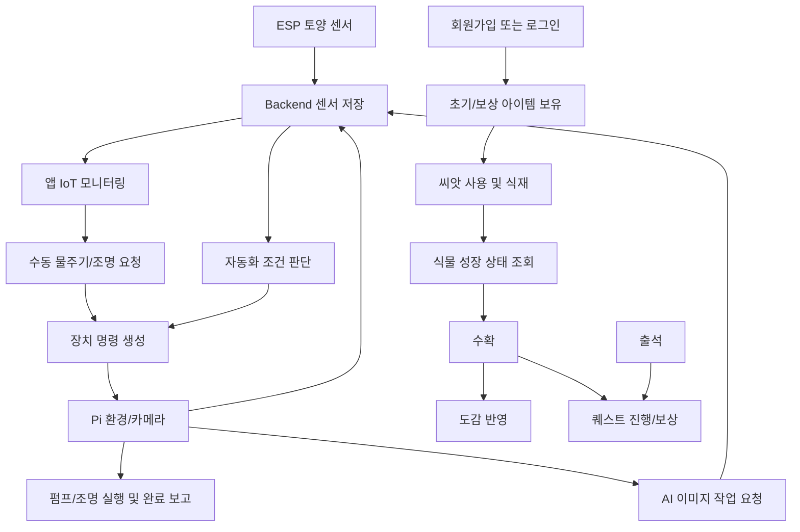
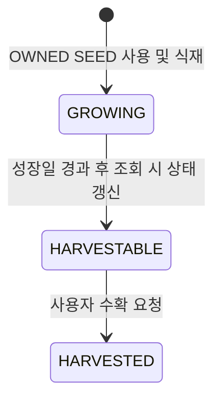
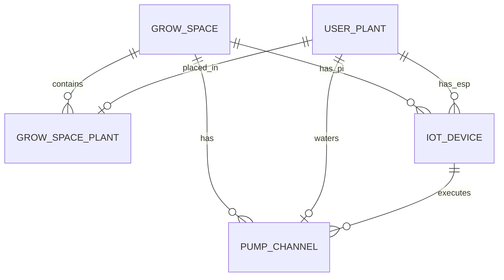
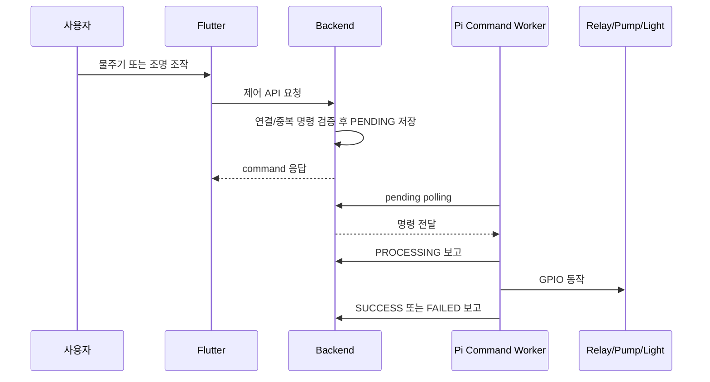
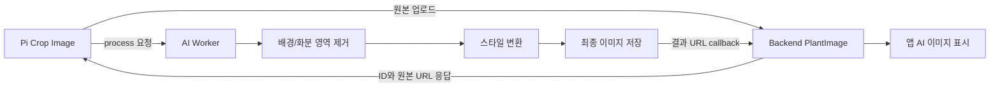

# GreenLink 기능 명세서

## 1. 문서 목적과 범위

이 문서는 GreenLink 전체 소스에 구현된 기능을 사용자/장치/운영자 관점에서 재구성한 현행 기능 명세서입니다. 계획된 기능을 추정해 기술하는 것이 아니라, Backend Service와 Domain, Flutter 화면/Service, ESP firmware, Raspberry Pi 실행 코드, Ubuntu AI Worker에서 실제로 확인되는 동작을 기준으로 합니다.

| 영역 | 기능 책임 |
| --- | --- |
| Flutter App | 로그인, 육성/인벤토리/도감/퀘스트 UI, IoT 모니터링 및 제어 UI |
| Backend | 계정, 마스터/사용자 데이터, 장치 구성, 센서 저장, 명령 생성, 자동화, AI 결과 저장 |
| ESP32 | 토양 수분 측정과 직접 서버 전송 |
| Raspberry Pi | 환경 센서, 카메라 stream/업로드, 펌프/조명 실행, AI 작업 요청 |
| Ubuntu AI Worker | 원본 사진의 배경 제거/스타일 변환/저장 및 결과 callback |

API의 필드와 HTTP 계약은 별도 문서 [API_SPECIFICATION.md](API_SPECIFICATION.md)를 참조합니다.

## 2. 시스템 목적

GreenLink는 사용자가 앱에서 가상 육성 흐름과 실제 식물 재배 데이터를 함께 관리하도록 구성된 시스템입니다. 확인된 핵심 목적은 다음과 같습니다.

* 사용자가 계정을 만들고 씨앗, 화분, 영양제 기반의 식물 육성을 수행합니다.
* 센서가 측정한 온도, 습도, 조도, 토양 수분을 앱에서 조회합니다.
* 사용자가 물주기와 조명을 요청하거나, 설정한 자동화 기준으로 서버가 명령을 생성합니다.
* Raspberry Pi가 실제 펌프와 조명을 제어하고 실행 결과를 서버에 보고합니다.
* 식물 사진은 원본 및 AI 스타일 변환 결과로 앱에 표시될 수 있습니다.
* 출석, 수확, 퀘스트 보상 및 수확 도감을 제공합니다.

## 3. 사용자와 외부 행위자

| 행위자 | 수행 가능 기능 | 인증/식별 |
| --- | --- | --- |
| 비로그인 사용자 | 회원가입, 로그인, OAuth 로그인, 식물/아이템/퀘스트 마스터 조회 | 없음 |
| 일반 사용자 | 본인 식물/아이템/퀘스트/출석/도감, IoT 조회 및 제어, 자동화 설정 | JWT |
| 관리자 | 마스터 데이터 생성, 관리자 웹 관리 화면 | ADMIN JWT 권한 전제 |
| ESP32 센서 장치 | 토양 수분 전송 | 장치 키 |
| Raspberry Pi 장치 | 환경값/이미지 전송, 명령 조회 및 결과 보고, 영상 stream 제공 | Backend 요청은 장치 키; stream 보호는 확인되지 않음 |
| Ubuntu AI Worker | 이미지 처리 접수, 변환 결과 callback | Backend callback은 `X-AI-Worker-Secret` shared secret header로 검증 |
| 외부 OAuth 제공자 | 로그인 사용자 프로필 제공 | OAuth 설정 필요 |
| 외부 이미지/객체 저장 서비스 | 원본/결과 이미지 저장 및 AI 변환 | 별도 자격 증명 필요 |

## 4. 전체 기능 흐름

## 5. 기능 목록 요약

| ID | 기능명 | 주 사용 주체 | 구현 상태 | 주요 근거 |
| --- | --- | --- | --- | --- |
| F-AUTH-01 | 일반 회원가입/로그인 | 사용자 | 구현됨 | `AuthService`, 인증 화면 |
| F-AUTH-02 | Kakao/Google OAuth 로그인 | 사용자 | 구현 코드 있음, 설정 필요 | OAuth service/client, Flutter auth |
| F-USER-01 | 내 정보 및 닉네임 수정 | 사용자 | Backend 구현됨 | `UserController`, `UserService` |
| F-PLANT-01 | 식재, 성장 표시, 별명, 수확 | 사용자 | 구현됨 | `UserPlantService`, Flutter screens |
| F-ITEM-01 | 인벤토리, 화분, 영양제 | 사용자 | 구현됨 | `UserItemService` |
| F-QUEST-01 | 퀘스트 목록/상세/보상 | 사용자 | 구현됨 | `UserQuestService` |
| F-ATTEND-01 | 출석과 연속 출석 | 사용자 | 구현됨 | `AttendService` |
| F-COLL-01 | 수확 도감 | 사용자 | 구현됨 | `CollectionService` |
| F-IOT-SETUP-01 | 공간/장치/펌프 연결 구성 | 로그인 사용자 | 구현됨, 권한 범위 주의 | `IotSetupService` |
| F-SENSOR-01 | 토양 수분 수집 | ESP32 | 구현됨 | `main.cpp`, `IotDeviceDataService` |
| F-SENSOR-02 | 환경 데이터 수집 | Pi | 구현됨 | `sensor_*.py`, `IotDeviceDataService` |
| F-CAMERA-01 | 실시간 MJPEG 및 원본 사진 저장 | Pi/App | 구현됨, 일부 대안 경로 오류 | `stream_server.py`, `camera_main.py` |
| F-CONTROL-01 | 수동 물주기/조명 | 사용자/Pi | 구현됨 | `IotAppService`, `command_worker.py` |
| F-AUTO-01 | 자동 물주기/조명 | Backend/Pi | 구현됨 | `AutomationService` |
| F-AUTO-02 | 데이터 기반 자동화 임계치 산출 | 사용자/Backend | 구현됨 | `AutomationLearningService` |
| F-AI-01 | 사진 AI 스타일 변환 | Pi/AI Worker/App | 구현됨, 실패 복구 미확인 | AI Python 코드 |
| F-ADMIN-01 | 마스터/사용자/장치 관리 | 관리자 | 부분 구현 | `AdminController`, `AdminWebController` |
| F-GAP-01 | 센서 즉시 갱신 UI | 사용자/Pi | 연결 불완전 | Flutter/Pi 구현, Backend 미구현 |

## 6. 인증 및 사용자 기능

### F-AUTH-01 일반 회원가입과 로그인

| 항목 | 명세 |
| --- | --- |
| 목적 | 일반 사용자가 계정을 생성하고 인증된 앱 기능에 진입하게 합니다. |
| 시작 조건 | 가입 시 이메일/비밀번호/닉네임 입력, 로그인 시 등록 계정 존재 |
| 입력 | 가입: 이메일, 비밀번호, 닉네임. 로그인: 이메일, 비밀번호 |
| 처리 | 이메일 중복 검사, 비밀번호 BCrypt 저장/검증, 로그인 시 JWT 생성 |
| 회원가입 후 처리 | 기본 씨앗 1종과 기본 화분 1종을 보유 아이템으로 지급하고 활성 업적 퀘스트를 사용자에게 생성 |
| 출력 | 가입 정보와 지급 아이템, 또는 로그인 접근 토큰 및 사용자 정보 |
| 실패 조건 | 중복 이메일, 잘못된 로그인, 기본 마스터 아이템 미등록 |
| 관련 UI | `LoginPage`, `SignupPage`, `SplashPage` |
| 관련 API | `POST /api/auth/signup`, `POST /api/auth/login` |

**승인 기준**

1. 유효한 가입 요청은 새 사용자와 초기 아이템 데이터를 만듭니다.
2. 이미 존재하는 이메일 가입은 거부됩니다.
3. 올바른 자격 증명의 로그인만 접근 토큰을 반환합니다.
4. 저장된 토큰이 있는 앱은 메인 화면으로 이동하며, API 401 이후 로그인 화면으로 복귀합니다.

**주의사항**

* 기본 지급 마스터 아이템이 DB에 선행 생성되어 있어야 합니다.
* Flutter는 접근 토큰을 로컬 일반 저장소에 저장하고 디버그 로그에 토큰 일부를 출력하는 코드가 있어 보안 수정이 필요합니다.

### F-AUTH-02 OAuth 로그인

| 항목 | 명세 |
| --- | --- |
| 목적 | Kakao 또는 Google 계정으로 인증하고 GreenLink 사용자를 연결/생성합니다. |
| 입력 | 제공자의 인가 코드, redirect URI |
| 처리 | 외부 provider 토큰/프로필 획득, provider 식별자로 기존 계정 조회 또는 생성, 초기 아이템/업적 보정, JWT 발급 |
| 출력 | 일반 로그인과 동일한 로그인 응답 |
| 전제 | provider client 설정값과 플랫폼 등록이 외부에서 올바르게 제공되어야 함 |
| 관련 API | `POST /api/auth/oauth/kakao`, `POST /api/auth/oauth/google` |

외부 OAuth 구성의 실제 작동값과 배포 redirect 설정은 코드상 확인되지 않습니다.

### F-USER-01 내 정보

Backend에는 내 정보 조회 및 닉네임 변경 기능이 존재합니다. Flutter의 API 경로 상수에는 내 정보 endpoint가 있으나, 현재 확인한 주요 앱 서비스 구조에서 이 기능의 완전한 화면 연계 여부는 명확히 확인되지 않습니다.

## 7. 식물 육성 및 아이템 기능

### F-PLANT-01 씨앗 식재와 성장 상태

| 항목 | 명세 |
| --- | --- |
| 목적 | 사용자가 보유한 씨앗을 실제 키우는 식물 인스턴스로 전환합니다. |
| 시작 조건 | 로그인 사용자에게 `OWNED` 상태의 `SEED` 아이템이 있으며, 그 씨앗 마스터가 Plant에 연결되어 있음 |
| 입력 | 사용할 user item ID, 선택 별명 |
| 처리 | 씨앗 소유/유형/상태 검사, `UserPlant` 생성, 씨앗을 사용 상태로 변경 |
| 상태 | `GROWING`에서 성장일이 지나면 조회 시 `HARVESTABLE`, 수확 후 `HARVESTED` |
| 출력 | 식물 ID, 종류, 별명, 상태, 식재/예상 수확 가능 시각 |
| 관련 API | 사용자 식물 생성/목록/상세/별명/수확 API |
| 관련 UI | 홈, 식물 목록, 식재 화면, 식물 상세 |

**수확 처리**

1. Backend가 사용자 소유 식물을 조회합니다.
2. 오늘 날짜 기준으로 수확 가능 상태를 갱신합니다.
3. 아직 성장 중이거나 이미 수확된 식물은 거부합니다.
4. 수확 시각과 `HARVESTED` 상태를 저장합니다.
5. `TargetType.HARVEST`와 `TargetType.GROW_PLANT` 퀘스트 진행도를 1씩 증가시킵니다.
6. 컬렉션 조회 시 수확 기록으로 표시됩니다.

**코드상 제한**

현재 `GROW_PLANT` 진행도는 식재 시점이 아니라 수확 성공 시점에 증가합니다.

### F-ITEM-01 인벤토리와 아이템 사용

| 세부 기능 | 입력 | 처리 규칙 | 결과 |
| --- | --- | --- | --- |
| 아이템 목록 | 선택 item type/status | 마스터 아이템별로 보유 row를 그룹화하고 상태별 count 계산 | 앱 인벤토리 표시 |
| 화분 장착 | 보유 화분, 대상 식물 | `OWNED` 상태의 `POT`만 가능; 해당 식물의 기존 장착 화분은 해제 | `EQUIPPED` |
| 화분 해제 | 장착 중 화분 | `EQUIPPED` 상태 `POT`만 가능 | 다시 소유 상태 처리 |
| 영양제 사용 | 보유 영양제, 대상 식물 | `OWNED` 상태 `NUTRIENT`만 가능 | 사용 상태와 대상 식물 연결 |
| 씨앗 사용 | 보유 씨앗 | 식재 기능에서만 처리 | `USED` 및 새 식물 |

영양제를 사용했을 때 성장일 감소, 센서 임계치 변경 등 추가 효과를 적용하는 로직은 확인되지 않습니다.

## 8. 퀘스트, 출석 및 도감 기능

### F-QUEST-01 퀘스트 생성, 진행 및 보상

| 항목 | 명세 |
| --- | --- |
| 목적 | 기간형 또는 업적형 목표와 아이템 보상을 제공합니다. |
| 퀘스트 구분 | 일간, 주간, 월간, 업적 |
| 반복 주기 | 일간, 주간, 월간, 반복 없음 |
| 상태 | 진행 중, 수령 가능, 완료, 만료 |
| 목록 처리 | 현재 기간에 필요한 사용자 퀘스트를 생성하고, 지난 진행 중 기간형 기록은 만료 처리하며 현재 목록에서 숨김 |
| 상세 처리 | 이미 알고 있는 사용자 퀘스트 ID의 상세는 과거 기간도 조회 가능 |
| 보상 처리 | 현재 노출 가능한 상태이며 수령 가능 상태인 경우에만 보상 아이템 row를 수량만큼 생성 |

### 확인된 진행 Trigger

| 목표 타입 | 실제 진행 증가 호출 | 구현 상태 |
| --- | --- | --- |
| `ATTEND` | 오늘 출석 성공 시 `AttendService`에서 증가 | 구현됨 |
| `HARVEST` | 식물 수확 성공 시 `UserPlantService`에서 증가 | 구현됨 |
| `WATERING` | Pi가 WATER 명령 SUCCESS를 보고하면 `IotCommandService`에서 증가 | 구현됨 |
| `GROW_PLANT` | 식물 수확 성공 시 `UserPlantService`에서 증가 | 구현됨 |

### F-ATTEND-01 출석

| 항목 | 명세 |
| --- | --- |
| 입력 | 오늘 출석 요청, 또는 조회할 연/월 |
| 처리 | 사용자-날짜 중복을 방지하고, 전날 출석이 있으면 streak를 증가시킴 |
| 출력 | 오늘 출석/연속 횟수 또는 월별 출석 목록과 current streak |
| 연계 | 성공한 오늘 출석은 `ATTEND` 퀘스트 진행도를 1 증가 |
| 실패 | 같은 날짜 두 번째 출석 거부; 조회 시 year/month 중 하나만 제공하면 거부 |

### F-COLL-01 수확 도감

| 항목 | 명세 |
| --- | --- |
| 목적 | 모든 식물 마스터에 대해 사용자의 수확 여부와 기록을 제공합니다. |
| 목록 | 수확 여부, 수확 횟수, 최초 수확 시각을 표시 |
| 상세 | 식물 설명과 사용자가 수확한 개별 식물 목록/식재 및 수확 시각 제공 |
| 데이터 원천 | `Plant` 마스터와 `HARVESTED` 사용자 식물 기록 |

## 9. IoT 설치와 장치 등록 기능

### F-IOT-SETUP-01 재배 공간 구성

IoT 동작 전 필요한 연결 관계는 다음과 같습니다.

| 구성 기능 | 조건 | 사용 목적 |
| --- | --- | --- |
| 재배 공간 생성 | 이름 중복 불가 | Pi 환경값과 식물/펌프를 묶는 단위 |
| 식물-공간 연결 | 로그인 사용자의 식물, 한 식물의 중복 연결 불가 | IoT 조회/이미지/자동화 기준 |
| Raspberry Pi 등록 | 공간 ID 필수, 특정 식물 ID를 직접 가질 수 없음 | 공간 공통 센서와 명령 실행 |
| ESP32 등록 | 사용자 식물 ID 필수, 선택 공간은 식물 연결과 일치해야 함 | 식물별 토양 수분 |
| 펌프 채널 등록 | 공간/식물/Pi 연결 일치, 식물당 1개 | WATER 명령 GPIO 정보 |

**권한 및 보안상 현행**

* IoT 구성 API는 ADMIN 전용으로 제한되지 않고 로그인 사용자 경로로 분류되어 있습니다.
* 목록 서비스는 전체 장치/펌프 데이터를 반환하며 사용자별 범위 제한이 확인되지 않습니다.
* 장치/펌프 응답 DTO가 장치 인증 키 필드를 포함합니다. 이는 기능상 필요 여부와 무관하게 제거가 필요한 보안 위험입니다.

## 10. 센서 수집 및 모니터링 기능

### F-SENSOR-01 ESP 토양 수분 수집

| 항목 | 명세 |
| --- | --- |
| 장치 | PlatformIO Arduino 기반 ESP32 |
| 센서 입력 | GPIO 34 analog 입력 |
| 측정 처리 | 여러 raw 샘플을 평균한 후 건조/습윤 calibration으로 0~100% 수분값 환산 |
| 전송 주기 | 부팅 직후 전송 후 코드상 10분 간격 |
| 통신 | Wi-Fi를 통해 Backend 토양 수분 API로 JSON POST, 장치 키 header 포함 |
| 서버 처리 | 활성 ESP와 연결 식물을 확인하고 `EspSensorData` 저장, 연결 시각 갱신, 자동 급수 평가 |
| 오류 처리 | Wi-Fi 연결 실패 시 재연결/장치 재시작; 실패 payload 영속 큐는 없음 |

ESP와 Pi 사이에 직접 통신하는 기능은 코드상 확인되지 않습니다.

### F-SENSOR-02 Pi 환경 데이터 수집

| 항목 | 명세 |
| --- | --- |
| 입력 장치 | DHT22 온도/습도, BH1750 조도 |
| 측정 처리 | DHT 측정 재시도와 값 범위 검사, 조도 I2C 측정, 측정 시각 부여 |
| 전송 | Backend 환경 데이터 API로 JSON POST, 장치 키 header |
| 서버 처리 | Pi 및 공간 연결 확인, `RaspberrySensorData` 저장, 자동 조명 평가 |
| 실행 단위 | `sensor_main.py`는 1회 업로드; 반복 실행 등록은 저장소에서 확인되지 않음 |

### F-MONITOR-01 앱 IoT 상태 조회

| 표시 데이터 | 출처 | UI 사용 |
| --- | --- | --- |
| 온도, 습도, 조도 | 공간별 최신 Pi 데이터 | 상태 카드 |
| 토양 수분 raw/percent | 식물별 최신 ESP 데이터 | 상태/물 부족 또는 과습 안내 |
| 원본 이미지 | Pi 사진 업로드 | 식물 사진 |
| AI 이미지 | AI Worker 결과 callback | 존재 시 원본보다 우선 표시 가능 |
| 실시간 영상 | Pi MJPEG stream | IoT 화면 영상 위젯 |

Flutter가 사용하는 토양 안내 기준은 앱 코드의 상수 판정이며, Backend 자동 급수 설정값과 동일한 규칙이라고 보장되지는 않습니다.

## 11. 제어 명령 기능

### F-CONTROL-01 수동 급수와 조명

| 항목 | 급수 | 조명 켜기/끄기 |
| --- | --- | --- |
| 시작 주체 | 앱 사용자 | 앱 사용자 |
| Backend 검증 | 소유 식물, 공간, 활성 펌프/Pi, 처리 중 급수 없음 | 소유 식물, 공간, 활성 Pi, 처리 중 조명 없음 |
| 생성 명령 | `WATER` | `LIGHT_ON`, `LIGHT_OFF` |
| 실행 장치 | Raspberry Pi 펌프 relay | Raspberry Pi LED relay |
| 결과 저장 | Pi가 processing/complete 보고 | Pi가 processing/complete 보고 |

### 명령 상태 규칙

| 현재 상태 | 동작 | 결과 상태 | 조건 |
| --- | --- | --- | --- |
| 신규 | 명령 생성 | `PENDING` | 앱/자동화 검증 통과 |
| `PENDING` | Pi 처리 시작 | `PROCESSING` | 해당 Pi 장치 키와 명령 소유 일치 |
| `PROCESSING` | Pi 성공 완료 | `SUCCESS` | `success=true` 결과 |
| `PROCESSING` | Pi 실패 완료 | `FAILED` | `success=false` 결과 |
| 대기/처리 중 | entity cancel 메서드 | `CANCELLED` | 이를 노출하는 API는 확인되지 않음 |

### 현행 제어 제한과 불일치

* 급수 duration은 Entity 기본값, Controller/DTO 설명, Pi fallback 모두 1초로 통일되어 있습니다.
* Pi worker는 응답에 duration이 없을 경우 1초를 fallback으로 사용합니다.
* 수동/자동 구분 없이 WATER 명령이 SUCCESS로 완료되면 `WATERING` 퀘스트 진행도가 증가합니다.

## 12. 자동화 기능

### F-AUTO-01 설정 기반 자동 급수

| 항목 | 명세 |
| --- | --- |
| Trigger | ESP 토양 수분 데이터 저장 직후 |
| 활성 조건 | 해당 식물 설정의 `autoWaterEnabled=true` |
| 판단값 | 설정 수분 임계치 또는 사용 가능한 학습 모델 추천값 |
| 실행 조건 | 수분값이 임계치 이하, 대기/처리 중 WATER 없음, cooldown 경과, 공간/Pi/펌프 연결 존재 |
| 실행 결과 | Pi 대상 `WATER` 명령 생성 및 실행 로그 저장 |
| Skip 결과 | 비활성, 센서값 없음, 임계치 미충족, 중복, cooldown, 장치 미구성에 대해 skip 로그 저장 |

### F-AUTO-01 설정 기반 자동 조명

| 항목 | 명세 |
| --- | --- |
| Trigger | Pi 환경 데이터 저장 직후 |
| 적용 단위 | 센서는 GrowSpace 단위이나 설정과 로그는 연결된 각 UserPlant 단위 |
| 활성 조건 | 식물 설정의 `autoLightEnabled=true` |
| 시간 조건 | 동작 시간 밖이면 `LIGHT_OFF` 후보 |
| 조도 조건 | 시작 시간 범위 안에서 조도가 ON 임계치 이하이면 ON, OFF 임계치 이상이면 OFF |
| 방지 조건 | 진행 중 ON/OFF 명령 또는 최근 cooldown 내 명령 |
| 결과 | 명령 생성 또는 skip 로그 |

조명은 공간 장치인데 중복/cooldown 검사가 식물별 명령 기준으로 수행됩니다. 동일 공간에 여러 식물 설정이 존재할 때 물리 조명에 상충 명령이 생기지 않는지는 추가 검증이 필요합니다. 이는 코드 구조에서 도출되는 운영 위험입니다.

### F-AUTO-02 데이터 기반 임계치 산출

| 항목 | 명세 |
| --- | --- |
| 시작 | 사용자가 자동화 학습 API 요청 |
| 분석 기간 | 최근 14일 |
| 입력 | ESP 수분 데이터, Pi 조도 데이터, 물주기 명령 기록 |
| 최소 조건 | 설정의 `minLearningDataCount`; 기본 30개의 토양 데이터 |
| 데이터 부족 결과 | `INSUFFICIENT_DATA` 모델 저장 |
| 수분 추천 | 물주기 직전 평균 수분에 보정값을 더하고 코드 범위로 제한 |
| 조도 추천 | 충분한 조도 데이터에서 낮은/높은 분위수 기반 ON/OFF 임계치 산출 |
| 신뢰도 | 토양/조도 데이터 수, 물주기 명령 수, 수분 회복 샘플 수 가중 계산 |
| 설정 자동 반영 | `autoOptimizeEnabled=true`이며 confidence가 기준 이상이면 추천 임계치를 설정에 적용 |

이 기능은 코드상 통계 규칙 기반 임계치 산출입니다. 별도 학습 파일 또는 외부 머신러닝 모델을 학습하는 기능은 확인되지 않습니다.

### 자동화 설정 화면 계약

Flutter의 `wateringSafetyEnabled` 설정은 Backend 설정 DTO와 Entity에 저장되며, 과습 안전 모드가 켜진 경우 수동/자동 급수에서 토양수분 안전 기준을 검사합니다.

## 13. 카메라 및 AI 이미지 기능

### F-CAMERA-01 영상 stream과 원본 업로드

| 세부 기능 | 처리 |
| --- | --- |
| 실시간 영상 | Pi Flask 서버가 카메라 프레임을 MJPEG로 제공하고 Flutter가 직접 byte stream을 파싱하여 표시 |
| 식물 crop | Pi 설정의 crop 기준으로 전체 frame에서 식물별 이미지를 생성 |
| 원본 업로드 | Pi가 장치 키와 multipart 이미지, 식물 ID/촬영 시각을 Backend에 전송 |
| 저장 | Backend가 이미지 형식/크기를 검사하고 객체 저장소 URL과 `PlantImage`를 저장 |

**확인된 문제**

* 영상 stream endpoint 인증 로직은 확인되지 않습니다.
* 별도 `camera_snapshot_main.py`는 stream server가 제공하지 않는 `/snapshot.jpg` route를 사용합니다.
* 식물별 crop과 사용자 식물 매핑은 Pi 설정 코드에 고정되어 있습니다.

### F-AI-01 이미지 AI 변환

| 항목 | 명세 |
| --- | --- |
| 시작 Trigger | Pi가 Backend 원본 이미지 업로드 성공 응답을 받은 후 AI Worker `/process` 요청 |
| 접수 | Worker가 background task로 처리하고 즉시 `PROCESSING` 상태 응답 |
| 입력 | Backend plant image ID, 사용자 식물 ID, 원본 URL, 선택 이름 |
| 전처리 | 원본 다운로드 후 `rembg` pretrained 모델로 배경 제거, 하단 비율을 화분 영역으로 투명 처리 |
| 이미지 변환 | 전처리 식물과 스타일 참조 asset을 외부 image edit API에 전달 |
| 결과 저장 | 최종 PNG를 객체 저장소에 업로드 |
| 결과 연결 | Worker가 Backend AI result callback에 최종 URL을 전송 |
| 앱 표시 | IoT 최신/사진 응답의 `aiImageUrl`이 있으면 UI에서 활용 |

**실패/운영 제한**

* AI worker background 작업의 영속 queue, 상태 조회, 실패 callback 및 자동 재시도는 확인되지 않습니다.
* Pi에서 AI trigger가 실패하더라도 이미 완료된 원본 업로드는 취소되지 않습니다.
* AI Worker endpoint와 Backend 결과 callback의 서비스 인증은 확인되지 않습니다.
* Worker 로컬 `inputs/`, `outputs/` 산출물 정리 정책은 확인되지 않습니다.

## 14. 관리자 기능

### F-ADMIN-01 마스터 데이터 관리

| 기능 | REST API | Web UI | 구현된 핵심 처리 |
| --- | --- | --- | --- |
| 식물 등록 | 있음 | 목록/등록 있음 | 이름 중복 검사, 성장일 포함 생성 |
| 아이템 등록 | 있음 | 목록/등록 있음 | 씨앗은 연결 식물 필수, 화분/영양제 생성 |
| 퀘스트 등록 | 있음 | 목록/등록 있음 | 목표/보상/반복 주기 생성, 보상 수량 규칙 검사 |
| 사용자 목록/상세 | REST 확인되지 않음 | 있음 | 조회, role toggle, soft delete |
| IoT 장치 등록 | REST는 구성 API 별도 존재 | 관리자 웹 있음 | 장치 유형별 연결 생성 |

### 관리자 접근 제한

* `/api/admin/**`와 로그인 화면 외 `/admin/**`는 ADMIN 권한으로 설정되어 있습니다.
* 관리자 로그인 HTML 화면은 존재하지만 Security의 form login이 비활성화되어 있고 해당 화면을 처리할 POST 로그인 endpoint는 확인되지 않습니다.
* 관리자가 JWT를 어떻게 확보하여 Web 화면에 접근하는지에 대한 완결된 흐름은 코드상 확인되지 않습니다.

## 15. 앱 화면 기능 구성

| 화면 영역 | 사용자 기능 | 연결된 Backend/외부 기능 | 상태 |
| --- | --- | --- | --- |
| Splash / Login / Signup | 자동 로그인 분기, 일반/OAuth 로그인, 가입 | Auth API, 저장 토큰 | 구현됨 |
| Home | 대표/보유 식물, 이미지, 수확 진입 | Home, UserPlant, IoT latest | 구현됨 |
| Inventory | 보유 아이템 필터, 화분/영양제, 식재 이동 | UserItem, UserPlant | 구현됨 |
| Collection | 수확 도감 목록/상세 | Collection API | 구현됨 |
| Quest / Attend | 퀘스트/보상, 출석 달력/오늘 출석 | Quest, Attend API | 구현됨 |
| Plant Detail | 식물 상세, 별명, 수확, IoT/자동화 진입 | UserPlant, IoT, Automation | 구현됨 |
| IoT Status | 센서값, 이미지/영상, 수동 제어, 갱신 버튼 | IoT API, Pi MJPEG | 갱신 버튼 계약 불완전 |
| Automation Section | 자동화 toggle/임계치, 학습 모델과 로그 | Automation API | 구현됨 |
| Settings | 로그아웃 중심 동작 | 로컬 토큰 처리 | 사용자 정보 연동 범위 확인 필요 |

## 16. 상태와 데이터 저장 규칙

### 핵심 상태 모델

| 데이터 | 상태 또는 핵심 속성 | 상태를 바꾸는 기능 |
| --- | --- | --- |
| 사용자 식물 | `GROWING`, `HARVESTABLE`, `HARVESTED` | 조회 상태 갱신, 수확 |
| 사용자 아이템 | `OWNED`, `EQUIPPED`, `USED` | 식재, 화분 장착/해제, 영양제 사용, 보상 |
| 사용자 퀘스트 | `IN_PROGRESS`, `ACHIEVABLE`, `COMPLETED`, `EXPIRED` | 출석/수확/WATER 완료 진행, 기간 만료, 보상 수령 |
| 장치 명령 | `PENDING`, `PROCESSING`, `SUCCESS`, `FAILED`, `CANCELLED` | 앱/자동화 생성, Pi 실행 보고 |
| 자동화 모델 | `INSUFFICIENT_DATA`, `READY`, `FAILED` | 수동 학습 요청 |
| AI 이미지 | 결과 상태 필드 포함 | AI callback 저장 |

### 데이터 이동 경로

| 데이터 | 생성 주체 | 서버 저장 데이터 | 소비 기능 |
| --- | --- | --- | --- |
| 토양 수분 | ESP32 | `EspSensorData` | 앱 상태, 자동 급수, 모델 산출 |
| 온도/습도/조도 | Pi | `RaspberrySensorData` | 앱 상태, 자동 조명, 모델 산출 |
| 원본 사진 | Pi | `PlantImage` + 객체 저장소 URL | 앱 이미지, AI 입력 |
| AI 사진 | AI Worker | `AiPlantImage` + 결과 URL | 앱 이미지 |
| 명령/결과 | Backend/Pi | `DeviceCommand` | GPIO 실행, 로그/모델 |
| 자동화 판단 | Backend | `AutomationLog` | 앱 자동화 이력 |

## 17. 기능별 미구현 또는 계약 불일치

| ID | 내용 | 근거 | 사용자/운영 영향 |
| --- | --- | --- | --- |
| GAP-01 | 앱의 IoT sensor refresh API 없음 | Flutter `iot_service.dart`에는 호출, Backend Controller에는 없음 | 갱신 버튼 실패 |
| GAP-02 | Pi의 `SENSOR_REFRESH` 분기는 있으나 서버 명령 enum/생성 경로 없음 | `command_worker.py` 대 `CommandType.java` | Pi 기능이 도달 불가능 |
| GAP-03 | `wateringSafetyEnabled` Backend 반영 | 자동화 설정 저장, 수동/자동 급수 safety 체크 | 해소됨 |
| GAP-04 | 급수 시간 기준 1초로 통일됨 | Backend 주석/DTO, `DeviceCommand`, Pi fallback | 해소됨 |
| GAP-05 | `WATERING`, `GROW_PLANT` 퀘스트 목표 진행 연결 | WATER SUCCESS와 수확 시점에 `increaseProgress` 호출 | 해소됨 |
| GAP-06 | 관리자 웹 로그인 완료 흐름 확인 안 됨 | form login disabled, 대응 POST 없음 | 관리자 HTML 접근 곤란 |
| GAP-07 | Pi snapshot 대안 경로가 존재하지 않는 route 사용 | Pi camera scripts | 해당 실행 진입점 실패 |

## 18. 보안 및 운영 요구사항

아래는 현재 코드가 기능 수행 과정에서 드러내는 필수 보완 사항입니다.

| 우선순위 | 요구사항 | 현재 코드 근거 |
| --- | --- | --- |
| 높음 | 장치 키, 서버 주소, JWT/SDK/클라우드 설정은 소스 밖에서 주입하고 기존 노출값은 회전해야 함 | 각 영역 코드에 민감 설정 종류 존재 |
| 높음 | IoT 구성 목록 권한을 제한해야 함 | Backend Service가 전체 목록을 반환 |
| 높음 | AI worker 요청과 Backend callback의 서비스 인증을 운영 secret으로 관리해야 함 | Backend callback은 shared secret header를 검증하며, Worker `/process` 접근 통제는 별도 운영 정책 필요 |
| 높음 | 앱 로그에서 토큰을 출력하지 않아야 함 | Flutter `ApiClient` |
| 중간 | 영상 stream 접근 통제를 정의해야 함 | Pi stream route 인증 없음 |
| 중간 | Pi/AI 작업의 systemd/cron, 재시작, 로그 보존 및 실패 재시도 정책을 명시해야 함 | 실행 스크립트만 있고 운영 정의 없음 |
| 중간 | 통합 계약 테스트로 Flutter-Backend-Pi enum/DTO를 검증해야 함 | 확인된 계약 불일치 다수 |
| 중간 | 자동 제어에는 최대 급수 제한과 장치 오류 시 안전 중단을 검토해야 함 | relay off 처리 외 물리 피드백 확인되지 않음 |

## 19. 구현 추적표

| 기능 ID | Backend | Frontend | Device / AI |
| --- | --- | --- | --- |
| F-AUTH-01/02 | `AuthController`, `AuthService`, `service/oauth` | `auth_service.dart`, auth screens, `splash_page.dart` | - |
| F-PLANT-01 | `UserPlantController`, `UserPlantService`, `UserPlant` | user plant/home screens | - |
| F-ITEM-01 | `UserItemController`, `UserItemService`, `UserItem` | inventory screens | - |
| F-QUEST-01 | `UserQuestController`, `UserQuestService`, `QuestProgressService` | quest widgets/screens | - |
| F-ATTEND-01 | `AttendController`, `AttendService` | `attend_page.dart` | - |
| F-COLL-01 | `CollectionController`, `CollectionService` | collection screens | - |
| F-IOT-SETUP-01 | `IotSetupController`, `IotSetupService` | 전용 설정 UI 확인되지 않음 | 장치 배포 전제 |
| F-SENSOR-01 | `IotDeviceDataService` | IoT 표시 | `greenlink_esp/src/main.cpp` |
| F-SENSOR-02 | `IotDeviceDataService` | IoT 표시 | Pi `sensor_service.py`, `sensor_uploader.py` |
| F-CAMERA-01 | 이미지 저장 서비스 | `MjpegStreamView`, 상세/IoT UI | Pi stream/camera/uploader |
| F-CONTROL-01 | `IotAppService`, `IotCommandService`, `DeviceCommand` | `iot_status_page.dart` | Pi `command_worker.py`, `relay_control.py` |
| F-AUTO-01/02 | `AutomationService`, `AutomationLearningService` | automation section/cards | ESP/Pi 센서 trigger |
| F-AI-01 | `AiPlantImageService` | AI 이미지 표시 로직 | Pi AI trigger, Ubuntu worker |
| F-ADMIN-01 | `AdminService`, admin controllers | - | - |

## 20. 정리 요약

GreenLink는 계정과 육성 게임 기능에 물리 센서/제어 및 이미지 AI 처리를 결합한 시스템으로 구현되어 있습니다. 주요 정상 흐름은 회원가입과 식재, ESP/Pi 센서 저장, 앱 모니터링, 수동 또는 자동 명령 생성, Pi GPIO 실행, 사진 업로드와 AI 결과 표시입니다.

현행 코드에서 제품 동작과 직접 충돌하는 부분은 센서 refresh, 자동화 안전 toggle, 관리자 로그인 및 Pi snapshot 경로입니다. 운영 전에는 장치 키 소스 노출과 AI/영상 접근 인증도 우선 수정 대상입니다.

## 21. 추가로 확인하면 좋은 점

* `GROW_PLANT` 퀘스트를 현재처럼 수확 시점에 유지할지, 별도 식재 시점으로 분리할지.
* sensor refresh를 Backend 명령으로 정식 추가할지 앱에서 제거할지.
* 자동 물주기 안전 설정과 물리적 최대 작동 제한의 최종 요구사항.
* 공간 공용 조명에 여러 식물 설정이 적용될 때의 우선순위 정책.
* 장치 구성/관리 API를 관리자 전용으로 제한할지와 장치 provisioning 절차.
* AI 작업 실패 및 카메라/센서 장애를 사용자에게 노출하는 상태/알림 기능 필요성.
