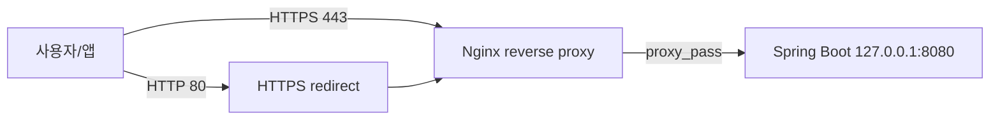

# GreenLink GAP 및 결정사항 재검토

작성일: 2026-05-28

이 문서는 `FUNCTIONAL_SPECIFICATION.md`의 `17. 기능별 미구현 또는 계약 불일치`와 사용자가 제시한 과거/현재 기능 차이를 다시 코드 기준으로 확인한 결과입니다.

민감정보 보호를 위해 실제 서버 URL, IP, 도메인, 버킷명, JWT secret, OAuth client id, Kakao key, Wi-Fi 정보, device key 값은 문서에 그대로 쓰지 않습니다. 값이 코드에 존재하는 경우에는 `<REDACTED_...>` 형태로만 표시합니다.

## 1. 판정 기준

| 분류 | 의미 |
| --- | --- |
| 코드 확인됨 | 저장소 코드에서 구현 또는 값 사용이 직접 확인됨 |
| 코드상 미확인 | 저장소 코드, 설정 파일, 실행 스크립트에서 확인되지 않음 |
| 사용자 운영 확인 | 코드에는 없지만 사용자가 현재 운영 사실로 확인함 |
| 미구현 확정 | 코드에도 없고 사용자가 구현하지 않았다고 확인함 |
| 부분 구현 | 일부 코드가 있으나 호출 경로, 설정, 운영 연결이 불완전함 |

## 2. 전체 결론

| 항목 | 현재 판정 | 요약 |
| --- | --- | --- |
| 센서 즉시 갱신 | GAP 유지 | Flutter와 Pi에는 흐름 일부가 있으나 Backend endpoint와 command enum이 없음 |
| 자동화 안전 토글 | GAP 유지 | Flutter에만 `wateringSafetyEnabled`가 있고 Backend 저장/판단 모델에 없음 |
| 급수 duration | GAP 유지 | Backend 주석은 5초, Entity 기본값은 1초, Pi fallback은 5초 |
| WATERING/GROW_PLANT 퀘스트 | GAP 유지 | `QuestProgressService`는 있으나 실제 호출 지점이 ATTEND/HARVEST뿐임 |
| 관리자 로그인 | GAP 일부 정정 | `/admin/login` POST는 없지만 AJAX `/api/auth/login` + `jwt_token` cookie 흐름은 있음 |
| snapshot 진입점 | GAP 유지 | `camera_snapshot_main.py`는 없는 `/snapshot.jpg` route를 호출함 |
| FCM 푸시 알림 | 미구현 확정 | 사용자가 iOS Apple 개발자 계정 부재로 구현하지 않았다고 확인함 |
| AWS Lightsail | 사용자 운영 확인 | 현재 Ubuntu 서버가 Lightsail이며 Backend와 `greenlink_ubuntu`가 그 서버에서 실행 중이라고 확인됨 |
| 운영 도메인 + Nginx + Certbot HTTPS | 사용자 운영 확인 | Lightsail 서버에서 Nginx active, 80/443 listen, `greenlink` site enabled, Certbot 인증서, 8080 reverse proxy 설정이 확인됨 |
| Cloudflare | 사용자 운영 확인 | 사용자가 현재 서버 도메인 및 실시간 카메라 도메인에 Cloudflare를 사용 중이라고 확인함 |
| AI Worker 운영 | 사용자 운영 확인 | `greenlink-ai.service` systemd 서비스로 실행 중이며 `0.0.0.0:9000` HTTP 서버와 `/health` 정상 응답이 확인됨 |
| Backend 배포 방식 | 사용자 운영 확인 | Spring Boot JAR가 `screen` 세션 내부에서 수동 `java -jar`로 실행 중이며 8080 포트에서 동작. Backend systemd/Docker/배포 스크립트는 확인되지 않음 |
| 운영 설정/credential 위치 | 사용자 운영 확인 | 배포 JAR 내부에 `application.yaml`과 `yaml/application-keys.yaml`이 포함되어 있으며, DB/AWS/OAuth 민감 설정이 JAR 내부에 포함된 것으로 확인됨 |
| S3 이미지 업로드 / MySQL 저장 | 사용자 운영 확인 | 실제 이미지 업로드, S3 저장, MySQL image URL/메타데이터 저장, 앱 조회가 정상 작동함이 확인됨 |
| Git/GitHub 및 CI/CD | 사용자 운영 확인 | Git/GitHub는 사용하지만 자동 CI/CD는 사용하지 않음. 로컬 빌드 후 JAR를 서버로 수동 전송하고 `screen`에서 실행 |
| Lightsail 방화벽 | 사용자 운영 확인 / 보안 위험 | 3306, 8080, 9000 포트가 Any IPv4 address로 열려 있음. 단 8080/9000은 현재 Pi가 직접 호출하므로 제한 전 Pi 접근 경로 변경 또는 Pi IP 허용 필요 |
| Raspberry Pi systemd | 사용자 운영 확인 | `greenlink-command.service`, `greenlink-stream.service`가 등록되어 active running 상태이며 `Restart=always`, `RestartSec=5` 자동 재시작 정책이 확인됨 |
| Raspberry Pi crontab | 사용자 운영 확인 | `run_sensor.sh`는 10분마다 `sensor_main.py`를 실행하고, `run_camera.sh`는 매일 09시/21시에 `camera_main.py`를 실행함 |
| Raspberry Pi camera stream | 사용자 운영 확인 | `stream_server.py`가 실행 중이며 `0.0.0.0:8000`에서 listen 중 |
| Raspberry Pi API 흐름 | 사용자 운영 확인 | 센서 업로드, 이미지 업로드, AI Worker 직접 호출, device command 조회/상태 보고 endpoint 흐름이 확인됨 |
| Raspberry Pi `config.py` | 사용자 운영 확인 | Backend 직접 포트 호출, AI Worker `/process` 직접 호출, crop/GPIO/sensor/polling 설정이 확인됨. 실제 host/key/운영 DB ID 값은 문서에 쓰지 않음 |

## 3. GAP-01 ~ GAP-07 재검토

| ID | 기존 내용 | 코드 확인 결과 | 현재 판정 | 영향 | 권장 조치 |
| --- | --- | --- | --- | --- | --- |
| GAP-01 | 앱의 IoT sensor refresh API 미구현 | `greenlink_front/lib/services/iot_service.dart`는 `POST /user-plants/{id}/iot/refresh`를 호출한다. `greenlink_back/src/main/java/.../IotAppController.java`에는 `latest`, `images`, `water`, `light/on`, `light/off`만 있고 `refresh` mapping이 없다. | GAP 유지 | 앱의 새로고침 버튼이 서버에서 404/405 계열 실패를 받을 수 있음 | Backend에 refresh endpoint를 추가하거나 Flutter UI/API 호출을 제거 |
| GAP-02 | Pi `SENSOR_REFRESH` 분기는 있으나 Backend 명령 생성 경로 없음 | `greenlink_pi/command_worker.py`는 `SENSOR_REFRESH`를 처리한다. Backend `CommandType.java`는 `WATER`, `LIGHT_ON`, `LIGHT_OFF`만 가진다. | GAP 유지 | Pi 코드는 존재하지만 서버가 해당 명령을 만들 수 없어 도달 불가능 | `CommandType.SENSOR_REFRESH`, command 생성 service, app endpoint를 함께 추가 |
| GAP-03 | `wateringSafetyEnabled`가 Flutter에만 존재 | `automation_models.dart`, `automation_service.dart`, 자동화 UI는 해당 필드를 사용한다. Backend `AutomationDto`, `AutomationSetting`, `AutomationService.updateSetting()`에는 해당 필드가 없다. | GAP 유지 | 토글 UI가 서버 저장/자동화 판단에 반영되지 않음 | 기능을 유지하려면 Backend DTO/Entity/판단 로직에 필드 추가. 폐기라면 Flutter 필드 제거 |
| GAP-04 | 급수 지속시간 1초/5초 불일치 | `IotAppController` 주석은 고정 5초라고 설명한다. `DeviceCommand.DEFAULT_WATER_DURATION_SECONDS`는 1초다. Pi `command_worker.py`는 응답에 duration이 없을 때 5초를 fallback으로 사용한다. | GAP 유지 | 실제 펌프 작동 시간이 문서/주석 기대와 다를 수 있음 | 정책을 1초 또는 5초 중 하나로 확정하고 Controller 주석, Entity 상수, Pi fallback을 일치 |
| GAP-05 | WATERING/GROW_PLANT 퀘스트 목표 진행 호출 없음 | `QuestProgressService.increaseProgress()`는 공통 구현되어 있다. 실제 호출은 `AttendService`의 `ATTEND`, `UserPlantService.harvestUserPlant()`의 `HARVEST`만 확인된다. `createUserPlant()`와 급수 command 완료 처리에는 호출이 없다. | GAP 유지 | 물주기/식재 기반 퀘스트가 달성되지 않을 수 있음 | 식재 성공 시 `GROW_PLANT`, 급수 완료 성공 시 `WATERING` 증가 정책 추가 |
| GAP-06 | 관리자 웹 form login 비활성화, 대응 POST 없음 | `SecurityConfig`에서 `formLogin`은 비활성화되어 있고 `/admin/login` POST controller는 없다. 단, `admin/login.html`은 AJAX로 `/api/auth/login`을 호출하고 `jwt_token` cookie를 저장한다. `JwtAuthenticationFilter`는 Authorization header뿐 아니라 `jwt_token` cookie도 읽는다. | 부분 정정 | 관리자 로그인 흐름은 존재한다. 다만 JS cookie 방식이라 `HttpOnly`, `Secure`, CSRF 관점의 보안 보강 필요 | GAP 표현을 “관리자 로그인 미구현”이 아니라 “JWT cookie 기반 구현, 보안/운영 정책 정리 필요”로 수정 |
| GAP-07 | `camera_snapshot_main.py`가 없는 `/snapshot.jpg` route 사용 | `camera_snapshot_main.py`는 로컬 stream 서버의 `/snapshot.jpg`를 호출한다. `stream_server.py` route는 `/`, `/health`, `/stream.mjpg`, `/stream/sunflower.mjpg`, `/stream/basil.mjpg`만 있다. 현재 active 경로인 `camera_main.py`는 `/stream.mjpg`에서 프레임을 추출한다. | GAP 유지 | 대안 snapshot 진입점을 실행하면 실패 | `camera_snapshot_main.py` 제거 또는 `stream_server.py`에 `/snapshot.jpg` 구현 |

### GAP 흐름도

```mermaid
flowchart TD
    FlutterRefresh[Flutter 센서 새로고침 버튼] --> RefreshAPI[POST /user-plants/{id}/iot/refresh]
    RefreshAPI --> MissingBackend[Backend endpoint 없음]
    MissingBackend --> Fail[앱 요청 실패]

    BackendCommand[Backend DeviceCommand] --> CommandType[CommandType enum]
    CommandType --> WaterLight[WATER/LIGHT_ON/LIGHT_OFF만 존재]
    PiWorker[Pi command_worker.py] --> SensorBranch[SENSOR_REFRESH 처리 분기 존재]
    WaterLight -. 생성 불가 .-> SensorBranch
```

## 4. 과거 문서 기능과 현재 코드 기준 차이

| 과거/기존 표현 | 이번 확인 결과 | 현재 분류 | 근거 |
| --- | --- | --- | --- |
| FCM 푸시 알림, 물 부족/자동 급수 알림 | `pubspec.yaml`과 iOS Pod에는 Firebase/Firebase Messaging 의존성이 있다. 하지만 `lib/`에서 `Firebase.initializeApp`, `FirebaseMessaging`, 토큰 등록, foreground/background handler 사용은 확인되지 않는다. 사용자가 Apple 개발자 계정이 없어 iOS 동작 구현을 하지 않았다고 확인했다. | 미구현 확정 / 의도적 보류 | `greenlink_front/pubspec.yaml`, `greenlink_front/lib/**` 검색 결과 |
| AWS Lightsail 사용 | 저장소에는 Lightsail IaC, 배포 스크립트, 인스턴스 설정 파일이 없다. 사용자가 현재 Ubuntu 서버가 AWS Lightsail이며 Backend와 `greenlink_ubuntu`가 그 서버에서 실행 중이라고 확인했다. | 사용자 운영 확인 | 사용자 확인. 코드상 Lightsail 명시는 없음 |
| 운영 도메인 + Nginx + Certbot HTTPS 배포 | Frontend API client와 camera stream 설정, Pi stream 응답/설정에는 운영 URL 계열 값이 하드코딩되어 있다. 실제 값은 문서에 재기재하지 않는다. 추가로 사용자가 Lightsail 서버 출력으로 Nginx 실행, 80/443 listen, `greenlink` site enabled, Certbot 인증서, 8080 reverse proxy 설정을 확인했다. | 사용자 운영 확인 | 사용자 제공 `systemctl`, `lsof`, `/etc/nginx/sites-available/greenlink`, `certbot certificates` 결과 |
| `python3 camera_main.py --plant sunflower` 형태 CLI | `camera_main.py`에는 `argparse` 또는 `sys.argv` 처리가 없다. `run_camera.sh`도 `python3 camera_main.py`만 실행한다. 식물별 처리는 `config.py`의 고정 crop/userPlantId 상수로 수행된다. | 과거 표현 폐기 / 현재 미지원 | `greenlink_pi/camera_main.py`, `greenlink_pi/run_camera.sh` |
| AI Worker가 구체 IP/포트 사용 | Pi `config.py`와 Ubuntu `process_one.py`에는 Backend/AI Worker 주소가 하드코딩되어 있다. 실제 IP/포트 값은 민감정보로 보아 문서에 쓰지 않는다. | 코드 확인, 보안 개선 필요 | `greenlink_pi/config.py`, `greenlink_ubuntu/process_one.py` |
| 특정 `growSpaceId`, 특정 식물 `userPlantId` 운영 값 | Pi `config.py`에 식물별 고정 `userPlantId` 상수와 주석이 존재한다. 운영 DB ID이므로 값은 문서에 쓰지 않는다. `growSpaceId` 고정 상수는 Pi 코드에서 확인되지 않고 Backend DTO/API 필드로만 확인된다. | userPlantId는 코드 확인, growSpaceId 운영값은 코드상 미확인 | `greenlink_pi/config.py`, Backend IoT DTO |
| 그림 게시판, 친구 시스템, 다중 사용자 한 식물 공유 | 관련 Controller/Service/Entity/Flutter 화면이 확인되지 않는다. | 폐기/미적용 또는 코드상 미확인 | 전체 코드 검색 |
| 알파 마스크 합성 방식 | `alpha_composite.py`는 존재하지만 `process_one.py` 활성 경로에서 import/call되지 않는다. `compose_pot.py`는 첫 줄에 잘못된 문자가 있어 현재 그대로는 실행 오류가 난다. | 폐기/미적용 | `greenlink_ubuntu/alpha_composite.py`, `compose_pot.py`, `process_one.py` |

## 5. 중간 결정사항 재검토

| 항목 | 현재 코드 기준 결정 | 비고 |
| --- | --- | --- |
| ESP32-Pi 연결 방식 | ESP32가 Backend로 직접 HTTP POST한다. Pi가 ESP 데이터를 중계하는 경로는 확인되지 않는다. | `greenlink_esp/src/main.cpp`에서 Backend soil-moisture API로 직접 전송 |
| AI 변환 결과 처리 | 활성 경로는 `process_one.py` → `remove_pot.py` → `openai_transform.py` → S3 업로드 → Backend 결과 저장이다. 원본 alpha를 AI 이미지에 다시 씌우는 `alpha_composite.py`는 호출되지 않는다. | `openai_transform.py`는 prompt와 `gpt-image-1.5` edit 호출을 사용한다. 코드상 `background="transparent"` 또는 `output_format="png"` 파라미터는 확인되지 않는다. |
| 화분 제거 방식 | 학습된 segmentation 모델이 아니라 `rembg` 결과에서 객체 하단 일부를 투명화하는 규칙 기반 처리다. | `remove_pot.py` 원문 기준 `FALLBACK_TRIM_RATIO = 0.24`, `ALPHA_THRESHOLD = 12`, `BOTTOM_PAD_PX = 28` |
| 자동화 모델 | 별도 ML 학습 스크립트나 dataset은 없다. 최근 센서/급수 데이터를 통계적으로 계산해 추천 기준값과 confidence를 저장한다. | `AutomationLearningService` |
| 카메라 캡처 진입점 | 현재 active 경로는 `camera_main.py`로 보인다. 이 파일은 MJPEG `/stream.mjpg`에서 프레임을 가져와 crop 후 업로드한다. | `camera_snapshot_main.py`는 route 불일치로 유지 여부 결정 필요 |
| 관리자 로그인 | Spring Security form login이 아니라 앱 API 로그인과 동일한 `/api/auth/login`을 사용하고 JWT cookie로 관리자 페이지 인증을 처리한다. | 보안 속성/CSRF/운영 정책 정리 필요 |
| 배포 서버 | 사용자가 AWS Lightsail Ubuntu에서 Backend와 AI 코드를 운영 중이라고 확인했다. Backend API는 운영 도메인 + Nginx + Certbot HTTPS로 외부 노출되고, Nginx가 내부 Spring Boot 8080 포트로 reverse proxy한다. Backend는 `screen` 세션 안에서 수동 `java -jar`로 실행 중이고, AI Worker는 `greenlink-ai.service` systemd 서비스로 실행 중이다. | Backend systemd/Docker/배포 스크립트는 확인되지 않음. AI Worker systemd, Nginx/Certbot 운영 설정은 사용자 출력으로 확인됨 |

## 5.1 원문 소스코드 기반 추가 확정

| 파일 | 확인 항목 | 원문 기준 확정값 |
| --- | --- | --- |
| `greenlink_ubuntu/openai_transform.py` | 이미지 edit 모델 | `gpt-image-1.5` |
| `greenlink_ubuntu/openai_transform.py` | 호출 파라미터 | `image=[img1, img2]`, `prompt=PROMPT`, `input_fidelity="high"` |
| `greenlink_ubuntu/openai_transform.py` | 사용하지 않는 파라미터 | `background`, `output_format` 없음 |
| `greenlink_ubuntu/openai_transform.py` | prompt 원문 위치 | `PROMPT` 상수. 원본 식물 형상 보존, 스타일 이미지는 색감/질감 참고, 화분/배경/부가 물체 생성 금지가 핵심 |
| `greenlink_ubuntu/remove_pot.py` | rembg 모델 | `MODEL_NAME = "u2netp"` |
| `greenlink_ubuntu/remove_pot.py` | alpha 기준값 | `ALPHA_THRESHOLD = 12` |
| `greenlink_ubuntu/remove_pot.py` | 화분 제거 비율 | `FALLBACK_TRIM_RATIO = 0.24` |
| `greenlink_ubuntu/remove_pot.py` | 하단 padding | `BOTTOM_PAD_PX = 28` |
| `DeviceCommand.java` | WATER duration 실제 기본값 | `DEFAULT_WATER_DURATION_SECONDS = 1` |
| `DeviceCommand.java` | `durationSeconds` 타입/nullable | `Integer`, 별도 `nullable=false` 없음. WATER는 `1`, LIGHT는 `null` |
| `DeviceCommand.java` | command enum 저장 | `EnumType.STRING`, `nullable=false`, `length=30` |
| `AutomationSetting.java` | 주요 Boolean 기본값 | `autoWaterEnabled=false`, `autoLightEnabled=false`, `autoOptimizeEnabled=false`, `deleted=false` |
| `AutomationSetting.java` | 자동화 기본값 | `decisionMode=HYBRID`, `minLearningDataCount=30`, `waterThresholdPercent=35.0`, `waterCooldownMinutes=30`, `lightOnThresholdLux=300.0`, `lightOffThresholdLux=500.0`, `lightStartTime=08:00`, `lightEndTime=18:00`, `lightCooldownMinutes=10` |
| `AutomationSetting.java` | `wateringSafetyEnabled` | 필드 없음 |
| `AutomationModel.java` | 추천 임계치/통계 타입 | 추천 임계치와 평균/신뢰도는 `Double`, 데이터 개수는 `Integer`, 학습 시각은 `LocalDateTime` |
| `AutomationModel.java` | 상태 기본값/생성 규칙 | `modelStatus`는 `EnumType.STRING`, `nullable=false`; `@PrePersist` 기본값은 `INSUFFICIENT_DATA`, factory에서 `READY`, `FAILED` 지정 |

## 6. “18. 확인이 필요한 것” 재분류

| 항목 | 이번 확인 결과 | 현재 상태 | 필요한 후속 조치 |
| --- | --- | --- | --- |
| 실제 서버 주소/도메인 | Frontend/Pi/Ubuntu 코드에 하드코딩된 운영 URL/IP가 있다. 실제 값은 문서에 노출하지 않는다. | 코드 확인 | `.env` 또는 profile 설정으로 분리 |
| Nginx/Certbot/Cloudflare 적용 여부 | Nginx와 Certbot은 사용자 제공 서버 출력으로 확인됐다. Nginx는 80/443에서 listen하고, 운영 도메인 server block은 내부 Spring Boot 8080 포트로 proxy한다. Cloudflare는 사용자가 서버 도메인 및 실시간 카메라 도메인에서 사용 중이라고 확인했다. | 사용자 운영 확인 | Nginx/Certbot/Cloudflare 설정은 민감값을 제거해 운영 문서로 분리 |
| AWS Lightsail 사용 여부 | 사용자가 현재 Ubuntu가 Lightsail 서버라고 확인했다. | 사용자 운영 확인 | 운영 문서에 “Lightsail에서 Backend/AI 실행” 명시 |
| DB 이름/사용자/비밀번호 운영 값 | 운영 서버 외부 `application-keys.yaml`은 없지만, 배포 JAR 내부에 `BOOT-INF/classes/yaml/application-keys.yaml`이 포함되어 있고 DB password 계열 민감 설정이 포함된 것으로 확인됐다. 값은 문서에 노출하지 않는다. | JAR 내부 포함 확인 | 외부 secret 주입 방식으로 전환 필요 |
| S3 bucket/region/credentials | Backend 코드의 S3 업로드 기능과 설정 key가 있고, JAR 내부 설정에 AWS access/secret key와 S3 설정이 포함된 것으로 확인됐다. 이후 실제 이미지 업로드, S3 저장, MySQL 저장, 앱 조회가 정상 동작함이 확인됐다. | credential 존재 및 권한 유효성 확인 완료 | 값은 문서에 노출하지 않고 JAR 내부 secret 제거 및 외부 주입 방식으로 전환 |
| OAuth client ID/secret 등록 상태 | `application-keys.yaml`에 Kakao/Google OAuth `client-id`, `client-secret`, `token-uri`, `user-info-uri` key가 존재한다. 사용자가 OAuth 기능이 정상 동작한다고 확인했다. 값은 문서에 노출하지 않는다. | 설정값 존재 확인 / 사용자 운영 확인 | 콘솔 화면 자체는 별도 확인 대상이나, 현재 운영 기능 동작으로 등록/값 적용은 확인된 것으로 분류 |
| Kakao 앱 키 운영 값 | Flutter `main.dart`, `auth_service.dart`, iOS `Info.plist`에 Kakao SDK 초기화/redirect scheme 관련 설정이 존재한다. 사용자가 기능 정상 동작을 확인했다. 값은 문서에 노출하지 않는다. | 설정값 존재 확인 / 사용자 운영 확인 | 환경 분리 또는 빌드 flavor 적용 |
| Pi systemd/crontab 실제 등록 | Pi에서 `greenlink-command.service`, `greenlink-stream.service`가 등록되어 active running 상태임이 확인됐다. 두 서비스는 enabled 상태로 부팅 시 자동 실행되고, `greenlink` 사용자 권한, `/home/greenlink/greenlink` 작업 경로, `Restart=always`, `RestartSec=5` 정책으로 실행된다. `greenlink` 사용자 crontab에는 `run_sensor.sh` 10분 주기 실행과 `run_camera.sh` 매일 09시/21시 실행이 등록되어 있고, root crontab은 없다. | 사용자 운영 확인 | cloudflared tunnel 외부 라우팅과 stream 공개 범위는 추가 확인 |
| AI Worker 운영 호스트/포트 | 운영 서버에서 `greenlink-ai.service` systemd 서비스가 실행 중이며 `uvicorn ai_worker_api:app --host 0.0.0.0 --port 9000` 구조로 동작한다고 확인됐다. `/health`는 정상 응답하고, 9000 포트는 HTTP 서버다. | 사용자 운영 확인 | 9000 포트 외부 노출 가능성이 있으므로 보안 그룹/IP 제한 또는 localhost 바인딩 검토 |
| S3 파일명 key 패턴 | Backend 원본 이미지는 `greenlink/userplant/{storedFilename}` 패턴이다. `storedFilename`은 `user-plant-{userPlantId}-{yyyyMMdd-HHmmss}-{uuid8}.{ext}` 또는 `grow-space-{timestamp}-{uuid8}.{ext}`다. Ubuntu AI 결과는 `greenlink/ai/userplant/{원본파일stem}.png`다. | 코드 확인 | S3 lifecycle/권한 정책과 함께 문서화 |
| User Entity 소셜 식별자 컬럼명 | `User` 엔티티에 `provider`, `providerId`, `profileImageUrl`이 있다. | 코드 확인 | DB migration/DDL 문서에 반영 |
| `AiPlantImage.status` enum 값 | `AiImageStatus`는 `SUCCESS`, `FAILED`만 있다. `AiPlantImage.success()`와 `prePersist()` 기본값은 `SUCCESS`다. AI Worker의 API 응답 `PROCESSING`은 Backend DB enum이 아니다. | 코드 확인, 의미 불일치 가능 | processing 상태를 DB에 저장할지 정책 결정 |
| `BaseEntity` soft-delete 컬럼 | `BaseEntity`에는 `deleted` boolean, `delete()`, `restore()`가 있다. 일부 엔티티는 BaseEntity를 쓰고, IoT/Automation 일부 엔티티는 별도 `deleted` 필드를 가진다. | 코드 확인 | 공통 상속 여부 정리 |
| Pi `camera_main.py --plant` 인자 | `camera_main.py`는 CLI 인자를 받지 않는다. | 미지원 확인 | 필요 시 argparse 추가 또는 문서에서 제거 |
| AI `openai_transform.py` prompt 문구 | prompt는 코드에 고정되어 있고 “원본 식물 형태 보존, 스타일 이미지는 색감/질감 참고, 화분/배경 생성 금지”가 핵심이다. 호출 파라미터는 `model="gpt-image-1.5"`, `image=[img1, img2]`, `prompt=PROMPT`, `input_fidelity="high"`다. `background`/`output_format` 파라미터는 없다. | 코드 원문 확인 | prompt를 설정 파일로 분리할지 결정 |
| FCM 사용 의도 | 사용자가 미구현이라고 확정했다. 의존성만 남아 있다. | 미구현 확정 | 의존성 제거 또는 “향후 구현” 주석/이슈화 |
| 영양제 효과 | `useNutrient()`는 `UserItem` 상태를 `USED`로 바꾸고 대상 식물만 연결한다. 성장일 감소 등 식물 상태 변화는 없다. | 코드 확인 | 제품 정책 결정 |
| 자동화 안전 toggle 최종 정책 | Backend 미구현이다. | GAP 유지 | 필드 추가 또는 Flutter 제거 |
| 센서 새로고침 endpoint 최종 정책 | Backend 미구현이다. | GAP 유지 | endpoint/command 추가 또는 UI 제거 |
| 급수 duration 최종 정책 | 1초/5초 불일치가 있다. | GAP 유지 | 하나의 상수/설정으로 통일 |
| WATERING/GROW_PLANT 퀘스트 진행 정책 | 호출 경로가 없다. | GAP 유지 | 급수 완료/식재 성공 시 증가 여부 결정 |
| 관리자 로그인 최종 정책 | API 로그인 + JWT cookie 흐름은 있다. Spring form login은 의도적으로 꺼져 있다. | 부분 구현 | cookie 보안 속성과 관리자 전용 UX 정리 |
| snapshot 진입점 유지/제거 결정 | `camera_snapshot_main.py`는 현재 stream route와 맞지 않는다. | GAP 유지 | 파일 제거 또는 `/snapshot.jpg` route 추가 |

## 7. 민감값이 코드에 포함된 위치

아래 파일에는 운영 주소, 인증 키, 토큰/secret, 장치 키, Wi-Fi 값 또는 운영 DB 식별자가 포함되어 있다. 값 자체는 이 문서에 노출하지 않는다.

| 파일 | 민감정보 종류 | 권장 조치 |
| --- | --- | --- |
| `greenlink_back/src/main/resources/application.yaml` | S3 bucket, JWT secret | 환경변수 또는 외부 secret 파일로 이동 |
| `greenlink_front/lib/main.dart` | Kakao native app key | build flavor 또는 secure config로 분리 |
| `greenlink_front/lib/services/auth_service.dart` | Kakao redirect URI, Google client id/server client id | 환경별 설정으로 분리 |
| `greenlink_front/lib/core/network/api_client.dart` | 운영 Backend base URL | flavor/env 설정으로 분리 |
| `greenlink_front/lib/core/constants/stream_urls.dart` | 운영 camera stream URL | flavor/env 설정으로 분리 |
| `greenlink_esp/src/main.cpp` | Wi-Fi SSID/password, device key, Backend URL | `secrets.h` 또는 PlatformIO ignored config로 분리 |
| `greenlink_pi/config.py` | Backend/AI Worker URL, device key, 운영 userPlantId | `.env` 또는 host별 config로 분리 |
| `greenlink_ubuntu/process_one.py` | Backend URL | 환경변수로 분리 |
| `greenlink_ubuntu/s3_client.py` | AWS credential 환경변수 사용 | 현재 방식 유지하되 `.env`는 저장소 제외 |

## 8. 우선순위 제안

| 우선순위 | 항목 | 이유 |
| --- | --- | --- |
| 높음 | 운영 URL/IP/device key/Wi-Fi/JWT secret 하드코딩 제거 | 코드 공유와 문서화 과정에서 민감값 노출 위험이 큼 |
| 높음 | 센서 refresh 계약 정리 | Flutter UI와 Pi worker가 있지만 Backend가 없어 사용자가 바로 실패를 경험함 |
| 높음 | 급수 duration 통일 | 실제 급수량과 식물 상태에 직접 영향 |
| 중간 | `wateringSafetyEnabled` 정책 결정 | UI에 보이는 토글이 실제 동작하지 않는 혼란 발생 |
| 중간 | WATERING/GROW_PLANT 퀘스트 연결 | 퀘스트 달성 가능성에 영향 |
| 중간 | 관리자 로그인 보안 속성 정리 | 현재 흐름은 있으나 운영 보안 정책이 약함 |
| 낮음 | `camera_snapshot_main.py`, `alpha_composite.py`, `compose_pot.py` 정리 | active 경로가 아닌 파일이 혼란을 만든다 |

## 9. 제공 답변 검토 및 수정 답변

이 섹션은 사용자가 제공한 질문/답변 목록을 현재 코드와 사용자 운영 확인 사항 기준으로 다시 판정한 결과입니다. 원문 답변에 실제 도메인, IP, 앱 키, client id 등이 포함되어 있더라도 이 문서에서는 `<REDACTED_...>`로만 표시합니다.

### 9.1 “18. 확인이 필요한 것” 23개 답변 검토

| 번호 | 질문 항목 | 제공 답변 요지 | 수정 답변 | 판정 |
| ---: | --- | --- | --- | --- |
| 1 | 실제 서버 주소/도메인 | 운영 도메인 사용됨 | Frontend/Pi/Ubuntu 코드에 운영 Backend/camera/AI 주소가 하드코딩되어 있어 사용 자체는 코드로 확인된다. 단, 실제 값은 문서에 노출하지 않고 환경 설정으로 분리해야 한다. | 답변 보완 |
| 2 | Nginx/Certbot/Cloudflare 적용 여부 | Nginx+Certbot은 사용 가능성이 높고 Cloudflare는 확정 불가 | 사용자 제공 서버 출력으로 Nginx + Certbot HTTPS는 사용 확정이다. Nginx는 80/443에서 listen하고, 운영 도메인 server block은 Certbot 인증서를 사용하며 내부 Spring Boot 8080 포트로 proxy한다. Cloudflare도 사용자가 서버 도메인 및 실시간 카메라 도메인에서 사용 중이라고 확인했다. | 답변 확정 |
| 3 | AWS Lightsail 사용 여부 | 사용됨 | 사용자가 현재 Ubuntu 서버가 AWS Lightsail이고, 그 서버에서 Backend와 `greenlink_ubuntu`가 실행 중이라고 확인했다. 코드에는 Lightsail 명시가 없는 것이 현재 상태다. | 답변 유지 |
| 4 | DB 이름/사용자/비밀번호 운영 값 | 프로젝트에서는 사용되지만 문서/코드 노출 금지 | 운영 서버 외부 `application-keys.yaml`은 없지만, 배포 JAR 내부에 `BOOT-INF/classes/yaml/application-keys.yaml`이 포함되어 있고 DB password 계열 민감 설정이 포함된 것으로 확인됐다. 값 자체는 문서에 쓰지 않는다. | 답변 확정 |
| 5 | S3 bucket/region/credentials | S3 사용, 실제 값 비공개 | S3 사용은 코드로 확인된다. 다만 Backend `application.yaml`에는 bucket/region/JWT secret 계열 값이 존재하고, AWS access/secret은 property에서 읽는다. Ubuntu AI는 환경변수에서 S3 정보를 읽는다. | 답변 수정 |
| 6 | OAuth client ID/secret 등록 상태 | OAuth 사용, 실제 값 미노출 | 배포 JAR 내부 `application-keys.yaml`에 Kakao/Google OAuth `client-id`, `client-secret` 계열 민감 설정이 포함된 것으로 확인됐다. 사용자가 OAuth 기능 정상 동작을 확인했으므로 등록과 값 적용은 운영상 유효한 것으로 본다. 값 자체는 문서에 쓰지 않는다. | 답변 확정 |
| 7 | Kakao 앱 키 운영 값 | 카카오 로그인에 사용됨, 공개 금지 | Flutter와 iOS 설정에 Kakao 앱 키/redirect scheme 계열 설정이 존재하고, 사용자가 기능 정상 동작을 확인했다. 값은 문서에 노출하지 않고 환경별 설정으로 분리하는 것이 맞다. | 답변 보완 |
| 8 | Pi systemd/crontab 실제 등록 | 확정 불가, Pi에서 확인 필요 | 이번 Pi 운영 출력으로 확정됐다. `greenlink-command.service`, `greenlink-stream.service`는 active running이고, `greenlink` 사용자 crontab에는 `run_sensor.sh` 10분 주기와 `run_camera.sh` 매일 09시/21시 실행이 등록되어 있다. root crontab은 없다. | 답변 수정 |
| 9 | AI Worker 운영 호스트/포트 | AI Worker 사용, host/port는 환경값 관리 필요 | AI Worker 흐름은 코드로 확인된다. 현재 Pi/Ubuntu 코드에는 운영 주소가 하드코딩되어 있으므로 환경변수화가 필요하다. 실제 값은 문서에 노출하지 않는다. | 답변 보완 |
| 10 | S3 파일명 key 패턴 | AI 결과는 `greenlink/ai/userplant/{원본파일명}.png`, 최종 코드는 확인 필요 | 최종 코드는 확인됐다. Backend 원본 이미지는 `greenlink/userplant/{storedFilename}`이고, AI 결과는 `greenlink/ai/userplant/{원본파일stem}.png`로 만든다. | 답변 수정 |
| 11 | `User` Entity 소셜 식별자 컬럼명 | 확정 불가, 코드 확인 필요 | 코드에서 확인됐다. `User` 엔티티에는 `provider`, `providerId`, `profileImageUrl` 필드가 있다. | 답변 수정 |
| 12 | `AiPlantImage.status` enum 값 | 확정 불가, 코드 확인 필요 | 코드에서 확인됐다. Backend DB enum은 `SUCCESS`, `FAILED`다. AI Worker 응답의 `PROCESSING`은 Backend `AiImageStatus` enum 값이 아니다. | 답변 수정 |
| 13 | `BaseEntity` soft-delete 컬럼 | `deleted` 사용으로 보이나 추가 확인 필요 | 코드에서 확인됐다. `BaseEntity`는 `deleted` boolean, `delete()`, `restore()`를 가진다. 일부 IoT/Automation 엔티티는 BaseEntity 대신 자체 `deleted` 필드를 둔다. | 답변 보완 |
| 14 | Pi `camera_main.py --plant` 인자 | 현재 기준에서는 사용하지 않음 | 맞다. `camera_main.py`에는 `argparse`/`sys.argv` 처리가 없고 `run_camera.sh`도 `python3 camera_main.py`만 실행한다. | 답변 유지 |
| 15 | AI `openai_transform.py` prompt 문구 | 확정 불가, 실제 파일 확인 필요 | 코드에서 확인됐다. prompt는 `openai_transform.py`에 고정 문자열로 있으며, 핵심은 원본 식물 형태 보존, 스타일 이미지는 질감/색감 참고, 화분/배경/부가 물체 생성 금지다. | 답변 수정 |
| 16 | FCM 사용 의도/운영 | 부분 구현, 토큰 저장까지는 구현됨 | 잘못된 답변이다. 사용자가 FCM은 Apple 개발자 계정 부재로 구현하지 않았다고 확인했다. 코드에서도 Firebase 의존성은 있으나 `Firebase.initializeApp`, `FirebaseMessaging`, 토큰 등록/저장/수신 handler가 확인되지 않는다. | 답변 수정 |
| 17 | 영양제 효과 | 상태 변경 중심, 성장일 감소 구현 아님 | 맞다. `useNutrient()`는 `UserItem` 상태를 `USED`로 바꾸고 대상 식물을 연결할 뿐, `UserPlant` 성장일/수확 가능일을 변경하지 않는다. | 답변 유지 |
| 18 | 자동화 안전 toggle | 프론트에만 있고 Backend 미구현 | 맞다. Flutter model/service/UI에만 있고 Backend DTO/Entity/Service에는 없다. | 답변 유지 |
| 19 | 센서 새로고침 endpoint | Backend 미구현 | 맞다. Flutter 호출과 Pi `SENSOR_REFRESH` 분기는 있지만 Backend endpoint/enum/명령 생성 경로가 없다. | 답변 유지 |
| 20 | 급수 duration 정책 | 불일치, 5초 통일이 맞음 | 불일치는 맞지만 “5초가 맞음”은 코드만으로 확정할 수 없는 정책 판단이다. 현재 사실은 Controller 주석/Pi fallback은 5초, Entity 기본값은 1초라는 것이다. 최종 정책을 별도로 확정해야 한다. | 답변 수정 |
| 21 | `WATERING`/`GROW_PLANT` 퀘스트 | 미구현 | 맞다. `QuestProgressService`는 있으나 실제 호출은 `ATTEND`, `HARVEST`만 확인된다. | 답변 유지 |
| 22 | 관리자 로그인 흐름 | 미완성/미구현 | 잘못된 답변이다. Spring Security form login과 `/admin/login` POST는 없지만, `admin/login.html`이 `/api/auth/login`을 AJAX 호출하고 `jwt_token` cookie를 저장한다. `JwtAuthenticationFilter`는 이 cookie를 읽는다. 즉 흐름은 부분 구현되어 있고 보안 정책 정리가 필요하다. | 답변 수정 |
| 23 | snapshot 진입점 | `camera_main.py` 유지, `camera_snapshot_main.py` legacy | 맞다. 현재 active 경로는 `camera_main.py`이고 `camera_snapshot_main.py`는 없는 `/snapshot.jpg` route를 사용한다. | 답변 유지 |

### 9.2 GAP-01 ~ GAP-07 답변 검토

| GAP | 제공 답변 요지 | 수정 답변 |
| --- | --- | --- |
| GAP-01 | IoT sensor refresh API 미구현 | 맞다. Backend에 endpoint와 명령 생성 정책을 추가하거나 Flutter 호출을 제거해야 한다. |
| GAP-02 | Pi에는 코드가 있으나 Backend에서 도달 불가 | 맞다. `CommandType.SENSOR_REFRESH`와 생성 경로가 없다. |
| GAP-03 | `wateringSafetyEnabled`는 프론트 전용 | 맞다. Backend 반영이 없다. |
| GAP-04 | 급수 duration 불일치, 5초 통일 또는 공통 설정 필요 | 불일치는 맞다. 다만 5초가 최종 정책이라는 점은 코드상 확정되지 않았다. 정책 결정 후 Entity/Controller/Pi를 일치시켜야 한다. |
| GAP-05 | `WATERING`, `GROW_PLANT`는 현재 달성 불가능 | 대체로 맞다. 정확히는 target enum과 공통 progress service는 있지만 실제 이벤트 호출이 없어 해당 목표의 진행이 증가하지 않는다. |
| GAP-06 | 관리자 로그인 미완성 | 수정 필요. form login은 비활성화되어 있으나 API 로그인 + JWT cookie 인증 흐름은 구현되어 있다. “미구현”이 아니라 “부분 구현, 보안/정책 정리 필요”가 맞다. |
| GAP-07 | snapshot 진입점은 현재 기준과 맞지 않음 | 맞다. 제거하거나 `/snapshot.jpg` route를 구현해야 한다. |

### 9.3 과거 문서 기능 답변 검토

| 항목 | 제공 답변 요지 | 수정 답변 |
| --- | --- | --- |
| FCM 푸시 알림 | 보류 또는 부분 구현, 토큰 저장 흐름 있음 | 수정 필요. FCM은 미구현 확정이다. 의존성은 있으나 앱 초기화, FCM token 저장, 메시지 수신/발송 흐름은 코드에서 확인되지 않는다. |
| AWS Lightsail | 사용됨, 코드에 직접 명시되지 않는 것이 정상 | 맞다. 사용자 운영 확인으로 사용됨이며, 저장소 코드 근거는 없다. |
| 운영 도메인 + Nginx + Certbot HTTPS | 사용됨으로 보는 것이 맞음 | 맞다. 사용자 제공 서버 출력으로 사용 확정이다. Nginx service active, 80/443 listen, `greenlink` site enabled, Certbot 인증서, 운영 도메인 443 SSL server block, 80 → 443 redirect, 내부 `127.0.0.1:8080` proxy 구성이 확인됐다. |
| `camera_main.py --plant sunflower` | 현재 기준 아님 | 맞다. 현재 CLI 인자 없음. |
| AI Worker 구체 IP/포트 | 운영값으로 존재 가능, 문서 노출 금지 | 보완 필요. 운영 host/port 값은 Pi/Ubuntu 코드에 하드코딩되어 있는 것이 확인된다. 문서에는 값 노출 금지, 환경변수화 필요. |
| 구체 DB ID | 프로젝트 고정값 아님, 테스트/운영 데이터 가능성 | 맞다. Pi 코드에 운영 `userPlantId` 상수는 있으나 기능 명세 고정값으로 쓰면 안 된다. |
| 그림 게시판/친구/공유 | 현재 기능 제외 또는 미적용 | 맞다. 코드상 확인되지 않는다. |
| 알파 마스크 합성 | 폐기된 방식, 현재 active 흐름 아님 | 맞다. `alpha_composite.py`, `compose_pot.py`는 활성 `process_one.py` 흐름에 연결되지 않는다. |

### 9.4 중간 결정사항 답변 검토

| 항목 | 제공 답변 요지 | 수정 답변 |
| --- | --- | --- |
| ESP32-Pi 연결 방식 | ESP32가 Backend에 직접 POST | 맞다. ESP가 Backend soil-moisture API로 직접 HTTP POST한다. |
| AI 변환 결과 처리 | OpenAI 변환 단계에서 투명 PNG 생성 후 S3 업로드 | 수정 필요. 현재 `openai_transform.py`는 `client.images.edit()`에 `background="transparent"` 또는 `output_format="png"`를 넘기지 않는다. 활성 흐름은 원본을 `rembg`/하단 trim으로 투명화한 뒤 OpenAI edit 결과를 PNG 파일로 저장하고 S3에 업로드하는 구조다. |
| 화분 제거 방식 | `rembg` + 하단 영역 규칙 기반 제거 | 맞다. `remove_pot.py`에서 하단 비율을 투명화한다. |
| 자동화 모델 | 별도 ML 훈련이 아니라 통계/룰 기반 | 맞다. `AutomationLearningService`가 최근 센서/급수 데이터를 통계 계산해 추천 threshold와 confidence를 만든다. |
| 카메라 캡처 진입점 | 현재 기준은 `camera_main.py` | 맞다. MJPEG `/stream.mjpg`에서 frame을 추출한다. |

### 9.5 최종 결론 문구 수정

| 제공 결론 | 수정 결론 |
| --- | --- |
| `FCM`은 토큰 저장은 가능하지만 실제 발송/수신 미완성 | FCM은 미구현 확정이다. 의존성만 있고 초기화, 토큰 저장, 수신 handler, 서버 발송 흐름이 확인되지 않는다. |
| 관리자 로그인은 form login/POST 처리 미완성 | Spring form login은 사용하지 않지만, AJAX `/api/auth/login` + `jwt_token` cookie 인증은 구현되어 있다. 보안 속성과 운영 정책 정리가 필요하다. |
| OpenAI 변환 단계에서 투명 PNG를 만든다 | 코드상 OpenAI API 호출에 투명 배경/output format 파라미터는 없다. 최종 파일은 PNG로 저장되지만 “OpenAI가 투명 PNG를 만들도록 명시했다”고 쓰면 안 된다. |
| Nginx/Certbot 기반 HTTPS 배포는 확실히 사용됨 | 현재는 사용자 제공 운영 서버 출력으로 확정됐다. 단, 저장소에 설정 파일이 있는 것은 아니므로 코드 산출물이 아니라 운영 인프라 항목으로 분리해 문서화한다. |
| S3 credentials는 환경변수에서 읽음 | 코드 기준으로 Ubuntu AI는 환경변수에서 읽고, Backend는 Spring property에서 읽는다. 운영 서버 기준 Backend의 AWS access/secret key는 배포 JAR 내부 `application-keys.yaml`에 포함된 것으로 확인됐다. 이후 실제 이미지 업로드, S3 저장, MySQL 저장, 앱 조회까지 정상 작동함이 사용자 확인으로 확정됐다. |

## 10. B.2~B.5 추가 질문/답변 검토 및 수정 답변

이 섹션은 추가로 제공된 B.2~B.5 질문/답변 목록을 현재 코드 기준으로 다시 검토한 결과입니다. 운영 도메인, IP, 장치 키, 앱 키, client id, bucket, secret 값은 `<REDACTED_...>`로만 표현합니다.

### 10.1 B.2 현재 기준과 충돌하는 내용 검토

| 구분 | 제공 답변 요지 | 수정 답변 | 판정 |
| --- | --- | --- | --- |
| ESP32-Pi 연결 | ESP32가 Backend API로 직접 POST하고, Pi는 카메라/명령 실행/이미지 업로드 담당 | 맞다. ESP 펌웨어는 Backend 토양수분 API로 직접 HTTP POST한다. Pi가 ESP 데이터를 Serial/MQTT로 중계하는 코드는 확인되지 않는다. | 답변 유지 |
| AI 이미지 처리 | OpenAI 변환 단계에서 투명 PNG를 생성하고 S3 업로드 | 수정 필요. `openai_transform.py`의 `client.images.edit()` 호출에는 `background="transparent"` 또는 `output_format="png"` 파라미터가 없다. 현재 활성 흐름은 전처리 이미지와 스타일 이미지를 OpenAI edit에 넣고, 반환된 base64 결과를 파일로 저장한 뒤 S3에 업로드하는 구조다. | 답변 수정 |
| 화분 합성 | `pot_base.png` 합성은 현재 active 경로가 아님 | 맞다. `compose_pot.py`는 `process_one.py` 활성 경로에서 호출되지 않고, 현재 기능으로 설명하면 안 된다. | 답변 유지 |
| 급수 지속시간 | 5초로 통일되어 있다고 말하면 안 되고 계약 불일치로 설명 | 맞다. Controller/DTO 주석은 5초, `DeviceCommand` 기본값은 1초, Pi fallback은 5초다. | 답변 유지 |
| 카메라 진입점 | active 진입점은 `camera_main.py` | 맞다. `camera_snapshot_main.py`는 없는 `/snapshot.jpg` route를 호출하므로 현재 기준 메인 경로가 아니다. | 답변 유지 |
| 카메라 CLI 인자 | `--plant`는 확정 실행 방식이 아니며 추가 확인 필요 | 더 명확히 수정한다. `camera_main.py`에는 `argparse`/`sys.argv` 처리가 없으므로 현재 기준으로는 `--plant` 인자를 지원하지 않는다. `process_one.py`의 CLI 인자는 AI Worker 처리용이며 Pi 카메라 진입점과 다르다. | 답변 보완 |
| 센서 새로고침 앱 | Flutter 호출은 있으나 Backend endpoint/command 생성 경로가 없어 완성 기능이 아님 | 맞다. GAP-01/02 그대로다. | 답변 유지 |
| 자동화 안전 toggle | `wateringSafetyEnabled`는 프론트 전용 값 | 맞다. Backend DTO/Entity/Service에 해당 필드가 없어 서버 제어에는 반영되지 않는다. | 답변 유지 |
| 퀘스트 진행 | `WATERING`, `GROW_PLANT`는 enum은 있으나 진행 호출 미연결 | 맞다. 실제 `increaseProgress()` 호출은 `ATTEND`, `HARVEST`에서만 확인된다. | 답변 유지 |
| 관리자 로그인 | form login과 관리자 로그인 POST가 없어 미완성 | 수정 필요. Spring Security form login과 `/admin/login` POST는 없지만, `admin/login.html`은 AJAX로 `/api/auth/login`을 호출하고 `jwt_token` cookie를 저장한다. `JwtAuthenticationFilter`도 이 cookie를 읽는다. 따라서 “미구현”이 아니라 “API 로그인 기반 부분 구현, 보안 정책 정리 필요”가 맞다. | 답변 수정 |
| 배포 인프라 | Lightsail/Nginx/Certbot은 운영 환경 확인 필요 | 수정 필요. AWS Lightsail, Nginx, Certbot은 사용자 제공 운영 증거로 확인됐다. Cloudflare는 코드 주석상 카메라 스트림 정황만 있고 설정 파일은 없어 별도 확인이 필요하다. | 답변 수정 |
| Cloudflare | 현재 기준 문서에 사용 근거 없음 | 수정 필요. Flutter 코드 주석의 공개 MJPEG 스트림 정황에 더해, 사용자가 현재 서버 도메인 및 실시간 카메라 도메인에 Cloudflare를 사용 중이라고 확인했다. 저장소에 설정 파일은 없으므로 운영 인프라 항목으로 분리한다. | 답변 수정 |
| AI Worker 주소 | 운영 환경값으로 존재하지만 문서 노출 금지 | 맞다. Pi/Ubuntu 코드에 운영 URL이 하드코딩되어 있으나 실제 값은 문서에 쓰지 않고 `<REDACTED_AI_WORKER_URL>` 또는 환경변수로 분리해야 한다. | 답변 유지 |
| FCM 푸시 알림 | 의존성 또는 일부 준비 단계만 확인 | 수정 필요. 사용자가 Apple 개발자 계정 부재로 FCM을 구현하지 않았다고 확인했다. 코드에서도 Firebase 의존성만 있고 초기화, token 저장, 수신 handler, Backend 발송 흐름은 없다. “일부 준비”보다 “미구현 확정”이 정확하다. | 답변 수정 |
| 백엔드 자동 알림 호출 | Backend FCM Service/Controller 확인 안 됨 | 맞다. Backend에서 FCM API로 푸시를 발송하는 Service/Controller는 확인되지 않는다. | 답변 유지 |
| 데이터 ID 예시 | 운영/테스트 데이터 예시이며 고정 기능값이 아님 | 맞다. Pi 코드에는 운영 `userPlantId` 상수류가 있지만 기능 명세에 고정값처럼 쓰면 안 된다. | 답변 유지 |
| 친구/공유/그림판 기능 | 현재 GreenLink 기능에서 제외 또는 미적용 | 맞다. 해당 도메인의 Controller/Service/Entity/Flutter 화면은 확인되지 않는다. | 답변 유지 |

### 10.2 B.3 과거 markdown에는 있으나 현재 기준 문서에는 없는 내용 검토

| 기능/내용 | 제공 답변 요지 | 수정 답변 | 판정 |
| --- | --- | --- | --- |
| FCM 푸시 알림 | 보류 또는 미구현 | 수정 필요. 현재 기준은 “미구현 확정”이다. 의존성은 남아 있지만 앱 초기화, token 등록/저장, 메시지 수신, Backend 발송 코드가 없다. | 답변 수정 |
| Cloudflare 도메인/SSL | 사용 근거 없음 | 수정 필요. 사용자가 서버 도메인 및 실시간 카메라 도메인에서 Cloudflare를 사용 중이라고 확인했다. 단, Cloudflare 설정 파일/콘솔 값은 저장소에 없으므로 값은 문서화하지 않는다. | 답변 수정 |
| Nginx reverse proxy 설정 파일 | 코드 외부 운영 서버 설정 | 맞다. 저장소에는 없지만 운영 서버에는 `greenlink` Nginx site 설정이 있고, 운영 도메인 요청을 내부 Spring Boot 8080 포트로 proxy하는 내용이 사용자 출력으로 확인됐다. | 답변 보완 |
| Certbot HTTPS 자동 갱신 | 운영 서버에서 확인 필요 | Certbot 인증서 적용은 확인됐다. 다만 자동 갱신 timer/cron 동작 여부는 제공 출력에 없으므로 `systemctl list-timers` 또는 certbot timer 상태 확인이 추가로 필요하다. | 답변 보완 |
| AWS Lightsail 배포 | 운영 인프라 항목, 콘솔/서버 접속 기록 확인 필요 | 보완 필요. 이 문서 기준으로는 사용자가 Lightsail 사용을 확인했으므로 “사용자 운영 확인”으로 분류한다. 코드에는 직접 명시가 없다. | 답변 보완 |
| 운영 도메인 | 운영 도메인으로 사용, 공개 문서 노출 최소화 | 맞다. 코드에 운영 도메인/URL 계열 값이 있으나 이 문서에는 실제 값을 쓰지 않는다. | 답변 유지 |
| systemd 등록 | 서버/Pi에서 직접 확인 필요 | Pi는 확인 완료다. `greenlink-command.service`, `greenlink-stream.service`가 등록되어 실행 중이다. Backend systemd는 없음, AI Worker systemd는 있음으로 분리해서 기록한다. | 답변 수정 |
| crontab 등록 | 운영 환경 확인 필요 | Pi는 확인 완료다. `greenlink` 사용자 crontab에 센서 10분 주기 실행과 카메라 09시/21시 실행이 등록되어 있고, root crontab은 없다. | 답변 수정 |
| Codex/Antigravity 개발 프롬프트 | 제품 기능이 아니라 개발 보조자료 | 맞다. 기능 명세에는 넣지 않는 것이 맞다. | 답변 유지 |
| 친구/공유/그림 게시판/채팅 | 현재 기능에서 제외 또는 미적용 | 맞다. 코드상 확인되지 않는다. | 답변 유지 |
| ESP32-펌프 직접 제어 | ESP는 센서 POST, 펌프/릴레이는 Pi worker 담당 | 맞다. ESP `main.cpp`에는 펌프/릴레이 GPIO 제어가 확인되지 않고, Pi `command_worker.py`가 `relay_control`을 통해 펌프/조명을 제어한다. | 답변 유지 |
| 자체 학습 ML 모델 | 없음, 통계/규칙 기반 자동화 | 맞다. 별도 dataset/train script는 없고 `AutomationLearningService`가 통계 기반 threshold/confidence를 계산한다. | 답변 유지 |
| `pot_base.png` 합성 | active 파이프라인이 아님 | 맞다. 현재 기능으로 설명하면 안 된다. | 답변 유지 |
| alpha mask 합성 | 현재 사용하지 않음 | 보완 필요. `alpha_composite.py`는 active 경로가 아니다. 다만 “OpenAI 투명 PNG 생성 파라미터”도 코드에 없으므로 현재 흐름은 `remove_pot.py` 전처리 후 OpenAI edit 결과 저장으로 표현해야 한다. | 답변 보완 |
| `camera_snapshot_main.py` 진입점 | 현재 메인 진입점 아님 | 맞다. `camera_main.py` 기준으로 설명한다. | 답변 유지 |
| Backend가 AI Worker 직접 호출 | Pi가 AI Worker를 호출 | 맞다. Backend가 AI Worker `/process`를 호출하는 코드는 확인되지 않고, Pi `uploader.py`가 업로드 응답 후 `ai_trigger.py`로 AI Worker를 호출한다. | 답변 유지 |
| `--plant sunflower` CLI 인자 | 확인 필요 | 수정 필요. `camera_main.py`는 CLI 인자를 받지 않으므로 Pi 카메라 공식 실행법으로 쓰면 안 된다. | 답변 수정 |

### 10.3 B.4 현재 기준 문서에는 있으나 과거 markdown에 약하게 다뤄진 내용 검토

| 현재 기준 내용 | 제공 답변 요지 | 수정 답변 | 판정 |
| --- | --- | --- | --- |
| `AutomationLog`와 자동화 판단 이력 API | 현재 기준 문서에 반영 필요 | 맞다. `AutomationLog` 엔티티와 최근 로그 조회 흐름이 있다. | 답변 유지 |
| `AutomationModel` 상태값 | `INSUFFICIENT_DATA`, `READY`, `FAILED` 반영 필요 | 맞다. Backend enum과 Flutter 표시 로직에서 확인된다. | 답변 유지 |
| `IoTSetupService`와 IoT 구성 API | grow-space/device/pump-channel 관리 API 반영 필요 | 맞다. IoT 구성 관리 기능으로 문서에 유지해야 한다. | 답변 유지 |
| 장치 키 응답 노출 위험 | `DeviceResDto`, `PumpChannelResDto` 인증 키 마스킹 필요 | 맞다. 두 응답 DTO가 device key 계열 필드를 포함한다. 운영 API에서는 마스킹 또는 별도 관리자 전용 응답으로 분리하는 것이 안전하다. | 답변 유지 |
| AI callback 공개 위험 | `/api/ai/**` 공개 경로 보호 필요 | 맞다. `SecurityConfig`에서 `/api/ai/**`는 `permitAll()`이다. callback token, 서명, IP 제한 등 보강이 필요하다. | 답변 유지 |
| JWT secret 하드코딩 | 환경변수/Secret Manager로 이동 필요 | 맞다. 값 자체는 문서에 쓰지 않지만, 설정 파일에 secret 계열 값이 존재하는 것은 보안 위험이다. | 답변 유지 |
| 장치 키 소스 노출 | ESP/Pi의 Wi-Fi/장치 키 분리 필요 | 맞다. 실제 값은 문서에 쓰지 않고, ignored config 또는 환경변수로 분리해야 한다. | 답변 유지 |
| `wateringSafetyEnabled` GAP | 프론트에는 있으나 백엔드 미반영이라고 명시 | 맞다. 구현 완료처럼 쓰면 안 된다. | 답변 유지 |
| `SENSOR_REFRESH` GAP | Pi 분기만 있고 Backend 생성 경로 없음 명시 | 맞다. 현재 동작한다고 설명하면 안 된다. | 답변 유지 |
| 자동화는 ML이 아니라 통계/규칙 | “AI 학습 모델” 표현은 과장 | 맞다. 통계/규칙 기반 자동화로 표현해야 한다. | 답변 유지 |
| `provider` 의존성 | 의존성은 있으나 상태 관리는 `setState` 중심 | 맞다. `pubspec.yaml`에는 `provider`가 있지만 `ChangeNotifierProvider`, `Provider`, `Consumer`, `notifyListeners` 사용은 확인되지 않는다. Provider 기반 아키텍처라고 쓰면 안 된다. | 답변 유지 |
| `compose_pot.py` 구문 오류 | 현재 기능으로 설명하면 안 됨 | 맞다. 활성 경로가 아니며 정리 대상이다. | 답변 유지 |

### 10.4 B.5 최신화가 필요한 문서 항목 검토

| 기존 문서 표현 | 제공 수정 문장 요지 | 최종 수정 문장 |
| --- | --- | --- |
| “ESP가 Pi로 데이터를 보낸다” | ESP32는 Backend API 직접 POST, Pi는 카메라/명령 실행 담당 | “ESP32는 센서 데이터를 Backend API로 직접 POST한다. Pi는 카메라 캡처, 이미지 업로드, Backend command polling 및 펌프/조명 실행을 담당한다.” |
| “센서 새로고침 버튼이 동작한다” | 앱 호출은 있으나 Backend endpoint/command 생성 경로 없음 | “앱에는 센서 새로고침 호출 코드가 있으나 Backend endpoint와 `SENSOR_REFRESH` command 생성 경로가 없어 현재 기준으로는 완성 기능이 아니다.” |
| “물주기 5초 자동 제어” | duration 계약 불일치 | “급수 시간은 Controller/DTO 주석 5초, `DeviceCommand` 기본값 1초, Pi fallback 5초로 불일치하므로 단일 정책으로 정리해야 한다.” |
| “AI Worker가 alpha 합성/화분 합성으로 결과 생성” | rembg 기반 전처리와 OpenAI 투명 PNG 변환 후 S3 업로드 | 수정 필요. “현재 AI 이미지는 `remove_pot.py` 전처리 후 `openai_transform.py`의 OpenAI edit 결과를 파일로 저장하고 S3에 업로드한다. `alpha_composite.py`와 `compose_pot.py`는 active 경로가 아니며, OpenAI 호출에 투명 배경/output format 파라미터는 없다.” |
| “백엔드에서 AI Worker를 호출” | Pi가 업로드 응답 후 AI Worker `/process` 호출 | “현재 기준은 Pi가 사진 업로드 응답을 받은 뒤 AI Worker `/process`를 호출하고, Ubuntu AI Worker가 처리 결과를 Backend callback API로 저장하는 구조다.” |
| “FCM 푸시로 사용자에게 알림” | FCM 의존성은 있으나 실제 흐름 미구현/미검증 | 수정 필요. “FCM은 의존성만 있고 실제 초기화, token 저장, 메시지 수신, Backend 발송 흐름이 없어 현재 기준 미구현이다.” |
| “Nginx + Certbot + Cloudflare로 HTTPS 운영” | 코드 외부 운영 인프라, 서버 설정 확인 필요 | “Backend API는 운영 서버에서 Nginx + Certbot HTTPS로 배포되어 있고, Nginx가 내부 Spring Boot 8080 포트로 reverse proxy한다. Cloudflare는 사용자 확인 기준 서버 도메인 및 실시간 카메라 도메인에서 사용 중이며, 설정 파일/콘솔 값은 코드 외부 운영 인프라로 관리한다.” |
| “물주기/식재 퀘스트도 진행됨” | `ATTEND`, `HARVEST`만 자동 진행 확인 | “현재 자동 진행이 확인된 퀘스트는 `ATTEND`, `HARVEST`이며, `WATERING`, `GROW_PLANT`는 enum은 있으나 진행 호출이 연결되지 않았다.” |
| “관리자 페이지에서 로그인 후 마스터 관리” | 관리자 HTML/REST는 있으나 form login/POST 미확인 | 수정 필요. “관리자 HTML/REST는 있고, 로그인 화면은 `/api/auth/login`을 AJAX 호출해 `jwt_token` cookie를 저장한다. Spring form login은 비활성화되어 있으므로 관리자 로그인은 API 로그인 기반 부분 구현으로 설명하고 cookie 보안 속성/권한 정책을 보강해야 한다.” |
| “snapshot 캡처로 사진 업로드” | active 진입점은 `camera_main.py`, MJPEG frame 추출 | “현재 active 진입점은 `camera_main.py`이며 MJPEG 스트림에서 프레임을 추출한다. `camera_snapshot_main.py`는 없는 `/snapshot.jpg` route를 사용하므로 legacy/보류 경로다.” |
| “AWS Lightsail에서 운영” | 코드 내부 기능이 아니라 외부 운영 인프라 | “AWS Lightsail은 사용자가 확인한 실제 운영 인프라다. 저장소 코드에는 직접 명시되지 않으므로 코드 문서와 별도 운영 문서에서 관리한다.” |

### 10.5 이번 추가 답변에서 바로잡아야 하는 핵심 문장

| 잘못되거나 불완전한 문장 | 현재 코드 기준 수정 |
| --- | --- |
| “OpenAI 변환 단계에서 투명 PNG를 생성한다.” | OpenAI 호출에 투명 배경/output format 파라미터는 없다. 전처리로 배경/화분을 제거한 이미지를 OpenAI edit에 넣고, 결과 파일을 저장해 S3에 올린다고 써야 한다. |
| “관리자 로그인 흐름은 미완성/미구현이다.” | Spring form login은 없지만 `/api/auth/login` AJAX 호출과 `jwt_token` cookie 인증이 있다. 미구현이 아니라 부분 구현이다. |
| “FCM은 일부 준비 단계가 확인된다.” | 의존성만 확인된다. 사용자가 미구현을 확정했으므로 기능은 미구현으로 분류한다. |
| “Cloudflare 사용 근거가 전혀 없다.” | 잘못된 표현이다. Flutter 코드 주석에 공개 스트림 정황이 있고, 사용자가 서버 도메인 및 실시간 카메라 도메인에서 Cloudflare를 사용 중이라고 확인했다. |
| “`camera_main.py --plant sunflower`는 추가 확인 필요다.” | `camera_main.py` 코드 기준으로는 CLI 인자를 지원하지 않는다. 현재 공식 실행법으로 쓰면 안 된다. |

## 11. 운영 인프라 추가 확인: 운영 도메인 + Nginx + Certbot HTTPS

사용자가 제공한 Lightsail Ubuntu 서버 출력으로 Backend API의 운영 도메인 + Nginx + Certbot HTTPS 배포는 더 이상 판정불가가 아니다. 이 항목은 “사용자 운영 확인”으로 확정한다. 실제 도메인, 내부 호스트명, IP, 인증서 serial 값은 이 문서에 그대로 쓰지 않는다.

| 확인 항목 | 사용자 제공 출력 기준 결론 |
| --- | --- |
| Nginx service | `nginx.service`가 enabled 상태이며 active running 상태로 확인됨 |
| 외부 포트 | Nginx가 80/http와 443/https에서 listen 중임 |
| Nginx site 설정 | `/etc/nginx/sites-available/greenlink`가 존재하고 `/etc/nginx/sites-enabled/greenlink` symlink가 연결됨 |
| 운영 도메인 server block | 운영 도메인용 server block이 존재하며 443 SSL listen 설정이 있음 |
| Reverse proxy | `location /` 요청을 내부 Spring Boot `127.0.0.1:8080`으로 proxy함 |
| HTTPS 인증서 | Certbot 인증서가 운영 도메인으로 발급되어 있고 Nginx 설정에서 `fullchain.pem`, `privkey.pem`을 사용함 |
| HTTP redirect | 80 포트 요청은 운영 도메인 기준으로 HTTPS로 redirect하는 Certbot 관리 block이 있음 |
| 남은 확인 사항 | Certbot 자동 갱신 timer/cron 상태, Nginx 설정 백업/운영 문서화, Cloudflare 카메라 스트림 설정 |



따라서 문서의 최신 표현은 다음과 같이 정리한다.

```text
Backend API는 AWS Lightsail Ubuntu 서버에서 Spring Boot 애플리케이션을 내부 8080 포트로 실행하고,
외부 요청은 운영 도메인 + Nginx reverse proxy + Certbot HTTPS 인증서를 통해 처리한다.
Nginx는 80/443 포트에서 동작하며, 80 요청은 HTTPS로 redirect되고,
443 요청은 내부 127.0.0.1:8080으로 proxy된다.
```

## 12. 운영 설정값 존재 확인: Cloudflare, DB, OAuth, Kakao

이 섹션은 사용자가 추가로 확인 요청한 운영 설정값의 “존재 여부”만 정리한다. 실제 DB 계정, 비밀번호, OAuth client id/secret, Kakao app key, Cloudflare 설정값, 도메인 값은 문서에 쓰지 않는다.

| 항목 | 존재 여부 | 근거 | 현재 판정 |
| --- | --- | --- | --- |
| Cloudflare 실제 사용 여부 | 존재/사용 확인 | 사용자가 현재 서버 도메인 및 실시간 카메라 도메인에 Cloudflare를 사용 중이라고 확인했다. Flutter 코드에도 공개 MJPEG 스트림이 Cloudflare Tunnel을 통한다는 주석이 있다. | 사용자 운영 확인 |
| DB 운영 이름/사용자/비밀번호 | JAR 내부 포함 확인 | 배포 JAR 내부 `BOOT-INF/classes/yaml/application-keys.yaml`에 DB password 계열 민감 설정이 포함된 것으로 확인됐다. 운영 서버 외부 파일은 없다. 값은 노출하지 않는다. | JAR 내부 포함 확인 |
| Backend Kakao OAuth 설정 | JAR 내부 포함 확인, 운영 동작 확인 | 배포 JAR 내부 `application-keys.yaml`에 Kakao OAuth `client-id`, `client-secret` 계열 설정이 포함된 것으로 확인됐다. Backend OAuth client가 해당 property를 사용하고, 기능 동작은 사용자 확인됨. | JAR 내부 포함 확인 / 사용자 운영 확인 |
| Backend Google OAuth 설정 | JAR 내부 포함 확인, 운영 동작 확인 | 배포 JAR 내부 `application-keys.yaml`에 Google OAuth `client-id`, `client-secret` 계열 설정이 포함된 것으로 확인됐다. Backend OAuth client가 해당 property를 사용하고, 기능 동작은 사용자 확인됨. | JAR 내부 포함 확인 / 사용자 운영 확인 |
| Flutter Kakao 앱 키/redirect 설정 | 설정 존재 확인 | Flutter `main.dart`, `auth_service.dart`, iOS `Info.plist`에 Kakao SDK 초기화와 redirect scheme 관련 설정이 존재한다. 값은 노출하지 않는다. | 설정값 존재 확인 / 사용자 운영 확인 |
| Flutter Google 로그인 client 설정 | 설정 존재 확인 | Flutter `auth_service.dart`와 iOS 설정에 Google 로그인 관련 client 설정이 존재한다. 값은 노출하지 않는다. | 설정값 존재 확인 / 사용자 운영 확인 |

주의할 점은 `application-keys.yaml` 자체가 민감 설정 파일이라는 점이다. 운영 서버 외부 파일로는 존재하지 않지만 배포 JAR 내부에 포함된 것으로 확인됐으므로, 배포 파일 유출 시 DB/AWS/OAuth secret이 함께 노출될 수 있다. 운영 단계에서는 환경변수, 외부 비공개 설정 파일, Secret Manager 등으로 분리하는 것이 필요하다.

## 13. 운영 배포 추가 확인: AI Worker, Backend, S3, CI/CD

이 섹션은 사용자가 추가로 확인한 Lightsail 운영 서버 기준의 판정이다. 실제 운영 도메인, 원본 IP, 외부 접근 IP, credential 값은 문서에 쓰지 않는다.

### 13.1 AI Worker 운영 상태

| 항목 | 판정 |
| --- | --- |
| 실행 여부 | 실행 중 확정 |
| 실행 방식 | systemd 서비스 |
| 서비스명 | `greenlink-ai.service` |
| 잘못된 서비스명 | `greenlink-ai-worker.service`는 없음 |
| 실행 앱 | `ai_worker_api:app` |
| 실행 서버 | uvicorn |
| host/port | `0.0.0.0:9000` |
| 프로토콜 | HTTP |
| 내부 health check | `/health` 정상 |
| `/` route | route가 없어 404가 정상 |
| HTTPS 직접 호출 | AI Worker 자체가 HTTP 서버이므로 HTTPS 요청 오류는 배포 장애가 아님 |
| 외부 노출 위험 | 9000 포트가 외부에 직접 열려 있을 가능성이 높아 접근 제한 필요 |

정리하면 AI Worker는 Lightsail 서버에서 `greenlink-ai.service`로 정상 실행 중이며, `0.0.0.0:9000`에서 HTTP 서버로 동작한다. 다만 인터넷에서 직접 접근될 수 있는 구조라면 보안 위험이 크다.

권장 조치는 둘 중 하나다.

| 방식 | 설명 |
| --- | --- |
| localhost 바인딩 | AI Worker를 `127.0.0.1:9000`으로만 띄우고 Nginx 또는 Backend 내부에서만 호출 |
| 접근 허용 IP 제한 | 9000 포트를 외부에서 유지해야 한다면 AWS 보안 그룹에서 허용 IP를 최소화 |

### 13.2 운영 도메인, DNS, SSL, Nginx, Certbot, Cloudflare

| 항목 | 판정 |
| --- | --- |
| 운영 도메인 | 사용 중 확정. 실제 값은 문서에 쓰지 않음 |
| DNS | Cloudflare 프록시 사용 중 확정 |
| HTTPS | 정상 연결 확정 |
| 인증서 | Let’s Encrypt 인증서 유효 |
| Nginx | 사용 중 확정 |
| Certbot | 사용 중 확정 |
| Cloudflare | 사용 중 확정 |
| `/api/health` 401 | Cloudflare → Nginx → Spring Boot까지 요청이 도달했고 Spring Security가 인증 없이 막은 결과로 해석. 도메인/SSL 장애가 아님 |

현재 확정된 요청 흐름은 다음과 같다.

```text
사용자
→ Cloudflare
→ Lightsail 서버 Nginx : 443
→ Spring Boot : 8080
```

`/api/health`를 공개 health check로 쓰려면 Spring Security에서 해당 endpoint를 `permitAll`로 열어야 한다. 현재 401 응답은 연결 실패가 아니라 인증 정책의 결과다.

### 13.3 Backend 배포 방식

| 항목 | 판정 |
| --- | --- |
| 실행 여부 | 실행 중 |
| 실행 방식 | `screen` 세션 내부 수동 `java -jar` 실행 |
| 실행 파일 | Spring Boot JAR |
| 포트 | 8080 |
| Backend systemd | 없음 |
| Docker | 사용 안 함 |
| 배포 스크립트 | 확인 안 됨 |
| journalctl 로그 | Backend systemd가 없어 없음 |
| 자동 재시작 | 확인되지 않음 |
| 프로세스 트리 | systemd → screen → bash → java 구조 |
| 재부팅 후 자동 실행 | 보장 안 됨 |

현재 기준 Backend는 Spring Boot JAR 파일을 `screen` 세션 내부에서 직접 `java -jar`로 실행하는 수동 배포 방식으로 판단한다. 서버 재부팅이나 `screen` 세션 종료 시 자동 복구가 보장되지 않으므로, 운영 안정성을 위해 Backend systemd service 등록이 필요하다.

### 13.4 운영 `application-keys.yaml` 및 S3 credential

| 항목 | 판정 |
| --- | --- |
| 운영 서버 외부 `application-keys.yaml` | 없음 |
| JAR 내부 `application.yaml` | 있음 |
| JAR 내부 `yaml/application-keys.yaml` | 있음 |
| Java 실행 시 외부 config 주입 | 확인되지 않음 |
| Backend systemd `EnvironmentFile` | 없음 |
| AWS/S3 shell 환경변수 | 확인되지 않음 |
| AWS CLI | 설치 안 됨 |
| DB password | JAR 내부 포함 확인 |
| AWS access/secret key | JAR 내부 포함 확인 |
| Kakao OAuth client id/secret | JAR 내부 포함 확인 |
| Google OAuth client id/secret | JAR 내부 포함 확인 |
| S3 credential 존재 여부 | 존재 확정 |
| S3 credential 실제 권한 유효성 | 정상 작동 확인 완료 |
| S3 이미지 업로드 | 정상 작동 확인 완료 |
| MySQL 이미지 URL/메타데이터 저장 | 정상 작동 확인 완료 |
| 현재 민감 설정 위치 | 배포된 JAR 내부 설정 |

로컬 저장소에는 `application-keys.yaml`이 존재하고 DB/OAuth/AWS 관련 key 이름이 확인된다. 운영 서버에는 외부 `application-keys.yaml`이 없지만, 배포된 JAR 내부에 `BOOT-INF/classes/application.yaml`과 `BOOT-INF/classes/yaml/application-keys.yaml`이 포함되어 있음이 확인됐다. 따라서 현재 운영 민감 설정은 외부 주입 방식이 아니라 JAR 내부 포함 방식으로 관리되는 것으로 판단한다.

이는 기능적으로 동작할 수 있지만, JAR 파일이 복사되거나 유출되면 DB 비밀번호, AWS key, OAuth secret이 함께 노출될 수 있는 구조다. 운영 단계에서는 JAR 내부에서 민감값을 제거하고 환경변수 또는 외부 비공개 설정 파일 주입 방식으로 전환해야 한다.

운영 문서에는 다음과 같이 적는 것이 정확하다.

```text
S3 업로드 기능은 Spring Boot 코드에 존재하고,
운영 JAR 내부 application-keys.yaml에 AWS credential 계열 설정이 포함된 것으로 확인됐다.
실제 이미지 업로드, S3 저장, MySQL image URL/메타데이터 저장, 앱 조회까지 정상 작동이 확인됐다.
```

### 13.5 CI/CD 사용 여부

| 항목 | 현재 확인 결과 |
| --- | --- |
| Git/GitHub 사용 여부 | 사용함 |
| 자동 CI/CD | 사용하지 않음 |
| Backend 빌드 방식 | 로컬에서 Gradle clean build로 JAR 생성 |
| 서버 반영 방식 | 생성된 JAR 파일을 서버로 수동 전송 |
| 서버 실행 방식 | 서버 `screen` 세션에서 `java -jar` 실행 |
| 운영 서버 기준 자동 배포 흔적 | 없음 |
| Backend systemd | 없음 |
| Docker | 없음 |
| 서버 내 배포 스크립트 | 확인 안 됨 |
| 현재 배포 방식 | 서버 기준 `screen` 내부 수동 JAR 실행 확인 |
| 로컬 workspace `.github/workflows` | 현재 workspace에서는 확인되지 않음 |
| 최종 CI/CD 판정 | 자동 CI/CD 미사용 확정 |

현재 GreenLink는 Git/GitHub를 사용해 소스 코드를 관리하지만, 서버 배포는 GitHub Actions, Jenkins, Docker 기반 자동 CI/CD가 아니다. 개발자는 로컬 환경에서 Gradle clean build로 Spring Boot JAR 파일을 생성한 뒤, 생성된 JAR 파일을 Lightsail 서버로 전송하고, 서버에서 `screen` 세션을 생성해 `java -jar` 명령으로 백엔드를 실행한다.

### 13.6 Lightsail 방화벽 및 노출 포트

| 포트 | 용도 | 현재 제한 범위 | 판정 |
| --- | --- | --- | --- |
| 22 | SSH | Any IPv4 address | 운영상 필요할 수 있으나 가능하면 관리자 IP로 제한 권장 |
| 80 | HTTP | Any IPv4 address | HTTPS redirect 또는 Certbot challenge 용도로 유지 가능 |
| 443 | HTTPS | Any IPv4 address | 서비스 운영용 유지 |
| 3306 | MySQL | Any IPv4 address | 위험. 외부 전체 공개 상태이므로 제한 필요 |
| 8080 | Spring Boot 직접 포트 | Any IPv4 address | 위험. 현재 Pi가 직접 호출하므로 무조건 차단 전 Pi 접근 경로 조정 필요 |
| 9000 | AI Worker | Any IPv4 address | 위험. 현재 Pi가 AI Worker를 직접 호출하므로 무조건 차단 전 Pi 접근 경로 조정 필요 |

Nginx가 운영 도메인 HTTPS 요청을 내부 `127.0.0.1:8080`으로 reverse proxy하므로, 앱/웹 사용자는 8080 포트를 직접 사용할 필요가 없다. 다만 현재 Pi `config.py`는 Backend 8080 포트와 AI Worker 9000 포트를 직접 호출하는 구조로 확인됐다. 따라서 8080/9000을 바로 닫으면 Pi의 센서 업로드, 이미지 업로드, 명령 조회, AI 변환 요청이 끊길 수 있다.

AI Worker는 `0.0.0.0:9000`으로 실행 중이고 서버 내부 UFW가 inactive이다. 이번 Lightsail 방화벽 확인 기준 9000이 Any IPv4 address에 열려 있으므로 외부 직접 접근 위험이 있다.

우선 조치는 다음과 같다.

| 포트 | 권장 조치 |
| --- | --- |
| 3306 | 닫거나 관리자/서버 전용 IP로 제한 |
| 8080 | Pi `BASE_URL`을 운영 도메인 HTTPS로 변경한 뒤 닫거나, 현재 구조 유지 시 Pi 공인 IP만 허용 |
| 9000 | Pi 공인 IP만 허용하거나, AI Worker를 `127.0.0.1:9000`으로 바인딩하고 내부 proxy/Backend 경유 방식으로 전환 |
| 22 | 가능하면 관리자 IP로 제한 |

### 13.7 Lightsail cloudflared 상태

| 항목 | 판정 |
| --- | --- |
| Lightsail 서버 cloudflared | 실행 중 아님 |
| Pi cloudflared | 이전 Pi 출력 기준 실행 중 |
| 카메라 스트림 Cloudflare tunnel | Lightsail이 아니라 Pi 쪽에서 확인 필요 |

카메라 스트림용 Cloudflare tunnel은 Lightsail 서버가 아니라 Raspberry Pi 쪽에서 실행되는 것으로 판단한다. tunnel 이름, 외부 도메인, 라우팅 대상은 Pi의 cloudflared 설정에서 추가 확인해야 한다.

### 13.8 현재까지 운영 인프라 최종 판정표

| 항목 | 최종 답 |
| --- | --- |
| AI Worker 실제 운영 host/port | `0.0.0.0:9000`에서 운영 중 |
| AI Worker 실행 방식 | `greenlink-ai.service` systemd 등록 및 실행 중 |
| AI Worker health | `/health` 정상 |
| AI Worker HTTPS | 아님. HTTP 서버 |
| AI Worker 외부 노출 | Lightsail 방화벽 기준 9000 포트가 Any IPv4 address로 열려 있어 외부 전체 공개 상태. 보안 제한 필요 |
| 운영 도메인 | 사용 중. 실제 값은 문서에 쓰지 않음 |
| DNS | Cloudflare 프록시 사용 중 |
| SSL | Let’s Encrypt 인증서 유효 |
| Nginx | 사용 중 |
| Certbot | 사용 중 |
| Cloudflare | 사용 중 |
| Spring Boot Backend | 8080 포트에서 실행 중 |
| Backend 배포 방식 | `screen` 내부 수동 `java -jar` 실행 |
| Backend systemd | 없음 |
| Docker | 없음 |
| 배포 스크립트 | 확인 안 됨 |
| 운영 서버 외부 `application-keys.yaml` | 없음 |
| JAR 내부 `application.yaml` | 있음 |
| JAR 내부 `yaml/application-keys.yaml` | 있음 |
| 민감 설정 관리 | JAR 내부 포함 |
| S3 credential 존재 여부 | 존재 확정 |
| S3 credential 유효성 | 정상 작동 확인 완료 |
| S3 이미지 업로드 | 정상 작동 확인 완료 |
| MySQL 저장 | 정상 작동 확인 완료 |
| AWS CLI | 설치 안 됨 |
| UFW | inactive |
| Lightsail 3306 | Any IPv4 address 외부 전체 공개. 제한 필요 |
| Lightsail 8080 | Any IPv4 address 외부 전체 공개. 현재 Pi가 직접 호출하므로 제한 전 Pi 접근 경로 조정 필요 |
| Lightsail 9000 | Any IPv4 address 외부 전체 공개. 현재 Pi가 AI Worker를 직접 호출하므로 제한 전 Pi 접근 경로 조정 필요 |
| Lightsail cloudflared | 실행 중 아님 |
| Git/GitHub | 사용함 |
| CI/CD | 자동 CI/CD 사용 안 함 |

현재 기준 우선순위는 Backend systemd 등록, JAR 내부 secret 외부화, 3306 외부 공개 제거, 8080/9000의 Pi 접근 경로 재설계 또는 Pi IP 제한이다.

## 14. Raspberry Pi 운영 추가 확인

이번 사용자 제공 출력으로 Raspberry Pi의 GreenLink 운영 상태는 대부분 확정됐다. 실제 외부 카메라 도메인, Cloudflare tunnel 이름, tunnel 라우팅 설정 값은 문서에 쓰지 않는다.

### 14.1 Pi systemd 서비스

| 항목 | 최종 판정 |
| --- | --- |
| Pi systemd 등록 여부 | 등록됨 / 실행 중 |
| 부팅 시 자동 시작 | `greenlink-command.service`, `greenlink-stream.service` 모두 enabled |
| Command Worker service | `greenlink-command.service` loaded active running |
| Camera Stream service | `greenlink-stream.service` loaded active running |
| Command Worker 실행 파일 | `command_worker.py` |
| Camera Stream 실행 파일 | `stream_server.py` |
| systemd 실행 사용자 | `greenlink` |
| systemd 작업 경로 | `/home/greenlink/greenlink` |
| 자동 재시작 정책 | `Restart=always`, `RestartSec=5` |
| command 로그 파일 | `command.log`, `command_error.log` |
| stream 로그 파일 | `stream.log`, `stream_error.log` |

라즈베리파이에는 GreenLink 관련 systemd 서비스로 `greenlink-command.service`와 `greenlink-stream.service`가 등록되어 있으며, 두 서비스 모두 enabled 및 active running 상태다. 따라서 Pi 재부팅 후 자동 실행된다. `greenlink-command.service`는 `command_worker.py`를 실행하고, `greenlink-stream.service`는 `stream_server.py`를 실행한다.

두 서비스 모두 `greenlink` 사용자 권한으로 `/home/greenlink/greenlink` 경로에서 실행되며, `Restart=always`와 `RestartSec=5` 설정을 통해 프로세스 종료 시 5초 후 자동 재시작된다. command worker 로그는 `command.log`/`command_error.log`, stream server 로그는 `stream.log`/`stream_error.log`로 분리된다.

### 14.2 Pi crontab

| 항목 | 최종 판정 |
| --- | --- |
| `greenlink` 사용자 crontab | 등록됨 |
| 센서 수집 cron | `run_sensor.sh`가 10분마다 실행 |
| 센서 실제 실행 파일 | `sensor_main.py` |
| 센서 로그 파일 | `sensor.log` |
| 카메라 촬영/업로드 cron | `run_camera.sh`가 매일 09시, 21시에 실행 |
| 카메라 실제 실행 파일 | `camera_main.py` |
| 카메라 로그 파일 | `camera.log` |
| root crontab | 없음 |

Pi의 센서 수집은 cron 기반 주기 실행이다. `run_sensor.sh`는 10분마다 실행되며 내부에서 `sensor_main.py`를 실행하고 `sensor.log`에 실행 로그를 기록한다. 정기 카메라 촬영/업로드도 cron으로 자동화되어 있으며, `run_camera.sh`는 매일 09시와 21시에 실행되어 내부에서 `camera_main.py`를 실행하고 `camera.log`에 실행 로그를 기록한다.

### 14.3 Pi 실행 프로세스와 포트

| 항목 | 최종 판정 |
| --- | --- |
| `command_worker.py` | 실행 중. 별도 listen port 없이 Backend command를 polling/처리하는 worker |
| `stream_server.py` | 실행 중. 카메라 실시간 스트림 서버 |
| Stream server port | `0.0.0.0:8000` listen |
| `camera_main.py` 현재 직접 실행 여부 | 현재 상시 프로세스로는 확인되지 않음. cron의 `run_camera.sh`가 정해진 시간에 호출하는 구조로 봄 |
| SSH | 22번 포트 listen |

`command_worker.py`는 백엔드의 device command를 가져와 펌프/LED 등 실제 제어 명령을 실행한다. `stream_server.py`는 8000번 포트에서 카메라 스트리밍 서버로 동작한다.

`command_worker.py`가 처리 가능한 명령 타입은 다음과 같다.

| 명령 타입 | 처리 함수 | Pi 측 처리 가능 여부 |
| --- | --- | --- |
| `WATER` | `handle_water_command()` | 가능 |
| `LIGHT_ON` | `handle_light_command()` | 가능 |
| `LIGHT_OFF` | `handle_light_command()` | 가능 |
| `SENSOR_REFRESH` | `handle_sensor_refresh_command()` | 가능 |

Pi worker에는 `SENSOR_REFRESH` 처리 로직이 존재한다. 다만 앱의 센서 새로고침이 end-to-end로 동작하려면 Backend에서 `SENSOR_REFRESH` command를 생성하는 endpoint와 `CommandType` 연결이 필요하므로 GAP-01/02는 유지된다.

### 14.4 Pi cloudflared

| 항목 | 최종 판정 |
| --- | --- |
| cloudflared 프로세스 | 존재 확인 |
| 내부 포트 | `127.0.0.1:20241` 사용 |
| 외부 도메인 | 현재 출력만으로는 확정 불가 |
| tunnel 라우팅 대상 | 현재 출력만으로는 확정 불가 |

라즈베리파이에 `cloudflared` 프로세스가 실행 중인 것은 확인됐다. 다만 현재 출력만으로는 Cloudflare tunnel의 외부 도메인, tunnel 이름, 라우팅 대상까지는 확정할 수 없다.

### 14.5 Pi 스트림 endpoint와 snapshot GAP

| endpoint | 역할 |
| --- | --- |
| `/` | 스트림 안내 페이지 |
| `/health` | 스트림 서버 상태 확인 |
| `/stream.mjpg` | 전체 화면 MJPEG 스트림 |
| `/stream/sunflower.mjpg` | 해바라기 영역 MJPEG 스트림 |
| `/stream/basil.mjpg` | 바질 영역 MJPEG 스트림 |

`stream_server.py`는 Flask 기반 카메라 스트리밍 서버이며 위 endpoint를 제공한다. 코드에는 외부 카메라 도메인 기준 스트림 URL 구성이 존재하지만, 실제 도메인 값은 문서에 쓰지 않는다.

현재 `stream_server.py`에는 `/snapshot.jpg` route가 없다. 따라서 `/snapshot.jpg`를 호출하는 `camera_snapshot_main.py` 기반 흐름은 현재 active 경로가 아닌 legacy/실패 가능 경로로 분류한다. 현재 기준은 MJPEG 스트림 기반 endpoint와 `camera_main.py` 정기 촬영 흐름이다.

### 14.6 Pi Backend/AI API 호출 흐름

Pi 운영 설정은 `config.py`에 모여 있다. `BASE_URL`, `DEVICE_KEY`, `AI_WORKER_URL` 값이 존재하지만 실제 host, IP, key 값은 문서에 쓰지 않는다. 현재 확인된 API 흐름은 다음과 같다.

| 흐름 | 실행 경로 | Backend/AI 호출 |
| --- | --- | --- |
| 센서 자동 수집 | cron → `run_sensor.sh` → `sensor_main.py` → `sensor_service.read_all_sensors()` → `sensor_uploader.upload_sensor_data_safe()` | `POST {BASE_URL}/api/iot/raspberry/environment`, `X-DEVICE-KEY` header 포함 |
| 정기 카메라 촬영/업로드 | cron → `run_camera.sh` → `camera_main.py` → `upload_snapshot()` → `uploader.upload_image_and_delete_if_success()` | `POST {BASE_URL}/api/iot/plant-images`, `X-DEVICE-KEY` header 포함 |
| 이미지 업로드 후 AI 변환 요청 | `uploader.py` 업로드 성공 → `ai_trigger.trigger_ai_worker()` | `POST AI_WORKER_URL` |
| 대기 명령 조회 | systemd → `command_worker.py` → `api_client.get_pending_commands()` | `GET {BASE_URL}/api/iot/commands/pending` |
| 명령 처리 시작 보고 | `command_worker.py` → `api_client.mark_command_processing()` | `PATCH {BASE_URL}/api/iot/commands/{command_id}/processing` |
| 명령 완료 보고 | `command_worker.py` → `api_client.complete_command()` | `PATCH {BASE_URL}/api/iot/commands/{command_id}/complete` |

현재 Pi는 운영 도메인을 거치지 않고 `config.py`의 `BASE_URL`로 Backend 8080 포트에 직접 접근한다. AI 변환 요청도 `AI_WORKER_URL`을 통해 AI Worker의 `/process` endpoint로 직접 전송한다. 따라서 Lightsail 방화벽에서 8080/9000을 제한할 때는 Pi 접근 경로를 운영 도메인/프록시로 바꾸거나 Pi 공인 IP만 허용하는 정책이 필요하다.

정기 카메라 촬영은 해바라기/바질 각각의 이미지를 업로드하는 구조다. 업로드 성공 시 Backend 응답의 `plantImageId`, `userPlantId`, `imageUrl`을 바탕으로 `ai_trigger.py`가 AI Worker에 변환 요청을 보낸다. `config.py`에는 현재 운영 DB 기준 식물별 `userPlantId` 상수가 존재하지만, 운영 데이터 ID이므로 값은 문서에 쓰지 않는다.

### 14.7 Pi `config.py` 하드웨어/촬영 설정

| 항목 | 확인 결과 |
| --- | --- |
| Backend 접근 방식 | `BASE_URL` 기준 Backend 8080 직접 호출. 실제 host 값은 문서에 쓰지 않음 |
| Device 인증 | `DEVICE_KEY`를 `X-DEVICE-KEY` header로 사용. 실제 key 값은 문서에 쓰지 않음 |
| AI Worker 접근 방식 | `AI_WORKER_URL` 기준 AI Worker `/process` 직접 호출. 실제 host 값은 문서에 쓰지 않음 |
| 운영 `userPlantId` | 식물별 고정 상수가 존재함. 값은 운영 DB 데이터이므로 문서에 쓰지 않음 |
| 정기 촬영 입력 | Pi 내부 `127.0.0.1:8000` stream server의 `/stream.mjpg`에서 frame 추출 |
| 외부 카메라 도메인 용도 | 정기 촬영용이 아니라 외부 실시간 스트림 조회용으로 분류 |
| 해바라기 crop | 오른쪽 절반 영역 |
| 바질 crop | 왼쪽 절반 영역 |
| 스냅샷 출력 크기 | 1080 x 1620 |
| 카메라 회전 | `camera_main.py`에서는 별도 회전 없음. `stream_server.py`에서 180도 회전 적용 |
| LED GPIO | GPIO 27 |
| 바질 펌프 GPIO | GPIO 22 |
| 해바라기 펌프 GPIO | GPIO 23 |
| 릴레이 방식 | Active LOW |
| DHT GPIO | GPIO 4 |
| BH1750 I2C | bus 1, address 0x23 |
| 센서 주기 | 600초, 즉 10분 |
| command polling 주기 | 3초 |

정기 촬영은 외부 카메라 도메인이 아니라 Pi 내부 stream server에서 frame을 가져오는 구조다. 이후 `camera_main.py`가 좌/우 crop을 수행하고, 식물별 이미지 업로드 후 AI Worker 변환 요청을 이어간다. GPIO와 sensor 설정은 코드에 고정되어 있으므로 실제 배선 변경 시 `config.py`와 운영 문서를 함께 갱신해야 한다.

### 14.8 Pi 관련 확인 필요 항목 갱신

| 항목 | 기존 상태 | 이번 확인 후 상태 |
| --- | --- | --- |
| Pi systemd 등록 여부 | 확인 필요 | 확정: 등록됨 |
| Pi crontab 등록 여부 | 확인 필요 | 확정: 등록됨 |
| Pi command worker 실행 여부 | 확인 필요 | 확정: 실행 중 |
| Pi stream server 실행 여부 | 확인 필요 | 확정: 실행 중 |
| Pi stream port | 확인 필요 | 확정: 8000 |
| Pi sensor 주기 실행 | 확인 필요 | 확정: 10분마다 `run_sensor.sh` |
| Pi camera 주기 실행 | 확인 필요 | 확정: 매일 09시/21시 `run_camera.sh` |
| 센서 실제 실행 파일 | 확인 필요 | 확정: `sensor_main.py` |
| 카메라 실제 실행 파일 | 확인 필요 | 확정: `camera_main.py` |
| Pi 로그 파일 | 확인 필요 | 확정: `command.log`, `command_error.log`, `stream.log`, `stream_error.log`, `sensor.log`, `camera.log` |
| Pi 자동 재시작 정책 | 확인 필요 | 확정: systemd `Restart=always`, `RestartSec=5` |
| systemd 자동 시작 | 확인 필요 | 확정: 두 서비스 모두 enabled |
| Pi command 처리 타입 | 확인 필요 | 확정: `WATER`, `LIGHT_ON`, `LIGHT_OFF`, `SENSOR_REFRESH` |
| Pi 센서 업로드 API | 확인 필요 | 확정: `POST {BASE_URL}/api/iot/raspberry/environment` |
| Pi 이미지 업로드 API | 확인 필요 | 확정: `POST {BASE_URL}/api/iot/plant-images` |
| Pi AI Worker 호출 | 확인 필요 | 확정: `POST AI_WORKER_URL`, `/process` endpoint 직접 호출 |
| Pi command 상태 보고 API | 확인 필요 | 확정: pending GET, processing PATCH, complete PATCH |
| Pi Backend 접근 방식 | 확인 필요 | 확정: Backend 8080 직접 호출. 실제 host 값은 문서 미노출 |
| Pi AI Worker 접근 방식 | 확인 필요 | 확정: AI Worker 9000 직접 호출. 실제 host 값은 문서 미노출 |
| Pi crop 설정 | 확인 필요 | 확정: 해바라기 오른쪽 절반, 바질 왼쪽 절반 |
| Pi GPIO 설정 | 확인 필요 | 확정: LED GPIO 27, 바질 펌프 GPIO 22, 해바라기 펌프 GPIO 23, Active LOW |
| Pi 센서 설정 | 확인 필요 | 확정: DHT GPIO 4, BH1750 bus 1/address 0x23 |
| command polling 주기 | 확인 필요 | 확정: 3초 |
| stream endpoint | 확인 필요 | 확정: `/`, `/health`, `/stream.mjpg`, `/stream/sunflower.mjpg`, `/stream/basil.mjpg` |
| `/snapshot.jpg` route | 확인 필요 | 확정: 현재 `stream_server.py`에는 없음 |
| root cron | 확인 필요 | 확정: 없음 |
| cloudflared 여부 | 확인 필요 | 일부 확인: 프로세스 존재, 세부 tunnel 설정은 추가 확인 필요 |

### 14.9 전체 운영 구조 업데이트

```text
Flutter App
→ 운영 도메인
→ Cloudflare
→ Lightsail Nginx : 443
→ Spring Boot Backend : 8080
→ device command
→ Raspberry Pi command_worker.py
→ 펌프 / LED / 장치 제어

Raspberry Pi stream_server.py
→ 0.0.0.0:8000
→ 실시간 카메라 스트림 제공

Raspberry Pi cron
├─ 10분마다 run_sensor.sh 실행
│  └─ sensor_main.py 실행, sensor.log 기록
│     └─ POST {BASE_URL}/api/iot/raspberry/environment
│        └─ 현재 구조는 Backend 8080 직접 호출
└─ 매일 09시, 21시 run_camera.sh 실행
   └─ camera_main.py 실행, camera.log 기록
      └─ Pi 내부 stream_server.py의 /stream.mjpg에서 frame 추출
      └─ 해바라기/바질 영역 crop
      └─ POST {BASE_URL}/api/iot/plant-images
         └─ POST AI_WORKER_URL
            └─ 현재 구조는 AI Worker 9000 /process 직접 호출

Raspberry Pi command worker
→ GET {BASE_URL}/api/iot/commands/pending
→ WATER / LIGHT_ON / LIGHT_OFF / SENSOR_REFRESH 처리
→ PATCH {BASE_URL}/api/iot/commands/{command_id}/processing
→ PATCH {BASE_URL}/api/iot/commands/{command_id}/complete

Raspberry Pi stream server
→ /health
→ /stream.mjpg
→ /stream/sunflower.mjpg
→ /stream/basil.mjpg

Lightsail AI Worker
→ greenlink-ai.service
→ uvicorn ai_worker_api:app --host 0.0.0.0 --port 9000
```

현재 Pi 관련 핵심 운영 상태와 API 호출 흐름은 확인 완료로 본다. 남은 확인 사항은 `cloudflared`의 실제 tunnel 목적지, tunnel 이름, 외부 도메인, `stream_server.py`의 외부 공개 범위다.

## 정리 요약

기존 GAP 중 GAP-01, GAP-02, GAP-03, GAP-04, GAP-05, GAP-07은 코드 기준으로 그대로 유효하다. GAP-06은 “관리자 로그인 흐름 없음”이 아니라 “Spring form login은 꺼져 있고, AJAX API 로그인 + JWT cookie로 구현되어 있으나 보안/운영 정책 정리가 필요함”으로 정정하는 것이 맞다.

FCM 푸시는 미구현으로 확정한다. AWS Lightsail 사용은 코드가 아니라 사용자 확인 운영 사실로 확정한다. 운영 도메인 + Nginx + Certbot HTTPS 배포도 사용자 제공 서버 출력으로 확정한다. Cloudflare는 사용자 확인 기준 서버 도메인 및 실시간 카메라 도메인에 사용 중이다. AI Worker는 `greenlink-ai.service`로 실행 중이고, Backend는 `screen` 세션 내부 수동 `java -jar` 방식으로 실행 중이다. Git/GitHub는 사용하지만 자동 CI/CD는 사용하지 않으며, Backend는 로컬 Gradle 빌드 후 JAR를 서버로 수동 전송해 실행한다. Raspberry Pi는 `greenlink-command.service`, `greenlink-stream.service`, cron 기반 센서/카메라 작업이 실행 중이며, Pi systemd 서비스는 enabled 및 자동 재시작 정책을 가진다. Pi의 센서 업로드, 이미지 업로드, AI Worker 호출, command 조회/상태 보고 API 흐름도 확인됐다. 운영 도메인/IP, device key, JWT secret, DB 계정, OAuth/Kakao 값 등은 코드 또는 운영 설정에 존재하므로 문서에는 값을 쓰지 않고, 별도 secret/config 분리가 필요하다.

운영 서버 기준 외부 `application-keys.yaml`과 AWS/S3 shell 환경변수는 확인되지 않았다. 대신 배포 JAR 내부에 `application.yaml`과 `yaml/application-keys.yaml`이 포함되어 있고, DB password, AWS credential, OAuth secret 계열 값이 포함된 것으로 확인됐다. S3 이미지 업로드, MySQL image URL/메타데이터 저장, 앱 조회는 실제 서비스 동작으로 정상 확인됐다.

추가로, 제공 답변 중 “FCM 토큰 저장 부분 구현”, “관리자 로그인 미구현”, “OpenAI 변환 단계에서 투명 PNG 파라미터 사용”은 현재 코드 기준으로 수정이 필요하다. “Nginx/Certbot 사용 확정”은 이전에는 코드 기준으로 보류했지만, 이번 사용자 제공 운영 서버 출력으로 확정 항목으로 갱신했다.

B.2~B.5 추가 답변에서는 “OpenAI 투명 PNG 생성”, “관리자 로그인 미구현”, “FCM 일부 준비”, “Cloudflare 근거 전무”, “`camera_main.py --plant` 확인 필요” 표현을 수정했다. 특히 관리자 로그인은 완전 미구현이 아니라 API 로그인 기반 부분 구현이고, FCM은 의존성만 남아 있는 미구현 기능이다.

## 추가로 확인하면 좋은 점

* 실제 Lightsail 서버의 systemd service와 Certbot 자동 갱신 timer/cron 상태를 추가 확인할 것.
* Cloudflare의 서버 도메인/카메라 도메인 DNS, Tunnel, SSL 모드 설정은 값 없이 운영 문서에 정리할 것.
* 확인된 Nginx/Certbot 설정은 민감값을 제거한 운영 문서나 보안 저장소에 별도로 정리할 것.
* Backend를 systemd service로 등록해 재부팅/프로세스 종료 시 자동 복구되도록 할 것.
* AI Worker 9000 포트는 localhost 바인딩, Nginx 내부 proxy, Backend 경유, 보안 그룹 IP 제한 중 하나로 접근을 제한할 것.
* Lightsail 방화벽에서 3306의 Any IPv4 address 공개를 제거할 것.
* 8080/9000은 현재 Pi가 직접 호출하므로, Pi `BASE_URL`/`AI_WORKER_URL`을 운영 도메인 또는 내부 proxy 구조로 바꾼 뒤 닫거나 Pi 공인 IP만 허용할 것.
* JAR 내부에 포함된 `application-keys.yaml` 민감값은 환경변수 또는 외부 비공개 설정 파일 주입 방식으로 전환할 것.
* Raspberry Pi `cloudflared`의 tunnel 이름, 외부 도메인, 라우팅 대상, `stream_server.py` 공개 범위를 값 없이 확인할 것.
* Pi의 API 호출 흐름과 `config.py` 설정은 확인됐으므로, PI 문서에는 실제 값이 아닌 `{BASE_URL}`, `AI_WORKER_URL`, `X-DEVICE-KEY`, 식물별 `userPlantId` 상수 존재 여부처럼 설정 키 기준으로 정리할 것.
* S3 업로드와 MySQL 저장은 정상 확인됐으므로, 이후 문서에는 “정상 작동 확인 완료”로 반영하되 credential 값은 노출하지 말 것.
* Backend `application-keys.yaml`은 로컬/빌드/JAR 포함 여부와 외부화 계획을 분리해 문서화할 것.
* 자동 CI/CD는 사용하지 않는 것으로 확정됐으므로, 배포 문서에는 로컬 Gradle 빌드 → JAR 수동 전송 → 서버 `screen` 실행 흐름으로 정리할 것.
* Flutter, ESP, Pi, Ubuntu AI의 운영 URL과 key를 환경별 설정으로 분리할 것.
* 센서 refresh, 급수 duration, 자동화 safety toggle, 퀘스트 진행 정책은 제품 정책을 먼저 확정한 뒤 코드 계약을 맞출 것.
* OpenAI 이미지 변환 설명에서는 실제 API 파라미터와 후처리 파일의 활성 호출 여부를 구분할 것.
