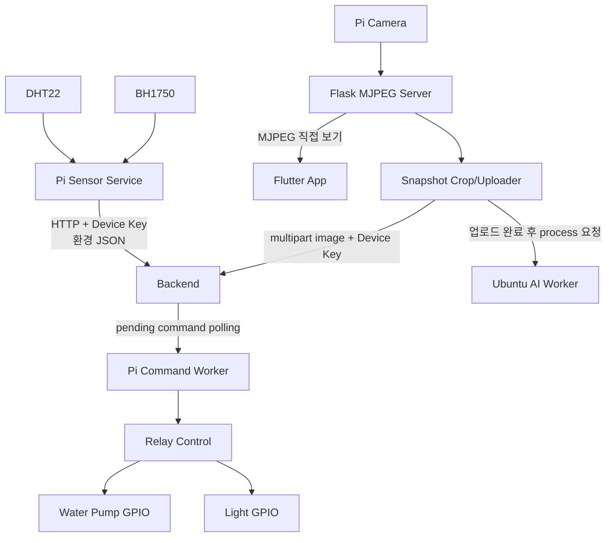

# Raspberry Pi 코드 분석

## 분석 범위와 Pi의 역할

`greenlink_pi/`는 GreenLink의 현장 게이트웨이이자 액추에이터/카메라 실행 노드입니다. 코드에서 확인되는 역할은 다음 네 가지입니다.

1. DHT22와 BH1750 환경 센서를 읽어 백엔드로 전송합니다.
2. Raspberry Pi 카메라로 식물 영상을 스트리밍하고 정지 이미지를 잘라 백엔드에 업로드합니다.
3. 백엔드에 저장된 물주기/조명/센서 갱신 명령을 폴링하여 GPIO를 제어합니다.
4. 백엔드 이미지 업로드 성공 후 Ubuntu AI 작업자에게 이미지 변환을 요청합니다.

ESP 토양 센서 데이터를 Pi가 중계하는 코드는 확인되지 않습니다. ESP는 별도로 백엔드에 직접 전송합니다. `config.py`에는 백엔드/AI 서버 주소 및 장치 키 종류의 민감 설정이 포함되어 있으므로 실제 값은 문서화하지 않습니다.

## 기술 스택과 필요한 패키지

의존성 선언 파일은 확인되지 않았으며, 아래 패키지는 import 코드에서 직접 확인한 실행 의존성입니다.

| 구분 | 코드상 확인된 기술 / 패키지 | 사용 위치 |
| --- | --- | --- |
| 언어 | Python | 전체 `.py` 파일 |
| HTTP client | `requests` | 센서/이미지/API/AI 요청 |
| 온습도 센서 | `board`, `adafruit_dht` | `sensor_service.py` |
| 조도 센서 | `smbus` | `sensor_service.py` |
| GPIO 출력 | `gpiozero.OutputDevice` | `relay_control.py` |
| 카메라 | `picamera2` | `stream_server.py`, `camera_service.py` |
| 이미지 처리 | Pillow (`PIL`) | 카메라 crop/annotation |
| 영상 서버 | Flask | `stream_server.py` |
| Shell 실행 | POSIX shell, Python venv 경로 사용 | `run_*.sh` |

`requirements.txt`, `pyproject.toml`, `Pipfile`, Dockerfile은 확인되지 않았습니다. 실제 설치 명령과 버전 고정은 코드상 확인되지 않습니다.

## 전체 파일 구조

```text
greenlink_pi/
├── config.py
├── sensor_service.py
├── sensor_uploader.py
├── sensor_main.py
├── api_client.py
├── relay_control.py
├── command_worker.py
├── stream_server.py
├── stream_snapshot_service.py
├── camera_service.py
├── camera_main.py
├── camera_snapshot_main.py
├── uploader.py
├── ai_trigger.py
├── run_sensor.sh
├── run_camera.sh
└── run_command.sh
```

`.git/`, IDE 폴더, `__pycache__/`, 가상환경, 생성 이미지와 로그 파일은 구조에서 제외했습니다. 프로젝트 안에는 systemd unit, crontab 파일 또는 로그 rotation 설정이 확인되지 않습니다.

## 주요 파일 역할

| 파일 경로 | 역할 | 중요도 | 연결되는 파일/기능 |
| --- | --- | --- | --- |
| `config.py` | 서버/장치 설정, 핀, 센서/카메라/주기/식물 crop 매핑 | 높음 | 전체 Pi 런타임 |
| `sensor_service.py` | DHT22 온습도와 BH1750 조도 측정 | 높음 | `sensor_main`, 명령 refresh |
| `sensor_uploader.py` | 환경 센서 JSON을 백엔드에 업로드 | 높음 | Backend 환경 API |
| `sensor_main.py` | 센서 1회 측정/업로드 진입점 | 높음 | shell/외부 스케줄 |
| `relay_control.py` | LED 및 펌프 GPIO on/off 실행과 안전 종료 | 높음 | `command_worker` |
| `api_client.py` | 대기 명령 조회, 처리/완료 상태 전송 | 높음 | Backend command API |
| `command_worker.py` | 반복 폴링하여 WATER/LIGHT/SENSOR_REFRESH 명령 실행 | 높음 | GPIO, 센서, Backend |
| `stream_server.py` | 카메라 캡처, crop/label, MJPEG Flask endpoint | 높음 | Flutter 스트림, 사진 crop |
| `stream_snapshot_service.py` | MJPEG에서 JPEG 한 장 추출 후 식물별 crop | 높음 | `camera_main` |
| `camera_main.py` | 스트림 스냅샷 crop과 식물별 이미지 업로드 | 높음 | Backend, AI |
| `camera_service.py` | Picamera2로 직접 still 이미지를 만드는 대안 코드 | 중간 | 직접 캡처 경로 |
| `camera_snapshot_main.py` | 로컬 snapshot URL로 업로드하려는 별도 진입점 | 중간 | 현재 route 불일치 |
| `uploader.py` | multipart 이미지 업로드 후 AI 작업 trigger | 높음 | Backend, AI worker |
| `ai_trigger.py` | Ubuntu AI `/process` 요청 | 높음 | AI worker |
| `run_sensor.sh` | venv Python으로 센서 실행, 로그 append | 중간 | 수집 운영 |
| `run_camera.sh` | 카메라 업로드 작업 실행, 로그 append | 중간 | 사진 운영 |
| `run_command.sh` | 명령 워커 실행, 로그 append | 중간 | 제어 운영 |

## 하드웨어 연결 구조

### 센서와 GPIO

| 핀 / 버스 | 연결 대상 | 역할 | 코드상 위치 |
| --- | --- | --- | --- |
| BCM GPIO 4 | DHT22 | 온도/습도 입력 | `config.py`, `sensor_service.py` |
| I2C bus 1, address `0x23` | BH1750 | 조도 입력 | `config.py`, `sensor_service.py` |
| BCM GPIO 27 | 조명 릴레이 | LED 조명 on/off | `config.py`, `relay_control.py` |
| BCM GPIO 22 | 한 식물용 펌프 릴레이 | 물주기 출력 | `config.py`, `relay_control.py` |
| BCM GPIO 23 | 다른 식물용 펌프 릴레이 | 물주기 출력 | `config.py`, `relay_control.py` |
| Camera interface | Pi Camera | MJPEG 및 사진 캡처 | `stream_server.py`, `camera_service.py` |

릴레이는 코드상 active-low 동작으로 설정되어 있습니다. 즉, 실제 전기 연결이 이 전제와 다르면 명령과 물리 동작이 반대로 될 수 있으므로 설치 시 검증이 필요합니다.

### 수집 데이터

| 데이터명 | 의미 | 단위 | 생성 위치 | 전송 위치 |
| --- | --- | --- | --- | --- |
| `temperature` | DHT22 온도 | 섭씨 | `sensor_service.py` | 백엔드 Raspberry environment API |
| `humidity` | DHT22 습도 | `%` | `sensor_service.py` | 백엔드 Raspberry environment API |
| `light` | BH1750 조도 | lux | `sensor_service.py` | 백엔드 Raspberry environment API |
| `measuredAt` | 측정 시각 | ISO datetime | `sensor_uploader.py` | 백엔드 Raspberry environment API |
| 이미지 파일 | 식물 촬영/crop 결과 | JPEG | 카메라 코드 | 백엔드 plant-images API |

## 전체 운영 구조



### Pi가 게이트웨이로 동작하는 범위

| 데이터/제어 | Pi 경유 여부 | 코드 근거 |
| --- | --- | --- |
| DHT22/BH1750 환경값 | Pi가 직접 측정/전송 | `sensor_service.py`, `sensor_uploader.py` |
| 카메라 원본/AI trigger | Pi가 촬영/업로드/AI 요청 | `camera_main.py`, `uploader.py`, `ai_trigger.py` |
| 백엔드 명령의 GPIO 실행 | Pi가 polling 후 실행 | `command_worker.py`, `relay_control.py` |
| ESP 토양 수분 | Pi 경유 확인되지 않음 | ESP/백엔드 코드상 직접 POST |

## 실행 방식과 운영 스크립트

### 예상 실행 전제

* Raspberry Pi OS와 Python 실행 환경.
* DHT22, BH1750, 릴레이 모듈, 펌프/조명, Pi Camera의 물리 연결.
* I2C와 카메라 인터페이스 활성화.
* Python 패키지 및 시스템 카메라/GPIO 의존성 설치.
* 백엔드와 Ubuntu AI 서버의 접근 가능한 endpoint, 활성 Pi 장치 키.

패키지 설치 파일과 초기 하드웨어 설정 문서는 확인되지 않으므로 위 의존성의 정확한 설치 버전은 확인되지 않습니다.

### 실행 진입점

| 실행 대상 | 명령 예시 | 동작 |
| --- | --- | --- |
| 센서 1회 업로드 | `python sensor_main.py` | 환경 센서를 한 번 읽고 백엔드 전송 |
| 명령 워커 | `python command_worker.py` | 계속 대기 명령 polling 및 GPIO 실행 |
| MJPEG 서버 | `python stream_server.py` | 카메라 stream HTTP 제공 |
| crop 이미지 업로드 | `python camera_main.py` | stream 한 프레임을 잘라 식물별 업로드와 AI 요청 |
| 대안 snapshot 업로드 | `python camera_snapshot_main.py` | 현재 서버 route와 맞지 않는 별도 코드 |

실제 shell 스크립트는 고정 배포 경로 아래의 가상환경 Python을 사용하고, 표준 출력/오류를 로그 파일에 추가합니다.

```bash
cd greenlink_pi
python sensor_main.py
python command_worker.py
python stream_server.py
python camera_main.py
```

### 자동 실행 방식

| 파일 | 확인되는 목적 | 자동 등록 상태 |
| --- | --- | --- |
| `run_sensor.sh` | 센서 실행 결과를 로그에 append, cron 운영을 시사하는 내용 존재 | crontab 등록 파일은 확인되지 않음 |
| `run_camera.sh` | 카메라 업로드 작업 로그 기록 | scheduler 등록 확인되지 않음 |
| `run_command.sh` | 지속 command worker 실행 로그 기록 | systemd unit 확인되지 않음 |

`config.py`에는 센서 간격 설정이 있으나 `sensor_main.py` 자체는 단일 측정 후 종료합니다. 반복 수집은 외부 cron 등의 스케줄러에 의존하는 것으로 보이지만 실제 등록 내용은 코드상 확인되지 않습니다.

## 백엔드, ESP 및 Ubuntu 연결 방식

### 백엔드 API 호출

| Pi 동작 | Method / 목적 경로 | 요청 핵심 데이터 | 처리 코드 |
| --- | --- | --- | --- |
| 환경 데이터 저장 | POST Raspberry environment endpoint | 장치 키, 온도/습도/조도/측정 시각 | `sensor_uploader.py` |
| 식물 이미지 저장 | POST plant image endpoint | 장치 키, 파일, 식물 ID, 촬영 시각 | `uploader.py` |
| 대기 명령 조회 | GET pending command endpoint | 장치 키 | `api_client.py` |
| 실행 시작 표시 | PATCH processing endpoint | 장치 키 | `api_client.py` |
| 실행 완료 보고 | PATCH complete endpoint | 장치 키, 성공 여부/메시지 | `api_client.py` |

### AI Worker 호출

| 동작 | Method / 경로 | 요청 데이터 | 코드 |
| --- | --- | --- | --- |
| 이미지 변환 작업 요청 | POST AI worker `/process` | 백엔드 이미지 ID, 사용자 식물 ID, 원본 이미지 URL, 파일 이름 | `ai_trigger.py`, `uploader.py` |

이미지를 받은 후 Ubuntu 작업자를 호출하는 주체는 백엔드가 아니라 Pi의 `uploader.py`입니다. AI 요청이 실패해도 백엔드 원본 이미지 업로드 성공 자체는 유지되는 처리입니다.

### ESP와의 통신

Pi 파일에서 ESP와 직접 연결되는 Serial, MQTT, BLE 또는 HTTP 수신 코드는 확인되지 않습니다. 토양 수분은 ESP가 백엔드로 직접 보내며, Pi는 이후 백엔드가 생성한 펌프 명령만 실행합니다.

## 핵심 기능 설명

### 환경 센서 수집과 전송

* 목적: 재배 공간의 온도, 습도, 조도를 서버와 자동 조명 판단에 제공합니다.
* 관련 파일: `sensor_service.py`, `sensor_uploader.py`, `sensor_main.py`, `config.py`.
* 실행 흐름: DHT22와 BH1750 값을 각각 읽고 하나의 payload를 구성하여 장치 키 헤더와 함께 백엔드에 POST합니다.
* 입력값: GPIO/I2C 센서 측정값, 장치 설정.
* 출력값: 환경 JSON 업로드 결과.
* 내부 처리 과정: DHT 값 범위 검증/재시도, 조도 읽기, ISO 측정 시각 추가, HTTP 전송.
* 예외 처리: 센서별 오류를 독립적으로 잡아 일부 값이 `None`인 데이터가 가능하며, 업로드 실패는 로그와 반환값으로 처리됩니다.
* 다른 기능과의 연결: 백엔드 자동 조명 평가와 앱 최신 상태.
* 주의할 점: 부분 센서 실패 payload를 백엔드가 어떻게 취급해야 하는지 운영 기준을 확인해야 합니다.

### 카메라 스트리밍과 이미지 업로드

* 목적: 앱의 실시간 확인 영상과 AI 처리용 식물 이미지를 만듭니다.
* 관련 파일: `stream_server.py`, `stream_snapshot_service.py`, `camera_main.py`, `uploader.py`, `camera_service.py`.
* 실행 흐름: Flask 서버가 Picamera2 frame을 지속 캡처하여 전체 및 식물별 MJPEG route로 제공합니다. `camera_main.py`는 로컬 stream에서 한 프레임을 추출해 식물별로 crop하고 서버에 업로드합니다.
* 입력값: 카메라 프레임과 식물별 crop 비율/매핑.
* 출력값: MJPEG 응답, 업로드된 식물 이미지와 백엔드 image ID.
* 내부 처리 과정: 프레임 회전, crop, label/resize, JPEG 인코딩, multipart HTTP 업로드.
* 예외 처리: snapshot/업로드 실패를 로그 처리하며, 성공 업로드 후 임시 이미지를 제거하는 경로가 있습니다.
* 다른 기능과의 연결: Flutter 스트림, 백엔드 사진 Entity, Ubuntu AI 작업.
* 주의할 점: 식물 ID 및 crop 구성이 코드 설정에 고정되어 있어 물리 배치 변경 시 함께 수정되어야 합니다.

### 장치 명령 실행과 GPIO 제어

* 목적: 서버에서 승인/생성된 물주기와 조명 동작을 물리 릴레이로 실행합니다.
* 관련 파일: `api_client.py`, `command_worker.py`, `relay_control.py`.
* 실행 흐름: worker가 일정 간격으로 대기 명령을 요청하고, processing 상태로 바꾼 뒤 명령 유형에 따라 펌프 또는 LED를 제어하고 complete 결과를 보고합니다.
* 입력값: `WATER`, `LIGHT_ON`, `LIGHT_OFF`, `SENSOR_REFRESH` 명령 및 GPIO/지속시간 정보.
* 출력값: 릴레이 동작, 백엔드 성공/실패 상태.
* 내부 처리 과정: 명령 상태 PATCH, 허용 펌프 GPIO 검사, 지정 초 동안 펌프 실행, finally off, 결과 전송.
* 예외 처리: 명령 예외 시 실패 완료를 전송하고 모든 출력 off를 호출합니다.
* 다른 기능과의 연결: 앱 수동 제어, 백엔드 자동화 판단, 센서 refresh.
* 주의할 점: Pi fallback 지속시간과 백엔드 실제 물주기 기본 지속시간 설명이 일치하지 않는 부분이 있습니다.

### AI 처리 요청 트리거

* 목적: 원본 식물 이미지가 서버에 저장된 뒤 스타일 변환 결과 생성을 시작합니다.
* 관련 파일: `uploader.py`, `ai_trigger.py`.
* 실행 흐름: 이미지 업로드 응답에서 식별자와 URL을 추출하여 AI worker `/process`에 JSON 요청을 보냅니다.
* 입력값: plant image ID, 사용자 식물 ID, 원본 이미지 URL, 이름.
* 출력값: AI 처리 접수 응답 또는 오류 로그.
* 내부 처리 과정: backend upload 성공 확인, AI payload 구성, POST timeout/결과 검사.
* 예외 처리: AI 요청 실패는 원본 업로드 성공 결과를 되돌리지 않습니다.
* 다른 기능과의 연결: Ubuntu 작업자가 완료 후 백엔드 AI callback을 호출합니다.
* 주의할 점: AI queue 상태를 Pi에서 추적하거나 재시도하는 영속 로직은 확인되지 않습니다.

## 핵심 Function / Class 상세 설명

### `read_all_sensors()`

* 위치: `sensor_service.py`
* 역할: DHT22와 BH1750 값을 모아 환경 측정 결과를 생성합니다.
* 호출되는 시점: `sensor_main.py` 실행 및 `SENSOR_REFRESH` 명령 처리 시.
* 매개변수: 없음.
* 반환값: 온도, 습도, 조도 키를 가진 dictionary.
* 내부 동작 순서:
  1. DHT22 값을 재시도 포함 함수로 읽습니다.
  2. BH1750 조도 값을 I2C로 읽습니다.
  3. 센서별 성공 값을 하나의 dictionary에 결합합니다.
  4. 한 센서가 실패해도 다른 센서 결과는 유지합니다.
* 관련 데이터: 센서 실측값.
* 의존하는 다른 함수/클래스: `read_dht22()`, `read_bh1750_lux()`, Adafruit DHT, SMBus.
* 에러 처리 방식: 각 측정 예외를 잡고 실패 항목을 `None`으로 남길 수 있습니다.
* 개선 가능성: 부분 실패 상태를 명시하는 quality field와 오류 metric을 서버에 전달할 수 있습니다.

### `upload_sensor_data(...)`

* 위치: `sensor_uploader.py`
* 역할: 센서 측정 dictionary를 백엔드 환경 수집 DTO에 맞춰 전송합니다.
* 호출되는 시점: 센서 단일 실행 또는 refresh 명령의 센서 수집 후.
* 매개변수: temperature, humidity, light 데이터.
* 반환값: 전송 성공 여부와 응답에 대응하는 값.
* 내부 동작 순서:
  1. 센서 키를 백엔드 요청 필드명으로 매핑합니다.
  2. 현재 측정 시각을 ISO 형식으로 추가합니다.
  3. 장치 키 헤더를 구성합니다.
  4. requests POST를 수행하고 결과를 검사합니다.
* 관련 데이터: 환경 sensor payload와 device credential.
* 의존하는 다른 함수/클래스: `requests`, `config.py`.
* 에러 처리 방식: 안전 wrapper가 요청 오류를 잡고 로그/실패 결과를 제공합니다.
* 개선 가능성: 실패 데이터를 재전송할 로컬 spool과 credential 로그 마스킹을 추가할 수 있습니다.

### `CommandWorker.run_forever()`

* 위치: `command_worker.py`
* 역할: 서버 명령을 계속 폴링하여 GPIO 또는 센서 갱신 작업을 실행합니다.
* 호출되는 시점: command worker 프로세스 시작 후 종료될 때까지.
* 매개변수: instance 설정을 통해 API client/relay/sensor 동작을 이용합니다.
* 반환값: 지속 루프이므로 정상 실행 중 반환 없음.
* 내부 동작 순서:
  1. 일정 polling 주기마다 pending 명령 목록을 조회합니다.
  2. 각 명령을 processing으로 갱신합니다.
  3. 유형별로 펌프 실행, LED on/off 또는 센서 읽기/업로드를 수행합니다.
  4. 성공 또는 실패 완료를 백엔드에 전송합니다.
  5. 예외 및 종료 시 출력 장치를 off합니다.
* 관련 데이터: 명령 ID/유형/지속시간/펌프 GPIO와 실행 결과.
* 의존하는 다른 함수/클래스: `ApiClient`, `RelayControl`, 센서 uploader.
* 에러 처리 방식: 개별 명령 오류를 실패 상태로 보고하고 `all_off()`를 실행합니다.
* 개선 가능성: 프로세스 재시작 중 중복 실행 방지, 처리 idempotency와 watchdog/service 운영 정의가 필요합니다.

### `RelayControl`

* 위치: `relay_control.py`
* 역할: 릴레이 출력에 대한 조명과 펌프의 실제 on/off를 캡슐화합니다.
* 호출되는 시점: command worker가 제어 명령을 수행할 때.
* 매개변수: 펌프 GPIO 또는 동작 시간.
* 반환값: 하드웨어 출력 효과.
* 내부 동작 순서:
  1. 설정된 active-low 모드로 출력 디바이스를 구성합니다.
  2. 조명 명령은 LED 릴레이 상태를 전환합니다.
  3. 물주기 명령은 허용된 펌프 핀만 선택합니다.
  4. 지정 시간 동안 펌프를 켠 뒤 `finally`에서 끕니다.
  5. 전체 off는 모든 릴레이를 안전 상태로 전환합니다.
* 관련 데이터: GPIO 핀 매핑, 릴레이 활성 논리.
* 의존하는 다른 함수/클래스: `gpiozero.OutputDevice`, `config.py`.
* 에러 처리 방식: 등록되지 않은 펌프 핀은 오류를 발생시키고, 펌프 실행은 finally off를 보장합니다.
* 개선 가능성: 최대 물주기 하드 제한, GPIO 상태 피드백 또는 유량 센서 안전 검증을 추가할 수 있습니다.

### `StreamCameraServer` 동작 (`stream_server.py`)

* 위치: `stream_server.py`
* 역할: Pi 카메라 프레임을 전체/식물별 MJPEG HTTP stream으로 노출합니다.
* 호출되는 시점: stream 서버 프로세스 실행 시.
* 매개변수: 카메라 설정, crop 비율 및 서버 bind 설정.
* 반환값: Flask route의 MJPEG 응답과 health/status 페이지.
* 내부 동작 순서:
  1. Picamera2를 초기화하고 캡처 thread를 시작합니다.
  2. 각 frame의 방향을 조정합니다.
  3. 전체 이미지와 식물별 crop/label 결과를 JPEG로 저장합니다.
  4. 각 stream route가 최신 JPEG를 multipart stream으로 반복 반환합니다.
* 관련 데이터: camera frame, crop mapping, JPEG buffer.
* 의존하는 다른 함수/클래스: Flask, Picamera2, Pillow, threading.
* 에러 처리 방식: 캡처/서버 예외 로그와 health route 수준의 확인 경로가 있습니다.
* 개선 가능성: 인증, TLS/reverse proxy, frame 동시성 보호 및 endpoint 계약 테스트가 필요합니다.

### `upload_image()`와 `trigger_ai_worker()`

* 위치: `uploader.py`, `ai_trigger.py`
* 역할: 사진 원본을 백엔드에 저장하고 AI 작업을 비동기로 시작하게 합니다.
* 호출되는 시점: `camera_main.py`가 crop 이미지를 준비한 후.
* 매개변수: 파일 경로, 사용자 식물 ID, 촬영 정보.
* 반환값: 백엔드 업로드/AI 접수 결과.
* 내부 동작 순서:
  1. 장치 키와 multipart 파일/메타데이터로 백엔드에 업로드합니다.
  2. 업로드 응답에서 image ID와 저장 URL을 읽습니다.
  3. AI worker 요청 payload를 구성합니다.
  4. `/process` API를 호출합니다.
  5. 백엔드 업로드가 완료되었으면 로컬 업로드 이미지 삭제 경로를 실행합니다.
* 관련 데이터: 원본 이미지, plant image ID, AI 입력 URL.
* 의존하는 다른 함수/클래스: `requests`, `config.py`, Ubuntu worker.
* 에러 처리 방식: AI trigger 실패는 로그 처리되고 기존 원본 업로드를 실패로 되돌리지 않습니다.
* 개선 가능성: AI trigger 실패 재시도와 작업 상태를 백엔드 중심으로 관리하면 사진과 변환 결과의 누락을 추적하기 쉽습니다.

## 카메라 Endpoint와 확인된 불일치

`stream_server.py`에서 확인된 route는 다음과 같습니다.

| Route | 기능 |
| --- | --- |
| `/` | 기본 안내 페이지 |
| `/health` | 카메라 stream 서버 상태 확인 |
| `/stream.mjpg` | 전체 카메라 MJPEG |
| `/stream/sunflower.mjpg` | 한 crop 영역의 MJPEG |
| `/stream/basil.mjpg` | 다른 crop 영역의 MJPEG |

`camera_snapshot_main.py`는 로컬 서버의 `/snapshot.jpg` route를 호출하지만, `stream_server.py`에는 해당 route가 구현되어 있지 않습니다. 현재 active 경로로 보이는 `camera_main.py`는 MJPEG에서 직접 frame을 추출하므로 이 불일치의 영향을 피하지만, snapshot 진입점을 사용할 경우 수정이 필요합니다.

## 로그, 오류 처리 및 재시도

| 영역 | 현재 코드 동작 | 한계 / 확인 필요 |
| --- | --- | --- |
| 센서 읽기 | DHT 재시도, 센서별 오류 분리 | 누락값 업로드 정책과 알림 없음 |
| 센서 HTTP | 요청 예외 처리 및 출력 | 영속 재전송 큐 없음 |
| 명령 실행 | 실패 complete 보고, `all_off()` 안전 호출 | 프로세스 장애 시 서비스 자동 재시작 설정 없음 |
| 카메라 | stream/업로드 오류 출력 | 장시간 장애 모니터링 확인되지 않음 |
| AI trigger | 실패를 원본 업로드와 분리 | 재시도 또는 누락 복구 작업 확인되지 않음 |
| 로그 저장 | shell script가 개별 `.log` 파일에 append | rotation/보존/민감정보 마스킹 없음 |

## 주의사항 및 개선 가능성

| 항목 | 코드 근거 | 개선 방향 |
| --- | --- | --- |
| 민감 설정 포함 | `config.py`에 장치 키 및 서버 endpoint 설정 종류 존재 | `.env`/서비스 secret 또는 provisioning으로 이동하고 값 회전 |
| 패키지 재현성 부재 | requirements/lock 파일 없음 | 실제 Raspberry Pi 설치 버전을 고정하는 의존성 파일 추가 |
| 서비스 운영 정의 부재 | shell script는 있으나 systemd/cron 정의 없음 | worker/stream/scheduler unit과 재시작 정책 버전 관리 |
| snapshot route 오류 | 호출 route가 stream server에 없음 | 불필요 코드 제거 또는 route/테스트 구현 |
| 식물 매핑 고정 | crop과 사용자 식물 연결이 설정 파일에 고정 | 서버 관리 구성 또는 배포별 안전 설정으로 이동 |
| 제어 안전 | GPIO off는 있으나 최대 급수/물리 피드백 없음 | 최대 동작 제한, 유량/수위 확인, emergency stop 고려 |
| AI trigger 신뢰성 | Pi가 단발 AI 요청, 실패 재시도 없음 | 백엔드 작업 큐/상태 관리로 이관 또는 재처리 큐 추가 |
| 영상 노출 | MJPEG 인증 로직 확인되지 않음 | 사용자별 접근 통제와 reverse proxy/TLS 구성 확인 |

<!-- BEGIN GENERATED SOURCE APPENDIX -->
## 소스 코드 원문 부록

### 포함 범위와 마스킹 원칙

Pi 센서, 카메라, 스트림, GPIO 제어, Backend/AI 통신 Python 소스와 운영 shell entrypoint를 포함한다. 로그, 캐시, 가상환경은 제외한다.

아래 코드는 확인한 저장소 파일의 원문을 문서에 수록한 것이다. 다만 소스에 존재하는 비밀키, 토큰/장치 키, Wi-Fi 자격 정보, 실서버 주소 및 외부 저장소 URL은 `<REDACTED_SECRET>`, `<REDACTED_DEVICE_KEY>`, `<REDACTED_URL>` 또는 `<REDACTED_IP>`로 치환했으므로 그대로 빌드하기 위한 사본이 아니라 분석용 사본이다.

### 수록 파일 목록

* `ai_trigger.py`
* `api_client.py`
* `camera_main.py`
* `camera_service.py`
* `camera_snapshot_main.py`
* `command_worker.py`
* `config.py`
* `relay_control.py`
* `sensor_main.py`
* `sensor_service.py`
* `sensor_uploader.py`
* `stream_server.py`
* `stream_snapshot_service.py`
* `uploader.py`
* `run_camera.sh`
* `run_command.sh`
* `run_sensor.sh`

### 원문 코드

#### `ai_trigger.py`

~~~~python
import requests

from config import AI_WORKER_URL


def trigger_ai_worker(
    plant_image_id: int,
    user_plant_id: int,
    image_url: str,
):
    """
    사진 업로드 성공 후 AI Worker에 변환 요청을 보낸다.

    AI Worker는 다음을 수행한다.
    1. imageUrl 다운로드
    2. AI 이미지 변환
    3. 최종 결과 S3 업로드
    4. 백엔드 ai_plant_image 저장
    """

    name = f"user_plant_{user_plant_id}_image_{plant_image_id}"

    payload = {
        "plantImageId": plant_image_id,
        "userPlantId": user_plant_id,
        "imageUrl": image_url,
        "name": name,
    }

    print("[AI_TRIGGER] AI Worker 요청 시작")
    print(f"[AI_TRIGGER] URL: {AI_WORKER_URL}")
    print(f"[AI_TRIGGER] payload: {payload}")

    response = requests.post(
        AI_WORKER_URL,
        json=payload,
        timeout=10,
    )

    print(f"[AI_TRIGGER] 응답 코드: {response.status_code}")
    print(f"[AI_TRIGGER] 응답 본문: {response.text}")

    response.raise_for_status()

    return response.json()
~~~~

#### `api_client.py`

~~~~python
import requests

from config import (
    SERVER_PENDING_COMMAND_URL,
    DEVICE_KEY,
    BASE_URL,
)


def get_device_headers():
    return {
        "X-DEVICE-KEY": DEVICE_KEY
    }


def get_pending_commands():
    response = requests.get(
        SERVER_PENDING_COMMAND_URL,
        headers=get_device_headers(),
        timeout=10,
    )

    response.raise_for_status()

    body = response.json()

    if body.get("success") is not True:
        raise RuntimeError(body.get("message", "대기 명령 조회 실패"))

    return body.get("data", [])


def mark_command_processing(command_id: int):
    url = f"{BASE_URL}/api/iot/commands/{command_id}/processing"

    response = requests.patch(
        url,
        headers=get_device_headers(),
        timeout=10,
    )

    response.raise_for_status()

    body = response.json()

    if body.get("success") is not True:
        raise RuntimeError(body.get("message", "명령 처리 시작 보고 실패"))

    return body


def complete_command(command_id: int, success: bool, result_message: str):
    url = f"{BASE_URL}/api/iot/commands/{command_id}/complete"

    payload = {
        "success": success,
        "resultMessage": result_message,
    }

    response = requests.patch(
        url,
        headers={
            **get_device_headers(),
            "Content-Type": "application/json",
        },
        json=payload,
        timeout=10,
    )

    response.raise_for_status()

    body = response.json()

    if body.get("success") is not True:
        raise RuntimeError(body.get("message", "명령 완료 보고 실패"))

    return body
~~~~

#### `camera_main.py`

~~~~python
import os

from stream_snapshot_service import create_plant_snapshots_from_full_stream
from uploader import upload_image_and_delete_if_success
from config import (
    FULL_STREAM_URL,
    SUNFLOWER_CROP,
    BASIL_CROP,
    SUNFLOWER_USER_PLANT_ID,
    BASIL_USER_PLANT_ID,
)


def normalize_upload_result(result):
    """
    uploader.py의 반환값 형태가 달라도 안전하게 처리한다.

    가능한 반환 형태:
    1. (success, body)
    2. (success, body, ai_result)
    3. body dict
       {
         "success": true,
         "message": "...",
         "data": {...}
       }
    4. bool
    """

    if isinstance(result, tuple):
        success = result[0] if len(result) >= 1 else False
        body = result[1] if len(result) >= 2 else None
        extra = result[2:] if len(result) >= 3 else None
        return bool(success), body, extra

    if isinstance(result, dict):
        success = result.get("success") is True
        return success, result, None

    if isinstance(result, bool):
        return result, None, None

    return False, result, None


def upload_snapshot(
    plant_name: str,
    image_path,
    user_plant_id: int
):
    print("====================================")
    print(f"[CAMERA_MAIN] {plant_name} 이미지 업로드 시작")
    print(f"[CAMERA_MAIN] imagePath = {image_path}")
    print(f"[CAMERA_MAIN] userPlantId = {user_plant_id}")
    print("====================================")

    result = upload_image_and_delete_if_success(
        image_path=image_path,
        user_plant_id=user_plant_id
    )

    success, body, extra = normalize_upload_result(result)

    if success:
        print(f"[CAMERA_MAIN] {plant_name} 이미지 업로드 성공")
    else:
        print(f"[CAMERA_MAIN] {plant_name} 이미지 업로드 실패")

    if body is not None:
        print(f"[CAMERA_MAIN] {plant_name} 업로드 응답: {body}")

    if extra is not None:
        print(f"[CAMERA_MAIN] {plant_name} 추가 반환값: {extra}")

    return success, body, extra


def delete_file_if_exists(path):
    try:
        if path is not None and os.path.exists(path):
            os.remove(path)
            print(f"[CAMERA_MAIN] 임시 파일 삭제 완료: {path}")
    except Exception as e:
        print(f"[CAMERA_MAIN] 임시 파일 삭제 실패: {path} | {e}")


def main():
    print("[CAMERA_MAIN] 아침 스냅샷 업로드 시작")
    print(f"[CAMERA_MAIN] fullStreamUrl = {FULL_STREAM_URL}")
    print(f"[CAMERA_MAIN] SUNFLOWER_CROP = {SUNFLOWER_CROP}")
    print(f"[CAMERA_MAIN] BASIL_CROP = {BASIL_CROP}")

    original_frame_path = None
    sunflower_image_path = None
    basil_image_path = None

    results = []

    try:
        sunflower_image_path, basil_image_path, original_frame_path = (
            create_plant_snapshots_from_full_stream(
                full_stream_url=FULL_STREAM_URL,
                sunflower_crop=SUNFLOWER_CROP,
                basil_crop=BASIL_CROP
            )
        )

        print("[CAMERA_MAIN] 전체 프레임 1장 기준 crop 완료")
        print(f"[CAMERA_MAIN] original = {original_frame_path}")
        print(f"[CAMERA_MAIN] sunflower = {sunflower_image_path}")
        print(f"[CAMERA_MAIN] basil = {basil_image_path}")

        try:
            sunflower_result = upload_snapshot(
                plant_name="해바라기",
                image_path=sunflower_image_path,
                user_plant_id=SUNFLOWER_USER_PLANT_ID
            )
            results.append(("해바라기", sunflower_result[0]))

        except Exception as e:
            print(f"[CAMERA_MAIN] 해바라기 업로드 중 오류: {e}")
            results.append(("해바라기", False))

        try:
            basil_result = upload_snapshot(
                plant_name="바질",
                image_path=basil_image_path,
                user_plant_id=BASIL_USER_PLANT_ID
            )
            results.append(("바질", basil_result[0]))

        except Exception as e:
            print(f"[CAMERA_MAIN] 바질 업로드 중 오류: {e}")
            results.append(("바질", False))

    finally:
        delete_file_if_exists(original_frame_path)

    print("====================================")
    print("[CAMERA_MAIN] 아침 스냅샷 업로드 결과")
    for plant_name, success in results:
        status = "성공" if success else "실패"
        print(f"- {plant_name}: {status}")
    print("====================================")


if __name__ == "__main__":
    main()
~~~~

#### `camera_service.py`

~~~~python
from datetime import datetime
from pathlib import Path
import time

from picamera2 import Picamera2
from PIL import Image, ImageOps

from config import (
    IMAGE_DIR,
    IMAGE_ROTATE_DEGREES,
    IMAGE_FLIP_LEFT_RIGHT,
)


def fix_image_orientation(image_path: Path):
    """
    촬영된 이미지의 방향을 보정한다.

    IMAGE_ROTATE_DEGREES = 180이면 위아래 뒤집힌 사진을 정상 방향으로 돌린다.
    IMAGE_FLIP_LEFT_RIGHT = True이면 좌우 반전한다.
    """

    image = Image.open(image_path).convert("RGB")

    if IMAGE_ROTATE_DEGREES != 0:
        image = image.rotate(IMAGE_ROTATE_DEGREES, expand=True)

    if IMAGE_FLIP_LEFT_RIGHT:
        image = ImageOps.mirror(image)

    image.save(image_path, format="JPEG", quality=95)


def capture_image() -> Path:
    """
    Raspberry Pi Camera로 사진을 촬영하고 images 폴더에 저장한다.
    저장 후 이미지 방향 보정을 수행한다.
    반환값은 촬영된 이미지 파일 경로(Path)이다.
    """

    IMAGE_DIR.mkdir(parents=True, exist_ok=True)

    filename = IMAGE_DIR / f"sunflower_{datetime.now().strftime('%Y%m%d_%H%M%S')}.jpg"

    picam2 = Picamera2()

    try:
        camera_config = picam2.create_still_configuration()
        picam2.configure(camera_config)

        picam2.start()
        time.sleep(2)

        picam2.capture_file(str(filename))

        print(f"[CAMERA] 촬영 완료: {filename}")

        fix_image_orientation(filename)

        print(f"[CAMERA] 이미지 방향 보정 완료: {filename}")

        return filename

    finally:
        try:
            picam2.close()
        except Exception:
            pass
~~~~

#### `camera_snapshot_main.py`

~~~~python
from datetime import datetime
from pathlib import Path
import requests

from config import IMAGE_DIR, SUNFLOWER_USER_PLANT_ID
from uploader import upload_image_and_delete_if_success


SNAPSHOT_URL = "<REDACTED_URL>"


def download_snapshot() -> Path:
    IMAGE_DIR.mkdir(parents=True, exist_ok=True)

    filename = IMAGE_DIR / f"sunflower_snapshot_{datetime.now().strftime('%Y%m%d_%H%M%S')}.jpg"

    response = requests.get(SNAPSHOT_URL, timeout=10)
    response.raise_for_status()

    with open(filename, "wb") as f:
        f.write(response.content)

    print(f"[SNAPSHOT] 저장 완료: {filename}")
    return filename


def main():
    print("[SNAPSHOT] 실시간 카메라 프레임 저장 시작")

    image_path = download_snapshot()

    print("[SNAPSHOT] 서버 업로드 시작")

    result = upload_image_and_delete_if_success(
        image_path=image_path,
        user_plant_id=SUNFLOWER_USER_PLANT_ID
    )

    print("[SNAPSHOT] 전체 처리 완료")
    print(f"[SNAPSHOT] 결과: {result}")


if __name__ == "__main__":
    main()
~~~~

#### `command_worker.py`

~~~~python
import time

from api_client import (
    get_pending_commands,
    mark_command_processing,
    complete_command,
)
from config import COMMAND_POLL_INTERVAL_SECONDS
from relay_control import pump_for_gpio, led_on, led_off, all_off
from sensor_service import read_all_sensors
from sensor_uploader import upload_sensor_data_safe


# ==============================
# WATER 명령 처리
# ==============================

def handle_water_command(command: dict):
    command_id = command.get("commandId")
    duration_seconds = command.get("durationSeconds", 5)

    pump_channel = command.get("pumpChannel") or {}
    gpio_pin = pump_channel.get("gpioPin")
    relay_channel = pump_channel.get("relayChannel")

    print("====================================")
    print("[COMMAND] WATER 명령 수신")
    print(f"[COMMAND] commandId = {command_id}")
    print(f"[COMMAND] gpioPin = {gpio_pin}")
    print(f"[COMMAND] relayChannel = {relay_channel}")
    print(f"[COMMAND] durationSeconds = {duration_seconds}")
    print("====================================")

    if command_id is None:
        print("[COMMAND] commandId가 없어 명령을 처리할 수 없습니다.")
        return

    if gpio_pin is None:
        try:
            mark_command_processing(command_id)
            complete_command(
                command_id=command_id,
                success=False,
                result_message="gpioPin이 없어 급수 명령을 처리할 수 없습니다."
            )
        except Exception as e:
            print(f"[COMMAND] gpioPin 없음 실패 보고 중 오류: {e}")
        return

    try:
        mark_command_processing(command_id)
        print(f"[COMMAND] PROCESSING 보고 완료: commandId={command_id}")

        pump_for_gpio(
            gpio_pin=int(gpio_pin),
            seconds=float(duration_seconds)
        )

        complete_command(
            command_id=command_id,
            success=True,
            result_message=f"급수 완료: GPIO {gpio_pin}, {duration_seconds}초"
        )

        print(f"[COMMAND] SUCCESS 보고 완료: commandId={command_id}")

    except Exception as e:
        print(f"[COMMAND] 급수 명령 처리 실패: {e}")

        try:
            complete_command(
                command_id=command_id,
                success=False,
                result_message=f"급수 실패: {e}"
            )
            print(f"[COMMAND] FAILED 보고 완료: commandId={command_id}")

        except Exception as report_error:
            print(f"[COMMAND] 실패 보고도 실패: {report_error}")

        all_off()


# ==============================
# LIGHT 명령 처리
# ==============================

def handle_light_command(command: dict):
    command_id = command.get("commandId")
    command_type = command.get("commandType")

    print("====================================")
    print("[COMMAND] 조명 명령 수신")
    print(f"[COMMAND] commandId = {command_id}")
    print(f"[COMMAND] commandType = {command_type}")
    print("====================================")

    if command_id is None:
        print("[COMMAND] commandId가 없어 조명 명령을 처리할 수 없습니다.")
        return

    try:
        mark_command_processing(command_id)
        print(f"[COMMAND] PROCESSING 보고 완료: commandId={command_id}")

        if command_type == "LIGHT_ON":
            led_on()
            result_message = "LED 조명 켜기 완료"

        elif command_type == "LIGHT_OFF":
            led_off()
            result_message = "LED 조명 끄기 완료"

        else:
            raise ValueError(f"지원하지 않는 조명 명령입니다: {command_type}")

        complete_command(
            command_id=command_id,
            success=True,
            result_message=result_message
        )

        print(f"[COMMAND] SUCCESS 보고 완료: commandId={command_id}")

    except Exception as e:
        print(f"[COMMAND] 조명 명령 처리 실패: {e}")

        try:
            complete_command(
                command_id=command_id,
                success=False,
                result_message=f"조명 명령 실패: {e}"
            )
            print(f"[COMMAND] FAILED 보고 완료: commandId={command_id}")

        except Exception as report_error:
            print(f"[COMMAND] 실패 보고도 실패: {report_error}")


# ==============================
# SENSOR_REFRESH 명령 처리
# ==============================

def handle_sensor_refresh_command(command: dict):
    command_id = command.get("commandId")

    print("====================================")
    print("[COMMAND] SENSOR_REFRESH 명령 수신")
    print(f"[COMMAND] commandId = {command_id}")
    print("[COMMAND] 새로고침 대상: 온도 / 습도 / 조도")
    print("[COMMAND] 제외 대상: ESP32 토양수분")
    print("====================================")

    if command_id is None:
        print("[COMMAND] commandId가 없어 센서 새로고침 명령을 처리할 수 없습니다.")
        return

    try:
        mark_command_processing(command_id)
        print(f"[SENSOR_REFRESH] PROCESSING 보고 완료: commandId={command_id}")

        print("[SENSOR_REFRESH] Raspberry Pi 센서 측정 시작")
        sensor_data = read_all_sensors()

        print("===== SENSOR_REFRESH DATA =====")
        print(f"lightLux: {sensor_data.get('lightLux')}")
        print(f"temperatureC: {sensor_data.get('temperatureC')}")
        print(f"humidityPercent: {sensor_data.get('humidityPercent')}")
        print("===============================")

        upload_success, upload_body = upload_sensor_data_safe(sensor_data)

        if not upload_success:
            raise RuntimeError(f"센서 업로드 실패: {upload_body}")

        complete_command(
            command_id=command_id,
            success=True,
            result_message="센서 새로고침 완료: 온도/습도/조도 업로드 성공"
        )

        print(f"[SENSOR_REFRESH] SUCCESS 보고 완료: commandId={command_id}")

    except Exception as e:
        print(f"[SENSOR_REFRESH] 센서 새로고침 처리 실패: {e}")

        try:
            complete_command(
                command_id=command_id,
                success=False,
                result_message=f"센서 새로고침 실패: {e}"
            )
            print(f"[SENSOR_REFRESH] FAILED 보고 완료: commandId={command_id}")

        except Exception as report_error:
            print(f"[SENSOR_REFRESH] 실패 보고도 실패: {report_error}")


# ==============================
# 명령 분기 처리
# ==============================

def handle_command(command: dict):
    command_type = command.get("commandType")

    if command_type == "WATER":
        handle_water_command(command)
        return

    if command_type in ("LIGHT_ON", "LIGHT_OFF"):
        handle_light_command(command)
        return

    if command_type == "SENSOR_REFRESH":
        handle_sensor_refresh_command(command)
        return

    print(f"[COMMAND] 지원하지 않는 명령 타입입니다: {command_type}")


# ==============================
# 1회 polling
# ==============================

def run_once():
    commands = get_pending_commands()

    if not commands:
        print("[COMMAND] 대기 중인 명령 없음")
        return

    print(f"[COMMAND] 대기 중인 명령 {len(commands)}개 발견")

    for command in commands:
        handle_command(command)


# ==============================
# 계속 polling
# ==============================

def run_forever():
    print("[COMMAND] 서버 명령 polling 시작")
    print("[COMMAND] 지원 명령: WATER, LIGHT_ON, LIGHT_OFF, SENSOR_REFRESH")

    try:
        while True:
            try:
                run_once()

            except Exception as e:
                print(f"[COMMAND] polling 오류: {e}")
                all_off()

            time.sleep(COMMAND_POLL_INTERVAL_SECONDS)

    finally:
        all_off()


if __name__ == "__main__":
    run_forever()
~~~~

#### `config.py`

~~~~python
from pathlib import Path


# ==============================
# 서버 설정
# ==============================

BASE_URL = "<REDACTED_URL>"
DEVICE_KEY = "<REDACTED_SECRET>"

SERVER_ENVIRONMENT_URL = f"{BASE_URL}/api/iot/raspberry/environment"
SERVER_IMAGE_URL = f"{BASE_URL}/api/iot/plant-images"
SERVER_PENDING_COMMAND_URL = f"{BASE_URL}/api/iot/commands/pending"

# AI Worker 서버
AI_WORKER_URL = "<REDACTED_URL>"


# ==============================
# 식물 ID 설정
# ==============================
# 현재 DB 기준:
# 해바라기 userPlantId = 5
# 바질 userPlantId = 6

SUNFLOWER_USER_PLANT_ID = 5
BASIL_USER_PLANT_ID = 6

# 기존 코드 호환용
TOMATO_USER_PLANT_ID = SUNFLOWER_USER_PLANT_ID


# ==============================
# 파일/이미지 저장 설정
# ==============================

BASE_DIR = Path("/home/greenlink/greenlink")
IMAGE_DIR = BASE_DIR / "images"
IMAGE_DIR.mkdir(parents=True, exist_ok=True)


# ==============================
# 실시간 스트림 스냅샷 설정
# ==============================
# 아침 자동 촬영은 카메라를 새로 열지 않고,
# greenlink-stream의 전체 원본 스트림에서 JPEG 1장을 가져온다.
# 그 이미지 하나를 해바라기/바질 영역으로 crop해서 각각 업로드한다.

LOCAL_STREAM_BASE_URL = "<REDACTED_URL>"

# 전체 원본 스트림
FULL_STREAM_URL = f"{LOCAL_STREAM_BASE_URL}/stream.mjpg"

# stream_server.py와 동일한 crop 기준
# 현재 기준:
# 해바라기 = 오른쪽 절반
# 바질     = 왼쪽 절반
#
# 만약 실제 업로드 결과가 반대로 나오면 두 값을 서로 바꾸면 된다.
SUNFLOWER_CROP = (0.5, 0.0, 1.0, 1.0)
BASIL_CROP = (0.0, 0.0, 0.5, 1.0)

# crop 결과 저장 크기
SNAPSHOT_OUTPUT_WIDTH = 1080
SNAPSHOT_OUTPUT_HEIGHT = 1620


# ==============================
# 카메라 이미지 방향 보정
# ==============================
# 주의:
# 현재 아침 스냅샷은 /stream.mjpg에서 가져오므로,
# stream_server.py에서 이미 180도 회전이 적용된 화면을 받는다.
# 따라서 camera_main.py에서는 별도 회전 처리를 하지 않는다.
#
# 아래 값은 기존 camera_service.py 직접 촬영 코드와의 호환용이다.

IMAGE_ROTATE_DEGREES = 180
IMAGE_FLIP_LEFT_RIGHT = False


# ==============================
# 릴레이 GPIO 설정
# ==============================
# 정상 작동했던 기존 배선 기준:
# GPIO27 → LED
# GPIO22 → 바질 펌프
# GPIO23 → 해바라기 펌프

RELAY_LED_GPIO = 27
RELAY_BASIL_PUMP_GPIO = 22
RELAY_SUNFLOWER_PUMP_GPIO = 23

# 기존 코드 호환용
RELAY_TOMATO_PUMP_GPIO = RELAY_SUNFLOWER_PUMP_GPIO

# 릴레이 모듈이 active LOW 방식이면 False
RELAY_ACTIVE_HIGH = False


# ==============================
# 센서 설정
# ==============================

DHT_GPIO = 4

BH1750_I2C_BUS = 1
BH1750_ADDR = 0x23


# ==============================
# 실행 주기 설정
# ==============================

SENSOR_INTERVAL_SECONDS = 600
COMMAND_POLL_INTERVAL_SECONDS = 3
~~~~

#### `relay_control.py`

~~~~python
from gpiozero import OutputDevice
from time import sleep

from config import (
    RELAY_LED_GPIO,
    RELAY_BASIL_PUMP_GPIO,
    RELAY_SUNFLOWER_PUMP_GPIO,
    RELAY_ACTIVE_HIGH,
)


led_relay = OutputDevice(
    RELAY_LED_GPIO,
    active_high=RELAY_ACTIVE_HIGH,
    initial_value=False
)

basil_pump_relay = OutputDevice(
    RELAY_BASIL_PUMP_GPIO,
    active_high=RELAY_ACTIVE_HIGH,
    initial_value=False
)

sunflower_pump_relay = OutputDevice(
    RELAY_SUNFLOWER_PUMP_GPIO,
    active_high=RELAY_ACTIVE_HIGH,
    initial_value=False
)


def set_led(on: bool):
    if on:
        print(f"[RELAY] LED ON: GPIO {RELAY_LED_GPIO}")
        led_relay.on()
    else:
        print(f"[RELAY] LED OFF: GPIO {RELAY_LED_GPIO}")
        led_relay.off()


def set_basil_pump(on: bool):
    if on:
        print(f"[RELAY] 바질 펌프 ON: GPIO {RELAY_BASIL_PUMP_GPIO}")
        basil_pump_relay.on()
    else:
        print(f"[RELAY] 바질 펌프 OFF: GPIO {RELAY_BASIL_PUMP_GPIO}")
        basil_pump_relay.off()


def set_sunflower_pump(on: bool):
    if on:
        print(f"[RELAY] 해바라기 펌프 ON: GPIO {RELAY_SUNFLOWER_PUMP_GPIO}")
        sunflower_pump_relay.on()
    else:
        print(f"[RELAY] 해바라기 펌프 OFF: GPIO {RELAY_SUNFLOWER_PUMP_GPIO}")
        sunflower_pump_relay.off()


def led_on():
    set_led(True)


def led_off():
    set_led(False)


def pump_for_gpio(gpio_pin: int, seconds: float):
    if gpio_pin == RELAY_BASIL_PUMP_GPIO:
        print(f"[RELAY] 바질 펌프 작동: GPIO {gpio_pin}, {seconds}초")
        try:
            set_basil_pump(True)
            sleep(seconds)
        finally:
            set_basil_pump(False)
        return

    if gpio_pin == RELAY_SUNFLOWER_PUMP_GPIO:
        print(f"[RELAY] 해바라기 펌프 작동: GPIO {gpio_pin}, {seconds}초")
        try:
            set_sunflower_pump(True)
            sleep(seconds)
        finally:
            set_sunflower_pump(False)
        return

    raise ValueError(f"등록되지 않은 펌프 GPIO입니다: {gpio_pin}")


def all_off():
    print("[RELAY] 전체 OFF")
    led_relay.off()
    basil_pump_relay.off()
    sunflower_pump_relay.off()


if __name__ == "__main__":
    try:
        all_off()

        input("LED 테스트: 엔터를 누르면 LED가 2초 켜집니다.")
        led_on()
        sleep(2)
        led_off()

        input("바질 펌프 테스트: 엔터를 누르면 바질 펌프가 1초 켜집니다.")
        pump_for_gpio(RELAY_BASIL_PUMP_GPIO, 1)

        input("해바라기 펌프 테스트: 엔터를 누르면 해바라기 펌프가 1초 켜집니다.")
        pump_for_gpio(RELAY_SUNFLOWER_PUMP_GPIO, 1)

    finally:
        all_off()
~~~~

#### `sensor_main.py`

~~~~python
from sensor_service import read_all_sensors, cleanup_sensors
from sensor_uploader import upload_sensor_data_safe


def print_sensor_data(sensor_data: dict):
    print("===== Sensor Data =====")
    print(f"lightLux: {sensor_data.get('lightLux')}")
    print(f"temperatureC: {sensor_data.get('temperatureC')}")
    print(f"humidityPercent: {sensor_data.get('humidityPercent')}")
    print("=======================")


def main():
    try:
        sensor_data = read_all_sensors()

        print_sensor_data(sensor_data)

        print("센서 업로드 시작")
        upload_sensor_data_safe(sensor_data)

    finally:
        cleanup_sensors()


if __name__ == "__main__":
    main()
~~~~

#### `sensor_service.py`

~~~~python
import time
import smbus
import board
import adafruit_dht

from config import BH1750_I2C_BUS, BH1750_ADDR, DHT_GPIO


BH1750_POWER_ON = 0x01
BH1750_RESET = 0x07
BH1750_CONTINUOUS_HIGH_RES_MODE = 0x10


_bus = smbus.SMBus(BH1750_I2C_BUS)


def _get_dht_board_pin():
    if DHT_GPIO == 4:
        return board.D4
    if DHT_GPIO == 17:
        return board.D17
    if DHT_GPIO == 27:
        return board.D27
    if DHT_GPIO == 22:
        return board.D22
    if DHT_GPIO == 23:
        return board.D23

    raise ValueError(f"지원하지 않는 DHT GPIO 번호입니다: {DHT_GPIO}")


_dht = adafruit_dht.DHT22(_get_dht_board_pin(), use_pulseio=False)


def read_bh1750_lux() -> float:
    _bus.write_byte(BH1750_ADDR, BH1750_POWER_ON)
    _bus.write_byte(BH1750_ADDR, BH1750_RESET)
    _bus.write_byte(BH1750_ADDR, BH1750_CONTINUOUS_HIGH_RES_MODE)

    time.sleep(0.2)

    data = _bus.read_i2c_block_data(
        BH1750_ADDR,
        BH1750_CONTINUOUS_HIGH_RES_MODE,
        2
    )

    lux = ((data[0] << 8) | data[1]) / 1.2

    return round(lux, 2)


def _is_valid_temp_hum(temp, hum) -> bool:
    if temp is None or hum is None:
        return False

    if not (0 <= temp <= 50):
        return False

    if not (0 <= hum <= 100):
        return False

    return True


def read_dht22(max_retry: int = 5):
    for attempt in range(max_retry):
        try:
            temp = _dht.temperature
            hum = _dht.humidity

            if _is_valid_temp_hum(temp, hum):
                return round(temp, 1), round(hum, 1)

            print(f"[DHT22] 유효하지 않은 값: temp={temp}, hum={hum}")

        except RuntimeError as e:
            print(f"[DHT22] 읽기 재시도 {attempt + 1}/{max_retry}: {e}")

        time.sleep(1.0)

    return None, None


def read_all_sensors():
    lux = None
    temp = None
    hum = None

    try:
        lux = read_bh1750_lux()
    except Exception as e:
        print(f"[BH1750] 읽기 실패: {e}")

    try:
        temp, hum = read_dht22()
    except Exception as e:
        print(f"[DHT22] 읽기 실패: {e}")

    return {
        "lightLux": lux,
        "temperatureC": temp,
        "humidityPercent": hum,
    }


def cleanup_sensors():
    try:
        _dht.exit()
    except Exception:
        pass

    try:
        _bus.close()
    except Exception:
        pass


if __name__ == "__main__":
    try:
        sensor_data = read_all_sensors()
        print(sensor_data)

    finally:
        cleanup_sensors()
~~~~

#### `sensor_uploader.py`

~~~~python
from datetime import datetime
import requests

from config import SERVER_ENVIRONMENT_URL, DEVICE_KEY


def upload_sensor_data(sensor_data: dict):
    payload = {
        "temperature": sensor_data.get("temperatureC"),
        "humidity": sensor_data.get("humidityPercent"),
        "light": sensor_data.get("lightLux"),
        "measuredAt": datetime.now().isoformat(timespec="seconds"),
    }

    headers = {
        "X-DEVICE-KEY": DEVICE_KEY,
        "Content-Type": "application/json",
    }

    response = requests.post(
        SERVER_ENVIRONMENT_URL,
        json=payload,
        headers=headers,
        timeout=10,
    )

    return response


def upload_sensor_data_safe(sensor_data: dict):
    try:
        response = upload_sensor_data(sensor_data)

    except Exception as e:
        print(f"[SENSOR_UPLOAD] 센서 업로드 요청 실패: {e}")
        return False, None

    print(f"[SENSOR_UPLOAD] 응답 코드: {response.status_code}")
    print(f"[SENSOR_UPLOAD] 응답 본문: {response.text}")

    if response.status_code in (200, 201):
        try:
            body = response.json()

            if body.get("success") is True:
                print("[SENSOR_UPLOAD] 센서 업로드 성공")
                return True, body

            print(f"[SENSOR_UPLOAD] 서버 응답 success=false: {body.get('message')}")
            return False, body

        except Exception as e:
            print(f"[SENSOR_UPLOAD] 응답 JSON 해석 실패: {e}")
            return False, None

    print("[SENSOR_UPLOAD] 센서 업로드 실패")
    return False, None
~~~~

#### `stream_server.py`

~~~~python
import io
import time
import threading
from typing import Tuple

from flask import Flask, Response, render_template_string
from picamera2 import Picamera2
from PIL import Image, ImageDraw


# ==============================
# 기본 서버 설정
# ==============================

HOST = "<REDACTED_IP>"
PORT = 8000


# ==============================
# 카메라 해상도 설정
# ==============================
# 카메라 원본 프레임 해상도입니다.
# 해바라기/바질을 한 화면에 담은 뒤 crop하기 위해 1920x1080으로 설정합니다.

FRAME_WIDTH = 1640
FRAME_HEIGHT = 1232


# ==============================
# 개별 crop 스트림 출력 해상도
# ==============================
# 좌우 crop을 하면 원래는 960x1080처럼 세로로 좁은 화면이 됩니다.
# 그래서 crop 결과를 다시 1920x1080으로 확대해서 각 식물 화면에서 크게 보이도록 합니다.

CROP_OUTPUT_WIDTH = 800
CROP_OUTPUT_HEIGHT = 1232


# ==============================
# 스트리밍 품질 설정
# ==============================

JPEG_QUALITY = 80

# 프레임 캡처 간격
# 0.08초 ≒ 약 12.5fps
# 라즈베리파이가 버벅이면 0.12 또는 0.15로 늘리면 됩니다.
CAPTURE_INTERVAL_SECONDS = 0.08

# MJPEG 전송 간격
# 실제 프레임 갱신은 CAPTURE_INTERVAL_SECONDS의 영향을 더 많이 받습니다.
STREAM_INTERVAL_SECONDS = 0.03


# ==============================
# 카메라 방향 보정
# ==============================
# 카메라가 뒤집혀 달려 있으므로 180도 회전 적용.
# 정상 방향이면 False로 바꾸면 됩니다.

ROTATE_180 = True


# ==============================
# Crop 설정
# ==============================
# 비율 기준 crop 영역입니다.
# 형식: (x1, y1, x2, y2)
#
# 기존에 해바라기/바질이 반대로 나왔기 때문에 서로 교체한 상태입니다.
#
# 현재 기준:
# 해바라기 = 오른쪽 절반
# 바질     = 왼쪽 절반
#
# 만약 다시 반대로 나오면 아래 두 줄만 서로 바꾸면 됩니다.

SUNFLOWER_CROP = (0.5, 0.0, 1.0, 1.0)
BASIL_CROP = (0.0, 0.0, 0.5, 1.0)


# ==============================
# 라벨 표시 여부
# ==============================
# 테스트할 때는 True가 좋습니다.
# 프론트에 넣을 때 라벨이 거슬리면 False로 바꾸면 됩니다.

SHOW_LABEL = True


# ==============================
# 전역 객체
# ==============================

app = Flask(__name__)

picam2 = None
latest_frame = None
frame_lock = threading.Lock()
camera_running = False


# ==============================
# HTML 테스트 페이지
# ==============================

INDEX_HTML = """
<!DOCTYPE html>
<html>
<head>
    <meta charset="UTF-8">
    <title>GreenLink Live Camera</title>
    <style>
        body {
            margin: 0;
            padding: 24px;
            background: #111;
            color: #fff;
            font-family: Arial, sans-serif;
        }

        h1 {
            margin-bottom: 8px;
        }

        p {
            color: #ccc;
        }

        .grid {
            display: grid;
            grid-template-columns: 1fr;
            gap: 24px;
        }

        .card {
            background: #222;
            padding: 16px;
            border-radius: 12px;
        }

        img {
            width: 100%;
            max-width: 1200px;
            border-radius: 12px;
            background: #000;
        }

        a {
            color: #8ee99a;
        }

        code {
            color: #8ee99a;
        }
    </style>
</head>
<body>
    <h1>GreenLink Live Camera</h1>
    <p>Raspberry Pi Camera MJPEG Stream</p>

    <div class="grid">
        <div class="card">
            <h2>Full Stream</h2>
            <p><a href="/stream.mjpg">/stream.mjpg</a></p>
            
        </div>

        <div class="card">
            <h2>Sunflower Stream</h2>
            <p><a href="/stream/sunflower.mjpg">/stream/sunflower.mjpg</a></p>
            
        </div>

        <div class="card">
            <h2>Basil Stream</h2>
            <p><a href="/stream/basil.mjpg">/stream/basil.mjpg</a></p>
            
        </div>
    </div>
</body>
</html>
"""


# ==============================
# 카메라 초기화
# ==============================

def init_camera():
    global picam2

    picam2 = Picamera2()

    camera_config = picam2.create_video_configuration(
        main={
            "size": (FRAME_WIDTH, FRAME_HEIGHT),
            "format": "RGB888",
        }
    )

    picam2.configure(camera_config)
    picam2.start()

    # 카메라 노출/초점 안정화 대기
    time.sleep(2)

    print("[STREAM] Camera started")
    print(f"[STREAM] Resolution: {FRAME_WIDTH}x{FRAME_HEIGHT}")
    print(f"[STREAM] Crop output: {CROP_OUTPUT_WIDTH}x{CROP_OUTPUT_HEIGHT}")
    print(f"[STREAM] ROTATE_180: {ROTATE_180}")
    print(f"[STREAM] SUNFLOWER_CROP: {SUNFLOWER_CROP}")
    print(f"[STREAM] BASIL_CROP: {BASIL_CROP}")


# ==============================
# 프레임 캡처 루프
# ==============================

def camera_capture_loop():
    global latest_frame, camera_running

    camera_running = True

    while camera_running:
        try:
            frame = picam2.capture_array()

            # 카메라가 뒤집혀 달린 경우 180도 회전
            # numpy array 기준: 위아래 + 좌우 반전 = 180도 회전
            if ROTATE_180:
                frame = frame[::-1, ::-1].copy()

            with frame_lock:
                latest_frame = frame

            time.sleep(CAPTURE_INTERVAL_SECONDS)

        except Exception as e:
            print(f"[STREAM] Camera capture error: {e}")
            time.sleep(1)


# ==============================
# 이미지 처리 함수
# ==============================

def get_latest_image() -> Image.Image | None:
    with frame_lock:
        if latest_frame is None:
            return None

        frame_copy = latest_frame.copy()

    return Image.fromarray(frame_copy).convert("RGB")


def crop_by_ratio(
    image: Image.Image,
    crop_ratio: Tuple[float, float, float, float],
    resize_to_output: bool = True
) -> Image.Image:
    """
    원본 프레임에서 비율 기준으로 영역을 crop합니다.

    crop_ratio:
    (x1, y1, x2, y2)

    예:
    왼쪽 절반  = (0.0, 0.0, 0.5, 1.0)
    오른쪽 절반 = (0.5, 0.0, 1.0, 1.0)

    resize_to_output=True이면 crop 결과를
    CROP_OUTPUT_WIDTH x CROP_OUTPUT_HEIGHT로 확대합니다.
    """

    w, h = image.size

    x1_ratio, y1_ratio, x2_ratio, y2_ratio = crop_ratio

    x1 = int(w * x1_ratio)
    y1 = int(h * y1_ratio)
    x2 = int(w * x2_ratio)
    y2 = int(h * y2_ratio)

    # 안전 보정
    x1 = max(0, min(x1, w - 1))
    y1 = max(0, min(y1, h - 1))
    x2 = max(x1 + 1, min(x2, w))
    y2 = max(y1 + 1, min(y2, h))

    cropped = image.crop((x1, y1, x2, y2))

    if resize_to_output:
        cropped = cropped.resize(
            (CROP_OUTPUT_WIDTH, CROP_OUTPUT_HEIGHT),
            Image.Resampling.LANCZOS
        )

    return cropped


def draw_label(image: Image.Image, label: str) -> Image.Image:
    if not SHOW_LABEL:
        return image

    result = image.copy()
    draw = ImageDraw.Draw(result)

    # 라벨 박스
    box_left = 16
    box_top = 16
    box_right = 300
    box_bottom = 74

    draw.rectangle(
        (box_left, box_top, box_right, box_bottom),
        fill=(0, 0, 0)
    )

    draw.text(
        (box_left + 16, box_top + 20),
        label,
        fill=(255, 255, 255)
    )

    return result


def image_to_jpeg_bytes(image: Image.Image) -> bytes:
    buffer = io.BytesIO()
    image.save(buffer, format="JPEG", quality=JPEG_QUALITY)
    return buffer.getvalue()


# ==============================
# MJPEG Generator
# ==============================

def generate_mjpeg(stream_type: str):
    while True:
        image = get_latest_image()

        if image is None:
            time.sleep(0.1)
            continue

        try:
            if stream_type == "sunflower":
                image = crop_by_ratio(
                    image,
                    SUNFLOWER_CROP,
                    resize_to_output=True
                )
                image = draw_label(image, "Sunflower")

            elif stream_type == "basil":
                image = crop_by_ratio(
                    image,
                    BASIL_CROP,
                    resize_to_output=True
                )
                image = draw_label(image, "Basil")

            elif stream_type == "full":
                # 전체 화면은 crop하지 않고 원본 1920x1080 그대로 송출
                image = draw_label(image, "Full")

            else:
                image = draw_label(image, "Unknown")

            jpeg_bytes = image_to_jpeg_bytes(image)

            yield (
                b"--frame\r\n"
                b"Content-Type: image/jpeg\r\n\r\n" +
                jpeg_bytes +
                b"\r\n"
            )

            time.sleep(STREAM_INTERVAL_SECONDS)

        except GeneratorExit:
            print(f"[STREAM] Client disconnected: {stream_type}")
            break

        except Exception as e:
            print(f"[STREAM] MJPEG generation error ({stream_type}): {e}")
            time.sleep(0.5)


# ==============================
# Routes
# ==============================

@app.route("/")
def index():
    return render_template_string(INDEX_HTML)


@app.route("/health")
def health():
    return {
        "status": "ok",
        "service": "greenlink-stream",
        "resolution": {
            "width": FRAME_WIDTH,
            "height": FRAME_HEIGHT,
        },
        "cropOutput": {
            "width": CROP_OUTPUT_WIDTH,
            "height": CROP_OUTPUT_HEIGHT,
        },
        "rotate180": ROTATE_180,
        "showLabel": SHOW_LABEL,
        "crop": {
            "sunflower": SUNFLOWER_CROP,
            "basil": BASIL_CROP,
        },
        "streams": {
            "full": "/stream.mjpg",
            "sunflower": "/stream/sunflower.mjpg",
            "basil": "/stream/basil.mjpg",
        },
        "externalUrls": {
            "full": "<REDACTED_URL>",
            "sunflower": "<REDACTED_URL>",
            "basil": "<REDACTED_URL>",
        }
    }


@app.route("/stream.mjpg")
def stream_full():
    return Response(
        generate_mjpeg("full"),
        mimetype="multipart/x-mixed-replace; boundary=frame"
    )


@app.route("/stream/sunflower.mjpg")
def stream_sunflower():
    return Response(
        generate_mjpeg("sunflower"),
        mimetype="multipart/x-mixed-replace; boundary=frame"
    )


@app.route("/stream/basil.mjpg")
def stream_basil():
    return Response(
        generate_mjpeg("basil"),
        mimetype="multipart/x-mixed-replace; boundary=frame"
    )


# ==============================
# Main
# ==============================

def main():
    init_camera()

    capture_thread = threading.Thread(
        target=camera_capture_loop,
        daemon=True
    )
    capture_thread.start()

    print(f"[STREAM] Server starting on {HOST}:{PORT}")
    print("[STREAM] Available streams:")
    print("  - /stream.mjpg")
    print("  - /stream/sunflower.mjpg")
    print("  - /stream/basil.mjpg")

    app.run(
        host=HOST,
        port=PORT,
        threaded=True
    )


if __name__ == "__main__":
    try:
        main()

    finally:
        camera_running = False

        if picam2 is not None:
            try:
                picam2.stop()
                picam2.close()
            except Exception:
                pass

        print("[STREAM] Camera stopped")
~~~~

#### `stream_snapshot_service.py`

~~~~python
from pathlib import Path
from datetime import datetime
from typing import Tuple
import requests

from PIL import Image

from config import (
    IMAGE_DIR,
    SNAPSHOT_OUTPUT_WIDTH,
    SNAPSHOT_OUTPUT_HEIGHT,
)


def capture_snapshot_from_mjpeg(
    stream_url: str,
    output_prefix: str,
    timeout_seconds: int = 15
) -> Path:
    """
    MJPEG 스트림에서 JPEG 프레임 1장을 추출해서 파일로 저장한다.

    예:
    stream_url = <REDACTED_URL>

    반환:
    저장된 원본 이미지 파일 Path
    """

    IMAGE_DIR.mkdir(parents=True, exist_ok=True)

    timestamp = datetime.now().strftime("%Y%m%d_%H%M%S")
    output_path = IMAGE_DIR / f"{output_prefix}_{timestamp}.jpg"

    print(f"[SNAPSHOT] 스트림 접속: {stream_url}")

    response = requests.get(
        stream_url,
        stream=True,
        timeout=timeout_seconds
    )

    response.raise_for_status()

    buffer = b""

    try:
        for chunk in response.iter_content(chunk_size=4096):
            if not chunk:
                continue

            buffer += chunk

            start = buffer.find(b"\xff\xd8")
            end = buffer.find(b"\xff\xd9")

            if start != -1 and end != -1 and end > start:
                jpg_bytes = buffer[start:end + 2]

                output_path.write_bytes(jpg_bytes)

                print(f"[SNAPSHOT] 원본 프레임 저장 완료: {output_path}")

                return output_path

    finally:
        response.close()

    raise RuntimeError("MJPEG 스트림에서 JPEG 프레임을 추출하지 못했습니다.")


def crop_image_by_ratio(
    source_image_path: Path,
    crop_ratio: Tuple[float, float, float, float],
    output_prefix: str
) -> Path:
    """
    원본 이미지 1장을 비율 기준으로 crop한 뒤,
    SNAPSHOT_OUTPUT_WIDTH x SNAPSHOT_OUTPUT_HEIGHT 크기로 저장한다.

    crop_ratio 형식:
    (x1, y1, x2, y2)

    예:
    왼쪽 절반  = (0.0, 0.0, 0.5, 1.0)
    오른쪽 절반 = (0.5, 0.0, 1.0, 1.0)
    """

    if not source_image_path.exists():
        raise FileNotFoundError(f"원본 이미지가 없습니다: {source_image_path}")

    image = Image.open(source_image_path).convert("RGB")

    w, h = image.size

    x1_ratio, y1_ratio, x2_ratio, y2_ratio = crop_ratio

    x1 = int(w * x1_ratio)
    y1 = int(h * y1_ratio)
    x2 = int(w * x2_ratio)
    y2 = int(h * y2_ratio)

    # 안전 보정
    x1 = max(0, min(x1, w - 1))
    y1 = max(0, min(y1, h - 1))
    x2 = max(x1 + 1, min(x2, w))
    y2 = max(y1 + 1, min(y2, h))

    cropped = image.crop((x1, y1, x2, y2))

    # crop한 이미지를 앱에서 크게 보이도록 1920x1080으로 확대
    cropped = cropped.resize(
        (SNAPSHOT_OUTPUT_WIDTH, SNAPSHOT_OUTPUT_HEIGHT),
        Image.Resampling.LANCZOS
    )

    timestamp = datetime.now().strftime("%Y%m%d_%H%M%S")
    output_path = IMAGE_DIR / f"{output_prefix}_{timestamp}.jpg"

    cropped.save(output_path, format="JPEG", quality=95)

    print(f"[SNAPSHOT] crop 저장 완료: {output_path}")

    return output_path


def create_plant_snapshots_from_full_stream(
    full_stream_url: str,
    sunflower_crop: Tuple[float, float, float, float],
    basil_crop: Tuple[float, float, float, float]
):
    """
    전체 스트림에서 원본 프레임 1장을 가져온 뒤,
    같은 이미지 기준으로 해바라기/바질 crop 이미지를 만든다.

    반환:
    (sunflower_image_path, basil_image_path, original_frame_path)
    """

    original_frame_path = capture_snapshot_from_mjpeg(
        stream_url=full_stream_url,
        output_prefix="full_snapshot"
    )

    sunflower_image_path = crop_image_by_ratio(
        source_image_path=original_frame_path,
        crop_ratio=sunflower_crop,
        output_prefix="sunflower"
    )

    basil_image_path = crop_image_by_ratio(
        source_image_path=original_frame_path,
        crop_ratio=basil_crop,
        output_prefix="basil"
    )

    return sunflower_image_path, basil_image_path, original_frame_path
~~~~

#### `uploader.py`

~~~~python
from pathlib import Path
from datetime import datetime
import requests

from config import DEVICE_KEY, SERVER_IMAGE_URL
from ai_trigger import trigger_ai_worker


def upload_image(
    image_path: Path,
    user_plant_id: int,
):
    """
    라즈베리파이에서 촬영한 식물 이미지를 백엔드에 업로드한다.

    백엔드 응답에서 plantImageId, userPlantId, imageUrl을 받은 뒤,
    그 값으로 AI Worker를 자동 호출한다.
    """

    image_path = Path(image_path)

    if not image_path.exists():
        raise FileNotFoundError(f"이미지 파일이 없습니다: {image_path}")

    headers = {
        "X-DEVICE-KEY": DEVICE_KEY,
    }

    data = {
        "userPlantId": str(user_plant_id),
        "capturedAt": datetime.now().isoformat(timespec="seconds"),
    }

    print("[IMAGE_UPLOAD] 업로드 시작")
    print(f"[IMAGE_UPLOAD] image_path: {image_path}")
    print(f"[IMAGE_UPLOAD] userPlantId: {user_plant_id}")
    print(f"[IMAGE_UPLOAD] URL: {SERVER_IMAGE_URL}")

    with image_path.open("rb") as file:
        files = {
            "file": (
                image_path.name,
                file,
                "image/jpeg",
            )
        }

        response = requests.post(
            SERVER_IMAGE_URL,
            headers=headers,
            data=data,
            files=files,
            timeout=60,
        )

    print(f"[IMAGE_UPLOAD] 응답 코드: {response.status_code}")
    print(f"[IMAGE_UPLOAD] 응답 본문: {response.text}")

    response.raise_for_status()

    result = response.json()

    if not result.get("success"):
        raise RuntimeError(f"이미지 업로드 실패: {result}")

    upload_data = result.get("data")

    if upload_data is None:
        raise RuntimeError(f"이미지 업로드 응답에 data가 없습니다: {result}")

    plant_image_id = upload_data.get("plantImageId")
    uploaded_user_plant_id = upload_data.get("userPlantId")
    image_url = upload_data.get("imageUrl")

    if plant_image_id is None:
        raise RuntimeError(f"plantImageId가 없습니다: {upload_data}")

    if uploaded_user_plant_id is None:
        uploaded_user_plant_id = user_plant_id

    if image_url is None or image_url == "":
        raise RuntimeError(f"imageUrl이 없습니다: {upload_data}")

    print("[IMAGE_UPLOAD] 업로드 성공")
    print(f"[IMAGE_UPLOAD] plantImageId: {plant_image_id}")
    print(f"[IMAGE_UPLOAD] userPlantId: {uploaded_user_plant_id}")
    print(f"[IMAGE_UPLOAD] imageUrl: {image_url}")

    try:
        ai_result = trigger_ai_worker(
            plant_image_id=plant_image_id,
            user_plant_id=uploaded_user_plant_id,
            image_url=image_url,
        )

        print("[AI_TRIGGER] AI Worker 호출 성공")
        print(f"[AI_TRIGGER] 결과: {ai_result}")

        result["aiTriggerSuccess"] = True
        result["aiTriggerResult"] = ai_result

    except Exception as e:
        print("[AI_TRIGGER] AI Worker 호출 실패")
        print(f"[AI_TRIGGER] 오류: {e}")

        # 사진 업로드 자체는 성공했으므로 여기서 전체 실패로 만들지는 않는다.
        result["aiTriggerSuccess"] = False
        result["aiTriggerError"] = str(e)

    return result


def upload_image_and_delete_if_success(
    image_path: Path,
    user_plant_id: int,
):
    """
    이미지 업로드가 성공하면 로컬 이미지 파일을 삭제한다.

    AI Worker 호출 실패 여부와 관계없이,
    백엔드 이미지 업로드가 성공했으면 로컬 원본은 삭제한다.
    """

    image_path = Path(image_path)

    result = upload_image(
        image_path=image_path,
        user_plant_id=user_plant_id,
    )

    if result.get("success") and image_path.exists():
        image_path.unlink()
        print(f"[IMAGE_UPLOAD] 로컬 이미지 삭제 완료: {image_path}")

    return result
~~~~

#### `run_camera.sh`

~~~~bash
#!/bin/bash

cd /home/greenlink/greenlink
source /home/greenlink/greenlink/.venv/bin/activate

python3 camera_main.py >> /home/greenlink/greenlink/camera.log 2>&1
~~~~

#### `run_command.sh`

~~~~bash
#!/bin/bash

cd /home/greenlink/greenlink
source /home/greenlink/greenlink/.venv/bin/activate

python3 command_worker.py >> /home/greenlink/greenlink/command.log 2>&1
~~~~

#### `run_sensor.sh`

~~~~bash
#!/bin/bash

cd /home/greenlink/greenlink || exit 1

echo "===== SENSOR CRON START $(date) =====" >> /home/greenlink/greenlink/sensor.log

/home/greenlink/greenlink/.venv/bin/python3 /home/greenlink/greenlink/sensor_main.py >> /home/greenlink/greenlink/sensor.log 2>&1

echo "===== SENSOR CRON END $(date) =====" >> /home/greenlink/greenlink/sensor.log
~~~~

<!-- END GENERATED SOURCE APPENDIX -->

## 정리 요약

Raspberry Pi 코드는 GreenLink 현장의 환경 센서, 카메라 영상/사진, 펌프와 조명 실행을 맡는 실행 노드입니다. Pi는 백엔드 명령을 폴링하고 원본 이미지 업로드 후 Ubuntu AI 작업을 직접 요청하지만, ESP 토양 센서의 중계 역할은 하지 않습니다.

현재 운영을 안정화하려면 민감 설정 외부화, 의존성 및 서비스 실행 정의 추가, 카메라 route 불일치 수정, GPIO 및 AI 요청 실패에 대한 복구 정책이 필요합니다.

## 추가로 확인하면 좋은 점

* 실제 Pi 모델, OS 버전, 카메라 모듈, 센서/릴레이 배선과 active-low 검증 결과.
* Python 패키지 버전 및 I2C/카메라/GPIO 활성화 설치 절차.
* cron 또는 systemd의 실제 운영 등록 상태와 로그 rotation/모니터링 방식.
* 물주기 지속시간의 최종 제품 기준과 하드웨어 안전 제한.
* MJPEG 스트림의 네트워크 보호, AI trigger 실패 재처리 및 식물 crop 매핑 변경 절차.
