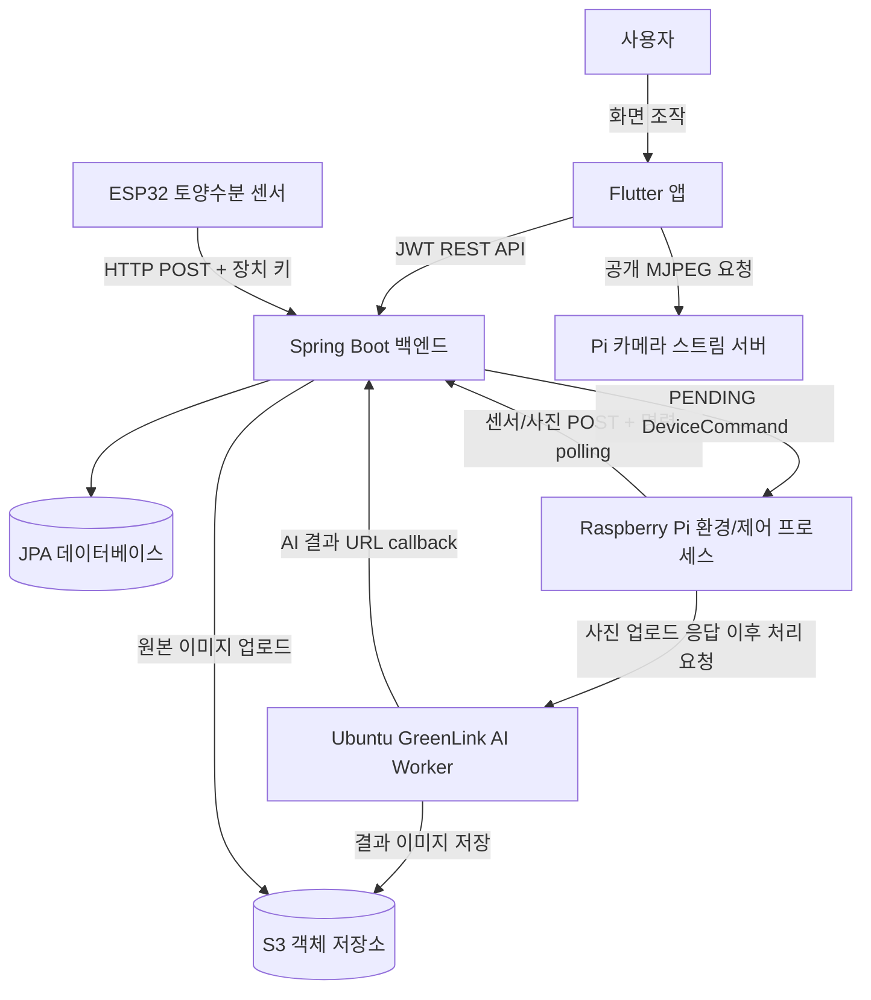

# GreenLink 프로젝트 전체 코드 분석

## 문서 범위와 확인 기준

이 문서는 루트에 배치된 `greenlink_back`, `greenlink_front`, `greenlink_esp`, `greenlink_pi`, `greenlink_ubuntu` 소스 코드를 직접 확인해 시스템 간 연결을 정리한 문서다. 문서에서 말하는 연결은 코드의 HTTP 요청, DTO, GPIO/센서 접근, 이미지 처리 호출로 확인된 것만 포함한다.

민감 정보는 값 자체를 기록하지 않는다. 실제 소스에는 JWT secret, Wi-Fi 자격 정보, 장치 키, 서버 주소, 소셜 로그인 SDK/클라이언트 설정과 같은 값이 존재하므로 운영 전 반드시 외부 설정으로 이동해야 한다.

## 프로젝트 목적

GreenLink는 사용자가 앱에서 식물을 심고 성장 상태를 확인하며, 실제 재배 장치에서 수집되는 환경/토양수분 데이터와 사진을 바탕으로 급수·조명 제어 및 AI 이미지 결과를 이용하는 서비스다.

코드로 확인되는 기능은 다음과 같다.

| 영역 | 코드상 역할 | 핵심 통신/저장 |
| --- | --- | --- |
| `greenlink_front` | 로그인, 식물/인벤토리/도감/퀘스트/IoT/자동화 UI | HTTPS REST, 공개 MJPEG stream |
| `greenlink_back` | 비즈니스 API, 인증, JPA 저장, 자동화 판단, 관리자 화면 | Spring MVC, MySQL/JPA, S3, JWT |
| `greenlink_esp` | 개별 식물의 토양수분 측정 및 업로드 | ADC, Wi-Fi HTTP POST |
| `greenlink_pi` | 공간 환경 측정, 카메라/MJPEG, 사진 업로드, 릴레이 명령 수행, AI 호출 | GPIO/I2C/DHT/Picamera2, HTTP |
| `greenlink_ubuntu` | 원본 사진을 AI 스타일 이미지로 처리하고 결과를 S3/백엔드에 반영 | FastAPI, OpenAI Images, rembg, S3, HTTP callback |

## 전체 폴더 구조

생성물, 외부 의존성, 이미지 결과물, IDE/Git 메타데이터는 상세 파일 나열에서 제외했다.

```text
codex/
├── greenlink_back/
│   ├── build.gradle
│   ├── gradlew, gradlew.bat
│   ├── gradle/wrapper/
│   └── src/
│       ├── main/java/com/greenlink/greenlink/
│       │   ├── controller/
│       │   ├── service/ (oauth/ 포함)
│       │   ├── repository/
│       │   ├── domain/ (user, plant, item, quest, attend, iot, ai, automation)
│       │   ├── dto/ (iot/, ai/ 포함)
│       │   ├── security/
│       │   ├── config/
│       │   └── common/
│       ├── main/resources/
│       │   ├── application.yaml
│       │   ├── templates/
│       │   └── static/                 # 관리자 테마 자산 다수
│       └── test/
├── greenlink_front/
│   ├── pubspec.yaml
│   ├── lib/
│   │   ├── main.dart
│   │   ├── core/ (config, constants, network, utils, widgets)
│   │   ├── models/
│   │   ├── services/
│   │   ├── screens/
│   │   ├── widgets/
│   │   └── theme/
│   ├── test/
│   └── android/, ios/, macos/, linux/, windows/
├── greenlink_esp/
│   ├── platformio.ini
│   └── src/main.cpp
├── greenlink_pi/
│   ├── config.py
│   ├── sensor_*.py, camera_*.py, stream_*.py
│   ├── uploader.py, ai_trigger.py, api_client.py
│   ├── relay_control.py, command_worker.py
│   └── run_sensor.sh, run_camera.sh, run_command.sh
├── greenlink_ubuntu/
│   ├── ai_worker_api.py
│   ├── process_one.py
│   ├── openai_transform.py, remove_pot.py
│   ├── s3_client.py
│   ├── 보조 이미지 처리 스크립트 및 스타일 자산
│   └── inputs/, outputs/                # 처리 중/결과 이미지 다수
└── docs/code-analysis/                  # 본 분석 문서 위치
```

## 주요 파일 역할

| 파일 경로 | 역할 | 중요도 | 연결되는 파일/기능 |
| --- | --- | --- | --- |
| `greenlink_back/src/main/java/.../controller/IotDeviceController.java` | ESP/Pi 수집·사진·명령 상태 API 수신 | 높음 | Pi/ESP, `IotDeviceDataService`, `IotCommandService` |
| `greenlink_back/src/main/java/.../service/AutomationService.java` | 센서 저장 직후 자동 급수/조명 명령 판단 | 높음 | 센서 엔티티, `DeviceCommand`, Pi worker |
| `greenlink_back/src/main/java/.../controller/IotAppController.java` | 앱용 IoT 조회 및 수동 제어 요청 | 높음 | Flutter `IotService`, `IotAppService` |
| `greenlink_front/lib/core/network/api_client.dart` | 앱 REST 요청/JWT 헤더 공통 처리 | 높음 | 모든 Flutter service |
| `greenlink_front/lib/screens/user_plant/user_plant_detail_page.dart` | 식물 상태, AI 이미지, IoT/자동화 진입 화면 | 높음 | `IotService`, `AutomationSection` |
| `greenlink_esp/src/main.cpp` | 토양수분 ADC 측정, 퍼센트 보정, 백엔드 업로드 | 높음 | 백엔드 ESP API |
| `greenlink_pi/command_worker.py` | 서버 명령 polling 후 펌프/LED/센서 갱신 실행 | 높음 | `relay_control.py`, 백엔드 명령 API |
| `greenlink_pi/uploader.py` | 사진 업로드 후 AI worker 트리거 | 높음 | 백엔드 사진 API, Ubuntu API |
| `greenlink_ubuntu/ai_worker_api.py` | 비동기 AI 처리 요청 API | 높음 | Pi `ai_trigger.py`, `process_one.py` |
| `greenlink_ubuntu/process_one.py` | 다운로드, 배경/화분 제거, AI 변환, S3 업로드, 결과 callback 오케스트레이션 | 높음 | OpenAI/S3/백엔드 |

## 전체 아키텍처



ESP가 Pi를 거쳐 전송된다는 코드는 확인되지 않았다. ESP 펌웨어는 백엔드 API로 직접 POST하며, Pi는 별도로 환경 센서·카메라·릴레이를 담당한다.

## 전체 데이터 흐름

### 센서 및 자동 제어

1. ESP32는 토양수분 raw 값을 여러 번 읽어 평균을 만들고 보정 퍼센트로 변환한다.
2. ESP32는 장치 키 헤더와 JSON body를 사용해 백엔드의 토양수분 API에 직접 전송한다.
3. Pi는 DHT22의 온도/습도와 BH1750의 조도를 읽고 백엔드 환경 데이터 API에 전송한다.
4. 백엔드는 각각 `EspSensorData`, `RaspberrySensorData`로 저장한다.
5. 저장 직후 `AutomationService`가 설정과 최근 명령/모델 상태를 검사하고 필요한 경우 `DeviceCommand`를 생성한다.
6. Pi의 `command_worker.py`가 pending 명령을 반복 조회해 펌프 또는 LED GPIO를 동작시키고 처리 결과를 백엔드에 PATCH한다.

### 사진 및 AI 결과

1. Pi의 카메라 스트림 프로세스는 전체 프레임과 식물별 crop MJPEG를 제공한다.
2. `camera_main.py`는 로컬 전체 MJPEG 스트림에서 스냅샷을 추출해 두 식물 crop 이미지를 만든다.
3. `uploader.py`가 식물별 이미지를 multipart 요청으로 백엔드에 업로드한다.
4. 백엔드는 이미지 파일을 S3에 올리고 `PlantImage` 메타데이터를 저장한 뒤 이미지 ID/URL을 응답한다.
5. Pi는 응답을 이용해 Ubuntu AI Worker의 `/process`를 호출한다.
6. Worker는 원본 이미지 다운로드, `rembg` 전처리, OpenAI 이미지 변환, 결과 S3 업로드를 처리한다.
7. Worker가 백엔드 AI 결과 endpoint에 최종 URL을 보내고, 백엔드는 `AiPlantImage`를 저장한다.
8. Flutter 앱은 최신 IoT 상태 조회 시 원본 이미지와 AI 이미지 URL을 받아 AI 이미지가 있으면 화면 표시에 사용한다.

## API, 장치, AI, DB 관계

| 발생 주체 | 백엔드 경로 | 저장/결과 | 후속 처리 |
| --- | --- | --- | --- |
| Flutter 사용자 | `/api/auth/*`, `/api/user-plants/*`, `/api/user-items/*`, `/api/user-quests/*`, `/api/collections/*`, `/api/attends/*` | 사용자·식물·아이템·퀘스트·출석 데이터 | JWT 인증 사용자 UI 갱신 |
| Flutter IoT 화면 | `/api/user-plants/{id}/iot/latest`, `/water`, `/light/on`, `/light/off` | 상태 조회 또는 `DeviceCommand` 생성 | Pi가 명령 수행 |
| ESP32 | `/api/iot/esp/soil-moisture` | `esp_sensor_data` | 자동 급수 평가 |
| Raspberry Pi | `/api/iot/raspberry/environment`, `/plant-images`, `/commands/*` | 환경/사진/명령 상태 | 자동 조명 평가, AI 트리거 |
| Ubuntu Worker | `/api/ai/plant-images/{id}/result` | `ai_plant_image` | 앱 이미지 표시 |

## 핵심 기능

### 인증과 앱 사용

* 목적: 사용자별 식물과 아이템, IoT 제어를 분리한다.
* 관련 파일: `AuthController`, `AuthService`, `SecurityConfig`, Flutter `AuthService`, `SplashPage`.
* 실행 흐름: 회원가입/로그인 또는 OAuth 코드 교환 후 JWT를 앱 로컬 저장소에 저장하고 이후 API에 Bearer 헤더로 전달한다.
* 입력값: 이메일/비밀번호/닉네임 또는 OAuth authorization code 및 redirect URI.
* 출력값: JWT access token과 사용자 정보.
* 내부 처리 과정: 비밀번호는 BCrypt 검증/저장, JWT는 백엔드에서 서명한다.
* 예외 처리: 입력 검증 실패 및 로그인 실패는 공통 API 실패 응답으로 처리한다.
* 다른 기능과의 연결: 사용자 인증 후 식물/제어/자동화 API 접근 가능.
* 주의할 점: 토큰과 소셜 설정값이 로그/소스에 노출될 수 있는 부분이 있다.

### 실물 재배 모니터링과 제어

* 목적: 실제 환경값을 저장하고 앱에서 상태 조회와 급수/조명을 제어한다.
* 관련 파일: ESP `main.cpp`, Pi `sensor_service.py`, `command_worker.py`, Backend `IotDeviceDataService`, `IotAppService`, `AutomationService`.
* 실행 흐름: 장치 업로드 -> DB 저장 -> 앱 조회 또는 자동화 명령 생성 -> Pi GPIO 실행 -> 상태 완료 보고.
* 입력값: 토양수분 raw/percent, 온도/습도/조도, 앱 제어 요청.
* 출력값: 센서 최신 상태, 명령 상태, GPIO 동작.
* 내부 처리 과정: 라즈베리파이는 재배 공간 단위, ESP는 사용자 식물 단위로 연결된다.
* 예외 처리: 미등록/비활성 장치, 중복 실행 명령, 센서 읽기 실패가 코드에서 거부 또는 로깅된다.
* 다른 기능과의 연결: 자동화 학습은 누적 센서/제어 기록을 사용한다.
* 주의할 점: 장치 키가 소스에 고정되어 있다.

### AI 식물 이미지 처리

* 목적: Pi 촬영 이미지를 앱용 스타일 이미지로 변환해 최신 상태에 표시한다.
* 관련 파일: Pi `camera_main.py`, `uploader.py`, `ai_trigger.py`; Ubuntu `ai_worker_api.py`, `process_one.py`, `openai_transform.py`; Backend `AiPlantImageService`.
* 실행 흐름: 사진 업로드 -> AI Worker background task -> 배경/화분 제거 -> OpenAI 이미지 편집 -> S3 -> 백엔드 callback.
* 입력값: 이미지 URL, 식물 이미지 ID, 선택적 식물 ID/작업명.
* 출력값: 최종 AI PNG URL과 `AiPlantImage` 기록.
* 내부 처리 과정: 결과 파일 경로와 S3 key는 원본 파일명 stem을 기준으로 구성한다.
* 예외 처리: Worker는 background job 예외를 출력하지만 요청 응답 이후 실패 상태를 백엔드에 저장하는 코드는 확인되지 않는다.
* 다른 기능과의 연결: 앱의 홈/식물 상세 화면이 결과 URL을 사용한다.
* 주의할 점: OpenAI와 S3 환경 변수가 필요하다.

## 핵심 진입점 상세

### `IotDeviceDataService.saveEspSoilMoisture` / `saveRaspberryEnvironment`

* 위치: `greenlink_back/src/main/java/com/greenlink/greenlink/service/IotDeviceDataService.java`
* 역할: 장치 키로 기기 유형을 검증하고 센서 데이터를 저장한 뒤 자동화 평가를 호출한다.
* 호출되는 시점: ESP 또는 Pi HTTP 업로드 수신 시.
* 매개변수: 장치 키 문자열, 해당 요청 DTO.
* 반환값: 저장된 센서 record 기반 응답 DTO.
* 내부 동작 순서: 활성 장치 조회 -> 타입/연결 검증 -> Entity 생성/저장 -> 최근 연결 시각 갱신 -> 자동화 평가.
* 관련 데이터: `IotDevice`, `EspSensorData`, `RaspberrySensorData`, `GrowSpace`, `UserPlant`.
* 의존 함수/클래스: repository, `AutomationService`.
* 에러 처리: 키가 없거나 유형/연결이 맞지 않으면 예외를 발생시키고 공통 handler가 API 오류로 변환한다.
* 개선 가능성: 장치 키 회전/해시 저장 및 요청 인증 강화가 필요하다.

### `camera_main.main` -> `upload_image` -> `trigger_ai_worker`

* 위치: `greenlink_pi/camera_main.py`, `greenlink_pi/uploader.py`, `greenlink_pi/ai_trigger.py`
* 역할: 동일 프레임을 식물별 이미지로 만들고 저장/AI 처리를 시작한다.
* 호출되는 시점: `run_camera.sh` 또는 직접 실행 시.
* 매개변수: 설정에 정의된 스트림 URL, crop 비율, userPlant ID.
* 반환값: 업로드 응답 및 AI Worker 시작 응답.
* 내부 동작 순서: MJPEG에서 1 frame 추출 -> crop -> multipart 백엔드 업로드 -> 이미지 ID 수신 -> AI process POST -> 임시 crop 삭제.
* 에러 처리: 각 식물 업로드 오류를 따로 기록하며 AI 호출 실패는 사진 업로드 성공을 되돌리지 않는다.
* 개선 가능성: 실패 사진 재전송 큐와 AI 처리 상태 조회가 필요하다.

### `process_one`

* 위치: `greenlink_ubuntu/process_one.py`
* 역할: AI 이미지 전체 pipeline을 순차 수행한다.
* 호출되는 시점: FastAPI background task 또는 CLI 실행 시.
* 매개변수: `image_url`, `name`, 선택적 `plant_image_id`, 백엔드 base URL.
* 반환값: 최종 URL/key, backend 저장 여부, 로컬 결과 경로 map.
* 내부 동작 순서: 원본 다운로드 -> rembg 세션 생성 -> 투명 이미지 생성 -> OpenAI 변환 -> S3 업로드 -> 백엔드 결과 저장.
* 에러 처리: 단계별 예외가 상위 job handler에 전달되어 출력된다.
* 개선 가능성: 처리 상태/실패 사유 callback, 비동기 job persistence가 필요하다.

## 전체 실행 순서

코드상 확인되는 전제와 실행 순서는 다음과 같다.

1. 백엔드가 사용할 DB, S3 자격 정보, OAuth 설정, 강한 JWT secret을 외부 설정으로 제공한다. DB 연결 세부 설정 파일은 저장소에서 확인되지 않는다.
2. `greenlink_back`에서 JDK 17과 Gradle wrapper로 Spring Boot 서버를 실행한다.
3. 관리자/인증 API를 이용해 기준 데이터, 사용자 식물, 재배 공간, Pi/ESP 기기 및 펌프 채널 연결을 준비한다.
4. Pi 서버 환경에 Python 가상환경과 센서/카메라/GPIO 의존성을 설치하고, `stream_server.py`, `command_worker.py`, 주기 센서/카메라 스크립트를 실행한다.
5. ESP32 펌웨어의 비밀·endpoint를 안전하게 주입하도록 수정/설정한 뒤 PlatformIO로 업로드한다.
6. Ubuntu AI Worker 환경에 Python 의존성과 OpenAI/S3 환경 변수를 구성하고 FastAPI 앱을 실행한다.
7. Flutter에서 의존성을 설치하고 앱을 실행해 로그인, 센서 조회, 이미지/제어 흐름을 확인한다.

| 영역 | 코드에서 확인되는 대표 명령 |
| --- | --- |
| Backend | `./gradlew bootRun`, `./gradlew test`, `./gradlew build` |
| Frontend | `flutter pub get`, `flutter run`, `flutter test`, `flutter build <platform>` |
| ESP | `pio run`, `pio run -t upload`, `pio device monitor` |
| Pi | `.venv/bin/python3 sensor_main.py`, `python3 stream_server.py`, `python3 command_worker.py`, 제공된 `run_*.sh` |
| Ubuntu AI | `uvicorn ai_worker_api:app --host <host> --port <port>` 또는 `python process_one.py --url <url> --name <name>` |

Python 패키지 manifest, Pi/AI의 systemd unit, 백엔드 DB 자격 설정의 실제 파일은 코드상 확인되지 않는다.

## 운영 및 배포 흐름

* 프론트의 API base URL과 카메라 stream URL은 코드 상수로 지정되어 있고 환경별 분리 구조는 확인되지 않는다.
* Pi shell script는 서버상의 고정 배치 디렉터리와 `.venv`를 사용하며 log 파일에 stdout/stderr를 append한다.
* Pi 센서 script 명칭과 로그 문구로 cron 실행 의도는 확인되지만, 실제 crontab 파일은 포함되어 있지 않다.
* Ubuntu Worker는 FastAPI background task로 처리하며 Dockerfile, process manager, requirements 파일은 포함되어 있지 않다.
* Backend는 `ddl-auto: update` 설정으로 실행 시 DB schema를 변경할 수 있다.

## 처음 확인할 문서 순서

1. 본 문서로 시스템 경계와 통신 방향을 파악한다.
2. [BACKEND.md](BACKEND.md)에서 API, DB entity, 인증, 자동화 명령 생성 방식을 확인한다.
3. [FRONTEND.md](FRONTEND.md)에서 사용자의 화면 흐름과 호출 API를 확인한다.
4. [ESP.md](ESP.md)와 [PI.md](PI.md)에서 실제 배선/장치 실행 및 명령 수행을 확인한다.
5. [UBUNTU_GREENLINK_AI.md](UBUNTU_GREENLINK_AI.md)에서 사진 처리 파이프라인과 서버 설정을 확인한다.

## 주의사항 및 개선 가능성

| 근거가 있는 주의점 | 영향 | 개선 방향 |
| --- | --- | --- |
| Backend `application.yaml`에 JWT secret이 하드코딩되어 있다. | 저장소 유출 시 token 위조 위험 | 환경 변수/secret manager로 이동하고 교체 |
| ESP와 Pi 설정 코드에 Wi-Fi/장치 인증/접속 관련 고정값이 포함된다. | 장치 가장 또는 서버 노출 위험 | provisioning 및 환경 파일로 외부화, 키 회전 |
| Flutter가 token 일부를 debug log에 출력하고 소셜 설정값을 소스에 둔다. | 로그/소스 배포 시 노출 위험 | token 로그 제거, build-time config 사용 |
| Frontend의 센서 refresh 경로는 backend controller에서 확인되지 않고 Pi만 `SENSOR_REFRESH` 처리 로직을 가진다. | 화면 버튼 요청 실패 가능 | backend 명령 생성 endpoint 구현 또는 UI 제거 |
| Backend 주석은 급수 5초이나 `DeviceCommand` 상수는 1초다. | 급수 기대량과 실제 동작 불일치 | 설정값 단일화 및 통합 테스트 |
| Pi `camera_snapshot_main.py`는 코드상 제공되지 않은 stream route를 요청한다. | 해당 대체 촬영 entrypoint 실패 | 라우트 추가 또는 현재 MJPEG 추출 방식으로 통일 |
| Ubuntu `compose_pot.py` 첫 줄에 비정상 문자가 존재한다. | 파일 import/직접 실행 시 문법 오류 | 문자 제거 후 테스트 |
| AI 결과 callback API가 공개 허용되어 있고 Worker 실패 callback이 없다. | 임의 결과 저장/처리 상태 불명확 | 서비스 간 인증과 실패 상태 저장 추가 |

## 정리 요약

GreenLink는 Flutter 앱, Spring Boot/JPA API, ESP32 센서, Raspberry Pi 카메라·릴레이 게이트웨이, Ubuntu AI Worker가 HTTP 중심으로 연결된 식물 관리 시스템이다. 센서 저장과 자동화 명령, 사진 업로드와 AI 이미지 반환 경로는 코드로 확인되며, 실제 배포를 위해서는 비밀 외부화와 API/스크립트 불일치 해소가 선행되어야 한다.

## 추가로 확인하면 좋은 점

* 저장소에 없는 DB datasource/OAuth/AWS 실설정 공급 방식과 운영 secret 관리 방식.
* Pi의 실제 `cron`/`systemd` 등록 내용 및 stream 공개 proxy/TLS 구성.
* Ubuntu Worker의 설치 manifest, 프로세스 재시작 정책, OpenAI 사용량/실패 재처리 정책.
* 프론트가 호출하는 센서 새로고침 API와 backend 구현의 정합성.
