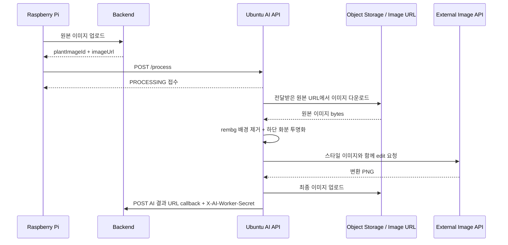

# Ubuntu greenlink-ai 코드 분석

## 분석 범위와 greenlink-ai의 역할

`greenlink_ubuntu/`는 Raspberry Pi가 업로드한 식물 사진을 입력으로 받아 배경/화분 영역을 제거하고, 이미지 생성 API를 이용해 GreenLink 스타일의 투명 배경 이미지를 생성한 뒤 저장소에 업로드하고 백엔드에 결과 URL을 등록하는 Python 작업자 코드입니다.

코드에서 확인되는 AI 기능은 이미지 변환 처리입니다. 센서값 분석, 생육 예측, 물주기 추천, 자체 학습 모델 훈련 파일은 확인되지 않습니다. 서버 주소와 클라우드/API 자격 증명에 해당하는 설정은 값 자체를 문서에 노출하지 않습니다.

## 기술 스택

| 구분 | 확인된 기술 / 패키지 | 사용 기능 |
| --- | --- | --- |
| 언어 | Python | 전체 처리 코드 |
| API 서버 | FastAPI, Pydantic | `/health`, `/process` |
| HTTP 요청 | `requests` | 이미지 다운로드, 백엔드 callback |
| 이미지 처리 | Pillow, NumPy | 이미지 저장, 투명 영역/조합 처리 |
| 배경 제거 AI | `rembg`, `u2netp` session | 배경 제거 및 전처리 |
| 생성형 이미지 변환 | OpenAI Python client, Images edit 모델 지정 | 스타일 변환 결과 생성 |
| 객체 저장 | `boto3` | 최종 이미지 S3 업로드 |
| 설정 로딩 | `python-dotenv` | 환경 변수 로드 |
| 서버 실행기 | FastAPI 앱 실행에는 ASGI server가 필요 | 실행 스크립트/고정 명령은 코드상 확인되지 않음 |

`requirements.txt`, `pyproject.toml`, virtual environment 설정 파일, Dockerfile, systemd service 파일은 프로젝트 폴더에서 확인되지 않았습니다.

## 전체 파일 구조

```text
greenlink_ubuntu/
├── ai_worker_api.py
├── process_one.py
├── openai_transform.py
├── remove_pot.py
├── s3_client.py
├── style_plant.png
├── inputs/
│   └── ...  (다운로드된 원본 이미지 다수)
└── outputs/
    └── ...  (전처리/AI 결과/조합 이미지 다수)
```

`.git/`, `.idea/`, `__pycache__/`, 가상환경과 캐시 파일은 제외했습니다. `inputs/`와 `outputs/`는 실행 결과물이 누적된 디렉터리로 보이며 상세 파일명 나열은 생략합니다.

## 주요 파일 역할

| 파일 경로 | 역할 | 중요도 | 연결되는 파일/기능 |
| --- | --- | --- | --- |
| `ai_worker_api.py` | FastAPI health/process endpoint와 background task 실행 | 높음 | Pi AI 요청 |
| `process_one.py` | 이미지 처리 전체 파이프라인 orchestration과 backend callback | 높음 | 다운로드, 변환, S3, Backend |
| `remove_pot.py` | `rembg` 배경 제거 후 하단 화분 영역을 투명 처리 | 높음 | 전처리 |
| `openai_transform.py` | 소스/스타일 이미지를 image edit API에 보내 최종 스타일 이미지 생성 | 높음 | 외부 AI API |
| `s3_client.py` | 최종 PNG를 객체 저장소에 업로드하고 URL 구성 | 높음 | 결과 저장 |
| `style_plant.png` | 스타일 변환 참조 이미지 | 높음 | `openai_transform.py` |
| `inputs/` | 다운로드한 원본 이미지 저장 위치 | 중간 | `process_one.py` |
| `outputs/` | 전처리와 최종 변환 결과 저장 위치 | 중간 | `process_one.py` |

삭제 완료된 legacy 파일은 `ai_background_remove.py`, `alpha_composite.py`, `compose_pot.py`, `pot_base.png`입니다.

## 환경 변수와 설정 파일

| 설정 항목 | 코드 사용 위치 | 확인 상태 |
| --- | --- | --- |
| 외부 이미지 생성 API 키 | `openai_transform.py` | 환경 변수에서 읽음. 값은 문서화하지 않음 |
| 클라우드 access/secret key | `s3_client.py` | 환경 변수에서 읽음. 값은 문서화하지 않음 |
| 객체 저장소 bucket/region | `s3_client.py` | 환경 변수 및 기본 처리 코드 확인. 실제 값은 문서화하지 않음 |
| Backend base URL | `process_one.py` | 코드 기본값으로 서버 주소 종류가 포함되어 있음. 실제 값은 노출하지 않음 |
| `AI_WORKER_SECRET` | `process_one.py` | 없으면 `gl-ai-worker-secret-change-me` fallback 사용. Backend `greenlink.ai.worker-secret`과 일치해야 함 |
| `.env` | `dotenv` 로딩 | 프로젝트 폴더에 실제 `.env` 파일은 확인되지 않음 |

API 키와 클라우드 자격 증명은 환경 변수를 기대하지만, 실제 운영 서버에서 어떻게 주입하는지와 회전 방식은 코드상 확인되지 않습니다.

## 실행 방식

### 필요한 프로그램과 패키지

* Python 실행 환경.
* FastAPI 앱을 제공할 ASGI server, 예를 들면 Uvicorn.
* `fastapi`, `pydantic`, `requests`, `rembg`, Pillow, NumPy, OpenAI client, `boto3`, `python-dotenv` 등 코드가 import하는 패키지.
* 외부 이미지 생성 API 및 객체 저장소 설정.
* 백엔드에서 접근 가능한 결과 callback endpoint.

정확한 패키지 버전과 가상환경 생성/설치 명령은 저장소에서 확인되지 않습니다.

### API 서버 실행 예

FastAPI app 객체가 `ai_worker_api.py`에 있으므로 일반적인 실행 형태는 다음과 같습니다. 이 명령 자체를 고정한 배포 스크립트는 코드상 확인되지 않습니다.

```bash
cd greenlink_ubuntu
uvicorn ai_worker_api:app --host <host> --port <port>
```

### 단건 처리 CLI

`process_one.py`에는 URL 입력을 받는 CLI 진입점이 구현되어 있습니다.

```bash
cd greenlink_ubuntu
python process_one.py --url <image-url> --name <job-name> --plant-image-id <image-id>
```

### 실행 순서

1. 환경 변수로 외부 API와 객체 저장소 자격 증명을 안전하게 제공합니다.
2. `style_plant.png`가 작업 디렉터리에 존재하는지 확인합니다.
3. FastAPI worker를 실행합니다.
4. Pi가 백엔드 원본 이미지 업로드 후 worker `/process`를 호출합니다.
5. background task가 이미지를 내려받고 전처리/변환/업로드/callback을 실행합니다.
6. 백엔드와 앱에서 AI 이미지 연결 여부를 확인합니다.

## API Endpoint

### greenlink-ai가 제공하는 API

| Method | URL | 역할 | 입력 | 출력 | 관련 파일 |
| --- | --- | --- | --- | --- | --- |
| GET | `/health` | worker 상태 확인 | 없음 | 상태 응답 | `ai_worker_api.py` |
| POST | `/process` | 이미지 변환 작업 접수 및 background task 시작 | `plantImageId`, 선택 `userPlantId`, `imageUrl`, 선택 `name` | 처리 접수 상태와 작업 이름 | `ai_worker_api.py` |

### greenlink-ai가 호출하는 외부 API

| Method | 대상 | 역할 | 입력 | 출력 | 관련 파일 |
| --- | --- | --- | --- | --- | --- |
| GET | 원본 이미지 URL | 백엔드/S3에 저장된 원본 다운로드 | 이미지 URL | JPEG/이미지 bytes | `process_one.py` |
| Image Edit 요청 | 외부 이미지 생성 API | 식물 전처리 이미지를 스타일 변환 | 전처리 PNG, 스타일 PNG, prompt | 생성 PNG 데이터 | `openai_transform.py` |
| Upload | 객체 저장소 | 최종 PNG 저장 | 결과 파일, key, content type | 공개형 결과 URL 구성 | `s3_client.py` |
| POST | Backend AI result endpoint | 원본 이미지와 최종 AI URL 연결 | `finalAiUrl`, `X-AI-Worker-Secret` header | 저장 결과 | `process_one.py` |

## 입력 및 출력 데이터 구조

### `/process` 요청

| 필드 | 타입 | 필수 여부 | 의미 |
| --- | --- | --- | --- |
| `plantImageId` | integer | 필수 | 백엔드가 저장한 원본 사진 식별자 |
| `userPlantId` | integer 또는 null | 선택 | 사용자 식물 식별자 |
| `imageUrl` | string | 필수 | 다운로드할 원본 이미지 주소 |
| `name` | string 또는 null | 선택 | 로컬/저장 결과 이름 기준 |

### 파이프라인 산출물

| 산출물 | 형식 | 저장 위치/전달 대상 | 생성 코드 |
| --- | --- | --- | --- |
| 다운로드 원본 | 이미지 파일 | `inputs/` | `download_image()` |
| 배경/화분 제거 결과 | 투명 PNG | `outputs/` | `remove_background_and_pot()` |
| AI 변환 최종 결과 | 투명 PNG | `outputs/` 및 객체 저장소 | `transform_to_greenlink_style()`, `upload_file()` |
| 결과 callback payload | JSON (`finalAiUrl`) + `X-AI-Worker-Secret` header | Backend | `save_ai_result_to_backend()` |

### 처리 응답과 비동기 의미

`/process`는 무거운 이미지 처리를 요청 안에서 완료한 결과를 바로 반환하지 않고, FastAPI `BackgroundTasks`에 작업을 추가한 뒤 처리 접수 상태를 반환합니다. 실제 성공 여부는 worker 로그와 백엔드에 AI 이미지 결과가 등록되는지를 통해 확인해야 합니다. 별도 job status 조회 endpoint는 확인되지 않습니다.

## AI 처리 및 운영 흐름



### 코드상 확인되는 실제 연결 관계

* Pi의 `uploader.py`가 원본 이미지 업로드 완료 후 `ai_trigger.py`를 통해 AI worker를 직접 호출합니다.
* 백엔드가 AI worker에 처리 요청을 발송하는 코드는 확인되지 않습니다.
* AI worker는 결과 생성 후 백엔드의 plant image result endpoint에 최종 URL을 등록합니다.
* 앱은 백엔드 최신 이미지 응답을 통해 AI 이미지 URL을 사용할 수 있습니다.

## 핵심 기능 설명

### AI 처리 API 접수와 비동기 실행

* 목적: Pi의 요청을 빠르게 접수하고 이미지 변환을 background task로 수행합니다.
* 관련 파일: `ai_worker_api.py`.
* 실행 흐름: `/process`가 요청 모델을 검증하고 작업명을 구성한 뒤 `run_ai_job()`을 background task에 넣고 PROCESSING 응답을 반환합니다.
* 입력값: 원본 이미지 ID, 사용자 식물 ID, 이미지 URL, 선택 이름.
* 출력값: 즉시 접수 응답; 이후 처리의 side effect.
* 내부 처리 과정: Pydantic validation, 이름 생성, 작업 큐 등록, `process_one()` 호출.
* 예외 처리: background 실행 중 예외는 출력 로그로 기록되며 요청자에게 완료 실패를 push하는 코드가 확인되지 않습니다.
* 다른 기능과의 연결: Pi trigger, 처리 파이프라인, 백엔드 callback.
* 주의할 점: 프로세스 재시작 또는 작업 실패 시 영속 작업 큐/재시도/status endpoint가 없습니다.

### 배경 제거와 화분 영역 제거

* 목적: 식물 중심의 투명 이미지 입력을 만들어 스타일 변환 품질을 높입니다.
* 관련 파일: `remove_pot.py`.
* 실행 흐름: pretrained background-removal session으로 배경을 제거한 후 알파 영역의 아래쪽 일부를 투명화하여 화분으로 간주한 부분을 제거합니다.
* 입력값: 다운로드 원본 이미지.
* 출력값: 투명 배경의 식물 전처리 PNG와 선택적 디버그 이미지.
* 내부 처리 과정: `u2netp` session 생성, rembg 출력, 알파 mask 분석, 객체 하단 `FALLBACK_TRIM_RATIO = 0.24` 비율 제거, `BOTTOM_PAD_PX = 28` 하단 투명 padding 추가.
* 예외 처리: 입력/출력 파일 처리 실패는 상위 처리로 전파됩니다.
* 다른 기능과의 연결: 외부 이미지 변환 입력.
* 주의할 점: 화분 제거는 학습된 화분 검출기가 아니라 하단 영역을 제거하는 규칙 기반 처리이므로 식물 잎이나 줄기가 잘릴 수 있습니다.

### GreenLink 스타일 이미지 변환

* 목적: 원본 식물 형상을 유지하면서 서비스 표시용 스타일 이미지로 변환합니다.
* 관련 파일: `openai_transform.py`, `style_plant.png`.
* 실행 흐름: 전처리 투명 PNG와 스타일 참조 이미지를 외부 Images edit 요청의 입력으로 보내고 반환된 이미지를 파일로 저장합니다.
* 입력값: 전처리 이미지 파일, 스타일 asset, prompt, 외부 API key.
* 출력값: 최종 변환 PNG.
* 내부 처리 과정: 환경 변수에서 client 설정 로드, 이미지 입력 열기, 지정 이미지 편집 모델 호출, base64 결과 디코딩/저장.
* 확인된 호출 파라미터: `model="gpt-image-1.5"`, `image=[img1, img2]`, `prompt=PROMPT`, `input_fidelity="high"`.
* 예외 처리: API 호출 또는 파일 저장 실패는 처리 작업 실패로 전파됩니다.
* 다른 기능과의 연결: S3 업로드 및 백엔드 결과 등록.
* 주의할 점: 코드상 `background="transparent"` 또는 `output_format="png"` 파라미터는 사용하지 않습니다. 외부 API 비용, 지연, 사용량 제한과 이미지/개인정보 전송 정책을 운영에서 확인해야 합니다.

### 결과 저장과 백엔드 callback

* 목적: 생성된 최종 이미지를 앱에서 참조 가능한 URL로 만들고 원본 이미지 레코드와 연결합니다.
* 관련 파일: `s3_client.py`, `process_one.py`.
* 실행 흐름: 최종 PNG를 객체 저장소에 업로드하고 URL을 구성한 뒤 백엔드 결과 endpoint에 POST합니다.
* 입력값: 최종 PNG, 저장 key, plant image ID.
* 출력값: 최종 이미지 URL과 백엔드 연결 완료 결과.
* 내부 처리 과정: boto3 client 구성, content type을 포함한 upload, `X-AI-Worker-Secret` header를 포함한 callback JSON 전송.
* 예외 처리: 업로드 또는 callback 실패는 작업 예외가 되며 재시도/보상 트랜잭션은 확인되지 않습니다.
* 다른 기능과의 연결: 백엔드 `AiPlantImage`, Flutter 표시.
* 주의할 점: callback endpoint는 백엔드 `AiWorkerAuthInterceptor`의 shared secret header 검증을 통과해야 합니다.

## 핵심 Function / Class 상세 설명

### `ProcessRequest` 및 `process_image()`

* 위치: `ai_worker_api.py`
* 역할: AI API 요청 계약을 정의하고 background processing을 시작합니다.
* 호출되는 시점: Pi가 `/process`에 POST할 때.
* 매개변수: `plantImageId`, `userPlantId`, `imageUrl`, `name`.
* 반환값: 작업 접수 상태 JSON.
* 내부 동작 순서:
  1. Pydantic이 요청 필드 타입을 검증합니다.
  2. 이름이 없으면 시각/식별자 기반 이름을 생성합니다.
  3. `run_ai_job()`을 BackgroundTasks에 등록합니다.
  4. 처리 중임을 나타내는 응답을 즉시 반환합니다.
* 관련 데이터: 원본 사진 ID와 다운로드 URL.
* 의존하는 다른 함수/클래스: FastAPI, `run_ai_job()`, `process_one()`.
* 에러 처리 방식: 요청 형식 오류는 API 검증 오류가 되고, background 처리 예외는 콘솔 출력으로 제한됩니다.
* 개선 가능성: 작업 ID, 상태 저장소, 재시도 큐와 완료/실패 조회 API를 추가할 수 있습니다.

### `process_one(...)`

* 위치: `process_one.py`
* 역할: 다운로드부터 AI 결과 callback까지 단건 이미지 처리의 전체 실행 흐름을 조율합니다.
* 호출되는 시점: API background task 또는 CLI 실행 시.
* 매개변수: 원본 이미지 URL, 이름, 선택 plant image ID, 선택 backend URL.
* 반환값: 최종 URL, 로컬 경로 및 callback 성공 여부를 담은 결과.
* 설정값: `AI_WORKER_SECRET = os.environ.get("AI_WORKER_SECRET", "gl-ai-worker-secret-change-me")`로 callback shared secret을 읽습니다.
* 내부 동작 순서:
  1. 입출력 디렉터리를 준비하고 스타일 asset 존재 여부를 검사합니다.
  2. 원본 이미지를 `inputs/`로 다운로드합니다.
  3. 배경 제거 session을 만들고 식물 전처리 PNG를 생성합니다.
  4. 스타일 참조 이미지를 사용해 외부 AI 변환 결과를 생성합니다.
  5. 최종 결과를 객체 저장소에 업로드합니다.
  6. plant image ID가 있으면 `X-AI-Worker-Secret` header를 포함해 백엔드에 최종 URL을 저장합니다.
  7. 결과 경로/URL 정보를 반환합니다.
* 관련 데이터: 입력 URL, local input/output 파일, final URL, image ID.
* 의존하는 다른 함수/클래스: `remove_pot`, `openai_transform`, `s3_client`, `requests`.
* 에러 처리 방식: 단계 오류가 상위 task로 전파되며, 부분 완료 결과를 복구하는 로직은 확인되지 않습니다.
* 개선 가능성: 단계별 idempotency, 업로드/callback retry, 실패 결과 저장과 로컬 파일 정리 정책을 추가해야 합니다.

### `remove_background_and_pot(...)`

* 위치: `remove_pot.py`
* 역할: 배경 제거 모델과 하단 mask 처리를 이용하여 투명 식물 이미지를 만듭니다.
* 호출되는 시점: `process_one()` 전처리 단계.
* 매개변수: 입력 이미지 경로, 출력 경로, rembg session.
* 반환값: 저장된 투명 PNG 경로 또는 처리 결과.
* 내부 동작 순서:
  1. 원본 이미지에 `rembg`를 적용합니다.
  2. 알파 채널이 존재하는 식물 객체 영역을 분석합니다.
  3. `FALLBACK_TRIM_RATIO = 0.24`를 사용해 객체 아래쪽 24%를 화분 영역으로 간주하여 투명화합니다.
  4. `BOTTOM_PAD_PX = 28` 하단 투명 여백을 포함한 PNG를 출력합니다.
* 관련 데이터: RGBA 픽셀 및 alpha mask.
* 의존하는 다른 함수/클래스: `rembg.new_session`, Pillow/NumPy.
* 에러 처리 방식: 파일 또는 이미지 연산 오류는 호출자 작업 실패로 이어집니다.
* 개선 가능성: 현재 기준값은 `ALPHA_THRESHOLD = 12`, `FALLBACK_TRIM_RATIO = 0.24`, `BOTTOM_PAD_PX = 28`로 고정되어 있습니다. 식물 보존 품질을 검증하는 샘플 테스트와 실제 화분 segmentation 방식 비교가 필요합니다.

### `transform_to_greenlink_style(...)`

* 위치: `openai_transform.py`
* 역할: 전처리된 식물과 style reference를 외부 이미지 편집 모델로 변환합니다.
* 호출되는 시점: 전처리 PNG 생성 후.
* 매개변수: 식물 PNG 입력, style asset 경로, 출력 경로.
* 반환값: 저장된 최종 이미지 경로.
* 내부 동작 순서:
  1. 환경 설정에서 API client를 초기화합니다.
  2. 입력 이미지와 스타일 참조 파일을 엽니다.
  3. 코드에 정의된 변환 prompt와 `model="gpt-image-1.5"`, `image=[img1, img2]`, `input_fidelity="high"` 옵션으로 image edit 요청을 보냅니다.
  4. 응답 이미지 데이터를 디코딩하여 PNG로 저장합니다.
* 관련 데이터: 투명 PNG, 참조 이미지, 생성 응답.
* 의존하는 다른 함수/클래스: OpenAI client, dotenv, base64/file IO.
* 에러 처리 방식: 자격 증명 누락 또는 API/디코딩 실패가 호출자에게 전파됩니다.
* 개선 가능성: prompt가 코드 상수로 고정되어 있으므로 운영 중 prompt 변경이 필요하면 설정 파일 또는 DB 관리로 분리할 수 있습니다. 요청 비용/지연 metric, 실패 유형별 재시도 및 입력 이미지 크기 제한도 정의할 수 있습니다.

### `upload_file(...)` 및 `save_ai_result_to_backend(...)`

* 위치: `s3_client.py`, `process_one.py`
* 역할: 최종 이미지를 저장소에 올리고 백엔드 원본 사진과 결과를 연결합니다.
* 호출되는 시점: 변환 파일 생성 후.
* 매개변수: local final image, 저장 key, backend image ID와 final URL.
* 반환값: 결과 URL 및 callback 상태.
* 내부 동작 순서:
  1. 환경 변수 기반 저장소 client를 만듭니다.
  2. PNG content type과 함께 파일을 업로드합니다.
  3. 생성된 final URL로 백엔드 callback payload를 만듭니다.
  4. `X-AI-Worker-Secret` header를 포함해 결과 endpoint에 POST하여 연결을 저장합니다.
* 관련 데이터: 저장 key, final URL, plant image ID.
* 의존하는 다른 함수/클래스: `boto3`, `requests`.
* 에러 처리 방식: 저장 또는 callback 요청 실패가 단건 작업 실패로 처리됩니다.
* 개선 가능성: 공개 URL 노출 정책, signed access 여부, callback 재시도/중복 방지 전략을 명시해야 합니다.

## 모델 파일, 학습 파일 및 보조 코드

| 항목 | 확인 결과 |
| --- | --- |
| 배경 제거 모델 | `rembg`에서 `u2netp` pretrained session을 사용하는 코드 확인 |
| 이미지 생성 모델 | 외부 image edit API의 지정 모델 사용 확인 |
| 서비스 스타일 asset | `style_plant.png` 사용 확인 |
| 화분 asset | `pot_base.png` 삭제 완료 |
| 자체 학습 dataset / train script | 확인되지 않음 |
| 센서 분석/예측 model | 확인되지 않음 |
| 추천/진단 model | 확인되지 않음 |
| 결과 파일 | `inputs/`, `outputs/`에 실행 산출 이미지 다수 확인 |

### 보조 코드 상태

`ai_background_remove.py`, `alpha_composite.py`, `compose_pot.py`, `pot_base.png`는 legacy 보조/실험 파일로 정리되어 삭제 완료되었습니다. 현재 active 경로는 `process_one.py` → `remove_pot.py` → `openai_transform.py` → `s3_client.py` → Backend callback입니다.

## 서버 운영, 로그 및 저장 방식

| 운영 항목 | 코드상 확인 내용 | 미확인 / 위험 |
| --- | --- | --- |
| API 구동 | FastAPI app 존재 | Uvicorn 실행 service/unit, reverse proxy 확인되지 않음 |
| 작업 실행 | `BackgroundTasks` 기반 프로세스 내부 비동기 작업 | 프로세스 종료 시 복구 queue 없음 |
| 원본/중간/최종 파일 | 로컬 `inputs/`, `outputs/` 저장 | 보존 기간/cleanup 정책 확인되지 않음 |
| 최종 결과 저장 | 객체 저장소 업로드 | 공개 접근/수명/삭제 정책 확인되지 않음 |
| 로그 | `print` 중심 처리 메시지 | 구조화 로그, rotation, monitoring 확인되지 않음 |
| 인증 | Pi가 worker endpoint 호출, worker가 Backend callback 호출 | Pi → worker `/process` 보안 상태는 기존 검토 항목으로 유지. Backend callback은 `X-AI-Worker-Secret` header를 포함하고 `AiWorkerAuthInterceptor`가 검증 |

## 예외 처리

| 오류 지점 | 현재 처리 방식 | 개선 필요성 |
| --- | --- | --- |
| `/process` 요청 형식 | Pydantic/FastAPI validation | 적절함, 접근 인증 별도 필요 |
| background 작업 실패 | 예외를 출력 | 실패 상태 저장과 재시도 없음 |
| 원본 다운로드 실패 | 작업 실패로 전파 | URL 만료/네트워크 재시도 필요 |
| 배경 제거/변환 실패 | 작업 실패로 전파 | 단계별 오류 상태와 재처리 필요 |
| 저장소 업로드 실패 | 작업 실패로 전파 | 재시도 및 중복 key 정책 필요 |
| Backend callback 실패 | 작업 실패로 전파 | 업로드된 결과와 DB 연결 복구 작업 필요 |

## 주의사항 및 개선 가능성

| 항목 | 실제 코드 근거 | 주의 / 개선 방향 |
| --- | --- | --- |
| 의존성/배포 정의 없음 | 패키지 선언, Docker, service 파일 미확인 | requirements lock, container 또는 systemd 정의 추가 |
| 서버 주소 코드 포함 | `process_one.py`의 기본 backend 설정 | 환경 변수로 이동하고 환경별 설정 분리 |
| worker 접근 인증 부재 | `/process`에 인증 검사 확인되지 않음 | Pi 전용 인증 또는 서명, 네트워크 제한 필요 |
| backend callback secret 관리 | 결과 POST는 `X-AI-Worker-Secret` header 필요 | 운영 secret 외부화/회전 및 idempotency key 추가 |
| 비영속 background task | FastAPI process 내부 작업 | Redis/DB queue 또는 작업 상태 저장으로 복구 가능하게 구성 |
| 산출물 누적 | `inputs/`, `outputs/` 결과 파일 다수 | cleanup, 보존, 개인정보/이미지 접근 정책 필요 |
| 화분 제거 품질 | 하단 비율을 단순 투명화 | 식물 손상 여부 테스트와 더 정교한 segmentation 검토 |
| 외부 AI 의존 | API 호출 기반 변환 | 비용/지연/실패/데이터 전달 정책 모니터링 |
| legacy 보조 파일 | `ai_background_remove.py`, `alpha_composite.py`, `compose_pot.py`, `pot_base.png` 삭제 완료 | active 경로에 재도입하지 않도록 문서와 배포 파일 목록 유지 |
| 테스트 부재 | 테스트 파일 확인되지 않음 | 전처리 unit test, API contract, callback 통합 테스트 추가 |

<!-- BEGIN GENERATED SOURCE APPENDIX -->
## 소스 코드 원문 부록

### 포함 범위와 마스킹 원칙

AI worker와 active 이미지 처리 Python 소스를 포함한다. 삭제 완료된 legacy 파일, 실행 산출물인 `inputs/`, `outputs/`, 캐시와 IDE/Git 데이터는 제외한다.

아래 코드는 확인한 저장소 파일의 원문을 문서에 수록한 것이다. 다만 소스에 존재하는 비밀키, 토큰/장치 키, Wi-Fi 자격 정보, 실서버 주소 및 외부 저장소 URL은 `<REDACTED_SECRET>`, `<REDACTED_DEVICE_KEY>`, `<REDACTED_URL>` 또는 `<REDACTED_IP>`로 치환했으므로 그대로 빌드하기 위한 사본이 아니라 분석용 사본이다.

### 수록 파일 목록

* `ai_worker_api.py`
* `openai_transform.py`
* `process_one.py`
* `remove_pot.py`
* `s3_client.py`

### 원문 코드

#### `ai_worker_api.py`

~~~~python
from datetime import datetime

from fastapi import FastAPI, BackgroundTasks
from pydantic import BaseModel

from process_one import process_one


app = FastAPI(title="GreenLink AI Worker")


class ProcessRequest(BaseModel):
    plantImageId: int
    userPlantId: int | None = None
    imageUrl: str
    name: str | None = None


@app.get("/health")
def health_check():
    return {
        "success": True,
        "message": "GreenLink AI Worker is running",
    }


def make_job_name(request: ProcessRequest) -> str:
    name = request.name

    if name is not None and name.strip() != "":
        return name

    timestamp = datetime.now().strftime("%Y%m%d_%H%M%S")

    if request.userPlantId is not None:
        return f"user_plant_{request.userPlantId}_image_{request.plantImageId}_{timestamp}"

    return f"plant_image_{request.plantImageId}_{timestamp}"


def run_ai_job(
    image_url: str,
    name: str,
    plant_image_id: int,
):
    try:
        print("===== GreenLink AI Background Job Start =====")
        print(f"[AI_WORKER] plantImageId: {plant_image_id}")
        print(f"[AI_WORKER] imageUrl: {image_url}")
        print(f"[AI_WORKER] name: {name}")

        result = process_one(
            image_url=image_url,
            name=name,
            plant_image_id=plant_image_id,
        )

        print("===== GreenLink AI Background Job Done =====")
        print(f"[AI_WORKER] result: {result}")

    except Exception as e:
        print("===== GreenLink AI Background Job Failed =====")
        print(f"[AI_WORKER] error: {e}")


@app.post("/process")
def process_image(
    request: ProcessRequest,
    background_tasks: BackgroundTasks,
):
    name = make_job_name(request)

    background_tasks.add_task(
        run_ai_job,
        request.imageUrl,
        name,
        request.plantImageId,
    )

    return {
        "success": True,
        "message": "AI processing started",
        "data": {
            "plantImageId": request.plantImageId,
            "userPlantId": request.userPlantId,
            "imageUrl": request.imageUrl,
            "name": name,
            "status": "PROCESSING",
        },
    }
~~~~

#### `openai_transform.py`

~~~~python
from pathlib import Path
import base64
import os

from dotenv import load_dotenv
from openai import OpenAI


load_dotenv()

client = OpenAI(api_key=os.getenv("OPENAI_API_KEY"))


PROMPT = """Image 1 is the source plant image.
Image 2 is only a visual style reference for the GreenLink app.

Your task is to redraw the exact same plant from Image 1.
Do not design a new plant.
Do not create a generic sprout.
Do not make a prettier, cleaner, more balanced, or more symmetrical plant.
Do not copy the plant shape from Image 2.
Image 2 must be used only for color mood, softness, texture, and illustration finish.

The plant structure from Image 1 is the highest priority.

Strict structure preservation rules:
- Preserve the same overall silhouette from Image 1.
- Preserve the same leaf count as much as possible.
- Preserve the position, direction, angle, and relative size of the leaves.
- Preserve the stem direction, length, curvature, and visible branching.
- Preserve the asymmetry of the original plant.
- Preserve the original growth stage.
- Do not add new leaves.
- Do not remove important visible leaves.
- Do not rearrange leaves.
- Do not turn the plant into a symmetrical icon.
- Do not replace the plant with a four-leaf sprout.
- Do not simplify the plant into a logo-like symbol.
- Do not change the species or make it look like a different plant.

Rendering style:
- Convert the source plant into a soft GreenLink-style illustration.
- Use gentle green colors, smooth edges, and soft shading.
- Make it look friendly and suitable for a mobile app.
- Simplify only the surface texture, not the shape.
- The result should still be recognizable as the same plant from Image 1.

Background and object rules:
- Keep only the plant.
- Do not generate any pot, planter, soil, container, sensor, wire, label, decorative object, or background scene.
- If there are small non-plant artifacts in Image 1, ignore them.
- Keep the plant isolated and ready to be composited onto a separate pot asset.

Final requirement:
The final image must look like Image 1 redrawn in the soft visual style of Image 2.
The shape must come from Image 1.
The style must come from Image 2.
"""


def transform_to_greenlink_style(
    source_transparent_path: Path,
    style_image_path: Path,
    output_path: Path,
):
    if not source_transparent_path.exists():
        raise FileNotFoundError(f"소스 이미지가 없습니다: {source_transparent_path}")

    if not style_image_path.exists():
        raise FileNotFoundError(f"스타일 이미지가 없습니다: {style_image_path}")

    output_path.parent.mkdir(parents=True, exist_ok=True)

    with open(source_transparent_path, "rb") as img1, open(style_image_path, "rb") as img2:
        result = client.images.edit(
            model="gpt-image-1.5",
            image=[img1, img2],
            prompt=PROMPT,
            input_fidelity="high",
        )

    image_base64 = result.data[0].b64_json

    output_path.write_bytes(base64.b64decode(image_base64))

    return output_path
~~~~

#### `process_one.py`

~~~~python
from pathlib import Path
from urllib.parse import urlparse
import argparse
import os
import requests

from rembg import new_session

from remove_pot import MODEL_NAME, remove_background_and_pot
from openai_transform import transform_to_greenlink_style
from s3_client import upload_file_to_s3


BASE_DIR = Path(__file__).resolve().parent
INPUT_DIR = BASE_DIR / "inputs"
OUTPUT_DIR = BASE_DIR / "outputs"

STYLE_IMAGE_PATH = BASE_DIR / "style_plant.png"

BACKEND_BASE_URL = "<REDACTED_URL>"
AI_WORKER_SECRET = os.environ.get("AI_WORKER_SECRET", "gl-ai-worker-secret-change-me")


def download_image(url: str, output_path: Path) -> Path:
    output_path.parent.mkdir(parents=True, exist_ok=True)

    response = requests.get(url, timeout=30)
    response.raise_for_status()

    output_path.write_bytes(response.content)
    return output_path


def extract_original_stem_from_url(image_url: str) -> str:
    """
    원본 S3 이미지 URL에서 확장자를 제외한 파일명을 추출한다.

    예:
    <REDACTED_URL>

    반환:
    user-plant-5-20260518-162945-33233d89
    """

    parsed = urlparse(image_url)
    filename = Path(parsed.path).name

    if filename is None or filename.strip() == "":
        raise ValueError("imageUrl에서 파일명을 추출할 수 없습니다.")

    return Path(filename).stem


def build_final_ai_s3_key_from_image_url(image_url: str) -> str:
    """
    최종 AI 이미지 S3 저장 key를 만든다.

    원본:
    greenlink/userplant/user-plant-5-20260518-162945-33233d89.jpg

    AI:
    greenlink/ai/userplant/user-plant-5-20260518-162945-33233d89.png
    """

    original_stem = extract_original_stem_from_url(image_url)

    return f"greenlink/ai/userplant/{original_stem}.png"


def upload_final_result_to_s3(
    image_url: str,
    ai_result_path: Path,
) -> dict:
    print("[AI] 최종 AI 결과 S3 업로드 시작")

    final_ai_s3_key = build_final_ai_s3_key_from_image_url(image_url)

    print(f"[AI] final_ai_s3_key: {final_ai_s3_key}")

    final_ai_url = upload_file_to_s3(
        ai_result_path,
        final_ai_s3_key,
    )

    print(f"[AI] final_ai_url: {final_ai_url}")

    return {
        "finalAiUrl": final_ai_url,
        "finalAiS3Key": final_ai_s3_key,
    }


def save_ai_result_to_backend(
    plant_image_id: int,
    final_ai_url: str,
    backend_base_url: str = BACKEND_BASE_URL,
) -> dict:
    api_url = f"{backend_base_url}/api/ai/plant-images/{plant_image_id}/result"

    payload = {
        "finalAiUrl": final_ai_url,
    }

    print("[AI] 백엔드에 AI 결과 저장 요청")
    print(f"[AI] 요청 URL: {api_url}")
    print(f"[AI] payload: {payload}")

    response = requests.post(
        api_url,
        json=payload,
        headers={"X-AI-Worker-Secret": AI_WORKER_SECRET},
        timeout=30,
    )

    print(f"[AI] 백엔드 응답 코드: {response.status_code}")
    print(f"[AI] 백엔드 응답 내용: {response.text}")

    response.raise_for_status()

    return response.json()


def process_one(
    image_url: str,
    name: str,
    plant_image_id: int | None = None,
    backend_base_url: str = BACKEND_BASE_URL,
) -> dict:
    """
    GreenLink AI 이미지 처리 흐름.

    1. 원본 이미지 다운로드
    2. rembg 세션 로딩
    3. 원본 배경/화분 제거
    4. OpenAI 스타일 변환
    5. AI 결과 S3 업로드
    6. 백엔드 DB 저장
    """

    INPUT_DIR.mkdir(parents=True, exist_ok=True)
    OUTPUT_DIR.mkdir(parents=True, exist_ok=True)

    if not STYLE_IMAGE_PATH.exists():
        raise FileNotFoundError(f"스타일 이미지가 없습니다: {STYLE_IMAGE_PATH}")

    print("[1/6] 원본 이미지 다운로드")

    original_path = INPUT_DIR / f"{name}_original.jpg"

    download_image(
        url=image_url,
        output_path=original_path,
    )

    print(f"다운로드 완료: {original_path}")

    print("[2/6] 원본 배경/화분 제거용 rembg 세션 로딩")

    session = new_session(MODEL_NAME)

    print("[3/6] 원본 배경/화분 제거")

    source_transparent_path = OUTPUT_DIR / f"{name}_source_transparent.png"
    source_debug_path = OUTPUT_DIR / f"{name}_source_debug_black.png"

    # remove_pot.py의 기존 함수 정의에 맞춰 순서 인자로 호출
    remove_background_and_pot(
        original_path,
        source_transparent_path,
        source_debug_path,
        session,
    )

    print(f"원본 투명 이미지 저장: {source_transparent_path}")
    print(f"원본 디버그 이미지 저장: {source_debug_path}")

    print("[4/6] OpenAI 스타일 변환 - 식물만 변환")

    # 중요:
    # AI 변환 결과가 잘 나오던 기존 파일명 구조를 유지한다.
    # S3 업로드할 때만 원본 imageUrl 기준 파일명으로 저장한다.
    ai_result_path = OUTPUT_DIR / f"{name}_greenlink_ai.png"

    # openai_transform.py의 기존 함수 정의에 맞춰 순서 인자로 호출
    transform_to_greenlink_style(
        source_transparent_path,
        STYLE_IMAGE_PATH,
        ai_result_path,
    )

    print(f"AI 최종 이미지 저장: {ai_result_path}")

    print("[5/6] 최종 AI 결과 S3 업로드")

    urls = upload_final_result_to_s3(
        image_url=image_url,
        ai_result_path=ai_result_path,
    )

    backend_response = None

    if plant_image_id is not None:
        print("[6/6] 백엔드 DB 저장")

        backend_response = save_ai_result_to_backend(
            plant_image_id=plant_image_id,
            final_ai_url=urls["finalAiUrl"],
            backend_base_url=backend_base_url,
        )
    else:
        print("[6/6] plantImageId가 없어 백엔드 저장은 건너뜀")

    print("===== 완료 =====")
    print(f"finalAiUrl: {urls['finalAiUrl']}")
    print(f"finalAiS3Key: {urls['finalAiS3Key']}")
    print(f"backendSaved: {backend_response is not None}")

    return {
        "finalAiUrl": urls["finalAiUrl"],
        "finalAiS3Key": urls["finalAiS3Key"],
        "backendSaved": backend_response is not None,
        "backendResponse": backend_response,
        "localPaths": {
            "original": str(original_path),
            "sourceTransparent": str(source_transparent_path),
            "sourceDebug": str(source_debug_path),
            "aiImage": str(ai_result_path),
        },
    }


def main():
    parser = argparse.ArgumentParser()

    parser.add_argument(
        "--url",
        required=True,
        help="원본 S3 이미지 URL",
    )

    parser.add_argument(
        "--name",
        default="test",
        help="파일명 prefix",
    )

    parser.add_argument(
        "--plant-image-id",
        type=int,
        default=None,
        help="백엔드 plantImageId. 입력하면 AI 결과를 DB에 저장한다.",
    )

    parser.add_argument(
        "--backend-url",
        default=BACKEND_BASE_URL,
        help="Spring Boot 백엔드 주소",
    )

    args = parser.parse_args()

    process_one(
        image_url=args.url,
        name=args.name,
        plant_image_id=args.plant_image_id,
        backend_base_url=args.backend_url,
    )


if __name__ == "__main__":
    main()
~~~~

#### `remove_pot.py`

~~~~python
from pathlib import Path
from rembg import remove, new_session
from PIL import Image
import io
import numpy as np


MODEL_NAME = "u2netp"

ALPHA_THRESHOLD = 12
BOTTOM_PAD_PX = 28

FALLBACK_TRIM_RATIO = 0.24


def add_bottom_padding(rgba: Image.Image, bottom_pad_px: int):
    if bottom_pad_px <= 0:
        return rgba

    w, h = rgba.size
    rgba_canvas = Image.new("RGBA", (w, h + bottom_pad_px), (0, 0, 0, 0))
    rgba_canvas.paste(rgba, (0, 0))
    return rgba_canvas


def simple_remove_lower_pot(rgba: Image.Image) -> Image.Image:
    """
    1차 MVP용 단순 화분 제거.
    rembg로 배경 제거 후, 객체 하단 일부를 잘라서 화분을 제거한다.
    기존 고급 cut 알고리즘은 다음 단계에서 붙인다.
    """

    alpha = np.array(rgba.getchannel("A"), dtype=np.uint8)
    mask = alpha > ALPHA_THRESHOLD

    rows = np.where(mask.any(axis=1))[0]

    if len(rows) == 0:
        return rgba

    y_top = int(rows[0])
    y_bottom = int(rows[-1])
    obj_h = max(1, y_bottom - y_top + 1)

    cut_y = y_bottom - int(obj_h * FALLBACK_TRIM_RATIO)

    rgba_np = np.array(rgba, dtype=np.uint8)
    rgba_np[cut_y:, :, 3] = 0

    transparent_mask = rgba_np[..., 3] == 0
    rgba_np[..., 0][transparent_mask] = 0
    rgba_np[..., 1][transparent_mask] = 0
    rgba_np[..., 2][transparent_mask] = 0

    return Image.fromarray(rgba_np, mode="RGBA")


def remove_background_and_pot(
    input_path: Path,
    output_transparent_path: Path,
    output_debug_path: Path | None = None,
    session=None,
):
    if session is None:
        session = new_session(MODEL_NAME)

    input_bytes = input_path.read_bytes()

    output_bytes = remove(
        input_bytes,
        session=session,
        force_return_bytes=True,
    )

    rgba = Image.open(io.BytesIO(output_bytes)).convert("RGBA")

    rgba = simple_remove_lower_pot(rgba)
    rgba = add_bottom_padding(rgba, BOTTOM_PAD_PX)

    output_transparent_path.parent.mkdir(parents=True, exist_ok=True)
    rgba.save(output_transparent_path, format="PNG")

    if output_debug_path is not None:
        output_debug_path.parent.mkdir(parents=True, exist_ok=True)
        debug_black = Image.new("RGBA", rgba.size, (0, 0, 0, 255))
        debug_comp = Image.alpha_composite(debug_black, rgba).convert("RGB")
        debug_comp.save(output_debug_path, format="PNG")

    return output_transparent_path
~~~~

#### `s3_client.py`

~~~~python
from pathlib import Path
import os
import mimetypes

import boto3
from dotenv import load_dotenv


load_dotenv()


AWS_REGION = os.getenv("AWS_REGION", "ap-northeast-2")
S3_BUCKET = os.getenv("S3_BUCKET")

s3 = boto3.client(
    "s3",
    region_name=AWS_REGION,
    aws_access_key_id=os.getenv("AWS_ACCESS_KEY_ID"),
    aws_secret_access_key=os.getenv("AWS_SECRET_ACCESS_KEY"),
)


def upload_file_to_s3(local_path: Path, s3_key: str) -> str:
    if not local_path.exists():
        raise FileNotFoundError(f"파일을 찾을 수 없습니다: {local_path}")

    if not S3_BUCKET:
        raise RuntimeError("S3_BUCKET 환경변수가 없습니다. .env를 확인하세요.")

    content_type, _ = mimetypes.guess_type(str(local_path))

    if content_type is None:
        content_type = "application/octet-stream"

    s3.upload_file(
        Filename=str(local_path),
        Bucket=S3_BUCKET,
        Key=s3_key,
        ExtraArgs={
            "ContentType": content_type,
        },
    )

    url = f"<REDACTED_URL>"
    return url
~~~~

<!-- END GENERATED SOURCE APPENDIX -->

## 정리 요약

Ubuntu `greenlink-ai`는 Pi가 시작시키는 이미지 처리 작업자입니다. FastAPI가 작업을 접수하고, 원본 다운로드, `rembg` 기반 배경/화분 제거, 외부 이미지 편집 모델 변환, 객체 저장소 업로드, 백엔드 결과 callback 순서로 동작합니다.

이 영역에는 자체 생육 예측이나 센서 분석 모델은 확인되지 않으며, 운영상 가장 중요한 과제는 인증과 비밀 설정 관리, 영속 작업 큐/재시도, 의존성/배포 재현성 및 이미지 산출물 관리입니다.

## 추가로 확인하면 좋은 점

* 운영 서버의 Python/패키지 버전, 가상환경 또는 컨테이너 사용 방식.
* 환경 변수 주입, 외부 API/클라우드 자격 증명 회전 및 접근 권한 정책.
* Pi -> AI worker와 AI worker -> Backend 사이 서비스 인증 방식.
* background 작업 실패/서버 재시작 시 재처리할 queue 또는 수동 복구 절차.
* 로컬 이미지와 객체 저장소 결과의 보존/삭제/접근 정책 및 외부 이미지 API 비용 모니터링.
